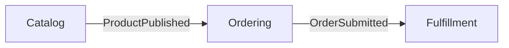

# Context Map 文档规范

`docs/ddd/CONTEXT-MAP.md` 是多限界上下文系统的全局业务边界和协作路由图。它不罗列数据库表，也不展开聚合内部字段。

## 标准模板

````md
# Context Map

## 系统业务范围

一到两段说明系统目标、包含和排除的业务范围。

## 限界上下文

| Context | 一句话职责 | 拥有的业务事实 | 明确不负责 | 文档 |
|:---|:---|:---|:---|:---|
| Ordering | 接收并管理订单 | 订单状态、成交快照 | 商品主数据 | [CONTEXT](./ordering/CONTEXT.md) |

## 上下文关系



| 上游 | 下游 | 关系模式 | 契约 | 一致性/失败语义 |
|:---|:---|:---|:---|:---|
| Catalog | Ordering | Published Language | ProductPublished v1 | 最终一致；重复事件幂等 |

## 跨上下文术语差异

| 词汇 | Context A 含义 | Context B 含义 | 转换方式 |
|:---|:---|:---|:---|
| Customer | 下单主体 | 账单抬头 | DTO 映射，不共享实体 |

## 全局 Workflow

- [订单履约](./workflow/0001-order-fulfillment/order-fulfillment.md)
````

## 编写规则

- Context 按业务语言、规则、事实所有权和变化原因划分，不按微服务、仓库或数据库机械划分；
- “拥有的业务事实”必须唯一，两个 Context 不得同时声称可以修改同一事实；
- 关系模式可使用 Partnership、Shared Kernel、Customer/Supplier、Conformist、ACL、Open Host Service、Published Language；不确定时直接描述实际协作，不强贴术语；
- 每条依赖写清方向、契约、同步/异步方式、一致性和失败语义；
- 同词异义必须分别定义，并说明边界转换。
