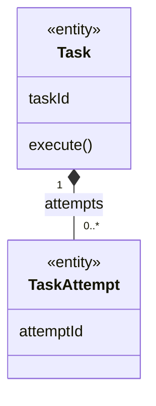
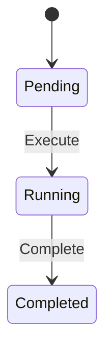

# Domain 文档规范

Domain 文档位于 `docs/ddd/<service-or-context>/domain/0001-<domain>/<domain>.md`，表达同一变化原因下的一组业务能力和规则。它不等同于服务、数据库表、代码包或单个聚合。

## 编写原则

- 先写业务职责、边界和能力，再写概念模型与持久化；
- 图表达结构，表表达规则和契约，文字解释易误解语义；
- 两个或以上核心对象、任意对象关系、自关联、关联实体或业务抽象出现时，必须按 [UML-CLASS-DIAGRAM-GUIDE.md](UML-CLASS-DIAGRAM-GUIDE.md) 绘制 UML 类图；
- 正式文档只保存已确认事实或明确采纳的目标设计；
- 规则使用稳定编号，并能追踪到命令、聚合、执行点和证据；
- 聚合是事务一致性边界，跨聚合只引用 ID；
- 聚合内部状态和不变量属于 Domain，跨边界编排属于 Workflow；
- 数据模型是实现映射，不得用表结构代替概念模型。

## 标准模板

````md
---
name: domain 名称
description: 一句话职责
context: 所属限界上下文
status: draft | accepted
dependencies:
  - domain1
related_workflows:
  - workflow1
---

## 一句话职责

一句话说明本 Domain 拥有和决定哪些业务事实。

## 边界

### 做什么
- 直接拥有的能力和事实。

### 不做什么
- 明确排除的职责，以及真正的所有者。

## 能力清单

| 能力 | 类型 | 执行者 | 输入/前置条件 | 领域操作 | 结果 | 规则 | 对外契约 |
|:---|:---|:---|:---|:---|:---|:---|:---|
| 创建任务 | Command | 用户 | 合法任务参数 | Task.Create | TaskCreated | R001 | `CreateTask` |

对外契约尚未定义时填写“待定义”，不得虚构代码符号。纯查询也要单独列出。

## 概念模型



类图使用统一语言命名，只保留关键属性和业务操作。每条关联必须能读出业务语义、两端角色和双端多重性；图后解释容易误读的关系。只有一个简单对象且没有关系时可以省略类图，但必须在模型元素表前说明原因。

### 模型元素

| 名称 | 类型 | 身份/相等性 | 生命周期 | 职责 |
|:---|:---|:---|:---|:---|
| Task | 实体/聚合根 | task_id | Created → Completed | 管理任务状态 |
| RetryPolicy | 值对象 | 全部属性值 | 随 Task 创建替换 | 定义重试约束 |

类型可以是实体、值对象、角色、类别、关联实体或领域服务。实体必须说明身份和生命周期；值对象必须说明值相等与不可变语义。

### 关联关系

| A 与角色 | 多重性 | B 与角色 | 多重性 | 业务语义/约束 |
|:---|:---|:---|:---|:---|
| Task（拥有者） | 1 | TaskAttempt（尝试） | 0..* | Attempt 不能脱离 Task 修改 |

每条关系必须写两端角色和最小/最大数量。多对多关系拥有属性、状态或历史时，建模为关联实体。

## 聚合与一致性边界

| 聚合根 | 内部实体/值对象 | 原子修改范围 | 核心不变量 | 外部引用方式 |
|:---|:---|:---|:---|:---|
| Task | TaskAttempt、RetryPolicy | 单次任务状态转换 | R001、R002 | 其他聚合只保存 task_id |

解释为什么这些对象必须在同一事务内，以及哪些对象明确位于聚合外。

## 业务规则

| ID | 场景/条件 | 规则 | 所有者 | 执行时机 | 违反结果 | 证据/来源 |
|:---|:---|:---|:---|:---|:---|:---|
| R001 | Task 已终止 | 终态不可重新执行 | Task | Execute 前 | `TaskAlreadyFinished` | 需求/代码路径 |

图中的 UML 约束必须在此重复为可执行规则。规则编号一旦被引用，不因排序变化而重排。

## 领域操作

### `Task.Execute`

- 前置条件：R001。
- 决策：说明关键业务判断，不描述 DTO、日志等技术步骤。
- 状态变化：Pending → Running。
- 结果事件：TaskStarted。
- 失败语义：列出业务错误。

## 状态机



| 当前状态 | 命令/条件 | 下一状态 | 规则/事件 | 重复、并发或晚到处理 |
|:---|:---|:---|:---|:---|
| Pending | Execute | Running | R001 / TaskStarted | 乐观锁失败后重新读取 |

没有持久化生命周期时写“无状态机”，不得编造状态。

## 领域事件

| 事件 | 产生条件 | 关键载荷 | 内部用途 | 外部发布/消费方 |
|:---|:---|:---|:---|:---|
| TaskCompleted | Task 进入 Completed | task_id、owner_id | 驱动后续规则 | 转换为集成事件后发布 |

Domain Event 是已发生的业务事实。没有事件时写“无”；不要创建占位事件，也不要默认将内部事件结构直接暴露给其他上下文。

## 查询与读模型

| 查询/读模型 | 使用者 | 字段/来源 | 过滤与权限 | 一致性要求 |
|:---|:---|:---|:---|:---|
| TaskDetail | 任务所有者 | Task + Attempts | owner_id 校验 | 强一致/最终一致及最大延迟 |

既要记录为命令决策服务的查询，也要记录不产生领域事件的独立查询。读模型不决定聚合边界。

## 数据模型与实现映射

仅在已有实现或目标设计需要落地时填写；概念建模阶段可以省略。每张表独立成节：

### `tasks`

| 字段 | 类型 | 业务含义 |
|:---|:---|:---|
| id | uuid | 任务身份 |
| status | varchar(32) | 当前生命周期状态 |

#### 约束与索引

- `PRIMARY KEY (id)`；
- 列出唯一约束、检查约束、索引、租户隔离和逻辑外键；
- 指出每个数据库约束落实的规则编号。

#### 代码映射

| 模型/能力 | 实现位置 | 说明 |
|:---|:---|:---|
| Task | `internal/.../task.go` | 聚合实现 |

## 错误语义

| 错误 | 触发条件 | 对调用方语义 | 可否重试 |
|:---|:---|:---|:---|

## 关联关系

### 依赖的 Domain
- [domain1](../0001-domain1/domain1.md) - 依赖的能力或事实。

### 被依赖的 Domain
- 无。

### 参与的 Workflow
- [workflow1](../../workflow/0001-workflow1/workflow1.md) - 参与角色。

### 关联术语
- `Task`
````

## 编号与变更

编号只在对应 `domain/` 目录内递增。废弃 Domain 在目录名后加 `-del`，并说明替代方案。

接口、概念关系、聚合边界、重要规则、状态、事件、错误语义或数据约束变化时更新 `change.md`；首次建模不为“创建文档”记录变更。假设、冲突和未决问题留在 Discovery 或响应中，不进入已接受的 Domain 文档。
