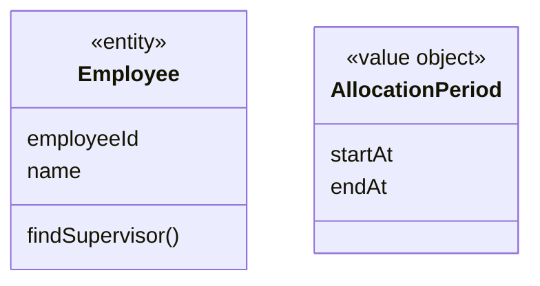
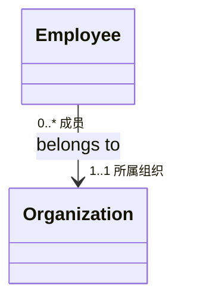
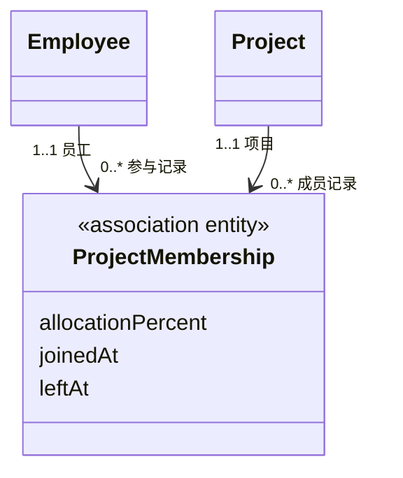
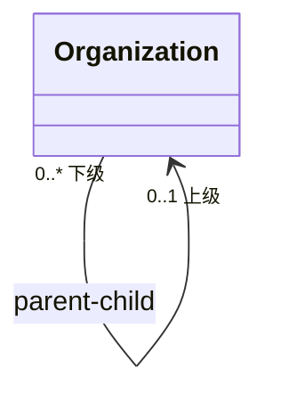

# 使用 UML 类图表达领域知识

建立或修改 Domain 的概念模型时读取本文件。UML 类图用于表达领域对象、关键属性、业务操作及对象关系；它不是数据库 ER 图或代码类结构截图。

## 何时必须绘制

满足任一条件时，Domain 文档必须包含 UML `classDiagram` 或等价的 PlantUML 类图：

- 存在两个或以上核心领域对象；
- 存在一对一、一对多、多对多或自关联；
- 同一对象在不同关联中承担不同角色；
- 使用关联实体或业务抽象才能解释模型。

只有一个简单对象且不存在关系时，可以用模型元素表代替类图，并说明省略原因。

## 类应表达什么

类使用三类信息：

1. 类名：词汇表中的标准领域名，使用单数；
2. 属性：理解身份、关系或业务规则所必需的关键属性；
3. 操作：对象承担的业务行为和判断。

不要把全部数据库列、ORM 标记、getter/setter、Repository、Controller、DTO、日志或网络方法画进领域类图。

可使用 stereotype 辅助说明对象类型：



允许使用 `entity`、`value object`、`role`、`category`、`association entity` 等业务建模分类。不要用技术分层标签替代领域含义。

## 关联必须表达什么

每条关联同时说明：

- 关联语义：为什么相关；
- 两端角色：各自以什么身份参与；
- 两端多重性：最少和最多对应多少对象。

常用多重性：

| 标记 | 含义 |
|:---|:---|
| `1..1` | 有且仅有一个 |
| `0..1` | 可以没有，最多一个 |
| `1..*` | 至少一个，可以多个 |
| `0..*` | 可以没有，也可以多个 |

对 A、B 使用四问法确认，而不是猜测：A 最多/最少对应几个 B，B 最多/最少对应几个 A。



## 特殊关系

### 多对多与关联实体

关系本身拥有属性、有效期、状态或历史时，不保留一根简单的多对多连线，将它提升为关联实体：



### 自关联

自关联必须标明两端角色：



### 多组关联

同一对类型有多种关系时分别画线并命名角色，例如 Employee 既是 Project 的项目经理，也通过 ProjectMembership 成为项目成员。

### 抽象与泛化

只有业务上存在稳定的 `is-a` 关系、子类型遵循共同业务语义时才使用泛化。仅字段相似不使用继承箭头。企业、开发中心等如果只是可维护类别，优先表达 `Organization -> OrganizationType` 关联，而不是虚构类继承体系。

## 约束和业务规则

UML `{约束}` 或 note 可以帮助读图，但不能成为规则的唯一保存位置：

```text
{员工同一时刻的预计投入比例总和不得超过 100%}
```

每条约束必须在 Domain 的业务规则表中拥有稳定编号、所有者、执行时机和违反结果。图中可标注规则编号，例如 `{R003}`，详细正文只维护一份。

## 模块和图的拆分

类图出现大量交叉线时：

1. 先用包图展示模块和模块依赖；
2. 每个模块或一个紧密业务主题绘制一张类图；
3. 跨模块对象只保留理解关系所需的最少信息；
4. 不为了得到一张“全景图”牺牲可读性。

## 图后必须有解释

类图之后用简短文字说明：

- 最重要的对象及其职责；
- 容易误读的角色和多重性；
- 为什么使用关联实体或抽象；
- 哪些约束转入业务规则表。

图不能替代词汇表和规则表，三者必须使用相同名称。

## 验证

使用头脑风暴中的命令逐条走查：命令作用的对象是否存在，对象是否拥有对应业务操作，所需关系和约束是否可见。最后检查：

- 类名与统一语言一致；
- 属性只保留关键业务信息；
- 操作使用业务动词；
- 关联有语义、角色和双端多重性；
- 多对多属性没有错误地挂在某一端；
- 自关联和重复关联没有歧义；
- 图中约束能映射到规则表；
- 类图没有退化为数据库或技术分层图。
