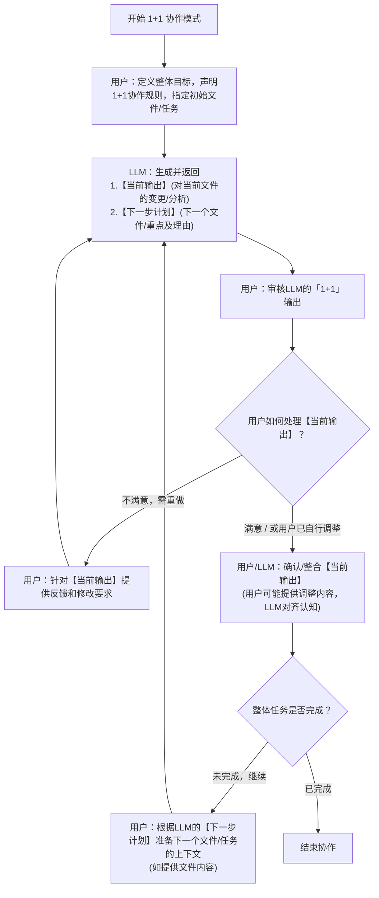
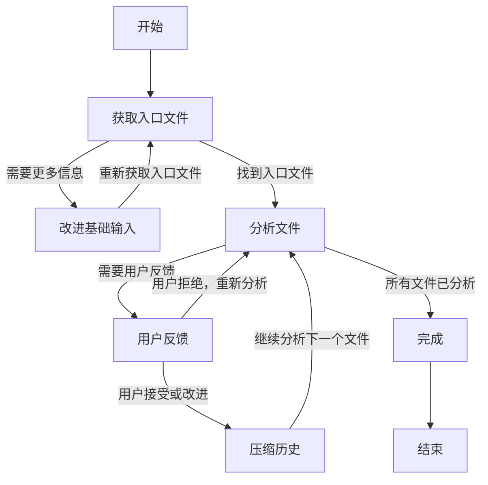
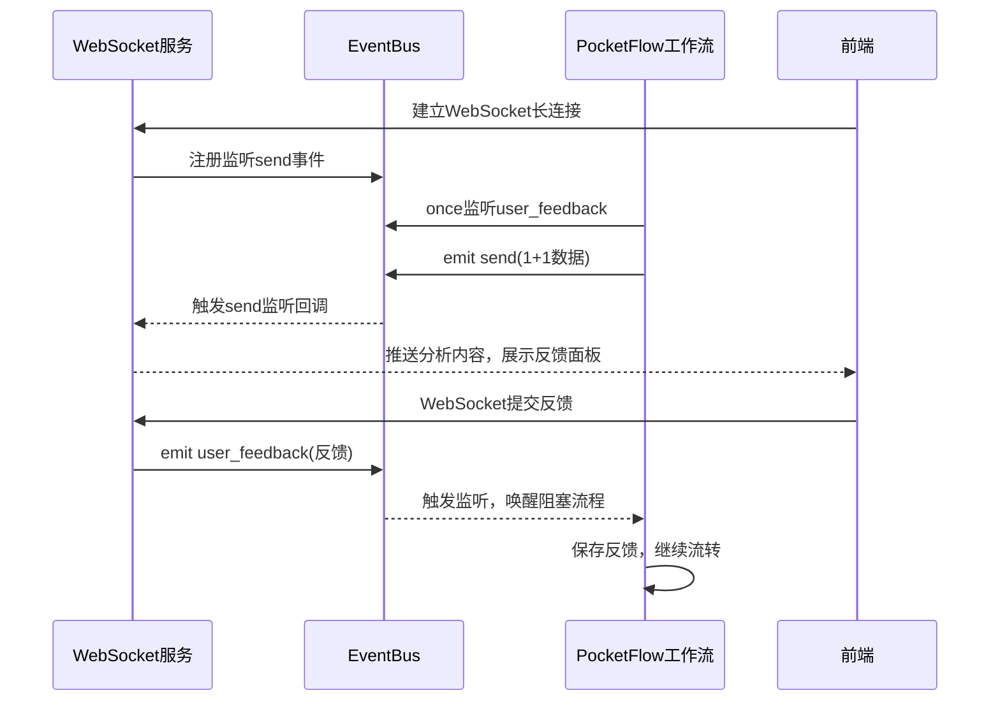
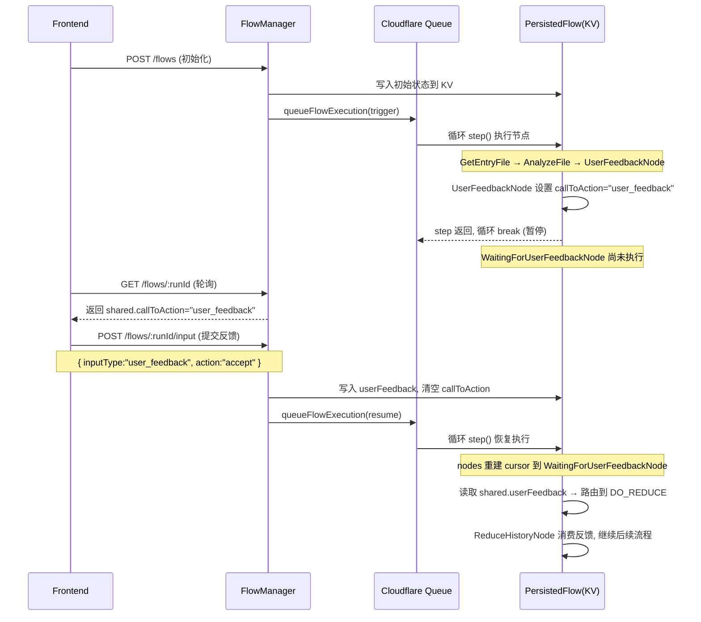

这一个章节我们重点介绍 Agent 设计中 Agent 和 用户交互的部分。为什么要这么关注交互的部分，主要原因有两个:

1. 当下 Agent 最好的形态就是人机交互，Agent 可以链接人、以及传统的应用，并可以让人参与到 Agent 决策并且影响 Agent 的决策过程。
2. Copilot 会影响 Agent 的设计

接下来我们会介绍几个不同的框架实现的 Agent Copilot，目的有两个:

1. 理解 Copilot 这种设计模式
2. 掌握 Copilot 里的最佳实践: 如何实现 Agent 与前端的通信机制，来传递用户反馈

<!-- more -->

## 1. 代码阅读工具

第一个项目上是使用 Pocket Flow 实现的类似 DeepWiki 的代码阅读工具: [koala-code-reader](https://github.com/Yuyz0112/koala-code-reader)

### 1.1 背景

1. 需求: 解决DeepWiki类工具一次性全量生成、用户无法中途干预、结果不可控的痛点。
2. 目标: 1+1 Copilot是**人主导、AI辅助**的长任务人机协作范式
   - AI 每次返回两个1：①**当前输出**（本轮；②**；②**下一步计划\*\*（AI后续任务方案）
   - 用户提供三类反馈：同意、拒绝、人工微调
   - AI 根据用户反馈再次运行
3. 优势:
   1. **精准可控**：单次只处理一个单元，避免AI一次性大面积跑偏，微调可省去重复LLM调用，节省Token成本；
   2. **思路对齐**：AI学习用户每轮反馈（同意/微调差异/拒绝理由），持续贴合用户习惯；
   3. **主动预判**：提前给出下一步计划，用户可提前修正AI后续工作方向。
4. 适用场景：
   - 适合**长周期复杂任务**（代码阅读、代码编写、长篇文档创作），且用户具备专业能力可审核AI输出；简单问答、无专业用户场景不适用。
5. 开发框架: Pocket Flow

### 1.2 核心流程



1. 用户输入代码库、阅读目标、限定范围；AI校验信息不足则反问补全，确定入口文件。
2. 循环单元（1+1核心）：AI分析文件输出「当前结果+下一步计划」→ 用户三种反馈分支：
   - 拒绝：带回重做分析；
   - 同意/微调：归档本轮结果、全局汇总压缩文档，读取用户反馈让AI对齐思路，执行上一轮的下一步计划进入下一轮循环。
3. AI判定全部文件分析完毕，输出完整汇总文档，任务结束。

### 1.3 Workflow

理解了核心流程之后，需要设计对应的 Workflow。



### 1.4 SharedStorage

SharedStorage 通常是跟节点的输出直接相关，在 Copilot 通常会包含:

1. 用户输入部分
2. 用户反馈
3. 需要持续收集的内容
4. 需要持续压缩的内容
5. 1+1 Copilot 的核心数据

### 1.4 核心通信 - Workflow 阻塞等待

通信的第一种方式是 Workflow 阻塞等待:

1. 后端接口和 websocket 链接通过 eventBus 交换数据
2. Workflow 一直阻塞直到收到用户反馈

这个机制的核心是:

1. Workflow 控制 LLM决策 -> 用户反馈 -> LLM决策的循环
2. Workflow 阻塞等待用户反馈



```js
async function getUserFeedback(onePlusOneResult) {
  return new Promise((resolve) => {
    // 2. 一直阻塞直至，前端回传的用户反馈，resolve 这个 Promise
    //    await getUserFeedback() 节点，就能拿到 feedbackData，然后继续执行
    eventBus.once("user_feedback", (feedbackData) => {
      resolve(feedbackData); // 解除工作流阻塞
    });
    // 1. 把1+1数据推给前端
    eventBus.emit("send", {
      type: "user_feedback",
      value: onePlusOneResult,
    });
  });
}
```

### 1.5 核心通信 - 多轮

通信的第二种方式是 多轮 + 状态恢复。

这个机制的核心是:

1. Workflow 把 `LLM决策 -> 用户反馈 -> LLM决策的循环` 拆分成两段独立的轮次，由前端驱动整个 workflow 的执行
2. Workflow 会在需要用户反馈的地方 break(等同于结束当前的轮次)，保存状态
3. 下一次轮次由前端带着用户反馈重新发起，Workflow 恢复状态，继续执行


