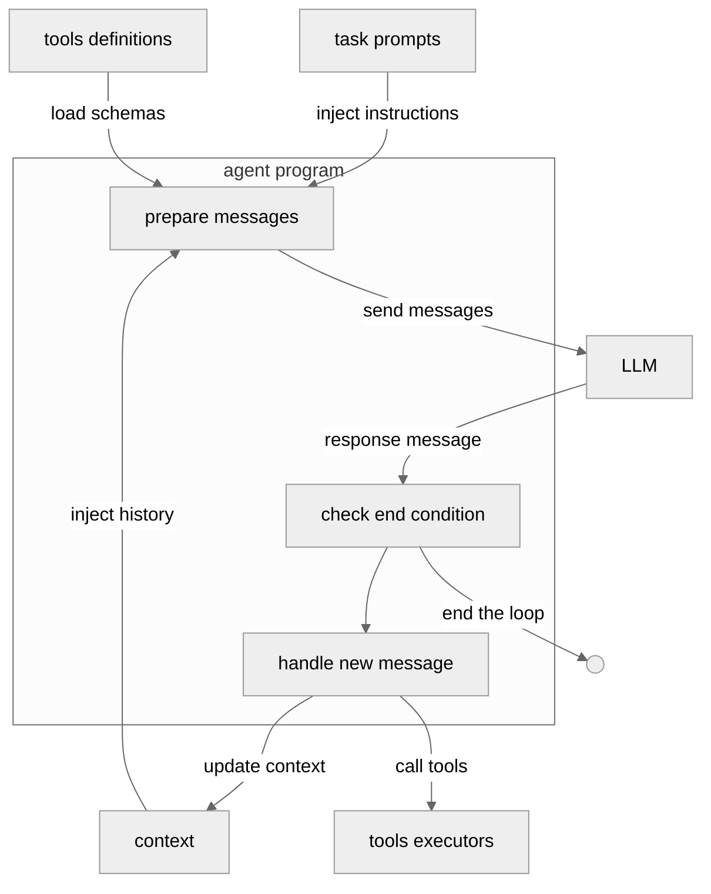

今天我们来介绍 Multi-Agent 相关概念，目的有如下几个:

1. 理解 Single-Agent 的核心架构、核心组成以及每个部分可能遇到的问题
2. Multi-Agent 能否解决 Single-Agent 所遇到的问题以及是否会带来新的问题。

分析的目的不仅仅是了解这些概念本身。而是梳理构建 Agent 所需要关心的各个层面。
在我们梳理清楚 Agent 的架构之后，我们就可以快速的、公式化的分析很多开源 Agent 产品。也能更好的指导我们实现自己的 Agent。

<!-- more -->

## 1. Single-Agent

### 1.1 Single-Agent 核心架构

从下面的架构图可以看出，一个 Single-Agent 由如下部分组成：

1. task prompts
2. tools definitions
3. context
4. LLM 模型
5. AgentLoop:
   - tools executors
   - Loop 的终止条件

### 1.2 Single-Agent 瓶颈

#### 1. 模型能力单一瓶颈

单个Agent全程固定调用同一套模型，若任务同时需要多模态、绘图、高强度工具调用等多种差异化能力，单一模型无法全部覆盖，直接限制任务完成度。

#### 2. 任务提示词（Prompt）膨胀瓶颈

业务流程越复杂，Agent全局指令Prompt需要写越多规则、分支、工具说明；模型指令跟随能力有限，超长复杂提示容易出现理解偏差、执行走样。

#### 3. 工具集过载瓶颈

若场景需要大量工具，全部一次性传入LLM会造成决策混乱、工具选择随机性高；大量重叠/低质量工具会大幅降低模型判断准确率。

对于 Agent 来说，保持工具的准确性、简洁性和互相的功能不重叠，对于提升性能是非常有帮助的。

#### 4. 上下文（Context）溢出瓶颈

多轮工具调用、文件读取、对话记录持续累积，消息总token不断上涨，极易触碰模型上下文长度硬上限；
即便采用上下文压缩方案，压缩过程会丢失关键细节，导致模型“失忆”，大幅降低后续任务可靠性。

## 2. Multi-Agent

以上四类问题里，前三者（模型、提示词、工具）可以通过Multi-Agent拆分缓解；Multi-Agent 可以通过拆分上下文解决溢出问题，但是拆分上下文会带来信息割裂问题，副作用远大于收益。

目前来看，Multi-Agent 主要存在以下几个问题：

1. **上下文割裂、信息同步困难（核心致命问题）**
   多智能体各自拥有独立上下文，智能体之间难以完整共享全部历史信息；若没有统一全局上下文管理，各Agent掌握的信息不完整、不一致，会大幅降低任务可靠性，该问题的负面影响远超多智能体带来的优势。

2. **Token消耗大幅上升，使用成本显著增加**
   相比Single-Agent，Multi-Agent整体Token开销提升3～15倍，算力、模型调用成本成倍上涨；使用前必须评估业务经济可行性，否则投入产出比极低。

3. **架构复杂度陡增，开发与维护成本变高**
   需要额外设计智能体分工、通信机制、任务流转、消息同步逻辑；市面上多数Multi-Agent框架只宣传优势，不说明上下文同步等难点解决方案，开发者需要自行处理大量工程适配工作，调试、切换框架的成本高。

4. **缺少成熟通用的上下文管理方案**
   目前没有标准化、效果稳定的全局上下文服务来统一多智能体会话；自研上下文压缩、滑动窗口等优化手段存在信息丢失问题，极易出现模型“失忆”，破坏任务连续性。

## 3. 混合架构

1. **拆分**
   - 模型拆分：不同Agent搭配具备对应特长的专用模型，解决单一模型能力不足问题；
   - 提示词拆分：总复杂任务拆解为独立子任务，每个Agent只配精简、单一的任务Prompt，解决提示词膨胀；
   - 工具拆分：按子任务隔离工具集，每个Agent仅加载少量所需工具，解决工具过载。
2. **不拆分上下文**，所有智能体共用同一份全局上下文

即便采用混合架构，长期运行仍会出现上下文溢出，可搭配两类优化手段：

1. 上下文压缩：定期调用LLM精简历史对话，提取关键决策信息，减少token占用；
2. 无损过滤：剔除推理过程、空内容、截断无效消息，合并连续工具调用，节省上下文空间。
