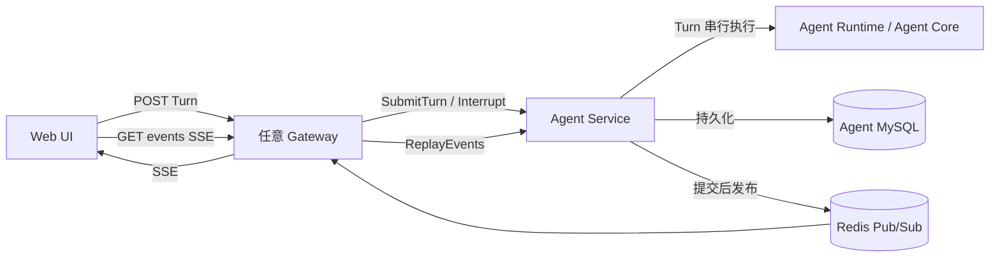
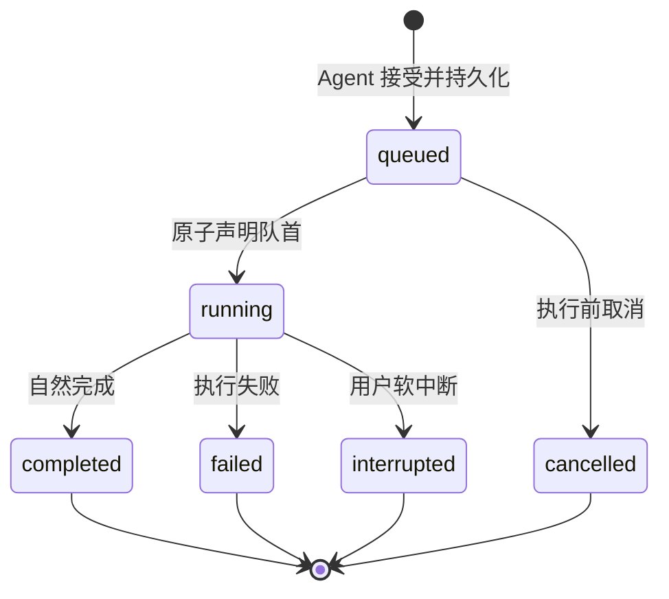
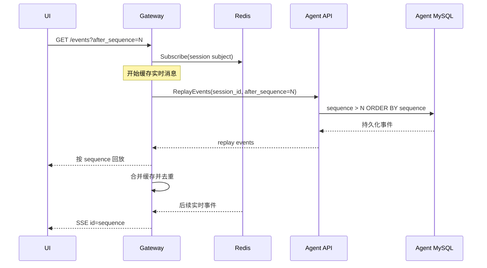
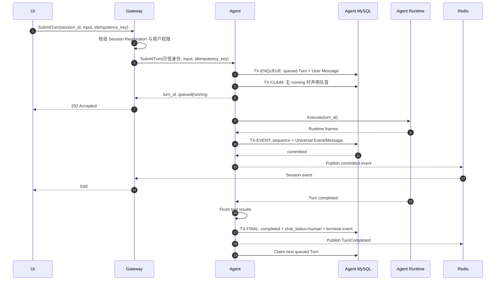

上一篇介绍了 Agent Platform 的整体分层。这一篇继续解决 Chat 链路中最容易被低估的两个问题：同一个 Session 如何避免并发执行多个 Turn，以及 Gateway 多实例时如何让页面稳定收到完整事件。

<!-- more -->

## 1. 问题从哪里产生

最直观的实现通常是：Gateway 接收用户消息，调用 Agent 的 Chat SSE，在收到事件后保存数据库，再通过自己的 SSE 连接转发给 UI。

单实例时它看起来没有问题，扩展到多个 Gateway 后却会出现节点错位：

```text
POST /chat   -> Gateway A -> Agent
GET /events -> Gateway B -> UI
```

Agent 的事件连接在 Gateway A，用户的页面订阅却在 Gateway B。如果广播器只是 Gateway 进程内的 Map 或 Channel，Gateway B 无法看到 A 收到的事件。

另一个问题是并发提交：Gateway A 和 Gateway B 可能同时向同一个 Session 提交 Turn。大多数 Agent Core 都把 Session transcript、模型上下文和工具状态当作单写者状态，并不支持同一 Session 的两个 Turn 并行修改。

因此，SSE 只是表现层协议，真正要解决的是下面三个所有权问题：

1. 谁决定同一个 Session 的 Turn 执行顺序；
2. 谁为持久化事件分配唯一 sequence；
3. 谁保存可供页面断线恢复的权威事实。

## 2. 最终架构

最终选择让 Agent 成为 Session 执行和交互事实的唯一所有者，Gateway 退化为鉴权、命令转发、查询转发和 SSE 协议适配层。



各组件职责如下：

| 组件 | 拥有什么 | 不拥有什么 |
|:---|:---|:---|
| Gateway | Session Registration、用户鉴权、Session Token、API/SSE framing | Turn、Message、Universal Event、执行锁 |
| Agent | Runtime Session、Turn Queue、Message、Universal Event、sequence、Chat Status | Web Cookie、页面连接、Workspace 期望配置 |
| MySQL | 已接受 Turn 和可恢复交互事实 | 实时连接 |
| Redis | 低延迟事件通知 | 最终事实、业务 sequence |
| UI | 当前页面状态和最后处理的 sequence | Turn 执行所有权 |

这个边界带来一个重要结果：无论请求落到哪个 Gateway，最终都由 Agent 对同一个 Runtime Session 做串行化；无论页面订阅落到哪个 Gateway，都可以从 Redis 收到实时通知，并从 Agent MySQL 恢复历史。

## 3. Session 在两个上下文中的模型

Gateway 和 Agent 使用相同的 `session_id`，但维护不同的领域模型，禁止共享数据库表。

### 3.1 Gateway：Agent Session Registration

Gateway 只保存：

- `session_id`；
- `user_id`、`workspace_id`、`agent_id`；
- Session Token Hash；
- `context_version`；
- title、starred 等 UI 元数据；
- starting、active、failed、deleted 等注册生命周期。

Registration active 只表示这个 Session 已完成注册并允许访问，不表示当前没有 Turn 在运行。

### 3.2 Agent：Runtime Session

Agent 使用相同的 `session_id` 创建 Runtime Session，并保存：

- Turn FIFO 队列；
- 当前 `active_turn_id`；
- `chat_status = human | agent`；
- 下一个 Turn enqueue sequence；
- 下一个 Universal Event sequence；
- Message、Agent Request 和执行恢复信息。

两个上下文只通过稳定 ID、版本和服务接口协作。Gateway 不直连 Agent MySQL，也不在自己的数据库中继续维护 `active_turn_id`、`pending_message` 或 Chat Status 的权威值。

## 4. Pending Message 改为持久化 Turn Queue

单个 `pending_message` 字段只能保存一条 follow-up，连续提交时还需要额外定义覆盖或合并语义。更自然的模型是：每一次被接受的输入从一开始就是 Turn。

```text
Session A: Turn 101 running
           Turn 102 queued
           Turn 103 queued

Session B: Turn 201 running
```

不同 Session 可以并行，同一个 Session 必须串行。

Turn 最少包含：

| 字段 | 含义 |
|:---|:---|
| `id` | Agent 分配的 Turn ID |
| `session_id` | 所属 Runtime Session |
| `idempotency_key` | 调用方稳定幂等键 |
| `enqueue_sequence` | Session 内 FIFO 次序 |
| `status` | queued/running/completed/failed/interrupted/cancelled |
| `input` | 已接受的用户输入 |
| `context_version` | 本 Turn 固定使用的运行上下文版本 |

数据库必须提供三条最终约束：

```text
UNIQUE(session_id, idempotency_key)
UNIQUE(session_id, enqueue_sequence)
UNIQUE(session_id) WHERE status = 'running'
```

Agent 可以给每个活跃 Session 配置进程内 `asyncio.Lock`，减少同进程竞争，但内存锁只是一种优化。真正保证跨线程、跨 Agent 实例和重试正确性的仍然是数据库 Session 行锁与 running 唯一约束。

### 4.1 Turn 状态机



只有最小 `enqueue_sequence` 的可执行 Turn 可以进入 running。当前 Turn 自然 completed 后，Agent 自动声明下一条 queued Turn。failed 或 interrupted 后默认暂停自动排空，等待用户显式 resume/cancel，避免上一轮工具副作用结果不明确时继续级联执行。

## 5. Message 与 Universal Event 为什么同时存在

Message 和 Universal Event 不是两份可以独立修改的事实。

- Universal Event 是执行过程已经提交的权威事件，用于恢复、订阅和去重；
- Message 是面向会话历史、搜索和 UI 展示的稳定查询模型。

例如一次助手回复可以产生完整 Message，同时关联 text completed、tool call、tool result snapshot 等 Universal Event。Message 只能由用户 Turn 输入或已提交的完成事件生成，禁止 Gateway 和 Agent 各自写一份，否则会产生双事实源。

## 6. Universal Event 的 sequence

每个 Runtime Session 独立维护严格递增的事件 sequence：

```text
session-A: 1, 2, 3, 4, ...
session-B: 1, 2, 3, ...
```

sequence 在 Agent MySQL 写事件的事务中原子分配，并通过唯一约束保证：

```text
UNIQUE(session_id, sequence)
```

Redis message id、Kafka offset、Gateway 内存下标都不能替代业务 sequence。消息中间件的位置表达的是传输顺序，而 Session sequence 表达的是 UI 已经安全处理到哪个持久化事实。

实时 delta 不持久化，也不占 sequence。它通过 `sequence = 0` 或不设置 SSE id 表示临时帧，页面可以即时渲染，但不能推进恢复 cursor。

## 7. 不同事件的持久化策略

逐 token 写数据库会制造大量无意义写放大，因此根据事件 kind 使用不同策略：

| Runtime 输出 | 实时发布 | MySQL | Message |
|:---|:---|:---|:---|
| `item.started` | 临时帧 | 不写 | 不写 |
| `item.delta` | 临时帧 | 不写 | 不写 |
| text `item.completed` | 提交后发布 | 完整事件 | 写完整 assistant Message |
| tool call completed | 提交后发布 | 幂等追加一次 | 通常不写独立 Message |
| tool result | 聚合后发布 | 首次立即，之后 300ms 最新快照 | 不写独立 Message |
| Turn/Session 生命周期 | 提交后发布 | 追加 | 不写 |

Turn 进入任一终态前必须强制 flush 所有 pending tool result，保证最终工具快照的 sequence 小于 Turn 终态 sequence。

tool result 是最容易失控的载荷。它在 Agent 持久化边界按照 Runtime capability 做一次 UTF-8 安全截断，保存 `truncated`、`original_bytes` 和 `stored_bytes`，数据库、Redis 和历史读取复用同一份规范化 payload，禁止多处重复截断。

## 8. 页面刷新为什么不会丢事件

Gateway 的 `/events` 固定采用“先订阅，再回放”顺序：



假设页面最后收到 sequence 10：

1. Gateway 先订阅 Redis，并开始缓存；
2. Agent 在订阅后产生 sequence 11，Gateway 会从 Redis 收到；
3. Gateway 同时查询 MySQL，sequence 11 也可能出现在回放结果中；
4. Gateway 先发回放，再处理缓存；发现 11 已发送，就丢弃重复项。

所以事件可能重复到达，但不会因为“查完数据库、还没订阅”而丢失。客户端和 Gateway 都使用 `session_id + sequence` 去重。

## 9. MySQL 成功、Redis 发布失败怎么办

事件写入顺序固定为：

```text
1. INSERT Universal Event
2. COMMIT MySQL
3. PUBLISH Redis
```

Redis 不是事实源，因此无需让 MySQL 和 Redis 组成分布式事务。如果 Agent 在第 2 步后、第 3 步前崩溃，事件仍然存在，只是当前连接暂时没有收到通知。

Gateway 使用三种轻量补查机制：

1. 收到的 sequence 大于 `cursor + 1` 时立即回放缺口；
2. SSE 存活期间周期性调用 `ReplayEvents(after_sequence=cursor)`；
3. 收到 Turn 终态时再执行一次补查。

页面重连时也会从最后 cursor 回放，所以已提交事件不会永久丢失。如果未来要求 Redis 发布故障期间也必须立即通知，再增加 Outbox；当前阶段不需要提前引入这份复杂度。

## 10. 为什么先用 Redis Pub/Sub

这里的消息中间件只承担实时通知，长期回放已经由 Agent MySQL 提供，因此 Redis Pub/Sub 足够简单：

```text
agent.events.{session_id}
```

持有某个 Session SSE 连接的 Gateway 只订阅对应 subject/channel。所有相关 Gateway 都能收到事件，不依赖 Chat 请求落在哪个节点。

Kafka 也能实现，但不能让所有 Gateway 使用同一个 Consumer Group。组内一条消息只交给一个实例，可能再次出现“事件在 Gateway A，页面在 Gateway B”。若使用 Kafka，需要每个 Gateway 使用独立 Consumer Group，或者重新引入 Partition 与 Gateway 的路由所有权，复杂度更高。

如果未来需要消息通道自身支持短期回放，可以把 Redis Pub/Sub 替换为 Redis Streams 或 NATS JetStream。无论换成什么中间件，都必须保持两个契约：

1. Agent MySQL 和 Session sequence 仍是事实与业务游标；
2. 同一 Session 的相关 Gateway 必须都能收到通知，不能误用竞争消费语义。

## 11. 完整 Turn 执行流程



Gateway 返回 202 的条件不是消息进入 Gateway 内存，而是 Agent 已经把 Queued Turn 提交到 MySQL。请求超时且结果不明确时，Gateway 使用相同 `idempotency_key` 查询或重试，Agent 返回既有 `turn_id`，不能创建第二个 Turn。

## 12. 故障语义

| 故障 | 结果与恢复 |
|:---|:---|
| UI 或 Gateway SSE 断开 | Turn 继续；UI 使用最后 sequence 重连 |
| 任意 Gateway 重启 | 重新订阅 Redis，再从 Agent 回放 |
| Redis 暂时不可用 | Agent 继续执行和落库；Gateway 降级周期回放 |
| Redis 重复通知 | Gateway/UI 按 sequence 去重 |
| Redis 漏通知 | 跳号、周期或终态补查恢复 |
| 两个 Gateway 同时提交 | Agent 幂等入队，同 Session FIFO 串行 |
| Agent Runtime 启动结果不明确 | 先按 turn_id 查询；不能证明安全时 failed，禁止重复不可逆工具副作用 |
| 用户中断 | 只中断当前 running Turn；不回滚工具副作用，不隐式删除 queued Turn |
| 慢 SSE 消费者 | 关闭该订阅；其他订阅和 Turn 不受影响 |

## 13. 核心不变量

整个设计最终可以收敛为七条不变量：

1. Agent 是 Turn、Message、Universal Event 和 Chat Status 的唯一事实所有者；
2. 同一 Runtime Session 最多一个 running Turn，不同 Session 可以并行；
3. 每次接受的输入先持久化为 Queued Turn，再参与调度；
4. Universal Event 先提交 MySQL，再发布消息通知；
5. 只有持久化事件拥有 Session sequence，临时帧不能推进 cursor；
6. Gateway 先订阅、再回放，并按 sequence 合并去重；
7. Gateway 节点、浏览器连接和消息中间件 offset 都不决定 Turn 生命周期。

这套设计没有追求消息的 exactly-once 投递，而是通过“事实只写一次、通知允许重复或缺失、读取按 sequence 收敛”获得更简单的最终一致性。对于 Agent Chat 这类长连接、可重连、多 Gateway 的系统，这通常比在 Gateway 内维护复杂的分布式执行状态更容易实现和验证。
