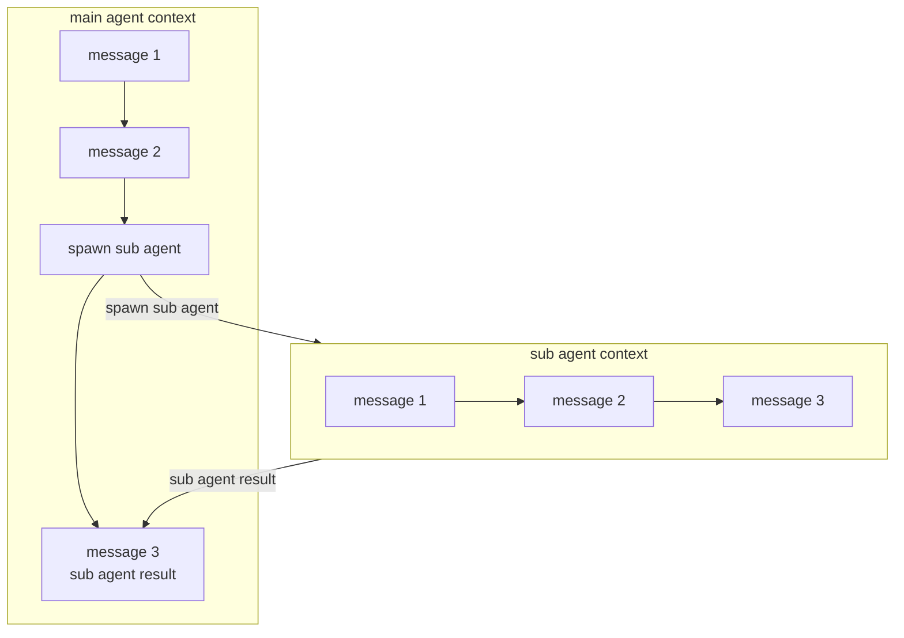

上一节我们介绍了 Claude Code 里的核心对话流程的 Prompt，这一节我们来学习 Claude Code 里 SubAgent 的使用。

<!-- more -->

## 1. SubAgent

SubAgent 如何使用的提示词是在 system workflow 提示词内的内的。这里我把他单独摘到这:

#### Tool usage policy / 工具使用策略

<table>
<tr>
<th width="50%">English</th>
<th width="50%">中文</th>
</tr>

<tr>
<td>

- When doing file search, prefer to use the Task tool in order to reduce context usage.
- You should proactively use the Task tool with specialized agents when the task at hand matches the agent's description.
- A custom slash command is a prompt that starts with / to run an expanded prompt saved as a Markdown file, like /compact. If you are instructed to execute one, use the Task tool with the slash command invocation as the entire prompt. Slash commands can take arguments; defer to user instructions.
- When WebFetch returns a message about a redirect to a different host, you should immediately make a new WebFetch request with the redirect URL provided in the response.
- You have the capability to call multiple tools in a single response. When multiple independent pieces of information are requested, batch your tool calls together for optimal performance. When making multiple bash tool calls, you MUST send a single message with multiple tools calls to run the calls in parallel. For example, if you need to run "git status" and "git diff", send a single message with two tool calls to run the calls in parallel.

</td>
<td>

- 进行文件搜索时，优先使用 Task 工具以减少上下文消耗。
- 当当前任务与某个专门 agent 的描述匹配时，你应主动使用带有专门 agent 的 Task 工具。
- 自定义斜杠命令是以 / 开头的提示，用于运行保存为 Markdown 文件的扩展提示，如 /compact。如果你被指示执行一个斜杠命令，请使用 Task 工具，将斜杠命令调用作为整个提示。斜杠命令可以接受参数；遵循用户指令。
- 当 WebFetch 返回关于重定向到不同主机的消息时，你应该立即使用响应中提供的重定向 URL 发起新的 WebFetch 请求。
- 你有能力在单个回答中调用多个工具。当请求多个独立的信息时，将工具调用批量一起执行以获得最佳性能。当进行多个 bash 工具调用时，你必须发送一条包含多个工具调用的消息来并行运行这些调用。例如，如果你需要运行"git status"和"git diff"，请发送一条包含两个工具调用的消息来并行运行。

</td>
</tr>

<tr>
<td>

You MUST answer concisely with fewer than 4 lines of text (not including tool use or code generation), unless user asks for detail.

</td>
<td>

你必须以不超过 4 行文字（不包括工具使用或代码生成）的简洁方式回答，除非用户要求详细说明。

</td>
</tr>

</table>

---

从提示词可以看到 Claude Code 使用 subagent 的首要场景是文件搜索，核心诉求是隔离 Context，避免 搜索过程导致的上下文污染。

