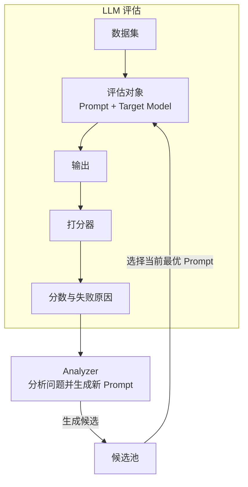

## 1. 为什么当下需要 LLM 评估
模型的能力，已经在超出很多任务的需求，这意味着不一定更好的模型就是最适用的。

我们开始需要从其他方面开始考虑如何筛选模型，包括:
1. 降低成本: 模型的调用成本有没有下降
2. 提升速度: 模型的响应时间有没有提升
3. 防止回退: 模型的响应质量有没有下降

## 2. LLM  优化途径

LLM 的优化有多种途径:
1. 切换模型: 不一定是无条件的向上切换，开始出现更多的场景向下切换。
2. 修改提示词: 能不能用更少的提示词完成任务。成本考量的基础应该转向 task price 上。因为有可能 A 模型比 B 模型便宜，但是 A 模型需要更多的提示词才能完成任务，最终 B 模型更划算。
3. 更换 Agent: 从 Claude Code 切换到 goose 或者 Deepseek 以满足合规需求。

每一种优化方式，都需要工程化的 LLM 评估，来判断优化效果。

## 3. LLM 评估流程


### 3.1 基础概念 
1. **数据集**：最重要的元素。在网关和 Agent 平台采集真实数据势在必行
2. 评估对象：例如 LLM API、Agent 或其他形态的 LLM 应用。需要关注评估对象的可控性，特别是对于 Agent 的评估。如果每次评估，Agent 与外部交互获取的结果都在变化，评估的结果就会变得不可控。
3. 输出: 数据集进入到评估对象产出的结果
4. **打分器**：工程挑战性最大的环节
5. 打分结果: 打分器输出的结果，基于结果进行评估对象的优化

#### 数据集
**CMMLU**: 
- 选择题数据集，输入是开放的，输出的收敛成具体的有限类比。
- 这种数据集对应的 output 天然就是结构化的，打分器的设计也比较简单。

**BFCL**: 
- 工具调用的数据集
- output 是模型输出的工具调用的参数，其格式是结构化的。但是参数可能有动态参数。比如调用的 write 工具，但是 写入的 content 是动态化的内容。
- 打分器的设计就开始需要一些技巧了，打分的结果需要是**多个维度**的以详细区分不同的模型的完成程度，提供更好的**区分度**。

**BFCL-multiturn**:
- Agent 式多轮工具调用数据集，跟单次工具调用数据集的区别是，工具调用是需要返回结果的，否则上下文是不完整的，所以这里需要保证工具调用结果的**可控性**

这三种数据集和打分器的设计思路都是把**开发式的问题转换成收敛式的答案**。

**Alpaca**
- 动态开放式数据集，问题和答案都是开放式的
- 使用 LLM 评估，用更强的模型去评估弱模型
- 评估的技巧是模型输出的问题，和数据集里的文本谁更好。因为评估好不好是一个不好量化的指标，模型更擅长回答的是这一次跟之前的基线相比是提升了，还是下降了，提升和下降的比例是多少。这是一个更好量化的指标。

| 数据集 | 数据集路径 (URL) | 结果评估代码 (URL) |
|---|---|---|
| **CMMLU**（中文多任务语言理解） | GitHub 仓库（含 data/ 数据）: https://github.com/haonan-li/CMMLU <br> HuggingFace 数据集: https://huggingface.co/datasets/haonan-li/cmmlu | 同一仓库，评估脚本在 `script/evaluate.py`、`src/mp_utils/`: https://github.com/haonan-li/CMMLU |
| **BFCL**（Berkeley Function Calling Leaderboard，单轮函数调用） | HuggingFace 数据集: https://huggingface.co/datasets/gorilla-llm/Berkeley-Function-Calling-Leaderboard <br> 介绍博客: https://gorilla.cs.berkeley.edu/blogs/8_berkeley_function_calling_leaderboard.html | GitHub（gorilla 仓库 `berkeley-function-call-leaderboard/` 目录，含 `openfunctions_evaluation.py`）: https://github.com/ShishirPatil/gorilla/tree/main/berkeley-function-call-leaderboard |
| **BFCL-multiturn**（即 BFCL V3，多轮/多步函数调用） | 同一 HuggingFace 数据集（含 multi-turn 类别）: https://huggingface.co/datasets/gorilla-llm/Berkeley-Function-Calling-Leaderboard <br> V3 介绍博客: https://gorilla.cs.berkeley.edu/blogs/13_bfcl_v3_multi_turn.html | 同一 GitHub 仓库（与 BFCL 共用评估代码，支持 multi-turn 评测）: https://github.com/ShishirPatil/gorilla/tree/main/berkeley-function-call-leaderboard |
| **AlpacaEval**（指令遵循自动评测） | HuggingFace 数据集: https://huggingface.co/datasets/tatsu-lab/alpaca_eval <br> 官网: https://tatsu-lab.github.io/alpaca_eval/ | GitHub（核心代码在 `src/alpaca_eval/`，通过 `alpaca_eval` CLI 运行）: https://github.com/tatsu-lab/alpaca_eval |


#### 真实系统评估
真实系统的评估，会从两个方向深入:
1. 如何把一个真实的复杂任务拆分成多个方法，让他们分别评估
2. 如何把评估变成一种循环，每一次评估的结果作为下一次评估的基线。或者有多个候选方向的时候，如何让他们并行的跑，逐渐找出正确的改进方向。

## 4. 从 LLM 评估到 APO

LLM 评估解决的是「怎么知道这次改动是变好了，还是变差了」。它的基本过程是：准备一批数据，让评估对象运行，然后用打分器检查输出。到这里，我们只能知道得分是多少、哪些用例失败了，但还没有回答「接下来怎么改」。

要让系统自己改进，还需要 Analyzer 根据评估结果分析问题、生成新 Prompt，再通过候选池保存和比较不同版本。

因此，**APO 可以简单理解为「LLM 评估 + Analyzer + 候选池」**。候选池中的 Prompt 被重新评估，保留当前最优版本，一次评估也就变成了可以反复运行的优化循环。

本节通过一个轻量级的 Prompt 自动优化器，为后续学习 DSPY 里两个重要的提示词自动优化工具 MIPROv2 和 GEPA 打下基础。

### 4.1 优化目标与边界

优化对象包括：

- `system prompt`；
- `tool description`。

测试用例中的对话消息保持不变。通过固定输入，只比较不同 Prompt 对模型输出的影响。

### 4.2 优化流程



整体流程如下：

1. 将测试用例输入 Target Model，得到实际输出；
2. 打分器比较实际输出与预期输出，生成分数和失败原因；
3. Analyzer 结合 Meta-Prompt 分析失分原因；
4. Analyzer 生成新的 System Prompt 和 Tool Description 候选，放入候选池；
5. 使用新候选重新运行测试；
6. 比较候选版本的得分，保留当前最优版本；
7. 重复以上过程，直到达到目标分数或迭代次数上限。

模型分工：

1. **Target Model（目标模型）**：GPT OSS 20B，负责执行 Agent 任务和调用 Memory Tool；
2. **Teacher LLM（教师模型）**：智谱 GLM-4.6，负责自然语言评分、Analyzer 分析和候选 Prompt 生成。

Target Model 和 Teacher LLM 相互独立，不需要使用同一个模型。Teacher LLM 也可以替换为 Claude、Gemini 或 GPT 等更强模型，理论上模型能力越强，优化效果越好。

### 4.3 优化器的核心组件

APO 复用了 LLM 评估中的数据集和打分器，并在此基础上增加 Analyzer 和候选池。

#### 数据集

每条测试数据包含：

```text
input
expected output
```

`expected output` 的生成方式是：将相同输入交给开启原生 Memory Tool 的 Claude Haiku 4.5，并把它的工具调用结果作为预期输出。

#### 打分器

工具参数中包含自然语言文本，每次生成都可能存在差异。如果直接对输出结构进行全等比较，会产生大量 0 分结果，难以为 Analyzer 提供有效的优化方向。

我们借助更高级的 LLM 对生成结果进行打分。也可以简化评分方案：只比较工具调用动作序列，例如：

```text
view → create → view
```

通过计算动作序列的相似度得到分数。这个方案只能判断工具调用流程是否接近预期，不能评估记忆中自然语言内容的质量。

后续可以扩展为综合评分：

1. 比较工具调用序列；
2. 调用 LLM 评估工具参数中自然语言的意图相似度与合理性；
3. 汇总两部分结果得到最终分数。

#### Analyzer

Analyzer 的输入包括：

- 当前分数；
- 实际输出；
- 预期输出；
- 旧版 System Prompt；
- 旧版 Tool Description。

Analyzer 依靠 Meta-Prompt 定位 Prompt 中可能引发错误的部分，输出微调后的 System Prompt 和 Tool Description。新版本随后重新运行测试，并根据得分判断本次调整是否有效。

#### 候选池

候选池保存 Analyzer 生成的 System Prompt 和 Tool Description，以及它们的评分结果。每轮优化后比较新旧候选的得分，保留当前最优版本，作为下一轮分析和优化的基础。
