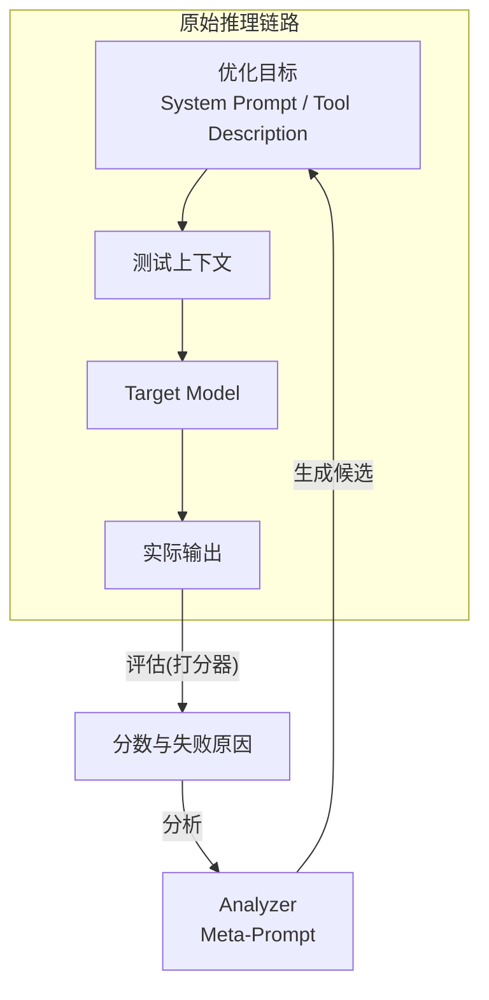

本节我们来学习一个轻量级的 Prompt 自动优化器的设计与实验。目的了是为了后续学习 DSPY 里两个重要的提示词自动优化工具: MIPROv2 和 GEPA 打下基础。

<!-- more -->

## 1. 优化目标与边界

优化对象包括：

- `system prompt`；
- `tool description`。

测试用例中的对话消息保持不变。通过固定输入，只比较不同 Prompt 对模型输出的影响。

## 2. 优化流程



整体流程如下：

1. 将测试用例输入 Target Model，得到实际输出；
2. 打分器比较实际输出与预期输出，生成分数和失败原因；
3. Analyzer 结合 Meta-Prompt 分析失分原因；
4. Analyzer 生成新的 System Prompt 和 Tool Description 候选；
5. 使用新候选重新运行测试；
6. 比较新旧版本的得分，保留当前最优版本；
7. 重复以上过程，直到达到目标分数或迭代次数上限。

模型分工

1. **Target Model（目标模型）**：GPT OSS 20B，负责执行 Agent 任务和调用 Memory Tool；
2. **Teacher LLM（教师模型）**：智谱 GLM-4.6，负责自然语言评分、Analyzer 分析和候选 Prompt 生成。

Target Model 和 Teacher LLM 相互独立，不需要使用同一个模型。Teacher LLM 也可以替换为 Claude、Gemini 或 GPT 等更强模型，理论上模型能力越强，优化效果越好。

## 3. 优化器的核心组件

### 3.1 数据集

每条测试数据包含：

```text
input
expected output
```

`expected output` 的生成方式是：将相同输入交给开启原生 Memory Tool 的 Claude Haiku 4.5，并把它的工具调用结果作为预期输出。

### 3.2 打分器

工具参数中包含自然语言文本，每次生成都可能存在差异。如果直接对输出结构进行全等比较，会产生大量 0 分结果，难以为 Analyzer 提供有效的优化方向。

我们借助更高级的 LLM 对生成结果进行打分。也可以简化评分方案：只比较工具调用动作序列，例如：

```text
view → create → view
```

通过计算动作序列的相似度得到分数。这个方案只能判断工具调用流程是否接近预期，不能评估记忆中自然语言内容的质量。

后续可以扩展为综合评分：

1. 比较工具调用序列；
2. 调用 LLM 评估工具参数中自然语言的意图相似度与合理性；
3. 汇总两部分结果得到最终分数。


### 3.3 Analyzer

Analyzer 的输入包括：

- 当前分数；
- 实际输出；
- 预期输出；
- 旧版 System Prompt；
- 旧版 Tool Description。

Analyzer 依靠 Meta-Prompt 定位 Prompt 中可能引发错误的部分，输出微调后的 System Prompt 和 Tool Description。新版本随后重新运行测试，并根据得分判断本次调整是否有效。
