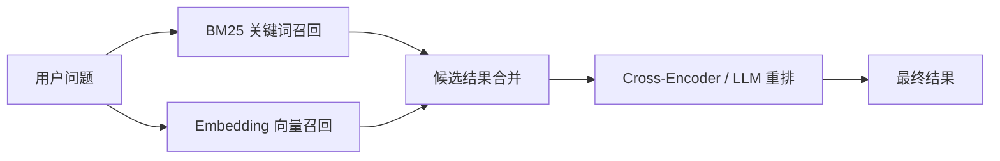
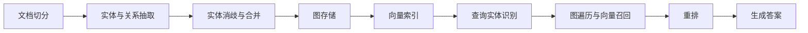

知识图谱、本体和语义检索都在解决同一个问题：如何让计算机不仅存储文字，还能表示事物、概念以及它们之间的关系。

从工程角度学习这套技术，推荐按以下顺序推进：

```text
RDFLib → pySHACL → SPARQL
       ↓
PyTerrier + Sentence Transformers
       ↓
Oxigraph / Apache Jena
       ↓
Neo4j GraphRAG / Microsoft GraphRAG
```

不要一开始就进入 GraphRAG 或 LangChain 的高级封装。先理解 RDF、本体约束、召回和排序，才能看懂后续框架为什么这样设计，而不只是学会调用 API。

<!-- more -->

> 本文中的 Semantic IR 指 Semantic Information Retrieval，即语义信息检索。如果它出现在编译器领域，IR 也可能指 Intermediate Representation，那是另一条技术路线。

## 1. 三个核心概念

### 1.1 知识图谱

知识图谱使用“实体—关系—实体”的形式组织事实：

```text
DeepSeek V4 ──开发者──> DeepSeek
DeepSeek V4 ──类型────> 大语言模型
DeepSeek V4 ──采用────> MoE 架构
MoE         ──属于────> 神经网络架构
```

其中包含：

- 实体：DeepSeek、DeepSeek V4、MoE；
- 关系：开发者、类型、采用、属于；
- 属性：发布日期、参数量、官网地址；
- 事实：`DeepSeek V4 --采用--> MoE`。

知识图谱强调以关系为核心连接不同来源的数据，并支持沿关系执行多跳查询。

### 1.2 本体 Ontology

本体定义某个领域中允许存在哪些概念、关系和规则。知识图谱保存具体事实，本体规定这些事实应该如何表达。

```text
概念：
  视频、工具、开源项目、AI 模型、公司、技术架构

关系：
  视频 --介绍--> 工具
  公司 --开发--> 工具
  工具 --采用--> 技术架构
  工具 --属于--> 工具分类

规则：
  AI 模型 是一种 软件工具
  MoE 模型 是一种 AI 模型
```

当图中记录“DeepSeek V4 是一种 MoE 模型”时，推理系统可以继续得出“DeepSeek V4 是一种 AI 模型”和“DeepSeek V4 是一种软件工具”。

本体不只是数据库 Schema。数据库 Schema 主要约束表、字段和类型；本体还可以表达概念继承、关系语义和逻辑约束。

### 1.3 Semantic IR

传统信息检索主要通过关键词匹配文档。语义检索关注用户真正要找的含义，即使查询与原文没有使用相同词汇，也应该找到相关内容。

例如用户搜索“低内存运行大模型”，字幕原文可能是“从 SSD 流式加载专家权重，只需要约 2 GB 内存”。两段文字没有完全相同的关键词，但语义检索仍应找到 TurboFieldfare。

现代语义检索通常采用混合架构：



知识图谱可以提供另一条检索路径：识别问题中的实体和关系，通过 SPARQL 或图遍历找到结构化事实，再和文本检索结果一起交给 LLM。

## 2. 必须掌握的基础标准

阅读框架源码前，至少需要理解：

| 技术 | 需要理解的内容 |
| --- | --- |
| RDF | 三元组、IRI、Literal、Blank Node、Named Graph |
| Turtle / JSON-LD | RDF 的常用序列化方式 |
| RDFS | 类、属性、继承、domain、range |
| OWL | 等价类、限制、逻辑推理、开放世界假设 |
| SHACL | 数据形状、基数、类型和约束验证 |
| SPARQL | 图模式、FILTER、OPTIONAL、聚合、属性路径 |
| 传统 IR | 倒排索引、TF-IDF、BM25、召回和排序 |
| Semantic IR | Embedding、ANN、混合检索和重排序 |
| IR 评估 | Recall@K、MRR、MAP、nDCG |

标准层建议先学习稳定的 RDF 1.1、SPARQL 1.1 和 SHACL，再了解正在演进的 1.2 版本：

- [W3C RDF Concepts](https://www.w3.org/TR/rdf-concepts/all/)
- [W3C SPARQL Query](https://www.w3.org/TR/sparql-query/all/)
- [W3C SHACL](https://www.w3.org/TR/shacl/)

## 3. RDFLib：理解 RDF 图与 SPARQL

[RDFLib](https://github.com/RDFLib/rdflib) 是最适合 Python 开发者入门的 RDF 框架，支持 RDF 解析、序列化、图操作和 SPARQL。

建议重点阅读：

```text
rdflib/
├── term.py              # URIRef、Literal、BNode 等 RDF 类型
├── graph.py             # Graph、Dataset、三元组增删查
├── namespace/           # RDF、RDFS、OWL 等词汇表
├── plugins/parsers/     # Turtle、JSON-LD 等解析器
├── plugins/serializers/ # RDF 序列化
└── plugins/sparql/      # SPARQL 解析、代数转换和执行
```

阅读时重点理解：

1. 三元组在内存中如何表示；
2. `Graph.triples()` 如何进行模式匹配；
3. Turtle 如何解析成三元组；
4. SPARQL 如何从语法树转换为查询代数；
5. 查询代数如何在 Graph 上执行。

如果只选一个项目开始阅读，应当选择 RDFLib。

## 4. pySHACL：理解本体约束

[pySHACL](https://github.com/RDFLib/pySHACL) 是基于 RDFLib 的纯 Python SHACL 验证器。

重点阅读：

- [`validator.py`](https://github.com/RDFLib/pySHACL/blob/master/pyshacl/validator.py) 中的完整验证流程；
- Shape 如何选择目标节点；
- Constraint Component 如何验证节点；
- Validation Report 如何构造；
- RDFS 和 OWL-RL 推理如何在验证前展开数据图。

科技周报知识图谱可以定义以下约束：

```turtle
:ToolShape
    a sh:NodeShape ;
    sh:targetClass :Tool ;
    sh:property [
        sh:path :name ;
        sh:minCount 1 ;
        sh:maxCount 1
    ] ;
    sh:property [
        sh:path :projectUrl ;
        sh:minCount 1 ;
        sh:nodeKind sh:IRI
    ] ;
    sh:property [
        sh:path :introducedBy ;
        sh:minCount 1 ;
        sh:class :Video
    ] .
```

这样可以自动发现工具没有官网、关联了不存在的视频、发布时间格式错误或名称冲突等问题。

## 5. PyTerrier：系统学习信息检索

[PyTerrier](https://pyterrier.readthedocs.io/en/latest/) 是面向信息检索研究和实验的 Python 框架。它把检索过程建模为可组合的 Transformer：

```text
Query
  → Query Rewrite
  → BM25 Recall
  → 获取文档正文
  → Neural Reranker
  → Evaluation
```

重点理解：

- `Transformer` 数据模型；
- `>>` 如何组合检索流水线；
- BM25 Retriever；
- Query Expansion；
- Learning to Rank；
- `pt.Experiment()` 如何利用 qrels 比较不同流水线。

[PyTerrier 实验接口](https://pyterrier.readthedocs.io/en/latest/experiments.html)能够在相同数据上比较 BM25、FAISS、学习型稀疏检索和神经重排，并计算标准 IR 指标。

推荐至少实现三组实验：

```text
Baseline 1：BM25
Baseline 2：Embedding 向量检索
Baseline 3：BM25 + 向量召回 + Cross-Encoder 重排
```

使用相同问题和 qrels 比较 `Recall@10`、`MRR` 和 `nDCG@10`，不要只凭肉眼判断检索效果。

## 6. Sentence Transformers：理解 Dense Retrieval

[Sentence Transformers 的语义搜索示例](https://www.sbert.net/examples/sentence_transformer/applications/semantic-search/README.html)适合学习向量语义检索。

```text
文档 → Encoder → Document Embedding
问题 → Encoder → Query Embedding
                   ↓
             Cosine Similarity
                   ↓
                 Top-K
```

需要理解：

- Bi-Encoder 为什么适合大规模召回；
- Cross-Encoder 为什么更准确但更慢；
- Query 和 Document 是否使用相同 Encoder；
- Embedding 归一化；
- Cosine、Dot Product 和 Euclidean Distance 的区别；
- Chunk 大小对召回率的影响；
- Hard Negative 对训练效果的影响。

标准系统通常不是只使用向量数据库，而是把 BM25 与向量召回合并，再用更昂贵的模型重排。

## 7. 搜索引擎源码

### 7.1 Apache Lucene

[Apache Lucene](https://lucene.apache.org/) 是 Elasticsearch、Solr 和 OpenSearch 的底层搜索核心。

建议研究：

- Analyzer、Tokenizer、TokenFilter；
- 倒排索引和 Posting List；
- Segment 与 Merge；
- BM25Similarity；
- Query、Weight、Scorer；
- Collector 与 Top-K；
- HNSW 向量索引。

Lucene 源码很大，不适合作为第一站。先通过 PyTerrier 理解检索模型，再研究 Lucene 的工程实现。

### 7.2 Vespa

如果想学习生产级混合检索、分阶段排序和模型推理，可以阅读 [Vespa 文档](https://docs.vespa.ai/)及其[混合检索教程](https://docs.vespa.ai/en/learn/tutorials/hybrid-search)。

Vespa 将召回与排序明确分开：

```text
第一阶段：BM25 / ANN，低成本筛选候选
第二阶段：Embedding、业务特征
最终阶段：Cross-Encoder 或机器学习模型
```

Vespa 更适合研究生产搜索架构，不适合作为 IR 入门框架。

## 8. 图数据库与 SPARQL 引擎

### 8.1 Oxigraph

熟悉 Rust 时，推荐阅读 [Oxigraph](https://github.com/oxigraph/oxigraph)。它同时是 RDF/SPARQL 工具包和基于 RocksDB 的图数据库。

```text
oxrdf       # RDF 数据类型
oxttl       # Turtle、N-Triples、TriG 解析
spargebra   # SPARQL 解析和查询代数
sparopt     # 查询优化
spareval    # SPARQL 执行
oxigraph    # RocksDB 存储和事务
```

可以沿以下链路阅读：

```text
SPARQL 字符串
→ Parser
→ SPARQL Algebra
→ Query Optimizer
→ Join / Filter / Project
→ RocksDB 索引扫描
→ Result Binding
```

配合 [Oxigraph 架构说明](https://github.com/oxigraph/oxigraph/wiki/Architecture)阅读会更容易理解。

### 8.2 Apache Jena

Java 技术栈优先选择 [Apache Jena](https://jena.apache.org/)。它覆盖 RDF、OWL、推理、SPARQL、持久化和 HTTP 服务。

```text
jena-core    # RDF Model、Graph、Triple
jena-arq     # SPARQL parser、algebra、query engine
jena-tdb2    # 持久化三元组存储
jena-fuseki  # SPARQL HTTP Server
```

推荐配合 [Jena 架构文档](https://jena.apache.org/about_jena/architecture.html)和 [ARQ 内部设计](https://jena.apache.org/documentation/query/architecture.html)阅读源码。

### 8.3 OWLAPI

需要深入形式化本体、描述逻辑和 Reasoner 集成时，再阅读 [OWLAPI](https://github.com/owlcs/owlapi)：

- Axiom 对象模型；
- Ontology Manager；
- Class Expression；
- Manchester Syntax；
- Reasoner 接口；
- Ontology Import。

## 9. Neo4j 与 RDF 的区别

Neo4j 使用属性图模型，不等同于 RDF/OWL 本体系统。

| RDF / OWL | Neo4j 属性图 |
| --- | --- |
| 三元组模型 | 节点、边和属性 |
| SPARQL | Cypher |
| 标准化语义 | 灵活的应用数据模型 |
| 支持形式化推理 | 擅长路径和图遍历 |
| 开放世界假设 | 通常按照应用中的现有数据查询 |

需要在 Neo4j 中导入和映射 RDF、本体时，可以研究 [neosemantics](https://neo4j.com/labs/neosemantics/)。但应先理解 RDFLib 和 SPARQL，避免把知识图谱简单理解为“把数据放进图数据库”。

## 10. 最后学习 GraphRAG

推荐研究：

1. [Microsoft GraphRAG](https://github.com/microsoft/graphrag)：重点理解从非结构化文本抽取实体关系、构建社区、生成社区摘要，以及 Local Search 和 Global Search。
2. [Neo4j GraphRAG Python](https://github.com/neo4j/neo4j-graphrag-python)：重点理解 Vector Retriever、Hybrid Retriever、Graph Traversal、Text2Cypher 和知识图谱构建 Pipeline。

阅读时将系统拆成以下阶段：



GraphRAG 索引通常需要调用模型抽取实体、关系和摘要，成本明显高于普通向量 RAG。它适合在掌握数据模型和检索评估后学习，而不是作为知识图谱的入门项目。

## 11. 基于科技周报的练手项目

已经下载的 Koala 科技周报字幕非常适合用来实现一套完整系统。

### 11.1 第一版：RDF 知识图谱

定义以下概念：

```text
Video
Tool
Category
Organization
Technology
ProjectRelease
```

定义关系：

```text
Video       --introduces--> Tool
Tool        --belongsTo----> Category
Organization --develops----> Tool
Tool        --uses----------> Technology
Tool        --releasedAt----> Date
Tool        --projectUrl----> URL
Video       --koalaSays-----> Evaluation
```

使用 RDFLib 从 `bilibili/data/state.db` 和 `posts/tool/anything.md` 生成 Turtle。

### 11.2 第二版：SHACL 数据质量检查

验证每个工具必须包含：

- 官方名称；
- 项目地址；
- 发布时间；
- 日期证据；
- 对应 BVID；
- Koala 评价；
- 工具分类。

### 11.3 第三版：SPARQL 查询

实现以下查询：

```text
找出 Koala 介绍过的所有自托管工具
找出使用 MoE 架构的模型
找出 2026 年发布且有 GitHub 仓库的项目
找出同一个组织开发的多个工具
```

### 11.4 第四版：混合语义检索

对字幕分段并比较：

- BM25；
- Sentence Transformers；
- BM25 + Embedding；
- BM25 + Embedding + Reranker。

自己编写 20～50 个问题和相关性标注，使用 PyTerrier 或 [BEIR](https://github.com/beir-cellar/beir)的评估方式比较效果。

### 11.5 第五版：GraphRAG

```text
问题
→ 混合检索字幕
→ 识别工具实体
→ 查询一至两跳图邻居
→ 合并文本与结构化证据
→ LLM 生成带来源的回答
```

## 12. 推荐阅读优先级

如果只选择五个代码库：

1. [RDFLib](https://github.com/RDFLib/rdflib)：理解 RDF 图和 SPARQL。
2. [pySHACL](https://github.com/RDFLib/pySHACL)：理解本体约束和验证。
3. [PyTerrier](https://pyterrier.readthedocs.io/en/latest/)：理解完整 IR 实验方法。
4. [Oxigraph](https://github.com/oxigraph/oxigraph)：理解图数据库和 SPARQL 引擎内部。
5. [Microsoft GraphRAG](https://github.com/microsoft/graphrag)：理解知识图谱与 LLM 检索的结合方式。

这条路线比直接学习 LangChain、LlamaIndex 或某个向量数据库更加扎实，因为它能够把数据模型、约束、召回、排序、评估和图查询分别解决什么问题解释清楚。
