## 问题
我当前缺乏对 CUDA 和 大模型推理过程的心智模型。核心原因如下:
1. 模型训练使用 pytorch ，从程序来说这个程序已经固定了，为什么引擎还能优化推理过程
2. OS 上，我能理解 OS 为了调度不同进程执行的过程。但是我无法理解 CUDA 是如何调度 GPU 的运行的，对应的上下文是什么

请你帮我建立这一块的心智模型。如果可以你可以类比进程调度。不要引入太过复杂的大模型推理的概念。

## 一、先用一个例子认识 CUDA

先不看大模型。假设 CPU 上有两个长度为 1024 的数组：

```text
A = [a0, a1, a2, ..., a1023]
B = [b0, b1, b2, ..., b1023]
```

现在要计算：

```text
C[i] = A[i] + B[i]
```

在 CPU 上，可以写一个循环，让一个 CPU 线程依次完成 1024 次加法：

```text
for i in 0..1023:
    C[i] = A[i] + B[i]
```

这 1024 次加法互不依赖，非常适合交给 GPU 并行执行。我们的目标是启动 1024 个逻辑上的 CUDA Thread，让每个 Thread 只负责一个位置：

```text
Thread 0    计算 C[0]    = A[0]    + B[0]
Thread 1    计算 C[1]    = A[1]    + B[1]
...
Thread 1023 计算 C[1023] = A[1023] + B[1023]
```

下面沿着这个例子，看它怎样一步步到达 GPU。

### 1.1 第一步：CPU 进程获得 CUDA Context

Python 或 C++ 程序仍然是运行在 CPU 上的普通进程。当它第一次使用某张 GPU 时，CUDA 会为这个进程准备与该 GPU 关联的 CUDA Context。

Context 可以粗略理解成“这个 CPU 进程在 GPU 侧的工作空间”。在当前数组加法的例子中，它会关联或管理：

- 当前使用的 GPU，例如 GPU 0；
- A、B、C 三个数组在 GPU 上占用的三段显存；
- 已经加载的数组加法 Kernel 代码；
- 用于提交命令的 CUDA Stream；
- 用于表达任务完成状态的 CUDA Event；
- CUDA Runtime 和 Driver 维护的其他运行状态。

#### “A、B、C 对应的显存”具体指什么

GPU 不能直接把 CPU 内存中的普通数组当成自己的输入。执行加法前，GPU 需要能够访问三块设备内存：

- `d_A`：保存 1024 个输入元素 A；
- `d_B`：保存 1024 个输入元素 B；
- `d_C`：预留给 1024 个输出元素 C。

这里的 `d_` 可以理解为 Device，也就是设备端。A、B、C 的元素类型都是 `float32`，一个元素占 4 字节，因此每块显存的大小是：

```text
1024 × 4 字节 = 4096 字节
```

三块数组总共需要：

```text
4096 × 3 = 12288 字节
```

暂时不考虑 CUDA 和内存分配器的其他开销，显存中的逻辑布局可以画成：

```text
d_A ──► [A[0]][A[1]][A[2]] ... [A[1023]]    4096 字节
d_B ──► [B[0]][B[1]][B[2]] ... [B[1023]]    4096 字节
d_C ──► [C[0]][C[1]][C[2]] ... [C[1023]]    4096 字节
```

它们是三段相互独立的显存区域，不是把三个数组混在同一段数据中。`d_A`、`d_B` 和 `d_C` 分别表示三段显存的设备端起始地址。这里的地址是 Kernel 用来定位数据的地址，不需要把它理解成显存芯片上的某个固定物理坐标。

如果 A 和 B 最初位于 CPU 内存中，程序会经历下面的过程：

1. 在 GPU 上为 `d_A`、`d_B`、`d_C` 分别申请 4096 字节显存。
2. 把 CPU 内存中的 A 复制到 `d_A`。
3. 把 CPU 内存中的 B 复制到 `d_B`。
4. `d_C` 暂时只需要分配空间，不需要复制有效输入，因为它负责保存计算结果。
5. Kernel 执行完成后，再根据需要把 `d_C` 中的结果复制回 CPU 内存中的 C。

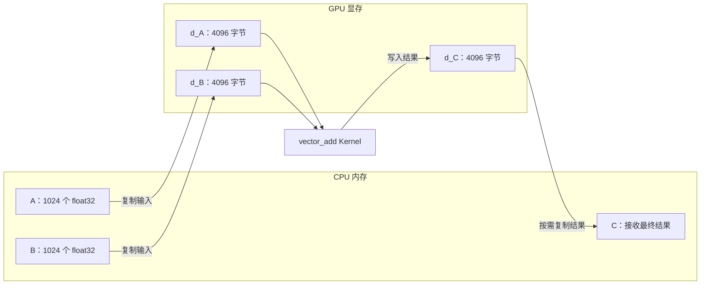

如果使用下面这种 PyTorch 写法：

```python
a = torch.arange(1024, device="cuda", dtype=torch.float32)
```

数据会直接在 GPU 上生成，不需要先从 CPU 复制。但 Python 中的变量 `a` 仍然不是那 4096 字节的元素数据本身。可以把它理解为一个较小的 Tensor 对象，保存以下信息：

- 数据位于 `cuda:0`；
- 元素类型是 `float32`；
- 形状是 `[1024]`；
- 如何解释数据的步长信息；
- 指向 GPU Storage 的引用，而 GPU Storage 最终关联到那段显存。

因此，CPU 上的 Tensor 对象更像“显存数据的说明书和句柄”，真正的 1024 个元素位于 GPU 显存中。

#### 每个 Thread 怎样访问这三段显存

启动 Kernel 时，CPU 会把 `d_A`、`d_B`、`d_C` 这三个设备端地址作为参数传进去：

```cpp
vector_add<<<4, 256, 0, stream>>>(d_A, d_B, d_C, 1024);
```

假设某个 Thread 算出的编号 `i = 300`，它执行的逻辑就是：

```text
从 d_A 起始位置向后移动 300 × 4 字节，读取 A[300]
从 d_B 起始位置向后移动 300 × 4 字节，读取 B[300]
执行 A[300] + B[300]
从 d_C 起始位置向后移动 300 × 4 字节，写入 C[300]
```

也就是说，1024 个 Thread 共享相同的三个起始地址，但每个 Thread 根据自己的 `i` 计算不同的元素地址，所以它们可以同时处理 A、B、C 的不同位置。

Context 的作用，是让这些显存分配、Kernel、Stream 等资源处在同一个可用的 GPU 运行环境中。具体的显存申请和复用可能由 CUDA 或 PyTorch 的内存分配器完成；Context 自己并不逐元素保存 A、B、C，也不执行这 1024 次加法。

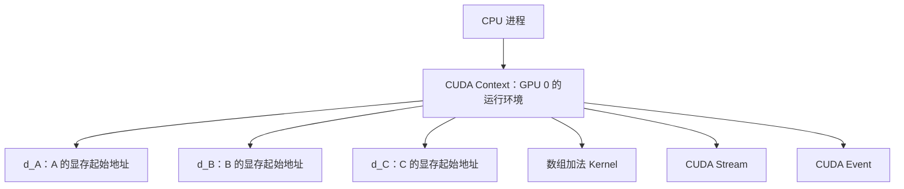

这里需要先纠正一个容易出现的误解：**CUDA Context 不会一步步变成 Thread 或 Warp。**

Context 是资源和状态的容器。真正产生 Grid、Block 和 Thread 的动作，是 CPU 在这个 Context 中发起一次 Kernel Launch。

### 1.2 第二步：CPU 把命令放入 CUDA Stream

CPU 先把 A 和 B 复制到 GPU，然后提交数组加法 Kernel，最后再把 C 复制回 CPU。这些命令会被放入 CUDA Stream：

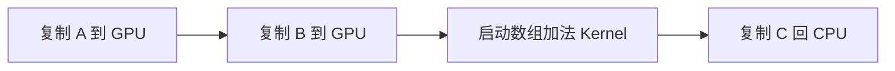

同一个 Stream 中的命令保持提交顺序。Stream 只是一条命令队列，不负责亲自执行加法，也不是一条 GPU Thread。

CPU 提交 Kernel 时，还要说明希望创建多少个 Block，以及每个 Block 包含多少个 Thread。这个例子可以使用：

```text
4 个 Block × 每个 Block 256 个 Thread = 1024 个 Thread
```

CUDA 风格的启动形式可以写成：

```cpp
vector_add<<<4, 256, 0, stream>>>(A, B, C, 1024);
```

这里的 `4` 表示 Grid 中有 4 个 Block，`256` 表示每个 Block 有 256 个 Thread。最后的 `stream` 表示把这次 Kernel Launch 放到哪一条命令队列。

### 1.3 第三步：Kernel Launch 创建 Grid

Kernel 是 GPU 要执行的函数。数组加法 Kernel 的核心逻辑可以简化为：

```cpp
__global__ void vector_add(float* A, float* B, float* C, int n) {
    int i = blockIdx.x * blockDim.x + threadIdx.x;
    if (i < n) {
        C[i] = A[i] + B[i];
    }
}
```

每个 Thread 都执行同一段 Kernel 代码，但会根据自己的编号算出不同的 `i`：

- `blockIdx.x`：当前 Thread 所在 Block 的编号；
- `blockDim.x`：每个 Block 的 Thread 数量，这里是 256；
- `threadIdx.x`：当前 Thread 在 Block 内的编号，范围是 0 到 255。

例如：

- Block 0 的 Thread 0：`i = 0 × 256 + 0 = 0`；
- Block 0 的 Thread 255：`i = 0 × 256 + 255 = 255`；
- Block 1 的 Thread 0：`i = 1 × 256 + 0 = 256`；
- Block 3 的 Thread 255：`i = 3 × 256 + 255 = 1023`。

因此，每个 Thread 都能找到自己负责的数组位置。

这一次 Kernel Launch 创建的全部 Thread 合称一个 Grid：

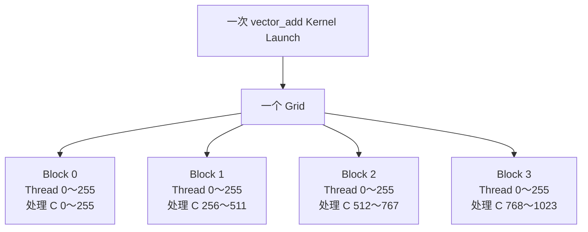

现在，Grid、Block 和 Thread 的作用就可以分别说明了：

- Grid：一次 Kernel Launch 创建的全部工作。
- Thread：一个逻辑执行实例，在本例中负责一个数组元素。
- Thread Block：一组可以被共同放到一个 SM 上执行的 Thread。

Block 不只是为了分组。GPU 以 Block 为单位把工作分配给 SM；同一个 Block 中的 Thread 还可以使用共享内存，并进行 Block 内同步。本例不需要 Thread 之间协作，但矩阵乘法等计算会大量使用这种能力。

### 1.4 第四步：GPU 把 Block 分配给 SM

SM 是 GPU 中真正承担计算的硬件单元，可以暂时类比为 CPU Core。

假设这张 GPU 有两个可用 SM。硬件可以把 Block 0、Block 1 分配给 SM 0，把 Block 2、Block 3 分配给 SM 1。实际分配会受到 SM 当前资源和其他任务的影响，并不保证就是这个固定结果。

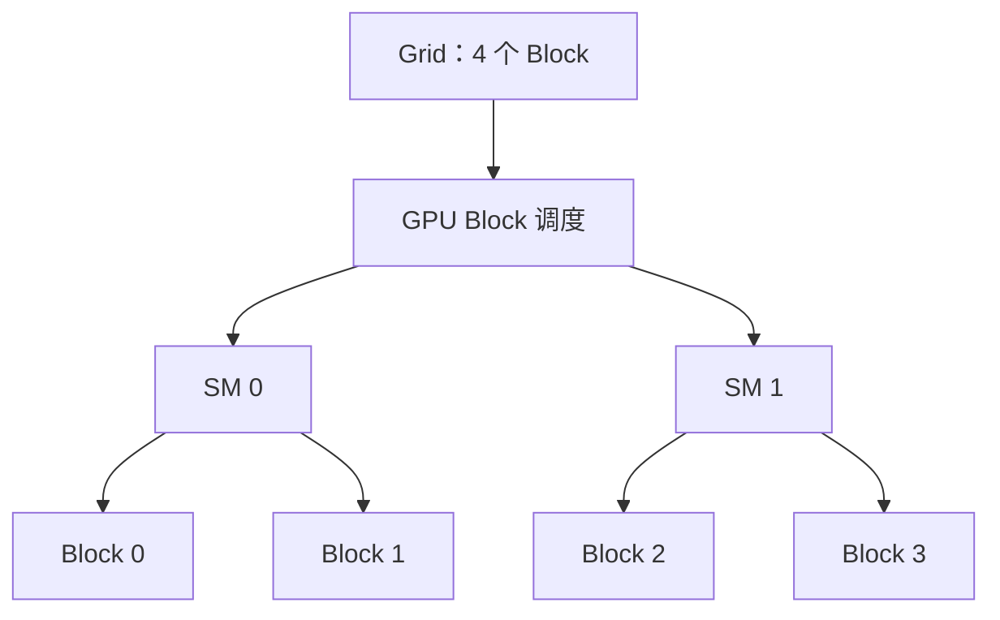

一个 Block 一旦被分配到某个 SM，就会在这个 SM 上执行到完成，不会执行一半再迁移到另一个 SM。

如果 Grid 中有 1000 个 Block，但 GPU 暂时只能同时容纳其中一部分，其余 Block 就等待。某些 Block 完成并释放 SM 资源后，GPU 再继续分配后面的 Block。

### 1.5 第五步：Block 中的 Thread 被组成 Warp

到这里，我们已经定义了每个 Thread 要做什么，但 GPU 不会每次只挑一个 Thread 执行。英伟达 GPU 会把同一个 Block 中相邻的 32 个 Thread 组成一个 Warp。

本例中，每个 Block 有 256 个 Thread，因此会形成：

```text
256 个 Thread ÷ 每个 Warp 32 个 Thread = 8 个 Warp
```

Block 0 可以被划分为：

```text
Warp 0：Thread   0 ～  31，处理 C[0]   ～ C[31]
Warp 1：Thread  32 ～  63，处理 C[32]  ～ C[63]
...
Warp 7：Thread 224 ～ 255，处理 C[224] ～ C[255]
```

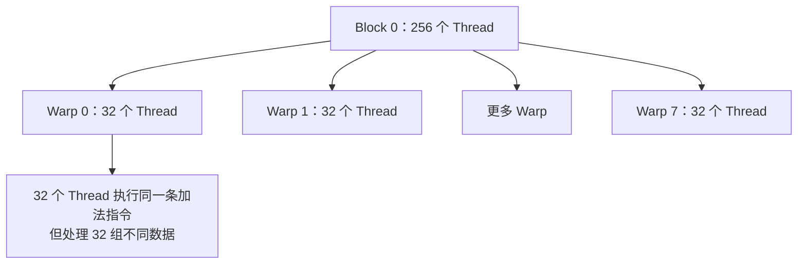

Warp 是 SM 内部实际发射和执行指令的基本单位。Warp 中的 32 个 Thread 通常在同一时刻执行同一条指令，但各自处理不同的数据。

以 Warp 0 为例，它的 32 个 Thread 会共同执行读取 A、读取 B、执行加法、写入 C 等指令：

```text
Thread 0 计算 C[0] = A[0] + B[0]
Thread 1 计算 C[1] = A[1] + B[1]
...
Thread 31 计算 C[31] = A[31] + B[31]
```

所以 Warp 不是程序员额外创建的一组任务，而是 GPU 硬件对 Thread 的执行分组。

### 1.6 第六步：Warp Scheduler 选择 Warp 执行

一个 SM 上可能同时驻留很多 Warp。SM 内部的 Warp Scheduler 会不断选择当前已经准备好的 Warp，把它的下一条指令交给执行单元。

例如：

1. Warp 0 发起显存读取，需要等待 A 和 B 的数据。
2. Warp Scheduler 不必原地等待，可以选择已经准备好的 Warp 1 执行。
3. Warp 1 等待数据时，又可以执行 Warp 2。
4. Warp 0 的数据准备好后，再继续执行加法和写回。

这里的“Warp 0 发起显存读取”，可以进一步理解为：Warp 中的每个 Thread 把自己需要的数据从 GPU 全局内存读取到自己的寄存器中。

以前面的向量加法为例，假设某个 Thread 的逻辑编号是 `i`，它执行的过程可以简化为：

```cpp
int i = blockIdx.x * blockDim.x + threadIdx.x;

float a = A[i];  // 从 d_A 对应的位置读取到当前 Thread 的寄存器
float b = B[i];  // 从 d_B 对应的位置读取到当前 Thread 的寄存器
float c = a + b; // 使用寄存器中的 a、b 完成计算
C[i] = c;        // 把寄存器中的结果写回 d_C
```

因此，单个 Thread 的数据流可以画成：

```text
GPU 全局内存 d_A、d_B
          ↓ load
当前 Thread 私有的寄存器
          ↓
       A[i] + B[i]
          ↓
当前 Thread 私有的寄存器
          ↓ store
GPU 全局内存 d_C
```

更准确地说，数据不一定每次都直接从显存芯片读取。一次全局内存加载通常会经过 GPU 的缓存层级：

```text
GPU 显存 DRAM
      ↓
    L2 Cache
      ↓
 L1 Cache 等缓存
      ↓
 Thread 寄存器
```

如果数据已经在 L1 或 L2 Cache 中命中，GPU 就可以从缓存中取得数据；如果没有命中，才需要访问更慢的 GPU 显存。日常所说的“从显存读取”，通常是对这整个过程的概括。

还需要区分 Warp 和寄存器的关系：

- Warp Scheduler 选择的是一个 Warp 的下一条指令；
- Warp 中的 32 个 Thread 通常会一起执行这条指令；
- 但每个 Thread 读取的 `A[i]`、`B[i]` 不同，并且结果放在各自的寄存器中；
- 寄存器默认是 Thread 私有的，不是整个 Warp 共享的存储空间。

例如一个 Warp 可以同时执行：

```text
Thread 0：读取 A[0]、B[0] → 自己的寄存器
Thread 1：读取 A[1]、B[1] → 自己的寄存器
...
Thread 31：读取 A[31]、B[31] → 自己的寄存器
```

当相邻 Thread 访问相邻地址时，GPU 通常可以把这些访问合并为较少的内存事务，这叫作合并访存。它能减少显存访问开销，但并不改变“数据最终要进入各个 Thread 自己的寄存器”这一基本理解。

所以，前面“Warp 0 等待 A 和 B 的数据”可以展开成：Warp 0 中的 Thread 已经发出了加载指令，但相应数据还没有到达各自的寄存器。Warp Scheduler 会先去执行其他已经准备好的 Warp；当这些加载完成后，Warp 0 才能继续使用寄存器中的 `a`、`b` 完成加法。

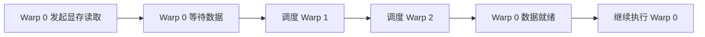

这种快速切换可以隐藏显存访问的等待时间。它和 OS 在一个 CPU Core 上切换线程有一点相似，但 GPU 切换的是轻量级 Warp，而不是带有完整进程上下文的 OS 线程。

### 1.7 把整个例子串起来

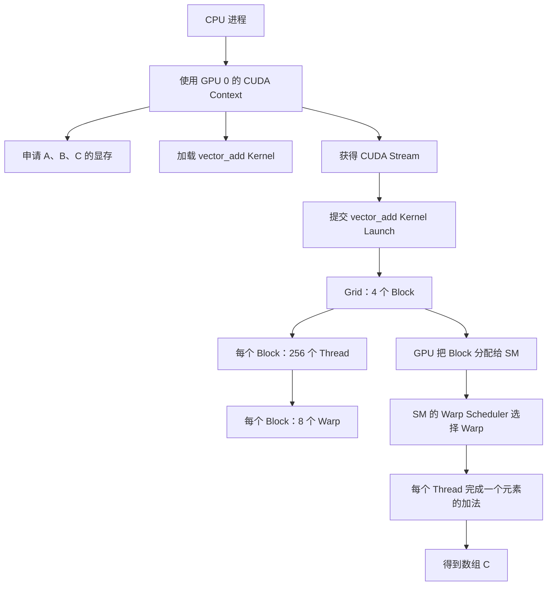

最重要的层级关系是：

```text
CPU 进程
└── CUDA Context：保存 GPU 资源和状态
    └── CUDA Stream：保存按顺序提交的命令
        └── Kernel Launch：发起一次 GPU 计算
            └── Grid：这次计算的全部 Thread
                └── Thread Block：GPU 分配到 SM 的工作组
                    └── Warp：SM 实际发射指令的 Thread 组
                        └── Thread：处理一个具体数据位置
```

这是一种包含和执行关系，不是 Context 依次转换成 Stream、Kernel、Block 和 Warp。

## 二、再类比 CPU 进程调度

在 CPU 上，一个应用程序运行时，操作系统会创建进程。进程包含自己的地址空间、资源和执行上下文。进程中可以有多个线程，操作系统把可运行线程调度到 CPU Core 上。

CUDA 中也可以找到“运行环境—任务队列—计算任务—硬件执行”的分层，但只能类比，不能完全画等号。

## 三、CPU 调度与 CUDA 调度的对应关系

下面这张表适合用来建立第一版心智模型：

| CPU / OS 概念 | CUDA / GPU 中可以类比的概念 | 主要作用 |
| --- | --- | --- |
| 进程 | CUDA Context | 保存资源和运行状态 |
| 线程任务队列 | CUDA Stream | 表达任务的提交顺序和依赖 |
| 函数或计算任务 | CUDA Kernel | 描述一次在 GPU 上执行的计算 |
| CPU Core | SM | 承担实际计算 |
| 被分配到 CPU Core 的工作 | Thread Block | 被整体分配到一个 SM |
| CPU Core 选择线程执行 | Warp Scheduler 选择 Warp | 选择下一组可以发射指令的 Thread |
| 线程同步 | Event、Stream 同步 | 表达等待和依赖关系 |

需要特别记住三个不能直接画等号的地方：

- CUDA Context 不是 GPU 上运行的一个普通进程；
- CUDA Stream 不是 GPU 线程；
- 单个 CUDA Thread 也不能简单等同于 CPU Thread。

这个类比只是帮助理解“资源环境—任务队列—硬件调度”的分层关系。

## 三（补充）、CUDA Runtime、CUDA Driver 和 CUDA Context 是什么关系

前面我们说“CPU 进程获得 CUDA Context”，又说“通过 CUDA Runtime 和 Driver 提交 Kernel”。这几个概念处在不同层次，不能把它们理解成三个并列的 GPU 调度器。

### 1. 先看三者的层级

```text
Python / PyTorch / CUDA Library
              ↓
       CUDA Runtime API
              ↓
        CUDA Driver API
              ↓
        CUDA Context
              ↓
       GPU Driver / GPU 硬件
```

- **CUDA Runtime**：面向普通 CUDA 程序的较高层 API，负责提供更容易使用的设备管理、内存分配、Kernel Launch、Stream 和 Event 接口。常见的 `cudaMalloc`、`cudaMemcpy`、`cudaStreamCreate` 就属于 Runtime API。
- **CUDA Driver**：更底层的驱动接口和实现。它负责与 GPU 驱动和硬件交互，管理 Context、模块、设备内存、Stream 等资源，并把程序提交的工作交给 GPU。Driver API 中的函数通常带有 `cu` 前缀，例如 `cuCtxCreate`、`cuMemAlloc`。
- **CUDA Context**：某个 CPU 进程在某个 GPU 上使用 CUDA 资源时的状态和资源容器。它里面关联着设备内存分配、已加载的 Kernel 模块、Stream、Event 以及当前执行状态。

因此，Runtime 和 Driver 更像“操作接口层”，Context 更像“这些操作作用于其中的运行环境”。它们的关系不是：

```text
Runtime 创建 Driver，Driver 创建 GPU Thread
```

而更接近：

```text
程序调用 Runtime API
        ↓
Runtime API 转而调用 Driver 能理解的底层接口
        ↓
Driver 在某个 CUDA Context 中创建资源、加载模块、提交命令
        ↓
GPU 执行 Kernel
```

### 2. 它们负责创建什么

以第一次执行 CUDA 操作为例，程序可能只写了：

```python
a = torch.arange(1024, device="cuda")
```

背后大致会发生：

```text
PyTorch 请求使用 CUDA
        ↓
CUDA Runtime / PyTorch 初始化 CUDA Driver
        ↓
Driver 为当前进程和 GPU 准备或激活 Context
        ↓
Runtime / PyTorch 在 Context 中申请 GPU 内存
        ↓
返回一个指向 GPU Tensor Storage 的句柄
```

所以可以说：**CUDA Context 是由 Driver 层创建或管理的；CUDA Runtime 通常负责在需要时触发初始化，并使用 Driver 管理的 Context。**

在 CUDA Driver API 中，程序可以显式创建 Context，例如调用 `cuCtxCreate`。而使用 CUDA Runtime API 时，通常不需要手动创建 Context；Runtime 会为当前设备使用对应的 **Primary Context**，并自动完成初始化和绑定。PyTorch 也主要隐藏了这些细节。

这里的“创建 Context”不是创建一个 GPU 进程，也不是创建一个 SM、Warp 或 Thread。它只是建立一套让 Driver 知道“当前这个 CPU 进程正在怎样使用这张 GPU”的资源和状态。

### 3. Context、Stream 和 Kernel 的关系

可以把一次计算中的对象关系画成：

```text
一个 CPU 进程
└── 一个 GPU 上的 CUDA Context
    ├── GPU 内存：d_A、d_B、d_C
    ├── Kernel 模块：vector_add
    ├── Stream 0：复制 A → 复制 B → 启动 Kernel
    └── Event：记录某个操作是否完成
```

CPU 进程首先在 Context 中申请 `d_A`、`d_B` 和 `d_C`，然后把 `vector_add` 这个 Kernel 放入某个 Stream。Driver 根据 Stream 中的命令和依赖关系，把 Kernel Launch 交给 GPU。之后 GPU 才会创建这次 Launch 对应的 Grid，并把其中的 Block 分配到 SM。

所以创建顺序可以粗略理解为：

```text
Driver 初始化 / 激活 Context
        ↓
创建或取得 Stream
        ↓
分配 GPU 内存、加载 Kernel
        ↓
向 Stream 提交 Kernel Launch
        ↓
GPU 将 Grid 中的 Block 分配到 SM
```

### 4. Runtime 和 Driver 是两个不同 API，不一定是两个独立进程

“CUDA Runtime”和“CUDA Driver”有时容易让人误以为系统中运行着两个后台服务。更准确的理解是：它们主要是不同层次的库和 API。

```text
CUDA Runtime API：更方便，隐藏更多细节
CUDA Driver API：更底层，控制粒度更细
```

一个 CUDA 程序通常可以直接使用 Runtime API，也可以直接使用 Driver API。Runtime API 的实现会调用 Driver API；PyTorch、cuBLAS、FlashAttention 等组件则可能通过 Runtime、Driver 或 CUDA 库间接完成内存分配和 Kernel 提交。

不同组件如果共同使用同一块 GPU，通常会通过当前设备对应的 Context 协作。它们并不是各自创建一套独立的 GPU 硬件，而是在自己的调用边界内使用 Context 中的资源。

### 5. 和 CPU 进程的类比

可以做一个不完全等价但有帮助的类比：

| CPU 世界 | CUDA 世界 |
| --- | --- |
| 操作系统 API / 系统调用 | CUDA Runtime / Driver API |
| 进程地址空间和资源上下文 | CUDA Context |
| 线程或任务队列 | CUDA Stream |
| 被提交执行的函数 | CUDA Kernel |
| CPU Core 执行线程 | SM 执行 Thread Block |

这个类比只用于理解“接口、资源环境、任务队列和硬件执行”的层次，不表示 CUDA Context 就等于 OS 进程，也不表示 Stream 就等于 GPU Thread。

有了这个过渡，再看下一节的 PyTorch 示例就比较自然了：PyTorch 负责提出“我要在 CUDA Tensor 上做加法”，Runtime 和 Driver 负责把请求放进某个 Context 的 Stream，GPU 最终负责执行 Kernel。

## 四、一次 PyTorch 计算是怎样到达 GPU 的

回到前面的数组加法。如果使用 PyTorch，可以写成：

```python
a = torch.arange(1024, device="cuda", dtype=torch.float32)
b = torch.arange(1024, device="cuda", dtype=torch.float32)
c = a + b
```

`c = a + b` 描述的是逐元素加法。PyTorch 会为 CUDA Tensor 选择对应的 GPU 实现，并通过当前 CUDA Context 中的 Stream 提交 Kernel。这个过程通常会经过 CUDA Runtime，再由 Runtime 调用更底层的 CUDA Driver；PyTorch 用户不需要手动创建 Context 或 Stream。

PyTorch 实际选择的 Kernel 和 Block 大小可能与前面手写的教学示例不同，但从 CPU 提交到 GPU 执行的层级关系相同：

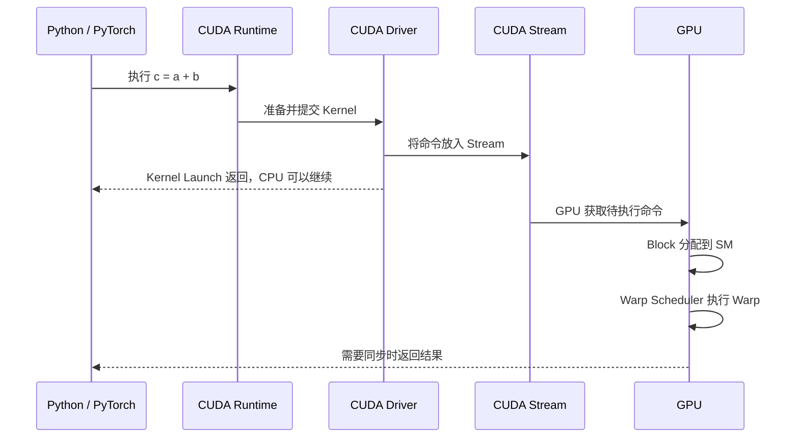

这里最重要的一点是：许多 CUDA 操作对 CPU 来说是异步的。

CPU 提交 Kernel 后，不一定停下来等待 GPU 完成，而是可以继续提交后面的工作。只有在 CPU 必须读取 GPU 结果，或者程序显式要求同步时，CPU 才需要等待。

因此，CPU 和 GPU 之间更像生产者与消费者：

- CPU 负责准备并提交任务；
- Stream 保存任务顺序；
- GPU 从任务队列中取出工作并执行；
- 同步操作负责保证结果已经完成。

如果程序频繁要求同步，CPU 和 GPU 就会互相等待，GPU 的执行流水也容易出现空洞。

## 五、为什么 PyTorch 程序固定，推理引擎仍然能够优化

这是最关键的问题。

PyTorch 模型固定，主要表示数学关系固定。例如，输入需要经过矩阵乘法、归一化和激活函数，最终得到输出。它回答的是“算什么”。

但是，同一组数学计算可以有不同的执行方法。推理引擎主要优化的是“怎么算”和“怎样安排计算”。

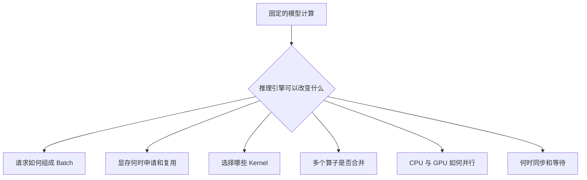

### 5.1 批处理

这里的 Batch 不是“把相同数据复制多份”，也不是“把不同请求分别提交到多张 GPU”。它的含义是：多个请求共同作为一次模型前向的输入，使用同一份模型权重和同一组 Kernel 计算。

例如一个线性层可以接受这样的输入：

```text
请求 A 的 hidden states → 第 0 行
请求 B 的 hidden states → 第 1 行
请求 C 的 hidden states → 第 2 行
```

输入 Tensor 的形状可以抽象为：

```text
[batch_size, hidden_size]
```

Kernel 仍然只有一份，但它的 Grid 中会有更多 Thread 去处理不同请求的不同数据：

```text
Thread Block 0 → 处理请求 A 的部分数据
Thread Block 1 → 处理请求 B 的部分数据
Thread Block 2 → 处理请求 C 的部分数据
```

也就是说，Batch 解决的是“多个数据样本共同使用一次计算流程”，而不是要求这些样本的数据相同。模型权重相同即可；每个请求的输入、输出和状态仍然可以不同。

### 不同长度的 Prompt 怎么组成 Batch

普通神经网络经常把不同长度的输入 Padding 到相同长度：

```text
请求 A：[我, 爱, 吃, 苹果]
请求 B：[请, 介绍, CUDA, PAD]
请求 C：[你好, PAD, PAD, PAD]
```

`PAD` 位置通过 Mask 忽略。这样输入可以放进规则的二维 Tensor，但 Padding 也会浪费计算。

LLM 推理引擎还可以使用变长输入，把多个请求的有效 Token 拼接成一维数组，再用每个请求的边界描述真实长度：

```text
input_ids = [A0, A1, A2, A3, B0, B1, C0, C1]
cu_seqlens = [0, 4, 6, 8]
```

`cu_seqlens` 表示：

```text
请求 A：input_ids[0:4]
请求 B：input_ids[4:6]
请求 C：input_ids[6:8]
```

这样仍然是一次模型前向和一次批量计算，但不需要把短请求补齐到最长请求。nano-vLLM 的 `ModelRunner.prepare_prefill()` 正是把多个序列的 Token 拼接到 `input_ids`，同时构造 `cu_seqlens_q` 和 `cu_seqlens_k`，交给变长 Attention Kernel。

### 模型内部如何知道每个请求的边界

这里容易产生一个误解：好像模型函数收到一维数组后，必须先在 Python 中切分：

```python
for request in requests:
    part = input_ids[start:end]
    output = model(part)
```

如果真的这样做，就失去了批处理的意义。实际情况是，边界信息会作为额外的 Tensor 传给底层算子，模型内部不需要把请求逐个还原成独立调用。

以拼接后的隐藏状态为例：

```text
hidden_states.shape = [8, hidden_size]
```

其中前 4 行属于请求 A，接下来 2 行属于请求 B，最后 2 行属于请求 C。对于 Linear、RMSNorm、激活函数和 MLP 这些“每个 Token 可以独立处理”的算子，Kernel 直接把 8 行当作一批输入：

```text
第 0～3 行 → 请求 A
第 4～5 行 → 请求 B
第 6～7 行 → 请求 C
```

它甚至不需要知道请求边界，因为这些算子对每一行做的数学操作相同，也不会让一行数据去读取另一行数据。计算完成后，输出仍然保持相同的行顺序：

```text
output[0:4] → 请求 A 的输出
output[4:6] → 请求 B 的输出
output[6:8] → 请求 C 的输出
```

真正需要边界的是 Attention。Attention 会让一个 Token 读取同一请求中的历史 K/V，不能让请求 A 的 Token 读取请求 B 的 K/V。于是变长 Attention Kernel 接收：

```text
Q/K/V：所有请求拼接后的数据
cu_seqlens_q：每个请求的 Query 起止位置
cu_seqlens_k：每个请求的 Key/Value 起止位置
```

例如：

```text
cu_seqlens_q = [0, 4, 6, 8]
cu_seqlens_k = [0, 4, 6, 8]
```

Kernel 可以据此理解为：

```text
请求 A 的 Q[0:4] 只能与 K/V[0:4] 做 Attention
请求 B 的 Q[4:6] 只能与 K/V[4:6] 做 Attention
请求 C 的 Q[6:8] 只能与 K/V[6:8] 做 Attention
```

这个过程不是“先切分，再调用三次 Attention”，而是一次变长 Attention Kernel 内部根据每条序列的起止偏移计算自己的数据范围。`cu_seqlens` 本质上就是批处理中每个请求的边界表。

可以把它类比成一个仓库的连续货架：货物被连续摆放，但系统额外记录每个订单的起始和结束位置。搬运工可以一次处理整排货物，同时根据订单边界避免把不同订单混在一起。

nano-vLLM 在 `prepare_prefill()` 中维护的：

```python
cu_seqlens_q.append(cu_seqlens_q[-1] + seqlen_q)
cu_seqlens_k.append(cu_seqlens_k[-1] + seqlen_k)
```

就是在构造这张边界表。之后它把这些 Tensor 放到 GPU 上，通过 `set_context()` 交给 Attention 层。Attention 再把它们传给 `flash_attn_varlen_func()`。

Decode 阶段的边界表达方式略有不同：每条请求通常只有一个 Query Token，所以 Batch 的第一维就是请求编号；`context_lens` 表示每条请求应该读取多长的历史，`block_tables` 表示这些历史 K/V 位于 KV Cache 的哪些 Block。请求边界因此同样由元数据表达，而不是依靠 Python 循环逐个执行模型。

最后，模型输出仍然是拼接后的 Batch 输出。推理引擎只需要知道每条请求对应哪些行，通常取每条序列最后一个有效位置的 logits 进行采样，再把采样结果放回对应的 `Sequence`。所以“拼接”和“区分边界”分别是：

```text
拼接：让 GPU 有更多 Token 可以并行处理
边界元数据：保证不同请求之间不会错误地互相读取
```

### LLM Decode 阶段的数据明明不同，怎么 Batch

Decode 阶段更加能说明这个问题。假设有三个正在生成的请求：

```text
请求 A 当前上下文长度：100
请求 B 当前上下文长度：250
请求 C 当前上下文长度：37
```

这一轮它们各自只输入一个新 Token：

```text
input_ids = [A 的新 Token, B 的新 Token, C 的新 Token]
```

这三个 Token 不同，但可以组成一个 batch。模型使用同一份权重执行一次前向；每条请求自己的差异通过额外的元数据传入：

```text
context_lens  → 每条请求应该读取多长的历史 KV Cache
block_tables  → 每条请求的 KV 位于哪些物理 Block
slot_mapping  → 当前新 Token 的 K/V 写入哪个 slot
positions      → 当前 Token 在自己的序列中位于什么位置
```

nano-vLLM 的 `prepare_decode()` 就是在构造这些按请求排列的数组。随后一次 `run_model()` 处理整个 Decode batch。请求 A、B、C 的 KV Cache 可以完全不同，但它们仍然调用同一个 Attention 实现。

因此，Decode Batch 可以理解为：

```text
一次 Kernel Launch
├── Thread / Block 处理请求 A 的新 Token
├── Thread / Block 处理请求 B 的新 Token
└── Thread / Block 处理请求 C 的新 Token
```

### Batch 和多 GPU 是两件不同的事

多个 GPU 分别执行不同 Kernel，属于多 GPU 并行或 Tensor Parallelism，不是 Batch 的定义。Batch 即使只有一张 GPU 也成立：

```text
一张 GPU
└── 一次模型前向
    ├── 请求 A
    ├── 请求 B
    └── 请求 C
```

如果同时使用 Batch 和 Tensor Parallelism，则是两种机制叠加：

```text
Batch：一次处理多个请求
Tensor Parallelism：同一次计算再分布到多个 GPU
```

在 nano-vLLM 中，`Scheduler.schedule()` 从 waiting/running 队列选出多条序列，`ModelRunner.run()` 接收 `seqs` 列表并把它们整理成批量输入。`tensor_parallel_size` 则决定模型计算是否跨多个 GPU rank 分片执行，它不是 Batch 的必要条件。

批处理的收益来自：

1. 多个请求共同分摊 Kernel Launch、权重读取和算子准备等固定成本；
2. GPU 可以同时拥有更多可执行的 Thread Block，提高硬件利用率；
3. 同一份模型权重被多个请求共同使用，减少重复的计算准备。

代价是 Batch 越大，需要的临时 Tensor、KV Cache 读写和调度资源也越多。因此推理引擎必须在吞吐、延迟和显存之间取平衡。

### 5.2 显存管理

如果每次计算都重新申请和释放显存，会产生额外开销，也可能带来显存碎片。推理引擎可以提前申请一块显存，并在不同请求之间复用。

模型没有变化，变化的是中间数据放在哪里、什么时候分配、什么时候复用。

### 5.3 选择更合适的 Kernel

同一个数学操作可能有多种 Kernel 实现。不同输入形状、数据类型和 GPU 型号，适合的实现也可能不同。

推理引擎可以根据当前情况选择更合适的 Kernel。数学结果仍然相同，但执行时间不同。

### 5.4 算子融合

假设模型需要连续执行 A、B、C 三个小计算。直接执行可能需要三次 Kernel Launch，并且中间结果需要多次写回和读取显存。

如果把 A、B、C 融合成一个 Kernel，就可以减少启动次数和中间数据搬运。

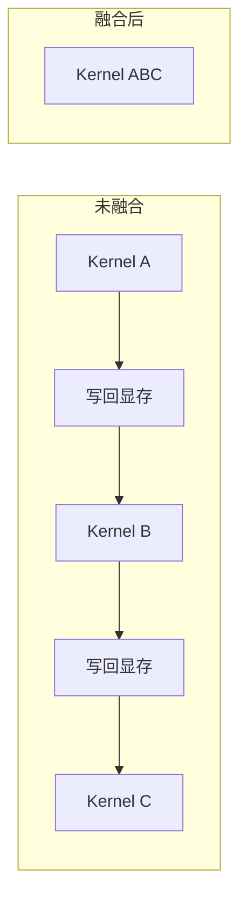

模型表达的计算没有改变，只是执行计划发生了变化。

### 5.5 减少 CPU 与 GPU 的等待

如果 CPU 每提交一个 Kernel 就立即等待结果，GPU 执行完成后还要等待 CPU 提交下一个任务，双方无法形成流水。

推理引擎可以提前准备并连续提交任务，让 CPU 准备下一步时，GPU 正在执行上一步。也可以使用多个 Stream，让数据拷贝和计算在条件允许时重叠。

### 5.6 重用重复工作

推理过程中，有些已经计算过的信息可以缓存下来，后续直接复用，避免重复计算。模型本身没有改变，推理引擎只是记住了之前的中间结果。

可以把它类比成数据库：SQL 语句描述要查询什么，但数据库仍然可以通过索引、缓存和执行计划优化查询过程。PyTorch 模型描述要计算什么，而推理引擎负责优化执行计划、资源管理和任务调度。

## 六、把完整心智模型串起来

现在可以把一次大模型推理简化成下面的过程：

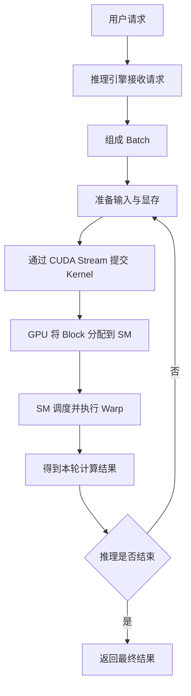

这条链路中，不同层分别解决不同问题：

- PyTorch 模型：定义数学计算。
- 推理引擎：组织请求、显存和计算任务。
- CUDA Runtime 与 Driver：把计算转换成 GPU 能够执行的命令。
- CUDA Stream：维护命令顺序和依赖。
- GPU 硬件调度器：把 Thread Block 分配给 SM。
- Warp Scheduler：在 SM 内选择可以执行的 Warp。

## 七、最终回答最初的两个问题

### 7.1 模型程序已经固定，为什么推理引擎还能优化

因为固定的是计算逻辑，不是执行策略。

推理引擎不能随意改变模型要完成的数学计算，但可以改变请求的批量组织、显存分配和复用、Kernel 选择、算子融合、任务提交顺序，以及 CPU 和 GPU 的重叠方式。

同一份 PyTorch 模型可以对应多种执行计划，因此也会有不同的速度、吞吐和显存占用。

### 7.2 CUDA 如何调度 GPU，对应的上下文是什么

CUDA Context 是 GPU 侧的资源和状态环境，可以粗略类比为进程上下文。CPU 通过 CUDA Stream 按顺序提交 Kernel。Kernel 被拆成大量 Thread Block，GPU 再把这些 Block 分配到不同 SM；SM 内部的 Warp Scheduler 继续选择 Warp 执行。

因此，不要把 CUDA 调度理解成“GPU 在调度 Python 进程”。更准确的理解是：CPU 进程在一个 CUDA Context 中向 Stream 提交 Kernel，而 GPU 调度的是 Kernel 展开后的 Block 和 Warp。

## 八、记住这五句话

1. PyTorch 模型决定算什么，推理引擎决定怎样算得更高效。
2. CUDA Context 是资源和状态环境，不是最终的计算调度单位。
3. CUDA Stream 是有序命令队列，不是 GPU 线程。
4. GPU 把 Thread Block 分配给 SM，SM 再调度 Warp 执行。
5. 推理优化主要来自减少重复工作、减少数据搬运、减少同步等待，以及让 GPU 一次处理更多有效工作。
