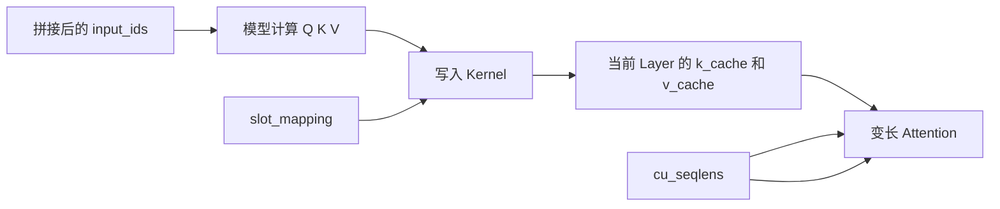
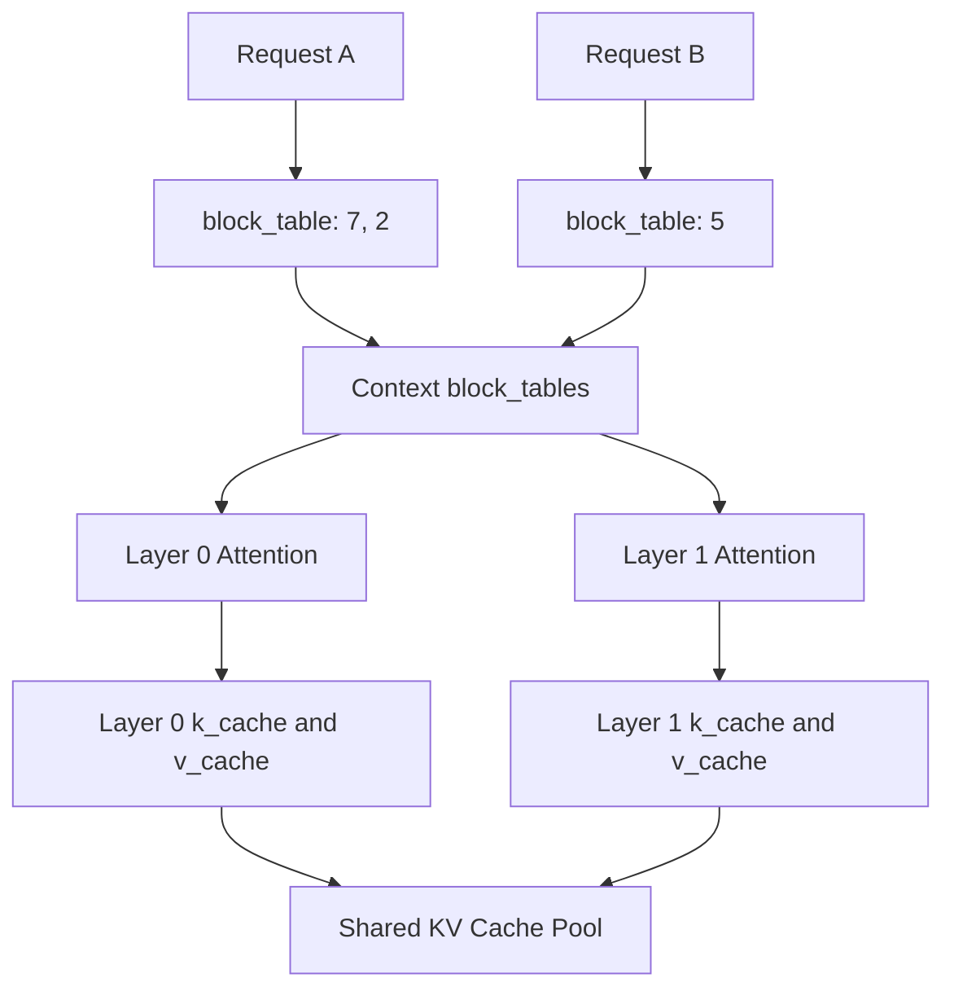

## 问题

KV Cache 的核心不是“有一个缓存对象”，而是三个问题：

```text
K/V 数值存在哪里？
一个 Token 如何找到自己的位置？
新 Token 如何写入，历史 Token 如何被读取？
```

本文只保留理解这些问题所需的最少背景，重点沿着 nano-vLLM 的存储和索引过程展开。

## 1. 最少的模型背景

一个训练好的模型目录主要包含：

```text
config.json       模型层数、Head 数、hidden size 等结构配置
*.safetensors     训练好的权重
Tokenizer 文件    文本和 Token ID 的转换规则
```

nano-vLLM 启动时构造 `Qwen3ForCausalLM`，将权重加载到 GPU，然后预分配 KV Cache。权重是模型本身长期不变的数据，KV Cache 则是请求运行时产生的数据。

假设用户输入：

```text
我｜爱｜吃
```

模型生成“苹果”时，会经历：

```text
Prefill：一次处理 我、爱、吃
Decode：每轮处理一个新生成 Token
```

KV Cache 保存的是每一层 Attention 已经计算好的 K 和 V。下一轮 Decode 只需要计算新 Token 的 Q/K/V，不需要重新计算历史 Token 的 K/V。

## 2. KV Cache 的底层存储结构

### 2.1 nano-vLLM 预分配一个大 Tensor

`ModelRunner.allocate_kv_cache()` 创建：

```python
self.kv_cache = torch.empty(
    2,
    num_hidden_layers,
    num_kvcache_blocks,
    block_size,
    num_kv_heads,
    head_dim,
)
```

可以把它展开为：

```text
kv_cache[K/V][Layer][Physical Block][Token Offset][KV Head][Head Dimension]
```

各维度含义：

```text
K/V          0 表示 K，1 表示 V
Layer        第几层 Attention
Physical Block  KV 池中的物理 Block 编号
Token Offset  Block 内第几个 Token
KV Head      当前 Token 的 KV Head
Head Dim     一个 Head 内的向量维度
```

这块 Tensor 在启动时一次性分配。请求不会各自创建一个新的 KV Tensor，而是从这个共享池中领取 Block。

### 2.2 每一层 Attention 使用自己的 Layer 切片

初始化时：

```python
module.k_cache = self.kv_cache[0, layer_id]
module.v_cache = self.kv_cache[1, layer_id]
```

因此某一层 Attention 看到的 Cache 形状大致是：

```text
[Physical Block][Token Offset][KV Head][Head Dimension]
```

例如：

```text
第 0 层：kv_cache[0, 0] 是 K，kv_cache[1, 0] 是 V
第 1 层：kv_cache[0, 1] 是 K，kv_cache[1, 1] 是 V
```

同一个物理 Block ID 在不同层都有一份独立的 K/V 数据：

```text
Block 7 在第 0 层 → 第 0 层的 K/V
Block 7 在第 1 层 → 第 1 层的 K/V
```

所以 Layer 决定“在哪一层的 Cache 中查找”，Block 和 Offset 决定“这一层中的哪个位置”。

### 2.3 `block_size` 如何设置，不够时怎么办

在 nano-vLLM 的配置中：

```python
class Config:
    kvcache_block_size: int = 256
```

初始化 `LLMEngine` 时可以传入：

```python
llm = LLM(
    model_path,
    kvcache_block_size=256,
)
```

随后 `LLMEngine` 会执行：

```python
Sequence.block_size = config.kvcache_block_size
```

因此 `Sequence.num_blocks`、`block()`、`last_block_num_tokens()` 等计算都会使用这个 Block Size。当前 nano-vLLM 还要求：

```python
assert self.kvcache_block_size % 256 == 0
```

默认值 256 不是说一个请求最多只能有 256 个 Token，而是说一个 KV Block 最多保存 256 个 Token。更长的请求会使用多个 Block：

```text
请求长度 100   → 1 个 Block
请求长度 300   → 2 个 Block
请求长度 1000  → 4 个 Block
```

`block_size` 是空间利用率和管理开销之间的折中：

```text
Block 较大：Block 数更少，管理开销较低，但最后一个 Block 可能浪费更多空间
Block 较小：空间浪费较少，但 Block Table 更长，边界管理更频繁
```

### 2.4 “Block 不够”可能是两种情况

#### 情况一：一个 Block 放不下整个请求

这不是问题。请求会自动使用多个 Block，`block_table` 记录这些 Block 的顺序：

```text
请求 Token：T0 T1 T2 T3 | T4 T5 T6 T7 | T8
物理 Block：     7      |      2      |  9
block_table：[7, 2, 9]
```

#### 情况二：整个 KV Cache 池没有足够的空闲 Block

这才是真正的显存容量不足。nano-vLLM 启动时根据 GPU 显存预算计算：

```text
num_kvcache_blocks
```

然后一次性创建固定数量的 Block。运行过程中不会因为请求变长而自动向 GPU 申请一个更大的 KV Cache Tensor。

Prefill 阶段如果空闲 Block 不够：

```python
num_cached_blocks = self.block_manager.can_allocate(seq)
```

会返回 `-1`，Scheduler 暂停继续接纳后面的等待请求，直到已有请求结束并归还 Block。

Decode 阶段如果某个请求即将跨越 Block 边界，但没有空闲 Block，Scheduler 可能执行：

```python
self.preempt(seq)
```

它会释放该请求当前的 Block，把请求放回等待队列。之后重新调度时，需要重新 Prefill，因此代价是增加计算时间，而不是把 KV Cache 换到 CPU。nano-vLLM 当前没有实现 KV Cache offload。

如果程序启动时连最小的 KV Cache 都分配不了，`allocate_kv_cache()` 中的：

```python
assert config.num_kvcache_blocks > 0
```

会失败；如果预分配本身触发 GPU OOM，则程序会在创建 `torch.empty(...)` 时失败。

因此遇到 Block 不够时，调整方向通常是：

```text
降低 max_model_len：限制单个请求最大上下文
降低 max_num_seqs：限制同时运行的请求数量
降低 max_num_batched_tokens：降低单轮临时计算压力
降低 kvcache_block_size：减少最后一个 Block 的内部浪费
使用更低精度或更小模型：直接减少每个 Block 的字节数
```

但要注意，`max_num_seqs` 和 `max_num_batched_tokens` 主要影响调度和临时 Tensor；真正决定 KV Cache 池容量的是 GPU 可用显存、模型结构、dtype、KV Head 数以及 Block Size。

## 3. 三种索引信息

理解 nano-vLLM，最重要的是区分下面三个东西：

```text
block_table   请求的逻辑 Block 如何映射到物理 Block
slot_mapping  本轮新 K/V 写入哪个线性 slot
context_lens  当前请求有多少个有效 Token 可以被读取
```

### 3.1 `block_table`：请求的 Block 位置表

假设：

```text
Block Size = 4
请求 A = [我, 喜, 欢, 吃, 苹]
```

BlockManager 分配：

```text
A.block_table = [7, 2]
```

含义是：

```text
请求 A 的逻辑 Block 0 → 物理 Block 7
请求 A 的逻辑 Block 1 → 物理 Block 2
```

逻辑 Token 和物理 Block 的关系：

```text
逻辑位置： 0    1    2    3   | 4
Token：    我   喜   欢   吃   | 苹
逻辑 Block： 0    0    0    0   | 1
物理 Block： 7    7    7    7   | 2
Block Offset:0    1    2    3   | 0
```

`block_table` 只保存整数 ID，不保存 K/V 数值。

### 3.2 从逻辑位置得到物理位置

给定请求中的逻辑位置 `p`：

```text
logical_block  = p // block_size
block_offset   = p % block_size
physical_block = block_table[logical_block]
```

例如 Token“苹”的逻辑位置是 4：

```text
logical_block  = 4 // 4 = 1
block_offset   = 4 % 4  = 0
physical_block = block_table[1] = 2
```

所以它在当前 Layer 的 Cache 中位于：

```text
k_cache[2, 0, :, :]
v_cache[2, 0, :, :]
```

### 3.3 `slot_mapping`：把 Block 和 Offset 压成一个数

写入 Kernel 使用线性 slot：

```text
slot = physical_block × block_size + block_offset
```

对于上面的 Token“苹”：

```text
slot = 2 × 4 + 0 = 8
```

到这里，`slot_mapping` 才正式出现。它不是提前存放在 KV Cache 里的数据，也不是 `Sequence` 的长期状态，而是 `ModelRunner` 在准备本轮计算时，根据每个请求的 `block_table` 临时生成的一张写入地址表。

生成过程可以概括为：

```text
Sequence.token_ids
        +
Sequence.block_table
        ↓
ModelRunner.prepare_prefill() / prepare_decode()
        ↓
slot_mapping
        ↓
Attention.forward()
        ↓
store_kvcache() 把新 K/V 写入对应 slot
```

Prefill 时，本轮可能有很多个新 Token，`slot_mapping` 就包含这些 Token 的所有写入位置：

```text
A.block_table = [7, 2]
Block Size = 4

A0 → 7×4+0 = 28
A1 → 7×4+1 = 29
A2 → 7×4+2 = 30
A3 → 7×4+3 = 31
A4 → 2×4+0 =  8

slot_mapping = [28, 29, 30, 31, 8]
```

Decode 时，每个请求通常只有一个新 Token，所以每个请求只需要一个 slot：

```text
A.block_table = [7, 2]
A 的新 Token 位于 Block 2 的 offset 1

slot_mapping[A] = 2×4+1 = 9
```

多个请求组成 Batch 后，`slot_mapping` 按 Batch 中 Token 的顺序排列：

```text
input_ids      = [A 的新 Token, B 的新 Token]
slot_mapping   = [9, 20]
```

这表示 Batch 中第 0 个 Token 的 K/V 写入 slot 9，第 1 个 Token 的 K/V 写入 slot 20。`slot_mapping` 的每一项和本轮输入的一个 Token 一一对应。

注意，`slot=8` 不是 `k_cache[8]`。它是把前两个维度 `[Physical Block, Token Offset]` 展平后的编号：

```text
slot 8
    = k_cache[physical_block=2, offset=0]
    = k_cache[2, 0, :, :]
```

Triton Kernel 中：

```python
cache_offsets = slot * D + tl.arange(0, D)
```

其中：

```text
D = num_kv_heads × head_dim
```

因此 slot 最终定位到这个 Token 的完整 KV 向量。

### 3.4 `context_lens`：读取范围

假设请求 A 当前有 5 个有效 Token：

```text
context_lens = 5
```

Attention 只能读取逻辑位置 0～4。即使 Block 2 的 offset 1～3 仍然分配在 Tensor 中，也不能读取，因为那些位置还没有有效 Token。

所以：

```text
block_table 解决“去哪些 Block 找”
context_lens 解决“找到后读多少位置”
```

## 4. Prefill 如何创建和更新 KV Cache

### 4.1 多个请求可以拼成一个 Batch

假设两个请求：

```text
请求 A：[A0, A1, A2, A3, A4]
请求 B：[B0, B1, B2]
```

它们可以拼接为：

```text
input_ids = [A0, A1, A2, A3, A4, B0, B1, B2]
```

同时用 `cu_seqlens` 记录边界：

```text
cu_seqlens = [0, 5, 8]
```

表示：

```text
A → input_ids[0:5]
B → input_ids[5:8]
```

`cu_seqlens` 解决的是 Batch 中的请求边界；`block_table` 解决的是 KV Cache 中的物理位置。这是两套不同的索引。

### 4.2 Prefill 为每个 Token 计算 K/V

假设分配结果是：

```text
A.block_table = [7, 2]
B.block_table = [5]
```

则 A 的 K/V 写入：

```text
A0 → slot 28
A1 → slot 29
A2 → slot 30
A3 → slot 31
A4 → slot  8
```

B 的 K/V 写入：

```text
B0 → slot 20
B1 → slot 21
B2 → slot 22
```

对应的 `slot_mapping` 可以是：

```text
[28, 29, 30, 31, 8, 20, 21, 22]
```

在每一层 Attention 中，当前层计算出的 K/V 都按照同一份 slot 映射写入当前层的 `k_cache` 和 `v_cache`。

### 4.3 Prefill 的写入过程



写入 Kernel 的逻辑可以简化为：

```python
slot = slot_mapping[idx]
cache_offsets = slot * D + arange(D)
k_cache[cache_offsets] = key[idx]
v_cache[cache_offsets] = value[idx]
```

同一批请求会重复经过每一层 Attention，但每层写入的是自己的 Layer Cache。

## 5. Decode 如何读取和追加 KV

### 5.1 Decode 时读取历史 KV

假设请求 A 已经有：

```text
A.block_table = [7, 2]
context_lens = 5
```

当前 Decode 的新 Token 是“果”。它的 Q 需要读取 A 的全部历史：

```text
逻辑位置 0～3 → 当前 Layer 的 Block 7，offset 0～3
逻辑位置 4    → 当前 Layer 的 Block 2，offset 0
```

Attention Kernel 内部可以抽象为：

```python
for position in range(context_len):
    logical_block = position // block_size
    offset = position % block_size
    physical_block = block_table[logical_block]
    key = k_cache[physical_block, offset]
    value = v_cache[physical_block, offset]
```

然后用当前 Token 的 Q 与这些 K 做 Attention，再按权重读取这些 V。

实际调用中，历史读取主要使用：

```python
flash_attn_with_kvcache(
    q,
    self.k_cache,
    self.v_cache,
    cache_seqlens=context.context_lens,
    block_table=context.block_tables,
)
```

这里要区分：

```text
slot_mapping：主要负责当前新 K/V 写入哪里
block_table：主要负责历史 K/V 从哪里读取
context_lens：限制每个请求读取多少历史
```

### 5.2 Decode 时写入新 Token

请求 A 当前的物理布局是：

```text
Block 7：[A0][A1][A2][A3]
Block 2：[A4][空 ][空 ][空 ]
```

“果”作为下一个输入 Token 时，写入 Block 2 的 offset 1：

```text
slot = 2 × 4 + 1 = 9
```

写入后：

```text
Block 7：[A0][A1][A2][A3]
Block 2：[A4][果 ][空 ][空 ]
```

这个过程不会重新计算 A0～A4 的 K/V，只计算“果”的 K/V。

### 5.3 什么时候分配新 Block

Block Size 为 4 时：

```text
长度 1～4 → 1 个 Block
长度 5～8 → 2 个 Block
长度 9   → 3 个 Block
```

当 Block 2 也填满、下一个 Token 需要位置 8 时，`BlockManager.may_append()` 才会从空闲池领取新 Block：

```text
旧 block_table：[7, 2]
新 block_table：[7, 2, 9]
```

底层 `kv_cache` 通常不会扩张，因为启动时已经预分配了很多物理 Block。扩张的是请求的逻辑占用范围和 `block_table`。

## 6. 两个请求、多个 Layer 的完整关系

假设：

```text
A.block_table = [7, 2]
B.block_table = [5]
```

同一时刻的存储可以画成：

```text
共享的 kv_cache GPU Tensor
│
├── Layer 0
│   ├── Block 7：请求 A 的部分 K/V
│   ├── Block 2：请求 A 的部分 K/V
│   └── Block 5：请求 B 的 K/V
│
├── Layer 1
│   ├── Block 7：请求 A 的部分 K/V
│   ├── Block 2：请求 A 的部分 K/V
│   └── Block 5：请求 B 的 K/V
│
└── 更多 Layer
    └── 每层都有自己的 Block 7、Block 2、Block 5 数据
```

对象和索引的关系：



两条请求使用同一套模型计算，但通过不同的 Block Table 访问不同区域；每一层通过自己的 `k_cache/v_cache` 视图访问本层数据。

## 7. Block 分配、复用和释放

### 7.1 Block 是 nano-vLLM 的软件抽象

需要区分两个同名概念：

| 名称 | 所属层次 | 作用 |
| --- | --- | --- |
| nano-vLLM KV Block | 推理引擎软件 | 管理 KV Cache 的固定大小区域 |
| CUDA Thread Block | GPU 执行模型 | 组织 CUDA Thread 并分配到 SM |

```text
KV Block：决定 KV 数据放在哪里
CUDA Thread Block：决定哪些 Thread 共同执行计算
```

### 7.2 BlockManager 如何分配

`BlockManager` 维护：

```text
blocks            所有 Block 的管理对象
free_block_ids    空闲 Block ID
used_block_ids    使用中的 Block ID
hash_to_block_id  前缀 Hash 到 Block ID 的映射
```

`allocate()` 主要是：

```text
从 free_block_ids 取出一个 ID
        ↓
放入 Sequence.block_table
        ↓
移入 used_block_ids
```

它不是每次都调用 CUDA 重新申请显存；GPU KV Cache 池已经存在。

### 7.3 Prefix Cache 和引用计数

两个请求有相同的完整前缀时，可以共享前缀 Block：

```text
请求 A 引用 Block 7 → ref_count = 1
请求 B 也引用 Block 7 → ref_count = 2
请求 A 结束 → ref_count = 1，不能回收
请求 B 结束 → ref_count = 0，回到空闲池
```

K/V 数值始终在 GPU Tensor 中；`hash`、`token_ids` 和 `ref_count` 是 CPU 侧管理信息。

## 8. 显存容量和最终心智模型

单个 KV Block 的大小是：

```text
2（K、V）
× 层数
× Block Size
× 每个 rank 的 KV Head 数
× Head Dimension
× dtype 字节数
```

nano-vLLM 在 warmup 后，根据总显存、已有占用和临时计算峰值，估算可以预分配多少个 Block。之后请求只能在这个固定池中分配和回收。

最终记住这条索引链：

```text
请求的逻辑 Token 位置
    ↓ block_table
物理 Block ID
    ↓ block_size 和 offset
slot
    ↓ 当前 Attention 层的 k_cache / v_cache
GPU 中具体的 K/V 向量
```

以及三个字段各自的职责：

```text
block_table   历史 KV 位于哪些物理 Block
slot_mapping  当前新 KV 写入哪个 slot
context_lens  当前请求允许读取多少历史位置
```

最重要的一句话是：

> nano-vLLM 不为每个请求动态创建 KV Tensor，而是预分配共享的 KV Cache Block 池；请求通过 `block_table` 找到历史数据，通过 `slot_mapping` 写入新数据，Attention 层再使用自己的 Layer Cache 视图和 `context_lens` 读取正确范围。
