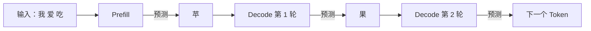
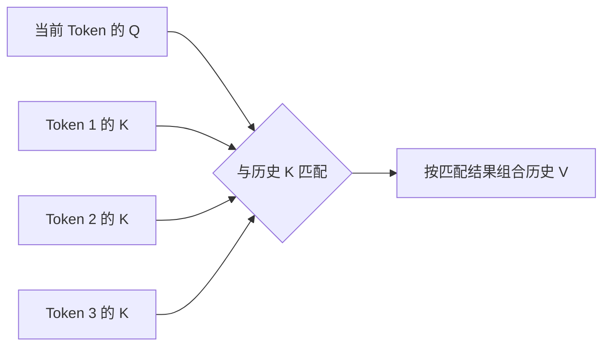
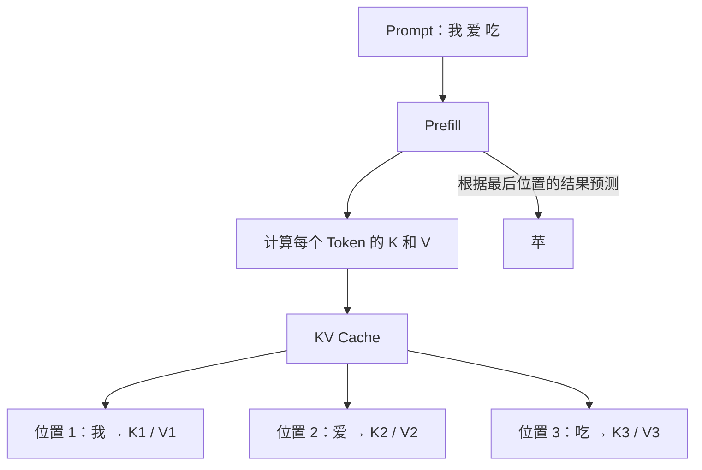
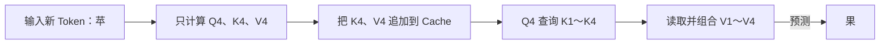
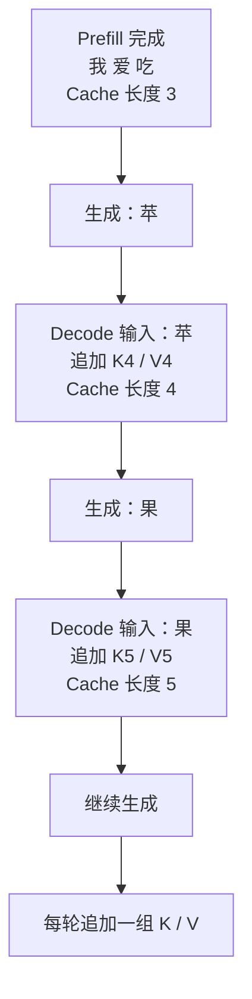
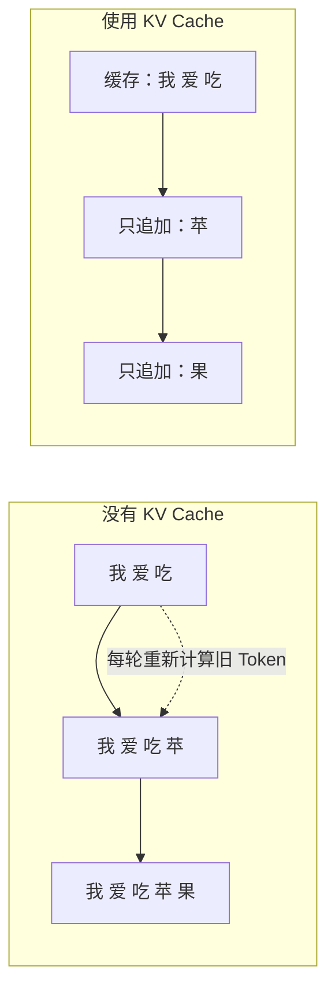
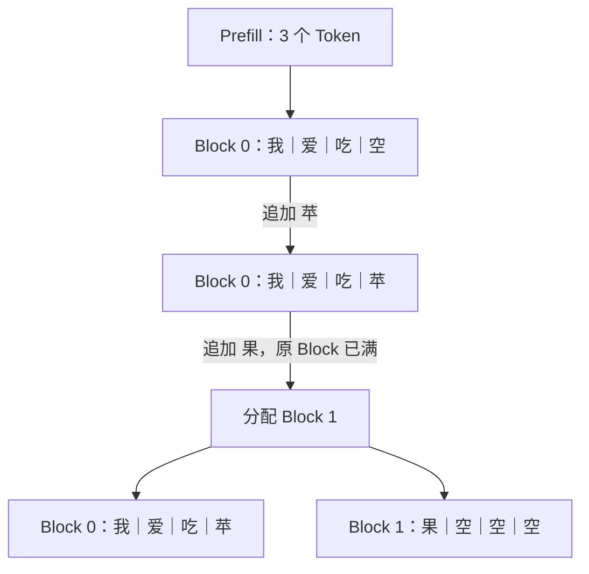
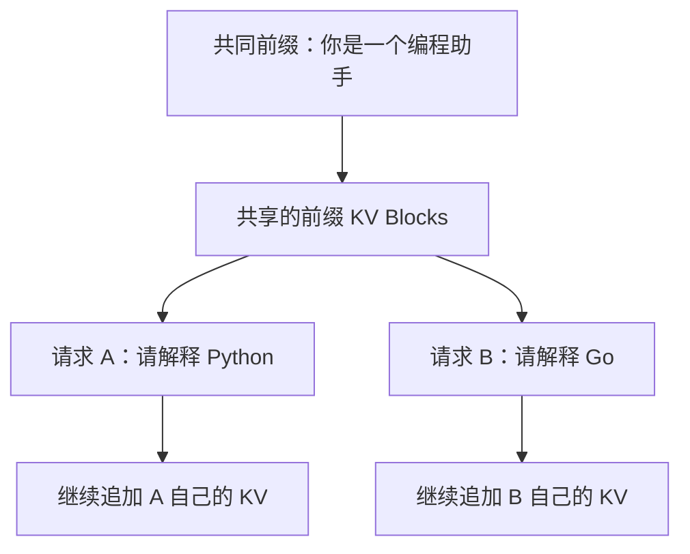
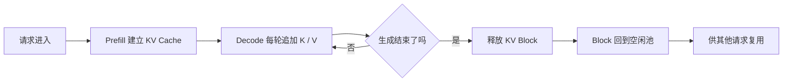

## 问题
举例子说明，llm 推理的过程中，kv cache 是如何增长的，以及如何被复用的。我没有太多 llm 推理的知识储备，请以通俗易懂，并结合实例的方式给我讲解。

## 一、先从一句话生成开始

假设我们给模型输入三个 Token：

```text
我｜爱｜吃
```

模型准备继续生成：

```text
苹｜果
```

这里先把每个汉字看作一个 Token。真实模型如何切分 Token 取决于 Tokenizer，但不影响我们理解 KV Cache。

整个推理过程可以简化为：



Prefill 负责一次处理已有的输入 Token。之后，模型每轮接收刚生成的一个 Token，再预测下一个 Token，这个逐轮生成过程叫作 Decode。

KV Cache 的核心作用是：**把已经处理过的 Token 留下来的 K 和 V 保存起来，下一轮直接读取，不再重复计算。**

## 二、K 和 V 到底是什么

在 Transformer 的 Attention 中，每个 Token 都会产生三类向量：Q、K 和 V。

为了建立第一版心智模型，可以暂时这样理解：

- Q（Query）：当前 Token 想查询什么；
- K（Key）：过去每个 Token 可以通过什么特征被找到；
- V（Value）：找到这个 Token 后，可以取出什么信息。

可以把 Attention 类比成查资料：

```text
Q：我现在想找什么资料？
K：每份资料的索引标签是什么？
V：每份资料的具体内容是什么？
```

当前 Token 的 Q 会与所有历史 Token 的 K 进行匹配，再根据匹配结果读取相应的 V。



当模型继续生成新 Token 时，过去 Token 的 K 和 V 不会发生变化，所以可以保存并反复使用。过去的 Q 不需要保存，因为下一轮使用的是新 Token 自己的 Q。这就是它叫 KV Cache，而不是 QKV Cache 的原因。

## 三、KV Cache 第一次是怎样产生的

### 3.1 Prefill：一次处理 Prompt

输入 Prompt 是：

```text
Token 1：我
Token 2：爱
Token 3：吃
```

在 Prefill 阶段，模型一次处理这三个 Token。在模型的每一层 Attention 中，都会为它们计算 K 和 V：

```text
我  → K1、V1
爱  → K2、V2
吃  → K3、V3
```

计算结束后，KV Cache 中已经有三个位置：

```text
位置       1        2        3
Token      我       爱       吃
K Cache    K1       K2       K3
V Cache    V1       V2       V3
```



Prefill 不只是建立缓存，还会得到第一个待生成 Token 的概率分数。经过采样后，我们假设模型选择了“苹”。

此时要注意：“苹”刚刚被选出来，还没有作为输入再次经过模型，所以它自己的 K 和 V 还没有加入缓存。当前 KV Cache 长度仍然是 3。

## 四、Decode 时 KV Cache 如何增长

### 4.1 第一轮 Decode：输入“苹”

第一轮 Decode 把刚刚生成的“苹”作为新输入。模型只需要为这个新 Token 计算：

```text
苹 → Q4、K4、V4
```

然后发生两件事：

1. 把 K4、V4 追加到 KV Cache；
2. 用 Q4 查询缓存中的 K1～K4，并读取 V1～V4。

缓存由 3 个位置增长到 4 个位置：

```text
位置       1        2        3        4
Token      我       爱       吃       苹
K Cache    K1       K2       K3       K4
V Cache    V1       V2       V3       V4
```



这一步最后预测出“果”。

### 4.2 第二轮 Decode：输入“果”

下一轮把“果”作为输入，只为它计算新的 Q、K、V：

```text
果 → Q5、K5、V5
```

然后把 K5、V5 追加到缓存：

```text
位置       1        2        3        4        5
Token      我       爱       吃       苹       果
K Cache    K1       K2       K3       K4       K5
V Cache    V1       V2       V3       V4       V5
```

Q5 会查询 K1～K5，并读取 V1～V5，用来预测下一个 Token。

后续每生成一个 Token，都重复相同过程。因此，对单个请求来说：

```text
KV Cache 长度 = Prompt Token 数量 + 已经进入 Decode 的生成 Token 数量
```

整个增长过程如下：



## 五、KV Cache 复用了什么

### 5.1 没有 KV Cache

如果没有 KV Cache，每次生成新 Token，都需要重新处理当前的全部文本：

```text
预测“苹”：重新计算 我、爱、吃 的 K 和 V
预测“果”：重新计算 我、爱、吃、苹 的 K 和 V
预测下一个：重新计算 我、爱、吃、苹、果 的 K 和 V
```

“我、爱、吃”在每轮都没有变化，但它们的 K 和 V 会被反复计算。

### 5.2 有 KV Cache

有了 KV Cache 后：

```text
Prefill：计算并保存 我、爱、吃 的 K 和 V
Decode 1：复用前三个位置，只计算 苹 的 K 和 V
Decode 2：复用前四个位置，只计算 果 的 K 和 V
```



因此，KV Cache 复用的是历史 Token 在每一层 Attention 中已经计算好的 K 和 V。

但这不代表每轮 Decode 的工作量完全不变。新 Token 的 Q 仍然需要读取并关注前面所有 K 和 V。随着序列变长，每轮需要读取的 KV Cache 也会变多。KV Cache 省掉的是历史 K、V 的重复计算，不是让历史信息完全不再参与计算。

## 六、KV Cache 在显存中如何增长

KV Cache 不是一份简单的文字列表，而是模型每一层保存的一组 Tensor。它通常与以下几个维度有关：

- 模型层数；
- K 和 V 两份数据；
- KV Head 数量；
- 每个 Head 的维度；
- 当前序列长度；
- 每个数值占用的字节数。

可以用下面的近似公式理解单个请求的 KV Cache 大小：

```text
KV Cache 大小
≈ 2 × 模型层数 × 序列长度 × KV Head 数 × Head 维度 × 每个数值的字节数
```

公式开头的 2，代表 K 和 V 两份数据。

### 6.1 一个可以直接计算的小模型

假设有一个用于理解概念的小模型：

- 2 层 Transformer；
- 2 个 KV Head；
- 每个 Head 维度为 4；
- 使用 FP16，每个数值占 2 字节。

每增加一个 Token，需要新增的 KV Cache 是：

```text
2（K 和 V）
× 2（模型层数）
× 2（KV Head 数）
× 4（Head 维度）
× 2 字节
= 64 字节
```

因此，前面的生成过程对应：

| 阶段 | Cache 中的 Token 数 | KV Cache 大小 |
| --- | ---: | ---: |
| Prefill：我、爱、吃 | 3 | 192 字节 |
| Decode 输入“苹”后 | 4 | 256 字节 |
| Decode 输入“果”后 | 5 | 320 字节 |

这个模型是为了方便计算而虚构的小例子。真实大模型的层数、Head 数和维度更大，所以 KV Cache 会占用大量显存。

## 七、vLLM 为什么要把 KV Cache 切成 Block

到目前为止，我们把 KV Cache 画成了一条连续增长的数组。但推理引擎要同时服务许多请求，而每个请求的 Prompt 长度和生成长度都不相同。如果为每个请求提前保留一大块连续显存，容易产生浪费。

vLLM 的做法是把 KV Cache 显存切成固定大小的 Block。为了便于理解，假设一个 Block 只能保存 4 个 Token：

```text
Block 0：[我][爱][吃][空]
```

生成“苹”并进入 Decode 后，填满 Block 0：

```text
Block 0：[我][爱][吃][苹]
```

“果”进入下一轮 Decode 时，Block 0 已经没有空间，于是再分配一个 Block：

```text
Block 0：[我][爱][吃][苹]
Block 1：[果][空][空][空]
```



Block Manager 在 CPU 内存中记录：

- 一个请求当前使用哪些 Block；
- 哪些 Block 空闲；
- 哪些 Block 已经分配；
- 某段前缀对应哪个 Block。

真正的 K 和 V Tensor 数据位于 GPU 显存，Block Manager 保存的是这些显存位置的管理信息。

## 八、跨请求的前缀复用

前面讲的是同一个请求在多轮 Decode 中复用自己的 KV Cache。除此之外，如果推理引擎支持 Prefix Cache，不同请求还可能复用相同前缀的 KV Cache。

例如，两个请求使用完全相同的系统提示词：

```text
请求 A：你是一个编程助手｜请解释 Python
请求 B：你是一个编程助手｜请解释 Go
```

两者的共同前缀是：

```text
你是一个编程助手
```

第一次处理请求 A 时，引擎计算并保存这个前缀的 KV。请求 B 到来后，如果相同前缀仍在缓存中，就可以直接引用已有 Block，只计算后面不同的部分。



这种跨请求复用需要前缀 Token 完全相同，而且缓存仍然存在。模型、计算方式或前缀发生变化时，不能直接复用。如果显存空间不足，旧的缓存也可能被回收，之后再次出现相同前缀时就需要重新计算。

## 九、请求结束后发生什么

当一个请求生成结束后，它占用的 KV Cache Block 就不再需要继续保留。推理引擎会从逻辑上释放这些 Block，把它们放回空闲池，供后续请求覆盖和复用。

因此，完整生命周期是：



释放 Block 不一定意味着立刻把整块显存清零。只要管理器把它标记为可重新分配，后续请求就可以用新数据覆盖原来的内容。

## 十、KV Cache 不是什么

为了避免混淆，还需要明确：

- KV Cache 不是模型参数。模型参数在不同请求之间保持不变，而 KV Cache 是每个序列推理过程中产生的中间结果。
- KV Cache 不是生成出来的文本。文本只用于说明位置，实际缓存的是 K、V Tensor。
- KV Cache 不保存过去的 Q，因为未来的新 Token 不需要再次使用过去的 Q。
- KV Cache 不会让 Attention 完全不看历史。当前 Q 仍然需要读取历史 K 和 V。
- KV Cache 主要减少重复计算，但会消耗显存；序列越长，并发请求越多，占用的显存越大。

## 十一、结合 nano-vLLM 看 KV Cache 如何组织、检索和更新

前面的例子把一个请求的 KV Cache 画成了一条连续数组。但在真实推理中，多个请求会同时生成，而且长度不同。nano-vLLM 的关键做法是：

```text
所有请求共享一块 GPU KV Cache 大池
每个请求通过 block_table 记录自己使用哪些 Block
Attention 通过 block_table 检索历史 K/V
新 Token 通过 slot_mapping 写入下一个 slot
```

下面用一个更小的 `block_size=4` 例子说明。真实项目默认的 Block Size 是 256，这里缩小只是为了便于画图。

### 11.1 三个不同请求如何放进同一个 KV Cache 池

假设有三个请求：

```text
请求 A： [A0, A1, A2, A3, A4, A5]
请求 B： [B0, B1, B2]
请求 C： [C0, C1, C2, C3, C4]
```

它们分别需要：

```text
A：ceil(6 / 4) = 2 个 Block
B：ceil(3 / 4) = 1 个 Block
C：ceil(5 / 4) = 2 个 Block
```

假设 BlockManager 从空闲池中分配了：

```text
请求 A：block_table = [7, 2]
请求 B：block_table = [5]
请求 C：block_table = [1, 9]
```

逻辑上的 Token 顺序和 GPU 显存中的实际位置就变成：

```text
请求 A：A0 A1 A2 A3 | A4 A5       → Block 7 | Block 2
请求 B：B0 B1 B2    |              → Block 5
请求 C：C0 C1 C2 C3 | C4           → Block 1 | Block 9
```

这里的 `7、2、5、1、9` 不是 Token，也不是显存地址，而是 KV Cache 大 Tensor 的 Block 下标。不同请求的 Block 可以交错分配，逻辑上仍然属于各自的连续序列。

### 11.2 GPU 上的 KV Cache Tensor 长什么样

`ModelRunner.allocate_kv_cache()` 一次性创建：

```python
self.kv_cache = torch.empty(
    2,
    num_hidden_layers,
    num_kvcache_blocks,
    block_size,
    num_kv_heads,
    head_dim,
)
```

可以把它理解为：

```text
kv_cache[K 或 V][第几层][物理 Block][Block 内 Token][KV Head][Head Dimension]
```

对于某一层 Attention，`module.k_cache` 和 `module.v_cache` 的形状大致是：

```text
[物理 Block 数, Block Size, KV Head 数, Head Dimension]
```

因此请求 A 的第 5 个 Token：

```text
逻辑位置 5
→ 第 1 个逻辑 Block
→ block_table[1] = 2
→ 物理 Block 2 的 offset 1
→ k_cache[2, 1] / v_cache[2, 1]
```

请求 C 的第 4 个 Token 虽然同样是它自己的逻辑位置 4，但它会被映射到：

```text
block_table[1] = 9
→ k_cache[9, 0] / v_cache[9, 0]
```

这就是“逻辑位置连续，物理 Block 可以不连续”。

### 11.3 Prefill 时如何把 K/V 写入对应位置

Prefill 阶段，三个请求的 Token 可以拼接成一个 Batch：

```text
input_ids = [A0, A1, A2, A3, A4, A5,
             B0, B1, B2,
             C0, C1, C2, C3, C4]
```

此时还需要记录请求边界：

```text
cu_seqlens_q = [0, 6, 9, 14]
cu_seqlens_k = [0, 6, 9, 14]
```

边界表只解决“拼接数组中哪一段属于哪个请求”；它还没有告诉 Kernel 这些 Token 应该写入 KV Cache 的哪个物理 Block。写入位置由 `slot_mapping` 解决：

```text
请求 A：
A0 → 7×4+0 = 28
A1 → 7×4+1 = 29
...
A3 → 7×4+3 = 31
A4 → 2×4+0 =  8
A5 → 2×4+1 =  9

请求 B：
B0 → 5×4+0 = 20
B1 → 5×4+1 = 21
B2 → 5×4+2 = 22

请求 C：
C0 → 1×4+0 =  4
...
C3 → 1×4+3 =  7
C4 → 9×4+0 = 36
```

在每一层 Attention 中，QKV 投影先计算出当前 Batch 的 `k` 和 `v`。随后 `store_kvcache_kernel` 对每个 Token 执行：

```python
slot = slot_mapping[idx]
cache_offset = slot * (num_kv_heads * head_dim)
k_cache[cache_offset:...] = key[idx]
v_cache[cache_offset:...] = value[idx]
```

所以一次 Prefill 同时完成了两件事：

```text
cu_seqlens：告诉 Attention 每个请求的边界
slot_mapping：告诉 KV Cache 每个新 K/V 应该写到哪里
```

### 11.4 Attention 如何检索一个请求的历史 KV

以请求 A 为例，它的 `block_table` 是：

```text
[7, 2]
```

Attention 需要读取请求 A 的逻辑位置 0～5 时，会按照下面的规则查找：

```text
逻辑位置 0～3
    logical_block = 0
    physical_block = block_table[0] = 7
    读取 k_cache[7, 0:4] 和 v_cache[7, 0:4]

逻辑位置 4～5
    logical_block = 1
    physical_block = block_table[1] = 2
    读取 k_cache[2, 0:2] 和 v_cache[2, 0:2]
```

请求 B 的读取则完全不同：

```text
逻辑位置 0～2 → block_table[0] = 5
             → 读取 k_cache[5, 0:3] / v_cache[5, 0:3]
```

三个请求可以在同一个 Attention Kernel 中处理。Kernel 通过请求自己的 `block_table` 和有效长度，确保 A 只读取 Block 7、2，B 只读取 Block 5，C 只读取 Block 1、9。

Prefill 阶段主要通过 `cu_seqlens_q` 和 `cu_seqlens_k` 处理变长请求；当存在已经缓存的前缀时，`block_tables` 还会传给 `flash_attn_varlen_func`，让它从已有物理 Block 中读取历史 K/V。

### 11.5 Decode 时如何更新一个新的 Token

假设 Prefill 结束后，模型为请求 A 生成了新 Token `A6`。这个 Token 刚被预测出来时，它还没有 K/V；下一轮 Decode 才会把它作为输入。

此时请求 A 的逻辑序列变成：

```text
A0 A1 A2 A3 | A4 A5 A6
Block 7     | Block 2
```

请求 A 的最后一个 Block 是物理 Block 2，Block 内已经有两个 Token，因此新 Token `A6` 的 slot 是：

```text
physical_block × block_size + block_offset
= 2 × 4 + 2
= 10
```

`prepare_decode()` 会构造：

```python
slot_mapping = [10, ...]
context_lens = [7, ...]
block_tables = [[7, 2], ...]
```

这一轮所有请求各输入一个新 Token：

```text
input_ids = [A6, B3, C5]
```

它们的 K/V 计算完成后，分别写入各自的 slot：

```text
A6 → 请求 A 的下一个 slot
B3 → 请求 B 的下一个 slot，可能触发新 Block
C5 → 请求 C 的下一个 slot
```

写入完成后，`flash_attn_with_kvcache` 根据每条请求的 `context_lens` 和 `block_tables` 读取历史 K/V，再用这三个新 Token 各自的 Q 计算 Attention。整个 Batch 只需要一次 Decode 前向，但每条请求读取的是自己的 KV Cache。

### 11.6 什么时候增加新的 Block

Block 不是每个 Token 都新分配。只有当前一个 Block 已经装满，序列即将进入下一个 Block 时，`BlockManager.may_append()` 才会领取新的物理 Block。

例如 Block Size 为 4：

```text
序列长度 1～4  → 使用 1 个 Block
序列长度 5    → 增加第 2 个 Block
序列长度 6～8  → 继续使用第 2 个 Block
序列长度 9    → 增加第 3 个 Block
```

`Sequence.block_table` 记录的是“已经领取的物理 Block”；`num_cached_tokens` 记录已经真正写入并可复用的 Token 数；`num_scheduled_tokens` 记录本轮计划计算的 Token 数。调度器通过这几个状态区分：

```text
已经缓存的历史 KV
本轮需要新计算和写入的 KV
尚未进入执行的 Token
```

### 11.7 请求结束后为什么可以直接复用 Block

请求结束时，nano-vLLM 不释放整个 `kv_cache` Tensor，而是：

```python
block.ref_count -= 1
```

当引用计数变为 0，Block ID 回到 `free_block_ids`。下一条请求可能重新获得同一个 Block：

```text
旧请求：Block 2 保存 A4、A5、A6
旧请求结束：Block 2 回到空闲池
新请求：领取 Block 2
新 K/V：覆盖 Block 2 的有效 slot
```

旧数据不需要先清零，因为新的请求会通过自己的 `block_table` 和 `context_lens` 决定读取范围。只要映射和有效长度正确，Attention 就不会读取旧请求的无效区域。

### 11.8 把几个表放在一起理解

在 nano-vLLM 中，至少要区分下面四种信息：

| 信息 | 作用 | 例子 |
| --- | --- | --- |
| `input_ids` | 本轮真正送入模型的 Token | `[A6, B3, C5]` |
| `cu_seqlens` | Prefill 时拼接数组中的请求边界 | `[0, 6, 9, 14]` |
| `block_table` | 逻辑 Block 到物理 Block 的映射 | `A: [7, 2]` |
| `slot_mapping` | 本轮新 K/V 的写入位置 | `A6 → 10` |

可以把它们类比成：

```text
input_ids    = 货物
cu_seqlens   = 每个订单在货架上的起止范围
block_table  = 订单使用哪些货架分区
slot_mapping = 当前新货物应该放进哪个具体格子
```

最关键的一点是：`cu_seqlens` 负责区分请求，`block_table` 负责定位历史 KV，`slot_mapping` 负责写入新 KV。三者配合起来，才实现了“多个不同请求共享一次 GPU 计算，但彼此不会读错 KV Cache”。

## 十二、总结

用“我爱吃苹果”的例子，可以把 KV Cache 的完整过程总结为：

1. Prefill 一次处理“我、爱、吃”，计算并保存三组 K 和 V。
2. 模型预测出“苹”，此时缓存长度仍为 3。
3. 第一轮 Decode 输入“苹”，只计算并追加 K4、V4，再复用 K1～K4、V1～V4 预测“果”。
4. 第二轮 Decode 输入“果”，只计算并追加 K5、V5，再复用全部历史 KV。
5. 后续每轮 Decode 都新增一个 Token 对应的 K 和 V，因此 KV Cache 随序列长度线性增长。
6. vLLM 使用固定大小的 Block 管理这些数据，让不同长度的请求能够更灵活地使用显存。
7. 请求结束后，Block 被释放回空闲池；相同前缀在条件满足时还可以跨请求复用。

最值得记住的一句话是：**KV Cache 用显存保存历史 Token 的 K 和 V，以空间换计算时间；每轮只新增当前 Token 的 KV，但仍然需要读取已有缓存完成 Attention。**
