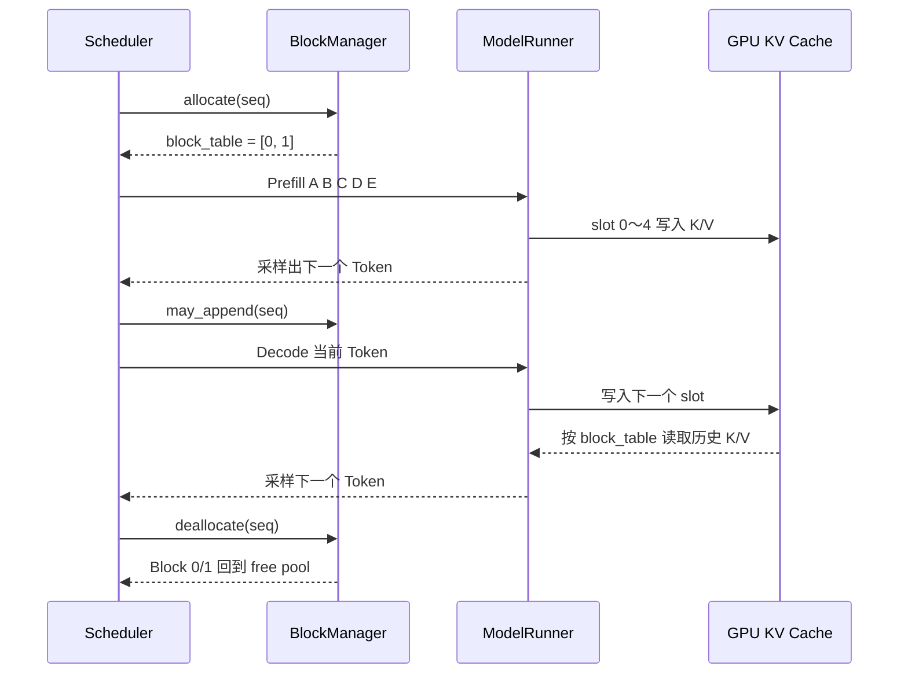

## 问题

上一篇文章用向量加法建立了 CUDA 的基本心智模型：CPU 进程通过 CUDA Context 和 Stream 提交 Kernel，GPU 再把 Kernel 展开成 Block、Warp 和 Thread 执行。

这一篇继续追问一个更接近大模型推理的问题：

> 一个推理引擎如何在有限的 GPU 显存里，同时放下模型参数、运行时临时张量和许多请求不断增长的 KV Cache？

我们不从一个完整的 vLLM 开始，而是依托 `tmp/nano-vllm` 这个约 1,200 行的简化实现。它虽然省略了很多工程细节，但保留了显存管理最重要的骨架：

```text
模型权重 → 预热测量 → 计算 KV Cache 容量 → 预分配显存池
请求序列 → BlockManager 分配逻辑 Block → Attention 按 slot 写入 K/V
请求结束 → 引用计数归零 → Block 回到空闲池
```

本文重点是“显存怎么被规划、定位、复用”，不是 CUDA 驱动内部的物理页表实现。这里的 Block 也首先是推理引擎的逻辑 Block；GPU 是否把它映射到连续的物理显存，由 PyTorch/CUDA allocator 和驱动负责。

## 一、先区分三种“内存”

阅读代码前，先把几个容易混淆的概念分开。

### 1.1 模型权重

`ModelRunner.__init__` 中先创建模型，再调用：

```python
torch.set_default_dtype(hf_config.dtype)
torch.set_default_device("cuda")
self.model = Qwen3ForCausalLM(hf_config)
load_model(self.model, config.model)
```

`torch.set_default_device("cuda")` 使模型参数直接在 GPU 上创建。`load_model` 用 `safe_open(..., "cpu")` 从 safetensors 读取权重，再通过 `weight_loader` 拷贝到模型参数中。

可以把这一步理解为：

```text
磁盘上的 safetensors
        ↓ 读取
CPU 临时 Tensor
        ↓ copy_
GPU 上的模型 Parameter
```

CPU 临时 Tensor 可能在拷贝后释放，但 GPU 上的模型参数要一直保留，因为每一次请求都要使用它们。模型越大，权重占用的显存越多；Tensor Parallelism 开启后，每个 rank 通常只持有自己负责的参数分片。

### 1.2 运行时临时张量

一次前向计算还会产生输入 ID、位置、hidden states、Q/K/V、MLP 中间结果和 logits 等张量。这些张量的生命周期通常只覆盖一次 `run` 或一次前向过程。

它们有两个特点：

1. 会随 batch token 数、hidden size 和算子实现变化；
2. 不需要像权重和 KV Cache 那样跨请求长期保存。

因此，推理引擎必须先估计这类临时开销，再决定还剩多少显存可以给 KV Cache。

### 1.3 KV Cache

KV Cache 是请求生成过程中长期增长的中间结果。上一篇文章已经说明，每个已经处理的 Token，在每一层 Attention 中都会留下 K 和 V。nano-vLLM 不为每个请求单独创建一组变长 Tensor，而是建立一块共享的 KV Cache 显存池，所有请求从池中领取固定大小的 Block。

```text
GPU 显存
├── 模型权重：长期存在
├── KV Cache 池：预分配，按 Block 使用
└── 临时张量 / CUDA Graph 等：运行时产生
```

这正是“显存管理”和“Tensor 是否存在”的区别：BlockManager 管理的是使用权和索引，Attention 操作的才是 GPU 上真实的 K/V 数据。

## 二、nano-vLLM 在启动时如何规划显存

显存管理的起点在 `ModelRunner.allocate_kv_cache()`。

### 2.1 先 warmup，再测量开销

初始化顺序是：

```text
创建模型并加载权重
        ↓
warmup_model()
        ↓
allocate_kv_cache()
        ↓
可选：capture_cudagraph()
```

`warmup_model()` 会先清理 PyTorch 的缓存 allocator，并重置 peak memory 统计：

```python
torch.cuda.empty_cache()
torch.cuda.reset_peak_memory_stats()
```

然后构造接近最大批量的 Prefill 输入并执行一次 `run`。这一步不是为了得到有意义的文本，而是为了让模型在真正服务前提前触发：

- 前向计算需要的临时 Tensor；
- 算子第一次运行的额外分配；
- 可能的 kernel workspace；
- PyTorch / FlashAttention 等组件的初始化开销。

warmup 结束后再次 `empty_cache()`，但要注意：`empty_cache()` 只会把 PyTorch allocator 中当前没有被 Tensor 引用的缓存块还给 CUDA，它不会释放仍被模型引用的参数，也不会凭空减少仍在使用的内存。

### 2.2 显存预算公式

代码读取两组信息：

```python
free, total = torch.cuda.mem_get_info()
used = total - free
peak = torch.cuda.memory_stats()["allocated_bytes.all.peak"]
current = torch.cuda.memory_stats()["allocated_bytes.all.current"]
```

然后计算可以放多少个 KV Block：

```python
config.num_kvcache_blocks = (
    int(total * config.gpu_memory_utilization - used - peak + current)
    // block_bytes
)
```

把它改写成更容易理解的形式：

```text
可给 KV Cache 的预算
≈ total × gpu_memory_utilization - 启动时已有占用 - warmup 的额外峰值
```

其中 `- peak + current` 的意义是：

```text
warmup 期间临时出现过的额外峰值 = peak - current
```

所以代码预留了这部分余量，避免 KV Cache 把显存塞满后，下一次前向因为临时张量无法分配而 OOM。

这不是精确的显存隔离机制，而是启动时的一次容量估算。其他进程占用显存、allocator 碎片、算子工作区变化等因素，都可能使实际可用量和估算不同。

### 2.3 一个数字例子

假设某张 GPU 总显存为 8 GiB，配置 `gpu_memory_utilization=0.9`，模型权重和启动状态已经占用约 2 GiB，warmup 额外峰值约 0.5 GiB：

```text
KV Cache 预算 ≈ 8 × 0.9 - 2 - 0.5 = 4.7 GiB
```

如果每个 KV Block 是 2 MiB，那么最多大约：

```text
4.7 GiB ÷ 2 MiB ≈ 2406 个 Block
```

实际项目中 `block_bytes` 会根据模型结构和 dtype 计算，而不是手写一个常数。

## 三、一个 KV Block 究竟有多大

`allocate_kv_cache()` 中的核心公式是：

```python
num_kv_heads = hf_config.num_key_value_heads // self.world_size
head_dim = getattr(
    hf_config,
    "head_dim",
    hf_config.hidden_size // hf_config.num_attention_heads,
)
block_bytes = (
    2 * hf_config.num_hidden_layers
    * self.block_size * num_kv_heads * head_dim
    * hf_config.dtype.itemsize
)
```

对应的数学公式是：

```text
一个 Block 的字节数
= 2（K、V）
× 层数
× Block 中的 Token 数
× 每个 rank 的 KV Head 数
× Head Dimension
× 每个元素的字节数
```

例如假设：

```text
层数 = 2
Block Size = 256 Token
KV Head = 2
Head Dimension = 4
dtype = FP16（2 字节）
```

那么一个 Block 跨所有层的大小为：

```text
2 × 2 × 256 × 2 × 4 × 2 = 8192 字节
```

这和上一篇“每个 Token 新增一组 K/V”的公式一致，只是这里把 256 个 Token 一次性打包了。

`num_kv_heads` 要除以 `world_size`，因为 Tensor Parallelism 下每个进程只负责本 rank 的 KV Head。若有 2 个 rank，则每个 rank 的 KV Cache 大小大约是完整模型的一半；每个 rank 都会在自己的 GPU 上建立自己的 KV Cache Tensor。

## 四、KV Cache 不是不断 malloc，而是一整块池

计算出 Block 数后，nano-vLLM 一次性执行：

```python
self.kv_cache = torch.empty(
    2,
    hf_config.num_hidden_layers,
    config.num_kvcache_blocks,
    self.block_size,
    num_kv_heads,
    head_dim,
)
```

它的逻辑形状可以写成：

```text
[K/V, Layer, Block ID, Token Offset, KV Head, Head Dimension]
```

第一维大小为 2：

```text
self.kv_cache[0]  → 所有层的 K Cache
self.kv_cache[1]  → 所有层的 V Cache
```

随后遍历模型中的 Attention 模块，把每一层的切片挂上去：

```python
module.k_cache = self.kv_cache[0, layer_id]
module.v_cache = self.kv_cache[1, layer_id]
```

于是第 `layer_id` 层 Attention 看到的 `k_cache` 实际上是：

```text
[Block ID, Block Size, KV Head, Head Dimension]
```

不同请求共享同一个大 Tensor，但通过不同的 Block ID 使用不同的区域。请求结束时，通常不需要释放或重新创建这个 Tensor，只需把对应的 Block 标记为空闲。

这带来两个好处：

- 避免每生成一个 Token 都向 CUDA allocator 申请显存；
- 所有 Block 的容量固定，分配和回收可以变成简单的整数 ID 操作。

`torch.empty` 只分配存储，不负责把每个位置初始化为 0。后续只有已经写入有效 K/V 的 slot 才能被 Attention 读取，BlockManager 因此必须严格维护映射关系。

## 五、BlockManager 管理的不是数据，而是“位置表”

`BlockManager` 初始化时建立三类状态：

```python
self.blocks = [Block(i) for i in range(num_blocks)]
self.free_block_ids = deque(range(num_blocks))
self.used_block_ids = set()
```

每个逻辑 `Block` 只保存管理信息：

```python
class Block:
    block_id       # 在 KV Cache 池中的编号
    ref_count      # 有多少序列正在引用它
    hash           # 已填满 Token 的前缀哈希
    token_ids      # 这个 Block 对应的 Token ID
```

真实 K/V 数据不在 `Block.token_ids` 里。`token_ids` 只是 CPU 侧用于判断前缀是否相同的元数据；真实向量仍然在 `self.kv_cache` 对应的 GPU slice 中。

可以把一次映射画成：

```text
Sequence A.block_table = [7, 2]

Block ID 7 → kv_cache[..., 7, :, :, :]
Block ID 2 → kv_cache[..., 2, :, :, :]
```

请求的 Token 逻辑上仍然是连续的：

```text
Token 0 ... 255 | Token 256 ... 511
```

但它们在物理 KV 池中可以位于完全不相邻的 Block 7 和 Block 2。这就是分页式 KV Cache 的核心：逻辑连续，物理上可以离散。

## 六、Prefill 时如何分配和填充 Block

假设 `block_size=4`，请求 Token 为：

```text
[A, B, C, D, E, F]
```

`Sequence.num_blocks` 使用向上取整：

```python
(num_tokens + block_size - 1) // block_size
```

因此需要 2 个 Block：

```text
Block 7：[A][B][C][D]
Block 2：[E][F][空][空]
```

在调度阶段，`BlockManager.allocate()` 把 Block ID 放进：

```python
seq.block_table = [7, 2]
```

但此时并不是所有 K/V 都已经写入。`ModelRunner.prepare_prefill()` 会根据本轮实际计算的 Token 范围构造 `slot_mapping`。例如本轮要写入 Token A～F，映射可以抽象为：

```text
A → 7 × 4 + 0 = 28
B → 7 × 4 + 1 = 29
C → 7 × 4 + 2 = 30
D → 7 × 4 + 3 = 31
E → 2 × 4 + 0 =  8
F → 2 × 4 + 1 =  9
```

这里的 slot 是“跨 Block 的一维槽位编号”。因为每层的 `k_cache` 形状是 `[Block, BlockSize, KVHead, HeadDim]`，slot 乘以 `KVHead × HeadDim` 后就可以定位到具体向量。

Attention 中的 Triton kernel 正在做这件事：

```python
slot = tl.load(slot_mapping_ptr + idx)
cache_offsets = slot * D + tl.arange(0, D)
tl.store(k_cache_ptr + cache_offsets, key)
tl.store(v_cache_ptr + cache_offsets, value)
```

对第 `idx` 个新 Token：

1. 取出它对应的 slot；
2. 从当前前向结果中读取 K 和 V；
3. 写入该 slot 对应的显存位置。

所以，`slot_mapping` 是“新算出来的 K/V 应写到哪里”，而 `block_table` 是“一个请求的逻辑 Token Block 依次对应哪些物理 Block”。两者不要混为一谈。

## 七、Decode 时为什么只需追加一个 slot

Prefill 可能一次处理几十到几千个 Token；Decode 通常每个请求每轮只输入一个新 Token。

`prepare_decode()` 为每个序列准备：

```python
input_ids.append(seq.last_token)
positions.append(len(seq) - 1)
context_lens.append(len(seq))
slot_mapping.append(
    seq.block_table[-1] * self.block_size
    + seq.last_block_num_tokens - 1
)
```

例如当前序列已经有 5 个 Token，Block Size 为 4：

```text
Block 7：[T0][T1][T2][T3]
Block 2：[T4][空][空][空]
```

下一轮 Decode 输入 T4 对应的新计算结果时，写入位置是：

```text
2 × 4 + 1 = 9
```

注意 `seq.last_token` 是当前模型要处理的 Token，而 `slot_mapping` 指向它在 KV Cache 中新增的位置。写入完成后，`flash_attn_with_kvcache` 根据：

- `context_lens`：每个请求目前有多长；
- `block_tables`：每个逻辑 Block 对应哪个物理 Block；

读取这个请求的全部历史 K/V，并让新 Token 的 Q 完成 Attention。

当序列长度从 4 增长到 5 时，`Scheduler` 先通过 `can_append()` 判断是否需要新 Block：

```python
len(self.free_block_ids) >= (len(seq) % self.block_size == 1)
```

如果刚好跨过 Block 边界，`may_append()` 才从空闲池领取一个新 Block。也就是说，Decode 阶段绝大多数轮次只是写入已有 Block 的下一个 slot，只有跨边界时才新增 Block。

## 八、调度器如何在显存不足时做选择

`Scheduler.schedule()` 同时受两个预算限制：

```text
max_num_seqs           一轮最多处理多少条序列
max_num_batched_tokens 一轮最多处理多少个 Token
```

### 8.1 Prefill 的分配判断

对于尚未分配 Block 的序列，调度器先调用：

```python
num_cached_blocks = self.block_manager.can_allocate(seq)
```

然后计算真正还需要计算的 Token 数：

```python
num_tokens = seq.num_tokens - num_cached_blocks * self.block_size
```

如果空闲 Block 不够，`can_allocate()` 返回 `-1`，调度器停止继续接纳等待中的请求。这样做的关键是：请求不会被放进一个没有 KV 存储空间的执行批次。

### 8.2 Decode 的分配判断

Decode 阶段先从 `running` 队列取序列。如果没有足够空闲 Block 让它追加，调度器会调用：

```python
self.preempt(seq)
```

`preempt()` 把序列改回 `WAITING`，释放它当前持有的所有 Block，再放回等待队列。这里的“抢占”不是把 KV Cache 换到 CPU，而是丢弃这条序列当前的 KV Block，之后重新 Prefill。

因此 nano-vLLM 的抢占策略很简单，但代价也很明确：节省显存，增加重复计算。更成熟的引擎可能会把 KV Cache 换出到 CPU 或其他存储，但这份代码没有实现这一层。

### 8.3 请求结束如何释放

生成完成后，`postprocess()` 调用：

```python
self.block_manager.deallocate(seq)
```

`deallocate()` 反向遍历 `seq.block_table`，每个 Block 的引用计数减一；只有计数变成 0 时，才放回 `free_block_ids`。它不会销毁 `self.kv_cache`，也不会逐字节清零 GPU 显存。

```text
请求结束
  → ref_count -= 1
  → ref_count == 0
  → Block ID 进入 free_block_ids
  → 后续请求覆盖同一批 slot
```

## 九、Prefix Cache：Block 为什么需要 hash 和引用计数

nano-vLLM 还实现了一个简化的前缀缓存。`compute_hash()` 会把当前 Block 的 Token ID 和前一个 Block 的 hash 一起计算：

```python
h = self.compute_hash(token_ids, h)
```

因此，一个 Block 的标识不仅取决于自身 Token，还取决于它前面整个前缀。两个请求只有在对应的 Token 前缀完全一致时，才可能命中同一条 hash 链。

`can_allocate()` 会检查完整的历史 Block 是否已经存在，并统计 `num_cached_blocks`。如果命中：

```text
请求 B.block_table = [已有 Block 7, 已有 Block 2, 新 Block 9]
```

请求 B 可以共享前两个 Block 的 K/V，只为不同的后缀分配新 Block 并计算新的 K/V。

`ref_count` 用来保护共享 Block：

```text
请求 A 引用 Block 7 → ref_count = 1
请求 B 也引用 Block 7 → ref_count = 2
请求 A 结束       → ref_count = 1，不能回收
请求 B 结束       → ref_count = 0，回到空闲池
```

`hash_blocks()` 只对已经被本轮计算完整的 Block 建立 hash 映射。最后一个未填满的 Block 不能过早当作可复用的完整前缀，否则另一个请求可能误读其中尚未写入的 slot。

这解释了为什么 Prefix Cache 不只是一个 Python 字典：它必须同时维护 Token 前缀、GPU Block、引用计数和回收时机。

## 十、`block_table` 和 Attention 是怎样接上的

在 `prepare_block_tables()` 中，所有请求的 Block Table 被整理成一个二维 Tensor：

```text
请求 A：[7, 2, 9]
请求 B：[4, 1, -1]
```

不同长度的请求通过 `-1` padding 成相同宽度，再拷贝到 GPU。这个表不是 K/V 数据，而是 GPU kernel 查找 K/V 的页表。

Prefill 阶段主要使用：

```python
flash_attn_varlen_func(..., block_table=context.block_tables)
```

Decode 阶段使用：

```python
flash_attn_with_kvcache(
    ...,
    cache_seqlens=context.context_lens,
    block_table=context.block_tables,
)
```

可以把 Decode 的一次读取想成：

```text
请求 B 的逻辑 Token 0～3 → block_table[B][0] = 4
请求 B 的逻辑 Token 4～7 → block_table[B][1] = 1
请求 B 的逻辑 Token 8～   → block_table[B][2] = -1 或尚未使用
```

Attention kernel 根据逻辑位置计算 Block 序号，再查表得到物理 Block ID，最后读取对应 K/V。于是模型不需要知道这些 K/V 在显存池中是否连续。

## 十一、CUDA Graph 也会消耗显存

如果没有设置 `enforce_eager=True`，初始化 KV Cache 后还会执行 `capture_cudagraph()`。它为多个 batch size 预先准备输入、位置、slot mapping、context length、block table 和输出 Tensor：

```python
self.graph_bs = [1, 2, 4, 8] + list(range(16, max_bs + 1, 16))
```

每个 batch size 都会进行 warmup 和 graph capture。捕获后的 Decode 可以通过 `graph.replay()` 重放，减少动态 launch 开销，但这些 graph 的输入输出缓冲区和 CUDA graph memory pool 也会占用显存。

这也是代码把 warmup 放在 `allocate_kv_cache()` 之前的原因之一：先测量已知的模型运行时开销，再规划 KV Cache；不过 CUDA Graph 在 KV Cache 之后捕获，因此配置的显存利用率还需要给 graph 留出余量。

当 `enforce_eager=True` 时，代码跳过 graph capture，显存占用和执行路径更容易观察，但可能损失一部分 Decode 性能。

## 十二、用一条请求完整走一遍

假设：

```text
Block Size = 4
可用 Block = [0, 1, 2]
Prompt = [A, B, C, D, E]
```

执行过程可以简化为：



如果之后来了另一个请求：

```text
BlockManager 领取 Block 0/1
新的 K/V 覆盖旧 slot
```

旧数据不需要先清零，因为新的 Attention 只会读取新请求的有效长度和有效 Block Table。真正重要的是不能让新请求的 `context_lens` 或 `block_table` 指向旧请求未覆盖的区域。

## 十三、从源码得到的几个关键结论

### 13.1 显存容量首先由模型结构决定

KV Cache 的容量不是只看“有多少个请求”，还取决于：

```text
层数 × KV Head 数 × Head Dimension × dtype × Block Size
```

GQA/MQA 通过减少 KV Head 数降低每个 Token 的 KV 成本；FP16/BF16 相比 FP32 也会直接减少字节数。

### 13.2 并发和上下文长度共同消耗 KV Cache

粗略地说：

```text
KV Cache 使用量
≈ 所有活动请求的 Block 数之和 × 每个 Block 的字节数
```

一个超长请求可能占满大量 Block；许多短请求则会共同消耗 Block。`max_num_seqs` 限制请求条数，`max_num_batched_tokens` 限制单轮计算量，但二者都不能替代 BlockManager 的实际容量检查。

### 13.3 逻辑释放不等于 cudaFree

请求结束时，nano-vLLM 只是回收 Block ID；KV Cache 大 Tensor 仍然存在。这样下一条请求可以复用同一片显存，避免频繁申请和释放造成延迟与碎片。

### 13.4 PyTorch 的 allocated、reserved 和 GPU free 不是一回事

代码同时使用 `torch.cuda.mem_get_info()` 和 `torch.cuda.memory_stats()`，正是因为它们观察的层次不同：

- `mem_get_info()` 反映 CUDA 设备层面还剩多少显存；
- `allocated` 反映当前被 PyTorch Tensor 实际使用的字节；
- allocator 还可能保留已经申请、但当前没有 Tensor 使用的缓存块。

因此，监控中看到的“进程占用”“PyTorch allocated”“reserved”和“设备 free”可能不相等。排查 OOM 时不能只看一个数字。

### 13.5 Block Size 是空间和效率之间的折中

Block 越大：

```text
管理的 Block 数更少，索引开销更低；
但短请求最后一个 Block 的内部浪费可能更大。
```

Block 越小则相反。nano-vLLM 默认 `kvcache_block_size=256`，并要求它是 256 的倍数；这既影响单 Block 字节数，也影响前缀复用粒度和边界分配频率。

## 十四、把这套实现和上一篇 CUDA 概念对应起来

上一篇里的层次可以这样落到 nano-vLLM：

| CUDA / 推理概念 | nano-vLLM 中的对应物 |
| --- | --- |
| CUDA Context | 每个 `ModelRunner` 进程与某个 GPU rank 的运行环境 |
| CUDA Stream | PyTorch / FlashAttention / Triton kernel 使用的执行队列 |
| Kernel | `store_kvcache_kernel`、FlashAttention 等 GPU 函数 |
| GPU Tensor | 模型参数、`self.kv_cache`、输入和中间结果 |
| 逻辑内存管理 | `BlockManager`、`free_block_ids`、`block_table` |
| 物理槽位 | `block_id × block_size + token_offset` |
| 请求状态 | `Sequence` 的 Token、缓存长度和运行状态 |
| 批调度 | `Scheduler.schedule()` |

最容易产生误解的是：`BlockManager` 并不替代 CUDA allocator。它在已经分配好的 GPU Tensor 上做二次管理；CUDA 看到的是一个 Tensor 和一系列 kernel，推理引擎看到的是许多可复用的逻辑页。

## 十五、总结：显存管理的完整心智模型

可以把 nano-vLLM 的显存管理记成下面六步：

1. 创建模型时把权重放到 GPU，权重作为长期存活的数据。
2. 用 warmup 触发一次真实前向，估计临时 Tensor 和算子开销。
3. 根据总显存、利用率、已有占用和 warmup 峰值，计算还能容纳多少 KV Block。
4. 一次性创建 `[K/V, Layer, Block, Token, KV Head, Head Dim]` 的 KV Cache 池。
5. Scheduler 为请求分配逻辑 Block，ModelRunner 把 `block_table` 和 `slot_mapping` 传给 Attention kernel，kernel 将 K/V 写入正确 slot。
6. 请求结束或被抢占时回收逻辑 Block；引用计数归零后 Block 进入空闲池，后续请求覆盖复用。

最终可以用一句话概括：

> nano-vLLM 把 GPU 显存中的 KV Cache 预先组织成固定大小的共享池，把每个请求的连续 Token 映射为一张可分页的 Block Table，再通过 slot mapping 让 Attention 精确读写对应位置；显存的“分配与释放”主要变成 Block ID 的借还，而不是每轮推理重新申请和释放大块 GPU 内存。

下一步继续阅读这个项目时，可以沿着三条线深入：`Scheduler` 如何做连续批处理，`flash_attn_with_kvcache` 如何根据 Block Table 访问分页 KV，以及 CUDA Graph 为什么要求固定形状的输入缓冲区。
