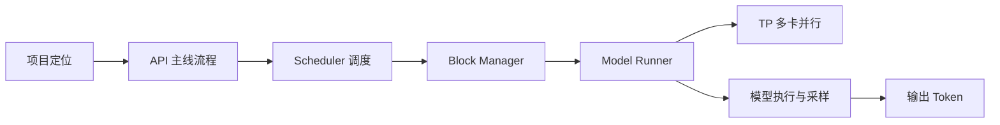
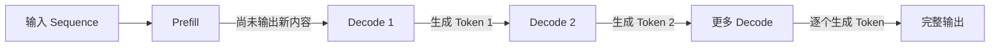
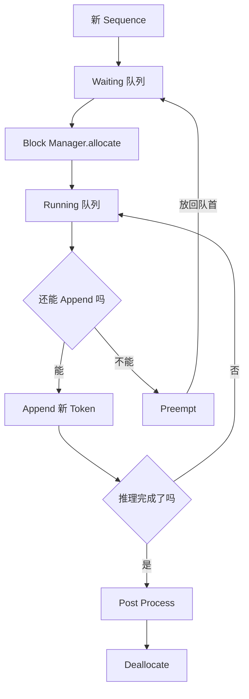
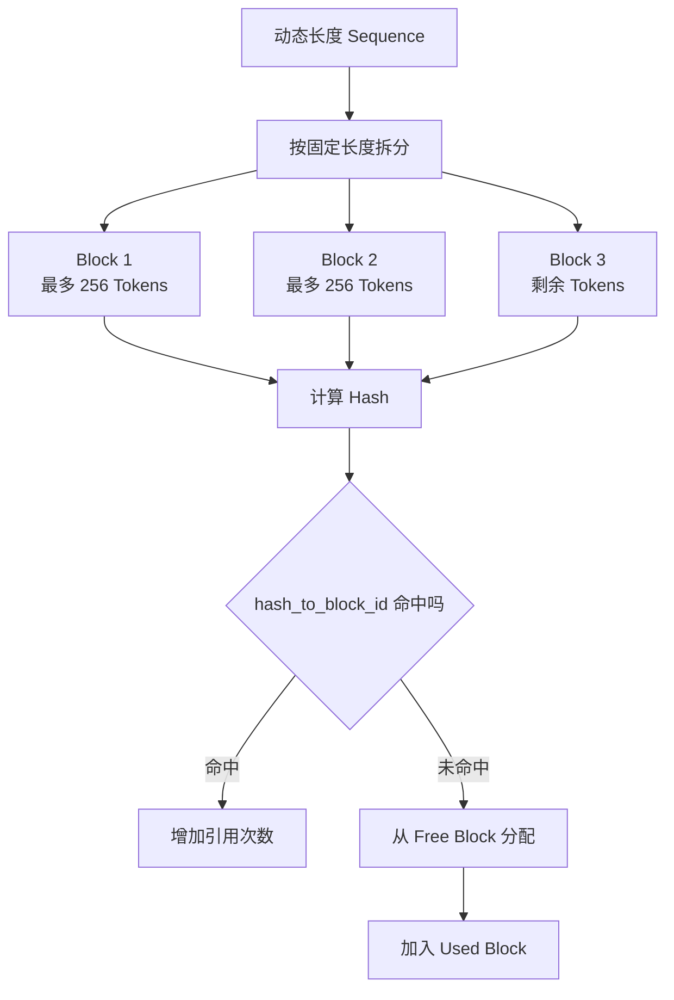
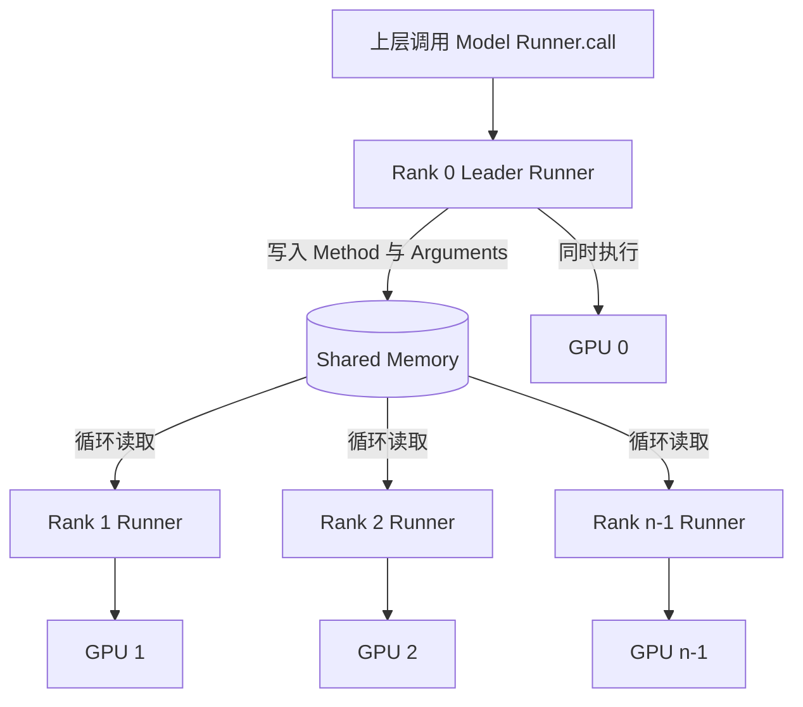
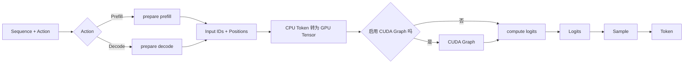

## 一、内容概览

Nano vLLM 的内容分为上下两部分：

- 上集着重讲工程实现、整体架构和完整流程，将最终执行模型算法推理的部分视为黑盒。
- 下集展开黑盒内部的算法优化，以及性能提升的重要实现 KV Cache。

本文对应上集，关注整体架构和核心工程化实现，按照以下顺序逐步展开：

1. Nano vLLM 的项目定位。
2. 从 `generate` API 开始的主线流程。
3. `prompt`、`sequence`、`prefill` 和 `decode` 等基本概念。
4. Scheduler 的批处理与调度机制。
5. Block Manager 对 KV Cache 的控制。
6. Model Runner 的 TP 并行系统和执行流程。
7. Prefill、Decode、CUDA Graph、Logits 与采样参数。

*阅读顺序：先建立整体认识，再逐层进入调度、缓存控制和模型执行。*

## 二、为什么选择 Nano vLLM

### 2.1 项目定位

Nano vLLM 是一个放在 GitHub 上的开源项目，也是一个从零构建的轻量级 vLLM 实现。虽然它是一个极简实现，但关键功能基本都有，包括：

- 基于前缀的缓存机制；
- TP 并行能力；
- 张量的提前编译；
- CUDA Graphs 等优化。

因此，这个实现并非完全不可用，也没有忽略过多细节。

## 三、先看完整主线：从 Prompt 到输出

Nano vLLM 对外暴露的 API，是 `LLM` 类中的 `generate` 方法。快速开始示例会构造一个 `prompts` 数组，也就是一组提示词，然后通过 `llm.generate` 批量进行推理。

`generate` 接收两个参数：

- `prompts`；
- 采样参数。

采样参数直到最后模型执行 `run` 时才会使用，前面的大部分逻辑都在处理 `prompts`。

在 Nano vLLM 中，`llm.py` 基本是一个空文件，`LLM` 直接等于 `LLMEngine`。完整版 vLLM 保留这层抽象，是因为上层还会处理同步 Engine、异步 Engine，以及适配 OpenAI API 等逻辑。Nano vLLM 裁剪了这些逻辑，因此调用 `LLM.generate` 时，会直接进入底层 `LLMEngine.generate`。

`LLMEngine.generate` 位于 `engine/llm_engine.py`。这里不需要逐行解读，例如 `tqdm`、`pbar` 等代码只是为了在命令行中显示更友好的进度条，并不是核心推理逻辑。

真正与推理有关的主线可以概括为：

1. `generate` 遍历所有 `prompts`。
2. 每个 `prompt` 依次调用 `add_request`。
3. `add_request` 使用 Tokenizer 将文本转换成 `sequence`。
4. `sequence` 被逐个放入 Scheduler。
5. 后台的 Step Loop 从 Scheduler 中批量取出 `sequences`。
6. Scheduler 同时告知当前动作是 Prefill 还是 Decode。
7. Step Loop 把 `sequences` 和 `action` 传给 Model Runner。
8. Model Runner 返回一组 Token ID。
9. 所有任务完成后，结果按 `sequence ID` 排序，再聚合为自然语言输出。

```mermaid
flowchart LR
    A[Prompts] --> B[LLM.generate]
    B --> C[LLMEngine.generate]
    C --> D[add_request]
    D --> E[Tokenizer]
    E --> F[Sequences]
    F --> G[Scheduler]
    G -->|批量取出| H[Step Loop]
    H -->|Sequences + Action| I[Model Runner]
    I --> J[Token IDs]
    J --> K[按 Sequence ID 排序]
    K --> L[自然语言输出]
```

*主线中的核心变化：文本 Prompt 先转换为 Token 序列，经过批量调度和模型执行后，再重新聚合为文本。*

下面从主线涉及的基础概念开始理解。

### 3.1 Prompt、Token、Tokenizer 与 Sequence

在 `add_request` 之前，处理的仍然是文本级别的提示词。进入 `add_request` 后，会发生一个关键转换：Prompt 文本被转换成 vLLM 内部的资源概念 `sequence`。

LLM 看到的基本单元是 Token，而不是固定的字符。一个 Token 可能是一个字符、一个中文字或一个英文单词，具体取决于模型的分词器如何切分文本。

Tokenizer 负责把自然语言切成模型能够理解的 Token，再将这些 Token 组成一个序列。因此，`sequence` 本质上是一个 Token 序列。

Tokenizer 与模型相关。不同模型家族的分词逻辑可能不同，并不一定通用。DeepSeek、千问，以及 Gemini、Claude 等商业模型，都有自己的 Tokenizer。

完成转换后，`add_request` 以 `sequence` 为粒度，把序列放入 Scheduler，然后结束自己的任务。

### 3.2 生产者、消费者与异步批处理

`LLMEngine` 接收 `generate` 请求后，只负责把解析好的 `sequence` 放入 Scheduler。它在这里扮演生产者角色，生产完成后，前台任务就结束了。

后台消费者由另一个独立循环 Step Loop 承担。它不断从 Scheduler 中消费 `sequence`。Step Loop 消费到的内容可能由多次 `generate` 累积而来，不一定与一次 `generate` 一一对应。

可以把它类比成消息队列：消费者并不知道消息生产者是否与自己一一对应，有时可能空转，有时会一次处理一大批消息。以 Scheduler 为中心，vLLM 将生产和消费拆成两个异步过程。

这样设计的核心，是让 Scheduler 具备批处理能力。如果多次 `generate`，或者一次 `generate` 的 `prompts` 数组传入多个提示词，就会产生多个 `sequence`。Scheduler 会根据能够容纳的批量上限，尽可能将多个 `sequence` 组成一批，交给后面的 Step Loop 处理。

同一批 `sequence` 之间没有语义关联，内容可能完全无关，发送方也可能不同。Scheduler 不关心语义，只关心底层显卡的推理速度。输入时是逐个放入 `sequence`，消费时则是一批一批地取出 `sequences`。

### 3.3 Prefill 与 Decode

Scheduler 除了给出一组 `sequences`，还会告诉 Step Loop 当前动作是 Prefill 还是 Decode。

Prefill 指初次推理时，将已有输入放入显存进行计算的过程。Decode 从推理开始输出第一个 Token 时开始，此后每生成一个 Token，就是一次 Decode。

因此，对于一个 `sequence`，一次推理会有一次 Prefill 和 n 次 Decode。从上层使用角度看，Prefill 期间模型正在计算，但还没有新内容输出；进入 Decode 后，就可以看到 Token 一个一个输出。

生产级推理平台中常见的 PD 分离，其中 P 和 D 分别就是 Prefill 和 Decode。

### 3.4 Step Loop 与结果排序

Step Loop 将 `sequences` 和 `action` 传给 Model Runner。暂时把 Model Runner 当作黑盒，只需要知道它执行 `run` 后，会返回一组 Token ID，也就是通过显存计算得到的 Token。

之所以称为 Loop，是因为 Scheduler 中可能堆积着许多 `sequence`。Step Loop 会一直消费 Scheduler，直到所有 `sequence` 都处理完毕。之后，所有 Token 再按顺序聚合为自然语言输出。

这里需要进行排序。批处理中的多个 `sequence` 会并行调用 Model Runner，执行速度不一定相同，因此进入顺序不一定等于返回顺序。系统根据递增的 `sequence ID` 排序，让每个输入仍然能够对应到自己的输出。

### 3.5 批处理的收益与取舍

Model Runner 的 `run` 存在固定开销，例如启动显卡上的 CUDA 软件，以及 CPU 到 GPU 的数据传输和转换。除了每个 Token 自身的开销，一批 Token 处理的开始和结束也存在额外开销。

如果每次只处理一个 Token 或一个 `sequence`，额外开销会重复发生。把多个 `sequence` 攒成一批，可以减少这些重复开销。因此，批量越大，单次显存处理中的额外开销就越少，总体吞吐能力越高。

但总体吞吐提高的同时，每个 `sequence` 的绝对完成时间会受到影响。例如三个 Prompt 被放入同一个 Batch 后，Step Loop 要等三者全部完成，才会排序并一起返回。对于其中任何一个 Prompt，它都需要等待另外两个 Prompt 完成。

如果三个 Prompt 分别传入，虽然额外开销增加、总体吞吐下降，但每个 Prompt 不需要等待同一批中的其他 Prompt，单次生成的绝对速度会提升。

因此，需要在总体吞吐和单次生成之间取舍：

- Batch 越大，总体吞吐越好；
- Batch 越小，单次生成的等待时间越短。

| Batch 设置 | 总体吞吐 | 单次生成等待时间 |
| --- | --- | --- |
| 较大 | 较高 | 较长 |
| 较小 | 较低 | 较短 |

## 四、Scheduler：如何调度 Sequence

理解主线后，再展开第一个复杂组件 Scheduler。Scheduler 内部有两个关键队列：

- `waiting sequence`；
- `running sequence`。

一个 `sequence` 被加入 Scheduler 时，会先进入 Waiting 队列。它在这里等待 Scheduler 确认：这个 `sequence` 是否曾经被计算过。

判断一个 `sequence` 以前是否计算过，就涉及缓存。vLLM 会缓存 `sequence` 的计算结果，如果之前已经处理过，这一次就不需要重复计算，可以读取缓存结果。KV Cache 对 Prefill 生效，因为 Prefill 处理的是已经存在的 Token，在多轮对话中也可能重复出现。

*Scheduler 的完整生命周期：进入 Waiting、完成分配、转入 Running；空间不足时抢占回退，完成后释放。*

### 4.1 Add：从 Waiting 到 Running

每个进入调度器的 `sequence` 都是需要 Prefill 的用户输入。它首先要检查自己的 Prefill 是需要重新计算，还是可以利用缓存。

具体检查由 Block Manager 完成。Waiting 队列中的每个 `sequence` 都会调用 Block Manager 的 `allocate` 方法，查询当前 `sequence` 是否已经分配和管理过：

- 如果已经管理过，说明存在缓存，可以复用；
- 如果没有管理过，说明没有缓存，本次会建立初次缓存。

无论原来是否命中缓存，`allocate` 返回时，`sequence` 都已经完成分配。

随后，Scheduler 将完成 `allocate` 的 `sequence` 从 Waiting 队列移到 Running 队列尾部。Waiting 队列原本的第二项变为第一项，继续进入 Block Manager 检查，由此形成排队机制。

前台每传入一个由 Prompt 转换而来的 `sequence`，它就会进入 Waiting。Waiting 也会尽可能批量处理，将更多 `sequence` 移入 Running。

### 4.2 Schedule：空间充足时 Append，不足时 Preempt

后台 Step Loop 调用 Scheduler 的 `schedule` 方法。该方法会检查 Running 队列中的第一个 `sequence`，并通过 Block Manager 判断能否继续 `append`。

这里不是检查有无缓存，而是检查 Block Manager 中的空间是否足够。Block Manager 是 KV Cache 在 CPU 中的表示，可以快速了解底层显存的实际分配情况。

Decode 每次生成一个新 Token，都要把它追加到 `sequence` 中，并更新 Block Manager 的缓存记录。例如，一个 `sequence` 在 Prefill 后有 10 个 Token，生成第 11 个 Token 后，需要从 10 更新为 11；下一轮再更新为 12。

如果 Block Manager 空间充裕，就执行 `append`，更新最新生成的 Token 和缓存记录。

如果空间不足，系统无法继续分配和推理，就会触发 `preempt`，把 Running 队首中尚未处理完的 `sequence` 踢回 Waiting。由于它此前已经进入 Running，优先级应高于 Waiting 中的其他任务，因此会被放回 Waiting 的开头。后续 Block Manager 释放出空间时，它可以优先重新运行。

### 4.3 Post Process：完成后的释放

当整个推理的 Step Loop 完成后，会调用 `post process`。此时，系统从 Running 队列移除最前面的 `sequence`，因为它的所有 Decode 都已经完成，调度生命周期也随之结束。

同时，Scheduler 会调用 Block Manager 的 `deallocate`，释放为这个 `sequence` 分配的空间，从而保证队列状态和空间管理一致。

## 五、Block Manager：KV Cache 的控制器

Block Manager 是 KV Cache 的代表，也可以说是 KV Cache 的控制器。它并不真正负责在显存中分配缓存，而是用 CPU 内存中的数据结构，高效表示显存缓存的已有分配情况。

Block Manager 的入口始终是 `sequence`：

- `sequence` 被 `allocate`；
- `sequence` 被 `append`；
- `sequence` 被 `deallocate`。

### 5.1 从 Sequence 到 Block

`sequence` 是一组 Token。它被分配进入 Block Manager 后，会被转换成新的数据结构 `block`。

一个 Block 包含三个信息：

1. Block 内容的哈希值；
2. Block 的引用次数；
3. Block 的实际 Token 内容。

哈希值是对 Block 整体内容计算后的结果。引用次数表示缓存命中的次数。如果多次推理出现相同 Block，不会重复存储，而是增加引用。例如，一个 Block 命中一次，引用数为 1；命中三次，引用数为 3。

`sequence` 和 Block 都包含 Token，但两者长度不同：

- `sequence` 的长度不固定，因为 Prompt 的长度是动态的；
- Block 的长度固定，可以配置，默认一个 Block 为 256 个 Token。

因此，一个 `sequence` 可能被分配为一个或多个 Block。例如，一个 `sequence` 有 700 个 Token，Block 大小为 256，就需要三个 Block：前两个占满，第三个只占一部分，尾部留有空洞。

一个 Block 没有占满时，不会让下一个 `sequence` 复用其尾部空间。也就是说，不会把两个 `sequence` 的内容放在同一个 Block 中；但一个较长的 `sequence` 可以被拆成多个 Block。这是一个一对多关系。

### 5.2 哈希与缓存命中

在 `allocate` 过程中，`sequence` 会被拆成多个 Block，每个 Block 都会计算哈希值，并与已有 Block 的哈希进行比较。

为了提高效率，Block Manager 还维护了 `hash_to_block_id` 映射，其中 Key 是哈希，Value 是 Block ID。这样不需要遍历全部 Blocks，只要直接查询哈希映射，就能知道缓存是否命中。

- 哈希命中：说明已经存在相同 Block，不需要重复存储，只增加引用次数。对上层而言，表示这个 `sequence` 已经被处理过。
- 哈希未命中：需要将哈希追加到映射中，同时在 Blocks 中分配这个首次出现的 Block。

### 5.3 Free Block 与 Used Block

Block Manager 还通过两个数据结构表达 Block 的使用状态：

- `free_block_ids`：所有仍可分配的 Block 位置；
- `used_block_ids`：已经分配的 Block 位置。

缓存未命中并成功分配时，系统取出一个 `free_block_id`，再把它放入 `used_block_ids`。取消分配时，则从 Used 归还到 Free。

每个 Block 的大小可以配置，例如 256 个 Token。Block ID 的总数量取决于为 KV Cache 在显卡上预留的显存空间。一个 Token 占用多少显存可以计算，一个定长 Block 占用多少显存也能计算。已知总预留显存后，就能计算可分配的 Block 数量。

由此，Block Manager 使用高效的 CPU 内存对象，映射底层显存的实际分配情况。它能够代表底层显存布局，但不是真正分配显存的地方。

### 5.4 Deallocate 与显存覆盖

外部调用 `deallocate` 时，会做两件事：

1. 归还 Block ID；
2. 清除 Blocks 中的实际内容，使其重新可用。

在一些 vLLM 版本中，归还时只会清除控制平面的 Block，表示该位置可以再次分配；底层显存不会真正被抹掉，因为没有必要承担额外开销。下次新内容分配进来时，显存执行的是覆盖，而不是先删除再写入。

因此，可能出现 Block Manager 已经清空、空间已经释放，但显存仍显示占用较满的情况。这是正常现象，不影响后续分配，因为新内容会覆盖旧内容。

至此，Scheduler 何时使用 Block Manager、Block Manager 如何工作，以及 `sequence` 与 Block 的关系都已经清楚：一个是动态 Token 数组，一个是定长 Token 数组；Block 会经历哈希检查、缓存命中或未命中、存储与归还等生命周期。

## 六、Model Runner：模型运行与 TP 并行

Step Loop 调用 Model Runner 的 `call` 方法时，会传入三个参数：

1. 方法名称 `run`；
2. `sequence`；
3. `action`，即 Prefill 或 Decode。

Model Runner 包含两个关键部分：TP 并行系统和具体执行流程。

### 6.1 为什么需要 TP

模型会消耗大量显存。当模型大到一张显卡无法容纳时，就需要多张显卡共同运行同一个模型。其中一种并行方式叫 TP，也就是 Tensor Parallelism。

另一种并行方式叫 PP。二者在通信方式以及单机多卡、多机多卡等硬件形态上存在差异。TP 更适合单机多卡，因为同一台机器中的显卡之间不需要进行网络通信，可以使用更高效的方式。Nano vLLM 和实际的 vLLM 都使用共享内存进行通信。

### 6.2 World Size、Rank 与 Runner 角色

Model Runner 启动时，会根据初始化配置的 TP 数量，也就是系统中的显卡数量，决定启动多少个 Runner。每张显卡上会启动一个 Runner。

TP 的总数量称为 `world size`：

- 一张卡时，n = 1，没有并行；
- 两张卡时，n = 2；
- 八张卡时，n = 8，八张卡一起并行。

如果存在 n 个 Runner，它们的 Rank 从 0 到 n - 1。所有 Runner 的角色并不完全相等，可以分为两类：

- Rank 0 是 Leader Runner，既执行任务，也承担指挥职责；
- Rank 1 到 n - 1 是执行者。

*所有 Runner 接收相同的方法和参数，再根据各自的 Rank 完成任务分配。*

### 6.3 基于共享内存的通信

外部调用 Model Runner 的 `call` 方法时，由 Rank 0 接收函数调用。Rank 0 除了自己执行，还会把方法名和参数写入 Shared Memory。由于 `method` 和 `arguments` 都可以序列化，因此可以写入内存。

其他 Runner 会循环读取 Shared Memory，检查 Leader 是否下达了命令。一旦 Rank 0 写入命令，其他 Runner 就会在下一次循环中发现并读出任务，再调用自己的 `call` 方法执行。

因此，上层向 Model Runner 下达一个指令后，所有 Runner 都会并行执行。它们共享相同的方法名和参数，但拥有不同的 Rank。实际执行逻辑必须感知 Rank，并进行正确的任务分配，避免冲突和遗漏。

例如，一个包含 100 个元素的数组需要执行可以并行的 Map Reduce 时，每个 Runner 可以根据自己的 Rank 取出对应编号的元素，执行后再放回去，从而实现并行且互不冲突。

从上层看，整个 TP 通信系统就是基于 Shared Memory 的写入和读取：Rank 0 是指挥者，Rank 1 到 n - 1 是执行者，共同构成 n 个执行方。

## 七、Model Runner 的执行细节

任意 Rank 的 Runner 执行 `run` 时，会接收两个参数：`sequence` 和 `action`。核心参数仍然是 `sequence`，其形态仍是动态长度的 Token 序列。

### 7.1 Prefill 与 Decode 的准备工作

Runner 根据 `action` 判断当前执行的是 Prefill 还是 Decode：

- 如果是 Prefill，调用 `prepare prefill`；
- 如果是 Decode，调用 `prepare decode`。

这两个方法内部都会包含一部分数学计算和一部分数据转换。无论执行 Prefill 还是 Decode，最终都会生成两个信息：

- `input_ids`，也可以称为 Input Token；
- `positions`，即位置信息。

`positions` 来自 Prefill 和 Decode 根据 Block Manager 维护的数据结构计算出的分配信息。它决定真正进入模型和 KV Cache 的数据平面执行时，到哪个位置读取已经缓存的信息，或者写入新的信息。

Block Manager 做的是逻辑管理，而 `positions` 是与底层真实数据对应的线索。带着位置信息，系统才能在 KV Cache 中正确读写。

传入的 `sequence Token` 此时仍然是 CPU 内存中的对象。在 `prepare prefill` 和 `prepare decode` 中，会使用 Torch 创建 Tensor，把 CPU 中的 Token 对象转换为 GPU 上的张量对象。Tensor 的内容包括 `input_ids` 和其他辅助信息。

因此，准备工作主要完成两件事：计算位置信息，以及将 CPU 上的 Token 转换成 GPU 上的 Tensor。

另一条分支会为最终采样做准备。最上层传入的采样参数逐层传递到这里，系统记录与采样有关的参数，稍后使用。

### 7.2 CUDA Graph 在链路中的位置

准备得到 Tensor 和 Position 后，它们会进入作为黑盒的 Model 和 KV Cache。执行前还有一个可选环节：CUDA Graph。

这里有两种情况：

- 没有开启 CUDA Graph：直接执行黑盒暴露的 `compute logits`；
- 开启 CUDA Graph：先经过 CUDA Graph，最终仍然进入 `compute logits`。

*Model Runner 的执行链路：准备输入和位置，完成 CPU 到 GPU 的转换，再计算 Logits 并采样 Token。*

CUDA Graph 可以理解为对显存对象的一种高级缓存能力，是英伟达 GPU 支持的软件功能。GPU 主要执行各种计算，相同参数加上相同计算过程，预期会得到相同结果。CUDA Graph 不只是简单的 KV 结构 Cache，可以将其理解为对重新计算过程的加速。即使可能仍需再次执行，速度也会大幅加快。

在 Nano vLLM 中，CUDA Graph 用于优化 Tensor 和 Position 等信息在 GPU 上的计算过程。至于 `compute logits` 内部的具体算法，属于后续展开的黑盒内容。

### 7.3 Logits 与 Sample

`compute logits` 执行完成后，会得到 Logits 的张量表达，它仍然是 GPU 显存中的对象。

模型推理后，不是直接返回一个固定 Token，而是返回一组分数。这组分数代表多个可选结果，从中选择一个最终结果的过程就是 Sample，也就是采样。

因此，最后一步是从多个 Logits 中采样出一个 Token。经过多轮 Decode 后，就会得到多个 Token，组成最终输出。

之所以需要带有一定随机性的过程，是因为模型输出具有多样性。相同 Input 执行 100 次，整体语义可能相同，但具体表达方式往往会有细微差异。随机采样是模型随机性和生成结果个性化的来源之一。

采样虽然随机，但不是纯粹随机，而是需要规则。一种最简单的方式是永远选择最高分，但这样就没有随机性。Logits 会以一种类似正态分布的方式体现出来，再从合理范围内选择结果。

### 7.4 Temperature 如何影响采样

Temperature 是 Nano vLLM 实现的一个重要参数，也是使用很多 LLM API 时会看到的参数。它最终用一个数字表达，有的系统使用 0 到 1，有的使用 0 到无穷大。

Temperature 对 Logits 分布形状的影响可以理解为：

- Temperature 越小，Logits 分布越瘦高；
- Temperature 越大，Logits 分布越矮胖。

采样首先设置一个合理的分数阈值。分数过低的答案很可能错误或没有意义，因此只把高于阈值的结果作为可选范围。

在相同阈值下，越小的 Temperature 对应越瘦高的分布，可选区间越窄，最终随机性越小；越大的 Temperature 对应越矮胖的分布，可选区间越宽，最终随机性越大。

因此，用 Temperature 控制模型的“创造力”，实际控制的是随机采样范围的大小。

## 八、总结

从一条完整主线来看，Nano vLLM 的工作过程是：`generate` 接收批量 Prompts，Tokenizer 将 Prompt 转换为 Sequence，Scheduler 通过 Waiting 和 Running 队列组织异步批处理，并借助 Block Manager 管理 KV Cache 的控制平面；Step Loop 再将一批 Sequences 和 Prefill 或 Decode 动作交给 Model Runner。Model Runner 通过 TP 和共享内存组织多卡执行，准备 Tensor 与 Position，经过可选的 CUDA Graph 优化和 `compute logits`，最后根据 Temperature 等参数从 Logits 中采样得到 Token，并将多轮 Decode 的 Token 聚合成输出。

本文完成了对 Nano vLLM 整体架构和核心工程实现的梳理。模型和 KV Cache 的数据面仍然被视为黑盒，后续再完整展开。理解这一层之后，就能对一个推理引擎需要完成的工作形成整体认识。
