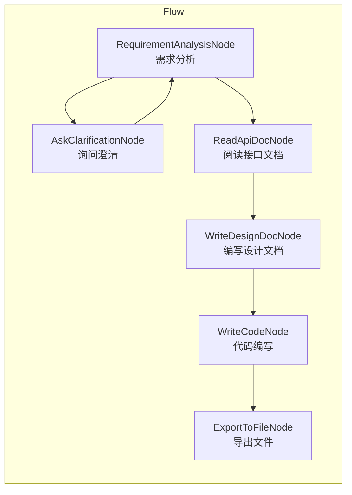

前面我们介绍了 Pocket Flow 这个 Agent Framework。今天我们来介绍一个基于 Pocket Flow 实现的工具 Deep Coder。

目的有如下几个:

1. 学习 Pocket Flow 的使用
2. 学习如何设计和实现一个 Workflow
3. 学习提示词的设计

<!-- more -->

## 1. Deep Coder 简介

Deep Coder 是一个基于 OpenAPI 生成通用代码的工具。这个 Workflow 遵循跟人类 Coder 一样的开发流程

这里面比较复杂的节点是 N4，思想类似于 skills，通过文档分级和索引，分步骤缩小搜索范围，最终找到完成用户需求所需要的文档。
