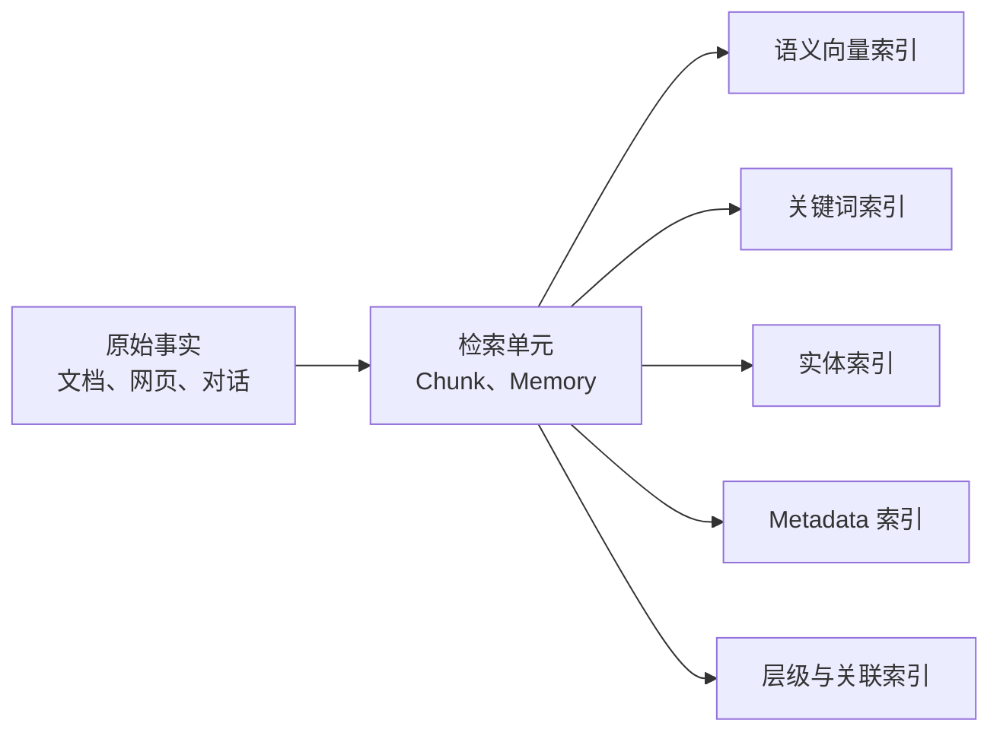
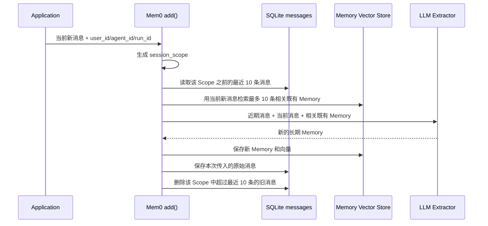
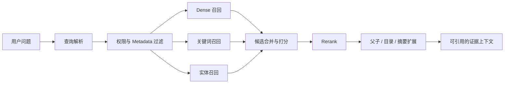
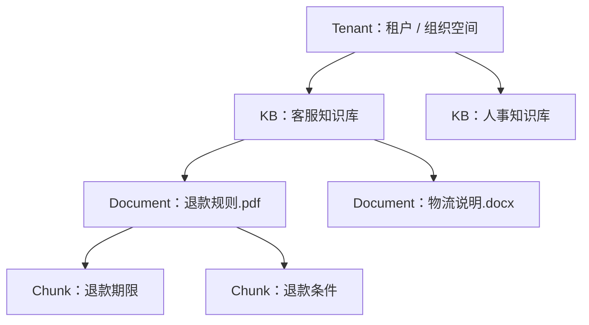
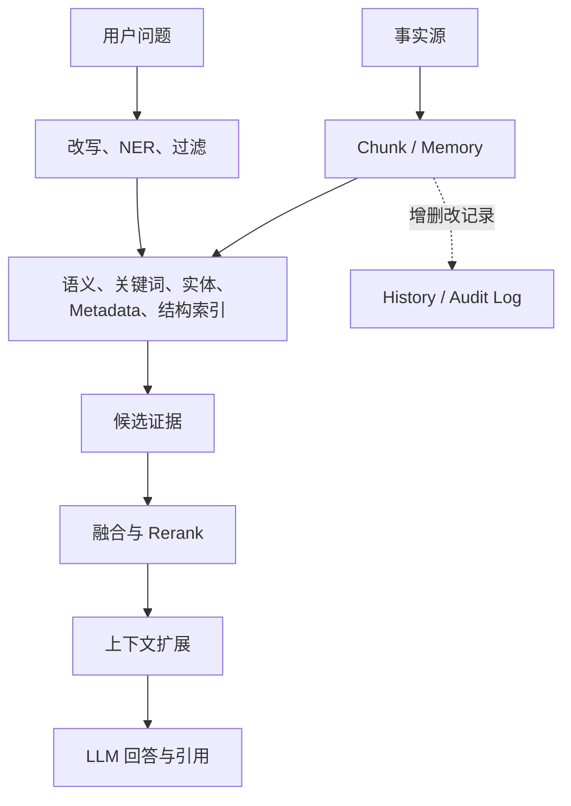

最简单的 RAG 会把文档切成 Chunk，为每个 Chunk 生成向量，再按照向量相似度搜索。但真实问题还会包含专有名词、实体、时间、文档范围和上下文关系，只靠一种向量表示容易漏召回或召回错误。

所谓 **RAG 索引增强**，就是从同一份原始事实生成多种检索投影，让系统能够从语义、关键词、实体、Metadata 和文档结构等不同角度寻找证据。

它的核心不是“多建几个数据库”，而是：

> 原始事实只保留一份；为了提高检索效果，可以生成多个可删除、可重建的索引视图。

<!-- more -->

## 1. 事实、检索单元和索引

理解索引增强，首先要区分三层数据：



### 1.1 原始事实

原始事实是系统真正想保存的内容，例如 PDF、网页、数据库记录或者原始对话。它应该完整、可修改、可追溯，不应该因为更换 Embedding 模型或搜索引擎而丢失。

### 1.2 检索单元

检索单元是实际参与搜索的最小内容：

- 文档 RAG 中通常叫 **Chunk**，即从长文档中切出的片段。
- Mem0 中叫 **Memory**，即从对话中提炼出的短事实，例如“用户不吃花生”。

两者来源不同，但检索作用相似：它们都是可以被编码、过滤、打分和返回的内容单元。

### 1.3 索引

索引是为了更快、更准地找到检索单元而生成的数据结构。向量只是索引的一种，关键词、实体、Metadata 和父子关系也都是索引。

同一个 Chunk 可以同时拥有多种索引字段：

```json
{
  "text": "RAGFlow 使用 Elasticsearch 保存 Chunk",
  "vector": [0.12, -0.34, 0.56],
  "keywords": ["RAGFlow", "Elasticsearch"],
  "entities": ["RAGFlow", "Elasticsearch"],
  "metadata": {"document_id": "doc-1", "chapter": "存储"},
  "parent_id": "parent-9"
}
```

这些字段可以在同一个物理数据库中，也可以分散到多个存储。**逻辑上有多种索引，不等于必须部署多个数据库。**

## 2. Mem0 中三个 Store 的含义

Mem0 的三个术语可以分别理解为“长期事实索引”“实体辅助索引”和“变更审计日志”。

先说明实际使用的数据库。Memory Vector Store 和 Entity Vector Store **复用同一种向量数据库，只是使用两个 Collection**；History Store 则单独使用 SQLite。

| 运行方式 | Memory Vector Store | Entity Vector Store | History Store |
| --- | --- | --- | --- |
| OSS SDK 默认配置 | 本地 Qdrant，Collection 为 `mem0` | 同一 Qdrant，Collection 为 `mem0_entities` | SQLite，默认 `~/.mem0/history.db` |
| 仓库自带 REST Server 默认配置 | PostgreSQL + pgvector，表为 `memories` | 同一 PostgreSQL + pgvector，表为 `memories_entities` | SQLite，默认 `/app/history/history.db` |

Qdrant、pgvector 都可以被其他 Provider 替换。这里用 REST Server 默认的 pgvector 展示记录，因为它的物理结构最直观。两个向量表的结构相同：

```sql
CREATE TABLE memories (
    id      UUID PRIMARY KEY,
    vector  vector(1536),
    payload JSONB
);

CREATE TABLE memories_entities (
    id      UUID PRIMARY KEY,
    vector  vector(1536),
    payload JSONB
);
```

也就是说，每条向量记录都由三部分组成：唯一 ID、用于相似度计算的向量，以及保存业务字段的 JSON `payload`。

### 2.1 Memory Vector Store

Memory Vector Store 是 Memory 的主要检索索引，保存 Memory 文本、向量、用户范围和 Metadata。它回答：

> 哪些长期记忆在语义上和当前问题最相关？

例如，系统从对话中提炼出：

```text
Memory：用户对花生过敏。
```

这条 Memory 被 Embedding 后写入 Memory Vector Store。以后用户问“附近有什么适合我的餐厅”，即使没有再次提到花生，语义检索仍可能找回这条记忆。

它与文档 RAG 中的 Chunk Vector Store 本质相同：一个索引用户长期记忆，一个索引文档片段。

在 pgvector 的 `memories` 表中，一条记录大致如下。向量通常有上千维，示例中进行了省略：

```json
{
  "id": "7bc4cd95-cf1a-4c55-92d6-28730311d271",
  "vector": [0.018, -0.032, 0.071, "... 共 1536 维 ..."],
  "payload": {
    "data": "用户对花生过敏",
    "text_lemmatized": "用户 对 花生 过敏",
    "hash": "c7e36cc3816f4d65a5bc0e772cca52f4",
    "user_id": "user-42",
    "agent_id": "restaurant-assistant",
    "created_at": "2026-08-15T02:00:00+00:00",
    "updated_at": "2026-08-15T02:00:00+00:00",
    "category": "dietary_restriction",
    "source": "chat"
  }
}
```

字段可以分成四组：

- `data` 是真正被检索和返回的 Memory 文本。
- `vector` 是 `data` 的语义表示，只用于计算相似度，人通常不会直接阅读它。
- `user_id`、`agent_id`、`run_id` 是 Scope 字段。检索 `user-42` 的记忆时，它们会作为过滤条件，避免混入其他用户的数据。
- `category`、`source` 等是调用方传入的自定义 Metadata。代码会把它们直接展开到 `payload` 中，并不保存成一个嵌套的 `metadata` 对象。

`hash` 用于文本精确去重，`created_at`、`updated_at` 用于记录当前 Memory 的时间。它们和向量一起构成 Memory 的“当前可检索状态”。

### 2.2 Entity Vector Store

Entity Vector Store 保存从 Memory 中抽取的实体，以及实体关联的 Memory ID。它回答：

> 问题提到了谁或什么对象？哪些 Memory 与这个对象有关？

例如：

```json
{
  "id": "25d98fc1-3146-402d-8938-2bab1cb4a32d",
  "vector": [0.024, -0.019, 0.083, "... 共 1536 维 ..."],
  "payload": {
    "data": "上海",
    "entity_type": "PROPER",
    "linked_memory_ids": [
      "4c24486f-b372-41df-a9fe-07db99782975",
      "eca9823e-c3a9-4694-ad7d-66d3dd7642f0"
    ],
    "user_id": "user-42",
    "agent_id": "travel-assistant"
  }
}
```

这条记录位于 `memories_entities` 表中。`vector` 是实体文本“上海”的向量；`entity_type` 是当前代码提取出的 `PROPER`、`QUOTED`、`TOPIC` 或 `IDENTIFIER` 等类型；`linked_memory_ids` 保存的是 `memories` 表中两条 Memory 的 UUID，例如它们可能分别表示“用户在上海工作”和“用户喜欢上海博物馆”。

查询再次提到“上海”时，Mem0 先找到这条实体记录，再给 `linked_memory_ids` 指向的 Memory 增加分数。这能弥补向量检索对人名、地名、产品型号和缩写不够稳定的问题。

但它只是**实体到 Memory 的辅助入口**，不等于知识图谱。只有进一步保存“实体—关系—实体”并支持关系遍历，才更接近 GraphRAG。

### 2.3 History Store

History Store 记录 Memory 何时被新增、修改或删除，例如：

```json
{
  "id": "7ef928d4-d629-4c36-b43d-615172e67f01",
  "memory_id": "b68f35ff-5e80-454a-a9c6-e645ff7f07bf",
  "old_memory": "用户住在北京",
  "new_memory": "用户住在上海",
  "event": "UPDATE",
  "created_at": "2026-08-15T01:00:00+00:00",
  "updated_at": "2026-08-15T03:00:00+00:00",
  "is_deleted": 0,
  "actor_id": null,
  "role": null
}
```

这是一条 SQLite `history` 表记录。`memory_id` 指向向量库中的 Memory，`old_memory` 和 `new_memory` 保存变更前后的文本；新增时 `old_memory` 为 `null`，删除时 `event` 为 `DELETE` 且 `is_deleted` 会标记删除状态。

它通常不参与语义相似度计算，更接近日志或审计记录，而不是向量索引。

同一个 SQLite 文件还包含 `messages` 表，用来保留每个 Scope 最近的原始消息，为下一次 Memory 抽取提供上下文。一条记录大致是：

```json
{
  "id": "c6d856c2-624c-4f43-a9c2-996d91aa77a1",
  "session_scope": "agent_id=restaurant-assistant&user_id=user-42",
  "role": "user",
  "content": "我对花生过敏，以后推荐餐厅时帮我避开",
  "name": null,
  "created_at": "2026-08-15T02:00:00+00:00"
}
```

`messages` 保存的是近期对话上下文，`history` 保存的是 Memory 变更，两者都不保存向量。

#### `messages` 的生成和读取逻辑

`messages` 不是由 LLM 生成的摘要，也不是从 Memory 反向还原出来的。**它就是应用调用 `memory.add(messages=...)` 时传入的原始消息副本。**

一次 `infer=True` 的写入顺序如下：



这里存在三类不同输入：

| 输入 | 来自哪里 | 给 LLM 的作用 |
| --- | --- | --- |
| `Last k Messages` | SQLite 中相同 Scope 的历史消息 | 理解代词、省略和最近发生的事情 |
| `New Messages` | 本次 `add()` 传入的消息 | 本轮要抽取的主要内容 |
| `Existing Memories` | 用本次消息从向量库召回的最多 10 条 Memory | 避免重复抽取，并建立新旧 Memory 关联 |

读取发生在写入之前，所以本次新消息不会同时出现在 `Last k Messages` 中；它们通过 `New Messages` 单独传给 LLM。无论本轮最终有没有抽取出新 Memory，当前消息通常都会写入 `messages`，供下一次 `add(infer=True)` 使用。

`session_scope` 由本次提供的 `user_id`、`agent_id`、`run_id` 按固定顺序拼接。例如：

```text
agent_id=restaurant-assistant&user_id=user-42
```

只有 Scope 字符串完全相同，才能读到同一组近期消息。`user_id=user-42` 与 `agent_id=restaurant-assistant&user_id=user-42` 是两个不同 Scope，不会共享 `messages`。

下面用连续两次调用说明它为什么有用。

第一次调用：

```python
memory.add(
    messages=[
        {"role": "user", "content": "我姐姐小王下周来上海"},
        {"role": "assistant", "content": "好的，我可以帮她规划行程"},
    ],
    user_id="user-42",
    agent_id="travel-assistant",
)
```

此时 `Last k Messages` 为空。LLM 可能抽取出长期 Memory“用户的姐姐小王下周来上海”，然后这两条原始消息进入 SQLite。

第二次调用：

```python
memory.add(
    messages=[{"role": "user", "content": "她不吃花生，餐厅要注意"}],
    user_id="user-42",
    agent_id="travel-assistant",
)
```

这一次 LLM 实际看到的上下文近似为：

```text
Last k Messages:
user: 我姐姐小王下周来上海
assistant: 好的，我可以帮她规划行程

Existing Memories:
用户的姐姐小王下周来上海

New Messages:
user: 她不吃花生，餐厅要注意
```

因此 LLM 有机会把“她”解析为“小王”，抽取出自包含的长期 Memory：

```text
用户的姐姐小王不吃花生。
```

如果没有近期消息，系统可能只能得到含义不完整的“她不吃花生”，甚至无法判断“她”是谁。

需要注意几个边界：

- 最近 10 条指 **10 条消息记录**，不是 10 轮对话。一轮包含 user 和 assistant 两条消息，就会占两条。
- 它是滚动窗口。写入后超过 10 条的旧消息会从 SQLite 删除，所以不能把它当成完整聊天记录。
- `messages` 只服务于下一次 `add(infer=True)` 的 Memory 抽取；普通 `search()` 不会查询它，也不会自动把它注入 Agent 的最终回答 Prompt。
- `infer=False` 会把传入消息直接写成 Memory，并提前返回，不经过这套近期消息读取和保存流程。
- `save_messages()` 不做内容去重。调用方最好只传本轮新增消息；如果每次都把完整会话重复传入，SQLite 中也会重复保存，直到滚动淘汰。

历史日志也不等于完整版本控制。版本控制还需要版本号、原子提交、并发控制和回退能力；只有 ADD、UPDATE、DELETE 记录，不能保证当前值与历史永远一致。

| 名称 | Server 默认物理存储 | 通俗理解 | 主要用途 |
| --- | --- | --- | --- |
| Memory Vector Store | pgvector 的 `memories` 表 | 长期事实检索库 | 按语义查找 Memory |
| Entity Vector Store | pgvector 的 `memories_entities` 表 | 实体辅助目录 | 按对象关联或提升 Memory |
| History Store | SQLite 的 `history`、`messages` 表 | 变更与近期消息日志 | 审计变化、为抽取提供近期上下文 |

## 3. 为什么需要多种索引

向量检索擅长寻找“意思相近”的内容，但不擅长所有问题。

知识库中有一个 Chunk：

```text
订单错误码 E1042 表示库存预占失败。
```

查询“E1042 是什么问题”时，最重要的是精确匹配错误码，关键词索引更可靠。查询“为什么商品有库存却无法购买”时，问题与原文用词不同，向量索引更容易找到相关内容。

因此常见索引各自解决不同问题：

| 索引 | 核心作用 | 适合解决的问题 |
| --- | --- | --- |
| Dense 向量索引 | 匹配语义 | 表达不同但意思相近 |
| 关键词/倒排索引 | 匹配精确词项 | 错误码、名称、编号、原文短语 |
| 实体索引 | 匹配核心对象 | 人物、地点、产品及其关联内容 |
| Metadata 索引 | 限定数据范围 | Tenant、KB、Document、时间、标签 |
| 结构索引 | 补全上下文 | 父子 Chunk、目录、相邻段落、摘要树 |

索引增强不是让某一路独立给出最终答案，而是让它们提供互补的检索信号。

## 4. 写入阶段的索引增强

### 4.1 分块

Chunk 太大，容易包含多个主题；Chunk 太小，又会丢失标题、条件和上下文。常见方法有：

- 按标题、段落、列表和表格进行结构分块。
- 根据相邻句子的语义变化进行语义分块。
- 让 LLM 识别语义完整的边界。
- 建立父子 Chunk：用小块检索，命中后返回更完整的父块。

分块的本质是在两个目标之间平衡：**小粒度提高命中精度，大上下文保证证据完整。**

### 4.2 为 Chunk 补充检索线索

有些 Chunk 单独看会丢失含义：

```text
该操作不支持在离线模式下执行。
```

可以加入文档名、章节路径、摘要、关键词、候选问题、实体和 Metadata：

```text
文档：部署指南
章节：数据库迁移
内容：该操作不支持在离线模式下执行。
```

它的目的不是修改事实，而是减少 Chunk 脱离原文后的歧义。

### 4.3 为同一内容生成多种表示

同一个 Chunk 可以生成正文向量、候选问题向量、关键词、实体和摘要等投影。

候选问题索引解决“用户像提问，文档像回答”的表达差异。RAPTOR 则把相关 Chunk 聚合成摘要并递归生成高层摘要：具体问题可以命中原始 Chunk，概括性问题可以命中摘要节点。

## 5. 查询阶段如何使用增强索引



### 5.1 查询解析

用户的问题不一定适合直接搜索。系统可以使用：

- **查询重写**：消除口语、省略和代词。
- **关键词提取**：保留错误码、产品名和关键短语。
- **命名实体识别（NER）**：识别人名、地点、组织、型号和时间。
- **HyDE**：先生成一段假设答案，再对它做 Embedding，用更像文档的表达搜索真实文档。

HyDE 的假设文本只用于搜索，不能当作事实。最终证据仍必须来自真实索引。

### 5.2 多路召回

Dense、关键词和实体信号有两种常见组合：

```text
方式一：Dense 候选 ∪ BM25 候选 ∪ Entity 候选 → 融合排序
方式二：Dense 候选 → 加上 BM25 分数和 Entity Boost → 排序
```

方式一允许每一路贡献候选；方式二中，关键词和实体只能调整 Dense 候选的顺序，无法救回完全没有被 Dense 召回的内容。

因此一个系统声称支持“BM25 + Vector”时，还要确认：**BM25 能否独立贡献候选，还是只给向量候选加分。** 当前分析的 Mem0 更接近第二种，RAGFlow 的全文与 Dense 初召回更接近真正的混合查询。

### 5.3 先过滤，再召回

Tenant、KB、Document、用户 Scope 和 Metadata 应尽量进入搜索请求，在候选召回前过滤：

这三个词描述的是 RAG 知识数据从大到小的归属层级：



#### Tenant：这是谁的数据

Tenant 通常翻译为**租户**，可以理解成一个企业、团队或独立工作空间。它是最大的隔离边界，用来回答：

> 这批知识属于哪个公司或哪个组织空间？

例如 SaaS 平台同时服务甲公司和乙公司，两家公司都可以建立名为“客服知识库”的 KB，但数据不能互相看见。它们会分别带有不同的 `tenant_id`。

Tenant 不等于单个登录用户。一个 Tenant 中通常可以有多个用户，用户再通过角色和权限共享其中的知识库。

#### KB：要查询哪一组知识

KB 是 **Knowledge Base，知识库**。它是同一 Tenant 中按照业务主题组织的一组 Document，用来回答：

> 这次应该在哪个知识集合中搜索？

例如一个企业可以建立“客服知识库”“人事制度”“研发文档”三个 KB。用户咨询退款时，只查询客服 KB，可以减少人事和研发内容的干扰。

KB 是逻辑上的内容集合，不一定对应一套独立数据库。实现上通常只是在 Document 和 Chunk 记录中保存 `kb_id`，检索时按它过滤。

#### Document：知识来自哪份材料

Document 表示一份被系统摄取和管理的来源文档，用来回答：

> 这条知识来自哪份具体材料？

它可以对应一份 PDF、Word、网页或同步进来的业务记录。Document 一般保存文件名、所属 KB、解析配置、状态和 Metadata；正文经过解析后会产生多个 Chunk：

```text
Document：退款规则.pdf
  ├─ Chunk 1：退款申请期限
  ├─ Chunk 2：可以退款的条件
  └─ Chunk 3：退款处理流程
```

Document 不是 Chunk。Document 是来源和管理单位，Chunk 是从 Document 生成的检索单位。删除或停用一个 Document 时，它下面的 Chunk 都应该退出召回。

三个 ID 最终会跟随 Chunk 进入检索索引。例如：

```json
{
  "tenant_id": "company-a",
  "kb_id": "customer-service",
  "doc_id": "refund-policy-2026",
  "chunk_id": "chunk-17",
  "content": "商品签收后七天内可以申请退款"
}
```

如果甲公司的客服机器人只允许查询 2026 年退款规则，检索范围就是：

```text
tenant_id = company-a
AND kb_id = customer-service
AND doc_id = refund-policy-2026
```

系统只在这个范围内做全文和向量召回，再从符合条件的 Chunk 中选 Top K。三层过滤的语义分别是：

| 层级 | 回答的问题 | 常见作用 |
| --- | --- | --- |
| Tenant | 是谁的数据？ | 企业/工作空间隔离 |
| KB | 搜索哪一类知识？ | 业务主题选择与知识库权限 |
| Document | 来自哪份材料？ | 精确限定来源、停用、删除和引用 |

Metadata 是在这套固定层级之外补充的业务属性，例如 `department=finance`、`year=2026`、`language=zh`。它可以跨多个 Document 做更灵活的筛选，但不能替代 Tenant 的安全隔离。

```text
允许访问的数据范围 ∩ 检索匹配结果 → Top K
```

如果先取全局 Top K，再删除无权限结果，不仅有泄露风险，无权限内容还会挤占 Top K，导致相关且有权限的内容无法返回。

### 5.4 Rerank

初召回追求速度和召回率，可以多取一些候选；Rerank 再用更精确但成本更高的模型排序。

向量双编码器分别编码 Query 和 Chunk，适合大规模快速召回。Cross-Encoder 把 Query 和候选 Chunk 放在一起理解，判断更细致，但必须逐个计算。因此典型流程是：

```text
快速召回 Top 50 → Cross-Encoder 重排 → 返回 Top 5
```

Rerank 只能改善已有候选的顺序，不能找回初召回完全漏掉的内容。

### 5.5 上下文扩展

用于准确搜索的最小片段，不一定是用于回答的最佳上下文。系统可以在命中后：

- 由子 Chunk 读取父 Chunk。
- 根据目录补充同一章节内容。
- 读取相邻 Chunk，补齐前因后果。
- 通过 RAPTOR 摘要或知识图谱扩展关联证据。

## 6. 统一理解这些概念



在这个模型中：

- Chunk/Memory 是被检索的内容单元。
- Vector Store 按语义寻找内容单元。
- Entity Store 通过核心对象辅助寻找或提升内容单元。
- Metadata 和权限决定允许在哪个范围中搜索。
- 父子关系、目录和摘要树决定命中后如何补充上下文。
- History Store 解释内容如何变化，通常不负责相关性检索。
- Reranker 重新判断候选顺序，不替代初召回。

## 7. 判断需要哪种增强

| 现象 | 问题类型 | 优先考虑 |
| --- | --- | --- |
| 同义表达找不到 | 召回问题 | Dense 向量、查询重写、HyDE |
| 错误码、型号漏召回 | 召回问题 | BM25、关键词字段 |
| 人物或产品关联不稳定 | 召回问题 | NER、实体索引 |
| 正确结果存在但排名靠后 | 排序问题 | 融合权重、Cross-Encoder Rerank |
| Chunk 命中但信息不完整 | 上下文问题 | 父子 Chunk、相邻 Chunk、TOC |
| 概括性问题难以命中细节 | 表示问题 | 摘要索引、RAPTOR |
| 不同用户或文档数据混淆 | 范围问题 | Scope、KB、Document、Metadata 前置过滤 |

最重要的是先判断：正确内容是没有进入候选集、进入后排名太低，还是命中的上下文本身不完整。这三类问题不能只靠调整相似度阈值解决。

## 8. 总结

RAG 索引增强可以浓缩为一句话：

> 围绕同一份事实建立多种可重建的检索投影，再根据问题组合这些信号，找出完整且可验证的证据。

Memory Vector Store、Entity Vector Store、History Store 都叫 Store，但职责完全不同：前两者服务于“如何找到相关 Memory”，History Store 服务于“如何解释 Memory 的变化”。

在文档 RAG 中，同样的思想表现为 Chunk 向量、BM25、实体标签、Metadata、父子关系、TOC、RAPTOR 和 GraphRAG。它们分别解决语义召回、精确匹配、对象关联、范围过滤和上下文完整性问题，而不是彼此替代。
