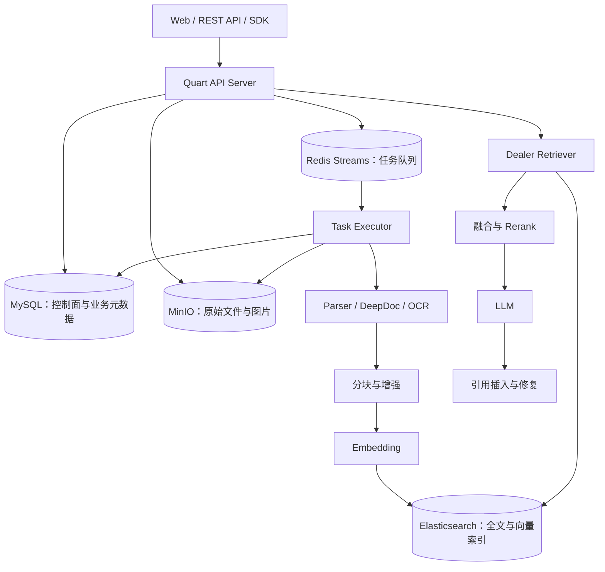
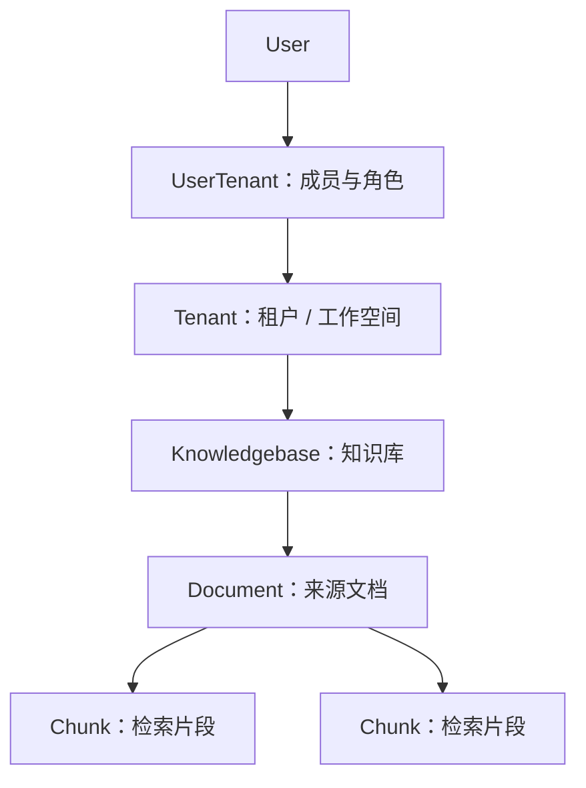
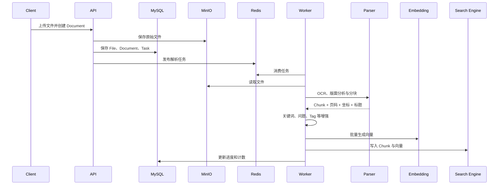
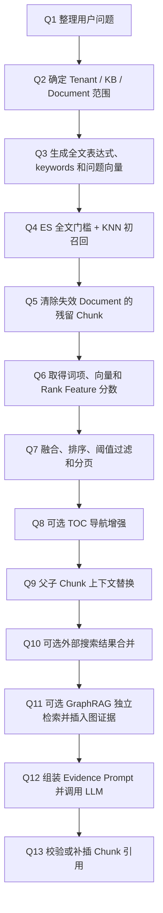

RAGFlow 是一个完整的文档 RAG 平台，覆盖文件上传、解析、分块、索引、混合检索、重排、上下文扩展、LLM 生成和引用回填。它适合处理 PDF、Word、网页、表格和扫描件等企业资料，而不只是提供一个向量检索 SDK。

它解决的核心问题是：**如何把复杂文档加工成可检索、可解释、可用于生成答案的证据。**

<!-- more -->

> 本文依据本地 RAGFlow 提交 `554fb1133ac3861732235ad9c377eb5e0a770665` 分析，以默认 Python API/Ingestion 和 Elasticsearch 路径为主。

## 1. 总体架构与底层存储



| 存储 | 默认实现 | 保存内容 | 角色 |
| --- | --- | --- | --- |
| 关系数据库 | MySQL | Tenant、用户、KB、Document、Task、Dialog、配置 | 控制面和层级关系 |
| 对象存储 | MinIO | 原始文件、Chunk 图片、缩略图 | 原始二进制事实 |
| 文档引擎 | Elasticsearch | Chunk 文本、向量、关键词、位置、图和摘要数据 | 检索投影 |
| Redis | Redis Streams | 任务、进度、取消、缓存和分布式状态 | 异步协调 |

因此 RAGFlow 并没有把所有内容都放入“向量数据库”：原始文件、业务状态与检索投影分别存储。

## 2. Tenant、KB、Document 与 Chunk 层级

RAGFlow 原生维护以下层级：



### 2.1 Tenant：数据与模型配置的工作空间

MySQL 的 `tenant` 表保存租户 ID、名称、默认 LLM、Embedding、Rerank、OCR 和 Parser 等配置。`user_tenant` 表使用 `user_id + tenant_id + role` 表示用户加入了哪些 Tenant 以及角色。

Tenant 是最大的隔离边界，但不等于单个用户。一个工作空间可以有多个成员；代码中知识库创建者的用户 ID 也常作为租户所有者 ID 使用。

搜索侧会通过 Tenant 生成索引名：

```text
ragflow_<tenant_id>
```

因此 Tenant 不只是 Chunk 上的普通标签，它还参与选择物理搜索索引。

### 2.2 Knowledgebase：同一主题的文档集合

MySQL 的 `knowledgebase` 表通过 `tenant_id` 归属 Tenant，并保存：

- 名称、描述、语言和创建者。
- `permission=me|team` 的可见范围。
- 默认 Embedding、Parser、相似度阈值与向量权重。
- 文档数、Chunk 数和 Token 数。
- GraphRAG、RAPTOR 等知识库级任务状态。

KB 是逻辑集合，不代表每个知识库单独部署一套 Elasticsearch。Chunk 通常仍在租户索引中，通过 `kb_id` 区分。

### 2.3 Document：来源和处理状态

MySQL 的 `document` 表通过 `kb_id` 归属某个 Knowledgebase，并保存文件名、类型、来源、对象存储位置、Parser、解析状态、Chunk 数、Token 数等。

Document 是管理和来源单位；Chunk 是它解析后产生的检索单位。普通 Chunk 正文主要保存在 Elasticsearch，而不是作为 MySQL 子表逐条保存。

```text
Document：MySQL索引.md
  ├─ Chunk 1：B+ 树的节点结构
  ├─ Chunk 2：叶子页与范围查询
  ├─ Chunk 3：二级索引与回表
  └─ Chunk 4：全文索引与倒排表
```

`File` 是另一套文件树模型，具有 `parent_id` 和 `tenant_id`，负责文件夹与原始文件管理。它不要和 Document→Chunk 的检索层级混为一谈。

### 2.4 Chunk 如何保存归属

一条简化后的 Elasticsearch Chunk 类似：

```json
{
  "id": "c-btree-2",
  "kb_id": "database-kb",
  "doc_id": "mysql-index-doc",
  "docnm_kwd": "MySQL索引.md",
  "content_with_weight": "叶子节点有序排列并通过链表连接，因此适合范围查询",
  "content_ltks": "叶子 节点 链表 范围 查询",
  "q_1024_vec": [0.018, -0.032, "..."],
  "page_num_int": [3],
  "available_int": 1
}
```

Chunk 不需要重复保存 `tenant_id`：调用方先用 Tenant 选择 `ragflow_<tenant_id>` 索引，再在索引内部按照 `kb_id`、`doc_id` 等字段过滤。

### 2.5 本文贯穿示例：`MySQL索引.md`

后文不再使用互不相关的零散样例，而是始终追踪同一篇文档在各阶段生成了什么记录。假设向 `database-kb` 上传 `MySQL索引.md`，Document ID 为 `mysql-index-doc`，原文如下：

```text
# MySQL 索引

索引用额外的存储结构减少数据库需要扫描的数据量。不同索引适合解决不同查询问题，
并不是索引越多越好，因为索引还会占用空间，并增加插入、更新和删除的维护成本。

## 一、B+ 树索引

InnoDB 的普通索引主要使用 B+ 树。B+ 树由根节点、中间节点和叶子节点组成。
根节点和中间节点主要保存键值及下一层页面的指针，真正的索引记录集中在叶子节点。

叶子节点按照索引键有序排列，而且相邻叶子页之间存在链表指针。因此查询 id=100 时，
可以从根节点逐层定位叶子页；查询 id between 100 and 200 时，定位起点后可以沿叶子页顺序扫描。

聚簇索引的叶子节点保存完整行数据，二级索引的叶子节点保存索引列和主键值。
使用二级索引查询其他列时，可能需要根据主键再次访问聚簇索引，这个过程通常称为回表。

## 二、全文索引

全文索引适合对较长文本做关键词搜索。它不会按照整段文本建立 B+ 树查找路径，
而是先对文本分词，再维护“词语到文档或记录”的倒排映射。

例如文章 A 包含 mysql 和 transaction，文章 B 包含 mysql 和 index，倒排表会记录
mysql -> [A, B]、transaction -> [A]、index -> [B]。查询时可以根据关键词快速找到候选记录。

MySQL 可以使用 MATCH(column) AGAINST(keyword) 执行全文查询。全文索引适合文章内容搜索，
但不适合替代主键查询、精确等值查询和范围查询；这些场景通常仍应使用 B+ 树索引。
```

下面使用的 `c-btree-1`、`m-btree` 等 ID 都是为了便于阅读而简化的。真实 ID 通常是 UUID 或内容哈希；分词和完整向量也会省略，只保留能说明生成与索引过程的字段。

## 3. 层级权限和读取过滤

层级关系不仅用于组织页面，也参与授权和检索。

### 3.1 API 层先判断能否访问 KB

`KnowledgebaseService.accessible(kb_id, user_id)` 的逻辑是：

1. KB 必须存在且状态有效。
2. 如果用户就是 KB 所属 Tenant 的所有者，允许访问。
3. 否则 KB 必须是 `team` 权限。
4. 用户还必须是对应 Tenant 的有效成员。

`DocumentService.accessible(doc_id, user_id)` 先找到 Document，再把检查委托给它所属的 KB。因此 Document 权限继承自 KB，而不是每个 Document 单独维护一套 ACL。

### 3.2 先确定检索范围，再计算内容相关性

这里最容易产生的误解是：RAGFlow 会不会先分析用户问题，再依次推断 Tenant、KB 和 Document？

标准对话流程并不是这样。它实际上把检索分成两个问题：

| 阶段 | 回答的问题 | 决定依据 |
| --- | --- | --- |
| 范围选择 | 允许去哪里搜索？ | Dialog 配置、用户选择、API 参数和权限 |
| 相关性计算 | 范围内哪些 Chunk 与问题相关？ | 全文检索、向量检索和 Reranker |

也就是说，`tenant_ids`、`kb_ids` 和可选的 `doc_ids` 通常在调用 Retriever 前就已经确定。用户问题主要用于在这个范围中搜索和排序 Chunk。

#### `tenant_id` 选择租户索引是什么意思

Elasticsearch 的 Index 可以理解为一张逻辑表或一个顶层数据集合。RAGFlow 按 Tenant 生成索引名：

```text
tenant_id = company-a
        ↓
Elasticsearch Index = ragflow_company-a
```

同一个 Tenant 的多个 KB 通常共享这个索引，再通过 Chunk 上的 `kb_id` 区分：

```text
ragflow_company-a
├── kb_id = database-kb
├── kb_id = redis-kb
└── kb_id = hr-policy
```

因此“选择租户索引”表示先决定向哪个 Elasticsearch Index 发查询，不是根据问题预测一个 Tenant 标签。如果选择的共享 KB 分别属于多个 Tenant，Retriever 也可以同时查询多个 `ragflow_<tenant_id>` 索引。

Tenant ID 也不是直接从问题得到的，而是由已选 KB 反查：

```python
kbs = KnowledgebaseService.get_by_ids(dialog.kb_ids)
tenant_ids = list({kb.tenant_id for kb in kbs})
```

执行顺序是：

```text
先取得已选 kb_ids
      ↓
读取这些 KB 的 tenant_id
      ↓
生成 ragflow_<tenant_id> 索引名
```

#### 系统怎么知道问题与哪个 KB 相关

标准 `Dialog` 路径通常不会在检索前自动判断问题属于哪个 KB。创建 Chat 应用时，管理员已经为它配置了一组 `dialog.kb_ids`，例如：

```json
{
  "dialog_id": "database-assistant",
  "kb_ids": ["database-kb", "redis-kb"]
}
```

用户提问后，RAGFlow 会同时搜索这两个 KB，统一比较其中 Chunk 的分数：

```text
database-kb
├── B+ 树范围查询 Chunk  0.91
└── 全文索引 Chunk       0.48

redis-kb
├── Redis Sorted Set     0.22
└── Redis Stream         0.16
```

用户提问“为什么 B+ 树适合范围查询”后，经过阈值和排序，最终可能只返回得分为 0.91 的 B+ 树 Chunk。换句话说：**KB 决定搜索空间，问题决定这个空间中哪些 Chunk 排名靠前。**

KB 范围主要有三种来源：

1. 创建 Chat/Dialog 时由管理员预先绑定，这是标准对话路径。
2. 用户在搜索界面选择，或者调用方通过 API 显式传入 `kb_ids`。
3. 在 Retriever 前增加业务 Router，通过规则、KB 描述向量、LLM 分类或 Agent 工作流动态选择 KB。

第三种属于额外的查询路由能力；底层 `Dealer.retrieval()` 接收到的已经是确定的 `kb_ids`，它本身不会再做 KB 语义分类。如果有大量不同主题的 KB，不希望每次全部搜索，就需要在上层增加 Router。

#### 完整过滤和召回顺序


`Dealer.retrieval()` 最终收到的请求类似：

```json
{
  "tenant_ids": ["company-a"],
  "kb_ids": ["database-kb"],
  "doc_ids": ["mysql-index-doc"],
  "available_int": 1,
  "question": "为什么 B+ 树适合范围查询"
}
```

其中 `tenant_ids` 用来生成索引名；`Dealer.get_filters()` 把 `kb_ids` 映射为索引字段 `kb_id`，把 `doc_ids` 映射为 `doc_id`。过滤条件与全文和 KNN 查询一起交给文档引擎，所以执行语义近似为：

```text
INDEX = ragflow_company-a

WHERE kb_id IN (database-kb)
  AND doc_id IN (mysql-index-doc)
  AND available_int = 1

MATCH 全文 OR Dense KNN
ORDER BY 融合相关性
LIMIT Top K
```

Metadata 条件会先解析为匹配的 `scoped_doc_ids`，再作为 `doc_id` Filter 进入后端搜索。这虽然包含“计算文档范围、执行搜索”两步，但不是取回全局 Top K 后再删除不匹配结果。

检索后还有 `_prune_deleted_chunks()`，用于清除 MySQL 中 Document 已删除但搜索索引尚有残留的 Chunk。这是最终一致性兜底，不是主要授权机制。

### 3.3 权限模型的边界

RAGFlow 主要提供 Tenant、KB、Document 粒度的范围控制，并不是通用 Chunk 行级 ACL 引擎。安全性依赖 API 层先完成可访问性检查，并始终把允许的 Tenant/KB/Document 范围传给 Retriever。

## 4. 写入：文档摄取流程



解析器会根据文档类型处理 PDF、Word、PPT、Excel、网页和图片。标准 Chunk 还可以携带标题、页码、版面坐标、图片、关键词、候选问题、标签和 Metadata。

以贯穿示例 `MySQL索引.md` 为例，如果没有开启父子 Chunk，Parser 可能先生成六个普通 Chunk：

```text
c-btree-1   B+ 树的根节点、中间节点和叶子节点
c-btree-2   有序叶子页为什么支持等值与范围查询
c-btree-3   聚簇索引、二级索引与回表
c-fulltext-1  全文索引的分词与倒排映射
c-fulltext-2  mysql -> [A,B] 的倒排表示例
c-fulltext-3  MATCH AGAINST 和适用场景
```

其中一条写入搜索索引的记录可以简化为：

```json
{
  "id": "c-btree-2",
  "kb_id": "database-kb",
  "doc_id": "mysql-index-doc",
  "docnm_kwd": "MySQL索引.md",
  "content_with_weight": "叶子节点按照索引键有序排列，而且相邻叶子页之间存在链表指针……",
  "content_ltks": "叶子 节点 索引键 有序 范围 查询",
  "q_1024_vec": [0.018, -0.032, "..."],
  "available_int": 1
}
```

这就是后续增强的基础：父子 Chunk 会改变它的切分粒度并增加引用；TOC 会引用这些 Chunk ID；RAPTOR 会读取这些 Chunk 再生成摘要；GraphRAG 会读取这些 Chunk 再抽取实体和关系。

原始文件在 MinIO，Document 状态在 MySQL，Chunk 投影在 Elasticsearch；跨存储依赖任务状态、重试和清理实现最终一致。

## 5. 读取：混合召回与重排



### 5.1 一次完整查询的主链

下面以用户在 `database-assistant` 中提问“为什么 B+ 树适合范围查询”为例。Dialog 已经绑定 `database-kb`，`MySQL索引.md` 的 Document ID 是 `mysql-index-doc`。

#### [Q1] 整理本次用于检索的问题

标准路径默认只取最后一条用户问题。根据 Dialog 配置，还可以先执行：

- `refine_multiturn`：把多轮对话改写成一个完整问题。
- `cross_languages`：把问题扩展成指定语言。
- `keyword`：调用 LLM 抽取关键词并追加到问题。

假设这些功能没有开启，本步骤输出仍然是：

```text
为什么 B+ 树适合范围查询
```

#### [Q2] 确定允许检索的数据范围

这一阶段不计算内容相关性。系统先取得 Dialog 或 API 指定且用户有权访问的 `kb_ids`，再由 KB 反查 `tenant_ids`；Metadata 条件会先转换成 `scoped_doc_ids`。

```text
tenant_ids = [company-a]           → 选择 ragflow_company-a
kb_ids     = [database-kb]         → 只允许该 KB
doc_ids    = [mysql-index-doc]     → 可选，只允许指定 Document
available_int = 1                  → 只允许普通可检索记录
```

这些范围随后作为 ES Filter 进入初召回，不是先取得全库结果再做权限删除。

#### [Q3] 从同一个问题生成三种查询数据

`FulltextQueryer.question()` 对问题做大小写与字符规范化、分词、停用词处理、词项加权、细粒度切分和同义词扩展，产生两个不同结果；Embedding 模型再产生第三个结果：

| 结果 | 用在哪里 | 含义 |
| --- | --- | --- |
| `matchText.matching_text` | [Q4] ES 全文条件 | 带单词、短语、近邻短语和同义词的 Lucene 查询表达式 |
| `keywords` | [Q6] `term_similarity` | Python 后续计算查询词项覆盖率时使用的词项列表 |
| `query_vector` | [Q4] 和 [Q6] Dense KNN | 整个问题的 Embedding，例如 `q_1024_vec` |

因此“全文至少匹配 30%”针对的是 `matching_text` 被 ES 解析后的查询子句，不是简单数原句里有几个中文词，也不等于后续的 `keywords` 数组。

#### [Q4] ES 初召回一个候选窗口

ES 同时执行范围限制、全文准入和 Dense KNN：

```text
可参加 KNN 的记录
= 指定 Tenant 索引
 ∩ kb_id / 可选 doc_id
 ∩ available_int=1
 ∩ 满足全文 minimum_should_match 的记录
```

当前固定的 `FusionExpr("weighted_sum", {"weights":"0.001,1"})` 在 ES 适配器中只使用第二个 `1`：全文条件仍决定记录能否参加，但全文 Boost 为 0，初召回顺序主要由 KNN `_score` 决定。

本步骤返回一个约 64 条的候选窗口，包括每条 Hit 的 `_id`、初始 `_score` 和所需 `_source` 字段。**RAPTOR 摘要如果已经构建，会在 [Q4] 作为普通可检索记录和原始 Chunk 一起竞争；父记录、TOC 和 Graph 记录通常 `available_int=0`，不会进入这一步。**

#### [Q5] 清除搜索索引中的失效记录

初召回返回后，`_prune_deleted_chunks()` 根据候选的 `doc_id` 查询 MySQL。如果某个 Chunk 所属 Document 已经删除，但 ES 尚未完成清理，就从候选窗口中移除。这是搜索索引最终一致性的兜底，不是主要权限过滤。

#### [Q6] 为每个候选取得最终排序所需的信号

默认 Elasticsearch 路径执行：

1. 对 [Q5] 留下的候选 ID 做第二次 KNN-only 搜索，只取得干净的 `ID → KNN _score`，不再读取 `_source`。
2. 使用 [Q3] 的 `keywords` 与第一次 `_source` 中的 `content_ltks`、`title_tks`、`important_kwd`、`question_tks` 计算 `term_similarity`。
3. 读取可选的 Tag Feature 和 `pagerank_fea`，计算 `rank_feature`。

`term_similarity` 不是 ES 全文 `_score`，也不是索引中预存的字段。代码把查询 `keywords` 和 Chunk 词项分别转换成单词及相邻二元词特征，然后计算“查询特征被 Chunk 覆盖的加权比例”：

```text
term_similarity
= Chunk 中存在的查询特征权重之和
  ÷ 全部查询特征权重之和
```

例如 [Q3] 返回的简化 `keywords=[B+树, 范围查询, 叶子节点]`，A 同时包含三项，覆盖率高；B 只有 `B+树、叶子节点`，覆盖率较低；C 只有无关的“倒排表”，覆盖率接近 0。真实数值还会受到分词权重和相邻二元词影响。

如果配置了外部 Reranker，本步骤改为使用 Reranker 模型给问题与候选正文打分，不执行默认的第二次 KNN-only 分支。

#### [Q7] 融合分数，得到基础 Top Chunk

没有外部 Reranker 时，默认公式是：

```text
similarity = (1 - vector_similarity_weight) × term_similarity
           + vector_similarity_weight × vector_similarity
           + rank_feature
```

代码随后稳定降序排列，删除低于 `similarity_threshold` 的候选，再按 `page_size` 截取当前页。这时得到的是“基础 Top Chunk”，还不是最终送给 LLM 的证据。

#### [Q8] 可选的 TOC 导航增强

仅在 `toc_enhance=true` 时执行。系统把 [Q7] 的 Chunk 按 Document 汇总分数，选出最相关 Document，读取它的 TOC 特殊记录，让 LLM 根据问题选择目录节点对应的 Chunk ID：

- 已在 [Q7] 结果中的 Chunk：增加 TOC 相关分。
- 不在 [Q7] 结果中的 Chunk：按 TOC 给出的 ID 补取正文并加入。
- 最后重新按相似度排序并截取 `top_n`。

所以 TOC 改写的是 [Q7] 的基础结果列表，而不是参与 [Q4] 的普通混合召回。

#### [Q9] 把命中的子 Chunk 替换为父 Chunk

`retrieval_by_children()` 检查 [Q8] 输出中的 `mom_id`。带有同一个 `mom_id` 的命中子块会被移出列表，系统按该 ID 读取不可直接检索的母记录，再放入一条父 Chunk：

```text
正文       = 父 Chunk 的完整原文
检索词项   = 命中子 Chunk 的 content_ltks 合并
similarity = 这些命中子 Chunk 的 similarity 平均值
```

因此父子 Chunk 的作用位置是“检索小块已经命中以后扩大上下文”，不会改变 [Q4] 初召回的搜索粒度。

#### [Q10] 可选地合并外部搜索结果

如果开启 Web Search，系统在父子替换后取得网页 Chunk，并追加到当前 Chunk 列表和 Document 聚合中。这条分支与 RAGFlow 知识库索引无关。

#### [Q11] 可选地插入 GraphRAG 证据

仅在 `use_kg=true` 时执行。`KGSearch` 不复用 [Q4] 的普通 Chunk 候选，而是在相同 Tenant/KB 范围内独立检索 `entity`、`relation` 和可选 `community_report` 记录，结合预计算的 N-hop 与 PageRank，组装出一条临时 Chunk：

```text
docnm_kwd = Related content in Knowledge Graph
content   = Entities 表 + Relations 表 + 可选 Community Report
```

只要内容非空，这条图证据就插在当前 Chunk 列表第一个位置。因此 GraphRAG 是一条在 [Q11] 汇入的并行证据分支，不参与 [Q6] 的普通 Chunk 融合公式。

#### [Q12] 组装证据 Prompt 并调用 LLM

`kb_prompt()` 根据 Token 预算把当前 Chunk 转成 `knowledges`，填入系统 Prompt 的 `{knowledge}`。此时证据可能同时包含：

- [Q4] 命中的普通 Chunk 或 RAPTOR 摘要。
- [Q8] 通过 TOC 补取或加权的 Chunk。
- [Q9] 替换后的父 Chunk。
- [Q10] 外部网页 Chunk。
- [Q11] 插在最前面的 GraphRAG 合成 Chunk。

系统还会加入引用格式要求，然后调用回答模型生成答案。

#### [Q13] 校验或补插引用

如果 LLM 已经输出合法 `[ID:n]`，系统校验编号并修复格式。如果没有引用，系统按需读取当前证据 Chunk 的向量，把答案分句，并根据答案句子与 Chunk 的词项/向量相似度补插 `[ID:n]`，最后只保留实际引用 Document 的资料信息。

#### 检索增强位置总览

| 能力 | 构建时生成什么 | 查询时介入位置 | 具体改变 |
| --- | --- | --- | --- |
| Metadata / 权限范围 | MySQL 层级和 Document Metadata | [Q2]、[Q4] | 先缩小允许搜索的索引、KB 和 Document，再召回 |
| 全文 + Dense KNN | 普通 Chunk 的分词字段和向量 | [Q3]、[Q4] | 全文设置候选门槛，KNN 形成初始候选顺序 |
| 本地融合 / Reranker | 不生成新索引记录 | [Q6]、[Q7] | 重算候选分数、排序、阈值过滤和分页 |
| RAPTOR | 带 `raptor_kwd` 的可检索摘要 Chunk | [Q4]，随后经过 [Q6]、[Q7] | 摘要和原始 Chunk 在同一个候选空间直接竞争 |
| TOC | `available_int=0、toc_kwd=toc` 的目录记录 | [Q8] | 根据基础结果选 Document，再用目录补取或加权 Chunk |
| 父子 Chunk | 子记录的 `mom_id` 和不可直接召回的母记录 | [Q9] | 用小块命中，再把命中子块替换成父块完整正文 |
| GraphRAG | `entity/relation/subgraph/graph/community_report` 记录 | [Q11] | 独立检索图记录，组装一条图证据插到普通证据之前 |
| 引用 | 不生成新的索引结构 | [Q12]、[Q13] | 要求 LLM 引用证据；缺失时按答案与 Chunk 相似度补插 |

### 5.2 混合召回为什么包含两次 ES 查询

第一次是 [Q4] 的候选召回：`Dealer.search()` 同时构造全文 Match、Dense KNN 和 `weighted_sum` Fusion，通过一次 `dataStore.search()` 交给后端。它不是应用层先查全文、再查向量、最后手工取并集。第二次是 [Q6] 针对候选 ID 的 KNN-only 计分，不会扩大候选集合。

#### `weighted_sum Fusion` 是什么

这里有两套容易混在一起的权重：

| 所在阶段 | 权重 | 实际用途 |
| --- | --- | --- |
| 第一次 ES 召回 | 固定的 `"0.001,1"` | 当前 ES 适配器只读取第二个 `1`，把全文查询的 Boost 设为 `0`；第一个 `0.001` 没有使用 |
| 第二步重新打分 | KB/Dialog 的 `vector_similarity_weight`，默认 `0.3` | 在 Python 中真正计算 `0.7 × 词项相似度 + 0.3 × KNN 分数` |

所以 `"0.001,1"` 不是最终分数公式。它只服务于第一次取得一个较大的候选池；真正决定最终排序的是第二套可配置权重。

第二套 `vector_similarity_weight` 按设计应位于 `[0,1]`，词项权重由 `1 - vector_similarity_weight` 得到。当前这段代码没有主动截断越界值，因此调用方仍应保证配置合法。

下面继续使用问题“为什么 B+ 树适合范围查询”。为便于观察，假设租户索引中原本有以下记录。表里的分数是说明流程的示例值，不是对这段文字实际运行模型得到的值。

| Chunk | 内容摘要 | KB / Document | `available_int` | 与问题的向量接近程度 |
| --- | --- | --- | ---: | ---: |
| A | 叶子节点有序，并通过链表连接，适合范围扫描 | `database-kb` / `mysql-index-doc` | 1 | 高 |
| B | B+ 树的根节点、中间节点和叶子节点 | `database-kb` / `mysql-index-doc` | 1 | 较高 |
| C | 全文索引使用倒排表 | `database-kb` / `mysql-index-doc` | 1 | 一般 |
| D | Redis Sorted Set 的跳表实现 | `redis-kb` / `redis-doc` | 1 | 很高 |
| E | B+ 树范围扫描的旧版本内容 | `database-kb` / `mysql-index-doc` | 0 | 很高 |

##### 第一次召回：拿到哪些记录和分数

第一次搜索在 ES 内先应用以下限制：

- 只搜索调用方给出的 Tenant 索引。
- `kb_id` 必须属于本次选择的 KB。
- 传入 `doc_ids` 时，`doc_id` 必须在指定范围内。
- `available_int=1`。
- 默认 `vector_similarity_weight=0.3 < 0.8`，因此全文条件要求至少匹配约 30% 的查询词；这个全文条件也被放进 KNN Filter。

因此，即使 D、E 的向量分数很高，也不会进入候选池：D 属于错误的 KB，E 已经不可用。若某条记录完全不满足全文条件，它同样不会参加这一次 KNN 排名。

在当前 ES 适配器中，`"0.001,1"` 被处理为：

```text
vector_similarity_weight = 1
全文查询 boost = 1 - 1 = 0
KNN boost = 未显式设置
第一个 0.001 = 未使用
```

全文条件仍然负责筛选“有没有资格参加”，但它的打分贡献被设为 0。因此第一次返回结果可以理解为：

| 初召回顺序 | Chunk | 为什么留下 | ES 返回的初始 `_score`（示例） |
| ---: | --- | --- | ---: |
| 1 | A | 范围正确、满足全文条件、向量最接近 | 0.92 |
| 2 | B | 范围正确、满足全文条件、向量较接近 | 0.89 |
| 3 | C | 范围正确、勉强满足全文条件、向量一般 | 0.55 |

这个 `_score` 主要是 ES 的 KNN `_score`，不是 `0.001 × 全文分数 + 1 × 向量分数`。对于 cosine 向量，ES 返回的是它自己的 KNN 计分结果；RAGFlow 在此处不把它还原成原始向量，也不使用第一个 `0.001` 重新计算。

第一次返回的每个 Hit 大致包含两部分：

```json
{
  "_id": "A",
  "_score": 0.92,
  "_source": {
    "content_with_weight": "叶子节点按照索引键有序排列……",
    "content_ltks": "叶子 节点 索引键 有序 范围 查询",
    "title_tks": "MySQL 索引 B+ 树",
    "important_kwd": ["B+树", "范围查询"],
    "kb_id": "database-kb",
    "doc_id": "mysql-index-doc",
    "pagerank_fea": 0
  }
}
```

`_source` 不是计算出来的分数，它只是这条 Chunk 原来存储的正文和元数据。`Dealer.search()` 把 `_source` 保存到 `sres.field[A]`，同时把第一次的 `_score` 也暂存在其中。主检索为了减少传输，不取回 Chunk 向量。

`top=1024` 表示 ES 的 KNN 最多寻找 1024 个邻居，并不表示最终直接返回 1024 条给用户。RAGFlow 实际只从 ES 取一个约 64 条的重排窗口；例如 `page_size=10` 时窗口向上取整为 70 条。

##### 第二次搜索：只为候选记录重新取得 KNN 分数

第一次得到 A、B、C 后，`_knn_scores()` 发起第二次 KNN-only 搜索。它的范围不是整个知识库，而是：

```text
id IN [A, B, C]
AND kb_id IN [database-kb]
```

这一步传入的 `select_fields=[]`，所以不读取 `_source`，只取每条候选的 `_id` 和 `_score`：

```json
{
  "A": 0.92,
  "B": 0.89,
  "C": 0.55
}
```

代码把这个结果称为 `knn_scores`。它的作用是得到不混入全文打分和 Rank Feature 的 KNN 分数，并按照 ID 映射回第一次取得的 A、B、C；正文等 `_source` 数据仍然复用第一次查询的结果。

第二次搜索没有再次携带 `doc_id` 和 `available_int`，但不会因此把 D、E 加回来，因为它只能搜索第一次候选 ID `[A,B,C]`。第一次结果返回后，代码还会查询 MySQL，删除所属 Document 已不存在的残留 Chunk。

##### 在 Python 中计算最终分数并排序

接下来 `rerank_with_knn()` 为每个候选计算两个值：

1. `term_similarity`：问题关键词在 Chunk 的 `content_ltks`、`title_tks`、`important_kwd` 和 `question_tks` 中的覆盖程度。
2. `vector_similarity`：第二次 ES 搜索返回的 KNN `_score`。

默认 `vector_similarity_weight=0.3`，所以 `term_similarity_weight=0.7`。没有额外 Tag 或 PageRank 加分时：

```text
final_similarity = 0.7 × term_similarity
                 + 0.3 × vector_similarity
```

把示例记录代入：

| Chunk | `term_similarity` | 第二次 KNN `vector_similarity` | 计算 | 最终 `similarity` |
| --- | ---: | ---: | --- | ---: |
| A | 0.90 | 0.92 | `0.7×0.90 + 0.3×0.92` | 0.906 |
| B | 0.55 | 0.89 | `0.7×0.55 + 0.3×0.89` | 0.652 |
| C | 0.02 | 0.55 | `0.7×0.02 + 0.3×0.55` | 0.179 |

如果配置了 Tag Feature 或 `pagerank_fea`，它们还会作为 `rank_feature` 加到上述结果上：

```text
final_similarity = 词项权重 × term_similarity
                 + 向量权重 × vector_similarity
                 + rank_feature
```

最后代码按 `final_similarity` 稳定降序排列，再应用 `similarity_threshold`。默认阈值假设为 `0.2`，那么 C 的 `0.179` 会被删除，剩下：

```text
A  0.906
B  0.652
```

最后才按照分页取 `page_size` 条。例如候选窗口有 70 条、`page_size=10`，流程是：先对 70 条重算分数并排序，删除低于阈值的记录，再返回当前页前 10 条。这 10 条才是调用方实际得到的最终 Top 结果。

返回给上层的 Chunk 会明确区分三种分数：

```json
{
  "chunk_id": "A",
  "content_with_weight": "叶子节点按照索引键有序排列……",
  "similarity": 0.906,
  "term_similarity": 0.90,
  "vector_similarity": 0.92
}
```

因此，不要使用第一次 ES 返回的 `_score=0.92` 解释最终排名。最终采用的是 Python 重新计算的 `similarity=0.906`。如果启用了外部 Reranker，第二次 KNN-only 分支会被 Reranker 模型分数替代，但之后仍然执行降序、阈值过滤和分页。

### 5.3 父子 Chunk 和 TOC

#### 父子 Chunk：从章节大块切出检索小块

父子关系在写入阶段生成，在查询阶段只影响 **[Q9]**。子 Chunk 正常参加 [Q4]～[Q7]，母记录不参加普通召回。

父子 Chunk 使用两次确定性的切分，不需要 LLM 判断关系。以 `MySQL索引.md` 的 B+ 树章节为例：

1. 主分块先按 `delimiter` 和 `chunk_token_num` 把整个“B+ 树索引”章节形成一个较大的块 `M1`。它包含树结构、范围查询、聚簇索引和回表。
2. 开启 `parent_child.use_parent_child` 后，执行层根据 `children_delimiter` 把 `M1` 按段落继续切成 `c-btree-1`、`c-btree-2`、`c-btree-3`。
3. 每个子对象临时保存同一份完整母文本 `mom=M1.text`。
4. 写索引时，RAGFlow 对母文本做 `xxhash64`，得到简化表示 `m-btree`。子记录增加 `mom_id=m-btree`，同时额外写入一条 `id=m-btree` 的母记录。

```text
M1：B+ 树章节完整原文
 ├─ c-btree-1：根节点、中间节点和叶子节点
 ├─ c-btree-2：有序叶子页与范围查询
 └─ c-btree-3：聚簇索引、二级索引与回表
```

在 `ragflow_<tenant_id>` 搜索索引中，核心记录可以简化为：

```json
{ "id": "c-btree-1", "doc_id": "mysql-index-doc", "kb_id": "database-kb",
  "content_with_weight": "B+ 树由根节点、中间节点和叶子节点组成……",
  "mom_id": "m-btree", "available_int": 1,
  "q_1024_vec": [0.018, -0.027, "..."] }

{ "id": "c-btree-2", "doc_id": "mysql-index-doc", "kb_id": "database-kb",
  "content_with_weight": "叶子节点有序排列并通过链表连接，因此适合范围查询。",
  "mom_id": "m-btree", "available_int": 1,
  "q_1024_vec": [0.011, -0.032, "..."] }

{ "id": "m-btree", "doc_id": "mysql-index-doc", "kb_id": "database-kb",
  "content_with_weight": "B+ 树章节的完整原文：结构、范围查询、聚簇索引和回表……",
  "available_int": 0 }
```

全文索引章节会以相同方式生成 `c-fulltext-1..3` 和 `m-fulltext`。父子关系只有一跳：

```text
c-btree-1.mom_id ─┐
c-btree-2.mom_id ─┼──> m-btree.id
c-btree-3.mom_id ─┘
```

母记录没有 `children` 数组，也没有单独的 `mother_kwd`。它的身份来自“自己的 `id` 被子块的 `mom_id` 引用”，所以这不是可递归遍历的任意层级树。

查询“为什么 B+ 树适合范围查询”时：

1. **[Q4]～[Q7]**：普通检索只搜索 `available_int=1` 的小块，`c-btree-2` 容易精确命中并完成基础排序。
2. **[Q9]**：`retrieval_by_children()` 发现它带有 `mom_id=m-btree`。
3. **[Q9]**：系统按 ID 读取 `available_int=0` 的 `m-btree`。
4. **[Q12]**：最终把 B+ 树章节的大块原文交给 LLM，实现“用小块搜索、用大块回答”。

#### TOC：从已有 Chunk 生成章节导航

TOC 在写入阶段生成目录记录，在查询阶段只影响 **[Q8]**。它读取 [Q7] 已经排好的基础结果，但不参加 [Q4] 初召回。

TOC 不会改变上述 Chunk，也不使用 `mom_id`。普通 Chunk 生成后，LLM 阅读 `MySQL索引.md` 的标题和内容，输出目录层级及每个章节对应的 Chunk ID。系统把整个目录作为一条特殊记录写入同一搜索索引：

```json
{
  "id": "toc-mysql-index",
  "doc_id": "mysql-index-doc",
  "kb_id": "database-kb",
  "toc_kwd": "toc",
  "available_int": 0,
  "content_with_weight": "[{'level':1,'title':'MySQL 索引'}, {'level':2,'title':'B+ 树索引','chunk_ids':['c-btree-1','c-btree-2','c-btree-3']}, {'level':2,'title':'全文索引','chunk_ids':['c-fulltext-1','c-fulltext-2','c-fulltext-3']}]"
}
```

这条记录表达的是“目录标题 → 已有 Chunk ID”，而不是父 Chunk：

```text
B+ 树索引 ──> c-btree-1、c-btree-2、c-btree-3
全文索引   ──> c-fulltext-1、c-fulltext-2、c-fulltext-3
```

查询“这篇文章介绍了哪两种索引”时，系统先在 [Q4]～[Q7] 通过普通召回确定 `MySQL索引.md` 最相关；[Q8] 再按 `doc_id + toc_kwd="toc"` 读取目录，让 LLM 选择“B+ 树索引”和“全文索引”两个章节，最后按 `chunk_ids` 加权或补取正文。TOC 自身 `available_int=0`，不会作为普通正文命中。

### 5.4 RAPTOR 与 GraphRAG

#### RAPTOR：从六个基础 Chunk 生成多层摘要

RAPTOR 在写入阶段增加摘要记录，在查询阶段影响 **[Q4]～[Q7]**。它没有单独的查询后处理步骤：可检索摘要直接与普通 Chunk 一起召回、重新打分和排序。

RAPTOR 不按标题建立父子关系，而是读取前面已经写入的普通 Chunk 文本和向量，然后循环执行“相邻语义聚类 → LLM 摘要 → 摘要 Embedding → 再聚类”。在本例中可以形成：

```text
第 0 层（已有普通 Chunk）
  c-btree-1、c-btree-2、c-btree-3
  c-fulltext-1、c-fulltext-2、c-fulltext-3

第 1 层（两个主题摘要）
  r-btree：B+ 树通过有序叶子页支持等值和范围查询，二级索引可能回表……
  r-fulltext：全文索引通过分词和倒排表支持长文本关键词搜索……

第 2 层（整篇文档摘要）
  r-all：MySQL 会根据查询类型选择 B+ 树索引或全文索引……
```

算法运行时使用 `parent_child_map` 暂时记录 `r-all → [r-btree,r-fulltext]`，并向上合并叶子来源。但普通可检索模式不会像父子 Chunk 那样持久化 `mom_id`，而是把每个摘要独立写成可检索记录：

```json
{ "id": "r-btree", "doc_id": "mysql-index-doc", "kb_id": "database-kb",
  "raptor_kwd": "raptor", "raptor_layer_int": 1,
  "content_with_weight": "B+ 树通过有序叶子页支持等值和范围查询，二级索引可能回表……",
  "content_ltks": "B+树 叶子页 等值 范围查询 二级索引 回表",
  "q_1024_vec": [0.021, -0.018, "..."] }

{ "id": "r-fulltext", "doc_id": "mysql-index-doc", "kb_id": "database-kb",
  "raptor_kwd": "raptor", "raptor_layer_int": 1,
  "content_with_weight": "全文索引通过分词和倒排表支持长文本关键词搜索……",
  "q_1024_vec": [0.017, -0.012, "..."] }

{ "id": "r-all", "doc_id": "mysql-index-doc", "kb_id": "database-kb",
  "raptor_kwd": "raptor", "raptor_layer_int": 2,
  "content_with_weight": "MySQL 会根据查询类型选择 B+ 树索引或全文索引……",
  "q_1024_vec": [0.008, -0.006, "..."] }
```

`raptor_kwd="raptor"` 说明它是摘要 Chunk，`raptor_layer_int` 说明摘要层级。普通 Chunk 与这些摘要都有分词和向量，所以一起参加全文 + Dense KNN：

- 问“叶子节点为什么适合范围扫描”，更可能命中原始 `c-btree-2`。
- 问“B+ 树索引有哪些特点”，更可能命中 `r-btree`。
- 问“B+ 树和全文索引应该如何选择”，更可能命中总摘要 `r-all`。

查询不会先命中叶子再沿 `parent_id` 上行。RAPTOR 的主要作用是把不同抽象层级的摘要直接加入候选空间。部分路径会保存 `source_chunk_ids`；结构展示模式也可以额外保存一条 `raptor_kwd="raptor_tree"、available_int=0` 的嵌套树 JSON，但它不参加普通召回。

构建配置位于 `parser_config.raptor`，包括 `use_raptor`、`scope=file|dataset`、摘要 `prompt`、`max_token`、`max_cluster`、`clustering_threshold`、`clustering_ratio` 和 `random_seed`。它作为后台任务执行；重新构建时先写入新摘要，再清理旧摘要。

#### GraphRAG：如何启用

GraphRAG 在写入阶段生成图记录，在查询阶段通过独立的 **[Q11]** 分支检索；它不参加普通 Chunk 的 [Q4]～[Q7] 排名。

GraphRAG 有两个独立开关，缺一不可：

1. **构建开关**：在 KB 的 `parser_config.graphrag` 中设置 `use_graphrag=true`，并执行 GraphRAG/Graph 索引任务，生成图数据。
2. **查询开关**：对话的 `prompt_config.use_kg=true`，或者检索 API 请求传 `use_kg=true`，查询阶段才会额外调用 `KGSearch`。

示意配置如下：

```json
{
  "graphrag": {
    "use_graphrag": true,
    "method": "light",
    "entity_types": ["organization", "person", "geo", "event", "category"],
    "resolution": false,
    "community": false,
    "batch_chunk_token_size": 4096,
    "retry_attempts": 2
  }
}
```

- `method=light`：LightRAG 风格的 LLM 抽取，当前默认。
- `method=general`：较完整的 LLM 图抽取路径。
- `method=ner`：基于 NER 的抽取路径，实体/关系抽取本身不依赖 LLM。
- `resolution=true`：做实体消歧与合并，例如把“OpenAI”和“Open AI”合并。
- `community=true`：做社区划分并让 LLM 生成社区报告，适合全局性问题，但构建更慢、成本更高。

本地代码还提供构建、合并、实体消歧和社区阶段的超时与重试配置。需要特别注意当前 checkout 的接口演进：兼容层注释把旧 `/run_graphrag` 指向 `/index?type=graph`，但统一索引服务又把 `type=graph` 映射为新的 `structure_graph` 任务；旧的 `task_type="graphrag"` 处理器仍然存在。也就是说，**这个提交中的“Graph/Structure Graph”和旧 GraphRAG 构建入口正在合并演进，不能只凭 URL 名称判断执行了哪条代码路径**。部署时应以实际版本产生的任务类型和索引记录为准。

#### GraphRAG 使用什么数据库

RAGFlow 没有为 GraphRAG 单独配置 Neo4j、NebulaGraph 之类的图数据库。图构建过程在内存中使用 NetworkX，持久化仍通过统一 `docStoreConn` 写入当前文档引擎；默认 Elasticsearch 部署中，它们仍位于 `ragflow_<tenant_id>` 索引，并用 `kb_id` 隔离 KB。

MySQL 保存 KB 配置和任务状态，Redis 用于任务、锁、缓存与阶段标记；它们都不是 GraphRAG 的图查询数据库。若部署切换其他文档引擎，GraphRAG 也是走对应的文档引擎适配器，而不是另配一套图数据库连接。

GraphRAG 从本例的六个基础 Chunk 中抽取出的内容可能是：

```text
实体：B+ 树索引、叶子节点、范围查询、二级索引、回表、全文索引、倒排表

关系：
  B+ 树索引 ──支持──> 范围查询
  二级索引  ──可能触发──> 回表
  全文索引  ──使用──> 倒排表
```

RAGFlow 没有把这些数据写入 Neo4j，而是把每个实体和关系转换为带向量的搜索索引记录：

```json
{
  "id": "e-btree",
  "knowledge_graph_kwd": "entity",
  "entity_kwd": "B+ 树索引",
  "entity_type_kwd": "category",
  "content_with_weight": "{\"description\":\"适合等值和范围查询的有序树索引结构\"}",
  "source_id": ["mysql-index-doc"],
  "rank_flt": 0.031,
  "n_hop_with_weight": "[...]",
  "kb_id": "database-kb",
  "available_int": 0,
  "q_1024_vec": [0.013, -0.019, "..."]
}
```

```json
{
  "id": "rel-btree-range",
  "knowledge_graph_kwd": "relation",
  "from_entity_kwd": "B+ 树索引",
  "to_entity_kwd": "范围查询",
  "content_with_weight": "{\"description\":\"B+ 树的叶子页有序并通过链表连接，因此支持范围查询\",\"weight\":3}",
  "source_id": ["mysql-index-doc"],
  "weight_int": 3,
  "kb_id": "database-kb",
  "available_int": 0,
  "q_1024_vec": [0.009, -0.014, "..."]
}
```

完成实体和关系写入后，还会保存图的整体结构：

- `knowledge_graph_kwd="subgraph"`：`MySQL索引.md` 的 NetworkX node-link JSON，`source_id=["mysql-index-doc"]`，既是文档级图，也是构建断点。
- `knowledge_graph_kwd="graph"`：把 `database-kb` 中所有 Document 子图合并后的 KB 图快照，`source_id` 包含所有来源 Document ID。
- `knowledge_graph_kwd="community_report"`：可选的社区摘要与证据。

这些记录的 `available_int=0` 表示不进入普通 Chunk 召回；它们由专门的 `KGSearch` 查询。

#### GraphRAG 如何构建、更新和检索

构建流程是：

```text
Document 普通 Chunk
  → 按 token 预算分批
  → light/general/ner 抽取实体与关系
  → 保存每个 Document 的 subgraph
  → 合并成 KB graph
  → 计算 PageRank 与 N-hop 邻居
  → 可选实体消歧
  → 可选社区划分与社区报告
  → 写入 entity、relation、graph、subgraph、community_report 记录
```

更新不是查询时临时重新抽取。已有 `subgraph` 会被当作检查点并跳过 LLM 抽取，因此文档内容变化后，最稳妥的更新方式是使旧文档子图失效，或者重置 Graph 索引后重新运行构建。全量 wipe 会删除 `graph/subgraph/entity/relation/community_report` 并清除阶段标记，再重新排队构建。删除 Document 时，代码会从图记录的 `source_id` 中移除该 Document，并把总图标记为 `removed_kwd="Y"`，后续可根据剩余子图重建。

图更新时先准备新的图快照、子图和实体/关系向量，准备完成后再删除或替换旧的图记录；社区报告也采用先写新集合、再清理过期 ID 的方式，降低构建中断造成空图的风险。

检索流程全部发生在 **[Q11]**：

1. 例如问题“哪些索引支持范围查询”，LLM 先抽取问题实体“范围查询”和可能的答案类型。
2. 在指定 `tenant index + kb_ids` 范围内，对 `knowledge_graph_kwd="entity"` 做 Dense 检索，命中“范围查询”和“B+ 树索引”，并按实体类型、PageRank 和相似度补强。
3. 对 `knowledge_graph_kwd="relation"` 做 Dense 检索，命中 `B+ 树索引 → 支持 → 范围查询`，再结合 N-hop 路径和关系权重排序。
4. 若启用社区报告，按相关实体读取高权重 `community_report`。
5. 把实体表、关系表和社区报告拼成一个临时结果：`docnm_kwd="Related content in Knowledge Graph"`。
6. 将该合成 Chunk 插入普通检索证据的前面，再一起交给回答模型。

因此 GraphRAG 不是让 Elasticsearch 执行图遍历，也不是把 Cypher 发给 Neo4j；它是“向量检索图记录 + RAGFlow Python 代码读取预计算的 N-hop/PageRank + 组装图证据”。

简单说：**父子 Chunk 持久化一跳外键；RAPTOR 算法生成摘要树、检索时主要使用扁平摘要节点；GraphRAG 把实体关系保存为专用文档记录，再由 KG Retriever 额外组织图证据。**

### 5.5 引用如何生成

引用发生在 **[Q12]～[Q13]**，不会反过来改变 [Q4]～[Q11] 已经选出的证据。

系统先在 Prompt 中把知识片段编号，要求 LLM 输出 `[ID:n]`。生成后会校验引用格式和范围。

如果模型没有给出引用，`decorate_answer()` 会把答案拆成句子，对答案片段和候选 Chunk 计算词项与向量相似度，再给最相关的句子插入 `[ID:n]`，最多关联四个 Chunk。

这种后插引用是相关性匹配，不是事实蕴含证明。高风险场景仍应增加 Claim Verification 或“证据不足则拒答”。

## 6. 主要问题与解决方案

| 问题 | RAGFlow 的方案 |
| --- | --- |
| PDF、表格和扫描件难解析 | DeepDoc、OCR、版面识别和专用 Parser |
| 固定分块破坏语义 | 结构分块、标题路径、父子 Chunk、TOC |
| 纯向量漏掉精确词项 | 全文与 Dense KNN 混合召回 |
| 初召回顺序不准 | 词项/向量融合和可选 Reranker |
| 概括性问题难命中 | RAPTOR 摘要节点 |
| 跨 Chunk 关系难表达 | GraphRAG 图证据 |
| 回答难以验证 | Chunk 引用和引用资料返回 |
| 多租户数据混淆 | Tenant 索引、KB/Document Filter 和访问检查 |
| 大文件处理耗时 | Redis 任务、Worker、进度、取消和重试 |

## 7. 事实源与检索投影的边界

RAGFlow 保存原始文件，并把 Chunk 与向量作为解析投影，这是合理方向。但它还不是完整的动态文档版本系统：

- Chunk PATCH 会直接更新检索投影，不会回写原始文件。
- 重新解析可能覆盖人工修改的 Chunk。
- 没有统一的 `document_version_id` 和 ready-version 原子读指针。
- 跨 MinIO、MySQL、Redis、Elasticsearch 的写入不是单一事务。
- File/Artifact Commit 尚未形成“提交原文版本—构建完整索引—原子发布—一键回退”的闭环。

所以它适合以上传、同步和重新解析为主的企业知识库。如果需要多人频繁在线编辑同一文档，应在上层增加版本化事实源和发布协议。

## 8. 本地代码依据

- `api/db/db_models.py`：Tenant、UserTenant、Knowledgebase、Document、File 等模型。
- `api/db/services/knowledgebase_service.py`：KB 可访问性检查。
- `api/db/services/document_service.py`：Document 权限、状态和任务。
- `rag/svr/task_executor.py`、`rag/svr/task_executor_refactor/`：摄取、解析、增强、RAPTOR、Embedding 和索引。
- `rag/nlp/search.py`、`rag/utils/es_conn.py`：租户索引、过滤、混合召回、ES 查询翻译、重排和结构扩展。
- `rag/flow/chunker/title_chunker/hierarchy_chunker.py`、`token_chunker.py`：层级和父子 Chunk。
- `rag/advanced_rag/knowlege_compile/raptor.py`：RAPTOR。
- `rag/graphrag/general/index.py`、`rag/graphrag/utils.py`、`rag/graphrag/search.py`：GraphRAG 构建、持久化与查询。
- `api/apps/services/dataset_api_service.py`：Graph、RAPTOR 等索引任务入口、重置与清理。
- `api/db/services/dialog_service.py`、`rag/prompts/citation_prompt.md`：生成与引用。

下一篇：[Mem0 详解](./005_mem0.md)。对比与选型见：[RAG 框架对比与选型](./006_rag_framework_comparison.md)。
