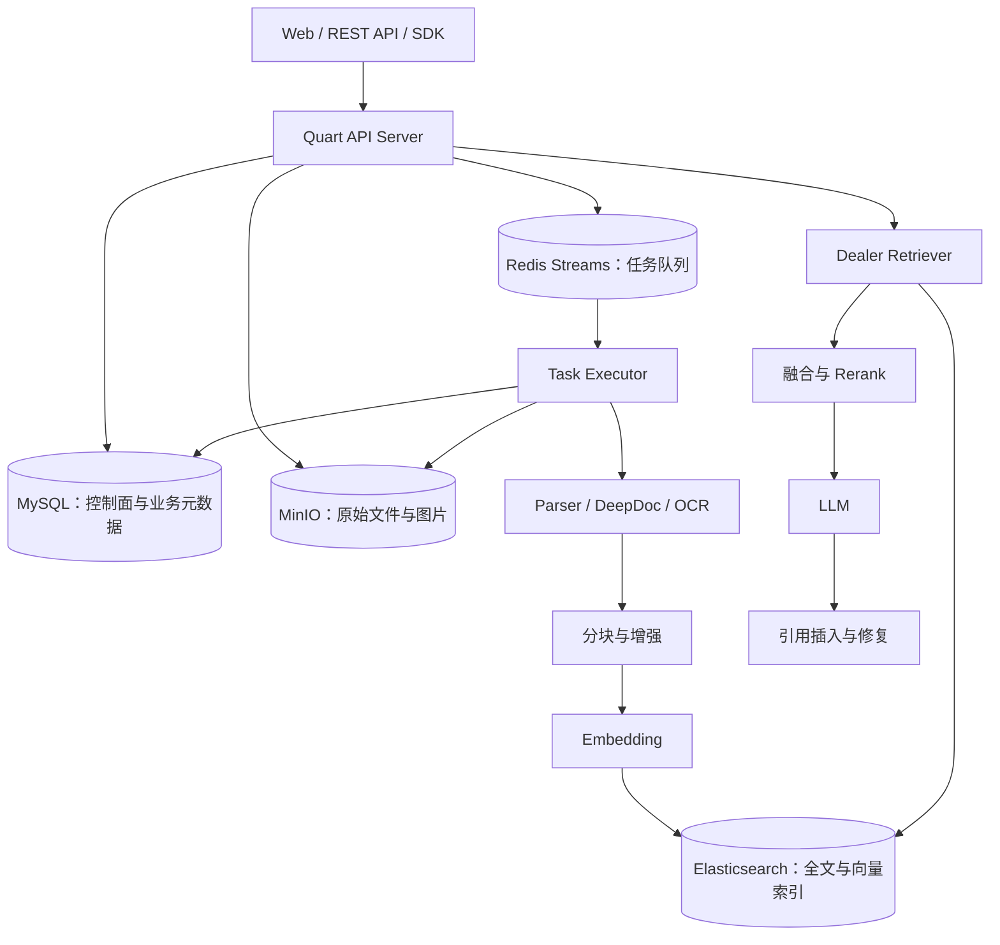
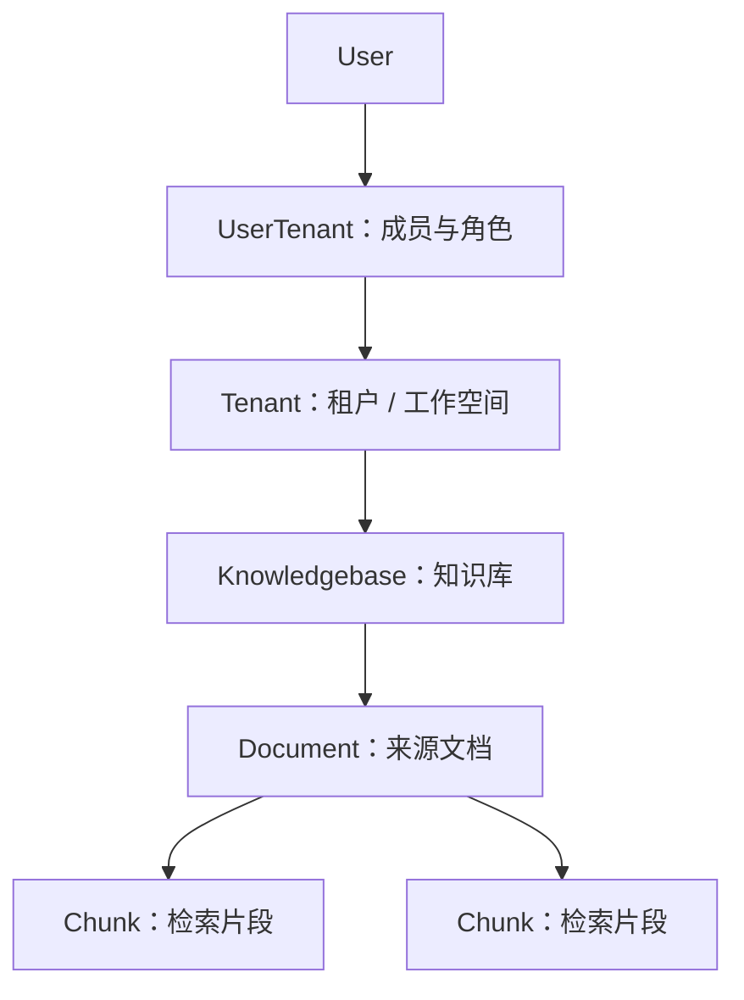
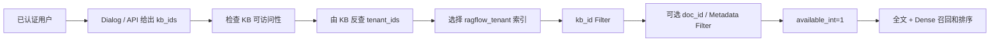
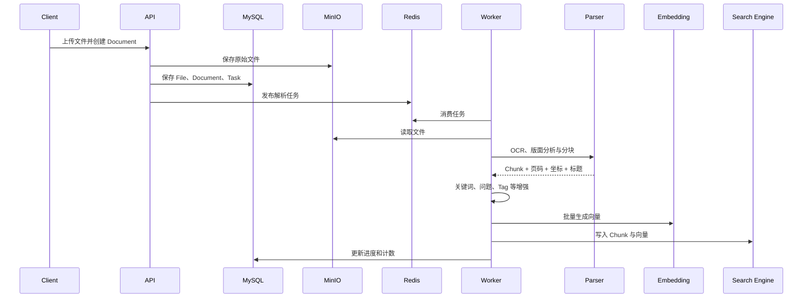
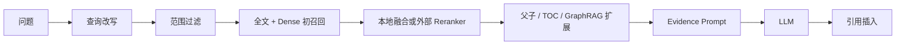

RAGFlow 是一个完整的文档 RAG 平台，覆盖文件上传、解析、分块、索引、混合检索、重排、上下文扩展、LLM 生成和引用回填。它适合处理 PDF、Word、网页、表格和扫描件等企业资料，而不只是提供一个向量检索 SDK。

它解决的核心问题是：**如何把复杂文档加工成可检索、可解释、可用于生成答案的证据。**

<!-- more -->

> 本文依据本地 RAGFlow 提交 `554fb1133ac3861732235ad9c377eb5e0a770665` 分析，以默认 Python API/Ingestion 和 Elasticsearch 路径为主。

## 1. 总体架构与底层存储



| 存储 | 默认实现 | 保存内容 | 角色 |
| --- | --- | --- | --- |
| 关系数据库 | MySQL | Tenant、用户、KB、Document、Task、Dialog、配置 | 控制面和层级关系 |
| 对象存储 | MinIO | 原始文件、Chunk 图片、缩略图 | 原始二进制事实 |
| 文档引擎 | Elasticsearch | Chunk 文本、向量、关键词、位置、图和摘要数据 | 检索投影 |
| Redis | Redis Streams | 任务、进度、取消、缓存和分布式状态 | 异步协调 |

因此 RAGFlow 并没有把所有内容都放入“向量数据库”：原始文件、业务状态与检索投影分别存储。

## 2. Tenant、KB、Document 与 Chunk 层级

RAGFlow 原生维护以下层级：



### 2.1 Tenant：数据与模型配置的工作空间

MySQL 的 `tenant` 表保存租户 ID、名称、默认 LLM、Embedding、Rerank、OCR 和 Parser 等配置。`user_tenant` 表使用 `user_id + tenant_id + role` 表示用户加入了哪些 Tenant 以及角色。

Tenant 是最大的隔离边界，但不等于单个用户。一个工作空间可以有多个成员；代码中知识库创建者的用户 ID 也常作为租户所有者 ID 使用。

搜索侧会通过 Tenant 生成索引名：

```text
ragflow_<tenant_id>
```

因此 Tenant 不只是 Chunk 上的普通标签，它还参与选择物理搜索索引。

### 2.2 Knowledgebase：同一主题的文档集合

MySQL 的 `knowledgebase` 表通过 `tenant_id` 归属 Tenant，并保存：

- 名称、描述、语言和创建者。
- `permission=me|team` 的可见范围。
- 默认 Embedding、Parser、相似度阈值与向量权重。
- 文档数、Chunk 数和 Token 数。
- GraphRAG、RAPTOR 等知识库级任务状态。

KB 是逻辑集合，不代表每个知识库单独部署一套 Elasticsearch。Chunk 通常仍在租户索引中，通过 `kb_id` 区分。

### 2.3 Document：来源和处理状态

MySQL 的 `document` 表通过 `kb_id` 归属某个 Knowledgebase，并保存文件名、类型、来源、对象存储位置、Parser、解析状态、Chunk 数、Token 数等。

Document 是管理和来源单位；Chunk 是它解析后产生的检索单位。普通 Chunk 正文主要保存在 Elasticsearch，而不是作为 MySQL 子表逐条保存。

```text
Document：退款规则.pdf
  ├─ Chunk 1：退款申请期限
  ├─ Chunk 2：退款条件
  └─ Chunk 3：处理流程
```

`File` 是另一套文件树模型，具有 `parent_id` 和 `tenant_id`，负责文件夹与原始文件管理。它不要和 Document→Chunk 的检索层级混为一谈。

### 2.4 Chunk 如何保存归属

一条简化后的 Elasticsearch Chunk 类似：

```json
{
  "id": "chunk-17",
  "kb_id": "customer-service",
  "doc_id": "refund-policy-2026",
  "docnm_kwd": "退款规则.pdf",
  "content_with_weight": "商品签收后七天内可以申请退款",
  "content_ltks": "商品 签收 七天 退款",
  "q_1024_vec": [0.018, -0.032, "..."],
  "page_num_int": [3],
  "available_int": 1
}
```

Chunk 不需要重复保存 `tenant_id`：调用方先用 Tenant 选择 `ragflow_<tenant_id>` 索引，再在索引内部按照 `kb_id`、`doc_id` 等字段过滤。

## 3. 层级权限和读取过滤

层级关系不仅用于组织页面，也参与授权和检索。

### 3.1 API 层先判断能否访问 KB

`KnowledgebaseService.accessible(kb_id, user_id)` 的逻辑是：

1. KB 必须存在且状态有效。
2. 如果用户就是 KB 所属 Tenant 的所有者，允许访问。
3. 否则 KB 必须是 `team` 权限。
4. 用户还必须是对应 Tenant 的有效成员。

`DocumentService.accessible(doc_id, user_id)` 先找到 Document，再把检查委托给它所属的 KB。因此 Document 权限继承自 KB，而不是每个 Document 单独维护一套 ACL。

### 3.2 先确定检索范围，再计算内容相关性

这里最容易产生的误解是：RAGFlow 会不会先分析用户问题，再依次推断 Tenant、KB 和 Document？

标准对话流程并不是这样。它实际上把检索分成两个问题：

| 阶段 | 回答的问题 | 决定依据 |
| --- | --- | --- |
| 范围选择 | 允许去哪里搜索？ | Dialog 配置、用户选择、API 参数和权限 |
| 相关性计算 | 范围内哪些 Chunk 与问题相关？ | 全文检索、向量检索和 Reranker |

也就是说，`tenant_ids`、`kb_ids` 和可选的 `doc_ids` 通常在调用 Retriever 前就已经确定。用户问题主要用于在这个范围中搜索和排序 Chunk。

#### `tenant_id` 选择租户索引是什么意思

Elasticsearch 的 Index 可以理解为一张逻辑表或一个顶层数据集合。RAGFlow 按 Tenant 生成索引名：

```text
tenant_id = company-a
        ↓
Elasticsearch Index = ragflow_company-a
```

同一个 Tenant 的多个 KB 通常共享这个索引，再通过 Chunk 上的 `kb_id` 区分：

```text
ragflow_company-a
├── kb_id = customer-service
├── kb_id = product-manual
└── kb_id = hr-policy
```

因此“选择租户索引”表示先决定向哪个 Elasticsearch Index 发查询，不是根据问题预测一个 Tenant 标签。如果选择的共享 KB 分别属于多个 Tenant，Retriever 也可以同时查询多个 `ragflow_<tenant_id>` 索引。

Tenant ID 也不是直接从问题得到的，而是由已选 KB 反查：

```python
kbs = KnowledgebaseService.get_by_ids(dialog.kb_ids)
tenant_ids = list({kb.tenant_id for kb in kbs})
```

执行顺序是：

```text
先取得已选 kb_ids
      ↓
读取这些 KB 的 tenant_id
      ↓
生成 ragflow_<tenant_id> 索引名
```

#### 系统怎么知道问题与哪个 KB 相关

标准 `Dialog` 路径通常不会在检索前自动判断问题属于哪个 KB。创建 Chat 应用时，管理员已经为它配置了一组 `dialog.kb_ids`，例如：

```json
{
  "dialog_id": "customer-service-bot",
  "kb_ids": ["customer-service", "product-manual"]
}
```

用户提问后，RAGFlow 会同时搜索这两个 KB，统一比较其中 Chunk 的分数：

```text
customer-service
├── 退款期限 Chunk       0.91
└── 客服工作时间 Chunk   0.32

product-manual
├── 产品安装 Chunk       0.18
└── 产品保修 Chunk       0.41
```

经过阈值和排序后，最终可能只返回得分为 0.91 的退款 Chunk。换句话说：**KB 决定搜索空间，问题决定这个空间中哪些 Chunk 排名靠前。**

KB 范围主要有三种来源：

1. 创建 Chat/Dialog 时由管理员预先绑定，这是标准对话路径。
2. 用户在搜索界面选择，或者调用方通过 API 显式传入 `kb_ids`。
3. 在 Retriever 前增加业务 Router，通过规则、KB 描述向量、LLM 分类或 Agent 工作流动态选择 KB。

第三种属于额外的查询路由能力；底层 `Dealer.retrieval()` 接收到的已经是确定的 `kb_ids`，它本身不会再做 KB 语义分类。如果有大量不同主题的 KB，不希望每次全部搜索，就需要在上层增加 Router。

#### 完整过滤和召回顺序



`Dealer.retrieval()` 最终收到的请求类似：

```json
{
  "tenant_ids": ["company-a"],
  "kb_ids": ["customer-service", "product-manual"],
  "doc_ids": ["refund-policy-2026"],
  "available_int": 1,
  "question": "退款期限是多少"
}
```

其中 `tenant_ids` 用来生成索引名；`Dealer.get_filters()` 把 `kb_ids` 映射为索引字段 `kb_id`，把 `doc_ids` 映射为 `doc_id`。过滤条件与全文和 KNN 查询一起交给文档引擎，所以执行语义近似为：

```text
INDEX = ragflow_company-a

WHERE kb_id IN (customer-service, product-manual)
  AND doc_id IN (refund-policy-2026)
  AND available_int = 1

MATCH 全文 OR Dense KNN
ORDER BY 融合相关性
LIMIT Top K
```

Metadata 条件会先解析为匹配的 `scoped_doc_ids`，再作为 `doc_id` Filter 进入后端搜索。这虽然包含“计算文档范围、执行搜索”两步，但不是取回全局 Top K 后再删除不匹配结果。

检索后还有 `_prune_deleted_chunks()`，用于清除 MySQL 中 Document 已删除但搜索索引尚有残留的 Chunk。这是最终一致性兜底，不是主要授权机制。

### 3.3 权限模型的边界

RAGFlow 主要提供 Tenant、KB、Document 粒度的范围控制，并不是通用 Chunk 行级 ACL 引擎。安全性依赖 API 层先完成可访问性检查，并始终把允许的 Tenant/KB/Document 范围传给 Retriever。

## 4. 写入：文档摄取流程



解析器会根据文档类型处理 PDF、Word、PPT、Excel、网页和图片。标准 Chunk 还可以携带标题、页码、版面坐标、图片、关键词、候选问题、标签和 Metadata。

原始文件在 MinIO，Document 状态在 MySQL，Chunk 投影在 Elasticsearch；跨存储依赖任务状态、重试和清理实现最终一致。

## 5. 读取：混合召回与重排



### 5.1 混合召回是不是多次查询

初次召回通常由 `Dealer.search()` 同时构造全文 Match、Dense KNN 和 `weighted_sum` Fusion，再通过一次 `dataStore.search()` 交给后端。它不是应用层先查全文、再查向量、最后手工取并集。

#### `weighted_sum Fusion` 是什么

先给出结论：**在当前 Elasticsearch 路径中，“读取第二个权重作为 `vector_similarity_weight`”是在 RAGFlow 的 Python 代码里完成的，不是在 Elasticsearch 内部完成的。** Elasticsearch 不认识 `FusionExpr`，也不会解析字符串 `"0.001,1"`。

调用链如下：

```text
rag/nlp/search.py
  构造 FusionExpr("weighted_sum", ..., {"weights": "0.001,1"})
          │
          ▼
rag/utils/es_conn.py                         ← RAGFlow Python 代码
  解析 weights.split(",")[1]
  得到 vector_similarity_weight = 1
  设置全文查询 boost = 1 - 1 = 0
  生成 Elasticsearch 原生 bool + knn 请求
          │
          ▼
Elasticsearch
  只负责执行已经翻译好的 bool + knn 请求并返回候选
```

因此要区分两层含义：

- `FusionExpr` 是 RAGFlow 面向不同文档引擎定义的统一抽象，表达“需要融合全文与向量信号”。
- 每个后端适配器负责把它翻译成自己的查询。当前 ES 适配器在 Python 中只取第二个权重，转成向量权重，并用 `1 - 向量权重` 计算全文 Boost。

`FusionExpr` 不是一种新的索引，也不负责生成向量。构造代码类似：

```python
matchText = MatchTextExpr(...)       # 全文检索信号
matchDense = MatchDenseExpr(...)     # 向量检索信号
fusion = FusionExpr(
    "weighted_sum",
    topk,
    {"weights": "0.001,1"},
)
```

`weighted_sum` 的抽象含义才是线性加权：

```text
初召回分数 = 文本权重 × 全文分数
           + 向量权重 × Dense 相似度
```

假设不考虑不同后端的归一化差异：

| Chunk | 全文分数 | 向量分数 | 使用 `0.001,1` 后的示意分数 |
| --- | ---: | ---: | ---: |
| A | 0.9 | 0.4 | `0.001×0.9 + 1×0.4 = 0.4009` |
| B | 0.2 | 0.8 | `0.001×0.2 + 1×0.8 = 0.8002` |

在这个例子中 B 会排在 A 前面，说明当前初召回参数明显偏向向量信号。这里的 `topk` 表示希望保留的候选规模，Fusion 的主要目标是形成后续重排使用的候选池。

但上面的公式只是 `FusionExpr` 名称所表达的统一语义，**不能把它直接当作当前 Elasticsearch `_score` 的精确数学公式**。不同文档引擎会把 Fusion 翻译成不同的原生查询：

- Infinity、OceanBase、SereneDB 等适配器可以直接按照各自能力执行加权融合。
- 当前 Python Elasticsearch 适配器在应用代码中读取第二个权重作为 `vector_similarity_weight`，并把全文 Query 的 Boost 设置成 `1 - vector_similarity_weight`，再把翻译后的查询发给 ES。
- 因此当参数是 `0.001,1` 时，ES 路径得到的全文 Boost 实际是 `0`，不是 `0.001`。第一个 `0.001` 在这条 ES 适配路径里没有直接进入最终请求；初始排序基本由 KNN 主导。

可以用下面的表格定位“谁做了什么”：

| 动作 | 执行位置 |
| --- | --- |
| 创建 `FusionExpr("weighted_sum")` | RAGFlow 的 `rag/nlp/search.py` |
| 解析 `"0.001,1"` 的第二项 | RAGFlow 的 `rag/utils/es_conn.py` |
| 计算全文 Boost `1 - vector_similarity_weight` | RAGFlow 的 `rag/utils/es_conn.py` |
| 执行 bool、filter 与 KNN | Elasticsearch |
| 候选返回后的词项/向量重新融合 | RAGFlow 的 `rag/nlp/search.py` |

这也是为什么不能把初召回的 `weighted_sum` 当成最终排序。RAGFlow 在候选集产生后还会重新计算更可控的分数。默认 Elasticsearch 路径先对候选 ID 再做一次 KNN-only 查询，取得相对干净的余弦分数，然后执行：

```text
最终分数 = (1 - vector_similarity_weight) × 词项相似度
         + vector_similarity_weight × KNN 相似度
         + Rank Feature
```

这里的 `vector_similarity_weight` 来自 KB/Dialog 的检索配置，例如设为 `0.3` 时，最终阶段是 `0.7 × 词项分数 + 0.3 × 向量分数`，与初召回代码中的固定参数 `0.001,1` 不是同一组权重。配置外部 Reranker 时，候选还会交给模型进一步打分。

所以可以把两层作用区分为：

| 阶段 | 主要目标 | 权重作用 |
| --- | --- | --- |
| `FusionExpr("weighted_sum")` | 快速形成较大的初始候选池 | 后端相关，当前固定为强向量倾向 |
| 本地融合或外部 Rerank | 从候选中选出最终 Top N | 使用 KB/Dialog 配置或模型分数 |

但整个请求是多阶段的：

- 初召回为空时可能降低条件重试。
- 默认 Elasticsearch 路径会对候选 ID 再做一次 KNN 查询，取得纯向量分数，与词项相似度重新融合。
- 外部 Reranker、父 Chunk、TOC 和 GraphRAG 还会增加后续读取。

因此，“初次混合召回通常一次查询”和“完整检索只有一次查询”不是一回事。

### 5.2 父子 Chunk 和 TOC

#### 父子 Chunk 是怎么生成的

父子 Chunk 不是先产生两个独立层级，再让 LLM 判断关系。它使用两次确定性的切分：

1. 主分块先按 `delimiter` 和 `chunk_token_num` 形成一个较大的完整语义块，这个文本将成为母 Chunk。
2. 开启 `parent_child.use_parent_child` 后，配置会被转换成执行层的 `children_delimiter`。
3. `TokenChunker` 再按 `children_delimiter` 把母文本切成更小的子文本，并在每个子对象的临时字段 `mom` 中复制完整母文本。
4. 写索引时，对 `mom` 做 `xxhash64` 得到 `mom_id`；子记录保存这个 `mom_id`，另外生成一条 `id=mom_id` 的母记录。

例如主分块先得到：

```text
退款要求：商品签收后七天内可以申请退款。商品必须保持未使用状态。
```

若子分隔符是 `。`，内存中的分块结果近似为：

```python
[
  {
    "text": "退款要求：商品签收后七天内可以申请退款。",
    "mom":  "退款要求：商品签收后七天内可以申请退款。商品必须保持未使用状态。"
  },
  {
    "text": "商品必须保持未使用状态。",
    "mom":  "退款要求：商品签收后七天内可以申请退款。商品必须保持未使用状态。"
  }
]
```

#### 索引中的记录是什么样

这些不是 MySQL 的三张表，而是同一 Tenant 搜索索引，例如 `ragflow_company-a` 中的三条文档。下面省略了分词字段和完整向量值：

```json
{
  "id": "child-001",
  "content_with_weight": "退款要求：商品签收后七天内可以申请退款。",
  "mom_id": "8f21b3a9c01477e2",
  "doc_id": "refund-policy-2026",
  "kb_id": ["customer-service"],
  "available_int": 1,
  "q_1024_vec": [0.018, -0.027, "..."]
}
```

```json
{
  "id": "child-002",
  "content_with_weight": "商品必须保持未使用状态。",
  "mom_id": "8f21b3a9c01477e2",
  "doc_id": "refund-policy-2026",
  "kb_id": ["customer-service"],
  "available_int": 1,
  "q_1024_vec": [0.011, -0.032, "..."]
}
```

```json
{
  "id": "8f21b3a9c01477e2",
  "content_with_weight": "退款要求：商品签收后七天内可以申请退款。商品必须保持未使用状态。",
  "doc_id": "refund-policy-2026",
  "kb_id": ["customer-service"],
  "available_int": 0
}
```

这里真正维护关系的数据结构只有一条一跳引用：

```text
child.mom_id ──> mother.id
```

母记录没有 `children: [...]`，子记录也没有祖父 ID，所以它不是任意深度的树。母 ID 由母文本哈希产生，同一批中相同母文本只写一条母记录。

#### 查询时如何读取父子关系

1. 正常检索附带 `available_int=1`，所以只用更小、更精确的子 Chunk 参与全文和向量召回。
2. `retrieval_by_children()` 扫描命中结果，把带 `mom_id` 的子记录按 `mom_id` 分组。
3. 对每个 `mom_id` 调用文档引擎的 `get(id, tenant_index, kb_ids)` 读取母记录。
4. 返回结果使用母记录的完整文本，并用这组已命中子记录的平均相似度作为母结果分数；找不到母记录时才回退到原子记录。

所以它解决的是“**用小块搜索，用大块回答**”，不是从根节点逐层搜索目录，也不是递归树检索。

标题层级分块使用临时 `_ChunkNode` 树生成带祖先标题路径的 Chunk，该树本身不作为通用图结构持久化。

#### TOC 与父子 Chunk 的区别

TOC 是文档级目录索引，不使用 `mom_id`。构建时 LLM 根据一个 Document 的 Chunk 生成类似下面的目录：

```json
{
  "id": "toc-refund-policy-2026",
  "doc_id": "refund-policy-2026",
  "kb_id": ["customer-service"],
  "toc_kwd": "toc",
  "available_int": 0,
  "content_with_weight": "[{\"level\":1,\"title\":\"退款规则\",\"chunk_ids\":[\"child-001\",\"child-002\"]}]"
}
```

查询不是先拿 TOC 在整个 KB 中匹配。它先进行普通召回，找到得分最高的 Document，再按 `doc_id + toc_kwd="toc"` 读取该文档的 TOC，让 LLM 选择相关章节，最后按目录中的 `chunk_ids` 对普通结果加权或补取。这是一条“普通召回 → 确定文档 → 目录导航”的后置增强路径。

### 5.3 RAPTOR 与 GraphRAG

#### RAPTOR：树如何生成

RAPTOR 的树不是由文档标题直接决定，而是逐层“聚类 → 摘要 → 再聚类”生成：

1. 从选定 Document 或整个 Dataset 读取普通 Chunk 的文本、向量和 Chunk ID，作为第 0 层叶子。
2. 按相邻 Chunk 的余弦相似度切分连续聚类；`clustering_threshold` 控制分界阈值，`clustering_ratio` 限制一层最多产生多少聚类。
3. 每个聚类交给 LLM 生成标题和摘要，再对摘要做 Embedding，得到上一层节点。
4. 把上一层摘要当成新输入，重复聚类和摘要；节点较少时直接汇总成一个根摘要。

例如：

```text
第 0 层：c1 退款期限   c2 退款条件   c3 运费规则   c4 到账时间
              \       /                 \       /
第 1 层：      s1 退款规则摘要             s2 售后流程摘要
                         \                 /
第 2 层：               s3 售后政策总摘要
```

算法运行时用 `parent_child_map[parent_index] = [child_index, ...]` 保存直接父子关系，并把每个摘要下所有叶子 ID 合并成 `source_chunk_ids`。但要注意：**算法中的树结构和普通检索索引里的存储结构不是一回事。**

#### RAPTOR 最终保存什么

普通可检索模式会把摘要节点扁平写回与普通 Chunk 相同的 Tenant 搜索索引：

```json
{
  "id": "raptor-summary-s1",
  "doc_id": "refund-policy-2026",
  "kb_id": ["customer-service"],
  "docnm_kwd": "退款政策.pdf",
  "raptor_kwd": "raptor",
  "raptor_layer_int": 1,
  "content_with_weight": "退款规则摘要：签收后七天内……",
  "content_ltks": "退款 规则 摘要 签收 七天",
  "q_1024_vec": [0.021, -0.018, "..."],
  "extra": {"raptor_method": "raptor"}
}
```

```json
{
  "id": "raptor-summary-s3",
  "doc_id": "refund-policy-2026",
  "kb_id": ["customer-service"],
  "raptor_kwd": "raptor",
  "raptor_layer_int": 2,
  "content_with_weight": "售后政策总摘要：退款、运费及到账规则……",
  "q_1024_vec": [0.008, -0.006, "..."]
}
```

这类记录通常只有 `raptor_layer_int`，**没有像父子 Chunk 那样统一持久化 `parent_id`**。算法虽然在内存里知道 `s3 → [s1,s2]`，普通扁平摘要记录并不依赖这条边来检索。部分新路径会携带 `source_chunk_ids`；树展示/编译路径还可以把嵌套树整体保存为一条 `raptor_kwd="raptor_tree"、available_int=0` 的 JSON 记录，但这条记录用于结构展示，不直接参与普通召回。

#### RAPTOR 查询时如何检索

普通 Chunk 和 `raptor_kwd="raptor"` 摘要记录都具有文本字段与向量字段，因此它们一起参加全文 + Dense KNN 召回。例如“这份文档整体讲了哪些售后政策”更容易命中第 2 层总摘要；“退款期限几天”更可能命中叶子或第 1 层摘要。

这里没有“先命中叶子，再按 parent_id 一层层走到根”的固定过程。RAPTOR 的主要接入方式是：**把不同抽象层级的摘要也变成可直接检索的 Chunk。**

构建配置位于 KB 的 `parser_config.raptor`，主要包括 `use_raptor`、`scope=file|dataset`、摘要 `prompt`、`max_token`、`max_cluster`、`clustering_threshold`、`clustering_ratio` 和 `random_seed`。构建作为独立后台任务执行；重新构建时，成功写入新摘要后再清理旧摘要，避免先删除旧结果而新任务失败。

#### GraphRAG：如何启用

GraphRAG 有两个独立开关，缺一不可：

1. **构建开关**：在 KB 的 `parser_config.graphrag` 中设置 `use_graphrag=true`，并执行 GraphRAG/Graph 索引任务，生成图数据。
2. **查询开关**：对话的 `prompt_config.use_kg=true`，或者检索 API 请求传 `use_kg=true`，查询阶段才会额外调用 `KGSearch`。

示意配置如下：

```json
{
  "graphrag": {
    "use_graphrag": true,
    "method": "light",
    "entity_types": ["organization", "person", "geo", "event", "category"],
    "resolution": false,
    "community": false,
    "batch_chunk_token_size": 4096,
    "retry_attempts": 2
  }
}
```

- `method=light`：LightRAG 风格的 LLM 抽取，当前默认。
- `method=general`：较完整的 LLM 图抽取路径。
- `method=ner`：基于 NER 的抽取路径，实体/关系抽取本身不依赖 LLM。
- `resolution=true`：做实体消歧与合并，例如把“OpenAI”和“Open AI”合并。
- `community=true`：做社区划分并让 LLM 生成社区报告，适合全局性问题，但构建更慢、成本更高。

本地代码还提供构建、合并、实体消歧和社区阶段的超时与重试配置。需要特别注意当前 checkout 的接口演进：兼容层注释把旧 `/run_graphrag` 指向 `/index?type=graph`，但统一索引服务又把 `type=graph` 映射为新的 `structure_graph` 任务；旧的 `task_type="graphrag"` 处理器仍然存在。也就是说，**这个提交中的“Graph/Structure Graph”和旧 GraphRAG 构建入口正在合并演进，不能只凭 URL 名称判断执行了哪条代码路径**。部署时应以实际版本产生的任务类型和索引记录为准。

#### GraphRAG 使用什么数据库

RAGFlow 没有为 GraphRAG 单独配置 Neo4j、NebulaGraph 之类的图数据库。图构建过程在内存中使用 NetworkX，持久化仍通过统一 `docStoreConn` 写入当前文档引擎；默认 Elasticsearch 部署中，它们仍位于 `ragflow_<tenant_id>` 索引，并用 `kb_id` 隔离 KB。

MySQL 保存 KB 配置和任务状态，Redis 用于任务、锁、缓存与阶段标记；它们都不是 GraphRAG 的图查询数据库。若部署切换其他文档引擎，GraphRAG 也是走对应的文档引擎适配器，而不是另配一套图数据库连接。

典型图记录如下：

```json
{
  "id": "entity-uuid-01",
  "knowledge_graph_kwd": "entity",
  "entity_kwd": "退款申请",
  "entity_type_kwd": "category",
  "content_with_weight": "{\"description\":\"用户在签收后七天内提交的退款请求\",\"source_id\":[\"refund-policy-2026\"]}",
  "source_id": ["refund-policy-2026"],
  "rank_flt": 0.031,
  "n_hop_with_weight": "[...]",
  "kb_id": "customer-service",
  "available_int": 0,
  "q_1024_vec": [0.013, -0.019, "..."]
}
```

```json
{
  "id": "relation-uuid-01",
  "knowledge_graph_kwd": "relation",
  "from_entity_kwd": "退款申请",
  "to_entity_kwd": "七天期限",
  "content_with_weight": "{\"description\":\"退款申请必须在签收后七天内提出\",\"keywords\":[\"退款\",\"期限\"],\"source_id\":[\"refund-policy-2026\"],\"weight\":3}",
  "source_id": ["refund-policy-2026"],
  "weight_int": 3,
  "kb_id": "customer-service",
  "available_int": 0,
  "q_1024_vec": [0.009, -0.014, "..."]
}
```

此外还有：

- `knowledge_graph_kwd="subgraph"`：一个 Document 的 NetworkX node-link JSON，`source_id=[doc_id]`，既是文档级图，也是断点。
- `knowledge_graph_kwd="graph"`：整个 KB 的合并图快照，`source_id` 包含参与构建的 Document ID。
- `knowledge_graph_kwd="community_report"`：可选的社区摘要与证据。

这些记录的 `available_int=0` 表示不进入普通 Chunk 召回；它们由专门的 `KGSearch` 查询。

#### GraphRAG 如何构建、更新和检索

构建流程是：

```text
Document 普通 Chunk
  → 按 token 预算分批
  → light/general/ner 抽取实体与关系
  → 保存每个 Document 的 subgraph
  → 合并成 KB graph
  → 计算 PageRank 与 N-hop 邻居
  → 可选实体消歧
  → 可选社区划分与社区报告
  → 写入 entity、relation、graph、subgraph、community_report 记录
```

更新不是查询时临时重新抽取。已有 `subgraph` 会被当作检查点并跳过 LLM 抽取，因此文档内容变化后，最稳妥的更新方式是使旧文档子图失效，或者重置 Graph 索引后重新运行构建。全量 wipe 会删除 `graph/subgraph/entity/relation/community_report` 并清除阶段标记，再重新排队构建。删除 Document 时，代码会从图记录的 `source_id` 中移除该 Document，并把总图标记为 `removed_kwd="Y"`，后续可根据剩余子图重建。

图更新时先准备新的图快照、子图和实体/关系向量，准备完成后再删除或替换旧的图记录；社区报告也采用先写新集合、再清理过期 ID 的方式，降低构建中断造成空图的风险。

检索流程是：

1. LLM 把问题改写为“答案实体类型”和“问题中的实体”，最多取若干核心实体。
2. 在指定 `tenant index + kb_ids` 范围内，对 `knowledge_graph_kwd="entity"` 做 Dense 检索，并按实体类型、PageRank 和相似度补强。
3. 对 `knowledge_graph_kwd="relation"` 做 Dense 检索，再结合实体的 N-hop 路径和关系权重排序。
4. 若启用社区报告，按相关实体读取高权重 `community_report`。
5. 把实体表、关系表和社区报告拼成一个临时结果：`docnm_kwd="Related content in Knowledge Graph"`。
6. 将该合成 Chunk 插入普通检索证据的前面，再一起交给回答模型。

因此 GraphRAG 不是让 Elasticsearch 执行图遍历，也不是把 Cypher 发给 Neo4j；它是“向量检索图记录 + RAGFlow Python 代码读取预计算的 N-hop/PageRank + 组装图证据”。

简单说：**父子 Chunk 持久化一跳外键；RAPTOR 算法生成摘要树、检索时主要使用扁平摘要节点；GraphRAG 把实体关系保存为专用文档记录，再由 KG Retriever 额外组织图证据。**

### 5.4 引用如何生成

系统先在 Prompt 中把知识片段编号，要求 LLM 输出 `[ID:n]`。生成后会校验引用格式和范围。

如果模型没有给出引用，`decorate_answer()` 会把答案拆成句子，对答案片段和候选 Chunk 计算词项与向量相似度，再给最相关的句子插入 `[ID:n]`，最多关联四个 Chunk。

这种后插引用是相关性匹配，不是事实蕴含证明。高风险场景仍应增加 Claim Verification 或“证据不足则拒答”。

## 6. 主要问题与解决方案

| 问题 | RAGFlow 的方案 |
| --- | --- |
| PDF、表格和扫描件难解析 | DeepDoc、OCR、版面识别和专用 Parser |
| 固定分块破坏语义 | 结构分块、标题路径、父子 Chunk、TOC |
| 纯向量漏掉精确词项 | 全文与 Dense KNN 混合召回 |
| 初召回顺序不准 | 词项/向量融合和可选 Reranker |
| 概括性问题难命中 | RAPTOR 摘要节点 |
| 跨 Chunk 关系难表达 | GraphRAG 图证据 |
| 回答难以验证 | Chunk 引用和引用资料返回 |
| 多租户数据混淆 | Tenant 索引、KB/Document Filter 和访问检查 |
| 大文件处理耗时 | Redis 任务、Worker、进度、取消和重试 |

## 7. 事实源与检索投影的边界

RAGFlow 保存原始文件，并把 Chunk 与向量作为解析投影，这是合理方向。但它还不是完整的动态文档版本系统：

- Chunk PATCH 会直接更新检索投影，不会回写原始文件。
- 重新解析可能覆盖人工修改的 Chunk。
- 没有统一的 `document_version_id` 和 ready-version 原子读指针。
- 跨 MinIO、MySQL、Redis、Elasticsearch 的写入不是单一事务。
- File/Artifact Commit 尚未形成“提交原文版本—构建完整索引—原子发布—一键回退”的闭环。

所以它适合以上传、同步和重新解析为主的企业知识库。如果需要多人频繁在线编辑同一文档，应在上层增加版本化事实源和发布协议。

## 8. 本地代码依据

- `api/db/db_models.py`：Tenant、UserTenant、Knowledgebase、Document、File 等模型。
- `api/db/services/knowledgebase_service.py`：KB 可访问性检查。
- `api/db/services/document_service.py`：Document 权限、状态和任务。
- `rag/svr/task_executor.py`、`rag/svr/task_executor_refactor/`：摄取、解析、增强、RAPTOR、Embedding 和索引。
- `rag/nlp/search.py`、`rag/utils/es_conn.py`：租户索引、过滤、混合召回、ES 查询翻译、重排和结构扩展。
- `rag/flow/chunker/title_chunker/hierarchy_chunker.py`、`token_chunker.py`：层级和父子 Chunk。
- `rag/advanced_rag/knowlege_compile/raptor.py`：RAPTOR。
- `rag/graphrag/general/index.py`、`rag/graphrag/utils.py`、`rag/graphrag/search.py`：GraphRAG 构建、持久化与查询。
- `api/apps/services/dataset_api_service.py`：Graph、RAPTOR 等索引任务入口、重置与清理。
- `api/db/services/dialog_service.py`、`rag/prompts/citation_prompt.md`：生成与引用。

下一篇：[Mem0 详解](./005_mem0.md)。对比与选型见：[RAG 框架对比与选型](./006_rag_framework_comparison.md)。
