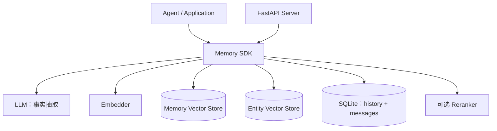
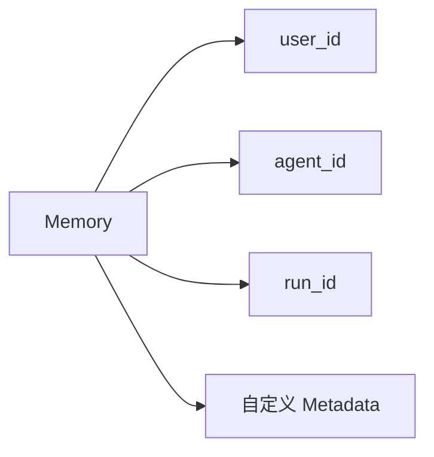
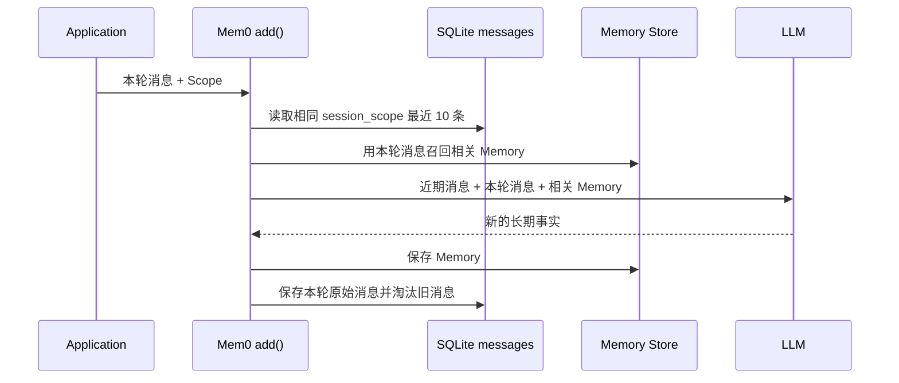
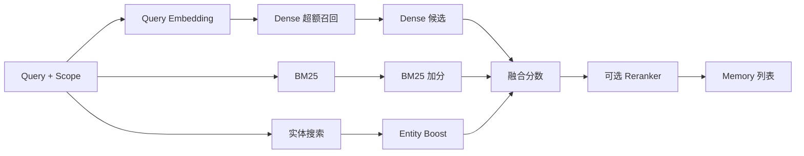

Mem0 不是传统文档 RAG，而是 Agent 的长期记忆层。它从对话中提炼值得长期保存的事实，再按用户、Agent 或运行实例检索这些事实。

它解决的核心问题是：**模型上下文窗口有限且会话结束后状态丢失，如何用较小的 Token 成本保留用户偏好和长期上下文。**

<!-- more -->

> 本文依据本地 Mem0 提交 `001c235229be8795e3834520467bd0d661ed8f34` 分析。当前 OSS 主摄取路径为 ADD-only，Graph Memory 不在这版 OSS SDK 中。

## 1. 总体架构与底层存储



| 运行方式 | Memory Store | Entity Store | History Store |
| --- | --- | --- | --- |
| OSS SDK 默认 | 本地 Qdrant `mem0` | 同一 Qdrant `mem0_entities` | SQLite `~/.mem0/history.db` |
| 仓库 REST Server 默认 | pgvector `memories` | 同一 pgvector `memories_entities` | SQLite `/app/history/history.db` |

向量 Store 可替换为 Qdrant、pgvector、Milvus、Elasticsearch、Redis 等 Provider。Entity Store 复用同一 Provider，只是使用另一个 Collection。

在 pgvector 中，两个表都是：

```sql
id UUID PRIMARY KEY,
vector vector(1536),
payload JSONB
```

## 2. Mem0 有没有 Tenant、KB、Document 层级

没有。Mem0 原生模型不是：

```text
Tenant → KB → Document → Chunk
```

而是把身份范围作为并列字段附着到 Memory：



### 2.1 Scope 是多维过滤，不是父子树

- `user_id`：这是谁的记忆。
- `agent_id`：哪个 Agent 产生或使用这条记忆。
- `run_id`：哪次运行或会话实例的记忆。

一条 Memory 可以同时带三个字段。它们之间没有“user 包含 agent、agent 包含 run”的外键或级联关系；查询时只是求字段交集：

```text
user_id = user-42
AND agent_id = restaurant-assistant
```

Mem0 要求写入至少提供其中一个 Scope。查询也必须带 Scope Filter，从而避免把不同用户或 Agent 的 Memory 混在一起。

### 2.2 为什么 user_id 不能直接等同 Tenant

`user_id` 可以隔离个人记忆，但 Mem0 OSS 没有 RAGFlow 那样的 Tenant、成员角色、KB 所有权、Document 生命周期和 Chunk 级联删除模型。

可以用 Metadata 模拟业务字段：

```json
{
  "tenant_id": "company-a",
  "kb_id": "customer-service",
  "document_id": "refund-policy"
}
```

但它们只是 payload 过滤字段，不会自动产生企业成员权限、知识库管理、文档解析或引用能力。如果需要多租户授权，宿主 API 必须自己验证调用者，再构造可信 Scope/Metadata；不能允许客户端任意指定其他用户的 `user_id`。

### 2.3 Scope 如何进入读取过滤

`add()` 会把顶层 `user_id`、`agent_id`、`run_id` 固定写入 Memory payload。调用方 Metadata 中伪造的同名身份字段会被移除，避免把 Memory 写入未声明的 Scope。

`search()` 使用：

```python
filters={
    "user_id": "user-42",
    "agent_id": "restaurant-assistant"
}
```

这些条件进入向量数据库搜索，只在相同 Scope 中召回 Dense 候选。它属于召回前过滤，不是拿到全局 Top K 后再删除。

但这只是数据范围过滤，不等于完整鉴权。SDK 不知道当前登录者是否真的有权使用 `user-42`，授权仍由宿主应用负责。

## 3. Memory、Entity 与 History 保存什么

### 3.1 Memory Vector Store

Memory 是从对话提炼出的自包含短事实。一条记录类似：

```json
{
  "id": "7bc4cd95-cf1a-4c55-92d6-28730311d271",
  "vector": [0.018, -0.032, "..."],
  "payload": {
    "data": "用户对花生过敏",
    "text_lemmatized": "用户 对 花生 过敏",
    "hash": "c7e36cc3816f4d65a5bc0e772cca52f4",
    "user_id": "user-42",
    "agent_id": "restaurant-assistant",
    "created_at": "2026-08-15T02:00:00+00:00",
    "updated_at": "2026-08-15T02:00:00+00:00",
    "category": "dietary_restriction"
  }
}
```

`data` 是 Memory 文本，`vector` 用于语义检索，Scope 用于过滤，`hash` 用于文本精确去重。自定义 Metadata 会展开到 payload 中，而不是嵌套在 `metadata` 字段下。

### 3.2 Entity Vector Store

Entity Store 保存实体向量及其关联 Memory ID：

```json
{
  "id": "entity-uuid",
  "vector": [0.024, -0.019, "..."],
  "payload": {
    "data": "上海",
    "entity_type": "PROPER",
    "linked_memory_ids": ["memory-1", "memory-2"],
    "user_id": "user-42"
  }
}
```

查询提到“上海”时，系统找到实体记录，再给关联 Memory 加分。它是实体到 Memory 的辅助目录，不保存“实体—关系—实体”，所以不是知识图谱。

### 3.3 History Store

SQLite `history` 表记录 Memory 的 ADD、UPDATE、DELETE：

```json
{
  "memory_id": "memory-1",
  "old_memory": "用户住在北京",
  "new_memory": "用户住在上海",
  "event": "UPDATE",
  "created_at": "2026-08-15T01:00:00+00:00",
  "updated_at": "2026-08-15T03:00:00+00:00",
  "is_deleted": 0
}
```

History 是审计日志，不参与相似度检索，也不是支持原子回退的版本库。当前值在向量 Store，历史在 SQLite，两者不是同一个数据库事务。

## 4. `messages`：近期消息如何生成和读取

SQLite `messages` 保存 `memory.add(messages=...)` 收到的原始消息副本，不是 LLM 摘要，也不是从 Memory 还原的内容。



LLM 同时看到：

| 输入 | 来源 | 作用 |
| --- | --- | --- |
| Last k Messages | SQLite 相同 Scope | 理解代词、省略和近期事件 |
| New Messages | 本次 `add()` | 本轮主要抽取对象 |
| Existing Memories | 向量库相关 Memory | 去重和建立新旧关联 |

`session_scope` 由 Scope 字段按固定顺序拼接，例如：

```text
agent_id=travel-assistant&user_id=user-42
```

只有完全相同的组合才能共享近期消息。只带 `user_id` 与同时带 `user_id+agent_id` 是两个不同的 `session_scope`。

例如第一轮说“我姐姐小王下周来上海”，第二轮只说“她不吃花生”。第二次抽取时，近期消息帮助 LLM 把“她”解析成“小王”，产生自包含 Memory“用户的姐姐小王不吃花生”。

边界包括：

- 最近 10 条是 10 条消息，不是 10 轮对话。
- 超过 10 条会滚动淘汰，不能当完整会话存档。
- 普通 `search()` 不读取 `messages`，它们也不会自动进入 Agent 最终回答。
- `infer=False` 直接把消息写成 Memory，不经过近期消息流程。
- `save_messages()` 不去重，调用方应优先只传本轮新增消息。

## 5. 写入：Memory 抽取流程

当前 `infer=True` 主路径为 ADD-only：

1. 验证至少存在一个 Scope。
2. 读取最近 10 条消息。
3. 用本轮消息向量召回最多 10 条既有 Memory。
4. LLM 从三类上下文中抽取新的、自包含事实。
5. 对新事实批量 Embedding，并通过 MD5 去重。
6. 写入 Memory Store 和 ADD History。
7. 抽取实体，写入或更新 Entity Store。
8. 保存本轮消息。

当前自动摄取不会自动用新事实覆盖或删除旧事实。代码虽然保留旧 Update Prompt，但实际使用的 Additive Prompt 明确只执行 ADD。更新和删除要调用显式 API。

## 6. 读取：Memory 检索流程



检索会从 Dense Store 超额召回，按可用信号加入 BM25 和 Entity Boost，再做阈值、Top K 和可选重排。

当前实现的候选集只来自 Dense Search；BM25 和 Entity 主要为这些 Dense 候选加分，无法把完全未被 Dense 命中的 Memory 加入候选。这与“多路候选取并集”不同。

Mem0 只返回 Memory，不负责最终回答、文档上下文构建和引用。宿主 Agent 需要决定怎样把 Memory、业务文档和当前会话组合进 Prompt。

## 7. 显式更新、删除与边界

Mem0 提供 `update(memory_id)`、`delete(memory_id)`、`delete_all(scope)` 和 `history(memory_id)`：

- Update 重新生成向量并记录 UPDATE。
- Delete 删除向量、清理实体关联并记录 DELETE。
- Scope 身份字段不能通过普通 Metadata 修改。
- `expiration_date` 可以让过期 Memory 默认退出检索。

它的边界是：

- 没有完整原始会话事实视图，只保留滚动近期消息。
- History 与向量 Store 非原子，也没有 CAS 和一键回退。
- ADD-only 自动管线不会自动解决冲突事实谁是当前状态。
- 没有文档解析、父子 Chunk、页码引用和文档权限模型。
- OSS SDK 的实体 Collection 不是 Graph Memory。

## 8. 本地代码依据

- `mem0/memory/main.py`：Scope、ADD-only 抽取、Memory/Entity 写入和检索。
- `mem0/memory/storage.py`：SQLite `history`、`messages` 及最近 10 条逻辑。
- `mem0/configs/prompts.py`：Additive Extraction Prompt。
- `mem0/utils/entity_extraction.py`：实体类型与抽取。
- `mem0/utils/scoring.py`：Semantic、BM25、Entity Boost 融合。
- `mem0/vector_stores/pgvector.py`：pgvector 表和搜索实现。
- `server/main.py`、`server/docker-compose.yaml`：REST Server 默认 pgvector 与 SQLite 配置。

上一篇：[RAGFlow 详解](./004_ragflow.md)。对比与选型见：[RAG 框架对比与选型](./006_rag_framework_comparison.md)。
