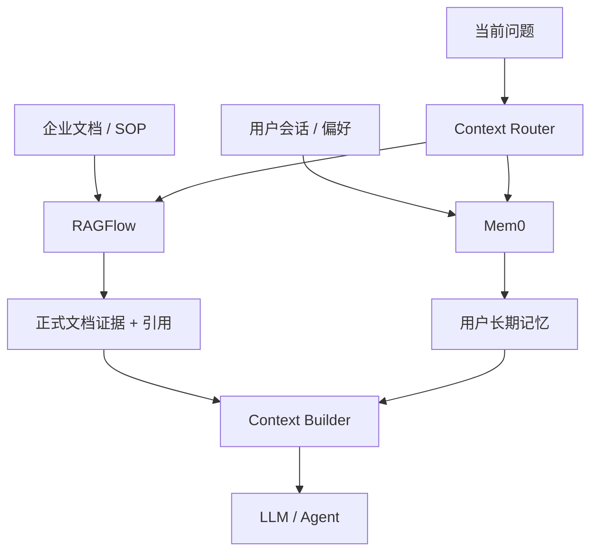

RAGFlow 和 Mem0 经常同时出现在 RAG/Agent 技术选型中，但它们并不是同类产品：RAGFlow 管理企业文档知识，Mem0 管理从对话中提炼的 Agent 长期记忆。

本文只保留统一比较维度、选型判断和组合方案。实现细节分别见：[RAGFlow 详解](./004_ragflow.md)和 [Mem0 详解](./005_mem0.md)。后续加入其他框架时，也沿用本文的比较维度。

<!-- more -->

> 对应本地代码版本：RAGFlow `554fb1133ac3861732235ad9c377eb5e0a770665`，Mem0 `001c235229be8795e3834520467bd0d661ed8f34`。

## 1. 先判断是不是同一类系统

```text
RAGFlow：Document → Chunk → Evidence → Answer
Mem0：Conversation → Memory → Personal Context
```

- RAGFlow 的基本事实是原始文档，Chunk 和向量是文档的检索投影。
- Mem0 的基本单元是从对话抽取的短事实 Memory；它没有完整文档摄取链路。
- RAGFlow 内置问答和引用；Mem0 返回 Memory，由宿主 Agent 负责最终回答。

所以二者首先是互补关系，其次才是在特定需求下的替代关系。

## 2. 能力对比

| 维度 | RAGFlow | Mem0 |
| --- | --- | --- |
| 核心定位 | 文档知识库与 RAG 问答平台 | Agent 长期记忆 SDK/服务 |
| 基本单元 | Document 及其 Chunk 投影 | 从会话抽取的短事实 Memory |
| 主要输入 | PDF、Word、PPT、Excel、网页、图片 | 对话消息或短文本 |
| 文档解析 | OCR、版面、表格和多格式 Parser | 无通用文档解析管线 |
| 写入增强 | 关键词、问题、Metadata、RAPTOR、GraphRAG | LLM 事实抽取、去重、实体关联 |
| 初召回 | 全文 + Dense 混合候选 | Dense 候选为主 |
| 辅助排序 | 词项/向量融合、外部 Reranker | BM25、Entity Boost、可选 Reranker |
| 上下文扩展 | 父子 Chunk、TOC、RAPTOR、GraphRAG | 相关 Memory；无文档邻接结构 |
| 最终生成 | 内置 Prompt、Chat、流式生成 | 由宿主 Agent 处理 |
| 引用 | 内置 Chunk/Document 引用 | 无文档引用机制 |
| 原生范围模型 | Tenant → KB → Document → Chunk | user/agent/run Scope → Memory |
| 更新与删除 | Document/Chunk 管理和重新解析 | Memory 增删改、过期和历史 |
| 部署复杂度 | MySQL、MinIO、Redis、搜索引擎、Worker | SDK 较轻；Server 默认 pgvector + SQLite |
| 最适合 | 企业知识库、文档检索、有引用问答 | 个性化 Agent、跨会话用户画像 |

## 3. 数据层级和权限差异

### 3.1 RAGFlow 是原生资源层级

```text
Tenant
└── Knowledgebase
    └── Document
        └── Chunk
```

它同时具有 Tenant 成员关系、KB 可见范围、Document 生命周期和 Chunk 回指。读取时先检查 KB/Document 是否可访问，再按 Tenant 选择索引，并将 `kb_id`、`doc_id`、Metadata 和可用状态作为召回前过滤条件。

### 3.2 Mem0 是扁平多维 Scope

```text
Memory
├── user_id
├── agent_id
├── run_id
└── Metadata
```

这些字段不是父子外键，而是并列过滤维度。Mem0 可以限制只召回某个用户和 Agent 的 Memory，但 SDK 不管理企业 Tenant 成员、KB 权限和 Document 生命周期。调用者身份授权由宿主服务负责。

这意味着：需要正式企业知识权限时，RAGFlow 的模型更接近需求；只需要个人化记忆隔离时，Mem0 的 Scope 更简单。

## 4. 对 RAG 六个不变量的检验

| 不变量 | RAGFlow | Mem0 |
| --- | --- | --- |
| 事实完整性 | 原始文件保存在对象存储，但人工改 Chunk 不回写原文 | Memory 是提炼事实，只额外保留滚动近期消息 |
| 证据充分性 | 混合召回、重排、结构扩展和引用较完整 | 适合找个性化事实，不判断证据是否足够 |
| 变更正确性 | 跨存储最终一致，缺少统一版本和 CAS | 单 Memory 可改删，但向量库与 History 非原子 |
| 投影一致性 | 有摄取任务，但无 ready-version 原子读指针 | 当前 Memory 直接存在检索库，History 是旁路日志 |
| 访问隔离性 | Tenant、KB、Document 过滤；非通用 Chunk ACL | Scope Filter；真实授权依赖宿主 API |
| 结果可验证性 | 返回 Chunk、Document 和引用 | 有 Memory ID 和分数，缺少原始对话引用 |

两者都没有完整解决“动态事实源的版本化编辑与原子索引发布”。如果这是核心需求，应在框架之外建设版本化 Document Store、Outbox、投影版本和原子读指针。

## 5. 选型建议

### 5.1 选择 RAGFlow

优先评估 RAGFlow，如果：

- 输入是 PDF、Word、PPT、Excel、图片或网页。
- 存在扫描页、复杂表格和版面结构。
- 回答必须返回原文、页码、图片或引用。
- 需要知识库管理、文档解析进度和 Chunk 检查界面。
- 需要 Tenant、KB、Document 的原生组织和过滤。
- 能接受完整平台带来的部署复杂度。

如果需求是多人实时编辑并原子发布知识，不要把 Chunk PATCH 当作文档版本系统。应让 Git、CMS、数据库或自研 Document Store 成为事实源，再把确定版本同步到 RAGFlow。

### 5.2 选择 Mem0

优先评估 Mem0，如果：

- Agent 要跨会话记住用户偏好、人物、计划和事件。
- 希望以 SDK 快速接入现有 Agent。
- 主要按 `user_id`、`agent_id`、`run_id` 隔离上下文。
- 愿意在业务层处理冲突记忆、过期、授权和最终 Prompt。

不要把长文档直接交给 Memory 抽取来替代文档 RAG：这会丢失完整原文、文档结构、证据充分性和引用能力。

### 5.3 同时使用



组合时应保留来源类型和信任等级：正式业务文档通常高于从会话提炼的个人记忆；Context Builder 负责去重、Token 分配和冲突处理。

## 6. 如何继续加入其他框架

以后评估新的框架时，先建立一张“框架卡片”，不要只比较功能名称：

| 维度 | 要回答的问题 |
| --- | --- |
| 事实单元 | 原始事实是 Document、Memory、数据库行还是事件？ |
| 写入管线 | 如何解析、分块、抽取和构建索引？ |
| 存储 | 事实、业务状态、向量和历史分别在哪里？ |
| 范围模型 | Tenant、Project、KB、User Scope 如何组织？ |
| 召回 | Dense、BM25、实体是否都能贡献候选？ |
| 排序 | 本地融合还是模型 Rerank？ |
| 上下文 | 是否支持父子、邻接、摘要树和知识图谱？ |
| 权限 | 在召回前过滤还是结果后过滤？粒度到哪一级？ |
| 生成与引用 | 是否负责最终答案？引用如何验证？ |
| 更新一致性 | 是否有版本、并发控制、原子发布和回退？ |
| 运维成本 | 依赖服务、Worker、模型成本和可观测性如何？ |

新增框架时，在第 2 节增加一列，在第 4 节补充六个不变量判断，再新增对应的选型场景即可。框架的详细实现应继续拆成独立文章，避免这篇对比文档再次膨胀。

## 7. 结论

当前判断是：

1. 文档 RAG 主框架优先选择 RAGFlow。
2. Agent 长期个性化记忆选择 Mem0。
3. 同时需要业务知识和用户记忆时，两者并行，由 Context Builder 合并。
4. 需要可写、可回退、原子发布的动态知识系统时，两者上方都还需要版本化事实源。

一句话概括：**RAGFlow 管“组织知道什么”，Mem0 管“Agent 记得这个用户什么”。**
