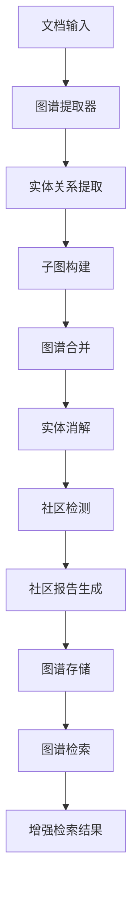

# GraphRAG 
### 1. 根目录文件

#### search.py - 图谱检索引擎
**核心功能：**
- **KGSearch类**：图谱检索的主要接口，继承自 rag.nlp.search.Dealer
- **查询重写**：[query_rewrite()](file://d:\Code\rag\ragflow\graphrag\search.py#L43-L64) 方法使用LLM将用户查询分解为实体类型关键词和具体实体
- **多路检索**：
  - get_relevant_ents_by_keywords(): 基于关键词检索相关实体
  - get_relevant_relations_by_txt(): 基于文本检索相关关系  
  - get_relevant_ents_by_types(): 基于实体类型检索相关实体
- **N跳邻居遍历**：获取实体的多跳邻居关系路径
- **社区报告检索**：_community_retrieval_() 检索与实体相关的社区报告
- **结果融合与排序**：综合实体相似度、PageRank值和关系权重

#### utils.py - 图谱工具函数
**核心功能：**
- **图谱操作**：graph_merge(), get_graph(), set_graph() 等图谱存储与合并
- **缓存机制**：LLM响应缓存、嵌入向量缓存、标签缓存
- **图谱验证**：tidy_graph() 确保节点和边具有必要属性
- **实体消解**：get_from_to() 规范化节点关系
- **并发控制**：chat_limiter 限制并发LLM调用

#### entity_resolution.py - 实体消解
**核心功能：**
- **实体合并**：识别和合并语义相似的实体
- **描述融合**：合并重复实体的描述信息
- **关系更新**：更新合并后实体的关系连接

#### query_analyze_prompt.py - 查询分析提示词
**核心功能：**
- **查询重写提示模板**：`minirag_query2kwd` 模板指导LLM进行查询分析
- **实体类型识别**：从预定义类型池中识别查询相关的实体类型
- **查询实体提取**：从用户问题中提取具体的实体名称

#### entity_resolution_prompt.py - 实体消解提示词
**核心功能：**
- **实体相似性判断**：提示LLM判断两个实体是否为同一实体
- **合并决策指导**：指导实体合并的判断标准

### 2. general/ 目录 - 通用实现

#### index.py - 图谱构建主流程
**核心功能：**
- **run_graphrag()**：图谱构建的主要协调函数
- **子图生成**：generate_subgraph() 从文档chunks生成子图
- **图谱合并**：merge_subgraph() 将子图合并到全局图谱
- **实体消解**：resolve_entities() 合并相似实体  
- **社区检测**：extract_community() 运行Leiden算法进行社区发现
- **并发控制**：使用Redis分布式锁确保图谱构建的原子性

#### graph_extractor.py - 图谱提取器
**核心功能：**
- **GraphExtractor类**：主要的实体关系提取器
- **多轮提取**：通过多次LLM调用确保提取完整性
- **增量提取**：CONTINUE_PROMPT 继续提取遗漏的实体关系
- **结果解析**：解析LLM输出的结构化实体关系数据
- **Token计数**：统计LLM调用的token消耗

#### extractor.py - 提取器基类
**核心功能：**
- **Extractor基类**：定义实体关系提取的通用接口
- **_entities_and_relations()**：解析提取结果为实体和关系列表
- **描述合并**：_join_descriptions() 合并相同实体的多个描述
- **数据清洗**：清理和标准化提取的实体关系数据

#### leiden.py - Leiden社区检测算法
**核心功能：**
- **run()**：执行Leiden算法进行图谱社区检测
- **层次化聚类**：hierarchical_leiden() 生成多层社区结构
- **最大连通分量**：stable_largest_connected_component() 提取主要图结构
- **社区权重计算**：基于节点PageRank值计算社区重要性
- **稳定性保证**：确保相同图谱始终产生相同的社区划分结果

#### community_reports_extractor.py - 社区报告生成器
**核心功能：**
- **CommunityReportsExtractor类**：生成社区的详细分析报告
- **报告结构化**：包含社区标题、总结、影响评分、发现要点等
- **LLM驱动生成**：使用大模型分析社区内实体关系并生成报告
- **JSON格式输出**：结构化的社区报告便于后续检索使用

#### graph_prompt.py - 图谱提取提示词
**核心功能：**
- **GRAPH_EXTRACTION_PROMPT**：指导LLM进行实体关系提取的主要提示模板
- **CONTINUE_PROMPT**：继续提取的提示
- **LOOP_PROMPT**：循环判断提示
- **多语言支持**：适配中英文等不同语言的提取需求

#### community_report_prompt.py - 社区报告提示词
**核心功能：**
- **社区分析模板**：指导LLM分析社区结构和关系
- **报告格式定义**：规范社区报告的JSON输出格式
- **影响力评估**：指导对社区影响力的量化评估

#### entity_embedding.py - 实体嵌入
**核心功能：**
- **实体向量化**：将实体描述转换为嵌入向量
- **相似度计算**：基于向量相似度进行实体匹配
- **嵌入缓存**：缓存计算好的实体嵌入以提升性能

#### mind_map_extractor.py - 思维导图提取器
**核心功能：**
- **层次结构提取**：从文档中提取思维导图式的层次结构
- **概念关系映射**：识别概念间的层次和关联关系
- **结构化输出**：生成便于可视化的思维导图数据

#### mind_map_prompt.py - 思维导图提示词
**核心功能：**
- **思维导图提取模板**：指导LLM提取文档的思维导图结构
- **层次关系定义**：规范层次关系的表示格式

#### smoke.py - 冒烟测试
**核心功能：**
- **功能验证**：验证图谱构建流程的基本功能
- **集成测试**：测试各模块间的集成效果

### 3. light/ 目录 - 轻量级实现

#### graph_extractor.py - 轻量级图谱提取器
**核心功能：**
- **简化版实体关系提取**：相比general版本，减少了多轮提取的复杂度
- **快速处理**：适用于对精度要求不高但需要快速处理的场景
- **资源优化**：降低LLM调用次数和计算资源消耗

#### graph_prompt.py - 轻量级提示词
**核心功能：**
- **简化提示模板**：简化的实体关系提取提示词
- **效率优化**：平衡提取质量和处理速度

#### smoke.py - 轻量级冒烟测试
**核心功能：**
- **轻量级验证**：验证light版本的基本功能

## 整体架构流程

