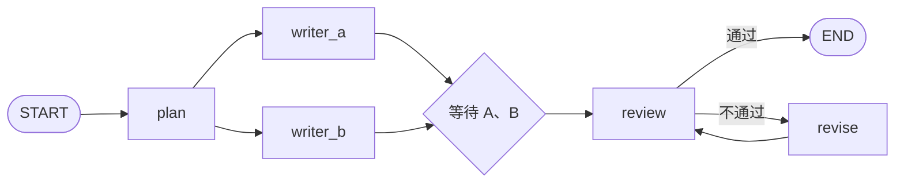
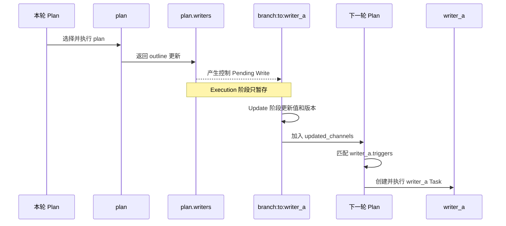

前面我们介绍了第一个 Agent Framework - Pocket Flow。并且说道，大多数 Agent Framework 的核心是提供了对 Workflow 的抽象-Graph。今天我们来介绍另一个 Agent Framework - LangGraph。并依旧重点关注 Graph 实现的四个问题：

1. 如何表示 Graph 中的节点以及节点的触发关系
2. 如何在节点之间传递共享数据
3. Graph 如何被驱动执行
4. 状态存储和异常恢复

Langgraph 比 Pocket Flow 代码复杂的多，主要有如下几个原因:

1. Langgraph 定义的 Graph 所能表达的语义更加丰富。在 Pocket Flow 中，一个 action 只能触发一个节点，Langgraph 中一次可以触发多个节点，一节点也可以定义对多个节点的依赖。
2. Langgraph 支持节点的并发执行，功能也更加完善

Langgraph Graph 分为定义和运行时两种表示。我们将从一个示例开发，直接看 Graph 的运行时表示，这样可以更清晰的解释我们所关心的三个问题。

<!-- more -->

## 1. 从一个完整的 Graph 开始

我们先定义一个文章生成流程：先生成提纲，再由两个节点并行写出候选稿；两个节点都完成后进入审核；审核通过则结束，否则修改后再次审核。



这个例子包含了顺序执行、并行、汇合、条件分支和循环。

```python
import operator
from typing import Annotated, Literal

from langgraph.graph import END, START, StateGraph
from typing_extensions import TypedDict


class State(TypedDict):
    topic: str
    outline: str
    drafts: Annotated[list[str], operator.add]
    final: str
    approved: bool


def plan(state: State) -> dict:
    return {"outline": f"{state['topic']}：定义、实现、执行"}


def writer_a(state: State) -> dict:
    return {"drafts": [f"版本 A：{state['outline']}"]}


def writer_b(state: State) -> dict:
    return {"drafts": [f"版本 B：{state['outline']}"]}


def review(state: State) -> dict:
    final = max(state["drafts"], key=len)
    return {"final": final, "approved": len(final) >= 10}


def route(state: State) -> Literal["revise", "__end__"]:
    return END if state["approved"] else "revise"


def revise(state: State) -> dict:
    return {"drafts": [f"修订稿：{state['final']}"]}


builder = StateGraph(State)
builder.add_node("plan", plan)
builder.add_node("writer_a", writer_a)
builder.add_node("writer_b", writer_b)
builder.add_node("review", review)
builder.add_node("revise", revise)

builder.add_edge(START, "plan")
builder.add_edge("plan", "writer_a")
builder.add_edge("plan", "writer_b")
builder.add_edge(["writer_a", "writer_b"], "review")
builder.add_conditional_edges("review", route)
builder.add_edge("revise", "review")

graph = builder.compile()
result = graph.invoke({"topic": "LangGraph Workflow"})
```

从使用者的角度看，Node 是计算逻辑，Edge 是节点之间的触发关系，State 是节点之间的共享数据。但 `StateGraph` 只是 Builder，调用 `compile()` 后，它会被转换成另一组运行时结构，并由 Pregel 执行。

## 2. Graph 运行时包含哪些数据结构

`builder` 是 `StateGraph`，保存用户定义的 Graph：

```text
StateGraph
├── nodes：节点名称 -> StateNodeSpec
├── edges：普通边
├── waiting_edges：需要等待多个上游节点的边
├── branches：条件边
└── channels：State 字段对应的 Channel
```

`graph` 是 `CompiledStateGraph`。它继承自 `Pregel`，保存真正执行 Graph 所需的结构：

```text
CompiledStateGraph / Pregel
├── nodes：节点名称 -> PregelNode
│   ├── channels：节点读取哪些 Channel
│   ├── triggers：哪些 Channel 更新会触发节点
│   ├── bound：节点的计算函数
│   └── writers：节点执行后写入哪些 Channel
│
├── channels
│   ├── 数据 Channel：保存 State 中的共享值
│   └── 控制 Channel：传递节点触发信号
│
└── 每轮执行时产生的数据
    ├── tasks：本轮要执行的节点
    └── pending writes：节点产生、尚未提交的 Channel 更新
```

运行时的核心是：**PregelNode 通过 `channels` 读取数据，通过 `writers` 写数据和控制信号；Pregel 根据控制 Channel 的更新匹配节点的 `triggers`。**

在分别回答三个问题之前，需要先理解这个匹配发生在哪个时间点。

## 3. Pregel 的三阶段执行

Pregel 把 Graph 拆成一轮一轮的 Superstep。每轮固定分成三个阶段：

```text
Plan：根据上一轮更新的 Channel，选择本轮要执行的节点
  ↓
Execution：执行节点，writers 产生 Channel Writes
  ↓
Update：按 Channel 汇总 Writes，更新 Channel 及其版本
  ↓
进入下一轮 Plan
```

关键点是：**本轮 writer 写出的控制 Channel，要到 Update 阶段才真正更新；订阅它的 trigger，要到下一轮 Plan 才会被匹配。**

以 `plan -> writer_a` 为例。编译后有下面两个接口：

```text
plan.writers = [..., write("branch:to:writer_a")]
writer_a.triggers = ["branch:to:writer_a"]
```

它们在相邻两轮之间这样连接：



### 3.1 先区分“值的可见性”和“更新是否已处理”

这里其实有两个不同的问题：

1. 本轮节点写出的值，什么时候能被其他节点读取？
2. 一个 Channel 中存在值时，如何判断它是不是节点尚未处理的新更新？

第一个问题由 Pregel 的阶段边界解决，第二个问题才由 Channel Version 解决。

#### 值的可见性：在 Update 阶段统一提交

假设 `writer_a` 和 `writer_b` 在同一个 Superstep 中并行执行。两者开始执行时，读取的是同一份 State：

```text
drafts Channel 当前值：[]
```

执行过程中，它们分别产生 Write：

```python
writer_a_task.writes = [("drafts", ["版本 A"])]
writer_b_task.writes = [("drafts", ["版本 B"])]
```

这些 Write 先保存在各自的 Task 中，不会立即修改 `drafts` Channel。因此在本轮 Execution 阶段，两个节点都看不到对方的结果。

等两个节点全部完成，Pregel 才在 Update 阶段统一提交：

```text
drafts.update([["版本 A"], ["版本 B"]])
                         ↓
drafts Channel 新值：["版本 A", "版本 B"]
```

下一轮执行的 `review` 才能读到这个新值。

所以：

> **“本轮写、下轮见”是由 Pending Writes 延迟到 Update 阶段统一提交实现的，不是 Version 实现的。**

#### Channel Version：判断更新是不是新的

#### Version 是怎么生成的

版本保存在：

```python
checkpoint["channel_versions"]  # channel name -> version
```

每次进入 Update 阶段，`apply_writes()` 先找出所有 Channel 中的最大版本，再调用一次版本生成函数：

```python
current_version = max(channel_versions.values(), default=None)
next_version = get_next_version(current_version, None)
```

如果没有配置 Checkpointer，`get_next_version` 就是一个简单的自增函数：

```python
def increment(current: int | None, channel: None) -> int:
    return current + 1 if current is not None else 1
```

如果配置了 Checkpointer，则使用 `checkpointer.get_next_version()`。默认实现也是加一；具体实现可以使用 `int`、`float` 或 `str`，只要生成的版本单调递增、能够比较大小。比如 `InMemorySaver` 使用以递增整数开头的字符串版本。

同一个 Superstep 只生成一次 `next_version`。本轮所有真正发生变化的 Channel 都被赋予这个版本；没有变化的 Channel 保留原版本。因此它更像一个 **Superstep 的逻辑时钟**，而不是每个 Channel 各自独立的计数器。

例如 Update 前：

```python
channel_versions = {
    "topic": 1,
    "outline": 2,
    "branch:to:writer_a": 2,
}
```

当前最大版本是 `2`，所以本轮生成 `next_version = 3`。假设本轮更新了 `drafts` 和 Barrier Channel，Update 后就是：

```python
channel_versions = {
    "topic": 1,                              # 本轮未变化
    "outline": 2,                            # 本轮未变化
    "branch:to:writer_a": 2,                 # 本轮未变化
    "drafts": 3,                             # 本轮更新
    "join:writer_a+writer_b:review": 3,      # 本轮更新
}
```

版本号本身没有业务含义。Pregel 只关心大小关系：当前版本是否大于节点记录在 `versions_seen` 中的版本。

接着只看 `plan -> writer_a` 这条边。编译后，两端通过同一个控制 Channel 连接：

```text
plan.writers 写入 branch:to:writer_a
writer_a.triggers 订阅 branch:to:writer_a
```

Pregel 为每个 Channel 记录当前版本，同时记录每个节点上次处理到的版本：

```text
channel_versions[channel]：Channel 当前版本
versions_seen[node][channel]：该节点上次处理的版本
```

假设一开始：

```text
branch:to:writer_a 当前版本：v0
writer_a 已处理到的版本：v0
```

`plan.writers` 在本轮写入这个控制 Channel。Update 阶段提交后，Channel 获得一个新版本：

```text
branch:to:writer_a 当前版本：v1
writer_a 已处理到的版本：v0
```

下一轮 Plan 检查 `writer_a.triggers`：

```text
Channel 可用，并且 v1 > v0
                    ↓
这是 writer_a 尚未处理的新信号，创建 writer_a Task
```

`writer_a` 处理完这次触发后，Pregel 记录：

```text
branch:to:writer_a 当前版本：v1
writer_a 已处理到的版本：v1
```

现在两个版本相等，这次更新已经被处理，不会再次触发：

```text
v1 > v1 不成立
```

如果以后 Graph 再次执行到 `plan`，它又向同一个控制 Channel 写入信号，Channel 会产生一个更新的版本，例如 `v2`：

```text
branch:to:writer_a 当前版本：v2
writer_a 已处理到的版本：v1
v2 > v1，所以再次触发 writer_a
```

实际判断还要求 Channel 当前可用。对于 `branch:to:*` 使用的 `EphemeralValue`，信号消费后还会被清空；版本比较提供了一套适用于所有 Channel 的统一“新旧判断”。

因此 Version 解决的是：

> **不要问 Channel 里有没有值，而要问这个节点有没有处理过 Channel 的当前版本。**

#### `updated_channels` 是什么

Update 阶段结束后，`apply_writes()` 返回一个 `set[str]`，记录本轮成功更新且当前可用的 Channel 名称。例如 `plan` 执行后：

```python
updated_channels = {
    "outline",
    "branch:to:writer_a",
    "branch:to:writer_b",
}
```

它只包含 Channel 名称，不包含值，也不直接包含节点。下一轮 Plan 用它查询反向索引：

```python
trigger_to_nodes = {
    "branch:to:writer_a": ["writer_a"],
    "branch:to:writer_b": ["writer_b"],
}
```

匹配结果是：

```text
outline                    -> 没有节点把它作为 trigger，忽略
branch:to:writer_a         -> 候选节点 writer_a
branch:to:writer_b         -> 候选节点 writer_b
```

这里有一个容易误解的地方：既然 Channel 刚刚出现在 `updated_channels` 中，它的版本必然刚刚增大，为什么还要和 `versions_seen` 比较？

答案是：**在一次普通、连续执行的快速路径中，这个版本检查通常确实必然通过。**

例如：

```text
updated_channels 包含 branch:to:writer_a
        ↓
trigger_to_nodes 找到 writer_a
        ↓
Channel 刚生成版本 5，writer_a 之前最多只见过版本 4
        ↓
5 > 4，触发 writer_a
```

在这个限定场景里，找到 `writer_a` 后直接创建 Task，结果也是一样的。源码仍然比较版本，是因为两者承担的职责不同：

- `updated_channels` 是全局的变化集合，用来快速缩小候选节点范围
- `versions_seen[node][channel]` 是每个节点自己的消费游标，用来判断该节点是否处理过当前版本

`prepare_next_tasks()` 不只服务于连续执行的快速路径，还要处理 checkpoint 恢复、重放以及没有 `updated_channels` 的情况。例如恢复时可能只有：

```python
updated_channels = None

channel_versions = {
    "branch:to:writer_a": 5,
}

versions_seen = {
    "writer_a": {"branch:to:writer_a": 4},
}
```

虽然没有 `updated_channels` 可以提供候选集合，Pregel 扫描节点后仍能通过 `5 > 4` 判断 `writer_a` 尚未处理这次更新。如果两边都是 `5`，则说明已经处理过，恢复时不能重复执行。

因此，`updated_channels` 不是调度的权威状态，而是一个可选的索引优化；Channel Version 和 `versions_seen` 才是能够跨 checkpoint 恢复的最终判断依据。

整个过程可以浓缩成：

```text
updated_channels（如果存在）
        ↓
trigger_to_nodes 快速得到候选节点
        ↓
检查 Channel 是否可用
        ↓
current_version > versions_seen 才真正触发
```

下面再分别回答开头的三个问题。

## 4. 如何表示节点以及节点的触发关系

### 4.1 PregelNode 的四个核心接口

`add_node()` 先把函数保存成 `StateNodeSpec`。编译后，它会变成 `PregelNode`：

```python
class PregelNode:
    channels: str | list[str]
    triggers: list[str]
    bound: Runnable
    writers: list[Runnable]
```

四个字段组成一次完整的节点执行：

```text
triggers 决定节点何时进入 Task
        ↓
channels 组装节点本轮读取的 State
        ↓
bound 执行节点计算
        ↓
writers 把返回值转换成 Channel Writes
```

`triggers` 和 `writers` 都保存 Channel 层面的接口：

- `triggers` 是 Channel 名称列表。任意一个 Channel 出现节点尚未消费的新版本，节点就可以被触发
- `writers` 是节点函数执行后的 Runnable 列表。它们把返回值写入数据 Channel，也把出边转换成对控制 Channel 的写入

所以可以把 LangGraph 的触发关系理解成：**源节点的 `writers` 和目标节点的 `triggers` 通过同名控制 Channel 连接。**

### 4.2 普通边

```python
builder.add_edge("plan", "writer_a")
```

`attach_edge()` 为这条边向 `plan.writers` 追加一个 `ChannelWrite`：

```python
plan.writers.append(
    ChannelWrite("branch:to:writer_a")
)
```

而 `writer_a` 的 `PregelNode` 订阅同名 Channel：

```python
writer_a.triggers = ["branch:to:writer_a"]
```

writer 只产生 Write，不直接运行目标节点。Write 在本轮 Update 阶段更新 Channel，下一轮 Plan 才通过 `trigger_to_nodes` 和 Channel 版本找到 `writer_a`。

### 4.3 并行、汇合与条件边

`plan` 有两条出边，因此它的 writers 会同时写入两个控制 Channel，两个 writer 在下一轮并行执行。

```python
builder.add_edge("plan", "writer_a")
builder.add_edge("plan", "writer_b")
```

多起点边会转换成 `NamedBarrierValue` Channel：

```python
builder.add_edge(["writer_a", "writer_b"], "review")
```

两个 writer 分别向 Barrier 写入自己的名字。只有 Barrier 收齐两个值并变为可用，它的版本更新才会在下一轮触发 `review`。

条件边则由路由函数决定 writer 最终写入哪个控制 Channel：

```python
builder.add_conditional_edges("review", route)
```

`route` 返回 `revise` 时写入 `branch:to:revise`；返回 `END` 时结束。无论普通边、汇合边还是条件边，最后都统一成 writer、控制 Channel 和 trigger 的关系。

## 5. 如何在节点之间传递共享数据

API 层的节点共享一个 State：

```python
class State(TypedDict):
    topic: str
    outline: str
    drafts: Annotated[list[str], operator.add]
    final: str
    approved: bool
```

运行时并不存在一个由所有节点直接修改的全局字典。LangGraph 会把 State 的每个字段转换成一个 Channel：

```text
topic       -> LastValue
outline     -> LastValue
drafts      -> BinaryOperatorAggregate(operator.add)
final       -> LastValue
approved    -> LastValue
```

`PregelNode.channels` 指定节点读取哪些数据 Channel。节点执行前，LangGraph 读取这些 Channel 的当前值，组合成 State；节点返回的 Partial State 再由 `writers` 拆成数据 Channel Writes。

例如 `plan` 返回：

```python
{"outline": "..."}
```

表示向 `outline` Channel 提交一次更新，而不是直接修改全局字典。

普通字段默认使用 `LastValue`，一个 Superstep 中最多接收一个更新。`writer_a` 和 `writer_b` 会在同一轮写入 `drafts`，所以它声明了 reducer：

```python
drafts: Annotated[list[str], operator.add]
```

它会转换成 `BinaryOperatorAggregate`：

```text
writer_a -> ["版本 A"] ──┐
                          ├── drafts.update(values) -> ["版本 A", "版本 B"]
writer_b -> ["版本 B"] ──┘
```

因此，State 是节点看到的共享数据视图，Channel 才是共享数据实际的保存和更新机制。

## 6. Graph 被驱动执行的过程

现在可以把执行过程完整串起来：

```text
上一轮 Update 得到 updated_channels
        ↓
Plan 使用 trigger_to_nodes 找到候选 PregelNode
        ↓
检查 triggers 对应 Channel 的可用性和版本
        ↓
创建 Tasks，读取 channels 组装 State
        ↓
Execution 执行 bound，再执行 writers
        ↓
writers 产生数据 Writes 和控制 Writes
        ↓
Update 按 Channel 分组，调用 channel.update(values)
        ↓
记录新的 updated_channels，进入下一轮
```

源码的主循环可以简化为：

```python
while loop.tick():
    # Plan：prepare_next_tasks() 匹配 triggers
    runner.tick(loop.tasks)
    # Execution：运行 bound 和 writers，收集 task.writes
    loop.after_tick()
    # Update：apply_writes() 更新 Channels
```

当 Update 阶段产生的 Channel 不再匹配任何节点的 `triggers` 时，下一轮 Plan 得不到 Task，Graph 执行结束。

## 7. 用户代码如何转换成运行时结构

`compile()` 把用户定义的 Workflow 转换成 Channel 网络：

```python
compiled = CompiledStateGraph(
    nodes={},
    channels={**state_channels, START: EphemeralValue(input_schema)},
)

for node in nodes:
    compiled.attach_node(node)
for edge in edges:
    compiled.attach_edge(edge)
for branch in branches:
    compiled.attach_branch(branch)
```

具体的转换关系如下：

| 用户代码                  | `StateGraph` 中的结构 | 编译后的运行时结构                                     |
| ------------------------- | --------------------- | ------------------------------------------------------ |
| `State` 字段              | `channels`            | `LastValue` 或带 reducer 的数据 Channel                |
| `add_node()`              | `StateNodeSpec`       | 包含 `channels/triggers/bound/writers` 的 `PregelNode` |
| `add_edge(A, B)`          | `edges`               | A 的 writer 与 B 的 trigger 连接同一个控制 Channel     |
| `add_edge([A, B], C)`     | `waiting_edges`       | writers 写入、C 订阅的 Barrier Channel                 |
| `add_conditional_edges()` | `BranchSpec`          | 根据路由结果写入目标控制 Channel                       |

到这里，开头的三个问题可以统一到同一个模型中：

1. 节点由 `PregelNode` 表示，触发关系由 writers、控制 Channel 和 triggers 表示
2. State 的每个字段对应一个数据 Channel，节点通过读取 Channel 和提交 Channel Write 共享数据
3. Pregel 按照 `Plan -> Execution -> Update` 推进 Graph，并在相邻轮次之间把 writer 的输出匹配到 trigger

> **Node 负责计算，writer 负责写 Channel，trigger 负责订阅 Channel，Pregel 负责在相邻轮次之间完成匹配和调度。**

## 8. Graph 的持久化与恢复

Pregel 在 Superstep 的 Update 阶段结束后创建 Checkpoint。Checkpoint 保存的不只是 State，还保存恢复调度所需的 Channel 版本和节点消费位置。

继续使用开头的 Graph。我们配置一个 Checkpointer，并在 `review` 执行前暂停：

```python
from langgraph.checkpoint.memory import InMemorySaver


checkpointer = InMemorySaver()
graph = builder.compile(
    checkpointer=checkpointer,
    interrupt_before=["review"],
)

config = {
    "configurable": {
        "thread_id": "article-1",
    }
}

# 执行到 review 之前暂停
graph.invoke({"topic": "LangGraph Workflow"}, config)
```

此时已经完成：

```text
START -> plan -> writer_a / writer_b -> Update
                                         ↓
                                  checkpoint
                                         ↓
                                下一个节点是 review
```

### 8.1 Checkpoint 保存哪些值

可以通过 `get_state()` 查看恢复所需的公开状态，也可以直接从 Checkpointer 读取底层记录：

```python
snapshot = graph.get_state(config)
saved = checkpointer.get_tuple(config)
checkpoint = saved.checkpoint
```

底层 Checkpoint 的核心结构可以简化为：

```python
checkpoint = {
    "id": "checkpoint-id",
    "ts": "...",

    "channel_values": {
        "topic": "LangGraph Workflow",
        "outline": "LangGraph Workflow：定义、实现、执行",
        "drafts": ["版本 A：...", "版本 B：..."],
        "join:writer_a+writer_b:review": {"writer_a", "writer_b"},
    },

    "channel_versions": {
        "topic": "v1",
        "outline": "v2",
        "drafts": "v3",
        "join:writer_a+writer_b:review": "v3",
        # 还会包含已经消费、当前为空的控制 Channel 的版本
    },

    "versions_seen": {
        "plan": {"branch:to:plan": "v1"},
        "writer_a": {"branch:to:writer_a": "v2"},
        "writer_b": {"branch:to:writer_b": "v2"},
        # review 尚未执行，所以还没有消费 Barrier 的 v3
    },

    "updated_channels": [
        "drafts",
        "join:writer_a+writer_b:review",
    ],
}
```

上面使用 `v1/v2/v3` 简化实际版本字符串。各字段的作用是：

| 字段 | 持久化内容 | 恢复时的用途 |
| --- | --- | --- |
| `channel_values` | 数据 Channel 和当前可用的控制 Channel 的快照 | 重建每个 Channel 的当前值 |
| `channel_versions` | 每个 Channel 的当前版本 | 判断 Channel 当前是哪一次更新 |
| `versions_seen` | 每个节点已经处理到的 Trigger 版本 | 避免恢复后重复执行已完成节点 |
| `updated_channels` | 最近一个 Superstep 更新且可用的 Channel | 快速找出下一步候选节点 |
| `id`、`ts` | Checkpoint 标识和时间 | 定位、排序和选择恢复点 |

并非所有 Channel 都会出现在 `channel_values` 中。比如 `branch:to:writer_a` 使用 `EphemeralValue`，被消费后已经为空，因此没有可保存的值；但它的版本仍保留在 `channel_versions` 中。

`thread_id` 不在 Checkpoint 内容内部，它是 Checkpointer 查找这条执行记录的键。同一个 `thread_id` 下可以保存按 `checkpoint_id` 串联起来的多个 Checkpoint。

完整的持久化记录是一个 CheckpointTuple。除上面的 checkpoint 外，它还包含：

- config：thread_id、checkpoint_id 和 checkpoint namespace
- metadata：本记录来自输入、普通循环还是手工更新，以及 step、parents 等信息
- parent_config：上一个 Checkpoint，用于形成执行历史
- pending_writes：当前 Superstep 中已经完成的 Task Writes

### 8.2 如何从 Checkpoint 恢复

在同一进程中可以继续使用上面的 checkpointer 和相同的 thread_id；下面重新编译 Graph 来模拟恢复：

```python

graph = builder.compile(checkpointer=checkpointer)

config = {
    "configurable": {
        "thread_id": "article-1",
    }
}

# None 表示不提交新输入，从已有 Checkpoint 继续
result = graph.invoke(None, config)
```

真实跨进程场景不能新建一个空的 `InMemorySaver`，应使用保存了原记录的数据库 Checkpointer；这里的关键是 Graph 获得同一份持久化记录。

恢复过程如下：

```text
1. Checkpointer 根据 thread_id 读取最新 Checkpoint
2. channels_from_checkpoint() 用 channel_values 重建 Channels
3. 恢复 channel_versions、versions_seen 和 updated_channels
4. updated_channels 中的 Barrier Channel 映射到候选节点 review
5. 比较 Barrier 当前版本 v3 与 review 的 versions_seen
6. review 尚未见过 v3，因此创建 review Task
7. review 读取已恢复的 topic、outline、drafts，Graph 继续执行
```

因此恢复后不会重新执行 `plan`、`writer_a` 和 `writer_b`：它们的 Trigger 版本已经记录在 `versions_seen` 中。`review` 尚未消费 Barrier 的当前版本，所以从 `review` 继续。

这说明 LangGraph 持久化的不是单独一个 State 字典，而是一个能够重新启动 Pregel 调度的运行时快照：

> **Channel Values 恢复数据，Channel Versions 和 Versions Seen 恢复执行位置，Updated Channels 帮助快速找到下一批节点。**

### 8.3 Superstep 中途失败

Checkpoint 保存的是 Superstep 边界状态。如果一个 Superstep 内有多个并行 Task，LangGraph 还可以把已完成 Task 的 Writes 作为 `pending_writes` 单独保存。

恢复时，已成功 Task 的 Writes 会重新挂回对应 Task；Runner 只执行尚无 Writes 的失败或未完成 Task。等本轮全部 Task 完成后，再统一 `apply_writes()` 并创建新的 Checkpoint。这样可以避免并行步骤中已经成功的节点被重复执行。

## 9. 源码阅读

本文基于 LangGraph `1.2.10`、commit `658541c4960f329864a2523fc7d52427e8190bed`：

1. [`PregelNode` 的接口](https://github.com/langchain-ai/langgraph/blob/658541c4960f329864a2523fc7d52427e8190bed/libs/langgraph/langgraph/pregel/_read.py#L97-L170)
2. [普通边转换成控制 Channel](https://github.com/langchain-ai/langgraph/blob/658541c4960f329864a2523fc7d52427e8190bed/libs/langgraph/langgraph/graph/state.py#L1537-L1561)
3. [`trigger_to_nodes` 索引](https://github.com/langchain-ai/langgraph/blob/658541c4960f329864a2523fc7d52427e8190bed/libs/langgraph/langgraph/pregel/main.py#L4175-L4181)
4. [Plan 阶段准备下一轮 Tasks](https://github.com/langchain-ai/langgraph/blob/658541c4960f329864a2523fc7d52427e8190bed/libs/langgraph/langgraph/pregel/_algo.py#L392-L500)
5. [Trigger 的 Channel 版本检查](https://github.com/langchain-ai/langgraph/blob/658541c4960f329864a2523fc7d52427e8190bed/libs/langgraph/langgraph/pregel/_algo.py#L1260-L1277)
6. [Update 阶段的 `apply_writes()`](https://github.com/langchain-ai/langgraph/blob/658541c4960f329864a2523fc7d52427e8190bed/libs/langgraph/langgraph/pregel/_algo.py#L232-L345)
7. [Version 生成接口 get_next_version()](https://github.com/langchain-ai/langgraph/blob/658541c4960f329864a2523fc7d52427e8190bed/libs/checkpoint/langgraph/checkpoint/base/__init__.py#L692-L711)
8. [Checkpoint 数据结构](https://github.com/langchain-ai/langgraph/blob/658541c4960f329864a2523fc7d52427e8190bed/libs/checkpoint/langgraph/checkpoint/base/__init__.py#L92-L146)
9. [创建和恢复 Channel Checkpoint](https://github.com/langchain-ai/langgraph/blob/658541c4960f329864a2523fc7d52427e8190bed/libs/langgraph/langgraph/pregel/_checkpoint.py#L149-L277)
10. [每个 Superstep 保存 Checkpoint](https://github.com/langchain-ai/langgraph/blob/658541c4960f329864a2523fc7d52427e8190bed/libs/langgraph/langgraph/pregel/_loop.py#L1081-L1219)
