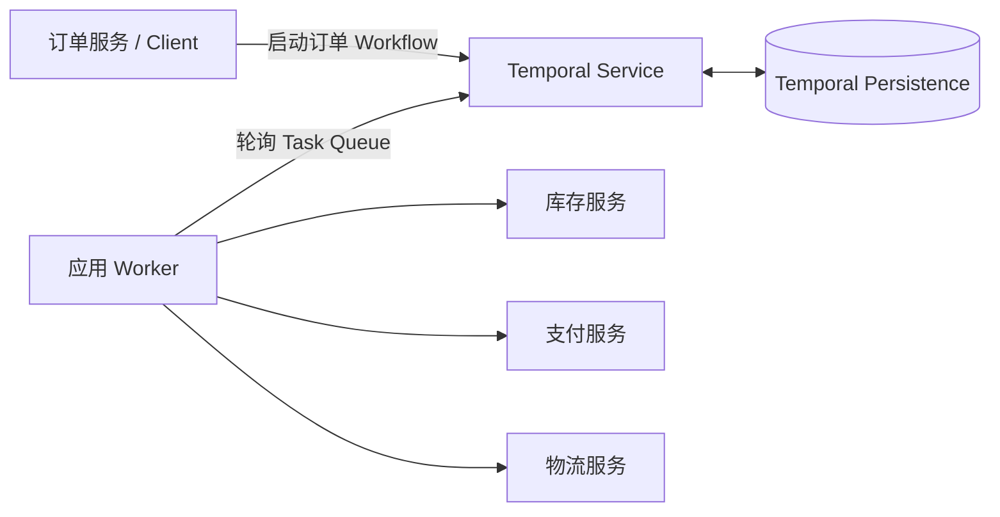

<!-- more -->

## 1. 需求背景

假设用户下单后，系统需要依次完成：

```text
锁定库存 -> 支付 -> 创建物流单 -> 订单完成
```

直接在一个服务进程中执行这段代码并不困难，困难的是中途发生故障：

- 支付接口暂时不可用，需要稍后重试；
- 钱已经扣除，但进程在收到支付结果后崩溃；
- 物流服务故障几个小时，不能一直占用一个线程；
- Worker 重启后，需要知道订单已经执行到哪一步；
- 整个过程需要保留可查询的执行记录。

Temporal 是一个**持久化工作流运行时**。它允许我们把流程写成代码，同时把影响流程推进的输入、结果和事件保存下来。进程退出以后，另一个 Worker 可以根据这些数据恢复 Workflow，并从正确的位置继续。

本文不展开 Temporal 的全部 API，只通过一个订单例子回答三个问题：

1. Workflow 和 Activity 分别是什么；
2. 一次订单 Workflow 是如何执行的；
3. 每一步的数据保存在哪里，又如何在 Worker 重启后恢复。

<!-- more -->

## 2. Temporal 在系统中的位置

一个最小的 Temporal 应用包含三部分：



三者的职责是：

| 组件 | 职责 |
| --- | --- |
| Client | 启动和查询 Workflow，例如订单服务发起一次订单处理 |
| Temporal Service | 保存 Workflow 执行状态和 Event History，创建并派发任务 |
| Worker | 运行我们编写的 Workflow 和 Activity 代码 |

Temporal Service 不执行我们的 Python 代码，也不会替我们访问库存、支付或物流系统。真正执行代码的是 Worker。Temporal Service 更像一个持久化的流程协调器。

## 3. Workflow 与 Activity

### 3.1 Workflow 定义流程

Workflow 描述业务步骤之间的关系：

```text
先锁库存
锁定成功后才能支付
支付成功后才能创建物流单
全部完成后返回物流单号
```

对应的代码大致是：

```python
@workflow.defn
class OrderWorkflow:
    @workflow.run
    async def run(self, order: OrderInput) -> str:
        reservation_id = await workflow.execute_activity(
            reserve_inventory,
            order,
            start_to_close_timeout=timedelta(seconds=30),
        )

        payment_id = await workflow.execute_activity(
            charge_payment,
            ChargeInput(
                order_id=order.order_id,
                amount=order.amount,
            ),
            start_to_close_timeout=timedelta(seconds=30),
        )

        shipment_id = await workflow.execute_activity(
            create_shipment,
            ShipmentInput(
                order_id=order.order_id,
                address=order.address,
            ),
            start_to_close_timeout=timedelta(seconds=30),
        )

        return shipment_id
```

Workflow 代码只负责流程控制，不应该直接请求支付接口或写数据库。原因是 Workflow 会被重复执行，也就是后面要介绍的 Replay。

### 3.2 Activity 接触外部世界

Activity 是真正执行副作用的函数：

```python
@activity.defn
async def reserve_inventory(order: OrderInput) -> str:
    return await inventory_api.reserve(
        order_id=order.order_id,
        sku=order.sku,
        quantity=order.quantity,
    )


@activity.defn
async def charge_payment(command: ChargeInput) -> str:
    return await payment_api.charge(
        idempotency_key=command.order_id,
        amount=command.amount,
    )


@activity.defn
async def create_shipment(command: ShipmentInput) -> str:
    return await shipping_api.create(
        idempotency_key=command.order_id,
        address=command.address,
    )
```

这里的三个 Activity 分别调用库存、支付和物流系统。它们可以失败、超时和重试。

因此可以这样理解：

```text
Workflow：决定下一步做什么
Activity：真正把这一步做掉
Temporal：记录已经决定了什么、已经完成了什么
```

## 4. 一次订单 Workflow 如何启动

订单服务作为 Client 启动 Workflow：

```python
order = OrderInput(
    order_id="1001",
    sku="book-1",
    quantity=1,
    amount=9900,
    address="Shanghai",
)

handle = await client.start_workflow(
    OrderWorkflow.run,
    order,
    id="order-1001",
    task_queue="orders",
)
```

这里传入了三类重要数据：

| 数据 | 示例 | 用途 |
| --- | --- | --- |
| Workflow Type | `OrderWorkflow` | 决定 Worker 使用哪段 Workflow Definition |
| Workflow ID | `order-1001` | 业务上的稳定标识，用于查找和避免重复启动 |
| Workflow Input | `OrderInput(...)` | 这一次订单流程的初始参数 |

Client 请求到达 Temporal Service 后，Temporal 创建一个 Workflow Execution，并在 Event History 中写入第一个事件。可以简化为：

```json
{
  "event_type": "WorkflowExecutionStarted",
  "workflow_type": "OrderWorkflow",
  "workflow_id": "order-1001",
  "task_queue": "orders",
  "input": {
    "order_id": "1001",
    "sku": "book-1",
    "quantity": 1,
    "amount": 9900,
    "address": "Shanghai"
  }
}
```

实际数据会由 Temporal SDK 的 Data Converter 序列化为 Payload，上面的 JSON 只是为了便于理解。

此时订单处理代码甚至还没有开始执行，但启动参数已经保存在 Temporal 的持久化存储中。Client 可以退出，启动请求不会因此消失。

## 5. Workflow 如何驱动每一步执行

Temporal 通过两类 Task 驱动程序：

| Task | 作用 |
| --- | --- |
| Workflow Task | 让 Worker 执行或重放 Workflow，计算下一步应该做什么 |
| Activity Task | 让 Worker 执行某个 Activity |

下面沿订单流程逐步观察数据流转。

### 5.1 执行 Workflow，调度库存 Activity

Temporal 把一个 Workflow Task 放入 `orders` Task Queue。Worker 长轮询这个 Task Queue，取到任务后开始执行：

```python
OrderWorkflow.run(order)
```

`order` 不是从 Worker 本地内存中找回来的，而是来自 `WorkflowExecutionStarted` 事件中保存的 Input。

Workflow 执行到：

```python
reservation_id = await workflow.execute_activity(
    reserve_inventory,
    order,
    ...,
)
```

SDK 不会在 Workflow 进程中直接调用 `reserve_inventory()`。它会产生一个“调度 Activity”的 Command，并将它交给 Temporal Service。

Temporal 接收 Command 后，在 Event History 中追加：

```json
{
  "event_type": "ActivityTaskScheduled",
  "activity_type": "reserve_inventory",
  "activity_id": "1",
  "input": {
    "order_id": "1001",
    "sku": "book-1",
    "quantity": 1,
    "amount": 9900,
    "address": "Shanghai"
  },
  "timeout": "30s"
}
```

这说明 **Activity 的参数是在调度 Activity 时写入 Event History 的**。之后即使原 Worker 退出，Temporal 仍然知道要执行哪个 Activity，以及应该传入什么参数。

### 5.2 执行库存 Activity，保存返回值

Temporal 创建 Activity Task，并通过 Task Queue 匹配给 Worker。Worker 这时才真正调用：

```python
reservation_id = await reserve_inventory(order)
```

假设库存服务返回：

```text
reservation-1001
```

Worker 把结果上报给 Temporal。Temporal 在 History 中追加：

```json
{
  "event_type": "ActivityTaskCompleted",
  "scheduled_event_id": 5,
  "result": "reservation-1001"
}
```

此时 `reservation_id` 已经成为持久化事件的一部分。它不再只存在于某个 Python 进程的局部变量中。

### 5.3 再次执行 Workflow，调度支付 Activity

库存 Activity 完成以后，Temporal 创建新的 Workflow Task。Worker 再次运行 `OrderWorkflow.run()`。

这次执行仍然从函数第一行开始：

```python
reservation_id = await workflow.execute_activity(
    reserve_inventory,
    order,
    ...,
)
```

但 SDK 在 History 中已经看到：

```text
ActivityTaskScheduled(reserve_inventory)
ActivityTaskCompleted(result="reservation-1001")
```

所以它不会再次调用库存服务，而是直接让 `execute_activity()` 返回历史中的结果：

```python
reservation_id = "reservation-1001"
```

Workflow 随后执行到支付步骤并产生新的 Command：

```python
payment_id = await workflow.execute_activity(
    charge_payment,
    ChargeInput(order_id="1001", amount=9900),
    ...,
)
```

Temporal 将支付参数写入新的 `ActivityTaskScheduled` 事件：

```json
{
  "event_type": "ActivityTaskScheduled",
  "activity_type": "charge_payment",
  "activity_id": "2",
  "input": {
    "order_id": "1001",
    "amount": 9900
  }
}
```

支付成功后，支付 ID 也写入完成事件：

```json
{
  "event_type": "ActivityTaskCompleted",
  "result": "payment-1001"
}
```

### 5.4 创建物流单并完成 Workflow

支付完成后，Temporal 再次创建 Workflow Task。Workflow 重放前面的历史，恢复出：

```python
reservation_id = "reservation-1001"
payment_id = "payment-1001"
```

然后调度物流 Activity：

```json
{
  "event_type": "ActivityTaskScheduled",
  "activity_type": "create_shipment",
  "input": {
    "order_id": "1001",
    "address": "Shanghai"
  }
}
```

物流系统返回：

```json
{
  "event_type": "ActivityTaskCompleted",
  "result": "shipment-1001"
}
```

Workflow 最终返回 `shipment-1001`。Temporal 追加最后一个事件：

```json
{
  "event_type": "WorkflowExecutionCompleted",
  "result": "shipment-1001"
}
```

Client 可以通过 Workflow Handle 等待并取得这个结果：

```python
shipment_id = await handle.result()
```

## 6. Temporal 到底持久化了什么

理解 Temporal 最关键的是区分三类数据。

### 6.1 Event History

Event History 是 Workflow Execution 的持久化事实日志，主要包括：

- Workflow 的启动参数；
- Workflow Type、Workflow ID 和 Run ID；
- Activity Type、参数、Timeout 和 Retry Policy；
- Activity 的完成结果或失败信息；
- Timer 的创建和触发；
- Signal、Update、取消等外部事件；
- Workflow 的最终结果或失败。

订单例子中，`OrderInput`、`ChargeInput`、`ShipmentInput`、库存预留 ID、支付 ID 和物流 ID 都会因为出现在 Workflow/Activity 的输入或返回值中而进入 History。

### 6.2 Temporal 的内部执行状态

为了高效调度，Temporal 还会维护当前 Workflow 的内部状态，通常称为 Mutable State，例如：

- Workflow 当前是否运行、完成或失败；
- 当前未完成的 Activity；
- 正在等待的 Timer；
- 下一批需要创建的 Task；
- Event History 的当前位置；
- Retry Attempt 等调度信息。

这些数据同样保存在 Temporal 的 Persistence Store 中。Event History 是发生过的事实，Mutable State 是根据这些事实维护的当前执行索引。应用通常通过 Temporal API 使用它们，而不会直接访问底层表。

### 6.3 Visibility 数据

Temporal 还保存用于检索 Workflow 的可见性数据，例如：

- Workflow ID 和 Workflow Type；
- Start Time、Close Time 和 Execution Status；
- Memo 和 Search Attributes。

它们用于在 Web UI 或 List API 中查找运行记录，不是 Workflow Replay 的主要依据。

## 7. Temporal 不会直接持久化什么

### 7.1 不会逐个保存 Python 局部变量

下面的局部变量不会像内存快照一样单独写入数据库：

```python
reservation_id = ...
payment_id = ...
shipment_id = ...
```

它们之所以能恢复，是因为对应 Activity 的结果已经在 Event History 中。重放时，`execute_activity()` 返回历史结果，Workflow 代码重新计算出这些局部变量。

所以 Temporal 保存的是：

```text
输入、外部结果和事件
```

而不是：

```text
Python 堆、线程、协程栈和每个局部变量的内存快照
```

### 7.2 不会替业务系统保存业务事实

库存数量仍然保存在库存系统，支付流水仍然保存在支付系统，物流单仍然保存在物流系统。

Temporal History 中保存的是这些操作的参数和返回结果，用来驱动流程恢复。它不是订单数据库、支付账本或库存数据库的替代品。

```text
Temporal：支付 Activity 已成功，结果是 payment-1001
支付系统：payment-1001 对应的真实账务记录
```

两边承担不同职责。

### 7.3 不会自动保证外部副作用只发生一次

考虑以下时间点：

```text
支付系统已经扣款成功
    -> Activity Worker 还没把 payment-1001 上报给 Temporal
    -> Worker 崩溃
```

此时 History 中只有 `ActivityTaskScheduled`，没有 `ActivityTaskCompleted`。Temporal 无法知道外部支付系统是否已经完成操作，因此可能重新执行支付 Activity。

所以 Activity 调用外部系统时必须使用幂等键：

```python
await payment_api.charge(
    idempotency_key=order_id,
    amount=amount,
)
```

支付系统第二次收到相同 `order_id` 时，应返回第一次的支付结果，而不是再次扣款。

因此 Temporal 保证的是：

> **Workflow 的流程状态不会丢失；Activity 对外部系统的副作用仍然需要业务幂等性。**

## 8. Worker 重启后如何恢复

假设系统已经完成支付，正在创建物流单时 Worker 崩溃。此时 History 已包含：

```text
库存 Activity 已完成 -> reservation-1001
支付 Activity 已完成 -> payment-1001
物流 Activity 已调度 -> 尚未完成
```

新的 Worker 启动后：

```text
1. 从 Task Queue 取得 Workflow Task
2. SDK 读取 Workflow Event History
3. 从 OrderWorkflow.run() 第一行重新执行
4. reserve_inventory 的结果从 History 返回，不执行库存调用
5. charge_payment 的结果从 History 返回，不执行支付调用
6. 执行到 create_shipment 时，与 History 中未完成的调度状态匹配
7. 等待物流 Activity 完成，或在符合超时/重试条件时重新派发
8. 物流完成后继续执行并结束 Workflow
```

这就是 Replay。它不是跳到 Python 文件的某一行继续，也不是恢复旧进程的调用栈，而是使用 Event History 重新执行 Workflow 代码。

重放过程中，Workflow 每次根据历史产生的决定都必须一致。因此 Workflow 必须是确定性的：

- 不能直接调用外部 API；
- 不能直接读取数据库；
- 不能使用不受 SDK 管理的随机值和系统时间决定分支；
- 不能随意修改已经运行中的 Workflow 所依赖的执行顺序。

外部调用都放进 Activity 后，它们的结果会被记录，重放才可以稳定地取得同样的值。

## 9. 支付失败时发生什么

如果支付 Activity 返回暂时性错误，Temporal 会记录失败 Attempt，并根据 Retry Policy 创建下一次 Attempt：

```text
ActivityTaskScheduled(charge_payment)
ActivityTaskStarted(attempt=1)
ActivityTaskFailed(timeout)
ActivityTaskStarted(attempt=2)
ActivityTaskCompleted(result=payment-1001)
```

等待重试期间不需要占用 Worker 线程。重试时间和 Attempt 状态由 Temporal Service 持久化管理。

如果达到最大重试次数仍然失败，`execute_activity()` 会向 Workflow 抛出 Activity Error。Workflow 可以决定：

- 结束订单；
- 执行释放库存 Activity；
- 等待人工处理；
- 记录失败并发送通知。

例如：

```python
try:
    payment_id = await workflow.execute_activity(charge_payment, ...)
except ActivityError:
    await workflow.execute_activity(
        release_inventory,
        reservation_id,
        start_to_close_timeout=timedelta(seconds=30),
    )
    raise
```

释放库存也是 Activity，所以补偿操作本身失败后同样可以被 Temporal 重试和恢复。

## 10. 把整个运行过程串起来

一次成功订单的数据流如下：

```text
订单服务
  -> StartWorkflow(order-1001, OrderInput)

Temporal Persistence
  -> 保存 WorkflowExecutionStarted + OrderInput
  -> 创建 Workflow Task

Workflow Worker
  -> Replay History
  -> 产生 ScheduleActivity(reserve_inventory, OrderInput)

Temporal Persistence
  -> 保存 ActivityTaskScheduled + Activity Input
  -> 创建 Activity Task

Activity Worker
  -> 调用库存服务
  -> 返回 reservation-1001

Temporal Persistence
  -> 保存 ActivityTaskCompleted + Activity Result
  -> 创建下一个 Workflow Task

Workflow Worker
  -> Replay History，恢复 reservation_id
  -> 调度 charge_payment

同样过程
  -> 保存支付参数
  -> 执行支付
  -> 保存 payment-1001
  -> 调度物流
  -> 保存物流参数
  -> 执行物流
  -> 保存 shipment-1001

Workflow Worker
  -> Replay History
  -> return shipment-1001

Temporal Persistence
  -> 保存 WorkflowExecutionCompleted

订单服务
  -> handle.result() 得到 shipment-1001
```

Temporal 的核心循环就是：

```text
Worker 读取 History
    -> Workflow 计算下一步 Command
    -> Temporal 保存 Event 并创建 Task
    -> Worker 执行 Task 并返回结果
    -> Temporal 保存新 Event
    -> 下一轮 Replay
```

## 11. 总结

理解 Temporal 不需要先记住大量接口，只要抓住下面四个对象：

| 对象 | 在订单例子中的含义 |
| --- | --- |
| Workflow | 定义锁库存、支付和创建物流的顺序 |
| Activity | 真正调用库存、支付和物流系统 |
| Event History | 保存订单输入、Activity 参数、结果、失败和最终结果 |
| Worker | 读取 History，执行 Workflow Replay 或 Activity |

最关键的持久化边界是：

```text
Workflow Input               -> WorkflowExecutionStarted
Activity Input               -> ActivityTaskScheduled
Activity Result / Failure    -> ActivityTaskCompleted / Failed
Timer / Signal               -> 对应的 History Event
Workflow Result              -> WorkflowExecutionCompleted
当前调度状态                  -> Temporal Mutable State
搜索和列表字段                -> Visibility Store
库存、支付、物流业务数据       -> 各自的业务系统
Python 局部变量和调用栈         -> 不直接保存，通过 Replay 重建
```

所以 Temporal 不是把程序进程“冻住”，而是把流程中的关键事实持久化：

> **Temporal 保存 History，Workflow 通过 Replay 恢复状态，Activity 执行真实副作用，幂等键保证副作用可以安全重试。**

## 参考资料

- [Temporal 官方文档](https://docs.temporal.io/)
- [Workflow Execution](https://docs.temporal.io/workflow-execution)
- [Activities](https://docs.temporal.io/activities)
- [Task Queue](https://docs.temporal.io/task-queue)
- [Temporal Python SDK](https://github.com/temporalio/sdk-python)
