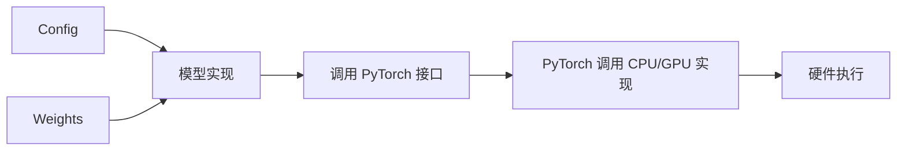
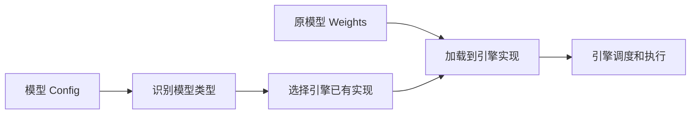
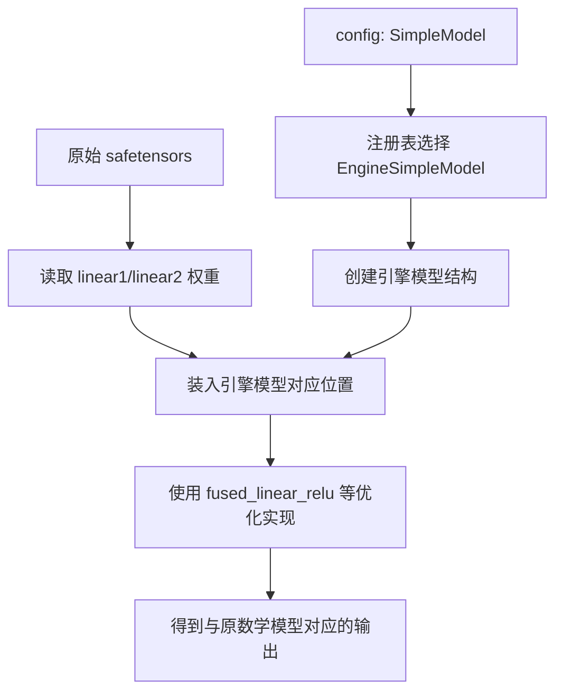
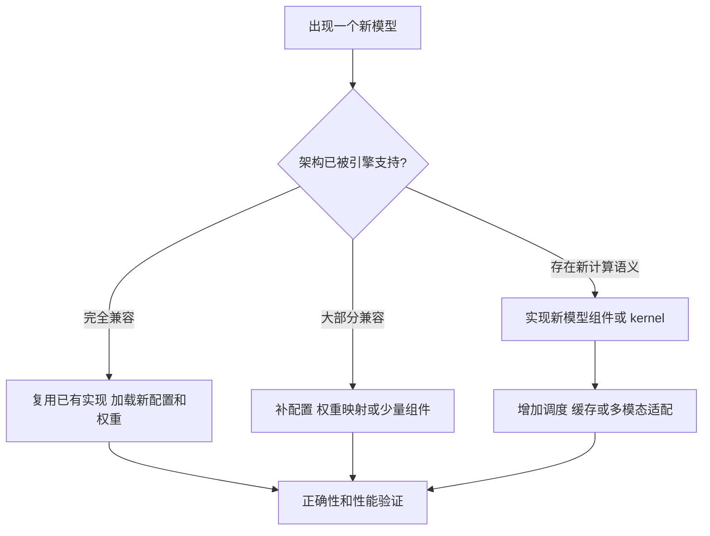
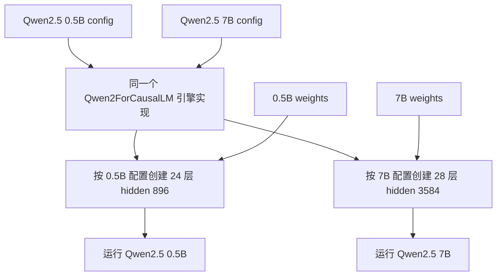

本节只建立模型、PyTorch 和推理引擎之间的整体关系，不讨论底层实现细节。

<!-- more -->

## 1. 模型包含什么

部署一个模型时，通常会遇到：

```text
Config：描述模型规模和结构参数
Model Code：描述模型的计算流程
Weights：训练得到的参数
Processor：把文本、图片、音频或视频转换成张量
```

Config 和 Model Code 共同描述模型如何实现。例如：

```text
有多少层
每层有多宽
使用哪种 Attention
Q Head 和 KV Head 数量
各组件如何连接
输入输出如何转换
```

Weights 则提供这些层实际使用的参数数值。

## 2. 模型代码如何执行

模型代码通常调用 PyTorch 提供的接口：

```text
矩阵乘法
归一化
卷积
softmax
Attention
张量切分与拼接
```

整体关系：



模型代码描述“要进行哪些计算”；PyTorch 负责把这些计算连接到 CPU 或 GPU 的底层实现。

## 3. 推理引擎做什么

原生 PyTorch 模型可以运行，但它通常不是为大量并发请求设计的。推理引擎主要优化：

```text
模型计算的执行方式
GPU 内存管理
请求调度和批处理
KV Cache 管理
多 GPU 执行
低精度计算
服务接口
```

它的目标是：

```text
保持模型要完成的功能基本不变
使用更适合生产推理的方式执行
```

## 4. 推理引擎如何接管模型

可以先理解为两种方式。

### 4.1 使用引擎已有的模型实现

这是 vLLM 等引擎常见的方式：

```text
读取 Config
  ↓
识别模型类型
  ↓
选择引擎中已经适配好的模型实现
  ↓
把原模型 Weights 加载到引擎实现中
  ↓
由引擎调度执行
```

流程图：



这种方式通常不是解析并拆分原始 Python 源代码。引擎开发者已经提前为受支持的模型编写了对应实现。

可以类比为：

```text
Config：说明是哪一种车型
Weights：原车的关键参数和部件数据
推理引擎：选择已经为该车型适配的高性能执行系统
```

如果引擎没有适配这种模型，就可能无法直接运行。

### 4.2 编译模型计算过程

另一种方式更接近传统编译器：

```text
观察模型实际调用的计算操作
  ↓
形成计算图
  ↓
识别可以优化或合并的计算
  ↓
生成更适合硬件执行的代码
```

流程图：


这与“解析原代码结构”有些相似，但它通常关注模型运行时形成的张量计算图，而不是单纯解析 Python 文本语法。

## 5. 对当前理解的修正

下面这句话基本正确：

> 模型的 Config 和 Model Code 描述模型实现，模型实现调用 PyTorch 接口；推理系统可以识别这些计算，并使用更高效的实现执行。

但需要补充：

```text
推理引擎不一定解析原始代码，也不一定自动替换所有 PyTorch 接口。
```

更准确的认识是：

```text
方式一：识别模型类型，选择引擎已经适配的模型实现。
方式二：捕获模型计算图，再对其中的计算进行编译优化。
```

真实系统也可能组合使用这两种方式。

## 5.1 一个最简单的“替换模型”示例

这里的“替换”通常不是修改原模型对象，而是：

```text
不创建原模型类
→ 创建引擎自己的等价模型类
→ 把同一组权重加载进去
```

假设原模型配置是：

```json
{
  "architectures": ["SimpleModel"],
  "hidden_size": 4
}
```

权重文件中有：

```text
linear1.weight
linear1.bias
linear2.weight
linear2.bias
```

### 原模型实现

```python
class SimpleModel:
    def __init__(self, config):
        self.linear1 = Linear(4, 4)
        self.linear2 = Linear(4, 4)

    def forward(self, x):
        a = self.linear1(x)
        b = relu(a)
        y = self.linear2(b)
        return y
```

它的计算过程是：

```text
x → Linear 1 → ReLU → Linear 2 → y
```

### 推理引擎实现

引擎开发者提前编写一个数学上等价的类：

```python
class EngineSimpleModel:
    def __init__(self, config):
        self.linear1 = EngineLinear(4, 4)
        self.linear2 = EngineLinear(4, 4)

    def forward(self, x):
        b = fused_linear_relu(x, self.linear1.weight,
                              self.linear1.bias)
        y = engine_linear(b, self.linear2.weight,
                          self.linear2.bias)
        return y
```

两者要完成的数学计算相同：

```text
y = Linear2(ReLU(Linear1(x)))
```

区别是原模型分开执行 Linear 和 ReLU；引擎模型可以使用融合实现执行 `Linear + ReLU`。

### 引擎如何选择自己的类

引擎读取配置：

```text
architectures = SimpleModel
```

再查询注册表：

```python
MODEL_REGISTRY = {
    "SimpleModel": EngineSimpleModel,
}

model_class = MODEL_REGISTRY[config.architectures[0]]
model = model_class(config)
```

此时创建出来的是：

```text
EngineSimpleModel
```

原来的 `SimpleModel` 根本没有被创建，也就不存在运行过程中修改原模型代码的问题。

### 原权重如何装入新模型

引擎读取权重文件：

```python
checkpoint = load_weights("model.safetensors")

model.linear1.weight = checkpoint["linear1.weight"]
model.linear1.bias   = checkpoint["linear1.bias"]
model.linear2.weight = checkpoint["linear2.weight"]
model.linear2.bias   = checkpoint["linear2.bias"]
```

最终关系：



因此所谓“替换”其实是：

```text
原模型代码                引擎模型代码
SimpleModel      →        EngineSimpleModel

原模型权重                仍然使用原权重
W1、b1、W2、b2   ───────→ W1、b1、W2、b2
```

## 5.2 换成 Attention 的例子

原模型可能定义：

```python
class OriginalAttention:
    def forward(self, x):
        q = q_proj(x)
        k = k_proj(x)
        v = v_proj(x)
        return ordinary_attention(q, k, v)
```

引擎提前实现：

```python
class EngineAttention:
    def forward(self, x, kv_cache):
        q, k, v = fused_qkv_proj(x)
        return optimized_attention(q, k, v, kv_cache)
```

加载时映射：

```text
原 Wq → EngineAttention 的 Q 权重
原 Wk → EngineAttention 的 K 权重
原 Wv → EngineAttention 的 V 权重
原 Wo → EngineAttention 的输出权重
```

计算目标仍然是：

```text
输入 x
→ 产生 Q、K、V
→ 计算 Attention
→ 输出上下文表示
```

引擎改变的是执行代码、缓存布局和调度方式，不是随意改变权重或模型层的含义。

## 5.3 为什么这样做可行

因为神经网络可以分成两部分：

```text
模型结构和公式：规定这些参数如何参与计算
权重数值：训练得到的具体数字
```

只要引擎实现与原实现具有相同的数学语义，并把每个权重放入正确位置，就可以使用不同程序计算同一个模型。

这类似同一个公式：

```text
y = a × x + b
```

可以用 Python、C++ 或 CUDA 实现。代码不同，但只要输入、参数和数学关系一致，目标结果就一致。

## 5.4 引擎为什么不能支持任意模型

引擎必须提前知道：

```text
原模型有哪些组件
组件的计算顺序
每个权重的意义和名字
权重应该装到新实现的什么位置
哪些优化不会改变模型语义
```

所以支持一个新模型通常需要开发者添加：

```text
模型结构适配
权重映射
输入输出处理
正确性测试
```

如果没有这些适配，就不能仅凭一组 `safetensors` 安全地构造等价实现。

## 5.5 每个新模型都需要重新适配吗

不一定。关键不是模型名称是否是新的，而是它的架构和执行语义是否已经受支持。

### 只有权重和配置不同

如果新模型仍然使用引擎已经支持的架构：

```text
Transformer Block 结构相同
Attention 类型相同
RoPE 和 mask 规则相同
权重命名或映射兼容
输入输出形式相同
```

那么已有实现通常可以复用：

```text
已有引擎模型实现
+ 新 config
+ 新 weights
= 运行新模型
```

例如同一模型家族的不同参数规模，可能只有以下配置不同：

```text
层数
hidden_size
head 数
词表大小
```

只要实现是参数化的，就不需要为每个 7B、14B、32B 版本重新写一套模型代码。

### 架构有兼容的小变化

如果新模型增加一个已有组件，或只是权重命名不同，可能只需较小适配：

```text
增加配置解析
增加权重名称映射
启用已有 RoPE/Norm/Activation 实现
补充模型注册信息
```

这通常不需要重写整个模型。

### 引入新的计算语义

如果新模型引入引擎尚未支持的能力，则需要更深入适配：

```text
新的 Attention 规则
新的位置编码
新的 MoE 路由
新的状态空间或循环结构
新的 KV Cache 组织
新的多模态编码器
视频、音频等新的输出管线
新的并行或通信要求
```

这时可能需要：

```text
新模型类
新算子或 kernel
新的权重加载器
新的调度方式
新的输入输出处理
正确性与性能测试
```

### 推理引擎如何复用代码

引擎通常分层复用：

```text
通用基础设施
├── 请求调度
├── 显存分配
├── KV Cache 管理
├── Tensor Parallel
├── 服务 API
└── 监控

通用模型组件
├── Linear
├── RMSNorm
├── RoPE
├── MHA/GQA/MQA
├── MLP
├── MoE
└── 常用量化算子

模型家族适配
├── 组件如何连接
├── 配置如何解释
├── 权重如何映射
└── 输入输出如何处理

模型实例
├── config
└── weights
```

所以通常不是“每个模型都从零实现”，而是：

```text
复用引擎基础设施
+ 复用已有模型组件
+ 编写少量或大量架构适配
+ 加载该模型自己的权重
```

### 判断是否需要适配



因此，新模型的“适配成本”是一个范围：

```text
最低：无需代码修改，只加载新权重
中等：增加注册、配置和权重映射
最高：实现新结构、kernel、缓存和调度机制
```

## 5.6 真实复用案例：Qwen2.5 不同参数规模

Qwen2.5-0.5B-Instruct 和 Qwen2.5-7B-Instruct 是两个真实模型。它们的参数规模差异很大，但配置都声明：

```json
{
  "architectures": ["Qwen2ForCausalLM"],
  "model_type": "qwen2"
}
```

它们主要通过配置描述规模差异：

| 配置 | Qwen2.5-0.5B-Instruct | Qwen2.5-7B-Instruct |
| --- | ---: | ---: |
| `hidden_size` | 896 | 3584 |
| `num_hidden_layers` | 24 | 28 |
| `num_attention_heads` | 14 | 28 |
| `num_key_value_heads` | 2 | 4 |
| `intermediate_size` | 4864 | 18944 |
| `architectures` | Qwen2ForCausalLM | Qwen2ForCausalLM |

推理引擎看到的逻辑是：

```text
两个模型都是 Qwen2ForCausalLM
→ 选择同一个 Qwen2 模型家族实现
→ 根据各自 config 创建不同大小的层和张量
→ 分别加载各自的权重
```



这里复用的不是同一个运行中的模型对象，而是同一套模型类和通用组件代码：

```text
复用：Qwen2ForCausalLM 的执行结构
复用：Attention、RoPE、RMSNorm、MLP 等实现
复用：调度、KV Cache 和服务基础设施

不复用：具体模型权重
不同：层数、宽度、Head 数等配置
```

这与同一段参数化代码创建不同大小的数组类似：

```python
small = Qwen2EngineModel(config_0_5b)
large = Qwen2EngineModel(config_7b)
```

所以“新发布一个 Qwen2 架构的不同规模或微调模型”通常不要求为它从零实现推理引擎。只要配置和权重格式兼容，已有 Qwen2 架构实现就能复用。

vLLM 的官方支持列表也以架构为单位列出 `Qwen2ForCausalLM`，并在该架构下列出 Qwen2 等模型，而不是为每个 checkpoint 分别实现一个模型类。

## 6. 为什么同一模型能更快

推理引擎可以采用：

```text
更高效的 Attention 实现
更少的中间数据
更合理的显存管理
多个请求动态组成 batch
更适合 GPU 的计算代码
多 GPU 并行
```

模型权重可以保持不变，但执行和调度方式发生变化，因此速度、吞吐和显存占用会不同。

## 7. 当前阶段需要掌握的结论

```text
模型代码：描述模型要进行什么计算
Config：描述模型结构和规模
Weights：保存训练得到的参数
PyTorch：提供张量和模型计算接口
推理引擎：以更适合生产服务的方式执行和调度模型
GPU：真正完成底层计算
```

推理引擎不是模型，也不会凭空改变模型学到的知识。它主要改变模型如何在硬件上执行。
