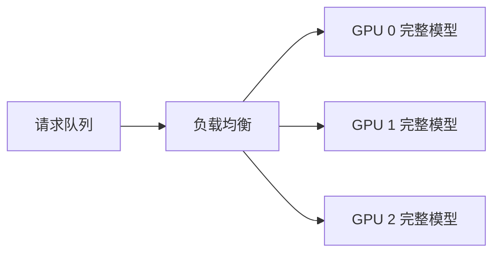
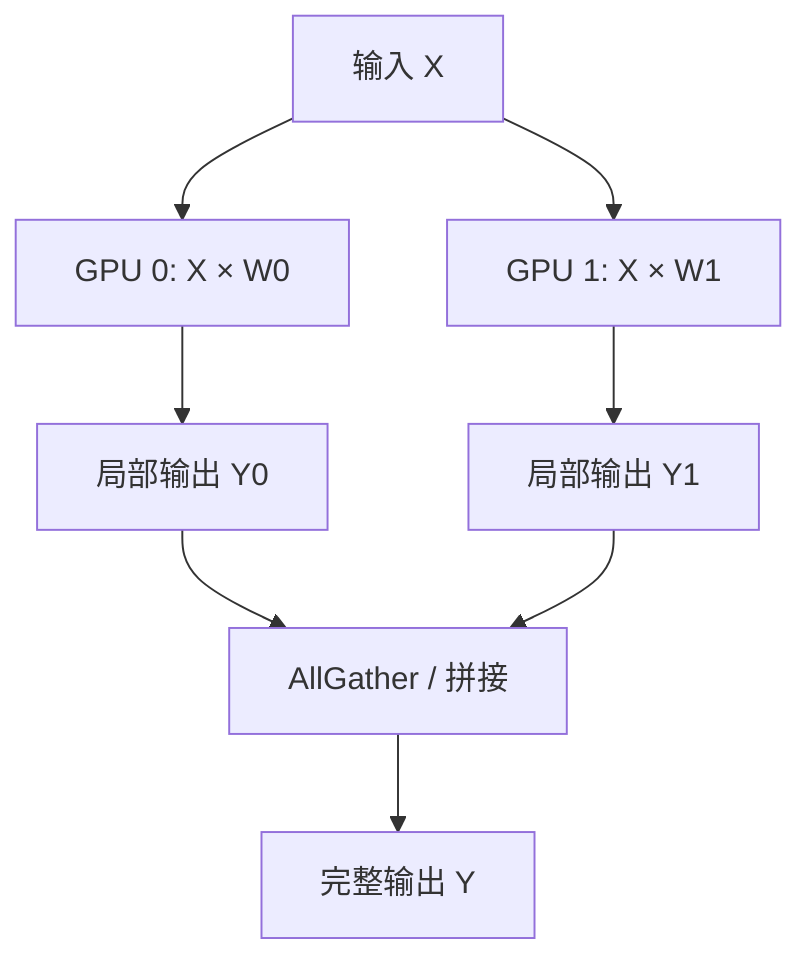
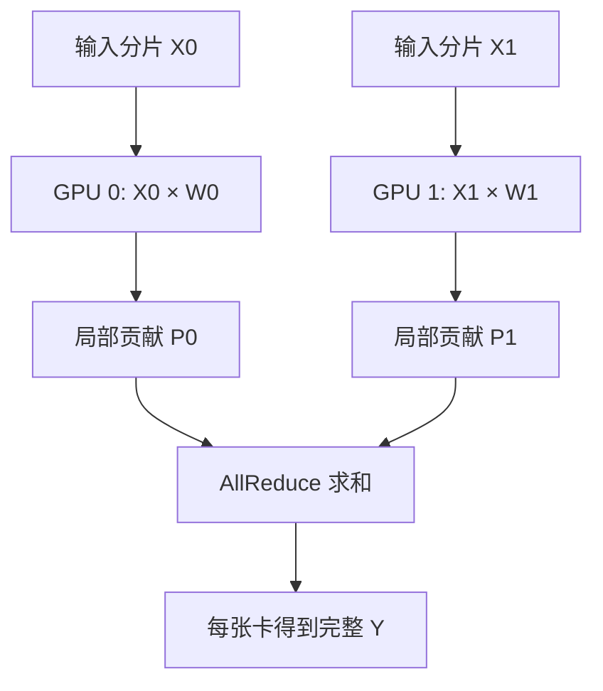
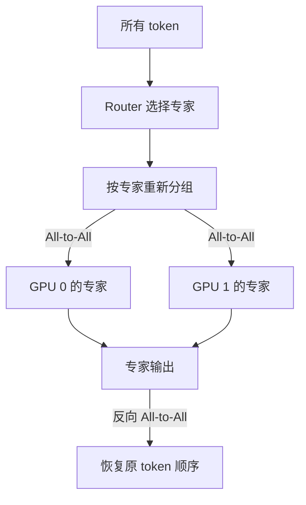
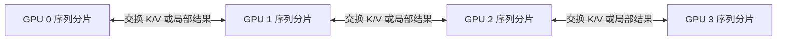
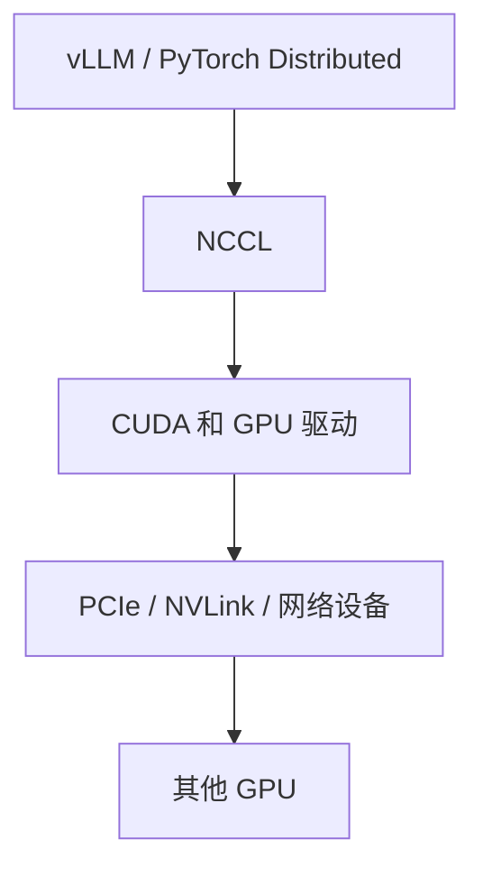
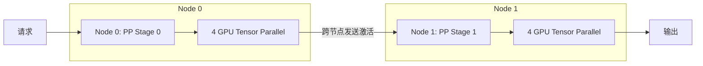
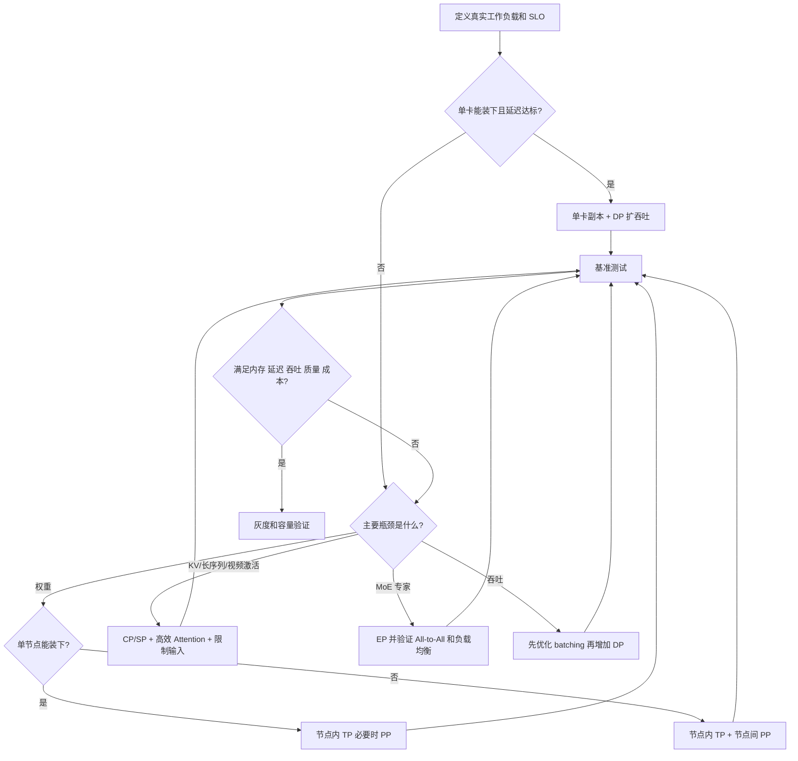

单张 GPU 放不下模型或无法满足吞吐要求时，需要多张 GPU 协作。多 GPU 的核心并不是“同时启动几个进程”，而是决定模型或请求如何切分，以及切分后各 GPU 必须交换什么数据。

<!-- more -->

## 1. 为什么多 GPU 必须通信

一张 GPU 有自己的显存：

```text
GPU 0 ── VRAM 0
GPU 1 ── VRAM 1
```

两张 GPU 的显存并不是天然合并成一块统一显存。GPU 0 上的计算如果需要 GPU 1 中的数据，就必须通过 PCIe、NVLink 或网络传输。

假设一个模型层被切成两半：

```text
GPU 0：保存权重前半部分
GPU 1：保存权重后半部分
```

两张 GPU 只能先得到局部计算结果：

```text
GPU 0 → 局部结果 A
GPU 1 → 局部结果 B
```

下一步如果需要完整结果，就必须交换或合并：

```text
A + B → 完整结果
```

因此：

> 切分解决了单卡容量或计算能力问题，同时制造了跨设备的数据依赖；通信就是满足这些依赖的过程。

## 2. 多 GPU 的两种基本目标

### 2.1 模型放不下

```text
模型权重 120 GiB
单卡显存 80 GiB
```

必须把模型权重或组件分到多张卡。

### 2.2 模型能放下，但吞吐不足

如果单卡可以运行，可以启动多个模型副本：

```text
GPU 0：完整模型副本，处理请求 A、B
GPU 1：完整模型副本，处理请求 C、D
```

这种方式称为数据并行或多副本扩展。推理时不同副本之间通常不需要为每一个 token 频繁交换模型中间结果，因此通信相对简单。

## 3. Data Parallel：按请求拆分

Data Parallel，简称 DP：



每张 GPU 都有完整模型，处理不同请求。

优点：

- 推理过程跨 GPU 通信少；
- 容易横向扩展；
- 一张卡故障不会必然中断其他副本；
- 适合模型能放入单卡的场景。

缺点：

- 每张卡都要保存完整权重；
- 无法解决模型单卡放不下；
- 请求长度差异可能造成负载不均衡。

训练中的 Data Parallel 还需要同步梯度，但本课程重点是推理部署。

## 4. Tensor Parallel：切分同一层的张量

Tensor Parallel，简称 TP，把一个层中的大矩阵拆到多张 GPU。

假设线性层：

```text
Y = XW
```

### 4.1 按输出维度切分

将权重按列或输出特征切成两部分：

```text
W = [W0 | W1]
```

两张 GPU 分别计算：

```text
GPU 0：Y0 = XW0
GPU 1：Y1 = XW1
```

完整输出为：

```text
Y = [Y0 | Y1]
```

如果下一步需要完整 Y，就要收集各卡结果，常使用 AllGather 或等价的数据组织方式。



### 4.2 按输入维度切分

也可以将输入和权重按输入特征切分：

```text
X = [X0 | X1]

W = [W0
     W1]
```

各 GPU 得到局部贡献：

```text
GPU 0：P0 = X0W0
GPU 1：P1 = X1W1
```

完整结果：

```text
Y = P0 + P1
```

这需要把各卡贡献相加，常使用 AllReduce。



### 4.3 TP 的特点

优点：

- 单层权重分散到多张 GPU；
- 多张 GPU 同时计算同一层；
- 可以降低单卡权重压力。

缺点：

- 几乎每层或每几个算子就需要通信；
- 对互联带宽和延迟敏感；
- 跨机器 TP 通常比单机 NVLink 内 TP 更困难；
- GPU 速度或负载不一致会相互等待。

## 5. Pipeline Parallel：按层拆分

Pipeline Parallel，简称 PP，把不同层放到不同 GPU：

```text
GPU 0：Layer 0～7
GPU 1：Layer 8～15
GPU 2：Layer 16～23
GPU 3：Layer 24～31
```

一次请求的激活依次流过：


通信内容主要是阶段之间的激活，而不是每层都进行 AllReduce。

优点：

- 容易理解；
- 不同 GPU 保存不同层；
- 层边界通信频率通常低于细粒度 TP。

缺点：

- 单个请求顺序经过各阶段；
- 某些阶段计算慢会造成流水线阻塞；
- 不进行 micro-batch 调度时，部分 GPU 会空闲；
- 层大小不均衡时难以平均切分。

推理中可以同时让不同请求或 micro-batch 位于不同流水线阶段，提高利用率。

## 6. Expert Parallel：按 MoE 专家拆分

MoE 模型包含多个专家，但每个 token 通常只选择少数专家：

```text
Router
├── Expert 0
├── Expert 1
├── Expert 2
└── Expert 3
```

Expert Parallel，简称 EP，把专家分布到不同 GPU：

```text
GPU 0：Expert 0、1
GPU 1：Expert 2、3
```

Router 为 token 选择专家后，token 激活必须发送到拥有该专家的 GPU：



主要通信是 All-to-All：每张 GPU 都可能向其他 GPU 发送一部分 token。

主要难点：

- token 路由不均衡；
- 某些专家过热；
- All-to-All 通信量大；
- 跨机网络容易成为瓶颈；
- batch 较小时专家计算效率不足。

## 7. Sequence/Context Parallel：按序列拆分

对于非常长的文本或大量视频 token，单张 GPU 可能放不下序列激活或 Attention 中间状态。

Context Parallel 或 Sequence Parallel 会沿序列维度拆分：

```text
GPU 0：token 0～1023
GPU 1：token 1024～2047
GPU 2：token 2048～3071
GPU 3：token 3072～4095
```

但 Attention 中一个 token 可能需要读取其他分片中的 K、V，因此各 GPU 仍要通信。



具体通信方式取决于 Attention 算法，可能采用 AllGather、ReduceScatter、环形传输或专门的 context-parallel 算法。

对于 H3 这类长视频 token 场景，序列/上下文并行具有重要意义，因为主要压力不一定只有权重，还可能来自长序列 Attention 和激活。

## 8. 常见集合通信

### 8.1 Broadcast

一张 GPU 的数据发送给所有 GPU：

```text
GPU 0 数据 → GPU 0、1、2、3
```

用途示例：分发配置、初始输入或某些状态。

### 8.2 AllGather

每张 GPU 有一个不同分片，通信后每张 GPU 都拥有全部分片：

```text
通信前：
GPU 0：[A]
GPU 1：[B]

通信后：
GPU 0：[A, B]
GPU 1：[A, B]
```

### 8.3 AllReduce

每张 GPU 有局部结果，先进行归约，再把结果发给所有 GPU：

```text
通信前：
GPU 0：A
GPU 1：B

求和后：
GPU 0：A+B
GPU 1：A+B
```

### 8.4 ReduceScatter

先对数据归约，再让每张 GPU 只保留结果的一部分：

```text
AllReduce 可以粗略看成：
ReduceScatter + AllGather
```

它适合下一阶段本来就只需要结果分片的场景，可以避免每张卡都持有完整结果。

### 8.5 All-to-All

每张 GPU 分别向每张其他 GPU 发送不同的数据：

```text
GPU 0 的一部分 → GPU 1
GPU 0 的另一部分 → GPU 2
GPU 1 的一部分 → GPU 0
...
```

MoE 按专家重新分配 token 是典型场景。

### 8.6 Send/Recv

一张 GPU 向指定 GPU 发送数据：

```text
GPU 0 → GPU 1
```

Pipeline Parallel 阶段间传递激活是典型场景。

## 9. NCCL 是什么

NCCL 是 NVIDIA 提供的 GPU 集合通信库。它为多 GPU 提供：

```text
AllReduce
AllGather
ReduceScatter
Broadcast
All-to-All 或相关通信组合
Send/Recv
```

上层框架调用 NCCL，NCCL 根据硬件拓扑选择通信路径：

```text
同一 GPU 内存
PCIe
NVLink/NVSwitch
跨机 InfiniBand/RoCE/Ethernet
```

软件关系：



NCCL 不决定模型采用 TP 还是 PP。上层推理引擎决定要交换什么，NCCL 负责高效完成交换。

## 10. 硬件互联为什么重要

假设每层需要交换 2 GiB 数据：

```text
通信时间下限 ≈ 数据量 ÷ 有效带宽
```

即使 GPU 计算非常快，如果互联带宽低，GPU 也会等待通信。

大致关系：

```text
同机 NVLink/NVSwitch：通常适合高频大规模 GPU 通信
同机 PCIe：可用，但带宽和拓扑更受限制
跨机高速网络：需要 RDMA、InfiniBand/RoCE 等优化
普通以太网：高频 TP/EP 可能受到明显限制
```

具体性能必须以目标硬件、代际、链路宽度和拓扑测量为准。

## 11. 拓扑是什么

同样是 8 张 GPU，它们之间的连接不一定相同：

```text
GPU 0 与 GPU 1 有 NVLink
GPU 0 与 GPU 7 可能需要经过 PCIe Switch 或 CPU Socket
跨节点还要经过网卡和交换机
```

查看 NVIDIA GPU 拓扑的常用命令：

```bash
nvidia-smi topo -m
```

部署时需要尽量让通信频繁的并行组使用更快、更近的连接。例如 TP 组通常优先放在同一 NVLink/NVSwitch 域内。

## 12. 为什么 GPU 会互相等待

假设 Tensor Parallel 中：

```text
GPU 0 计算需要 5 ms
GPU 1 计算需要 8 ms
```

AllReduce 必须等两张 GPU 都准备好，GPU 0 会等待 GPU 1：

```text
整个阶段耗时 ≥ 最慢计算 + 通信
```

造成不均衡的原因包括：

- GPU 型号不同；
- 温度或功耗限制；
- 其他进程占用；
- 输入分片大小不同；
- MoE 专家负载不均；
- 网络路径不同；
- 某张卡发生错误重试。

因此生产集群通常避免把性能差异大的 GPU 放进同一个紧耦合并行组。

## 13. 通信与计算重叠

如果先完成全部计算再通信：

```text
计算 10 ms → 通信 6 ms → 总计约 16 ms
```

优化实现可以把大张量分块：

```text
计算块 1 完成 → 开始通信块 1
同时计算块 2
```

理想情况下，一部分通信时间可以隐藏在计算之后：

```mermaid
gantt
    title 计算与通信重叠示意
    dateFormat X
    axisFormat %L
    section Compute
    计算块 1 :0, 5
    计算块 2 :5, 10
    section Communication
    通信块 1 :5, 9
    通信块 2 :10, 14
```



是否能有效重叠取决于：

- 是否存在独立计算；
- GPU 和通信链路资源竞争；
- 分块大小；
- CUDA stream 和依赖管理；
- 框架实现。

## 14. 如何选择并行方式

### 模型可以放进单卡，主要目标是吞吐

```text
优先：Data Parallel / 多副本
```

### 单层矩阵太大或希望多卡共同计算每层

```text
考虑：Tensor Parallel
```

### 模型层数很多，可以按层拆分

```text
考虑：Pipeline Parallel
```

### 模型是 MoE，专家权重很大

```text
考虑：Expert Parallel
```

### 序列或视频 token 导致激活和 Attention 过大

```text
考虑：Sequence/Context Parallel
```

实际大型模型常组合多种并行：

```text
TP × PP × DP
EP × TP × DP
CP × TP
```

组合越复杂，调度、通信和故障排查也越困难。

## 15. H3 为什么可能需要复杂通信

H3 类视频生成模型可能同时面临：

```text
Transformer 权重较大
视频时空 token 很长
Attention 激活较大
多步生成重复执行
多模态条件增加输入复杂度
不同阶段计算负载不同
```

可能的切分方向：

```text
TP：切分 Transformer 层内矩阵
PP：把不同层或管线阶段放到不同 GPU
CP/SP：按视频 token 序列拆分
组件切分：编码器、Transformer、VAE 分阶段放置
DP：多个完整服务副本处理不同生成任务
```

视频生成不是简单地“GPU 越多越快”。如果通信量、阶段不均衡或输入太小，多 GPU 反而可能因为通信开销效率下降。

## 16. 常见故障与检查

常见问题：

```text
NCCL 初始化失败
某个 rank 无法连接
GPU 拓扑不理想
网卡选择错误
各节点软件版本不同
某张 GPU OOM 导致所有 rank 等待
collective 调用顺序不一致导致挂起
MoE 负载不均
```

基础检查工具：

```bash
nvidia-smi
nvidia-smi topo -m
NCCL_DEBUG=INFO
torchrun
nccl-tests
nsys
```

排查时首先回答：

```text
有多少个进程/rank？
每个 rank 使用哪张 GPU？
采用什么并行方式？
在哪个 collective 挂住？
通信走 NVLink、PCIe 还是网络？
是计算慢还是通信慢？
```

## 17. 本节练习

1. 为什么把一层权重切到两张 GPU 后，会产生通信需求？
2. 模型能放入单卡，只想提高请求吞吐，通常优先选择 DP 还是 TP？
3. TP、PP、EP、CP 分别主要沿哪个维度切分？
4. AllGather、AllReduce、All-to-All 分别完成什么数据交换？
5. 为什么 TP 通常更适合放在同一台具有高速互联的机器内？
6. H3 中如果主要问题是视频 token 导致 Attention 激活过大，只有权重 TP 一定能解决吗？还应考虑什么并行方式？

> 本节练习尚未作答。回答后将在这里追加讲评。

## 18. vLLM 是否支持多 GPU 和跨节点

支持。vLLM 可以用于：

```text
单机多 GPU
跨节点多 GPU
多模型副本
TP、PP、DP，以及 MoE 场景的 EP
```

### 18.1 单机多 GPU

最直接的是 Tensor Parallel：

```bash
vllm serve MODEL \
  --tensor-parallel-size 4
```

表示一个模型实例使用 4 张 GPU 切分层内矩阵。

也可以组合 TP 和 PP：

```bash
vllm serve MODEL \
  --tensor-parallel-size 4 \
  --pipeline-parallel-size 2
```

总 GPU 数为：

```text
TP × PP = 4 × 2 = 8
```

可以直观理解为：

```text
模型分成 2 个流水线阶段
每个阶段内部再用 4 张 GPU 做 Tensor Parallel
```

单机执行通常可使用原生 multiprocessing。

### 18.2 跨节点多 GPU

当单台机器的 GPU 不足以放下模型时，可以建立多节点集群，并由 Ray 等分布式运行时调度 vLLM workers。

例如两台机器，每台 4 张 GPU：

```text
Node 0：GPU 0～3
Node 1：GPU 4～7
```

一种常见设计是：

```text
TP = 4：每个 TP 组留在单节点内部
PP = 2：两个节点分别承担一个 Pipeline Stage
```



这样设计的原因是：

```text
TP：几乎每层都要通信，频率高
PP：主要在阶段边界传输激活，频率相对低
```

所以通常尽量让 TP 使用同机 NVLink/PCIe，把跨节点通信留给 PP。当然，具体组合取决于模型、节点 GPU 数量和网络性能。

### 18.3 跨节点 Data Parallel

如果每个模型副本能够放入一台节点，可以在不同节点运行多个副本：

```text
Node 0：模型副本 A
Node 1：模型副本 B
Node 2：模型副本 C
```

由 vLLM 内部或外部负载均衡器分发请求。DP 副本处理独立请求时，通常不需要像 TP 那样每层跨节点通信。

当前 vLLM 官方文档支持跨节点 Data Parallel，可以在各节点分别启动相应 rank，也可以选择 Ray backend。

### 18.4 MoE 的跨节点 Expert Parallel

对于 DeepSeek 等 MoE 模型，vLLM 也支持 Expert Parallel：

```text
不同 GPU/节点保存不同专家
token 根据 Router 发送给对应专家
```

这会产生 All-to-All 通信。跨节点性能高度依赖 InfiniBand、RoCE 等高速网络和相应通信 backend。

### 18.5 跨节点部署的必要条件

各节点通常需要：

```text
相同或兼容的 GPU
相同的模型文件和路径
一致的容器镜像/Python 依赖
兼容的驱动、CUDA、PyTorch、vLLM 和 NCCL
节点之间端口可达
正确选择网卡
足够快的跨节点网络
一致的环境变量和启动参数
```

使用相同容器镜像可以减少环境差异，但宿主 GPU 驱动和网络配置仍需正确。

### 18.6 “支持跨节点”不等于“普通网络也高效”

跨节点 TP、EP 等紧耦合并行会频繁通信。如果只使用普通低带宽、高延迟以太网，可能出现：

```text
GPU 大量等待网络
增加 GPU 后吞吐没有提高
延迟反而上升
NCCL 超时或初始化问题
```

因此选择顺序通常是：

```text
模型能放入单卡：DP 多副本
模型能放入单节点：节点内 TP，节点间 DP
模型无法放入单节点：节点内 TP + 节点间 PP
MoE 大模型：根据模型支持组合 DP/TP/EP
```

这只是推荐起点，最终必须使用目标模型、硬件拓扑和真实输入压测。

## 19. 生产中如何选择并行方式

不要先问“这个模型应该使用 TP 还是 PP”，而要依次回答四个问题：

```text
1. 单卡能否容纳一个模型实例和目标请求？
2. 单节点能否容纳一个模型实例？
3. 最大压力来自权重、KV/激活，还是 MoE 专家？
4. 业务目标主要是延迟、吞吐，还是必须先运行起来？
```

### 19.1 第一步：建立目标工作负载

必须先定义生产输入，不能只使用一句短 prompt 测试：

```text
模型和精度
输入 token 的 P50/P95/P99
输出 token 的 P50/P95/P99
最大上下文长度
并发数和 QPS
流式或非流式
延迟目标 TTFT/TPOT
可接受的质量损失
```

视频模型还需要：

```text
分辨率
帧数/时长
batch
参考图像、视频、音频数量
生成步数
VAE 解码方式
```

没有工作负载，就无法判断请求级内存和吞吐需求。

### 19.2 第二步：先测试单卡

用目标精度估算并实测：

```text
峰值 VRAM
≈ 权重
+ KV Cache 或 latent/conditioning
+ 峰值激活
+ runtime/workspace
+ 安全余量
```

如果单卡能容纳目标请求，并且单卡延迟达标：

```text
优先使用单卡模型副本 + DP
```

原因是 DP 请求之间基本独立，通信少、扩缩容简单、故障隔离较好。

### 19.3 权重放不进单卡，但能放进单节点

优先尝试顺序：

```text
合适的低精度/量化
→ 节点内 TP
→ 必要时节点内 PP
```

TP 适合：

```text
单层矩阵较大
GPU 间有 NVLink/NVSwitch 或较好的 PCIe 拓扑
希望多卡共同计算每一层
```

PP 适合：

```text
模型层数多
GPU 数不能很好地匹配 TP 切分
按层切分比层内高频通信更合适
可以接受流水线调度和气泡
```

### 19.4 模型放不进一个节点

常见起点：

```text
节点内 TP
+ 节点间 PP
```

例如每节点 8 张 GPU：

```text
TP = 8
PP = 节点数
```

理由是 TP 通信频率高，尽量留在节点内部；PP 主要在阶段边界传递激活，更适合跨节点。

这不是硬性规则。高速 NVSwitch 域、InfiniBand/RoCE 网络、模型结构和引擎能力都可能改变最优组合。

### 19.5 KV Cache 或序列激活是瓶颈

仅增加权重 TP 不一定能解决长上下文问题。

如果主要压力来自：

```text
长文本 KV Cache
长序列 Attention
视频时空 token
大分辨率 latent/激活
```

应考虑：

```text
降低最大上下文、分辨率或帧数
KV Cache 低精度
内存高效 Attention
Sequence/Context Parallel
Prefill/Decode 分离
并发限制和请求分桶
```

### 19.6 MoE 专家权重是瓶颈

MoE 模型先区分：

```text
总参数量很大
每 token 只激活少量专家
```

如果专家权重占主要空间，可考虑 EP；但必须检查：

```text
All-to-All 网络性能
专家路由是否均衡
batch/token 数是否足够
目标引擎和模型是否支持对应 EP backend
```

网络较差或 batch 太小时，EP 的通信开销可能抵消稀疏计算收益。

### 19.7 模型已能运行但吞吐不足

先判断单副本 GPU 利用率：

```text
利用率低：检查 batching、请求长度差异、CPU/网络/预处理瓶颈
利用率高且延迟可接受：增加 DP 副本
单请求延迟不达标：考虑更快 kernel、量化、TP 或更小模型
```

不要为了提升总 QPS 直接扩大 TP。TP 增加单个模型实例使用的 GPU 数，并引入通信；对于模型能放入单卡的场景，多副本 DP 往往更容易获得近线性吞吐扩展。

### 19.8 决策流程



### 19.9 候选方案必须实测

至少对比 2～3 个候选方案。例如 8 张 GPU：

```text
方案 A：TP=8, PP=1
方案 B：TP=4, PP=2
方案 C：TP=2, PP=4
```

对每个方案使用相同模型、精度和请求回放，记录：

| 类别 | 指标 |
| --- | --- |
| 正确性 | 输出质量、与原生基线差异 |
| 内存 | 每张卡权重、KV/激活、峰值 VRAM |
| 延迟 | P50/P95/P99 TTFT、TPOT、端到端延迟 |
| 吞吐 | requests/s、tokens/s 或视频任务/小时 |
| GPU | 利用率、显存带宽、通信等待 |
| 网络 | collective 带宽、跨节点流量、重传 |
| 稳定性 | OOM、超时、NCCL 错误、长时间运行 |
| 成本 | 单百万 token 或单个生成任务成本 |

最终选择应满足：

```text
正确性合格
+ 峰值有安全余量
+ 延迟满足 SLO
+ 吞吐满足容量
+ 网络不过载
+ 单位请求成本合理
+ 故障可恢复
```

### 19.10 一个简化例子

条件：

```text
模型 BF16 权重约 120 GiB
每台机器 8 × 24 GiB GPU
节点内只有 PCIe
模型目标请求峰值需要额外约 25 GiB
```

单卡不可能；单节点总显存为 192 GiB，但不能简单相加，仍需为每卡分片、激活和工作区留余量。

候选方案：

```text
TP=8：权重约分到 8 卡，但每层高频 PCIe 通信
TP=4, PP=2：每个阶段用 4 卡 TP，两个阶段传递激活
量化 + TP=4：减少权重，用 4 卡运行，剩余 4 卡建立第二副本
```

如果量化质量合格且 4 卡可以稳定运行，第三种方案可能提供更高总吞吐；如果量化不可接受，则需比较前两个方案的延迟和通信占比。

不存在仅凭参数量就能得出的唯一答案。
