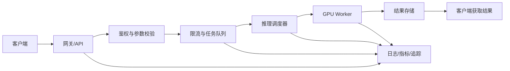
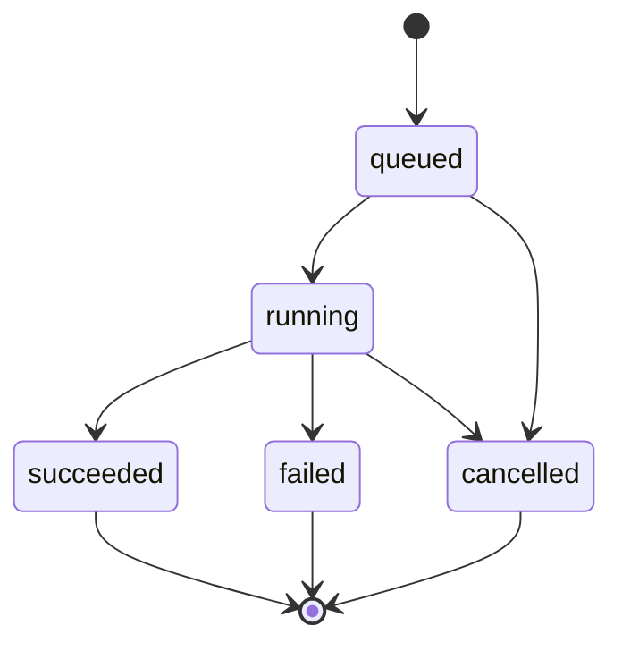
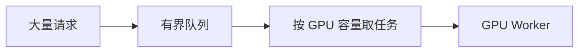
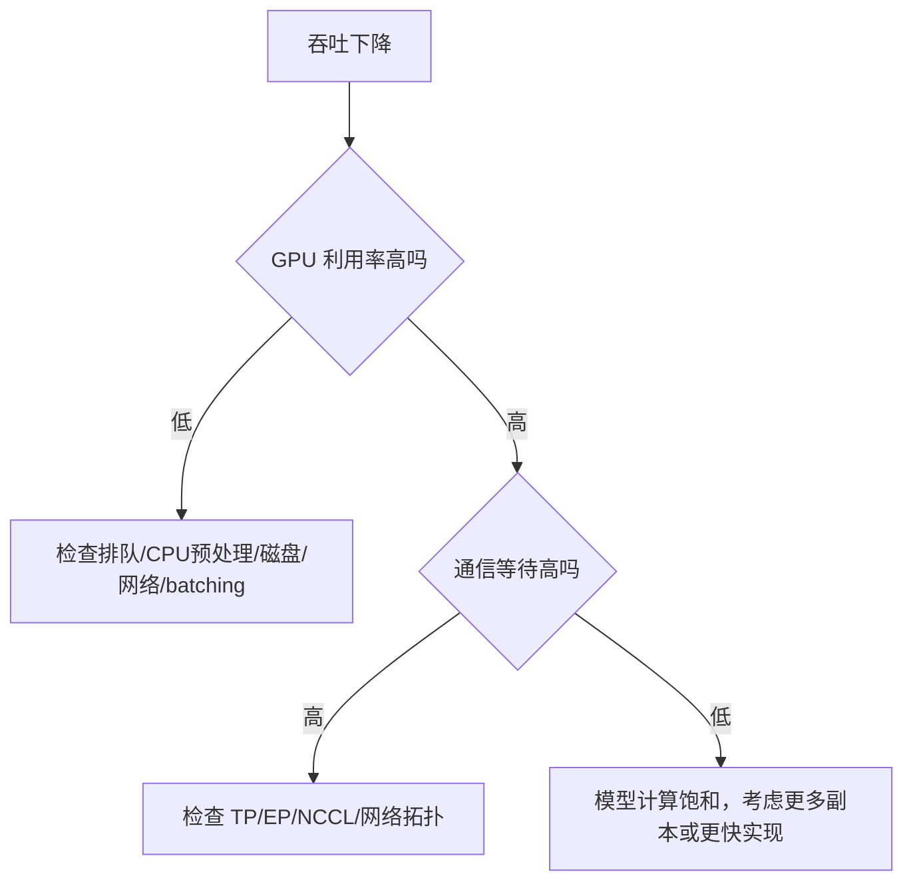

模型能够在命令行完成一次推理，只能说明功能路径基本跑通。生产服务还需要处理并发、失败、安全、观测、升级和资源边界。

<!-- more -->

## 1. 从脚本到生产服务

本地脚本：

```text
输入
→ 调用模型
→ 等待完成
→ 保存结果
```

生产系统：



生产部署必须回答：

```text
谁可以调用？
一次请求允许多大？
GPU 忙时怎么办？
请求失败后是否重试？
客户端断开后是否继续生成？
结果保存在哪里？
如何知道服务变慢或出错？
如何升级而不中断业务？
```

## 2. 同步、流式与异步 API

### 2.1 同步 API

客户端保持连接直到模型返回：

```text
POST /generate
  ↓ 等待
200 OK + 完整结果
```

适合：

- 推理时间较短；
- 结果较小；
- 客户端可以保持连接。

风险：

- 长连接占用网关资源；
- 容易触发代理超时；
- 客户端断开时任务状态难处理。

### 2.2 流式 API

模型生成一部分就发送一部分：

```text
文本 token 1 → token 2 → token 3
音频 chunk 1 → chunk 2 → chunk 3
```

适合：

- 文本生成；
- 流式 TTS；
- 用户关心首 token/首音频延迟。

常见传输形式包括 SSE、chunked HTTP 或 WebSocket，具体选择取决于客户端交互和双向通信需求。

### 2.3 异步任务 API

视频生成通常耗时较长，更适合异步任务：

```text
POST /jobs
  ↓
返回 job_id

GET /jobs/{job_id}
  ↓
返回 queued/running/succeeded/failed

GET /jobs/{job_id}/result
  ↓
获取结果
```

状态机：



异步接口需要持久化任务状态，不能只把状态保存在 API 进程内存中，否则进程重启会丢失任务。

## 3. API 契约

一个稳定的 API 需要明确：

```text
输入字段及类型
必填和可选字段
最大长度和文件大小
生成参数范围
错误码
幂等语义
超时语义
取消语义
结果保留时间
版本兼容规则
```

例如 TTS 请求：

```json
{
  "model": "voxcpm2",
  "input": "需要合成的文本",
  "voice": "default",
  "response_format": "wav",
  "seed": 42
}
```

服务端不能把所有底层模型参数都直接暴露给用户。应只提供经过验证的安全范围，避免超长文本、极端步数或异常输入导致资源耗尽。

## 4. 请求校验

进入 GPU 队列前完成低成本校验：

```text
JSON Schema
文本长度
文件大小
MIME 类型
实际文件格式
图片分辨率
视频时长和帧率
音频采样率和时长
生成参数范围
租户配额
```

不要只相信文件扩展名或客户端提供的 `Content-Type`。恶意或损坏媒体文件可能攻击解码器，也可能造成超大内存分配。

## 5. 为什么需要队列

GPU 能同时处理的请求有限。如果所有请求直接进入 GPU：

```text
并发突然增加
→ 请求级显存叠加
→ OOM
→ Worker 崩溃
→ 所有在途请求失败
```

队列将“用户请求到达速度”和“GPU 实际处理速度”分离：



队列应当有边界。无限队列只是把 GPU OOM 变成：

- 等待时间无限增长；
- 数据库或内存膨胀；
- 用户提交大量最终不会及时执行的任务。

## 6. 背压与过载保护

当服务已经满载，应明确拒绝或降级：

```text
返回 429 Too Many Requests
返回预计等待时间
限制每租户排队任务数
降低最大输出长度
将请求路由到其他副本
暂停接收低优先级任务
```

背压的含义是：

> 下游处理能力不足时，把压力反馈给上游，而不是无上限堆积。

## 7. 并发控制不能只看请求数量

两个请求的资源消耗可能相差很大：

```text
请求 A：100 token 输入，生成 50 token
请求 B：100K token 输入，生成 8K token
```

视频任务差异更明显：

```text
480p、5 秒、低步数
2K、15 秒、多参考输入、高步数
```

所以生产调度需要考虑工作量：

```text
文本：输入 token + 最大输出 token
视频：分辨率 × 帧数 × 步数 × batch
音频：文本长度、目标音频时长、参考音频
```

可以将请求分桶：

```text
small
medium
large
```

不同桶使用不同队列、并发限制或 GPU 池，避免一个超大请求阻塞大量小请求。

## 8. Batching

Batching 将多个请求一起交给 GPU，以提高矩阵计算规模和利用率。

### 静态 Batching

等待收集固定数量或等待一个短时间窗口：

```text
收集请求 A、B、C、D
→ 一起推理
```

优点是实现简单；缺点是可能增加等待延迟，并受到最长请求拖累。

### Continuous Batching

在生成迭代之间动态加入和移除请求：

```text
Step 1：[A, B]
Step 2：[A, B, C]
Step 3：[B, C, D]  # A 已完成
```

适合自回归文本模型。视频生成是否能类似 batching，取决于输入 shape、生成步数和模型引擎是否支持。

Batching 的目标不是 batch 越大越好，而是在以下目标间平衡：

```text
吞吐
排队时间
单请求延迟
峰值显存
不同请求 shape 的浪费
```

## 9. 超时、取消与客户端断开

需要区分三种超时：

```text
排队超时：等待 GPU 太久
执行超时：模型运行太久
网络超时：客户端或代理连接超时
```

客户端断开时有两种策略：

```text
立即取消：节省 GPU，但需要引擎支持安全中止
继续执行：适合异步任务，但结果必须持久化
```

取消不是简单地删除数据库记录。系统需要：

- 从队列删除尚未开始的任务；
- 通知正在运行的 Worker；
- 在安全检查点停止生成；
- 释放请求张量和临时文件；
- 将任务状态更新为 cancelled。

## 10. 重试与幂等

推理失败不应无条件重试。

可重试示例：

```text
临时网络错误
Worker 启动期间暂不可用
对象存储短暂失败
```

不应直接重试：

```text
输入格式错误
模型不支持参数
请求必然造成 OOM
内容或权限校验失败
```

生成任务带有随机性。重复提交可能生成两个不同结果并重复计费。因此需要幂等键：

```text
Idempotency-Key: tenant-123-task-456
```

服务端保存该键对应的任务，在相同请求重试时返回原 `job_id`。

## 11. 鉴权、授权与租户隔离

### 鉴权

确认调用者是谁：

```text
API Key
JWT/OAuth
mTLS
内部服务身份
```

### 授权

确认调用者允许做什么：

```text
可以调用哪些模型
是否能上传参考音频
最大分辨率和上下文
每分钟请求和 token 配额
是否可以访问某个结果
```

### 租户隔离

必须保证：

```text
租户 A 无法访问租户 B 的输入和输出
缓存不会跨租户错误复用
日志不会泄露敏感内容
对象存储路径和签名 URL 有权限边界
```

私有化部署还需考虑客户内网、LDAP/SSO、审计和数据保留策略。

## 12. 输入、输出与日志安全

模型请求可能包含：

```text
个人信息
商业秘密
源代码
医疗或金融数据
声纹和人脸
客户内部文档
```

日志默认不应完整记录 prompt、参考媒体和模型输出。更安全的日志字段：

```text
request_id
tenant_id
model/version
输入长度和媒体元数据
参数摘要
耗时
状态码
错误分类
资源指标
```

如确需保存内容用于质量分析，应获得授权，并实现：

```text
脱敏
加密
最短保留期限
访问审计
删除能力
采样而非全量
```

## 13. 健康检查

### Liveness

回答进程是否还活着：

```text
GET /health/live
```

如果失败，编排系统可以重启进程。

### Readiness

回答是否可以接收新请求：

```text
GET /health/ready
```

以下情况应为 not ready：

```text
模型尚未加载完成
GPU Worker 不可用
依赖存储不可用
正在优雅退出
```

### Startup

大模型加载可能需要很长时间。Startup Probe 允许服务在启动阶段有更长准备时间，避免 liveness 过早重启形成循环。

健康检查不应每次都执行昂贵的完整模型生成，否则探针本身会消耗 GPU。

## 14. 需要监控什么

### 请求层

```text
请求数和 QPS
成功率和错误率
P50/P95/P99 延迟
排队时间
运行时间
取消和超时数量
```

### 文本模型

```text
输入/输出 token 数
TTFT
TPOT
tokens/s
KV Cache 使用率
running/waiting requests
```

### 视频和音频模型

```text
生成任务/小时
RTF
首音频块延迟
视频分辨率、时长和步数分布
各组件耗时
预处理、Transformer、VAE、编码耗时
```

### GPU

```text
GPU 利用率
显存 allocated/reserved/峰值
显存带宽利用率
功耗、温度和降频
ECC/Xid 错误
各 GPU 负载不均衡
```

### 分布式通信

```text
collective 耗时
通信带宽
NCCL 错误和超时
节点/Rank 健康
网络丢包或重传
```

## 15. 指标之间如何联系

单看 GPU 利用率无法定位问题。例如吞吐下降：



另一个例子：

```text
TTFT 上升、TPOT 正常
→ 可能是排队或 prefill 变长

TTFT 正常、TPOT 上升
→ 可能是 decode 带宽、KV Cache 或 batch 调度问题

错误率上升且显存接近上限
→ 可能是并发或输入边界导致 OOM
```

## 16. 模型版本和可复现性

不要只记录模型名称：

```text
model = VoxCPM2
```

应记录：

```text
模型仓库和 commit/revision
权重文件校验和
Config
Tokenizer/Processor 版本
推理引擎版本
PyTorch/CUDA/Driver 版本
容器镜像 digest
量化格式
生成默认参数
自定义补丁
```

否则同名模型或 `latest` 镜像更新后，结果可能无法复现。

## 17. 模型升级

安全升级通常需要：

```text
离线正确性和质量评测
性能回归测试
安全测试
预发布环境验证
小流量灰度
监控新旧版本差异
具备快速回滚能力
```

蓝绿部署：

```text
Blue：当前版本
Green：新版本
```

新版本加载和预热完成后再切流量。由于模型加载慢且占用大量 GPU，升级期间可能需要临时双倍资源。

## 18. Worker 故障与恢复

常见故障：

```text
CUDA OOM
GPU Xid/ECC 错误
进程崩溃
NCCL 挂起
节点掉线
权重或缓存损坏
对象存储不可用
```

恢复设计：

```text
Worker 与 API 解耦
任务状态持久化
运行中任务有租约/heartbeat
Worker 失联后任务进入明确状态
只对可安全重试任务重新排队
故障 GPU/节点从服务池摘除
告警包含 model、rank、GPU 和 request_id
```

长视频任务重跑代价高，可以根据引擎能力设计 checkpoint，但这会增加存储和一致性复杂度。

## 19. 优雅退出

发布或维护时：

```text
Readiness 变为 false
→ 停止接收新请求
→ 等待或迁移排队任务
→ 等待在途任务完成，或在超时后取消
→ 释放模型和 GPU
→ 退出进程
```

直接杀死 Worker 会使在途请求失败，并可能留下不一致任务状态和临时文件。

## 20. 容量规划

假设：

```text
单个 Worker 稳定吞吐 = 4 requests/s
目标峰值 = 20 requests/s
期望利用率上限 = 70%
```

所需副本粗略估算：

```text
副本数
≥ 峰值请求量 ÷ 单副本吞吐 ÷ 目标利用率
= 20 ÷ 4 ÷ 0.7
≈ 7.14
```

至少需要约 8 个副本，再结合故障冗余和流量增长确定最终容量。

视频任务可使用：

```text
任务到达率
平均运行时间
可接受排队时间
每 GPU 并发任务数
```

进行队列和 Worker 容量规划。

## 21. FDE 最终交付物

一次生产部署至少应包含：

```text
架构图
硬件和并行方案
容器镜像与部署配置
API 文档
模型和引擎版本清单
容量与压测报告
Dashboard 和告警规则
安全与数据保留说明
故障 Runbook
升级与回滚方案
已知限制
```

FDE 的价值不是只给出一条启动命令，而是让客户能够稳定使用、定位故障并持续升级。

## 22. 本节练习

1. 为什么视频生成通常比文本生成更适合异步任务 API？
2. 有界队列和背压分别解决什么问题？
3. 为什么并发限制不能只统计请求数量？
4. Liveness、Readiness 和 Startup Probe 的职责分别是什么？
5. 为什么日志不应默认记录完整 prompt、参考音频和模型输出？
6. 模型升级时为什么需要预热、灰度和回滚？

> 本节练习尚未作答。回答后将在这里追加讲评。

## 23. vLLM 到底解决了哪些问题

先记住一句话：

```text
vLLM = 高性能模型执行器 + 基础推理 HTTP 服务
vLLM ≠ 完整的企业级 AI 平台
```

请求进入 vLLM 后，它擅长把请求组织起来，高效地使用 GPU 完成推理；但用户管理、持久化任务、文件存储、自动扩缩容和发布回滚等平台能力，通常要由外围系统提供。

### 23.1 vLLM 已经解决的核心能力

| 能力 | vLLM 的完成程度 | 说明 |
|---|---|---|
| 模型加载与 GPU 推理 | 已解决 | 加载权重、分配显存、执行模型计算 |
| Continuous Batching | 已解决 | 动态组合不同时间到达的请求，提高 GPU 利用率 |
| KV Cache 管理 | 已解决 | 使用 PagedAttention 等机制管理 KV Cache |
| 多种并行方式 | 已解决 | 支持 TP、PP、DP，以及部分模型的 EP；仍需部署者选择参数和网络 |
| 流式输出 | 已解决 | 文本生成可通过 OpenAI 兼容接口流式返回 |
| 基础 HTTP API | 已解决 | 提供 Chat、Completions、Responses、Embedding、部分音频等接口；具体接口取决于模型类型 |
| 引擎内部调度和等待队列 | 已解决 | 决定哪些请求先运行、每轮处理哪些 token |
| 基础健康检查 | 已解决 | 提供 `/health`、`/load`、`/version` 等端点 |
| 监控指标导出 | 已解决 | `/metrics` 可供 Prometheus 抓取 |
| 简单 API Key | 已解决 | 可用 `--api-key` 保护部分推理接口 |

这里的“已解决”指 vLLM 自身已有实现，不代表部署后不需要配置、压测和容量规划。

### 23.2 vLLM 只解决了一部分

| 能力 | vLLM 已提供 | 尚缺少的生产能力 | 常用开源补充方案 |
|---|---|---|---|
| 排队 | 内存中的推理等待队列 | 进程重启后任务仍存在、任务状态查询、数小时任务调度 | Temporal；简单场景可用 Celery + Redis/RabbitMQ |
| 取消 | 部分 API 有取消或中止能力，断连也可触发中止 | 跨服务取消、任务状态机、补偿和资源清理 | API 服务 + Temporal/Celery |
| 认证 | 静态 API Key | 用户登录、OIDC、RBAC、租户隔离、密钥轮换 | Keycloak + Envoy Gateway/Kong/APISIX |
| 限流 | 引擎会受自身容量约束 | 按用户/租户/模型计费与限额、全局限流、防突发流量 | Envoy Gateway/Kong/APISIX；全局状态常配 Redis |
| 负载均衡 | 单个引擎内部调度；DP 模式有一定负载均衡能力 | 跨大量副本的缓存感知路由、流量治理 | KServe LLMInferenceService、llm-d，或 Envoy/Ingress |
| 监控 | 暴露指标和基础日志 | 指标存储、Dashboard、告警、日志检索、分布式追踪 | Prometheus + Grafana + Loki + Tempo/OpenTelemetry |
| 健康检查 | `/health` 等端点 | 启动探针、摘流、故障重建、节点自愈 | Kubernetes probes、Deployment/StatefulSet |
| 多机推理 | 能通过 Ray 或 multiprocessing 等方式组织执行 | 集群资源编排、GPU 调度、节点生命周期和自动恢复 | Kubernetes + KServe；GPU Operator 管理 GPU 软件栈 |
| 模型分布与缓存 | vLLM 能从指定位置加载模型 | 模型版本治理、跨节点下载、镜像/权重缓存 | KServe ModelCache、MLflow、Harbor、S3/MinIO |

最重要的区别是：

```text
vLLM 内部队列：为了安排 GPU 下一轮算谁，进程退出后可以丢失。
任务系统队列：为了保证业务任务最终完成，进程退出后仍能恢复。
```

所以，一个运行 30 分钟的视频生成任务，即使底层使用 vLLM 或 vLLM-Omni，也不应该只依赖引擎的内存队列。

### 23.3 vLLM 基本不负责的能力

| 生产能力 | 为什么不属于 vLLM | 常用开源方案 |
|---|---|---|
| 业务 API 和任务状态 | `POST /jobs`、查询进度、租户规则属于业务层 | FastAPI/Go 服务 + PostgreSQL |
| 持久化异步工作流 | vLLM 是推理引擎，不是工作流系统 | Temporal；或 Celery + Redis/RabbitMQ |
| 输入、输出文件存储 | vLLM 不应承担大型音视频文件仓库 | MinIO/Ceph；元数据放 PostgreSQL |
| TLS、OIDC、RBAC、WAF | 这是网关和身份系统职责 | Envoy Gateway/Kong/APISIX + Keycloak |
| 数据脱敏、内容审核、审计 | 与企业安全政策和业务规则有关 | 自建前后处理服务、OPA、审计日志系统 |
| 自动扩缩容 | vLLM 提供可观测信号，但通常不创建或销毁副本 | Kubernetes HPA/KEDA；LLM 场景可用 KServe WVA |
| 灰度、蓝绿、回滚 | 属于发布和流量管理 | Kubernetes、Argo Rollouts、KServe |
| 高可用与故障恢复 | vLLM worker 退出不会自动恢复完整业务任务 | Kubernetes 重建副本 + 外部持久化任务系统 |
| 容量规划与压测 | 引擎无法替你决定客户 SLO 和冗余 | Prometheus/Grafana + k6/Locust/自定义压测工具 |

## 24. 三种常见部署组合

### 24.1 学习或内网单机

```text
客户端
  → Nginx
  → vLLM OpenAI Server
  → GPU
```

这能学习模型启动、API、并发、KV Cache 和显存，但不算完整高可用生产系统。

### 24.2 在线文本模型生产服务

```text
客户端
  → Envoy Gateway/Kong + Keycloak
  → KServe 或 Kubernetes Service
  → 多个 vLLM 副本
  → GPU

vLLM /metrics → Prometheus → Grafana/告警
```

KServe 的 `LLMInferenceService` 可在 vLLM 外增加负载感知或 KV Cache 感知路由、多节点编排和推理指标扩缩容。

### 24.3 VoxCPM 一类长耗时音视频任务

```text
客户端
  → 网关与认证
  → 业务 API
       ├─ PostgreSQL：任务状态和幂等键
       ├─ Temporal/Celery：持久化排队、重试、取消
       └─ MinIO：输入音频和生成结果
                    ↓
                GPU Worker
                    ↓
           vLLM-Omni 或模型原生运行时
```

这里 GPU Worker 是否使用 vLLM，要看该模型是否已被 vLLM/vLLM-Omni 适配；即使适配了，外层任务系统和对象存储仍然需要保留。

## 25. 对 FDE 的实际要求

你不需要亲自重写上述所有组件，但要能回答：

1. 这个问题由 vLLM、业务服务、网关、Kubernetes，还是存储系统负责？
2. vLLM 进程突然退出，正在运行和等待中的请求分别会怎样？
3. 哪些状态只在内存中，哪些状态已经持久化？
4. 扩容一个副本后，需要多久下载权重、占用多少 GPU、何时才可以接流量？
5. 发生 OOM、节点掉线、任务重复提交时，系统怎样恢复？

能划清这些边界，比记住一长串组件名称更重要。

## 26. 官方资料

- [vLLM Online Serving：API、健康检查和指标端点](https://docs.vllm.ai/en/stable/serving/openai_compatible_server/)
- [vLLM Security：API Key 的作用范围](https://docs.vllm.ai/en/latest/usage/security/)
- [KServe LLMInferenceService 架构](https://kserve.github.io/website/docs/concepts/architecture/control-plane-llmisvc)
- [KServe LLMInferenceService 配置与扩缩容](https://kserve.github.io/website/docs/next/model-serving/generative-inference/llmisvc/llmisvc-configuration)
- [Kubernetes HPA](https://kubernetes.io/docs/concepts/workloads/autoscaling/horizontal-pod-autoscale/)
- [Kubernetes 滚动更新与回滚](https://kubernetes.io/docs/tasks/run-application/update-deployment-rolling/)
- [Envoy Gateway 限流](https://gateway.envoyproxy.io/docs/concepts/rate-limiting/)
- [Envoy Gateway 安全能力](https://gateway.envoyproxy.io/docs/tasks/security/)
- [MinIO S3 兼容对象存储](https://min.io/docs/minio/linux/index.html)
