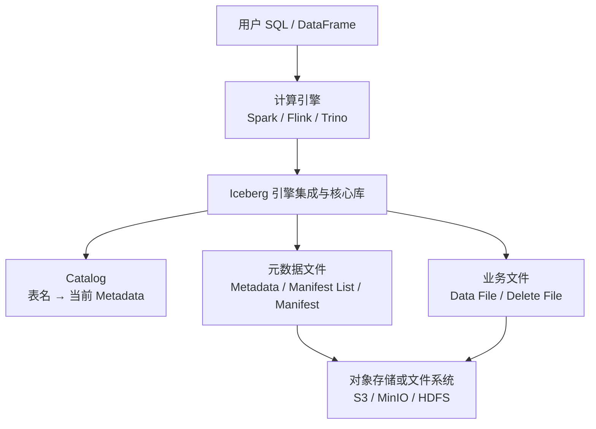
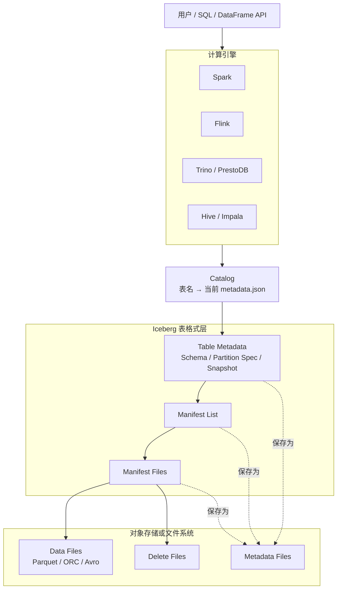

# Iceberg 存储体系入门：从六条订单看懂一张表

> 本文从具体数据出发，先解释 Iceberg 的存储对象和版本变化，最后把这些概念放回完整的大数据架构中。
>
> 暂时不要把 Iceberg 想成一个数据库服务。先把它理解成一套规则：业务数据仍然保存在 Parquet 等文件中，Iceberg 使用一组有版本的元数据文件，准确记录“一张表当前应该读取哪些文件”。

读完本文，需要建立下面这条最基础的路径：

```text
表名
  → Catalog 中的当前元数据地址
  → Table Metadata
  → Snapshot
  → Manifest List
  → Manifest
  → Data File / Delete File
```

## 一、先从六条订单开始

假设我们要保存一张订单表 `sales.orders`：

| order_id | user_id | order_time | amount | status |
|---|---|---|---:|---|
| 1001 | U01 | 2026-09-10 09:10:00 | 100 | CREATED |
| 1002 | U02 | 2026-09-10 10:20:00 | 80 | PAID |
| 1003 | U01 | 2026-09-10 11:30:00 | 200 | PAID |
| 1004 | U03 | 2026-09-11 08:15:00 | 50 | CREATED |
| 1005 | U02 | 2026-09-11 09:40:00 | 120 | PAID |
| 1006 | U04 | 2026-09-11 12:00:00 | 300 | PAID |

为了方便按日期过滤，表采用 `day(order_time)` 分区。计算引擎写入时可能生成两个 Parquet 文件：

```text
F1.parquet
├── 1001
├── 1002
└── 1003

F2.parquet
├── 1004
├── 1005
└── 1006
```

`F1.parquet` 和 `F2.parquet` 才保存真正的订单字段和值，因此它们叫 **Data File**。

但只有这两个文件还不够。系统仍然无法可靠回答：

- `sales.orders` 当前到底包含 F1、F2，还是目录里的所有 Parquet 文件？
- F2 是已经提交成功的文件，还是某次失败任务留下的半成品？
- 订单 1003 被删除后，读数据时是否还应该读取它？
- 昨天的表和今天的表分别包含哪些文件？
- 表结构或分区规则变化后，旧文件应该怎样解释？

Iceberg 的存储体系就是为回答这些问题建立的。

## 二、Parquet 管一个文件，Iceberg 管一张表

理解 Iceberg 前，必须区分“文件格式”和“表格式”。

| 概念 | 解决的问题 | 示例 |
|---|---|---|
| 文件格式 | 一个文件内部怎样编码列、行组、压缩和统计信息 | Parquet、ORC、Avro |
| 表格式 | 大量文件怎样组成一张有版本、可并发修改的表 | Iceberg |

Parquet 能告诉读取程序：

```text
F1.parquet 中有哪些列、行组和数据
```

Iceberg 能告诉读取程序：

```text
sales.orders 当前版本应该读取 F1.parquet 和 F2.parquet
```

所以二者不是竞争关系，而是上下层关系：

```text
Iceberg 表
└── 管理许多 Data File
    └── Data File 通常使用 Parquet 保存业务数据
```

## 三、先看一张表在存储中的样子

下面是一种便于理解的示意目录。真实文件名通常包含 UUID，路径也会受写入引擎和配置影响，不能依赖文件名猜测表状态。

```text
warehouse/
└── sales.db/
    └── orders/
        ├── data/
        │   ├── F1.parquet
        │   ├── F2.parquet
        │   ├── F3.parquet
        │   └── D1.parquet
        │
        └── metadata/
            ├── v1.metadata.json
            ├── v2.metadata.json
            ├── v3.metadata.json
            ├── snap-101.avro
            ├── snap-102.avro
            ├── snap-103.avro
            ├── manifest-A.avro
            ├── manifest-B.avro
            └── manifest-D.avro
```

不要把这个目录树误认为 Iceberg 的逻辑层级。Iceberg 真正依靠的是文件内容中的引用关系：

```text
Catalog
  │ 当前指向
  ▼
v3.metadata.json
  ├── current-snapshot-id = 103
  │
  └── snapshots 数组中的 Snapshot 103 记录
        │ manifest-list 字段保存文件路径
        ▼
      snap-103.avro（Manifest List 文件）
        │ 列出
        ├── manifest-A.avro ──→ F1.parquet、F2.parquet
        ├── manifest-B.avro ──→ F3.parquet
        └── manifest-D.avro ──→ D1.parquet
```

这里的 Snapshot 不是一个名为 `Snapshot 103` 的独立文件，而是 `v3.metadata.json` 中的一条 JSON 记录。它的 `manifest-list` 字段指向 `snap-103.avro`。虽然该文件名包含 `snap`，但它实际是 Manifest List 文件。

简化后的 JSON 关系如下：

```json
{
  "current-snapshot-id": 103,
  "snapshots": [
    {
      "snapshot-id": 103,
      "parent-snapshot-id": 102,
      "manifest-list": "s3://warehouse/sales/orders/metadata/snap-103.avro"
    }
  ]
}
```

即使 Data File 和元数据文件放在不同存储路径，只要引用有效，也可以组成同一张表。因此 Iceberg 表更像一张由元数据指针连接起来的图，而不是“某个目录下所有文件的集合”。

## 四、沿存储链逐层认识概念

### 4.1 Data File：保存业务数据

Data File 保存订单、用户、日志等真实业务记录，通常采用 Parquet，也可以采用 ORC 或 Avro。

在示例中：

| 文件 | 分区值 | 行数 | 订单范围 |
|---|---|---:|---|
| F1.parquet | `day=2026-09-10` | 3 | 1001～1003 |
| F2.parquet | `day=2026-09-11` | 3 | 1004～1006 |

Iceberg 通常把已经提交的数据文件视为不可变文件。追加数据时生成新文件；更新和删除可以重写受影响的数据文件，也可以额外生成 Delete File。这样更适合对象存储和分布式并发写入。

### 4.2 Delete File：说明哪些行不再有效

假设需要删除订单 1003。Merge-on-Read 模式下，可以不马上重写 F1，而是生成一个 Delete File：

```text
D1.parquet
└── 删除 F1.parquet 中 position = 2 的记录
```

读取时，引擎先读取 F1，再根据 D1 过滤订单 1003：

```text
F1 中的 1001、1002、1003
        +
D1 指定删除 1003
        ↓
查询结果只有 1001、1002
```

常见 Delete File 有两种：

- **Position Delete**：通过“数据文件路径 + 行位置”指出要删除哪一行；
- **Equality Delete**：通过字段值指出要删除哪些行，例如 `order_id = 1003`。

Delete File 是对 Data File 的删除说明，不是完整的新表副本。

### 4.3 Manifest File：一批文件的清单

如果一张表有数百万个 Data File，Table Metadata 不适合直接保存每个文件的信息。Iceberg 把文件条目分组保存在 **Manifest File** 中。

一个简化的 `manifest-A.avro` 可以想象成：

| 文件路径 | 文件类型 | 分区值 | record_count | order_id 下界 | order_id 上界 |
|---|---|---|---:|---:|---:|
| F1.parquet | DATA | 2026-09-10 | 3 | 1001 | 1003 |
| F2.parquet | DATA | 2026-09-11 | 3 | 1004 | 1006 |

Manifest 不保存订单明细，只保存文件级信息，例如：

- Data File 或 Delete File 的路径；
- 文件所属分区及分区值；
- 文件大小和记录数；
- 列的空值数、下界、上界等统计；
- 文件在某次提交中是新增、已有还是删除。

因此，Manifest 可以理解成 **Data File 和 Delete File 的文件级索引**。查询 `order_id = 9000` 时，如果某文件的范围只有 1001～1003，就可以不读取那个数据文件。

### 4.4 Manifest List：一个 Snapshot 使用哪些 Manifest

Manifest 仍然可能很多，所以 Snapshot 不直接展开所有 Manifest Entry，而是通过一个 **Manifest List** 列出本版本需要使用的 Manifest。

```text
Snapshot 102
└── Manifest List：snap-102.avro
    ├── manifest-A.avro
    └── manifest-B.avro
```

Manifest List 还保存每个 Manifest 的分区范围、数据文件数量、Delete File 数量等概要信息。查询规划时，可以先排除整个无关 Manifest，再进入 Manifest 内筛选文件。

可以这样记：

```text
Manifest List：清单的清单
Manifest：数据文件和删除文件的清单
```

### 4.5 Snapshot：一次提交后的表版本

Snapshot 表示一次成功提交后得到的表状态。它最重要的信息是：

- 自己的 Snapshot ID；
- 父 Snapshot ID；
- 对应的 Manifest List；
- 本次是 append、overwrite、delete 还是 replace；
- 本次增加或删除了多少文件和记录。

Snapshot 并不复制所有数据。两个版本可以复用没有变化的 Manifest 和 Data File：

```text
Snapshot 101 ──→ manifest-A ──→ F1、F2

Snapshot 102 ──→ manifest-A ──→ F1、F2   （继续复用）
             └─→ manifest-B ──→ F3       （本次新增）
```

这就是 Iceberg 能保留多个表版本，却不需要每次复制整张表的原因。

### 4.6 Table Metadata：描述整张表

Table Metadata 通常是 JSON 文件，它是进入某个表版本的元数据入口，主要记录：

- Schema：有哪些列、字段 ID 和类型；
- Partition Spec：怎样从业务字段计算分区值；
- Sort Order：数据期望按什么顺序组织；
- Table Properties：表级配置；
- Snapshot 历史；
- Current Snapshot ID：当前版本是哪一个；
- 各 Snapshot 对应的 Manifest List 地址。

每次成功修改表时，通常会生成新的 Metadata 文件，而不是覆盖旧文件：

```text
v1.metadata.json → 当前 Snapshot 101
v2.metadata.json → 当前 Snapshot 102
v3.metadata.json → 当前 Snapshot 103
```

旧 Metadata 和旧 Snapshot 在过期清理前仍可能被时间旅行查询使用。

### 4.7 Catalog：保存表名的当前入口

用户查询的是 `sales.orders`，而不是某个 `metadata.json` 路径。因此还需要 **Catalog** 完成映射：

```text
sales.orders
    ↓ Catalog 查找
s3://warehouse/sales.db/orders/metadata/v3.metadata.json
```

Catalog 最关键的职责不是保存全部文件清单，而是：

1. 根据 namespace 和表名定位当前 Table Metadata；
2. 提交时原子地把当前指针从旧 Metadata 切换到新 Metadata；
3. 在并发写入时判断 Writer 基于的旧指针是否仍然有效。

不同部署可以选择不同 Catalog 实现，例如 REST Catalog、Hive Metastore Catalog、JDBC Catalog、Hadoop Catalog 或 Nessie Catalog。它们的持久化和并发能力不同，但对 Iceberg 表都承担“找到当前 Metadata”的入口职责。

## 五、用三次提交看懂版本怎样变化

### 5.1 第一次提交：创建表并写入六条订单

Writer 生成 F1、F2，并构造第一套元数据：

```text
Catalog: sales.orders → v1.metadata.json
                         └── Snapshot 101
                             └── snap-101.avro
                                 └── manifest-A.avro
                                     ├── F1.parquet
                                     └── F2.parquet
```

Catalog 指针切换成功后，F1、F2 才正式属于当前表。文件已经上传但指针提交失败时，文件不会自动成为表数据。

### 5.2 第二次提交：追加订单 1007

新的订单不需要修改 F1、F2，而是写入 F3：

```text
F3.parquet
└── 1007 | U05 | 2026-09-12 08:00:00 | 60 | PAID
```

随后生成 Snapshot 102 和新的 Metadata：

```text
Catalog: sales.orders → v2.metadata.json
                         └── Snapshot 102
                             └── snap-102.avro
                                 ├── manifest-A.avro → F1、F2
                                 └── manifest-B.avro → F3
```

Snapshot 102 复用了旧的 manifest-A、F1 和 F2，只增加了描述 F3 的新元数据。

### 5.3 第三次提交：删除订单 1003

采用 Merge-on-Read 时，Writer 生成 D1，而不立刻重写 F1：

```text
Catalog: sales.orders → v3.metadata.json
                         ├── current-snapshot-id = 103
                         └── Snapshot 103 记录
                             └── manifest-list 字段 → snap-103.avro
                                 ├── manifest-A.avro → F1、F2
                                 ├── manifest-B.avro → F3
                                 └── manifest-D.avro → D1
```

此时：

- 按 Snapshot 101 查询，可以看到最初六条订单；
- 按 Snapshot 102 查询，可以看到追加后的七条订单；
- 按 Snapshot 103 查询，需要应用 D1，最终看不到订单 1003。

这三个 Snapshot 描述的是三个文件集合和读取规则，不是三份完整数据副本。

## 六、一次查询怎样沿存储体系找到数据

执行下面的查询：

```sql
SELECT order_id, amount
FROM sales.orders
WHERE order_time >= TIMESTAMP '2026-09-11 00:00:00'
  AND order_time <  TIMESTAMP '2026-09-12 00:00:00'
  AND order_id = 1005;
```

完整路径可以分为两段。

第一段是 **查询规划**：

```text
1. 计算引擎向 Catalog 查询 sales.orders
2. Catalog 返回当前 v3.metadata.json
3. 读取 Current Snapshot 103
4. 读取 Snapshot 103 的 Manifest List
5. 根据分区范围排除不属于 2026-09-11 的 Manifest
6. 读取剩余 Manifest，根据列统计选出 F2
7. 同时确定是否存在适用于 F2 的 Delete File
8. 生成扫描 F2 的任务
```

第二段是 **数据执行**：

```text
计算引擎的 Task 读取 F2.parquet
        ↓
使用 Parquet 列裁剪，只读取 order_id、amount 等必要列
        ↓
应用 Delete File 和查询条件
        ↓
返回订单 1005
```

Iceberg 负责从元数据中规划“读哪些文件”；真正打开 Parquet、执行过滤和返回结果的仍然是 Spark、Flink 或 Trino 等计算引擎。

## 七、存储体系周围有哪些组件

把一张 Iceberg 表运行起来，通常需要以下组件共同工作：



| 组件 | 它负责什么 | 它不负责什么 |
|---|---|---|
| 计算引擎 | 解析 SQL、生成执行计划、运行并行 Task、读写数据 | 不把所有表数据保存在自己内部 |
| Iceberg 引擎集成 | 把引擎的读写请求转换成 Iceberg 扫描和提交操作 | 不提供独立计算集群 |
| Iceberg 核心库 | 解释 Metadata、Snapshot、Manifest，规划文件并实现提交规则 | 不执行 Spark/Flink 的业务算子 |
| Catalog | 解析表名、定位当前 Metadata、完成原子指针切换 | 通常不保存全部业务数据和文件清单 |
| 对象存储/文件系统 | 持久保存 Data、Delete 和 Metadata 文件 | 不理解哪些文件属于当前 Snapshot |
| Parquet/ORC/Avro Reader | 解码单个物理文件 | 不管理整张表的版本和事务 |

一套常见的开源部署组合是：

```text
Flink 或 Spark              负责计算
Apache Iceberg              负责表格式和读写规则
Iceberg REST Catalog        负责表入口和提交协调
MinIO 或 HDFS               负责保存数据与元数据文件
Parquet                     负责 Data File 内部列式编码
```

组件可以替换，但每层职责仍然存在。例如把 Flink 换成 Trino、把 MinIO 换成 HDFS，并不会改变 Snapshot → Manifest → Data File 这条 Iceberg 存储链。

## 八、最容易混淆的几个边界

### Iceberg 不保存数据吗

更准确的说法是：Iceberg 定义和管理数据怎样以文件形式组成表，但实际字节由对象存储或文件系统持久化。它不像 MySQL Server 那样自己提供磁盘页和常驻查询服务。

### Catalog 是不是数据库中的系统表

作用有些相似，但不能完全等同。Catalog 至少要保存“表名当前指向哪个 Metadata”的可靠映射；Snapshot、Manifest 和大量列统计通常仍然作为文件保存在对象存储中。

### Snapshot 是不是备份

不是。Snapshot 是一个表版本的元数据入口，可以复用旧文件。只有相关文件仍被保留时，它才能用于时间旅行；Snapshot 过期和文件清理后，不能把它当作独立备份恢复。

### 分区是不是目录

不是。Iceberg 把分区规则和分区值记录在元数据中。文件可以按分区组织目录以方便管理，但查询语义不依赖解析目录名，这称为 Hidden Partitioning。

### 对象存储里存在的 Parquet 都属于表吗

不是。只有当前 Snapshot 通过 Manifest 引用的文件才属于当前表状态。写入失败留下的文件可能存在于存储中，却对查询不可见，这类文件称为 Orphan File。

## 九、术语速查表

| 术语 | 初学时可以怎样理解 |
|---|---|
| Record / Row | 一条订单等业务记录 |
| Data File | 保存多条业务记录的 Parquet/ORC/Avro 文件 |
| Delete File | 记录哪些 Data File 行应被过滤的文件 |
| Manifest Entry | 对一个 Data File 或 Delete File 的描述 |
| Manifest File | 一批文件条目的清单和文件级统计索引 |
| Manifest List | 一个 Snapshot 使用的 Manifest 清单 |
| Snapshot | 一次成功提交形成的表版本 |
| Table Metadata | 保存 Schema、分区规则、快照历史和当前 Snapshot 的表入口文件 |
| Catalog | 把表名映射到当前 Table Metadata，并原子切换该指针 |
| Schema | 列名、字段 ID、类型及是否允许为空 |
| Partition Spec | 从业务列推导分区值的规则，例如 `day(order_time)` |
| Sort Order | 建议数据文件内部怎样排序的元数据规则 |
| Commit | 生成新文件和新元数据后，让 Catalog 原子切换当前指针 |
| Time Travel | 指定旧 Snapshot 读取历史表版本 |
| Orphan File | 已存在于存储中，但没有被有效表元数据引用的文件 |

## 十、从整体架构回看 Iceberg

理解前面的存储对象后，再看 Iceberg 在完整系统中的位置：



各层职责可以归纳为：

| 层 | 负责什么 | 不负责什么 |
|---|---|---|
| 计算引擎 | 解析 SQL、优化计划、运行 Task、读写文件 | 不定义 Iceberg 表的当前状态 |
| Catalog | 根据表名定位当前 Table Metadata，并原子切换元数据指针 | 通常不保存全部数据文件列表 |
| Iceberg 表格式 | 定义 Metadata、Snapshot、Manifest、提交和演进规则 | 不调度计算资源 |
| 对象存储或文件系统 | 持久保存数据文件和元数据文件 | 不理解表的事务和版本语义 |

所以，“用 Spark 或 Flink 读取 Iceberg”并不是把数据交给 Iceberg 服务计算，而是计算引擎按照 Iceberg 元数据找到当前 Snapshot 中的文件，再由自己的 Task 读取 Parquet、ORC 或 Avro。

读完整篇文章后，应该抓住四点：

1. **数据和表不是同一层**：Parquet 保存记录，Iceberg 元数据定义哪些文件构成表。
2. **目录不是事实来源**：当前 Snapshot 的引用集合才是当前表状态。
3. **Snapshot 不是数据副本**：它是一次提交后元数据树的版本入口，可以复用旧文件。
4. **Catalog 提交决定可见性**：新文件先写入，最后原子切换 Metadata 指针；切换成功后，新版本才对后续查询可见。

最终把 Iceberg 记成两部分即可：

```text
底部：Data File / Delete File 保存业务数据及删除信息
上部：Manifest / Snapshot / Metadata / Catalog 组织版本和引用关系
```

下一篇 `002_元数据树与查询规划.md` 会继续深入 Manifest Entry、隐藏分区、字段 ID、文件剪枝和 Scan Task。

## 参考资料

- [Apache Iceberg Documentation](https://iceberg.apache.org/docs/latest/)
- [Apache Iceberg Table Specification](https://iceberg.apache.org/spec/)
