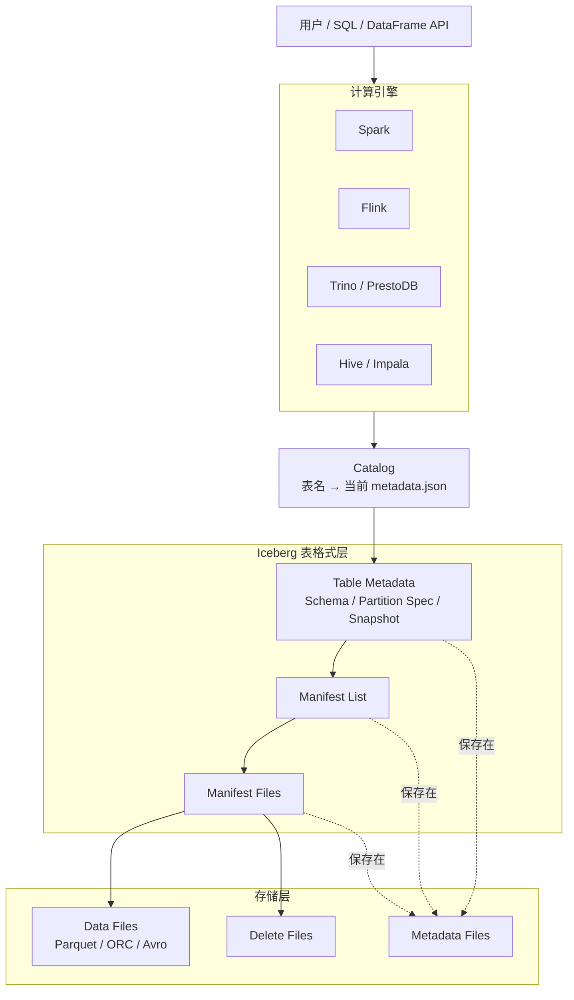
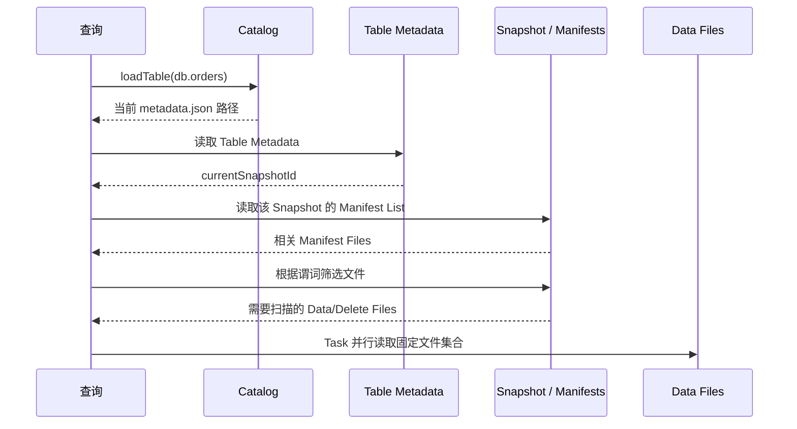

# Iceberg 整体架构与表格式

> 本文先回答三个问题：Iceberg 是什么、它位于大数据架构的哪一层、一次读写为什么能够获得一致的表视图。
>
> 元数据树和查询剪枝放在 002 文档；提交事务、并发写和行级更新放在 003 文档。

Apache Iceberg 是面向大规模分析数据集的开放表格式。它不负责执行 SQL，也不提供分布式存储，而是规定：

> 一张表有哪些数据文件、这些文件属于哪个版本、怎样安全地提交新版本，以及计算引擎怎样找到需要读取的文件。

## 一、Iceberg 在大数据架构中的位置



这套结构中，各层职责不同：

| 层 | 负责什么 | 不负责什么 |
|---|---|---|
| 计算引擎 | 解析 SQL、优化计划、运行 Task、读写文件 | 不定义 Iceberg 表状态 |
| Catalog | 根据表名定位当前表元数据，并原子地切换元数据指针 | 通常不保存全部数据文件列表 |
| Iceberg 表格式 | 定义元数据、快照、清单、提交和演进规则 | 不调度计算资源 |
| 对象存储或文件系统 | 持久化数据文件和元数据文件 | 不理解表的事务语义 |

所以，“用 Spark 读取 Iceberg”不是 Spark 把数据交给 Iceberg 计算，而是 Spark 按 Iceberg 规范找到当前快照中的文件，再由 Spark Task 读取 Parquet、ORC 或 Avro。

---

## 二、为什么仅有 Parquet 还不是一张可靠的表

Parquet 规定一个文件内部怎样按列编码数据，但它不回答：

1. 某个目录中哪些文件属于表；
2. 一次写入产生的 100 个文件是否已经全部提交；
3. 删除或更新过的行怎样表示；
4. 表结构改变后，旧文件怎样解释；
5. 两个 Writer 同时提交时，谁可以成功；
6. 昨天某个时刻的表包含哪些文件。

传统 Hive 风格的表通常依赖“目录就是分区、目录中的文件就是数据”。查询计划需要列举目录和文件，写入过程中也可能短暂出现部分新文件、部分旧文件。

Iceberg 改变了表状态的来源：

```text
传统目录表
表状态 ≈ Metastore 中的分区 + 文件系统 list 得到的文件

Iceberg 表
表状态 = 当前 metadata.json 指向的 Snapshot 所引用的文件集合
```

没有被当前有效快照引用的文件，即使已经上传到对象存储，也不是已提交的数据。

---

## 三、一张 Iceberg 表由什么组成

```text
Catalog 中的表名
    ↓
当前 table metadata 文件
    ├─ 当前 schema
    ├─ 当前 partition spec
    ├─ 当前 sort order
    ├─ table properties
    ├─ snapshot log / metadata log
    └─ current snapshot id
            ↓
        Snapshot
            ↓
        Manifest List
            ↓
        Manifest Files
            ├─ Data File A
            ├─ Data File B
            └─ Delete File C
```

### 3.1 Data File

Data File 保存实际业务记录，常见格式是 Parquet、ORC 和 Avro。Iceberg 不要求所有文件采用同一种物理格式，但生产表通常会统一格式，便于执行引擎优化。

### 3.2 Delete File

在 Merge-on-Read 模式中，删除不一定立即重写原数据文件，而可以记录在 Delete File 中。读取时，引擎把 Data File 与适用的 Delete File 合并，过滤已删除的行。

### 3.3 Manifest File

Manifest 是一批 Data File 或 Delete File 的清单。除了文件路径，它还保存：

- 文件属于哪个 partition spec；
- 文件的分区值；
- record 数、文件大小；
- 各列的 null count、value count、lower bound、upper bound 等统计；
- 文件在某次快照中是 added、existing 还是 deleted。

它不是业务数据索引，而是文件级元数据索引。

### 3.4 Manifest List

一个 Snapshot 使用 Manifest List 列出自己包含的 manifests。Manifest List 还带有每个 manifest 的分区范围和文件计数，因此查询可以先排除无关 manifest，再进入下一层筛选文件。

### 3.5 Snapshot

Snapshot 表示某次原子提交之后的表版本。它记录：

- snapshot id；
- parent snapshot id；
- sequence number；
- 操作类型与 summary；
- 本次表状态对应的 Manifest List。

Snapshot 不是数据文件的完整复制。新快照可以复用旧快照中的 manifests 和数据文件，只记录发生变化的部分。

### 3.6 Table Metadata

Table Metadata 是整张表的入口，包括 schema、分区规则、排序规则、属性、快照历史和当前快照指针。每次成功提交会生成新的 metadata 文件，然后由 Catalog 把表的当前指针原子切换到新文件。

---

## 四、一次读取怎样获得一致视图



查询开始规划时先选择一个 Snapshot，后续始终围绕这个 Snapshot 计划文件。即使此时另一个作业提交了新快照，已经开始的查询仍可读取原快照，因此不会看到“提交到一半”的表。

这就是快照隔离的直观含义：

> Reader 读取一个稳定版本；Writer 构造一个新版本；只有最后的元数据指针切换决定新版本是否对后续 Reader 可见。

---

## 五、一次追加写怎样产生新版本

假设 Snapshot 10 已经包含 A、B 两个数据文件，现在一个 Writer 追加 C、D：

```text
旧状态
Snapshot 10 → Manifest M1 → A, B

Writer 先生成
Data Files: C, D
Manifest M2: C, D
Manifest List L11: M1, M2
Snapshot 11: parent = 10, manifest-list = L11
Metadata v11: current-snapshot = 11

最后提交
Catalog: metadata-v10.json → metadata-v11.json
```

提交前，C、D 虽然已经存在于存储中，但 Reader 仍从旧 metadata 找到 Snapshot 10，只看到 A、B。Catalog 指针切换成功后，新 Reader 才看到 A、B、C、D。

如果最后提交失败，C、D 可能成为 orphan files，不能因为它们存在就把它们当成表数据；后续要由孤儿文件清理任务处理。

---

## 六、Iceberg 解决的核心问题

### 6.1 原子提交

一次写入产生许多数据和元数据文件，但表状态只通过一次原子指针更新生效。Reader 要么看到旧快照，要么看到新快照，不会看到中间状态。

### 6.2 乐观并发

多个 Writer 可以基于同一个旧快照工作。提交时检查基线是否仍有效：

- 兼容的 append 通常可以刷新基线并重试；
- rewrite、overwrite、delete 等操作必须验证目标文件或目标数据范围没有被冲突修改；
- 验证失败时中止，而不是静默覆盖另一个 Writer 的结果。

### 6.3 可回溯的版本历史

只要 Snapshot 尚未过期，就可以进行 time travel、检查变更或回滚。快照历史不是无限保留的备份；过期策略会决定历史还能保留多久。

### 6.4 不依赖目录列举

文件集合来自 manifests，不需要递归列举每个分区目录。这既降低大表查询规划成本，也避开对象存储目录列举一致性和 rename 的问题。

### 6.5 Schema 与 Partition Evolution

Iceberg 使用稳定 field id 识别列，并把分区规则作为有版本的元数据。改列名或调整分区策略时，通常不需要立即重写旧文件。

---

## 七、最容易混淆的关系

### 7.1 Iceberg 不是数据库

Iceberg 是表格式。Catalog、对象存储和计算引擎组合起来，才形成用户实际使用的数据平台。

### 7.2 Iceberg 不是文件格式

Parquet 描述单个文件内部布局；Iceberg 描述许多文件怎样组成一张支持事务和演进的表。二者是上下层关系，不是替代关系。

### 7.3 Catalog 不是全部元数据

Catalog 最关键的职责是从表名定位当前 Table Metadata，并提供可靠的原子提交能力。大量快照、清单和列统计仍以文件形式保存在存储中。

### 7.4 Snapshot 不是一份数据副本

Snapshot 是一棵持久化元数据树的根。不同 Snapshot 可以复用绝大多数未变化的数据文件和 manifests，因此创建快照不等于复制整张表。

### 7.5 分区不是目录约定

Iceberg 可以把分区值存进元数据，物理路径无需成为查询语义的一部分。用户按业务列写谓词，Iceberg 再根据当前和历史 partition spec 推导文件剪枝条件。

---

## 八、从 Spark 与 Flink 理解 Iceberg

Spark 更常用于批量建表、回填、MERGE、表维护和交互分析；Flink 更常用于持续写入、CDC 和流式增量处理。它们共享同一张 Iceberg 表，但运行模型不同：

```text
Spark / Flink / Trino
        ↓ 共同理解 Iceberg 规范
Catalog + Table Metadata
        ↓
同一组 Snapshot / Manifest / Data Files
```

开放表格式的价值就在这里：数据和表语义不被绑定在单一计算引擎中。不过“规范支持”不代表每个引擎在每个版本上都支持相同功能，尤其是 row-level delete、branch、format v3 等能力，落地时必须核对引擎兼容矩阵。

---

## 九、最终心智模型

可以用一句话记住 Iceberg：

> Iceberg 用一棵可版本化的元数据树，精确声明每个表快照包含哪些文件，再用 Catalog 的原子指针切换提交新版本。

读路径是：

```text
表名 → 当前 Metadata → Snapshot → Manifest List → Manifest → Data/Delete Files
```

写路径是：

```text
生成文件 → 构造新元数据树 → 校验并发冲突 → 原子切换 Catalog 指针
```

理解这两条路径之后，隐藏分区、时间旅行、Schema Evolution、行级更新、并发提交和维护任务就不再是互不相关的功能，而是同一个快照模型的自然结果。

## 十、参考资料

- [Apache Iceberg Documentation](https://iceberg.apache.org/docs/latest/)
- [Apache Iceberg Table Specification](https://iceberg.apache.org/spec/)
- [Apache Iceberg Reliability](https://iceberg.apache.org/docs/latest/reliability/)
- [Apache Iceberg Performance](https://iceberg.apache.org/docs/latest/performance/)

