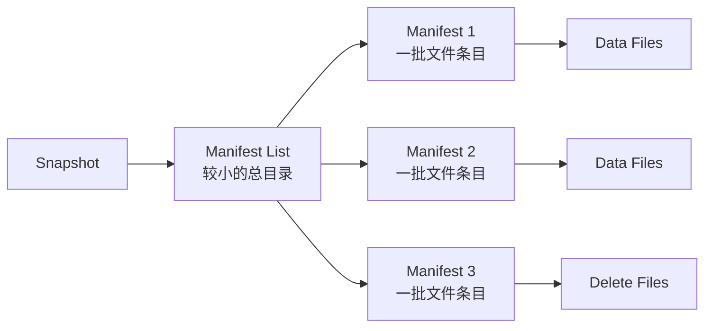

# Iceberg 元数据树与查询规划

> 本文沿一条主线说明：SQL 谓词怎样从业务列逐层下推，经过 Manifest List 和 Manifest File，最终变成一组要由计算引擎扫描的 Data Files。
>
> Iceberg 的核心性能优势不在于“让 Parquet 读取本身更快”，而在于读取前尽量证明哪些文件不可能包含结果。

## 一、先看完整查询流程

```text
SELECT * FROM orders
WHERE event_time >= '2026-09-01'
  AND user_id = 42
        ↓
计算引擎解析 SQL，得到过滤表达式
        ↓
Catalog 定位当前 Table Metadata
        ↓
选择当前 Snapshot 或指定的历史 Snapshot
        ↓
读取 Manifest List
        ↓
用分区范围过滤 Manifest Files
        ↓
读取候选 Manifest Files
        ↓
用分区值和列统计过滤 Data Files
        ↓
为剩余文件生成 Scan Tasks
        ↓
Executor / Worker 读取 Parquet、ORC 或 Avro
        ↓
文件内部 row group / stripe 再次剪枝
        ↓
逐行应用残余谓词并合并 Delete Files
```

需要分清四层过滤：

| 层次 | 使用的信息 | 排除什么 |
|---|---|---|
| Manifest List | manifest 的分区范围、文件计数 | 整个 Manifest File |
| Manifest File | 每个文件的分区值、列级统计 | 整个 Data File |
| 列式文件内部 | row group / stripe 统计、字典等 | 文件内部数据块 |
| 执行引擎 | residual predicate | 最终不匹配的记录 |

前两层来自 Iceberg，第三层来自 Parquet/ORC，第四层由计算引擎执行。

---

## 二、为什么元数据要分成多层

如果 Snapshot 直接列出数百万个 Data File，每次读取一个 Snapshot 都要解析巨大的文件清单。Iceberg 使用分层结构：



Manifest List 像 manifests 的一级索引，Manifest File 像数据文件的二级索引。查询不必读取所有 manifests，更不必 list 所有数据目录。

这也让新快照可以复用旧元数据：追加少量数据时，只需要增加新的 manifest，并在新 Manifest List 中同时引用旧 manifest 和新 manifest。

---

## 三、Manifest Entry 描述一个文件

可以把 Manifest 中的一个条目概念化为：

```text
ManifestEntry
├─ status: ADDED / EXISTING / DELETED
├─ snapshot_id
├─ sequence_number
└─ data_file
   ├─ content: DATA / POSITION_DELETES / EQUALITY_DELETES
   ├─ file_path
   ├─ file_format
   ├─ partition
   ├─ record_count
   ├─ file_size_in_bytes
   ├─ value_counts
   ├─ null_value_counts
   ├─ nan_value_counts
   ├─ lower_bounds
   └─ upper_bounds
```

`lower_bounds` 和 `upper_bounds` 不是全局索引，也不能证明某个值一定存在。它们只能帮助证明某文件不可能匹配：

```text
查询：price > 100

File A: lower=1, upper=50    → 一定不匹配，可跳过
File B: lower=20, upper=200  → 可能匹配，需要读取
```

因此 Iceberg 的 metadata filtering 通常是保守的：可以安全排除就排除，无法证明时就读取，不能为了性能漏掉结果。

---

## 四、隐藏分区怎样参与查询规划

假设表按 `days(event_time)` 分区：

```sql
CREATE TABLE prod.db.events (
    event_id BIGINT,
    event_time TIMESTAMP,
    payload STRING
)
USING iceberg
PARTITIONED BY (days(event_time));
```

用户查询仍然过滤业务列：

```sql
SELECT *
FROM prod.db.events
WHERE event_time >= TIMESTAMP '2026-09-01 00:00:00'
  AND event_time <  TIMESTAMP '2026-09-02 00:00:00';
```

Iceberg 把谓词投影到分区字段：

```text
业务谓词
event_time ∈ [2026-09-01 00:00, 2026-09-02 00:00)
        ↓ days(event_time)
分区谓词
event_day = 2026-09-01
```

用户不需要在 SQL 中同时维护 `event_date` 分区列，也不会因为忘写分区条件而读错语义。分区用于物理剪枝，不侵入业务表结构，这就是 hidden partitioning。

### 4.1 常见 transform

| Transform | 典型用途 | 示例 |
|---|---|---|
| identity | 低基数、天然分区列 | `country` |
| year/month/day/hour | 时间范围查询 | `days(event_time)` |
| bucket(N, col) | 高基数等值查询、分散数据 | `bucket(64, user_id)` |
| truncate(W, col) | 字符串前缀或数值范围 | `truncate(4, category)` |
| void | 分区演进时停用字段 | 不再按旧字段写新数据 |

Bucket 主要帮助等值谓词和数据分布，不天然适合范围查询。分区 transform 也不是排序；同一个 bucket 中的记录仍可能无序。

---

## 五、多套 Partition Spec 怎样共存

假设早期数据量小，按月分区；后期改为按天分区：

```text
Spec 0: months(event_time)
    ├─ 2026-01 的旧文件
    └─ 2026-02 的旧文件

Spec 1: days(event_time)
    ├─ 2026-03-01 的新文件
    └─ 2026-03-02 的新文件
```

Manifest Entry 知道自己使用哪个 `partition_spec_id`。同一个业务谓词会分别投影到每套 spec：

```text
event_time = 2026-03-01 10:00
    ├─ 对 Spec 0 推导 month = 2026-03
    └─ 对 Spec 1 推导 day = 2026-03-01
```

旧文件无需立即搬到新目录或重写。新写入使用新规则，查询规划对新旧布局分别剪枝。这称为 split planning。

分区演进解决的是“从现在开始怎样布局”，不是自动整理历史文件。如果希望历史数据也采用新布局，需要另行执行 rewrite data files。

---

## 六、Schema 中的 field id 为什么重要

传统系统常按列位置或列名解释文件，容易在 rename、drop 后 add 同名列等场景中产生歧义。Iceberg 为每个字段分配稳定 ID：

```text
初始 Schema
1: order_id
2: buyer_name
3: amount

rename buyer_name → customer_name
1: order_id
2: customer_name    # ID 不变
3: amount
```

Reader 按 ID 知道旧文件中的 `buyer_name` 就是新 Schema 的 `customer_name`。如果删除 ID=2，后来新增同名 `customer_name`，新列会获得新的 ID，不会意外读取旧列数据。

嵌套结构的字段也拥有 ID，因此 struct、list、map 内部也能进行受约束的安全演进。

---

## 七、Scan Task 是怎样形成的

经过文件剪枝后，计算引擎还要把文件组织成可执行任务。概念流程是：

```text
候选 Data Files
    ↓ 关联适用的 Delete Files
FileScanTask
    ├─ data file
    ├─ delete files
    ├─ start / length
    └─ residual filter
    ↓ 按目标大小组合
CombinedScanTask
    ↓
Spark partition / Flink split / Trino split
```

一个计算 Task 不一定对应一个 Data File：

- 大文件可以按可切分边界拆成多个 ranges；
- 多个小文件可以组合进一个 Task，减少调度开销；
- 与 Data File 相关的 Delete Files 必须随任务传递；
- residual filter 保留无法由元数据完全证明的条件。

这与 Spark RDD 的 partition 不同。Iceberg partition 是表数据布局概念；Spark partition 是一次计算的并行执行单元；二者可能经过文件切分和组合后形成多对多关系。

---

## 八、为什么小文件会拖慢查询

Iceberg 避免了昂贵的目录递归 list，但并没有消除文件数量成本。大量小文件仍会造成：

- manifests 中条目增多，规划元数据变大；
- 打开对象和建立连接的固定成本放大；
- Scan Task 数量或组合工作增加；
- Parquet row group 太小，压缩和向量化效率下降；
- 流式持续写入产生大量 snapshots 和 manifests。

所以 Iceberg 的高效规划不能代替 compaction。二者解决不同层面：

```text
Manifest 剪枝：少找文件
Data file compaction：让剩余文件大小和布局更适合读取
Manifest rewrite：减少元数据碎片
Snapshot expiration：控制历史元数据和无用文件
```

---

## 九、查询慢时怎样诊断

建议按下面顺序定位：

1. 确认查询锁定的 Snapshot 是否正确，是否误用了过旧 branch/tag；
2. 查看过滤条件能否转换成 Iceberg 表达式并下推；
3. 检查 partition spec 是否匹配主要查询模式；
4. 统计计划后的 Data File 数量、总字节数和平均文件大小；
5. 检查列统计是否存在，边界是否足以剪枝；
6. 检查 Data File 是否在高频过滤列上聚簇或排序；
7. 检查 Delete Files 数量，尤其是同一 Data File 关联多个 deletes；
8. 再分析计算引擎内部的 Join、Shuffle、并行度和资源问题。

如果 SQL 最终只需要一天数据，但 Iceberg 规划出了全表文件，首先是分区、谓词下推或统计问题；如果只规划出少量合理文件但 Task 仍慢，才更可能是文件内部布局、Delete 合并或执行引擎问题。

---

## 十、常见误解

### Manifest 就是分区目录

Manifest 可以同时描述不同物理路径下的文件，也携带列级统计和文件状态。它比目录列表表达的信息更多。

### 有分区就不需要列统计

分区先做粗粒度剪枝，列统计可以在分区内部继续排除文件。两者互补。

### Hidden Partitioning 表示没有分区

分区依然存在，只是不要求用户把物理分区字段写进业务查询。

### 改 Partition Spec 会自动重写历史数据

Partition Evolution 是元数据变更。旧数据继续使用旧 spec，除非额外执行文件重写。

### Iceberg 能完全避免全表扫描

只有谓词、分区和统计能够证明文件不匹配时才可安全跳过。如果数据布局与查询条件没有相关性，仍可能扫描大量文件。

---

## 十一、最终心智模型

查询规划不是直接从表名跳到数据目录，而是一次逐层缩小候选集合的过程：

```text
Snapshot
  → 通过 Manifest List 排除 manifests
  → 通过 Manifest 排除 data files
  → 通过列式文件统计排除 row groups / stripes
  → 通过 residual filter 得到最终记录
```

Iceberg 的价值是把“本 Snapshot 中有哪些文件”以及“这些文件大致包含什么值”保存为可靠、可版本化的元数据，使查询规划不依赖昂贵且不稳定的目录列举。

## 十二、参考资料

- [Apache Iceberg Performance](https://iceberg.apache.org/docs/latest/performance/)
- [Apache Iceberg Partitioning](https://iceberg.apache.org/docs/latest/partitioning/)
- [Apache Iceberg Evolution](https://iceberg.apache.org/docs/latest/evolution/)
- [Apache Iceberg Table Specification: Manifests](https://iceberg.apache.org/spec/#manifests)

