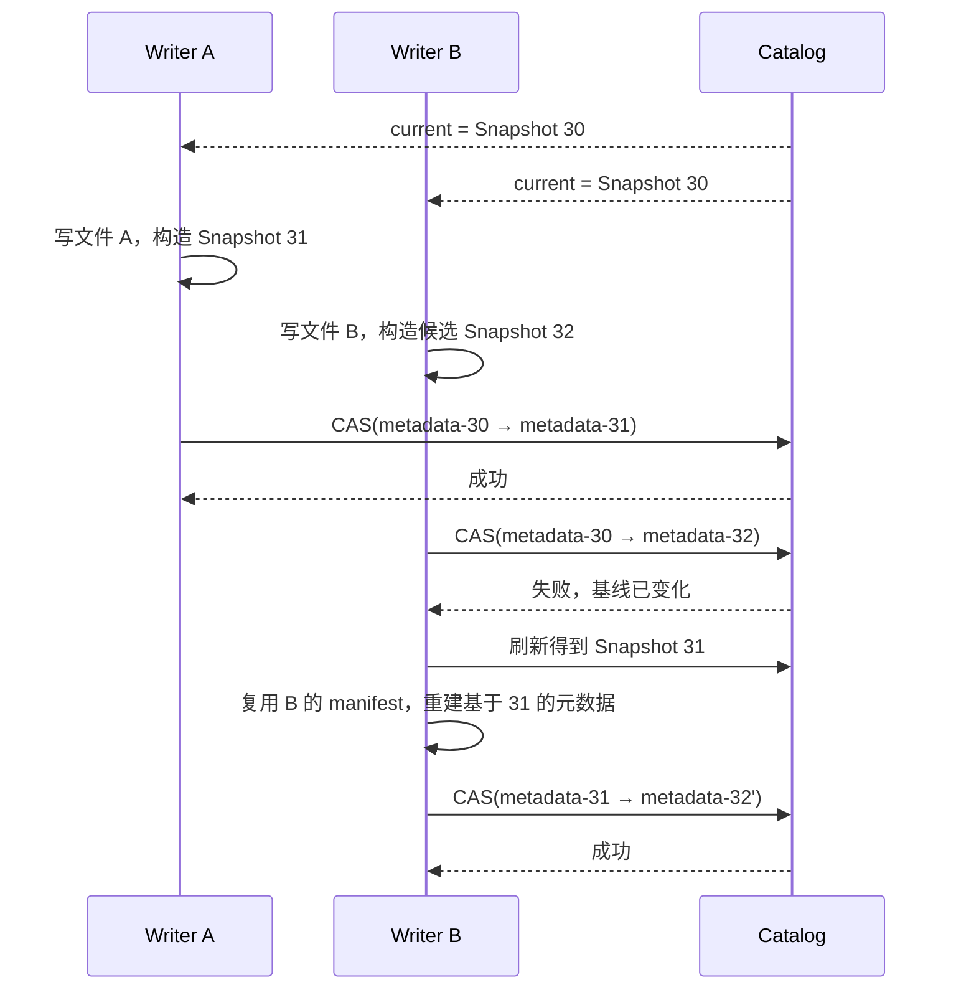
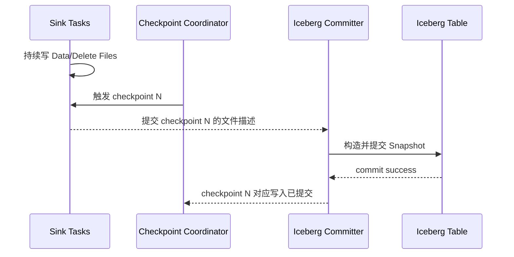

# Iceberg 写入事务与行级更新

> 本文从一个 Writer 生成 Data Files 开始，解释 Snapshot 提交、乐观并发、冲突验证、Copy-on-Write、Merge-on-Read 和 Delete Files。
>
> 需要先建立一个前提：文件写成功不等于表提交成功。Iceberg 事务的最终结果由 Catalog 中的元数据指针决定。

## 一、先看完整写入流程

```text
计算引擎规划写任务
        ↓
Worker / Executor 并行写 Data Files
        ↓
各 Task 向 Driver / Coordinator 返回文件元数据
        ↓
Coordinator 汇总 DataFile / DeleteFile 描述
        ↓
生成 Manifest Files
        ↓
生成 Manifest List 和新 Snapshot
        ↓
基于旧 Table Metadata 构造新 Metadata
        ↓
验证并发修改是否兼容
        ↓
Catalog compare-and-swap / 原子提交
        ├─ 成功：新 Snapshot 对后续 Reader 可见
        └─ 失败：刷新基线，能安全重试则重试，否则报冲突
```

Task 通常直接把不可变文件写到最终存储位置，不依赖先写临时目录再 rename 整张表。真正使这些文件成为表状态一部分的是最后一次元数据提交。

---

## 二、为什么数据文件要不可变

Iceberg 的 Data File 通常按不可变对象处理。更新表不是在原 Parquet 文件中修改几个字节，而是增加或替换文件引用：

```text
Snapshot 20
Manifest M1 → A.parquet, B.parquet

更新 B 中部分记录后
Snapshot 21
Manifest M1' → A.parquet, B2.parquet
                B.parquet 标记为 deleted
```

不可变文件带来几个结果：

- Reader 读取旧 Snapshot 时，旧文件内容不会被 Writer 改到一半；
- 新旧 Snapshot 可以复用未变化文件；
- 提交只需原子替换元数据入口，而不必跨许多数据文件做分布式事务；
- 失败写入最多留下未引用文件，不会让当前快照进入半完成状态。

代价是 UPDATE、DELETE 和小批量持续写入可能产生文件放大、Delete Files 或小文件，因此需要后台维护。

---

## 三、Append 是怎样提交的

假设两个 Writer 都从 Snapshot 30 开始：



Append 通常容易合并，因为 Writer A 增加 A、Writer B 增加 B，二者没有删除或覆盖对方读取的数据。重试主要重写少量元数据，而不是重新写全部 Data Files。

这并不意味着所有并发 append 在任何业务语义下都安全。如果上层要求主键唯一、批次只执行一次或严格去重，仍需要依靠写入协议、source offset、业务约束或额外协调保证。

---

## 四、乐观并发包含两层检查

### 4.1 Catalog 指针是否仍指向基线

Writer 提交时比较自己读取的旧 metadata 与 Catalog 当前值。若相同，可以原子替换；若不同，说明已有其他提交。

### 4.2 操作语义是否仍然有效

指针变化不一定意味着必须失败。Writer 刷新表状态后，会根据操作类型验证：

- Append：通常确认新增文件可并入新基线；
- Rewrite Files：确认准备替换的源文件仍在表中；
- Overwrite：确认目标过滤范围没有出现冲突数据；
- Row Delta：确认相关数据文件和删除条件没有发生不兼容变化；
- Schema/Spec 更新：确认元数据变化能够安全合并。

例如 compaction 准备把 A、B 合并为 C：

```text
安全重试条件：A、B 仍然是当前表中的有效文件

如果另一个 Writer 已删除或重写 A：
继续提交 C 会把过期的 A 内容重新带回表中
→ 必须验证失败
```

乐观并发不是“发生冲突也总能成功”，而是：不提前加全局写锁，在提交点检测冲突，只让可证明安全的操作重试。

---

## 五、不同写操作改变什么

| 操作 | 典型变化 | 主要冲突关注点 |
|---|---|---|
| Append | 增加 Data Files | 通常与其他 append 兼容 |
| Dynamic Overwrite | 替换本次输出触及的分区 | 分区规则变化、同范围并发写 |
| Filter Overwrite | 替换匹配过滤条件的数据 | 条件范围内是否有并发变化 |
| Rewrite Files | 删除旧文件、增加等价新文件 | 源文件是否仍有效 |
| Row Delta | 增加 Data/Delete Files | 被修改行和相关文件是否冲突 |
| Replace Table Metadata | 更新 schema/spec/properties 等 | 元数据变更能否合并 |

`INSERT OVERWRITE` 的语义容易受静态/动态覆盖模式和分区演进影响。对于业务主键驱动的更新，Spark 官方文档通常更推荐 `MERGE INTO`，因为它能明确表达匹配条件，并只重写受影响文件。

---

## 六、Copy-on-Write 与 Merge-on-Read

更新和删除有两种核心实现策略。

### 6.1 Copy-on-Write

读取包含目标行的数据文件，过滤或更新记录，再写出替代文件：

```text
UPDATE 命中 File A 中 10 行
        ↓
读取 File A 全部相关数据
        ↓
应用更新
        ↓
写 File A'
        ↓
新 Snapshot 删除 A、增加 A'
```

优点：

- 读路径简单，没有额外 Delete File 合并；
- 适合读多写少、批量修改比例较高的表；
- compaction 压力相对小。

代价：

- 修改少量行也可能重写大文件；
- 写放大明显，更新延迟较高。

### 6.2 Merge-on-Read

保留原 Data File，额外写 Delete File；如果是 UPDATE，再把更新后的新版本作为新记录写入：

```text
原数据：Data File A
删除信息：Delete File D
更新后记录：Data File B

读取结果 = (A - D 命中的行) + B
```

优点：

- 写入只记录变化，适合高频、小比例更新；
- 写延迟和写放大较低。

代价：

- Reader 要合并 deletes，读放大增加；
- Delete Files 会积累，需要定期重写数据文件；
- 规划和内存开销与 delete 数量、匹配关系有关。

两者不是表的永久标签。不同操作可通过表属性选择策略，后台 compaction 也可以把 Merge-on-Read 的状态整理回更适合读取的 Data Files。

---

## 七、Position Delete 与 Equality Delete

### 7.1 Position Delete

Position Delete 用“数据文件路径 + 行位置”标识被删除记录：

```text
s3://warehouse/orders/data-A.parquet, position=108
s3://warehouse/orders/data-A.parquet, position=205
```

特点：

- 定位精确，读取时可直接作用于特定文件；
- 与数据文件物理位置绑定；
- 数据文件被 compaction 重写后，旧 position delete 不能原样套到新文件，需要一并处理。

### 7.2 Equality Delete

Equality Delete 保存一组字段 ID 和匹配值，例如按 `order_id` 删除：

```text
equality fields: [order_id]
values: [10086], [10087]
```

特点：

- 不要求事先知道记录位于哪个文件、哪个 position；
- 适合 CDC 主键撤回和 upsert 语义；
- 读取时要将删除键与候选数据进行匹配，成本可能更高；
- 字段以 Iceberg field id 识别，不只是列名字符串。

具体引擎、Iceberg 版本和 format version 对不同 delete 类型的写入与读取支持不完全相同，部署前必须核对兼容性。

---

## 八、Sequence Number 为什么必要

假设某个 Equality Delete 表示“删除 order_id=42”，之后又插入了一条新的 order_id=42。如果不区分先后顺序，Reader 可能把新插入记录也错误删除。

Iceberg 使用 sequence number 表示数据和删除文件在表历史中的相对次序。概念上：

```text
Data File A      sequence = 10，包含旧 order_id=42
Delete File D    sequence = 11，删除 order_id=42
Data File B      sequence = 12，重新插入 order_id=42

D 应作用于比它旧的相关数据，不应删除 B 中更新的记录
```

实际匹配还要结合 delete 类型、partition、文件范围和规范规则，但核心目的是让跨 Snapshot 的行级变更具有确定顺序。

---

## 九、Spark MERGE INTO 的执行过程

```sql
MERGE INTO prod.db.orders t
USING updates s
ON t.order_id = s.order_id
WHEN MATCHED THEN UPDATE SET *
WHEN NOT MATCHED THEN INSERT *;
```

概念流程：

```text
读取 source updates
        ↓
根据 ON 条件定位 target 中可能匹配的文件
        ↓
Join 并区分 matched / not matched
        ↓
按写模式生成替代 Data Files 或 Delete Files + 新 Data Files
        ↓
构造 Snapshot
        ↓
验证扫描范围内是否发生并发冲突
        ↓
原子提交
```

`MERGE INTO` 不是无需 Shuffle 的主键查找。Iceberg 不是在线 B-Tree 索引；引擎仍需依据分区和文件统计定位候选文件，再完成 Join。主键分布、源数据规模、目标文件布局和匹配条件都会影响执行成本。

还要确保 source 对同一个 target row 不产生多条互相矛盾的更新，否则引擎通常无法确定唯一结果。

---

## 十、Flink 流式写入与 Checkpoint

Flink Sink 通常把写入提交与 checkpoint 协调：



Checkpoint 边界把流式进度与表提交关联起来。失败恢复时，Sink 要避免把同一 checkpoint 的数据重复提交。端到端 exactly-once 仍要求 Source、Flink checkpoint、Iceberg Sink 和外部副作用共同满足协议，不能只看到 Iceberg 原子提交就断言整条链路 exactly-once。

长时间没有成功 checkpoint 时，Task 可能持续产生文件但无法完成可见提交，也会增加恢复和存储压力，因此要监控最近提交时间、checkpoint duration 和失败次数。

---

## 十一、提交失败后文件怎样处理

提交失败可以分为两类：

1. **确定失败**：Catalog 明确拒绝提交，可以重试或中止；
2. **状态未知**：客户端超时，不知道 Catalog 是否已经成功切换指针。

状态未知时不能立刻删除本次文件，因为提交可能已经成功。应先刷新表元数据，检查新 Snapshot 或 commit 标识是否存在，再决定清理。

真正未被任何有效 Snapshot 引用的文件属于 orphan files。删除 orphan files 是独立维护操作，必须设置足够安全的时间窗口，避免把仍在进行中的慢写任务文件误删。

---

## 十二、常见误解

### Data File 上传成功就能被读到

只有成功提交的 Snapshot 引用它之后，文件才属于表状态。

### 乐观并发表示提交永远不冲突

乐观并发允许并行准备工作，在提交时验证。无法证明安全的修改必须失败。

### MERGE 是 Iceberg 自己执行的

Iceberg 提供表扫描、文件写出和事务提交语义；Join、Shuffle 和表达式计算仍由 Spark、Flink 等引擎执行。

### Merge-on-Read 总比 Copy-on-Write 快

它通常写得更轻，但把成本推迟到读取和维护。选择要看更新频率、查询 SLA 和维护能力。

### 原子提交等于业务数据不会重复

原子提交防止表出现半个版本，但业务重复仍可能来自重复消费、错误重放或 source 内重复主键。

---

## 十三、最终心智模型

Iceberg Writer 不直接修改“当前表”，而是：

```text
基于某个 Snapshot 读取和计算
        ↓
生成一组不可变的新文件
        ↓
提出一个新的表版本
        ↓
验证从基线到现在的并发变化
        ↓
原子地把新版本设为 current
```

Copy-on-Write 与 Merge-on-Read 只是在“新文件怎样表达行级变化”上不同，最终都必须进入同一套 Snapshot 和原子提交协议。

## 十四、参考资料

- [Apache Iceberg Reliability](https://iceberg.apache.org/docs/latest/reliability/)
- [Apache Iceberg Spark Writes](https://iceberg.apache.org/docs/latest/spark-writes/)
- [Apache Iceberg Flink Writes](https://iceberg.apache.org/docs/latest/flink-writes/)
- [Apache Iceberg Table Specification](https://iceberg.apache.org/spec/)

