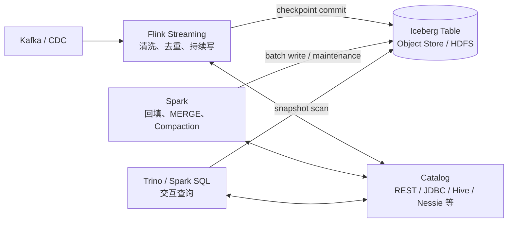

# Iceberg 与 Spark、Flink 实践

> 本文把前四篇的表格式概念落到计算引擎：怎样配置 Catalog、建表、写入、时间旅行、查看元数据，以及怎样设计批流协同链路。
>
> 示例强调执行语义。依赖坐标必须按实际 Spark/Flink、Scala、Java 和 Iceberg 版本从官方兼容文档选择，不能直接混用。

## 一、完整的批流架构



这里没有一个常驻的“Iceberg Server”负责计算：

- Flink 执行流式数据处理并按 checkpoint 提交 Snapshot；
- Spark 执行批量回填、MERGE 和维护 procedure；
- Trino 或 Spark SQL 读取某个稳定 Snapshot；
- Catalog 协调表名、元数据定位和原子提交；
- 对象存储或 HDFS 保存全部数据与元数据文件。

---

## 二、先选择 Catalog

Catalog 决定怎样从表名定位 Table Metadata，以及怎样安全提交新版本。常见选项包括 REST、Hive、Hadoop、JDBC 和具体平台提供的 Catalog。

选择时关注：

| 维度 | 要问的问题 |
|---|---|
| 原子提交 | 多 Writer 下是否提供可靠 compare-and-swap 语义？ |
| 多引擎 | Spark、Flink、Trino 是否都能连接？ |
| 权限 | 是否能与企业身份、表级/列级权限体系集成？ |
| 运维 | 高可用、备份、升级、监控由谁负责？ |
| 对象存储 | Credential vending、签名、跨云访问怎样处理？ |
| 分支能力 | 是否需要 branch/tag 或类似 Git 的数据版本工作流？ |

`HadoopCatalog` 直接按仓库路径管理元数据，适合简单环境；生产多引擎环境更常需要集中式 Catalog。不能把 Catalog 当成可随意替换的连接字符串：不同实现的命名空间、锁、权限和迁移能力不同。

---

## 三、Spark 中加载 Iceberg

典型配置由三部分组成：

```text
1. 与 Spark 版本匹配的 Iceberg runtime 包
2. Spark SQL extensions
3. 一个命名 Catalog 的实现、warehouse 和认证配置
```

概念配置如下：

```properties
spark.sql.extensions=org.apache.iceberg.spark.extensions.IcebergSparkSessionExtensions

spark.sql.catalog.prod=org.apache.iceberg.spark.SparkCatalog
spark.sql.catalog.prod.type=rest
spark.sql.catalog.prod.uri=https://catalog.example.com
spark.sql.catalog.prod.warehouse=s3://lakehouse/warehouse
```

若使用其他 Catalog，实现类和参数会不同。Runtime JAR 的 artifact 名通常包含 Spark 与 Scala 版本，升级 Spark 时必须一起核对。

Extensions 为 Spark SQL 增加或扩展 Iceberg 的 `MERGE INTO`、`CALL`、分支写入等能力。只配置 catalog 而漏掉 extensions，普通读写可能工作，但部分 SQL 会解析失败或走不到 Iceberg 专用实现。

---

## 四、用 Spark SQL 建表

```sql
CREATE TABLE prod.analytics.orders (
    order_id     BIGINT,
    user_id      BIGINT,
    amount       DECIMAL(18, 2),
    status       STRING,
    created_at   TIMESTAMP,
    updated_at   TIMESTAMP
)
USING iceberg
PARTITIONED BY (days(created_at), bucket(32, user_id))
TBLPROPERTIES (
    'format-version' = '2',
    'write.format.default' = 'parquet'
);
```

这里的 `days(created_at)` 和 `bucket(32, user_id)` 是 partition transforms，不要求业务表额外维护 `created_date` 或 `user_bucket` 字段。

不要照抄分区规则到所有表。应先估算：

- 每天写入量；
- 主要查询是否按时间过滤；
- `user_id` 等值过滤是否足够高频；
- 每个分区最终能否形成合理大小的文件；
- 同时打开多少 Writer；
- 未来是否可能调整分区策略。

Format version 要以所有读写引擎都支持为前提。使用 row-level delete 等能力前，尤其要核对版本兼容。

---

## 五、Append、Overwrite 与 MERGE

### 5.1 Append

```sql
INSERT INTO prod.analytics.orders
SELECT order_id, user_id, amount, status, created_at, updated_at
FROM staging.orders_increment;
```

Append 增加新文件，不会自动按主键去重。重复执行相同批次，通常会得到重复数据。生产任务应保存批次标识、source offset 或使用幂等写入设计。

### 5.2 Overwrite

```sql
INSERT OVERWRITE prod.analytics.orders
SELECT * FROM corrected_orders;
```

Overwrite 必须明确静态或动态覆盖语义。动态覆盖由实际输出触及的 partition 决定，Partition Evolution 后其影响范围可能变化。不要把 `INSERT OVERWRITE` 当作天然安全的主键更新。

### 5.3 MERGE INTO

```sql
MERGE INTO prod.analytics.orders AS t
USING staging.order_changes AS s
ON t.order_id = s.order_id
WHEN MATCHED AND s.op = 'D' THEN DELETE
WHEN MATCHED THEN UPDATE SET
    user_id = s.user_id,
    amount = s.amount,
    status = s.status,
    created_at = s.created_at,
    updated_at = s.updated_at
WHEN NOT MATCHED AND s.op <> 'D' THEN INSERT (
    order_id, user_id, amount, status, created_at, updated_at
) VALUES (
    s.order_id, s.user_id, s.amount, s.status, s.created_at, s.updated_at
);
```

在执行 MERGE 前应先保证 source 对 `order_id` 唯一，例如按 CDC sequence 或业务更新时间保留最后一条。否则同一 target row 对应多条 source rows，更新语义不确定。

MERGE 性能主要取决于：

- ON 条件能否缩小 target 文件范围；
- source 是否需要大规模去重或 Shuffle；
- target 是否在主键或相关字段上聚簇；
- 命中比例和选择的 Copy-on-Write / Merge-on-Read 策略；
- 同时运行的在线写和 compaction 是否造成提交冲突。

---

## 六、DataFrameWriterV2

Spark 中应优先使用 V2 写 API 表达按表语义写入：

```python
df.writeTo("prod.analytics.orders").append()
```

创建新表：

```python
from pyspark.sql.functions import days, bucket

df.writeTo("prod.analytics.orders") \
    .using("iceberg") \
    .partitionedBy(days("created_at"), bucket(32, "user_id")) \
    .create()
```

V1 的 `write.format(...).save(path)` 更偏向文件路径写入，容易绕开命名表和 Catalog 语义。操作 Iceberg 生产表时，应以 Catalog 中的完整表名为入口。

---

## 七、时间旅行、Snapshot 与 Branch

### 7.1 按 Snapshot 查询

不同 Spark/Iceberg 版本支持的 SQL 或 DataFrame 语法略有差异，核心语义相同：把本次 scan 固定到一个 snapshot id 或 timestamp。

```sql
SELECT *
FROM prod.analytics.orders
VERSION AS OF 1234567890123456789;
```

```sql
SELECT *
FROM prod.analytics.orders
TIMESTAMP AS OF '2026-09-01 10:00:00';
```

Timestamp travel 选择的是指定时间之前已经提交的 Snapshot，不是按业务列 `created_at` 过滤。

### 7.2 Branch 和 Tag

可以把写入送到审计 branch，验证后再发布。Branch 是独立的 Snapshot 引用，不是复制整张表。生产中要同步设计：

- branch 命名和生命周期；
- 谁能创建、写入和发布；
- validation 失败怎样清理；
- snapshot expiration 怎样保护仍被 refs 引用的版本。

---

## 八、先学会查询 Metadata Tables

Metadata Tables 是诊断 Iceberg 的第一入口。Spark 中通常可通过表名后缀访问：

```sql
-- 快照历史
SELECT *
FROM prod.analytics.orders.snapshots
ORDER BY committed_at DESC;

-- 表历史，查看 current ancestor 链
SELECT *
FROM prod.analytics.orders.history
ORDER BY made_current_at DESC;

-- 当前数据文件
SELECT file_path, partition, record_count, file_size_in_bytes
FROM prod.analytics.orders.files;

-- 所有 manifest
SELECT *
FROM prod.analytics.orders.manifests;
```

不同版本可用的 metadata tables 与字段会变化，但诊断思路稳定：

```text
snapshots/history → 最近提交了什么
files             → 文件数量、大小、分区分布
manifests         → 元数据是否碎片化
entries           → 文件 added/existing/deleted 状态
delete files      → 行级删除是否积累
refs              → branch/tag 是否阻止历史过期
```

### 8.1 常用体检 SQL

```sql
SELECT
    count(*) AS file_count,
    round(avg(file_size_in_bytes) / 1024 / 1024, 2) AS avg_mb,
    round(min(file_size_in_bytes) / 1024 / 1024, 2) AS min_mb,
    round(max(file_size_in_bytes) / 1024 / 1024, 2) AS max_mb
FROM prod.analytics.orders.files;
```

平均值只能用于初筛。最好进一步按 partition 统计文件数量、分位数和总大小，避免少数超大文件掩盖大量小文件。

---

## 九、Spark 维护 Procedures

Iceberg 的 Spark extensions 提供系统 procedures。调用形式类似：

```sql
CALL prod.system.rewrite_data_files(
    table => 'analytics.orders'
);

CALL prod.system.rewrite_manifests(
    table => 'analytics.orders'
);

CALL prod.system.expire_snapshots(
    table => 'analytics.orders',
    older_than => TIMESTAMP '2026-08-01 00:00:00'
);
```

具体参数、返回字段和 procedure 能力随版本变化，执行前应查当前官方文档。

维护顺序通常是：

```text
先观察 files / delete files / manifests / snapshots
        ↓
只对需要的分区 rewrite data files
        ↓
必要时 rewrite manifests
        ↓
按业务回溯窗口 expire snapshots
        ↓
以更保守时间窗口 remove orphan files
```

不要把所有 procedure 放进同一个高频定时任务。Data compaction 是昂贵计算，expiration 涉及历史可恢复性，orphan cleanup 具有误删风险，它们应有不同频率和告警策略。

---

## 十、Flink 中持续写入

Flink 可以通过 Catalog SQL 建表或加载已有 Iceberg 表。典型作业：

```text
Kafka CDC Source
    → 解析 Debezium / Canal 变更
    → 按主键去重或保序
    → 转成 changelog stream
    → Iceberg Sink 写 Data/Delete Files
    → checkpoint 完成时提交 Snapshot
```

概念 SQL：

```sql
INSERT INTO lakehouse.orders
SELECT order_id, user_id, amount, status, created_at, updated_at
FROM kafka_order_changes;
```

如果使用 upsert，需要满足当前 connector 对主键、分区字段、format version 和 delete 类型的要求。不能只在 DDL 写 `PRIMARY KEY ... NOT ENFORCED` 就假设物理层自动获得数据库唯一索引。

### 10.1 Checkpoint 周期的权衡

Checkpoint 频繁：

- 数据更快可见；
- 单次恢复范围较小；
- Snapshot、manifest 和小文件增长更快；
- Catalog 提交压力更高。

Checkpoint 稀疏：

- 单批文件更大；
- 可见性延迟增加；
- 失败恢复可能重放更多数据；
- checkpoint 本身可能变重。

应同时设置持续 compaction 或独立 Spark 维护任务，而不是只调大 target file size 期待流式小批自动变成大文件。

### 10.2 监控流式写

至少观察：

- 最近一次成功 checkpoint 时间；
- 最近一次 Iceberg Snapshot commit 时间；
- 每次 Snapshot 新增 Data/Delete File 数；
- 平均文件大小；
- commit retry 与冲突次数；
- Source lag 与端到端可见延迟；
- compaction backlog。

Flink checkpoint 成功但 Iceberg Snapshot 没有推进，或 Snapshot 持续推进但 Kafka offset 异常，都是需要单独诊断的故障模式。

---

## 十一、批流同时写一张表

典型场景是 Flink 持续 append/CDC，Spark 同时做回填或 compaction：

```text
Flink：小范围、高频提交
Spark：大范围、低频 rewrite / overwrite
```

Iceberg 乐观并发能保护表正确性，但不能消除资源竞争和重试成本。设计时应：

1. 让回填限定明确的时间或分区范围；
2. 避免多个 Spark 维护任务选择同一批源文件；
3. 控制单次 rewrite 规模，缩短从读取基线到提交的时间；
4. 为 commit retry 设置合理次数与退避；
5. 把冲突失败当成正常可观测事件，而不是无限重试；
6. 对业务主键更新，明确 Flink 和 Spark 谁拥有某时间范围的写权限。

表格式解决的是安全提交，不是组织层面的写入所有权。

---

## 十二、从执行引擎角度看一次查询

以 Spark 为例：

```text
Driver
  → 通过 Catalog 加载 Table Metadata
  → 锁定 Snapshot
  → Iceberg 过滤 manifests / files
  → 组合 FileScanTasks
  → Spark 为 scan 创建 partitions
  → DAGScheduler 创建 Stage / Tasks

Executor
  → 读取指定 Data File ranges
  → 合并适用 Delete Files
  → Parquet 向量化读取与残余过滤
  → 进入后续 Join / Aggregate / Shuffle
```

Iceberg 文件规划发生在 Spark Task 执行前，但后续是否广播 Join、是否 Shuffle、是否倾斜，仍由 Spark 查询优化器和运行时决定。Iceberg 能少扫文件，不会自动优化整条 SQL 的所有算子。

---

## 十三、上线检查清单

### 版本与兼容

- Spark/Flink、Scala、Java、Iceberg runtime 坐标一致；
- 所有 Reader 都支持表的 format version 和 delete 类型；
- Catalog 实现及认证方式被所有引擎支持；
- 升级前用真实 Snapshot、schema evolution、MERGE 和 time travel 做兼容测试。

### 正确性

- 明确 append、overwrite、MERGE、upsert 的业务语义；
- source 重放时有幂等或去重策略；
- CDC 主键和事件顺序有定义；
- 并发回填与实时写有范围隔离；
- 提交状态未知时先核实 Snapshot，不能直接删文件。

### 性能

- 分区规则来自实际查询和写入量；
- 文件大小分布可观测；
- 高频过滤列的聚簇策略合理；
- Delete Files 和 manifests 有阈值告警；
- compaction 不与峰值查询、回填争抢资源。

### 运维

- Snapshot 保留窗口覆盖最慢 Reader 和回滚要求；
- branch/tag 有生命周期；
- orphan cleanup 时间窗口大于最大写任务时长；
- Catalog 和对象存储均有权限、审计与灾备方案；
- 维护任务输出和失败可追踪。

---

## 十四、最终心智模型

Spark 与 Flink 并不是把数据“交给 Iceberg 服务”处理，而是加载同一套表元数据，各自执行计算，再通过相同提交协议发布新 Snapshot：

```text
计算语义属于 Spark / Flink
文件组织和表版本语义属于 Iceberg
原子入口属于 Catalog
持久化属于对象存储 / HDFS
```

批流一体的重点也不是“两个引擎都能连上表”，而是让版本兼容、主键语义、checkpoint、并发范围、文件布局和维护周期形成完整闭环。

## 十五、参考资料

- [Apache Iceberg Spark Getting Started](https://iceberg.apache.org/docs/latest/spark-getting-started/)
- [Apache Iceberg Spark DDL](https://iceberg.apache.org/docs/latest/spark-ddl/)
- [Apache Iceberg Spark Writes](https://iceberg.apache.org/docs/latest/spark-writes/)
- [Apache Iceberg Spark Procedures](https://iceberg.apache.org/docs/latest/spark-procedures/)
- [Apache Iceberg Flink Getting Started](https://iceberg.apache.org/docs/latest/flink-getting-started/)
- [Apache Iceberg Flink Writes](https://iceberg.apache.org/docs/latest/flink-writes/)

