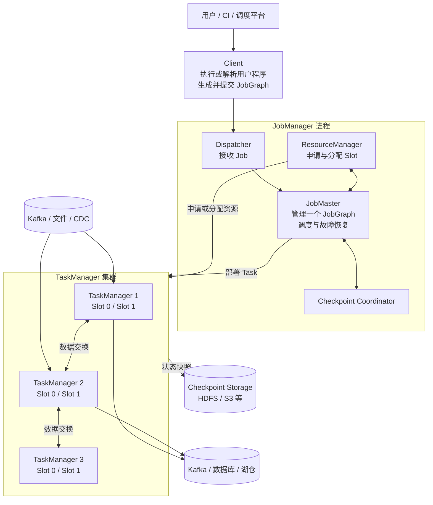
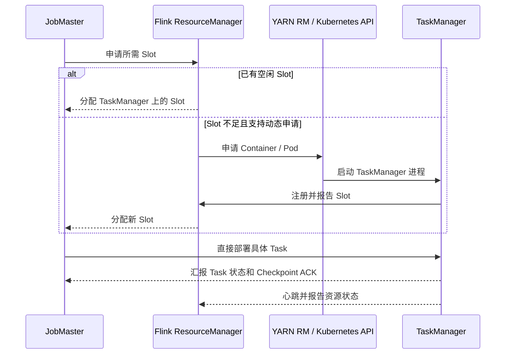
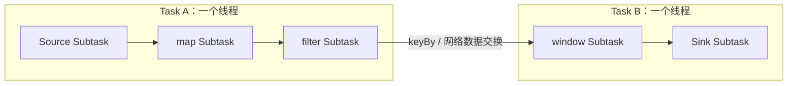
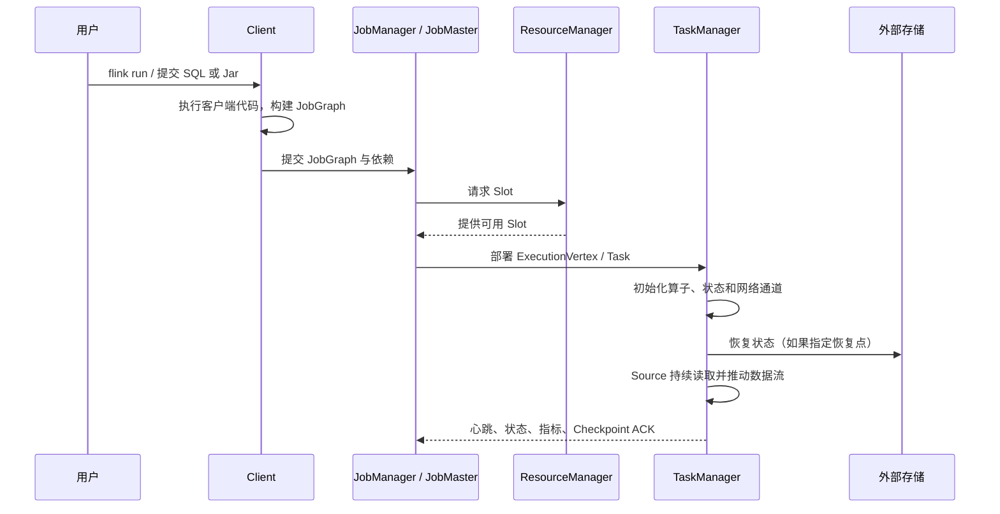

# 运行中的 Flink 程序架构图

下面从一个正在运行的 Flink Job 出发，建立 Client、JobManager、TaskManager、Task Slot、Task 和 Subtask 之间的关系。

## 一、先看完整集群架构



Flink Runtime 主要有两类进程：JobManager 和 TaskManager。Client 用来准备、提交作业，本身不一定属于作业运行期。

## 二、各组件分别负责什么

| 概念 | 职责 | 最容易混淆的点 |
|---|---|---|
| Client | 执行客户端侧程序、构建 JobGraph、提交作业 | 提交后可以退出，并不持续处理业务数据 |
| Dispatcher | 提供提交接口，为作业启动 JobMaster | 它属于 JobManager 进程内的组件 |
| ResourceManager | 管理 TaskManager 注册和 Slot 资源，并在动态部署模式下向 YARN/Kubernetes 申请或释放 Worker | 它提供资源，不负责决定某个具体 Task 的执行逻辑 |
| JobMaster | 管理一个 Job 的调度、状态和恢复 | 每个 Job 有自己的 JobMaster |
| TaskManager | 提供 Slot，执行 Task，负责数据交换、状态存储和 Checkpoint | 一个 TaskManager 是一个 JVM 进程，不等于一台 Worker 机器 |
| Task Slot | TaskManager 中的资源调度单位 | Slot 不是 CPU Core，也不是一个线程 |
| Operator | `map`、`keyBy`、window、sink 等逻辑操作 | 一个 Operator 会按并行度产生多个 Subtask |
| Subtask | Operator 的一个并行实例 | 一个 Subtask 处理该 Operator 的一部分数据 |
| Task | 可被部署和执行的运行单元 | 可能包含多个被 chain 在一起的 Subtask |

一句话概括：JobManager 决定“在哪里、何时运行”，TaskManager 负责“真正持续处理数据”。

### 2.1 ResourceManager 与 TaskManager 的职责边界

Flink 的 ResourceManager 和 TaskManager 分别位于控制面与数据面：

```text
控制面
JobMaster
  → 根据 ExecutionGraph 判断需要多少 Slot
  → 向 Flink ResourceManager 请求 Slot

Flink ResourceManager
  → 维护 TaskManager 注册、心跳和可用 Slot
  → 将可用 Slot 分配给 JobMaster
  → 资源不足时，通过 YARN / Kubernetes 申请新的 Worker

数据面
TaskManager
  → 提供 Slot
  → 接收 JobMaster 下发的 Task
  → 创建执行线程并运行 Operator Chain
  → 处理网络数据交换、状态和 Checkpoint
```

完整交互过程如下：



这里有三条重要边界：

1. **ResourceManager 不执行 Task**：它解决“有没有可用 Slot、是否需要增加或释放 TaskManager”的问题。
2. **ResourceManager 不决定算子怎样执行**：JobMaster 内的 Scheduler 根据 ExecutionGraph 选择 Slot，并向对应 TaskManager 下发 Task。
3. **TaskManager 不负责集群级调度**：它只执行分配给自己的 Task，并管理本进程的内存、网络 Buffer、本地状态和 Slot。

Flink ResourceManager 也不是 YARN ResourceManager：

```text
Flink ResourceManager
    → Flink JobManager 进程内的组件
    → 理解 TaskManager、Slot 和 Flink Job 的资源请求

YARN ResourceManager / Kubernetes Control Plane
    → 外部集群资源提供方
    → 分配 Container / 创建 Pod
    → 不理解 Flink Operator 和 ExecutionGraph
```

### 2.2 一个 Worker 节点只有一个 TaskManager 吗

不一定。更准确的关系是：

```text
物理机或虚拟机 Worker Node
    └─ 可以运行一个或多个 Container / Pod / JVM 进程
           └─ 每个 TaskManager 是一个独立 JVM 进程
                  └─ 一个 TaskManager 内配置一个或多个 Slot
```

常见部署关系如下：

| 部署方式 | 常见 TaskManager 部署单位 | 与 Worker 节点的关系 |
|---|---|---|
| Standalone | 直接启动 TaskManager JVM | 通常每台 Worker 启动一个，但也可以启动多个 |
| YARN | 一个 TaskManager 通常运行在一个 Container 中 | 同一 NodeManager 节点可以放置多个 TaskManager Container |
| Kubernetes | 一个 TaskManager 通常运行在一个 Pod 中 | 同一 Kubernetes Node 可以调度多个 TaskManager Pod |

所以不能把下面几个概念画等号：

```text
Worker 物理节点 ≠ TaskManager ≠ Task Slot ≠ Task
```

例如一台具有 32 个 CPU Core、128 GB 内存的 Kubernetes Worker Node，可以同时运行 4 个 TaskManager Pod：

```text
Worker Node
├─ TaskManager Pod 1：1 个 JVM，4 个 Slot
├─ TaskManager Pod 2：1 个 JVM，4 个 Slot
├─ TaskManager Pod 3：1 个 JVM，4 个 Slot
└─ TaskManager Pod 4：1 个 JVM，4 个 Slot

总计：4 个 TaskManager 进程，16 个 Slot
```

也可以只运行一个较大的 TaskManager，并在其中配置 16 个 Slot。两种部署的总 Slot 数相同，但故障和资源隔离边界不同：

- 一个大 TaskManager：进程少、内存和网络 Buffer 集中，但 JVM 失败时会同时丢失更多 Task；
- 多个小 TaskManager：进程隔离和故障影响面更小，但 JVM、网络和容器固定开销更多；
- Slot 多不表示 CPU 会被严格切成相同份额，真正的 CPU 和内存限制仍由进程、Container 或 Pod 的资源配置决定。

因此，生产中常说的“一台 Worker 一个 TaskManager”只是 Standalone 环境中的常见部署习惯，不是 Flink 的架构约束。在 YARN 和 Kubernetes 中，更可靠的心智模型是：

> ResourceManager 申请 Container 或 Pod，在其中启动 TaskManager 进程；调度系统再决定这些 Container 或 Pod 最终落在哪台 Worker 节点上。

## 三、Operator、Subtask、Task 和线程

假设程序是：

```text
Kafka Source -> map -> filter -> keyBy -> window -> Sink
```

在满足 chaining 条件时，可能形成：



这里的 `window -> sink` 不是一种名为“Window Sink”的特殊任务，而是两个 Operator 可能被链接到同一个 Task 中：

```text
Task B：一个执行线程
├── Window Subtask
└── Sink Subtask
```

### Window 是有状态的转换 Operator

例如：

```java
stream
    .keyBy(Event::userId)
    .window(TumblingEventTimeWindows.of(Duration.ofMinutes(5)))
    .aggregate(...);
```

Window Subtask 的执行过程是：

```text
接收 keyBy 重新分区后的数据
    ↓
按 key 和 window 保存状态
    ↓
处理 Watermark、Timer 和 Trigger
    ↓
窗口满足触发条件
    ↓
计算并输出窗口结果
```

假设 Window 并行度为 4，会产生 4 个 Window Subtask：

```text
Window Subtask 0：负责一部分 userId
Window Subtask 1：负责一部分 userId
Window Subtask 2：负责一部分 userId
Window Subtask 3：负责一部分 userId
```

同一个 `userId` 的数据一定进入同一个 Window Subtask，但一个 Subtask 通常负责很多 key。Window 的主要资源消耗来自 Keyed State、Window State、Timer、Watermark 处理、聚合计算和 Checkpoint 状态快照。

`keyBy` 主要声明数据怎样重新分区，不是负责窗口计算的 Task。真正保存窗口状态并执行聚合的是下游 Window Operator。

### Sink 是终端输出 Operator

Sink 负责把上游结果写入 Kafka、数据库、Iceberg 或文件系统等外部系统：

```text
接收 Window 输出
    ↓
序列化或转换数据
    ↓
缓冲、批量写入
    ↓
必要时参与 Checkpoint
    ↓
提交到外部系统
```

不同 Sink 的实际工作不同：

- Kafka Sink 把记录发送到 Kafka partition；
- JDBC Sink 缓冲记录并批量执行 SQL；
- File Sink 写入临时文件，在 Checkpoint 完成后提交文件；
- Iceberg Sink 写 Data File，并在 Checkpoint 边界提交 Snapshot。

因此 Sink 通常是 I/O 型 Operator，但它也可能维护缓冲区、事务状态和待提交文件。

### Window 和 Sink 何时组成一个 Task

如果 Window 和 Sink 满足以下条件：

- 并行度相同；
- 中间数据使用 `Forward` 方式传递，不需要重新分区；
- Slot Sharing Group 兼容；
- 两个算子都允许 chaining；

Flink 可以把它们合并成一个 Operator Chain：

```text
Task 线程
  → 调用 WindowOperator
  → Window 产生结果
  → 直接调用 SinkOperator
```

假设并行度为 4：

```text
Task 0：Window[0] → Sink[0]
Task 1：Window[1] → Sink[1]
Task 2：Window[2] → Sink[2]
Task 3：Window[3] → Sink[3]
```

此时有 4 个 Window Subtask 和 4 个 Sink Subtask，但可能只有 4 个 Task。每个 Task 使用一个主执行线程依次运行一个 Window Subtask 和一个 Sink Subtask，中间数据通过线程内的方法调用传递。

如果 Window 的并行度为 4，而 Sink 的并行度改为 2，就必须重新分发数据：

```text
4 个 Window Subtask
        ↓ 网络数据交换
2 个 Sink Subtask
```

此时它们会成为不同的 Task。以下情况也会打断或阻止 chaining：

- 调用了 `disableChaining()` 或 `startNewChain()`；
- 中间存在 `rebalance`、`rescale`、`keyBy` 等数据重分区；
- 上下游并行度不同；
- Slot Sharing Group 不兼容；
- Connector 的实现不允许与上游 chaining。

可以把这几个概念归纳为：

| 概念 | 在示例中的含义 |
|---|---|
| Window | 按 key 和时间范围保存状态、触发并计算结果的 Operator |
| Window Subtask | Window Operator 的一个并行实例 |
| Sink | 向外部系统输出数据的 Operator |
| Sink Subtask | Sink Operator 的一个并行实例 |
| Task | TaskManager 实际部署的执行单元，可以包含 Window 和 Sink 两个 Subtask |
| Task Slot | Task 使用的资源调度单位，不是 Window 或 Sink 本身 |

Operator Chaining 把多个算子并行实例放进同一个 Task，由同一线程顺序调用。它能减少：

- 线程切换；
- 序列化和反序列化；
- 中间缓冲与网络传输；
- Task 的数量和调度开销。

但 chaining 也会改变观察粒度：Web UI 上一个 Task 可能显示为 `Source -> Map -> Filter`。某个算子慢时，需要继续结合算子指标和业务代码定位。

## 四、并行度决定 Subtask 数量

```java
StreamExecutionEnvironment env =
    StreamExecutionEnvironment.getExecutionEnvironment();

env.setParallelism(4);

DataStream<Event> events = env.fromSource(...);

events
    .map(new ParseEvent())
    .keyBy(Event::userId)
    .process(new UserProcessFunction())
    .sinkTo(...);
```

如果没有对单独算子覆盖并行度，大部分算子会继承环境并行度 4：

```text
map       -> 4 个 Subtask
keyed process -> 4 个 Subtask
sink      -> 4 个 Subtask（Connector 可能另有限制）
```

并行度表示一个算子有多少个并行实例，不等于机器数，也不等于 Slot 数。

## 五、Task Slot 到底隔离什么

一个 TaskManager 可以配置多个 Slot。Slot 主要代表 TaskManager 资源的一部分，尤其是托管内存的划分；它不提供严格的 CPU 隔离。

```text
TaskManager JVM
├── Slot 0
│   └── Source[0] -> map[0] -> window[0]
├── Slot 1
│   └── Source[1] -> map[1] -> window[1]
└── Slot 2
    └── Source[2] -> map[2] -> window[2]
```

默认的 Slot Sharing 允许同一 Job 中不同 Task 的 Subtask 共享 Slot。这样，一条完整流水线可以占用同一个 Slot Group 中的一个 Slot。

因此，一个 Job 通常需要的 Slot 数更接近“Slot Sharing Group 内最高并行度”，而不是所有算子并行度之和。

### Slot 不是这些东西

- 不是一个固定线程：Task 才由线程执行；
- 不是一个 JVM：TaskManager 才是 JVM；
- 不是一个 CPU Core：多个线程仍可能竞争 CPU；
- 不是只能容纳一个 Operator：Operator Chain 中可有多个算子实例；
- 不是数据分区：它是资源调度单位。

## 六、一个 Job 的提交与运行时序



与 Spark 的 Action 触发批作业不同，Flink DataStream 程序在 `env.execute()` 后提交一张持续运行的数据流图。对于无界流，它通常不会自然进入 `FINISHED`。

## 七、Session Mode 与 Application Mode

| 模式 | 集群生命周期 | 用户 `main` 的典型位置 | 适用场景 |
|---|---|---|---|
| Session Mode | 多个 Job 共享长期集群 | Client | 交互式、短作业、共享资源 |
| Application Mode | 集群服务于一个 Application | JobManager 侧 | 生产隔离、降低客户端压力 |

Session Mode 启动作业快，但多个作业共享 JobManager 和 TaskManager，故障与资源竞争的影响面更大。Application Mode 隔离更清晰，适合生产部署。

## 八、TaskManager 内存从哪里消耗

```text
TaskManager Process Memory
├── Flink Memory
│   ├── Framework Heap / Off-heap
│   ├── Task Heap：用户对象、普通算子代码
│   ├── Task Off-heap：用户或库申请的堆外内存
│   ├── Managed Memory：排序、Hash、RocksDB 等
│   └── Network Memory：输入输出 Buffer
└── JVM Memory
    ├── Metaspace
    └── JVM Overhead
```

排查内存问题不能只看 `-Xmx`：

- Java 对象多、用户集合大：看 Task Heap 和 GC；
- RocksDB/本地状态大：看 Managed Memory、磁盘和本地 I/O；
- 网络 Buffer 不足：看 Network Memory 和并行通道数；
- 容器被 YARN/Kubernetes 杀死：检查总进程内存、Native Memory 和 JVM Overhead；
- 大量窗口、定时器、Join：先确认状态大小是否无限增长。

## 九、观察运行中 Job 应该看什么

```text
Job
├── JobManager 是否稳定，是否频繁 failover
├── 可用 Slot 是否满足最大并行度
├── 每个 Vertex 的 Parallelism 与 Subtask 状态
├── busy / idle / backPressured 时间
├── records in / out 与吞吐变化
├── currentInputWatermark 是否推进
├── Checkpoint duration / size / alignment time
├── 状态大小、GC、Heap、Managed Memory
└── 是否有少数慢 Subtask（数据倾斜或外部 I/O）
```

## 十、与 Spark 运行模型对照

| 维度 | Spark | Flink |
|---|---|---|
| 协调进程 | Driver | JobManager / JobMaster |
| 工作进程 | Executor | TaskManager |
| 资源单位 | Executor Core 等 | Task Slot |
| 并行实例 | 每个 Stage 的 Task | Operator Subtask |
| 流水线 | 窄依赖算子在 Task 内 iterator 执行 | Operator Chaining 形成 Task |
| 数据交换 | Shuffle 常形成 Stage 边界 | Exchange 断链，但上下游可流水运行 |
| 长期状态 | 以缓存和外部存储为主 | Keyed/Operator State 是一等能力 |
| 故障恢复 | lineage、重算、Checkpoint | 状态快照、Source 回放、区域/全局恢复 |

## 十一、最终心智模型

```text
用户代码定义 Operator DAG
        ↓
Client 将作业变成 JobGraph
        ↓
JobMaster 展开并行实例，形成 ExecutionGraph
        ↓
ResourceManager 为并行 Task 分配 Slot
        ↓
TaskManager 在线程中执行 Operator Chain
        ↓
Subtask 持续接收 Record、更新状态、向下游发送数据
        ↓
Checkpoint 周期性保存 Source 位置与算子状态
```

第一章最重要的结论是：Flink 的运行实体不是“一个算子一个进程”，而是算子按并行度展开成 Subtask，再经过 chaining 组成长期运行的 Task，最终被部署到 TaskManager 的 Slot 中。

## 参考资料

- [Flink Architecture](https://nightlies.apache.org/flink/flink-docs-stable/docs/concepts/flink-architecture/)
- [Deployment Overview](https://nightlies.apache.org/flink/flink-docs-stable/docs/deployment/overview/)
- [Set up Flink's Process Memory](https://nightlies.apache.org/flink/flink-docs-stable/docs/deployment/memory/mem_setup/)
