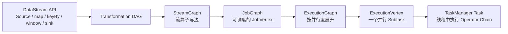
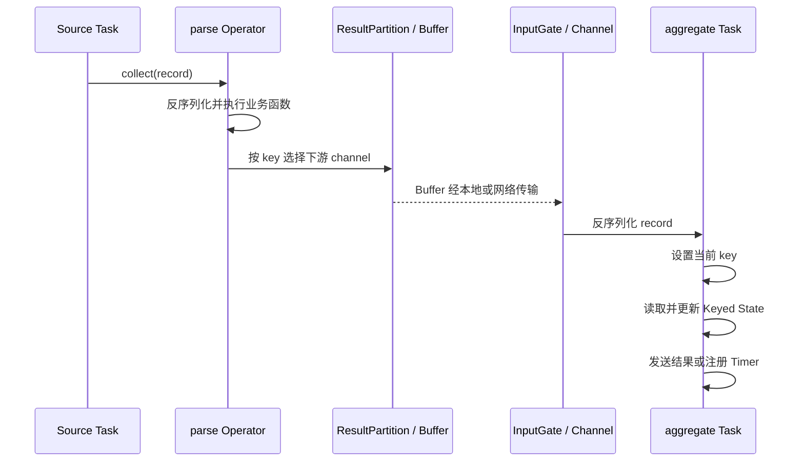

# DataStream 逻辑计划与 Task 执行过程

本章沿着一段 DataStream 代码向下追踪，回答它怎样从逻辑算子变成 TaskManager 中长期运行的线程。

## 一、从用户代码到运行实例的完整链路



可以先这样理解：

| 层次 | 主要回答的问题 |
|---|---|
| DataStream / Transformation | 用户想做什么计算？ |
| StreamGraph | 逻辑算子怎样连接，边使用什么分区方式？ |
| JobGraph | 哪些算子可以 chain，哪些部分成为可调度顶点？ |
| ExecutionGraph | 每个 JobVertex 按并行度展开后有哪些运行实例？ |
| Task / Subtask | 哪个线程在什么 TaskManager 上处理哪部分数据？ |

这些层次是理解运行时的心智模型。不同版本的内部类和生成细节可能调整，但“逻辑图 -> 可调度图 -> 并行执行图”的主线稳定。

## 二、DataStream 调用先构建计算描述

```java
DataStream<Order> orders = env.fromSource(
    source,
    WatermarkStrategy.<Order>forBoundedOutOfOrderness(Duration.ofSeconds(5))
        .withTimestampAssigner((order, ts) -> order.eventTime()),
    "orders"
);

DataStream<Order> valid = orders
    .filter(Order::isValid)
    .name("valid-orders");

DataStream<OrderTotal> totals = valid
    .keyBy(Order::userId)
    .window(TumblingEventTimeWindows.of(Duration.ofMinutes(1)))
    .aggregate(new SumOrderAmount())
    .name("one-minute-total");

totals.sinkTo(sink).name("result-sink");
env.execute("order-statistics");
```

`filter`、`keyBy`、`window` 和 `aggregate` 的调用主要是在客户端构造 Transformation 及其依赖关系。它们不会在调用这一行时扫描 Kafka 中的数据。

`env.execute()` 才会请求生成作业图并提交执行。无界 Source 启动后会持续产生 Record，所以 Task 也会持续存在。

## 三、StreamGraph 保存什么

StreamGraph 可以理解为接近用户代码的一张流式逻辑图：

```text
StreamNode
├── OperatorFactory / 用户函数
├── parallelism
├── maxParallelism
├── slotSharingGroup
├── chainingStrategy
└── 输入输出序列化信息

StreamEdge
├── 上游和下游节点
├── StreamPartitioner
├── exchange mode
└── 是否支持 chaining
```

其中最重要的是边上的数据分发方式：

- `forward`：上游 Subtask 直接对应下游 Subtask，常用于相同并行度的 chain；
- `rebalance`：轮询分发，使下游更均衡；
- `rescale`：只在局部上下游集合之间轮询；
- `broadcast`：每条数据发给全部下游；
- `keyBy`：根据 key 的哈希和 Key Group 路由；
- `global`：全部发到某一个下游实例，通常会形成瓶颈。

## 四、Operator Chaining 怎样改变 JobGraph

以下算子常有机会 chain：

```text
Source(p=4) -> map(p=4) -> filter(p=4)
```

典型条件包括：

- 上下游并行度相同；
- 数据可以一对一 forward；
- 上下游位于兼容的 Slot Sharing Group；
- ChainingStrategy 允许；
- 没有调用 `disableChaining()` 或 `startNewChain()` 主动断开。

`keyBy` 会改变数据分区，通常断开 chain：

```text
[Source -> map -> filter]  -- keyBy exchange --> [window -> sink]
       JobVertex A                                  JobVertex B
```

断开 chain 不等于像 Spark Shuffle 那样必须等待整个上游阶段结束。流模式下，上游产生 Buffer 后即可持续发送，下游可以同步消费。

## 五、JobGraph 到 ExecutionGraph

JobGraph 中一个 JobVertex 表示一个可调度的算子链。JobManager 收到 JobGraph 后按并行度展开：

```text
JobVertex: window -> sink, parallelism = 3
├── ExecutionVertex 0：window[0] -> sink[0]
├── ExecutionVertex 1：window[1] -> sink[1]
└── ExecutionVertex 2：window[2] -> sink[2]
```

每个 ExecutionVertex 表示一个并行 Subtask 的运行身份。一次执行失败后可能产生新的 Execution Attempt，所以不能把 ExecutionVertex 和某一次线程尝试完全等同。

### Parallelism 与 Max Parallelism

`parallelism` 决定当前有多少个并行 Subtask；`maxParallelism` 决定 Keyed State 可被切成多少个 Key Group，并限制未来可扩展到的最大并行度。

```text
key -> hash -> Key Group -> 当前 Subtask
```

扩缩容时，Flink 重新把 Key Group 分配给新的 Subtask。这样不必逐个 key 记录一张巨大的迁移表。

## 六、TaskManager 怎样处理一条 Record

以 `Source -> parse -> keyBy -> aggregate` 为例：



一个 Task 的主循环不仅处理普通数据，还会处理控制事件：

- Watermark：推动事件时间；
- Checkpoint Barrier：触发或对齐状态快照；
- EndOfData / EndOfPartition：标记有界输入结束；
- Latency Marker 等运行时事件。

## 七、为什么 Keyed State 总能找到当前 key

`keyBy(Order::userId)` 之后，运行时会保证相同 key 在同一时刻被路由到同一个下游 Subtask。处理一条 Record 前，Keyed State Backend 会设置当前 key：

```text
收到 Order(userId=42)
      ↓
runtime 设置 currentKey = 42
      ↓
ValueState.value() 读取 key=42 对应的值
      ↓
ValueState.update() 只更新 key=42 的值
```

用户代码看到的是 `ValueState<T>`，实际数据按 key 隔离。只有 KeyedStream 上的函数才能使用 Keyed State，因为非 keyed 流没有确定的当前 key。

## 八、一个 Task 为什么能长期运行

Spark Task 通常处理完一个 partition 就结束；Flink 流式 Task 更像一个事件循环：

```text
while (job is running):
    等待输入、定时器、异步结果或控制事件
    选择一个可处理的输入
    调用对应 Operator
    更新状态并向下游发数据
    响应 Checkpoint Barrier
```

这带来三个重要结果：

1. 内存和状态可能随时间累积，必须设置清理边界；
2. 单条 Record 的慢调用会阻塞所在 Task 的后续处理；
3. 下游消费不动时，网络 Buffer 用尽，反压会一路传播到 Source。

## 九、Source、普通算子与 Sink 分别输出什么

| 位置 | 输入 | 输出或副作用 |
|---|---|---|
| Source | 外部分区和 Offset | Record、Watermark、Checkpoint 中的读取位置 |
| 普通 Operator | Record / Watermark | 转换后的 Record、状态更新、Timer |
| Exchange | 上游结果 | 按分区规则组织的 Buffer |
| Window | Keyed Record / Watermark | 窗口状态与触发结果 |
| Sink | Record | 外部写入、事务预提交或幂等写入 |

Source 的 Offset、Operator State 和 Sink 的事务状态如果能进入同一个一致性 Checkpoint，才有机会实现端到端 Exactly-Once。

## 十、部署和执行失败时发生什么

```text
ExecutionVertex DEPLOYING
        ↓
RUNNING
   ├── 正常完成 -> FINISHED
   └── 异常 -> FAILED
                  ↓
            触发恢复策略
                  ↓
     取消受影响 Task、恢复状态、重新部署
```

恢复粒度取决于调度和 Failover Strategy。无论是区域恢复还是更大范围恢复，关键都是让相互依赖的 Task 从同一个一致性状态继续运行。

## 十一、常见误解

### 一个 Operator 就是一个 Task

不一定。Operator 按并行度产生 Subtask，多个可 chaining 的 Subtask 又会组合进一个 Task。

### 一个 Slot 只能运行一个算子

不一定。Slot Sharing 允许一条流水线中的多个 Task 共享一个 Slot；一个 Task 内还可能有多个 Operator。

### `keyBy` 会把数据保存起来

`keyBy` 只定义路由。真正保存聚合中间结果的是下游算子的 Keyed State。

### 调用 `map` 时集群已经开始计算

不是。客户端先构图，执行环境提交后 Task 才在 TaskManager 中运行。

### 断开 Operator Chain 就会形成批式 Stage

不是。断链表示需要独立 Task 和数据交换；流式上下游仍可流水并行。

## 十二、最终心智模型

```text
DataStream API：描述计算
StreamGraph：保存 Operator 与分区边
JobGraph：把可 chain 的 Operator 合成可调度顶点
ExecutionGraph：按并行度展开为运行实例
ExecutionVertex：一个并行 Subtask 的身份
Execution Attempt：Subtask 的某一次实际运行
Task：TaskManager 线程中的 Operator Chain
```

阅读 Flink Web UI 或源码时，先判断当前对象属于“逻辑算子层”“可调度顶点层”还是“并行运行实例层”，大量名称混淆会自然消失。

## 参考资料

- [Flink Architecture](https://nightlies.apache.org/flink/flink-docs-stable/docs/concepts/flink-architecture/)
- [Jobs and Scheduling](https://nightlies.apache.org/flink/flink-docs-master/docs/internals/job_scheduling/)

