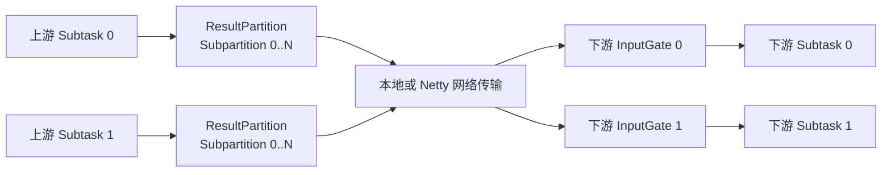
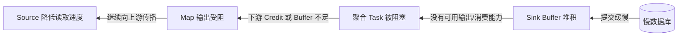

# Flink 分区、数据交换与反压

本章从一条 Record 离开上游 Subtask 开始，解释它怎样选择下游、怎样经过 Buffer 传输，以及下游变慢后反压为什么会传到 Source。

## 一、先看完整数据链路



逻辑上的一条数据交换边，在物理上会展开为多个上游 ResultPartition、下游 InputGate 和它们之间的 Channel。

## 二、分区器决定 Record 发给谁

| DataStream 操作 | 典型分发 | 用途与代价 |
|---|---|---|
| `keyBy` | 相同 key 到同一 Subtask | 需要重分区，是 Keyed State 的前提 |
| `rebalance` | 全局轮询 | 均衡数据，但建立较多上下游连接 |
| `rescale` | 局部轮询 | 减少连接，只在局部 Task 集合间均衡 |
| `broadcast` | 发给全部下游 | 配置流、规则流；数据会被复制 |
| `forward` | 上下游一对一 | 无重分区，要求并行度匹配 |
| `global` | 全部发给一个实例 | 全局单点处理，吞吐风险很高 |
| `shuffle` | 随机分发 | 打散数据，不保证按 key 聚合 |

## 三、`keyBy` 的完整路由过程

```text
record
  ↓ KeySelector
key
  ↓ hash + 映射
Key Group
  ↓ Key Group Range 分配
目标下游 Subtask
  ↓
对应 Channel / Buffer
```

Key Group 是 Keyed State 的最小重分配单位。相同 key 必须落入同一 Key Group，因此也会进入同一 Subtask。

设 `maxParallelism = 128`、当前 `parallelism = 4`，可以粗略理解为 128 个 Key Group 被分为 4 段：

```text
Subtask 0: Key Group 0  ~ 31
Subtask 1: Key Group 32 ~ 63
Subtask 2: Key Group 64 ~ 95
Subtask 3: Key Group 96 ~ 127
```

扩容到 8 后，Key Group 重新按范围分给 8 个 Subtask，对应状态也随之重分配。

## 四、Flink 的数据交换不等于 Spark Stage Shuffle

两者都会让数据跨分区移动，但执行时序不同：

```text
Spark 典型 Shuffle：
上游 ShuffleMapTask 完成并物化输出
        ↓
下游 Task 拉取自己的 Reduce Partition

Flink 流式 Exchange：
上游持续生成 Buffer ─────────→ 下游持续消费 Buffer
上游和下游通常同时处于 RUNNING
```

Flink 在批执行模式也可以使用 Blocking Exchange，让下游在上游结果可用后再消费；但无界流的默认心智模型是 Pipelined Exchange。

## 五、Record 为什么要进入 Network Buffer

逐条通过网络发送会产生大量系统调用和协议开销。Flink 先把序列化后的 Record 写进固定大小的内存段，形成 Buffer，再交给本地或远程 Channel。

```text
Java Record
   ↓ Serializer
二进制 Record
   ↓ 累积
Network Buffer
   ↓ Result Subpartition
Local Channel / Netty TCP
   ↓ Input Channel
反序列化并交给下游 Operator
```

Buffer 能提高吞吐，却也带来延迟和内存权衡：

- Buffer 多：网络利用率更高、可吸收短暂抖动，但在途数据和延迟可能增加；
- Buffer 少：在途数据少，但容易因 Buffer 不足限制吞吐；
- 并行度和全连接边越多，需要的网络通道和 Buffer 通常越多。

## 六、反压怎样逐级传播

假设 Sink 写数据库很慢：



数据流向下游，反压信号沿相反方向传播。它是有界缓冲带来的自然流量控制：系统选择让 Source 变慢，而不是无限申请内存。

### 反压不是错误本身

短暂反压可能只是流量尖峰；持续反压说明长期处理能力低于输入速率：

```text
长期可持续运行条件：平均输入速率 <= 最慢环节的稳定处理速率
```

无论增加多少 Buffer，如果平均输入速率一直更高，积压最终仍会增长。

## 七、怎样定位真正的瓶颈

Flink Subtask 的三个时间指标大致相加为每秒 1000ms：

- `busyTimeMsPerSecond`：忙于实际处理；
- `backPressuredTimeMsPerSecond`：因下游消费不动而受阻；
- `idleTimeMsPerSecond`：没有输入可处理。

从下游向上游观察：

| 指标组合 | 更可能的含义 |
|---|---|
| Sink busy 高，上游 backPressured 高 | Sink 或外部系统是瓶颈 |
| 某个中间算子 busy 高，其上游 backPressured 高 | 该算子 CPU/状态/I/O 慢 |
| 所有下游大量 idle，Source busy 低 | Source、分区数或输入本身不足 |
| 只有少数 Subtask busy 高 | key 倾斜或分区负载不均 |
| Checkpoint alignment time 高 | Barrier 被慢 Channel 或反压拖住 |

排查顺序建议：

1. 在 JobGraph 中找到最下游的高 busy 节点；
2. 比较该 Vertex 的各 Subtask，确认是否倾斜；
3. 查看 CPU、GC、状态访问、网络和外部请求延迟；
4. 判断是容量不足、并行度不足，还是业务调用的串行等待；
5. 修复瓶颈后再评估 Buffer 与 Checkpoint 参数。

## 八、常见性能问题

### 8.1 Key 倾斜

```text
普通 key -> 每个 Subtask 约 5 万条/秒
热点 key -> 一个 Subtask 20 万条/秒
```

`keyBy` 必须让同 key 同路由，因此单个热点 key 不能靠直接增加并行度拆开。可考虑：

- 业务允许时对热点 key 两阶段聚合；
- 拆分热点业务路径；
- 使用局部预聚合减少跨网络数据量；
- 修正 `null`、默认值等异常 key；
- 重新设计 key，使状态和并发边界符合业务语义。

### 8.2 外部同步 I/O

在 `map` 中同步请求 HTTP/数据库，会阻塞 Task 线程。应根据语义使用 Async I/O、批量写入、缓存或专用 Connector，同时设置超时和最大并发，避免把外部故障放大为无限排队。

### 8.3 序列化成本

跨网络交换、状态读写和 Checkpoint 都依赖序列化。避免超大 Record、深层对象图和不稳定的通用序列化；优先使用 Flink 可有效识别的类型，并观察序列化 CPU 和网络字节数。

### 8.4 并行度不匹配

Source 只有 4 个 Kafka Partition 时，把 Source 并行度配置为 100 并不会产生 100 份有效输入。反之，下游并行度过低会成为瓶颈。

## 九、反压与 Checkpoint 的关系

Aligned Checkpoint 中，多输入算子收到一侧 Barrier 后，需要等待其他输入的同编号 Barrier。反压严重时，Barrier 传播很慢，表现为：

- checkpoint start delay 高；
- alignment time 高；
- checkpoint duration 增长甚至超时。

Unaligned Checkpoint 可以把在途 Buffer 纳入快照，让 Barrier 越过积压数据，缩短反压下的 Checkpoint 时间。但它会增大快照 I/O 和恢复数据量，而且不会消除业务处理瓶颈。

## 十、常见误解

### `keyBy` 会排序

不会。它只保证相同 key 路由到同一并行实例，不保证全局或按 key 的事件时间顺序。

### 增加 Network Memory 就能消除反压

只能吸收更长的短期波动，不能解决长期吞吐不足。

### 看到 Source 反压，说明 Source 最慢

通常相反：Source 是被下游瓶颈拖慢的。应顺着数据流向下寻找首个持续 busy 的节点。

### 并行度越高越好

过高会增加 Channel、Buffer、调度、状态分片和 Checkpoint 元数据成本，还可能超过 Source/Sink 的外部并行能力。

## 十一、最终心智模型

```text
分区器决定目标 Subtask
        ↓
Serializer 将 Record 写入 Network Buffer
        ↓
ResultPartition / Channel 把 Buffer 交给下游 InputGate
        ↓
下游线程消费并处理
        ↓
下游变慢 -> 可用 Buffer 耗尽 -> 反压逐级传回 Source
```

理解 Flink 数据交换的关键不是记住所有分区器名字，而是同时回答三个问题：一条 Record 发给谁、通过什么通道到达、下游处理不动时系统怎样限制上游。

## 参考资料

- [Flink Architecture](https://nightlies.apache.org/flink/flink-docs-stable/docs/concepts/flink-architecture/)
- [Monitoring Back Pressure](https://nightlies.apache.org/flink/flink-docs-stable/docs/ops/monitoring/back_pressure/)
- [Checkpointing under Backpressure](https://nightlies.apache.org/flink/flink-docs-stable/docs/ops/state/checkpointing_under_backpressure/)

