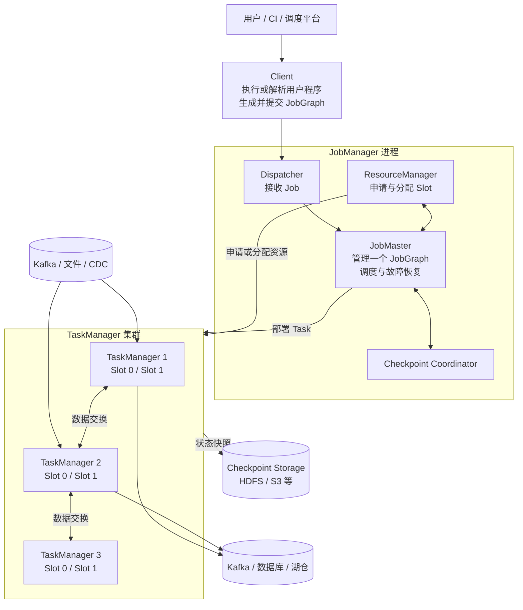
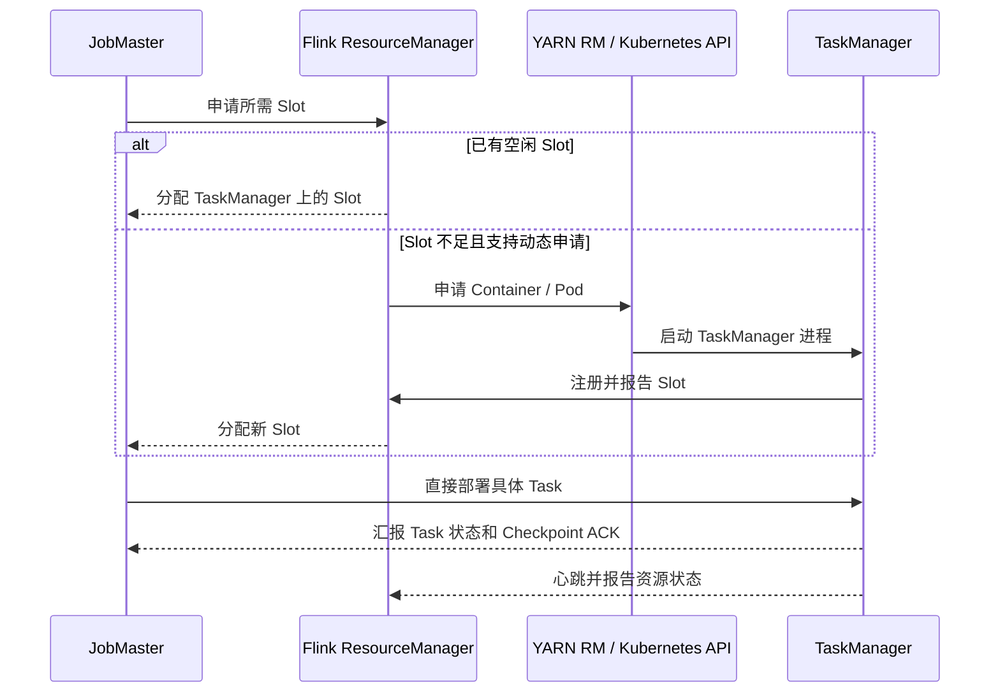
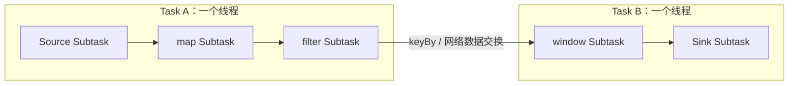
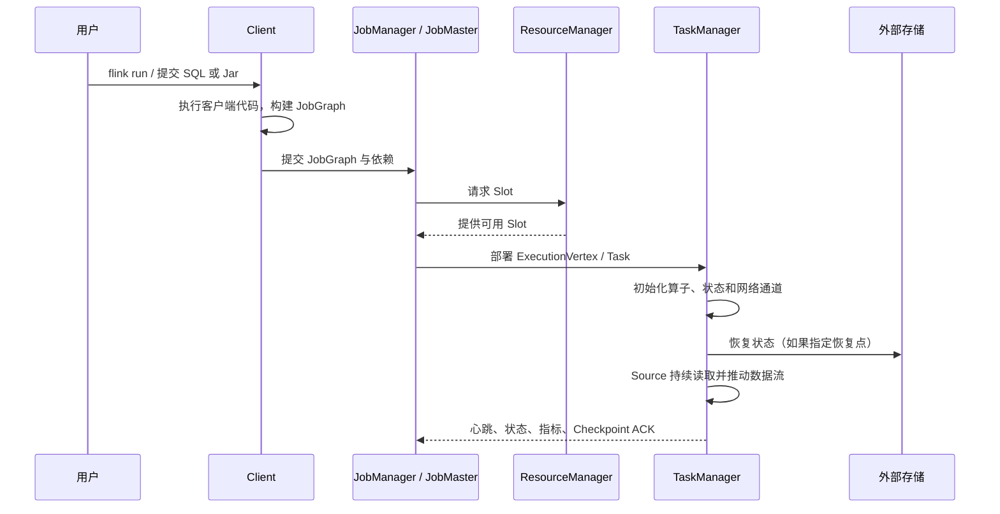

# 运行中的 Flink 程序架构图

下面从一个正在运行的 Flink Job 出发，建立 Client、JobManager、TaskManager、Task Slot、Task 和 Subtask 之间的关系。

## 一、先看完整集群架构



Flink Runtime 主要有两类进程：JobManager 和 TaskManager。Client 用来准备、提交作业，本身不一定属于作业运行期。

## 二、各组件分别负责什么

| 概念 | 职责 | 最容易混淆的点 |
|---|---|---|
| Client | 执行客户端侧程序、构建 JobGraph、提交作业 | 提交后可以退出，并不持续处理业务数据 |
| Dispatcher | 提供提交接口，为作业启动 JobMaster | 它属于 JobManager 进程内的组件 |
| ResourceManager | 管理 TaskManager 注册和 Slot 资源，并在动态部署模式下向 YARN/Kubernetes 申请或释放 Worker | 它提供资源，不负责决定某个具体 Task 的执行逻辑 |
| JobMaster | 管理一个 Job 的调度、状态和恢复 | 每个 Job 有自己的 JobMaster |
| TaskManager | 提供 Slot，执行 Task，负责数据交换、状态存储和 Checkpoint | 一个 TaskManager 是一个 JVM 进程，不等于一台 Worker 机器 |
| Task Slot | TaskManager 中的资源调度单位 | Slot 不是 CPU Core，也不是一个线程 |
| Operator | `map`、`keyBy`、window、sink 等逻辑操作 | 一个 Operator 会按并行度产生多个 Subtask |
| Subtask | Operator 的一个并行实例 | 一个 Subtask 处理该 Operator 的一部分数据 |
| Task | 可被部署和执行的运行单元 | 可能包含多个被 chain 在一起的 Subtask |

一句话概括：JobManager 决定“在哪里、何时运行”，TaskManager 负责“真正持续处理数据”。

### 2.1 ResourceManager 与 TaskManager 的职责边界

Flink 的 ResourceManager 和 TaskManager 分别位于控制面与数据面：

```text
控制面
JobMaster
  → 根据 ExecutionGraph 判断需要多少 Slot
  → 向 Flink ResourceManager 请求 Slot

Flink ResourceManager
  → 维护 TaskManager 注册、心跳和可用 Slot
  → 将可用 Slot 分配给 JobMaster
  → 资源不足时，通过 YARN / Kubernetes 申请新的 Worker

数据面
TaskManager
  → 提供 Slot
  → 接收 JobMaster 下发的 Task
  → 创建执行线程并运行 Operator Chain
  → 处理网络数据交换、状态和 Checkpoint
```

完整交互过程如下：



这里有三条重要边界：

1. **ResourceManager 不执行 Task**：它解决“有没有可用 Slot、是否需要增加或释放 TaskManager”的问题。
2. **ResourceManager 不决定算子怎样执行**：JobMaster 内的 Scheduler 根据 ExecutionGraph 选择 Slot，并向对应 TaskManager 下发 Task。
3. **TaskManager 不负责集群级调度**：它只执行分配给自己的 Task，并管理本进程的内存、网络 Buffer、本地状态和 Slot。

Flink ResourceManager 也不是 YARN ResourceManager：

```text
Flink ResourceManager
    → Flink JobManager 进程内的组件
    → 理解 TaskManager、Slot 和 Flink Job 的资源请求

YARN ResourceManager / Kubernetes Control Plane
    → 外部集群资源提供方
    → 分配 Container / 创建 Pod
    → 不理解 Flink Operator 和 ExecutionGraph
```

### 2.2 一个 Worker 节点只有一个 TaskManager 吗

不一定。更准确的关系是：

```text
物理机或虚拟机 Worker Node
    └─ 可以运行一个或多个 Container / Pod / JVM 进程
           └─ 每个 TaskManager 是一个独立 JVM 进程
                  └─ 一个 TaskManager 内配置一个或多个 Slot
```

常见部署关系如下：

| 部署方式 | 常见 TaskManager 部署单位 | 与 Worker 节点的关系 |
|---|---|---|
| Standalone | 直接启动 TaskManager JVM | 通常每台 Worker 启动一个，但也可以启动多个 |
| YARN | 一个 TaskManager 通常运行在一个 Container 中 | 同一 NodeManager 节点可以放置多个 TaskManager Container |
| Kubernetes | 一个 TaskManager 通常运行在一个 Pod 中 | 同一 Kubernetes Node 可以调度多个 TaskManager Pod |

所以不能把下面几个概念画等号：

```text
Worker 物理节点 ≠ TaskManager ≠ Task Slot ≠ Task
```

例如一台具有 32 个 CPU Core、128 GB 内存的 Kubernetes Worker Node，可以同时运行 4 个 TaskManager Pod：

```text
Worker Node
├─ TaskManager Pod 1：1 个 JVM，4 个 Slot
├─ TaskManager Pod 2：1 个 JVM，4 个 Slot
├─ TaskManager Pod 3：1 个 JVM，4 个 Slot
└─ TaskManager Pod 4：1 个 JVM，4 个 Slot

总计：4 个 TaskManager 进程，16 个 Slot
```

也可以只运行一个较大的 TaskManager，并在其中配置 16 个 Slot。两种部署的总 Slot 数相同，但故障和资源隔离边界不同：

- 一个大 TaskManager：进程少、内存和网络 Buffer 集中，但 JVM 失败时会同时丢失更多 Task；
- 多个小 TaskManager：进程隔离和故障影响面更小，但 JVM、网络和容器固定开销更多；
- Slot 多不表示 CPU 会被严格切成相同份额，真正的 CPU 和内存限制仍由进程、Container 或 Pod 的资源配置决定。

因此，生产中常说的“一台 Worker 一个 TaskManager”只是 Standalone 环境中的常见部署习惯，不是 Flink 的架构约束。在 YARN 和 Kubernetes 中，更可靠的心智模型是：

> ResourceManager 申请 Container 或 Pod，在其中启动 TaskManager 进程；调度系统再决定这些 Container 或 Pod 最终落在哪台 Worker 节点上。

## 三、Operator、Subtask、Task 和线程

假设程序是：

```text
Kafka Source -> map -> filter -> keyBy -> window -> Sink
```

在满足 chaining 条件时，可能形成：



这里的 `window -> sink` 不是一种名为“Window Sink”的特殊任务，而是两个 Operator 可能被链接到同一个 Task 中：

```text
Task B：一个执行线程
├── Window Subtask
└── Sink Subtask
```

### Source 是数据流入口 Operator

在 Flink 中，Source 表示“把外部系统的数据转换成 Flink 内部 `DataStream` 的入口”。它不是 Kafka 本身，也不是某一条数据，而是一个连接外部系统并持续产生 Record 的 Operator。

```text
外部系统
Kafka / MySQL CDC / 文件 / HTTP API
        ↓
Source Connector + Source Runtime
        ↓
DataStream<Record>
        ↓
map / filter / keyBy / window / sink
```

例如：

```java
DataStream<Order> orders = env.fromSource(
    kafkaSource,
    watermarkStrategy,
    "order-source"
);
```

`kafkaSource` 描述如何连接和读取 Kafka，`fromSource` 把它注册为 Flink Job 的 Source Operator，返回的 `DataStream<Order>` 才是后续算子处理的数据流。

一个生产级 Source 通常负责：

1. 连接外部系统并完成认证；
2. 拉取消息、扫描文件，或读取数据库快照与 CDC 日志；
3. 把 Kafka partition、文件分片或表分片分配给 Source Subtask；
4. 把外部字节反序列化成 Flink Record；
5. 保存 Kafka offset、文件位置或 CDC 位点；
6. 配合 Checkpoint，在故障后从一致位置恢复；
7. 提取事件时间并配合 `WatermarkStrategy` 生成水位。

假设 Kafka 有 3 个 partition，Source 并行度为 3：

```text
Kafka topic
├── partition 0 ──▶ Source Subtask 0
├── partition 1 ──▶ Source Subtask 1
└── partition 2 ──▶ Source Subtask 2
```

其中，KafkaSource 是 Source Operator 的定义；Source Subtask 0/1/2 是它的三个并行实例；Kafka partition 是外部数据分区，不是 Flink Slot。实际不一定一对一：partition 多于 Source 并行度时，一个 Subtask 可以读取多个 partition；并行度大于 partition 数时，部分 Subtask 可能暂时没有分区可读。

Source 还分为两类：

- **Bounded Source（有界源）**：数据有明确终点，例如有限 CSV、历史 Parquet 文件或一次性数据库快照；读完后 Job 可以结束。
- **Unbounded Source（无界源）**：数据持续产生，例如 Kafka、Pulsar 或实时 CDC；除非人工取消，否则 Job 通常不会自然结束。

Source 与 Sink 是数据流两端的对称概念：

```text
Source：外部系统 → Flink DataStream
Sink：Flink DataStream → 外部系统
```

Source 负责输入位点，Sink 负责输出提交。只有 Source 位点、算子状态和 Sink 提交能在 Checkpoint 边界协调起来，才可能获得端到端的 exactly-once 效果。

### Window 是有状态的转换 Operator

例如：

```java
stream
    .keyBy(Event::userId)
    .window(TumblingEventTimeWindows.of(Duration.ofMinutes(5)))
    .aggregate(...);
```

Window Subtask 的执行过程是：

```text
接收 keyBy 重新分区后的数据
    ↓
按 key 和 window 保存状态
    ↓
处理 Watermark、Timer 和 Trigger
    ↓
窗口满足触发条件
    ↓
计算并输出窗口结果
```

假设 Window 并行度为 4，会产生 4 个 Window Subtask：

```text
Window Subtask 0：负责一部分 userId
Window Subtask 1：负责一部分 userId
Window Subtask 2：负责一部分 userId
Window Subtask 3：负责一部分 userId
```

同一个 `userId` 的数据一定进入同一个 Window Subtask，但一个 Subtask 通常负责很多 key。Window 的主要资源消耗来自 Keyed State、Window State、Timer、Watermark 处理、聚合计算和 Checkpoint 状态快照。

`keyBy` 主要声明数据怎样重新分区，不是负责窗口计算的 Task。真正保存窗口状态并执行聚合的是下游 Window Operator。

### Sink 是终端输出 Operator

Sink 负责把上游结果写入 Kafka、数据库、Iceberg 或文件系统等外部系统：

```text
接收 Window 输出
    ↓
序列化或转换数据
    ↓
缓冲、批量写入
    ↓
必要时参与 Checkpoint
    ↓
提交到外部系统
```

不同 Sink 的实际工作不同：

- Kafka Sink 把记录发送到 Kafka partition；
- JDBC Sink 缓冲记录并批量执行 SQL；
- File Sink 写入临时文件，在 Checkpoint 完成后提交文件；
- Iceberg Sink 写 Data File，并在 Checkpoint 边界提交 Snapshot。

因此 Sink 通常是 I/O 型 Operator，但它也可能维护缓冲区、事务状态和待提交文件。

### Window 和 Sink 何时组成一个 Task

如果 Window 和 Sink 满足以下条件：

- 并行度相同；
- 中间数据使用 `Forward` 方式传递，不需要重新分区；
- Slot Sharing Group 兼容；
- 两个算子都允许 chaining；

Flink 可以把它们合并成一个 Operator Chain：

```text
Task 线程
  → 调用 WindowOperator
  → Window 产生结果
  → 直接调用 SinkOperator
```

假设并行度为 4：

```text
Task 0：Window[0] → Sink[0]
Task 1：Window[1] → Sink[1]
Task 2：Window[2] → Sink[2]
Task 3：Window[3] → Sink[3]
```

此时有 4 个 Window Subtask 和 4 个 Sink Subtask，但可能只有 4 个 Task。每个 Task 使用一个主执行线程依次运行一个 Window Subtask 和一个 Sink Subtask，中间数据通过线程内的方法调用传递。

如果 Window 的并行度为 4，而 Sink 的并行度改为 2，就必须重新分发数据：

```text
4 个 Window Subtask
        ↓ 网络数据交换
2 个 Sink Subtask
```

此时它们会成为不同的 Task。以下情况也会打断或阻止 chaining：

- 调用了 `disableChaining()` 或 `startNewChain()`；
- 中间存在 `rebalance`、`rescale`、`keyBy` 等数据重分区；
- 上下游并行度不同；
- Slot Sharing Group 不兼容；
- Connector 的实现不允许与上游 chaining。

可以把这几个概念归纳为：

| 概念 | 在示例中的含义 |
|---|---|
| Window | 按 key 和时间范围保存状态、触发并计算结果的 Operator |
| Window Subtask | Window Operator 的一个并行实例 |
| Sink | 向外部系统输出数据的 Operator |
| Sink Subtask | Sink Operator 的一个并行实例 |
| Task | TaskManager 实际部署的执行单元，可以包含 Window 和 Sink 两个 Subtask |
| Task Slot | Task 使用的资源调度单位，不是 Window 或 Sink 本身 |

Operator Chaining 把多个算子并行实例放进同一个 Task，由同一线程顺序调用。它能减少：

- 线程切换；
- 序列化和反序列化；
- 中间缓冲与网络传输；
- Task 的数量和调度开销。

但 chaining 也会改变观察粒度：Web UI 上一个 Task 可能显示为 `Source -> Map -> Filter`。某个算子慢时，需要继续结合算子指标和业务代码定位。

## 四、并行度决定 Subtask 数量

```java
StreamExecutionEnvironment env =
    StreamExecutionEnvironment.getExecutionEnvironment();

env.setParallelism(4);

DataStream<Event> events = env.fromSource(...);

events
    .map(new ParseEvent())
    .keyBy(Event::userId)
    .process(new UserProcessFunction())
    .sinkTo(...);
```

如果没有对单独算子覆盖并行度，大部分算子会继承环境并行度 4：

```text
map       -> 4 个 Subtask
keyed process -> 4 个 Subtask
sink      -> 4 个 Subtask（Connector 可能另有限制）
```

并行度表示一个算子有多少个并行实例，不等于机器数，也不等于 Slot 数。

## 五、Task Slot 到底隔离什么

一个 TaskManager 可以配置多个 Slot。Slot 主要代表 TaskManager 资源的一部分，尤其是托管内存的划分；它不提供严格的 CPU 隔离。

### Slot 里面到底包含什么

先给出一个最重要的结论：**Slot 不是装着固定对象的盒子，而是 TaskManager 提供给调度器的一份资源使用额度。**

从调度和运行两个视角看，一个 Slot 可以理解为包含以下三层：

```text
TaskManager JVM
└── Physical Slot 0：一份物理资源额度
    └── Shared Slot：开启 Slot Sharing 后的共享容器
        ├── Logical Slot A
        │   └── Task A：Source[0] → map[0]（一个 Operator Chain）
        └── Logical Slot B
            └── Task B：window[0] → Sink[0]（另一个 Operator Chain）
```

这三层分别表示：

| 层次 | 含义 | 里面实际运行什么 |
|---|---|---|
| Physical Slot | TaskManager 向集群声明的一份资源额度，也是调度器向 TaskManager 申请的物理 Slot | 它本身不执行代码；被分配给 Job 后承载 Logical Slot |
| Shared Slot | 同一个 Job、同一个 Slot Sharing Group 共享物理 Slot 的调度容器 | 管理多个 Logical Slot 如何共同使用这份物理资源 |
| Logical Slot | 调度器分配给某个 Task 执行实例的逻辑位置 | 一个 Task；Task 内可能有一个或多个被 chain 在一起的 Operator Subtask |

所以，当我们口语化地说“Slot 里面放了 Task”时，更严格的说法是：**Physical Slot 提供资源，调度器从中分配 Logical Slot，Task 被部署到 Logical Slot 上运行。**这些调度层次通常不需要业务代码直接操作。

Slot 所代表的资源主要包括：

- 一部分内存资源，尤其是 Flink 管理的托管内存；
- 一定的 CPU 资源描述或使用份额，但默认并不是像虚拟机那样严格绑定、隔离 CPU Core；
- Task 在同一 TaskManager 进程内运行时能够共同使用的网络、JVM 和运行时基础设施。

Task 自己才真正包含运行内容，例如执行线程、用户函数实例、序列化器、定时器以及算子状态访问逻辑。状态后端的数据可能存放在该 TaskManager 的内存或本地磁盘中，但它在逻辑上属于具体 Operator Subtask，而不属于 Slot。

### “共享 Slot”共享的到底是什么

共享的是**一个 Physical Slot 所代表的资源额度和 TaskManager 运行环境**，不是把几个 Task 合并成一个 Task：

| 会共享 | 不会因此共享 |
|---|---|
| Physical Slot 的资源额度 | 执行线程；不同 Task 通常有各自的执行线程 |
| TaskManager JVM 进程和 CPU 时间 | Operator 或用户函数实例 |
| TaskManager 的托管内存、网络和运行时基础设施 | Keyed State、Operator State、定时器和消费位点等业务状态 |
| 同一个 TaskManager 的故障命运 | 数据分区；每个 Subtask 仍处理自己负责的数据 |

因此，“共享”不表示 `Source[0]` 可以直接修改 `window[0]` 的状态，也不表示它们一定在同一线程运行。它只表示 Task A 和 Task B 被安排在同一个物理资源容器内，各自仍是独立的 Task。

还要区分两种容易混淆的关系：

- **Operator Chaining**：把上下游 Operator Subtask 合并进同一个 Task，通常由同一线程调用；
- **Slot Sharing**：让多个仍然独立的 Task 使用同一个 Physical Slot，它们可以有不同线程。

如果不开启 Slot Sharing，一个 Physical Slot 通常只分配给一个 Task；开启默认的 Slot Sharing 后，同一 Job、同一 Slot Sharing Group 中的不同 Task 可以共同使用它。一个已经分配给 Job A 的 Physical Slot，不会同时再给 Job B 使用。

### Slot 不是这些东西

- 不是一个固定线程：Task 才由线程执行；
- 不是一个 JVM：TaskManager 才是 JVM；
- 不是一个 CPU Core：多个线程仍可能竞争 CPU；
- 不是只能容纳一个 Operator：Operator Chain 中可有多个算子实例；
- 不是数据分区：它是资源调度单位。

### Slot Sharing 如何让不同 Task 共享资源

假设一个 Job 的算子并行度都是 2：

```text
Source(p=2) → map(p=2) → keyBy → window(p=2) → Sink(p=2)
```

`keyBy` 会重新分区并通常打断 Operator Chain。默认 Slot Sharing 下，可能形成如下部署：

```text
TaskManager
┌──────────────────────────────────────┐
│ Slot 0                               │
│   Task A: Source[0] → map[0]         │
│   Task B: window[0] → Sink[0]        │
├──────────────────────────────────────┤
│ Slot 1                               │
│   Task A: Source[1] → map[1]         │
│   Task B: window[1] → Sink[1]        │
└──────────────────────────────────────┘
```

这体现了两种不同的“放在一起”：

- **Operator Chaining**：`Source[0]` 和 `map[0]` 被组成一个 Task，在同一个线程内顺序调用。
- **Slot Sharing**：上游 Task A 和下游 Task B 即使是两个 Task、使用不同线程，也可以部署在同一个 Slot 中。

因此，“共享 Slot”不等于“共享线程”。同一个 Slot 可以包含多个 Task；每个 Task 通常有自己的执行线程，而同一个 Task 内又可以包含多个被 chain 的 Operator Subtask。

### 为什么所需 Slot 数通常等于最高并行度

默认 Slot Sharing 下，同一个 Job 的不同算子可以复用 Slot。上例通常只需要 2 个 Slot，而不是：

```text
Source 2 + map 2 + window 2 + Sink 2 = 8 个 Slot
```

可以近似理解为：

```text
所需 Slot 数 ≈ 同一 Slot Sharing Group 中的最高并行度
```

如果 Source 并行度为 2、Window 并行度为 4，通常需要 4 个 Slot。两个 Source Subtask 会被分布到其中两个 Slot，四个 Window Subtask 各占用一个共享位置，而不是申请 `2 + 4` 个 Slot。

Slot Sharing 有以下边界：

- 默认只允许**同一个 Job 内**不同 Task 的 Subtask 共享 Slot；一个已分配给某个 Job 的 Slot 不会再同时分配给另一个 Job。
- `slotSharingGroup` 可以把算子分成不同共享组；不同组不能复用同一个 Slot，所需 Slot 数需要按组分别计算后相加。
- Slot 主要划分托管内存，不提供严格 CPU 隔离；共享同一 Slot 的 Task 仍可能竞争 CPU、堆内存和网络资源。
- `co-location` 是要求特定 Subtask 位于同一 TaskManager 的强约束，不是普通 Slot Sharing。

## 六、一个 Job 的提交与运行时序



与 Spark 的 Action 触发批作业不同，Flink DataStream 程序在 `env.execute()` 后提交一张持续运行的数据流图。对于无界流，它通常不会自然进入 `FINISHED`。

## 七、Session Mode 与 Application Mode

| 模式 | 集群生命周期 | 用户 `main` 的典型位置 | 适用场景 |
|---|---|---|---|
| Session Mode | 多个 Job 共享长期集群 | Client | 交互式、短作业、共享资源 |
| Application Mode | 集群服务于一个 Application | JobManager 侧 | 生产隔离、降低客户端压力 |

Session Mode 启动作业快，但多个作业共享 JobManager 和 TaskManager，故障与资源竞争的影响面更大。Application Mode 隔离更清晰，适合生产部署。

### Application 不等于 Job

Flink 中的 Application 指一个用户程序的运行范围。这个程序的 `main()` 方法可以提交一个或多个 Flink Job：

```text
一个 Flink Application
├── Job 1：main() 中第一次 execute()
├── Job 2：main() 中第二次 executeAsync()
└── Job 3：main() 中第三次 execute()
```

Job 则是一次 `execute()` 产生的具体数据流执行图，拥有自己的 JobMaster、ExecutionGraph、运行状态和 Checkpoint。简单程序通常只有一个 Job，但这不是架构限制。

```java
public static void main(String[] args) throws Exception {
    StreamExecutionEnvironment env =
        StreamExecutionEnvironment.getExecutionEnvironment();

    buildOrderJob(env).executeAsync("order-job");
    buildUserJob(env).execute("user-job");
}
```

上面的一个 `main()` 提交了两个 Job。`execute()` 是阻塞调用，会等当前 Job 结束后才继续执行后面的程序；`executeAsync()` 不阻塞，因此可以提交并发运行的 Job。

生产中仍然更常见“一 Application 一 Job”，因为多 Job Application 的故障、取消和高可用语义更复杂。Application 的范围可以概括为：

```text
Application：一次用户 main() 的应用生命周期
Job：main() 提交的一张执行图
Task：Job 展开后部署到 TaskManager 的执行单元
```

### Application Mode 的生命周期

Application Mode 是部署和生命周期模式，不是一套新的算子 API：

```text
提交 Application
    ↓
创建服务于该 Application 的专用 Flink 集群
    ↓
在 JobManager 上执行用户程序 main()
    ↓
main() 提交一个或多个 Job
    ↓
Application 完成后释放专用集群
```

与 Session Mode 的根本区别是：

```text
Session Mode：一个长期集群服务多个 Application
Application Mode：一个专用集群只服务一个 Application
```

这里的“专用集群”指一套独立的 **Flink 运行时进程**，主要包括一个 JobManager 和若干 TaskManager，而不是说每个 Application 都必须购买一批独立的物理服务器，也不是必须创建多个 Kubernetes 集群或 YARN 集群。

因此，如果独立部署两个 Application Mode 应用，在 Flink 运行时这一层，确实会有两套 Flink 集群：

```text
同一个 Kubernetes 集群或 YARN 集群（底层资源平台）
│
├── Flink Application A 的专用集群
│   ├── JobManager A
│   ├── TaskManager A-1
│   └── TaskManager A-2
│
└── Flink Application B 的专用集群
    ├── JobManager B
    ├── TaskManager B-1
    └── TaskManager B-2
```

两套 Flink 集群可以运行在同一批 Kubernetes Node 或 YARN NodeManager 机器上，由底层平台统一分配 CPU 和内存，但它们不会共用 JobManager、TaskManager 或 Slot。因此应当区分两层“集群”：

| 层次 | 示例 | 多个 Application Mode 应用是否可以共享 |
|---|---|---|
| 底层资源平台 | 同一个 Kubernetes 集群、YARN 集群或同一批物理机器 | 可以共享 |
| Flink 运行时集群 | 一套 JobManager、TaskManager 和 Slot | 不共享；每个 Application 有自己的一套 |

假设部署了 N 个彼此独立的 Application Mode 应用，通常就会创建 N 套 Flink 运行时集群。不过，一个 Application 的 `main()` 可以提交多个 Job，这些 Job 仍然属于同一个 Application，并运行在它的同一套专用 Flink 集群中：

```text
Application A 的 Flink 集群
├── Job 1
└── Job 2

Application B 的 Flink 集群
└── Job 3
```

如果希望多个独立 Application 共用同一套 JobManager 和 TaskManager，应当使用 Session Mode；代价是这些 Application 之间的资源竞争和故障影响范围更大。

Application Mode 在 JobManager 侧执行 `main()`，减少提交客户端下载依赖、执行 `main()`、构建 JobGraph 和上传依赖的压力。但这也意味着 `main()` 访问的本地文件或注册的缓存路径必须对 JobManager 可见。

在 YARN 上，一个 Flink Application Mode 集群通常表现为一个 YARN Application；在 Kubernetes 上，通常是一个专用 JobManager 和一组 TaskManager Pod。这里的 Flink Application 是程序生命周期概念，不等于一个 Java 进程，也不一定只包含一个 Job。

如果 Application 只包含一个有限批 Job，Job 完成后 Application 和专用集群都可以结束。如果包含 Kafka 等无界流 Job，Job 不会自然完成，Application 和集群通常也会一直运行，直到作业被取消或失败。

## 八、TaskManager 内存从哪里消耗

```text
TaskManager Process Memory
├── Flink Memory
│   ├── Framework Heap / Off-heap
│   ├── Task Heap：用户对象、普通算子代码
│   ├── Task Off-heap：用户或库申请的堆外内存
│   ├── Managed Memory：排序、Hash、RocksDB 等
│   └── Network Memory：输入输出 Buffer
└── JVM Memory
    ├── Metaspace
    └── JVM Overhead
```

排查内存问题不能只看 `-Xmx`：

- Java 对象多、用户集合大：看 Task Heap 和 GC；
- RocksDB/本地状态大：看 Managed Memory、磁盘和本地 I/O；
- 网络 Buffer 不足：看 Network Memory 和并行通道数；
- 容器被 YARN/Kubernetes 杀死：检查总进程内存、Native Memory 和 JVM Overhead；
- 大量窗口、定时器、Join：先确认状态大小是否无限增长。

## 九、观察运行中 Job 应该看什么

```text
Job
├── JobManager 是否稳定，是否频繁 failover
├── 可用 Slot 是否满足最大并行度
├── 每个 Vertex 的 Parallelism 与 Subtask 状态
├── busy / idle / backPressured 时间
├── records in / out 与吞吐变化
├── currentInputWatermark 是否推进
├── Checkpoint duration / size / alignment time
├── 状态大小、GC、Heap、Managed Memory
└── 是否有少数慢 Subtask（数据倾斜或外部 I/O）
```

## 十、与 Spark 运行模型对照

| 维度 | Spark | Flink |
|---|---|---|
| 协调进程 | Driver | JobManager / JobMaster |
| 工作进程 | Executor | TaskManager |
| 资源单位 | Executor Core 等 | Task Slot |
| 并行实例 | 每个 Stage 的 Task | Operator Subtask |
| 流水线 | 窄依赖算子在 Task 内 iterator 执行 | Operator Chaining 形成 Task |
| 数据交换 | Shuffle 常形成 Stage 边界 | Exchange 断链，但上下游可流水运行 |
| 长期状态 | 以缓存和外部存储为主 | Keyed/Operator State 是一等能力 |
| 故障恢复 | lineage、重算、Checkpoint | 状态快照、Source 回放、区域/全局恢复 |

## 十一、最终心智模型

```text
用户代码定义 Operator DAG
        ↓
Client 将作业变成 JobGraph
        ↓
JobMaster 展开并行实例，形成 ExecutionGraph
        ↓
ResourceManager 为并行 Task 分配 Slot
        ↓
TaskManager 在线程中执行 Operator Chain
        ↓
Subtask 持续接收 Record、更新状态、向下游发送数据
        ↓
Checkpoint 周期性保存 Source 位置与算子状态
```

第一章最重要的结论是：Flink 的运行实体不是“一个算子一个进程”，而是算子按并行度展开成 Subtask，再经过 chaining 组成长期运行的 Task，最终被部署到 TaskManager 的 Slot 中。


## 阅读时始终抓住四条主线

```text
代码主线：DataStream API -> StreamGraph -> JobGraph -> ExecutionGraph
执行主线：Operator -> Operator Subtask -> Task -> TaskManager Thread
数据主线：Record -> Partition -> Channel -> Buffer -> 下游 Subtask
正确性主线：Source Offset + Operator State + Sink Commit -> Checkpoint
```

## 参考资料

- [Flink Architecture](https://nightlies.apache.org/flink/flink-docs-stable/docs/concepts/flink-architecture/)
- [Deployment Overview](https://nightlies.apache.org/flink/flink-docs-stable/docs/deployment/overview/)
- [Set up Flink's Process Memory](https://nightlies.apache.org/flink/flink-docs-stable/docs/deployment/memory/mem_setup/)
