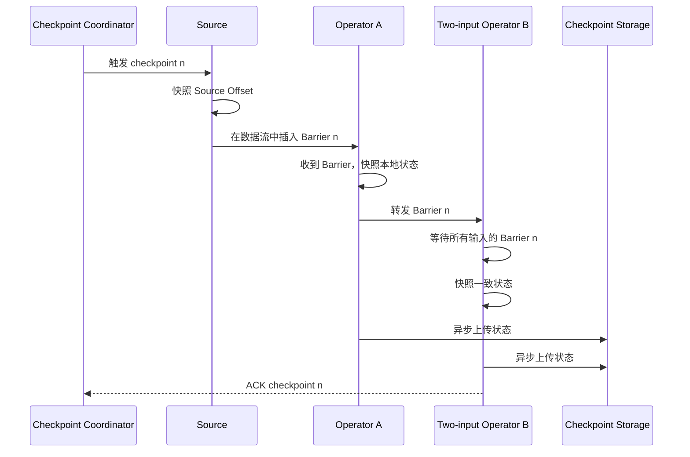

# Flink 状态、Checkpoint 与 Exactly-Once

流式作业不会等全部数据到齐后一次性计算。聚合、Join、去重和规则匹配都需要保存“到目前为止发生了什么”。本章解释这些状态放在哪里、怎样生成一致性快照，以及 Exactly-Once 究竟保证什么。

## 一、为什么流处理必须有状态

以下操作都无法只看当前一条 Record 得出结果：

```text
每个用户累计消费额       -> 保存 userId 对应的累计值
最近 10 分钟是否登录失败  -> 保存时间范围内的事件
订单流与支付流 Join       -> 保存尚未匹配的两侧记录
事件去重                  -> 保存已经见过的 eventId
窗口聚合                  -> 保存窗口的累加器和 Timer
```

状态是计算语义的一部分，而不是普通缓存。缓存丢失可以重算；状态丢失会让结果错误，所以它必须参与故障恢复。

## 二、Keyed State 与 Operator State

| 类型 | 归属 | 典型用途 | 扩缩容方式 |
|---|---|---|---|
| Keyed State | key，物理上由 keyed operator 的 Subtask 托管 | 按用户聚合、去重、窗口、Timer | 按 Key Group 重新分配 |
| Operator State | Operator 的并行实例 | Source 分区、Sink 缓冲、局部资源状态 | 按 List/Union 等语义重新分配 |
| Broadcast State | 广播侧规则 + keyed/non-broadcast 侧事件 | 动态规则、配置分发 | 每个并行实例保留规则副本 |

常见 Keyed State：

- `ValueState<T>`：一个 key 一个值；
- `ListState<T>`：一个 key 一组值；
- `MapState<K,V>`：一个 key 一张 Map；
- `ReducingState<T>` / `AggregatingState<IN,OUT>`：增量聚合；
- Timer：在 Processing Time 或 Event Time 到达时回调。

## 三、一个有状态算子怎样工作

```python
from dataclasses import dataclass
from decimal import Decimal

from pyflink.common.typeinfo import Types
from pyflink.datastream import RuntimeContext
from pyflink.datastream.functions import KeyedProcessFunction
from pyflink.datastream.state import ValueStateDescriptor


@dataclass
class Order:
    user_id: str
    amount: Decimal


@dataclass
class UserTotal:
    user_id: str
    total: Decimal


class TotalAmount(KeyedProcessFunction):
    def open(self, runtime_context: RuntimeContext):
        descriptor = ValueStateDescriptor(
            "total",
            Types.PICKLED_BYTE_ARRAY()
        )
        self.total = runtime_context.get_state(descriptor)

    def process_element(self, order: Order, ctx):
        old_value = self.total.value()
        new_value = (old_value or Decimal("0")) + order.amount

        self.total.update(new_value)
        yield UserTotal(order.user_id, new_value)
```

前提是上游已经执行：

```python
user_totals = (
    orders
    .key_by(lambda order: order.user_id)
    .process(
        TotalAmount(),
        output_type=Types.PICKLED_BYTE_ARRAY()
    )
)
```

运行时在调用 `process_element` 前设置当前 key，所以同一个 `ValueState` 句柄会自动访问不同用户的值。示例用 `PICKLED_BYTE_ARRAY` 简化 `Decimal` 和 Python 数据类的序列化；生产代码也可以根据数据结构声明更明确的 `TypeInformation`。

## 四、State Backend 与 Checkpoint Storage 不是一回事

```text
工作状态（Task 处理每条数据时频繁访问）
        ↓ 由 State Backend 管理
TaskManager 本地 Heap / RocksDB 等

持久快照（故障后用于恢复）
        ↓ 由 Checkpoint Storage 保存
HDFS / S3 / 兼容文件系统等稳定存储
```

| 组件 | 解决的问题 |
|---|---|
| State Backend | 状态在运行期怎样表示和访问 |
| Checkpoint Storage | 状态快照持久化到哪里 |

不要把“使用 RocksDB”理解为已经有远程容灾。TaskManager 本地 RocksDB 随节点丢失后，仍需从外部 Checkpoint/Savepoint 恢复。

### 常见 Backend 取舍

| Backend | 工作状态位置 | 特点 |
|---|---|---|
| HashMapStateBackend | JVM Heap | 访问快、实现直接，但受 Heap 和 GC 约束 |
| EmbeddedRocksDBStateBackend | 本地 RocksDB，主要使用磁盘和 Native Memory | 支持很大状态、可做增量 Checkpoint，但访问和序列化成本更高 |

具体可用 Backend 会随 Flink 版本演进，选型时应查目标版本文档。

## 五、Checkpoint 快照必须包含什么

一个可恢复的一致性快照至少要把以下内容对齐：

```text
Source 读取位置
    +
各 Stateful Operator 的状态
    +
必要的在途数据或 Barrier 边界
    +
Sink 的事务/提交状态
```

只保存 Operator State 而不保存 Kafka Offset，恢复后不知道从哪里重放；只保存 Offset 不保存聚合状态，恢复后累计值会从零开始。

## 六、Checkpoint Barrier 怎样形成一致性快照



Checkpoint 使用异步 Barrier Snapshot 思路：Barrier 将每个输入流划分为“checkpoint n 之前”和“之后”的数据。多输入算子进行 Barrier Alignment，避免把某一路 n 之后的数据和另一路 n 之前的数据混入同一快照。

## 七、同步阶段与异步阶段

一个 Subtask 的 Checkpoint 通常包括：

```text
同步阶段：在 Task 线程中确定快照边界，准备状态快照
        ↓ 应尽量短
异步阶段：后台将快照数据写入持久存储
        ↓ 完成后向 Coordinator ACK
```

如果同步阶段很长，正常 Record 处理会暂停；如果异步阶段或远程存储很慢，Checkpoint duration 会变长并占用更多本地资源。

## 八、Aligned 与 Unaligned Checkpoint

### Aligned Checkpoint

多输入算子先收到某一路 Barrier 后，暂停消费这一路在 Barrier 后的数据，等待其他输入追上。

优点：快照通常不包含大量在途数据，体积较小。缺点：反压时 Barrier 可能长时间无法对齐。

### Unaligned Checkpoint

Barrier 可以越过积压 Buffer，同时把在途数据纳入快照。

优点：反压下 Checkpoint 时间对当前数据积压更不敏感。缺点：快照更大、存储 I/O 和恢复成本更高，而且它不会修复造成反压的慢算子。

选择顺序应是：先定位和处理长期反压，再根据 Checkpoint 指标决定是否启用 Unaligned Checkpoint 或 Buffer Debloating。

## 九、故障恢复的完整过程

假设最近成功的是 Checkpoint 42：

```text
Task 失败
  ↓
JobManager 确定受影响的 Failover Region
  ↓
取消并重新部署相关 Task
  ↓
Source 恢复到 Checkpoint 42 中的 Offset
  ↓
Operator 恢复 Checkpoint 42 中的状态
  ↓
Sink 恢复或处理 Checkpoint 42 对应的事务
  ↓
Source 重放 42 之后的数据
```

故障前已经处理、但尚未包含在成功 Checkpoint 中的数据会被重放。因此“数据是否再次经过用户函数”和“结果是否重复”是两个不同问题。

## 十、Exactly-Once 到底保证什么

Flink 状态的 Exactly-Once 语义表示：故障恢复后，每条事件对 Flink 托管状态的最终影响恰好一次。它不表示物理上每条事件的用户函数永远只调用一次。

端到端 Exactly-Once 还要求：

1. Source 可重放，并能恢复读取位置；
2. Flink 状态使用一致性 Checkpoint；
3. Sink 支持事务性提交或可靠幂等；
4. 用户代码中的额外副作用也纳入事务或具有幂等性。

```text
Flink 内部 Exactly-Once
    ≠
任意外部 HTTP 请求、数据库写入也自动 Exactly-Once
```

如果在 `map` 中直接调用第三方接口，调用成功后 Task 在 Checkpoint 前失败，恢复重放时接口可能再次被调用。

## 十一、Sink 怎样与 Checkpoint 配合

事务型 Sink 的简化流程：

```text
Checkpoint n 之前的数据 -> 写入事务 Tn
收到 Barrier n          -> pre-commit Tn
Checkpoint n 全局成功    -> commit Tn
Checkpoint n 失败        -> abort Tn 或恢复时清理
```

另一条路线是幂等写，例如使用稳定业务主键 `eventId` 做 upsert。但幂等是否真的成立，取决于目标系统的约束、更新语义和并发行为。

## 十二、Checkpoint、Externalized Checkpoint 与 Savepoint

| 类型 | 主要目的 | 触发方式 | 生命周期倾向 |
|---|---|---|---|
| Checkpoint | 自动故障恢复 | 周期触发 | 由 Flink 自动管理和清理 |
| Externalized Checkpoint | 故障恢复并允许取消后保留 | 自动生成、配置保留 | 可由运维人员恢复 |
| Savepoint | 升级、迁移、扩缩容、停止再启动 | 手动触发 | 用户负责管理 |

生产升级时应给有状态 Operator 设置稳定 `uid`。如果拓扑变化导致 Operator 无法映射到原状态，即使 Savepoint 文件存在也可能恢复失败。

## 十三、状态为什么会无限增长

危险示例：为每个见过的 `eventId` 永久保存去重状态。输入持续运行后，状态只增不减。

常用边界：

- State TTL：超过时间后状态可过期；
- Window 生命周期：Watermark 和 allowed lateness 结束后清理；
- Timer 主动清理：业务超时后删除状态；
- 有界 key 空间：明确 key 的最大数量；
- 外部归档：把长期历史放到适合查询的存储，而不是热状态。

TTL 不是业务事件时间窗口的替代品。它通常属于状态保留策略，具体清理时机与语义要按目标版本核对。

## 十四、Checkpoint 诊断顺序

| 现象 | 优先检查 |
|---|---|
| Barrier 到达很慢 | 反压、数据倾斜、慢 Channel |
| Alignment time 高 | 多输入速率差异、反压；评估 Unaligned |
| Async duration 高 | 状态大小、本地磁盘、远程存储吞吐 |
| Checkpoint size 持续增长 | 状态是否缺少 TTL/窗口清理 |
| 恢复很慢 | 快照体积、下载带宽、RocksDB 恢复、并行度 |
| Checkpoint 频繁超时 | 周期过短、超时过小、并发设置或系统长期过载 |
| 容器内存超限 | Heap、Managed/Native Memory、网络和 JVM Overhead |

不要只通过增大 timeout 掩盖问题。先把 Checkpoint duration 拆成 Barrier 传播、对齐、同步快照、异步持久化几个阶段。

## 十五、常见误解

### 开启 Checkpoint 就自动端到端 Exactly-Once

不是。Source 和 Sink 必须支持相应语义，外部副作用也必须处理。

### Exactly-Once 表示 Record 物理上只处理一次

不是。故障后可能重放，保证的是成功恢复后对托管状态和兼容 Sink 的最终效果。

### RocksDB 已把状态安全保存到磁盘，不需要 Checkpoint

本地盘不能替代远程持久快照。TaskManager 或节点丢失后，本地状态可能一起丢失。

### Savepoint 是更快的 Checkpoint

二者目标不同：Checkpoint 优先自动恢复，Savepoint 优先运维可控的迁移和升级。

## 十六、最终心智模型

```text
Keyed/Operator State 保存持续计算的中间结果
        ↓
Checkpoint Barrier 定义全局一致边界
        ↓
State Backend 生成工作状态的快照
        ↓
Checkpoint Storage 持久保存快照
        ↓
故障时恢复 Source Offset + Operator State + Sink 状态
        ↓
重放数据，但最终效果保持所配置的一致性语义
```

## 参考资料

- [Fault Tolerance](https://nightlies.apache.org/flink/flink-docs-stable/docs/learn-flink/fault_tolerance/)
- [State Backends](https://nightlies.apache.org/flink/flink-docs-stable/docs/dev/datastream/fault-tolerance/state_backends/)
- [Checkpointing](https://nightlies.apache.org/flink/flink-docs-stable/docs/dev/datastream/fault-tolerance/checkpointing/)
- [Savepoints](https://nightlies.apache.org/flink/flink-docs-stable/docs/ops/state/savepoints/)
- [Checkpointing under Backpressure](https://nightlies.apache.org/flink/flink-docs-stable/docs/ops/state/checkpointing_under_backpressure/)
