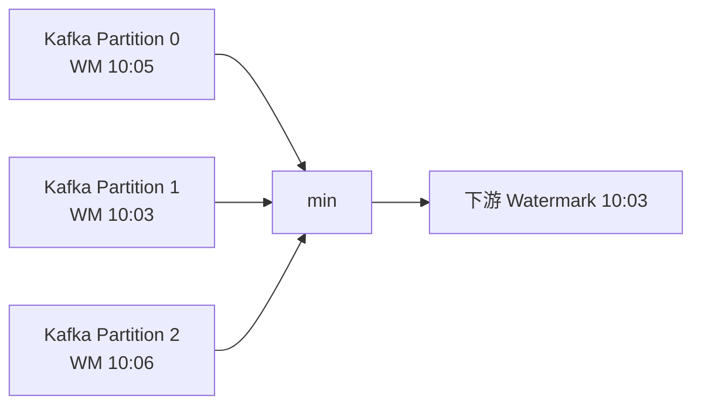
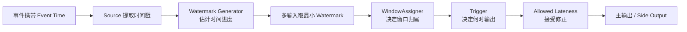

# Flink 事件时间、Watermark 与窗口

无界流没有“全部数据已经到齐”的时刻。要统计每分钟成交额，Flink 必须同时回答：事件属于哪一分钟、什么时候认为这一分钟基本收齐、迟到数据来了怎么办。

## 一、先分清三种时间

| 时间 | 来源 | 优点 | 局限 |
|---|---|---|---|
| Event Time | 事件自身携带的发生时间 | 可处理乱序和历史回放，结果可重复 | 需要 Watermark 和迟到策略 |
| Processing Time | TaskManager 处理事件时的机器时间 | 简单、延迟低 | 受积压、故障和机器时钟影响，回放结果可能变化 |
| Ingestion Time | 进入 Flink 时赋予的时间 | 介于二者之间 | 无法恢复真实业务发生时间，实践中较少作为核心语义 |

例如 10:00 发生的订单因为网络延迟在 10:03 到达：

```text
Event Time      = 10:00
Processing Time = 10:03
```

如果要重算“10:00 到 10:01 的成交额”，应以 Event Time 为准。

## 二、为什么只有时间戳还不够

输入可能是：

```text
事件时间：10:00:01, 10:00:07, 10:00:04, 10:00:12, ...
```

看到 10:00:12 并不能证明 10:00:05 的事件永远不会再来。窗口必须知道“还要等多久”。Watermark 就是流中关于事件时间进度的声明。

Watermark `W=10:00:10` 可以理解为：系统判断时间戳不晚于 10:00:10 的事件应该基本到齐。它是基于策略的进度估计，不是对现实世界的绝对证明。

## 三、Bounded Out-of-Orderness Watermark

常见策略：当前观察到的最大 Event Time 减去允许乱序程度。

```text
maxEventTimeSeen = 10:00:12
outOfOrderness   = 5 秒
watermark        ≈ 10:00:07
```

Java 示例：

```java
WatermarkStrategy<Order> strategy = WatermarkStrategy
    .<Order>forBoundedOutOfOrderness(Duration.ofSeconds(5))
    .withTimestampAssigner((order, previousTimestamp) -> order.eventTime())
    .withIdleness(Duration.ofMinutes(1));

DataStream<Order> orders = env.fromSource(source, strategy, "orders");
```

`withIdleness` 很重要：某个 Source Partition 长时间没有数据时，如果它一直保留旧 Watermark，就可能拖住整个下游时间进度。

## 四、并行流的 Watermark 怎样合并

一个多输入 Task 会取各输入 Channel Watermark 的最小值：

```text
Channel 0 Watermark = 10:05
Channel 1 Watermark = 10:03
Channel 2 Watermark = 10:06
--------------------------------
下游 Operator Watermark = 10:03
```

这样可以避免 Channel 1 中较早的数据被误判为迟到。代价是最慢或空闲的分区会控制整体进度。



这和反压不同：Watermark 不推进可能是某个分区没有事件或时间戳异常，即使 CPU 并不繁忙。

## 五、窗口由四个核心组件组成

```text
keyBy
  ↓
Window Assigner：这条事件属于哪个窗口
  ↓
Trigger：什么时候计算并发出结果
  ↓
Window Function：怎样计算结果
  ↓
Evictor（可选）：计算前后移除哪些元素
```

此外，allowed lateness 决定窗口首次触发后还保留多久，以等待迟到事件。

## 六、常见窗口

### 6.1 Tumbling Window

固定长度、不重叠：

```text
[10:00, 10:05) [10:05, 10:10) [10:10, 10:15)
```

适合每 5 分钟成交额、每小时 UV 等周期指标。

### 6.2 Sliding Window

固定长度，按 Slide 周期启动，可以重叠：

```text
size = 10 分钟, slide = 5 分钟
[10:00,10:10)
      [10:05,10:15)
            [10:10,10:20)
```

一条事件可能属于多个窗口，因此窗口数量、状态和计算成本都会增大。

### 6.3 Session Window

由一段无活动间隔切分：

```text
事件 10:00, 10:02, 10:04 | 空闲超过 5 分钟 | 10:15, 10:16
         Session A                           Session B
```

Session Window 会合并窗口。迟到事件可能连接两段原本分开的 Session，导致 late merge。

### 6.4 Global Window

所有元素进入一个全局窗口，必须配合自定义 Trigger 或其他退出条件，否则不会自然完成。

## 七、窗口何时创建、触发和清理

以 Event Time Tumbling Window `[10:00, 10:05)` 为例：

```text
收到属于该窗口的第一条事件 -> 创建窗口状态
持续收到事件              -> 更新累加器或保存元素
Watermark 越过窗口结束时间 -> EventTimeTrigger 首次触发
继续等待 allowed lateness  -> 迟到但仍允许的事件可能再次触发
Watermark 越过清理时间      -> 清理窗口状态
```

窗口通常按 `[start, end)` 理解，最大时间戳接近 `end - 1ms`。实际触发边界要以目标版本和具体 WindowAssigner/Trigger 实现为准。

## 八、增量聚合与全量窗口函数

### 全量保存

`ProcessWindowFunction` 可以看到窗口内全部元素，但需要保存更多数据：

```text
Window State: [record1, record2, record3, ...]
Watermark 到达后遍历全部元素
```

### 增量聚合

`ReduceFunction` 或 `AggregateFunction` 每来一条就更新累加器：

```text
Window State: accumulator(sum, count)
record 到达 -> accumulator 更新
Watermark 到达 -> 直接输出结果
```

还可以组合增量聚合与 `ProcessWindowFunction`：前者压缩状态，后者读取窗口元信息。

```java
orders
    .keyBy(Order::userId)
    .window(TumblingEventTimeWindows.of(Duration.ofMinutes(1)))
    .aggregate(new SumAmount(), new AddWindowMetadata());
```

## 九、迟到数据到底分几类

不要只用“晚了”一个词：

```text
事件时间落后于当前最大事件时间，但仍领先于 Watermark
    -> 只是乱序，正常处理

事件时间落后于 Watermark，但还在 allowed lateness 内
    -> 迟到事件，可更新窗口并再次触发

事件时间已经超过窗口清理边界
    -> 太迟，丢弃或发送到 Side Output
```

### Allowed Lateness 示例

```java
OutputTag<Order> tooLate = new OutputTag<>("too-late") {};

SingleOutputStreamOperator<Result> result = orders
    .keyBy(Order::userId)
    .window(TumblingEventTimeWindows.of(Duration.ofMinutes(1)))
    .allowedLateness(Duration.ofSeconds(30))
    .sideOutputLateData(tooLate)
    .aggregate(new SumAmount());

DataStream<Order> discarded = result.getSideOutput(tooLate);
```

Allowed lateness 默认通常为 0；迟到事件的确切处理还取决于窗口类型和 Trigger。

## 十、延迟、完整性与状态大小的三角权衡

把 Watermark 设置得更保守：

- 等待更多乱序数据，首次结果更完整；
- 窗口更晚触发，端到端延迟增加；
- 窗口状态保留更久，状态和 Checkpoint 更大。

把 Watermark 设置得更激进：

- 更快输出结果；
- 更多事件会被判定为迟到；
- 需要更新流、Side Output 或离线校正保证业务正确性。

不存在脱离业务 SLA 的“最佳 Watermark”。应根据数据延迟分布，例如 P99/P99.9 到达延迟，结合允许的结果修正方式选择。

## 十一、Watermark 对齐与空闲分区

两个相反的问题：

### 空闲分区拖住 Watermark

一个 Kafka Partition 没有新数据，其 Watermark 不更新，下游取最小值后时间停住。可以使用 Idleness 检测把长期空闲输入暂时排除。

### 快分区跑得过远

不同 Source Split 的 Watermark 差距很大时，快分区可能让下游积累大量等待慢分区的数据。支持的 Source 场景可使用 Watermark Alignment 限制快分区领先幅度。它与 Idleness 解决的是不同方向的问题。

## 十二、Timer 与 Watermark

### Timer 解决什么问题

普通算子通常是“来一条 Record，调用一次处理函数”。如果后面再也没有新 Record 到来，算子就没有机会主动执行代码。但很多流处理逻辑需要表达：

- 订单创建 15 分钟后仍未付款，就输出超时事件；
- 某个设备 5 分钟没有上报数据，就发出离线告警；
- 先保存流 A 的记录，等待流 B；等待期限结束仍未匹配，就输出未匹配结果；
- 定期清理某个 key 已经过期的状态。

**Timer 就是有状态算子为某个 key 设置的“闹钟”。**算子处理当前 Record 时注册一个未来时间点；时间条件满足后，Flink 主动回调 `onTimer`，让算子执行超时判断、输出结果或清理状态。它解决的是“没有新数据触发 `processElement` 时，怎样在未来继续执行逻辑”的问题。

Timer 不是新建一个线程去 `sleep`，也不是让当前 Task 阻塞等待。Flink 只保存 key、触发时间等 Timer 信息；达到触发条件后，仍由 Task 的处理线程执行回调。

### Event Time Timer 怎样由 Watermark 触发

在 `KeyedProcessFunction` 中可以为当前 key 注册 Event Time Timer：

```java
ctx.timerService().registerEventTimeTimer(deadline);
```

其中 `deadline` 是事件时间时间戳。调用这段代码时，Flink 会把 Timer 归属到当前正在处理的 key。例如当前 Record 的 key 是 `order-1001`，注册的就是 `order-1001` 的 Timer；Timer 触发时，`onTimer` 也会在这个 key 的上下文中执行，因此可以读取该订单对应的 Keyed State。

触发链路如下：

```text
收到 order-1001 的订单创建事件，Event Time = 10:00
        ↓
保存“尚未付款”状态
        ↓
为 order-1001 注册 Event Time Timer，deadline = 10:15
        ↓
算子继续处理其他数据，不会停下来等待
        ↓
Operator Watermark 达到或超过 10:15
        ↓
Flink 切换到 order-1001 的 key 上下文并调用 onTimer
        ↓
检查付款状态：仍未付款 → 输出“订单超时”并清理状态
```

这里可以把两者理解为：

```text
Event Time Timer = 标在事件时间轴上的闹钟
Watermark        = 事件时间轴上不断前进的指针
```

Timer 本身不会推进 Watermark，Watermark 也不会自动创建业务 Timer。业务代码负责注册 Timer，Watermark 只负责告诉算子“事件时间大致已经推进到哪里”，从而决定哪些 Event Time Timer 应该触发。

因此，如果某个 Source 分区长期空闲且没有正确配置 Idleness，Operator Watermark 可能停止推进，相应的 Event Time Timer 也会一直不触发。即使机器的真实时间早已超过 10:15，也没有用，因为 Event Time Timer 看的是 Watermark，而不是机器时钟。

### 付款到达时为什么要删除 Timer

如果订单在 10:10 已经付款，就不应该等到 10:15 再产生超时结果。处理付款事件时，需要更新状态并删除之前注册的 Timer：

```java
ctx.timerService().deleteEventTimeTimer(deadline);
```

可以将业务过程概括为：

```text
订单创建：保存待付款状态 + 注册 10:15 Timer

情况 A：10:10 收到付款
        → 标记已付款
        → 删除 10:15 Timer
        → 清理不再需要的状态

情况 B：一直没有收到付款
        → Watermark 到达 10:15
        → onTimer 输出超时结果
        → 清理状态
```

即使不删除 Timer，也可以在 `onTimer` 中再次检查“是否已付款”来避免错误输出；但无用 Timer 仍会占用状态和触发开销，所以业务条件失效后通常应主动删除。

### Event Time Timer 与 Processing Time Timer

| Timer 类型 | 注册方法 | 由什么触发 | 适合表达什么 |
|---|---|---|---|
| Event Time Timer | `registerEventTimeTimer(timestamp)` | Operator Watermark 达到或超过时间戳 | 与数据自身发生时间相关的超时、窗口和乱序处理 |
| Processing Time Timer | `registerProcessingTimeTimer(timestamp)` | TaskManager 机器时钟达到时间戳 | 与运行时等待时长相关的重试、刷新和周期性维护 |

例如“订单在业务时间上 15 分钟未付款”通常使用 Event Time Timer，这样故障恢复、历史数据回放或数据延迟时仍能按订单事件时间计算。“从现在开始每隔 30 秒刷新一次外部连接”则更适合 Processing Time Timer。

### Timer 与窗口是什么关系

使用 Window API 创建事件时间窗口时，开发者不需要手动注册 Timer。数据进入窗口后，窗口算子使用的 `EventTimeTrigger` 会自动在窗口结束位置注册 Event Time Timer；Watermark 推进到该位置后，Timer 到期并调用 Trigger，Trigger 再决定计算和输出窗口结果。

因此，“Watermark 到达窗口结束位置就触发窗口”只是简化说法，内部实际链路是：

```text
数据进入 [10:00, 10:05) 窗口
        ↓
窗口保存聚合状态，EventTimeTrigger 自动注册 Timer
        ↓
Watermark 到达窗口结束时间
        ↓
Timer 触发窗口 Trigger
        ↓
计算并输出窗口结果，之后按清理规则删除状态
```

这里不是 Watermark 和 Timer 分别触发一次窗口，而是 Watermark 通过已注册的 Timer 唤醒 Trigger。只有使用 `KeyedProcessFunction` 实现订单超时、双流等待等自定义时间逻辑时，才需要开发者显式注册和删除 Timer。

Timer 同样属于状态和 Checkpoint 的一部分。成功 Checkpoint 后发生故障，恢复出的 Timer 仍应在相应的事件时间或处理时间条件满足时触发。同一个 key 在同一个时间戳重复注册 Timer，Flink 会将其合并为一个 Timer；不同 key 的同一时间戳仍是不同 Timer。

大量 key 同时注册同一时刻的 Timer，可能造成瞬间 CPU 峰值和反压。设计时要评估 Timer 数量、分布和清理。

## 十三、怎样调试窗口没有输出

按下面顺序检查：

1. Record 是否有正确 Event Timestamp；
2. WatermarkStrategy 是否真正赋给 Source；
3. 各 Source Partition 是否都在推进 Watermark；
4. 是否存在空闲分区且没有配置 Idleness；
5. 下游 `currentInputWatermark` 指标停在哪里；
6. 窗口结束时间和时区是否符合预期；
7. 作业是否反压严重，导致 Watermark/Record 传播缓慢；
8. 数据是否已被视为太迟并进入 Side Output；
9. 自定义 Trigger 是否覆盖了默认 EventTimeTrigger 行为。

## 十四、常见误解

### Watermark 是系统当前时间

不是。它表示 Event Time 的处理进度，由数据和 WatermarkStrategy 推导。

### Watermark 之前绝对不会再有数据

不是。Watermark 是策略性声明；更晚到达的数据会按迟到策略处理。

### 乱序数据就是迟到数据

不是。只要没有落后于当前 Watermark，乱序事件仍可正常进入窗口。

### Window 触发后立即删除

不一定。配置 allowed lateness 后，窗口状态会继续保留并可能 late firing。

### 增大 allowed lateness 会让首次结果更完整

不一定。首次触发仍由 Watermark 决定；allowed lateness 主要允许首次触发后的修正。

### Processing Time Window 更接近真实业务时间

通常不是。它更接近机器实际处理时刻，积压或重放会改变窗口归属。

## 十五、完整的事件时间链路



## 十六、最终心智模型

```text
Event Timestamp：这条业务事件何时发生
Watermark：系统认为 Event Time 已经推进到哪里
Window Assigner：事件属于哪些有限计算范围
Trigger：何时对窗口求值
Allowed Lateness：首次求值后还接受多久的迟到修正
Side Output：如何保留太迟、不能进入窗口的数据
```

窗口计算的正确性不是只由窗口大小决定，而是由时间戳、Watermark、Trigger、迟到策略和状态清理共同决定。

## 参考资料

- [Streaming Analytics: Event Time and Windows](https://nightlies.apache.org/flink/flink-docs-stable/docs/learn-flink/streaming_analytics/)
- [Builtin Watermark Generators](https://nightlies.apache.org/flink/flink-docs-stable/docs/dev/datastream/event-time/built_in/)
- [Debugging Windows & Event Time](https://nightlies.apache.org/flink/flink-docs-stable/docs/ops/debugging/debugging_event_time/)
