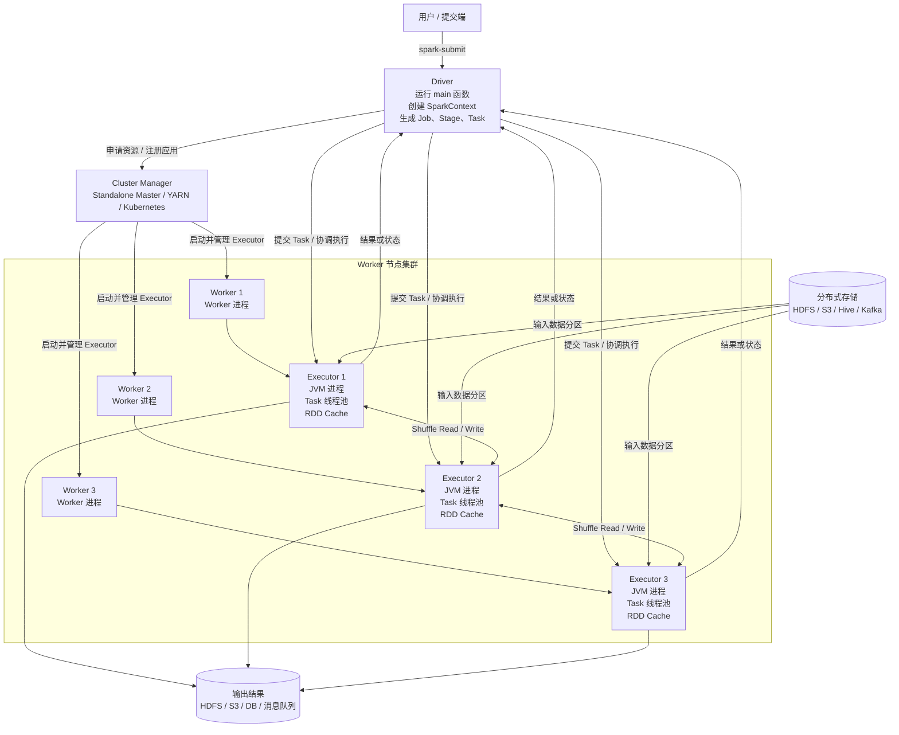
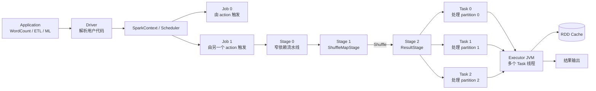
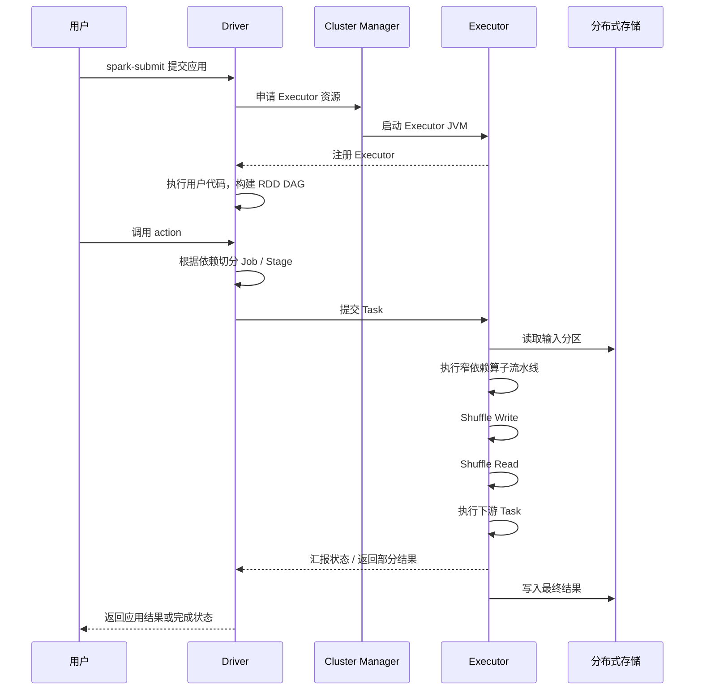

# 运行中的 Spark 程序架构图

下面以 Standalone 模式为例，展示一个 Spark Application 正在运行时，各组件之间的关系。

## 一、Spark 集群架构



## 二、一个正在运行的 Spark Application



## 三、运行时序



## 四、架构中最容易混淆的关系

| 概念 | 作用 |
|---|---|
| Application | 用户提交的完整 Spark 程序 |
| Driver | 运行 `main`、创建 SparkContext、生成和协调任务 |
| Cluster Manager | 管理集群资源并启动 Executor |
| Worker | 集群节点上的管理进程，负责启停 Executor |
| Executor | 运行在 Worker 上的 JVM 进程，执行 Task、保存缓存 |
| Job | 一个 action 触发的一次计算作业 |
| Stage | 由依赖关系切分出的执行阶段 |
| Task | 处理一个数据分区的最小执行单元 |
| RDD | 分区数据、计算逻辑和依赖关系的抽象 |

## 五、观察一个运行中的程序时应该看什么

```text
Application
 ├─ Driver 是否正常运行
 ├─ Job 数量：通常对应 action 数量
 ├─ Stage 数量：重点看 Shuffle 边界
 ├─ Task 数量：通常对应 Stage 最终 RDD 的 partition 数
 ├─ Executor 数量与 CPU/内存
 ├─ Shuffle Read / Write
 ├─ Cache 命中和存储空间
 ├─ GC 时间与 OOM
 └─ 是否存在数据倾斜或长尾 Task
```

一句话总结：Driver 负责“想清楚要做什么并协调执行”，Executor 负责“真正处理分区数据”，Cluster Manager 负责“分配集群资源”，而 RDD、Stage、Task 和 Shuffle 共同构成 Spark 的实际执行链路。

---

## 六、从大数据处理框架理解 Spark

前面的架构图描述了 Spark 在运行时有哪些组件。要理解这些组件为什么这样分工，还需要把 Spark 放回大数据处理框架的整体层次中。

### 6.1 一个大数据应用由三部分组成

```text
大数据应用
    ├─ 输入数据
    ├─ 用户代码
    └─ 运行配置
```

#### 输入数据

批处理数据通常已经存放在 HDFS、对象存储或 Hive 中，并被划分为多个文件块和输入分区；流处理数据可能来自 Kafka 等系统，以微批或连续记录进入计算引擎。

数据量通常远大于一台机器的内存和磁盘容量，因此框架不能把所有数据先集中到 Driver。它需要把输入映射成多个 partition，让不同 Executor 上的 Task 并行读取和处理。

#### 用户代码

用户既可以使用 RDD 编写底层 transformation，也可以使用 SQL、DataFrame、机器学习库和图计算库。高层 API 最终仍要转化成分区上的物理计算。

Driver 负责运行用户程序并组织计算，Executor 才是处理大规模数据的主要位置。Driver 可以生成少量配置和广播数据，也可以汇总较小结果，但不应该成为全部数据的中转站。

#### 运行配置

配置可以分为两类：

- 资源配置：Executor 数量、CPU core、内存、堆外空间等；
- 数据流配置：输入分块、Shuffle 分区数、Partitioner、缓存级别等。

资源配置决定同一时间能运行多少 Task、每个 Executor 有多少内存；数据流配置决定数据如何被切分和移动。两者必须结合数据规模和分布分析，不能只靠增大内存解决所有问题。

### 6.2 大数据处理框架的四层结构

```text
用户层
  用户代码、SQL、算法库、配置
        ↓
分布式数据处理层
  RDD/DataFrame、DAG、Dependency、Stage
        ↓
资源管理和任务调度层
  Cluster Manager、DAGScheduler、TaskScheduler
        ↓
物理执行层
  Worker、Executor、Task、内存、磁盘和网络
```

#### 用户层

用户表达“要计算什么”，例如过滤日志、按 key 聚合或训练模型。这个层次不应该要求用户手动指定每条 record 在哪台机器执行。

#### 分布式数据处理层

Spark 把数据表示成 RDD 或 DataFrame，把 transformation 表示成依赖关系和计算计划，再决定哪些算子可以流水线执行、哪些位置必须 Shuffle。

这里的对象具有不同职责：

```text
RDD/DataFrame：描述分布式数据和计算
DAG：描述算子或 RDD 的依赖关系
Stage：Shuffle 边界之间的一段物理计算
Task：一个 Stage 对一个 partition 的执行实例
```

#### 资源管理和任务调度层

Cluster Manager 解决“这个 Application 可以获得多少 CPU 和内存”；Spark 调度器解决“当前应该运行哪个 Stage，以及每个 Task 应该放到哪个 Executor”。

资源调度还要考虑公平性、优先级、数据本地性和失败重试。资源已经分配并不意味着所有 Task 都能同时运行：如果一个 Executor 有 4 个可用 core，通常只能并发运行相应数量的 Task，其余 Task 等待 slot。

#### 物理执行层

Executor 真正读取分区、执行函数、申请内存、写 Shuffle、发生 spill 并输出结果。Task 的内存消耗主要来自：

1. Shuffle、排序、聚合和 Join 使用的 execution memory；
2. persist/cache 使用的 storage memory；
3. 用户代码创建的对象、集合和第三方库内存；
4. PySpark 场景中的 Python Worker 内存。

OOM、长时间 GC、严重 spill 和长尾 Task，最终都要回到这一层结合具体 partition 进行分析。

### 6.3 Spark 与 Hadoop MapReduce 的关键差异

| 维度 | Hadoop MapReduce | Spark |
|---|---|---|
| 计算表达 | 以 Map—Shuffle—Reduce 固定流程为主 | 通过 DAG 表达多阶段计算 |
| 中间数据 | 阶段间更依赖磁盘 | 窄依赖可流水线，数据可缓存，必要时 spill |
| 执行进程 | Task 通常使用独立 JVM | Executor JVM 长期存在并运行多个 Task 线程 |
| 迭代计算 | 多轮作业常反复读取和写入存储 | 可缓存反复使用的数据 partition |
| 任务组织 | Map Task 和 Reduce Task 边界相对固定 | 根据 ShuffleDependency 动态切分 Stage |
| 容错基础 | 重跑失败 Task，依赖持久化中间结果 | 通过 lineage、缓存、Shuffle 和 checkpoint 恢复 |

Spark 并不是“所有数据都在内存中”。它的核心优势是：可以让窄依赖算子流水线执行，可以显式复用缓存，同时在内存不足时使用磁盘 spill。Shuffle 输出仍然通常需要物化。

---

## 七、Spark 的部署方式与 Application 运行流程

### 7.1 常见部署方式

Spark 的计算模型基本不随部署方式改变，变化的是谁管理 Worker 资源、在哪里启动 Driver 和 Executor。

| 部署方式 | 资源管理者 | 适用理解 |
|---|---|---|
| Local | 本机 Spark 进程 | 开发和测试，没有真实多机资源调度 |
| Standalone | Spark Master/Worker | Spark 自带的集群资源管理方式 |
| YARN | ResourceManager/NodeManager | Hadoop 生态中常见 |
| Kubernetes | Kubernetes 控制面和 Pod | 容器化部署和弹性资源管理 |

无论运行在哪种环境，核心关系仍然是：

```text
Cluster Manager 分配资源并启动 Executor
Driver 创建并调度 Task
Executor 执行 Task
分布式存储提供输入和接收输出
```

Driver 不等于 Standalone Master 或 YARN ResourceManager：

- Driver 属于某一个具体 Application；
- Cluster Manager 面向整个集群和多个 Application；
- Driver 负责计算调度；
- Cluster Manager 负责资源分配和进程生命周期。

### 7.2 Client 和 Cluster 模式主要区别 Driver 在哪里

在 client 模式中，Driver 通常运行在提交命令所在机器；在 cluster 模式中，Driver 由集群管理器放到集群内部运行。

```text
Client mode：
提交端同时运行 Driver ──> 集群中的 Executor

Cluster mode：
提交端只提交应用 ──> 集群内部 Driver ──> 集群中的 Executor
```

Driver 的位置会影响客户端断开后的应用生命周期、日志查看方式以及 Driver 与 Executor、数据源之间的网络距离，但不会改变 Job、Stage、Task 的基本层级。

### 7.3 为什么 Executor 使用线程反复运行 Task

如果每个 Task 都启动一个新 JVM，会反复承担进程启动、类加载和运行环境初始化成本，也不容易在 Task 之间复用缓存。

Spark 先为 Application 启动长期存在的 Executor，再在线程池中运行多个 Task：

```text
Executor JVM
    ├─ TaskRunner 线程：Task 0
    ├─ TaskRunner 线程：Task 1
    ├─ TaskRunner 线程：Task 2
    ├─ BlockManager：RDD/广播/Shuffle block
    └─ Execution/Storage Memory
```

这样可以复用 JVM、网络连接和缓存。代价是多个 Task 会竞争同一个 Executor 的 CPU、内存和磁盘，一个 Task 创建过大的对象或导致严重 GC，也可能影响同一 Executor 中的其他 Task。

### 7.4 Transformation 只构建计划，Action 才触发 Job

以下代码中，textFile、flatMap 和 filter 只构建 RDD 及其依赖：

```python
lines = sc.textFile("hdfs:///logs")
words = lines.flatMap(lambda line: line.split())
valid = words.filter(lambda word: len(word) > 3)
```

此时通常还没有真正扫描 HDFS。调用 Action 后才提交 Job：

```python
count = valid.count()
```

惰性计算使 Driver 能在执行前看到一段完整依赖链，从而：

- 把连续窄依赖放入同一个 Stage；
- 在 ShuffleDependency 处切分 Stage；
- 跳过最终结果不需要的计算；
- 根据最终 RDD 的 partition 创建 Task。

### 7.5 为什么一个 Application 可以有多个 Action

Application、Job、Stage 和 Task 是逐层包含关系，不是一一对应：

```text
Application
  ├─ Action 1 → Job 0
  │              ├─ Stage 0
  │              └─ Stage 1
  ├─ Action 2 → Job 1
  │              └─ Stage 2
  └─ Action 3 → Job 2
                 ├─ Stage 3
                 └─ Stage 4
```

一次 Application 是一次完整程序运行。Driver 启动后可以连续提出多个结果需求；每调用一次 Action，通常就触发一个新的 Job。

```python
rdd = sc.textFile("hdfs:///input")
words = rdd.flatMap(lambda line: line.split())
valid = words.filter(lambda word: len(word) > 3)

count = valid.count()                       # Action 1，Job 0
sample = valid.take(10)                     # Action 2，Job 1
valid.saveAsTextFile("hdfs:///output")      # Action 3，Job 2
```

如果没有缓存，三个 Job 都可能沿 lineage 重新读取和计算 valid。需要复用时可以：

```python
valid.cache()

valid.count()                    # 第一次计算并物化缓存
valid.take(10)                   # 尽量读取缓存
valid.saveAsTextFile("output")   # 尽量读取缓存
```

cache 本身也是惰性的；第一次 Action 才会真正计算并缓存各 partition。

### 7.6 从代码到集群执行的完整链路

```text
1. spark-submit 提交 Application
        ↓
2. 启动 Driver，创建 SparkContext/SparkSession
        ↓
3. Driver 向 Cluster Manager 申请资源
        ↓
4. Worker 上启动 Executor，Executor 向 Driver 注册
        ↓
5. 用户代码调用 transformations，构建 RDD DAG
        ↓
6. Action 触发一个 Job
        ↓
7. DAGScheduler 从最终 RDD 反向遍历 Dependency
        ↓
8. 窄依赖留在当前 Stage，ShuffleDependency 切分 Stage
        ↓
9. 每个 Stage 根据 partition 创建 Task
        ↓
10. TaskScheduler 根据资源和本地性选择 Executor
        ↓
11. Executor 在线程中执行 Task
        ↓
12. ShuffleMapTask 写中间数据，下游 Task 拉取并继续
        ↓
13. ResultTask 返回小结果或写入外部存储
        ↓
14. Driver 汇总状态；还可以继续触发下一个 Action/Job
```

### 7.7 为什么不是每个算子创建一个 Task

如果每个 map、filter 都单独生成 Task：

- Task 调度和启动次数会急剧增加；
- 每个算子之间都需要物化或传输中间数据；
- 无法利用 iterator 流水线；
- 故障和状态管理会更加复杂。

Spark 将连续窄依赖算子放进同一个 Stage 的 Task：

```text
一个 Task：read → map → filter → flatMap → Shuffle Write
```

只有 Shuffle 这种需要重新分区和跨 Task 交换数据的位置，才要求物化上游结果并切断 Stage。

### 7.8 用 Spark UI 验证运行结构

| 页面 | 主要观察内容 |
|---|---|
| Applications | Application 是否仍在运行、Driver 信息 |
| Jobs | 每个 Action 触发了哪些 Job |
| Job Details | Job 包含哪些 Stage 以及它们的依赖 |
| Stages | Task 数量、输入输出、Shuffle、spill、GC 和长尾 |
| Executors | 各 Executor 的 core、内存、Task、缓存和失败情况 |
| Storage | 被缓存的 RDD/DataFrame partition 及占用空间 |
| SQL | SQL/DataFrame 的逻辑计划、物理计划和运行指标 |

如果某个 Stage 有 100 个 Task，通常表示该 Stage 要计算 100 个 partition。出现 Shuffle Write 表示该 Stage 在为下游重新分区；出现 Shuffle Read 表示当前 Stage 正在读取上游 Map 输出。

### 7.9 追加内容总结

```text
大数据应用
= 输入数据 + 用户代码 + 运行配置

Spark 分层
= 用户表达计算
  → RDD/DataFrame 与 DAG
  → 资源管理和任务调度
  → Executor 物理执行

运行层级
= 一个 Application
  → 多个 Action/Job
  → 每个 Job 包含一个或多个 Stage
  → 每个 Stage 按 partition 创建 Task

部署层级
= Cluster Manager 管资源
  + Driver 管计算
  + Executor 跑 Task
```

---

## 八、Executor 内存管理机制

前面的架构图显示，一个 Executor JVM 会并发运行多个 Task，并同时保存缓存和 Shuffle 数据。这些对象共享 Executor 进程，因此内存管理要解决两个问题：不同用途怎样划分空间，以及多个 Task 怎样竞争空间。

### 8.1 Executor 内存消耗来自哪里

```text
Executor 内存
    ├─ Spark 执行数据
    │    Shuffle buffer、HashMap、排序、Join 和聚合状态
    ├─ Spark 存储数据
    │    RDD/DataFrame 缓存、广播 block、部分 TaskResult
    └─ 用户与进程外数据
         用户对象、第三方库、off-heap、Python Worker
```

这些消耗随 Task 输入和算子动态变化。Executor 能并发的 Task 越多，每个 Task 能获得的平均执行内存通常越少。

### 8.2 从静态划分到统一内存管理

早期 Spark 将 Execution 和 Storage 划为相对固定的区域：

```text
[ Execution 固定区域 ][ Storage 固定区域 ][ User ]
```

可能出现 Execution 已满并不断 spill，而 Storage 仍然空闲；或者缓存无法写入，但 Execution 当前没有使用。

Spark 1.6 以后默认使用 Unified Memory Manager：

```text
Executor JVM Heap
    ├─ Reserved Memory
    │    Spark 内部保留空间
    ├─ User Memory
    │    用户对象和未被 Spark 精确管理的对象
    └─ Unified Framework Memory
         ├─ Execution Memory
         └─ Storage Memory
```

Execution Memory 主要服务于 Shuffle、排序、聚合和 Join；Storage Memory 主要保存 persist/cache、广播和部分 block。两者在规则范围内共享空间。

### 8.3 Execution 与 Storage 怎样互相影响

```text
Storage 使用当前空闲空间保存缓存
                  ↓
运行中的 Task 需要更多 Execution Memory
                  ↓
可以驱逐部分可重算缓存
                  ↓
仍然不足时，排序和聚合结构 spill 到本地磁盘
```

| 内存类别 | 空间不足时的典型处理 |
|---|---|
| Execution Memory | spill 中间结果，仍无法运行时可能 OOM |
| Storage Memory | 驱逐缓存、按 StorageLevel 写磁盘或放弃缓存 |
| User Memory | Spark 难以精确控制，过大时可能直接 OOM |

缓存可以借用当前空闲的执行空间，但不能保证这部分空间长期属于缓存。正在运行的计算需要内存时，可重算 blocks 可能被驱逐。

### 8.4 多个 Task 的内存竞争

同一 Executor 中的活跃 Tasks 共享 Execution Memory。Spark 会限制单个 Task 无限占用，使其他 Tasks 仍有机会获得空间。

```text
相同 Executor 内存：

2 个并发 Tasks → 单 Task 通常可获得较大份额
8 个并发 Tasks → 单 Task 份额下降，更容易 spill
```

所以增加 executor.cores 不一定更快。并发 Task 增加后，CPU、内存、GC 和本地磁盘竞争也会增加。应同时考虑 Executor 数量、每个 Executor 的 core、内存和单个 partition 大小。

### 8.5 Shuffle 为什么特别消耗内存

Shuffle Write 可能维护：

- 按 partitionId 缓冲的 records；
- map-side combine 的聚合 Map；
- key 排序结构；
- 序列化 pages 和指针数组。

Shuffle Read 可能维护：

- 网络 fetch buffers；
- Reduce 端聚合 Map；
- 排序和归并结构；
- 同时到达的多个远程 blocks。

内存压力可以概括为：

```text
单 Task 输入量
+ key 基数和聚合状态大小
+ 排序要求
+ 数据倾斜
+ Executor 并发 Task 数
```

热点 key 让一个 partition 远大于其他 partitions 时，即使集群总内存很多，负责该 partition 的单个 Task 仍可能大量 spill 或 OOM。

### 8.6 Serialized Shuffle 为什么能减少 GC

普通 JVM 对象包含对象头、引用和对齐空间，实际内存可能远大于字段本身。Serialized Shuffle 把 records 写入连续 memory pages，并用指针记录 partitionId、page 和 offset：

```text
Pointer
    ├─ partitionId
    ├─ page 编号
    └─ offset/length

Memory Pages
    └─ 连续的序列化 record bytes
```

排序时主要移动指针，不必移动大量 Java 对象，可以减少对象和 GC、改善连续内存访问，并支持部分堆外路径和按 page spill。

代价是序列化 CPU 和适用条件限制。需要 map-side combine 或特殊排序语义时，不一定能使用最简单的序列化路径。

### 8.7 堆外内存不等于没有内存问题

堆外内存减少 JVM GC 管理的对象，但仍然有限。Executor 还可能因为以下原因退出：

- off-heap 不足；
- Python Worker OOM；
- Arrow、NumPy、RocksDB 等 native memory 过大；
- 容器总内存超限；
- memory overhead 不足。

操作系统、YARN 或 Kubernetes 观察的是进程总内存，不只是 JVM Heap。PySpark 中还要把 Python Worker 纳入容量规划。

### 8.8 TaskResult 和 collect

较大的 TaskResult 可能先由 Executor BlockManager 保存，再由 Driver 间接获取。但 collect 最终仍会把所有 records 放入 Driver：

```text
多个 Executor 的大量 records
        → collect
        → Driver 集中持有
        → 可能 Driver OOM
```

Executor 内存充足不代表 collect 安全。大结果应写入分布式存储，或者先在 Executor 聚合，只返回小结果。

### 8.9 内存问题的诊断顺序

1. 只有少数 Task 特别大：优先检查数据倾斜；
2. 所有 Task 都很大：检查 partition 数是否太少；
3. 检查 key 基数和聚合状态大小；
4. 检查是否缓存了不再使用的数据；
5. 检查 Executor core 是否过多，导致单 Task 内存份额过小；
6. 查看 GC Time、Spill、Shuffle Read/Write 和 Peak Execution Memory；
7. 检查 Python Worker、off-heap 和 memory overhead；
8. 检查是否 collect 大量数据；
9. 检查用户函数是否把整个 partition 转成 list、dict 或 Pandas DataFrame。

常见改进包括调整 partition、处理热点 key、使用 map-side combine、及时 unpersist、减少单 Executor core、使用紧凑或序列化数据结构，以及避免大 collect。增加内存应建立在数据流和指标分析之后。

### 8.10 内存管理总结

```text
Executor 内存压力
= 用户对象
  + Shuffle/Join/聚合数据
  + RDD 和广播缓存
  + TaskResult
  + Python/native/off-heap 内存

统一内存管理
= Execution 与 Storage 共享框架空间

Execution 不足
→ 必要时驱逐可重算缓存
→ 仍不足则 spill

Storage 不足
→ 驱逐、写磁盘或放弃缓存

User/native 内存不足
→ Spark 难以通过 spill 自动解决，可能直接 OOM
```
