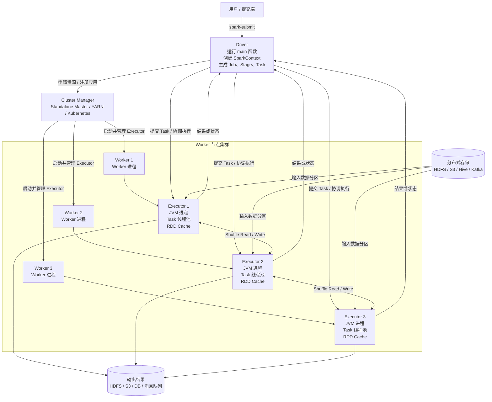
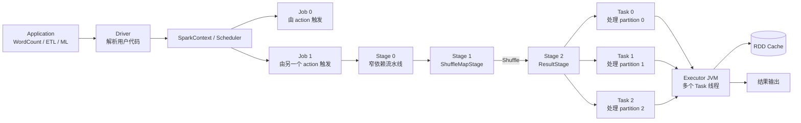
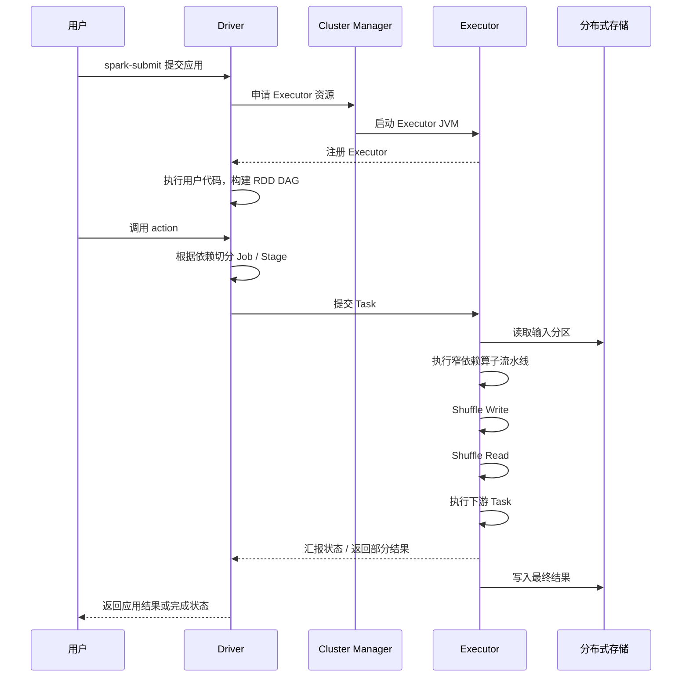

# 运行中的 Spark 程序架构图

下面以 Standalone 模式为例，展示一个 Spark Application 正在运行时，各组件之间的关系。

## 一、Spark 集群架构



## 二、一个正在运行的 Spark Application



## 三、运行时序



## 四、架构中最容易混淆的关系

| 概念 | 作用 |
|---|---|
| Application | 用户提交的完整 Spark 程序 |
| Driver | 运行 `main`、创建 SparkContext、生成和协调任务 |
| Cluster Manager | 管理集群资源并启动 Executor |
| Worker | 集群节点上的管理进程，负责启停 Executor |
| Executor | 运行在 Worker 上的 JVM 进程，执行 Task、保存缓存 |
| Job | 一个 action 触发的一次计算作业 |
| Stage | 由依赖关系切分出的执行阶段 |
| Task | 处理一个数据分区的最小执行单元 |
| RDD | 分区数据、计算逻辑和依赖关系的抽象 |

## 五、观察一个运行中的程序时应该看什么

```text
Application
 ├─ Driver 是否正常运行
 ├─ Job 数量：通常对应 action 数量
 ├─ Stage 数量：重点看 Shuffle 边界
 ├─ Task 数量：通常对应 Stage 最终 RDD 的 partition 数
 ├─ Executor 数量与 CPU/内存
 ├─ Shuffle Read / Write
 ├─ Cache 命中和存储空间
 ├─ GC 时间与 OOM
 └─ 是否存在数据倾斜或长尾 Task
```

一句话总结：Driver 负责“想清楚要做什么并协调执行”，Executor 负责“真正处理分区数据”，Cluster Manager 负责“分配集群资源”，而 RDD、Stage、Task 和 Shuffle 共同构成 Spark 的实际执行链路。

