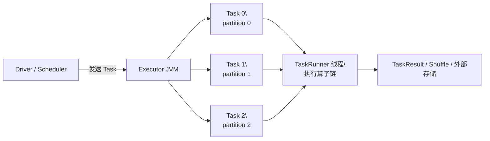

# Executor 执行 Task 是什么？

## 1. 先给结论

一次 Spark Task 执行，可以概括为：

```text
Driver 根据 Stage 创建 Task
    ↓
Task 带着 partition 编号、执行链和运行参数发送到 Executor
    ↓
Executor 反序列化 Task，在 TaskRunner 线程中执行
    ↓
通过 RDD 的 iterator/compute 获取当前 partition 的数据
    ↓
沿着窄依赖执行算子；遇到 Shuffle 则读取或写入 Shuffle 数据
    ↓
输出 TaskResult、Shuffle 文件或外部存储结果
```

Task 不是把整个应用重新执行一次，也不是一段脱离上下文的随机代码。它是“某个 Stage 对某个 partition 的一次执行实例”。同一个 Stage 中的 Task 通常执行相同的算子链，只是处理的 partition 不同。

## 2. Executor、Task 和线程



- Executor 是运行在 Worker 节点上的 JVM 进程。
- 一个 Executor 可以并发运行多个 Task。
- 并发数通常受 executor.cores 和资源调度限制。
- 一个 Task 通常由一个 TaskRunner 线程执行。
- 同一 Executor 中的 Task 共享 JVM 进程、BlockManager 和部分内存资源。

## 3. Task 中携带什么

概念上可以抽象为：

```python
Task(
    stage_id=2,
    partition_id=5,
    attempt_number=0,
    execution_chain=...,       # 要执行的 RDD/算子链
    serialized_function=...,   # 用户函数及其闭包
    dependencies=...,          # 窄依赖或 Shuffle 依赖
    task_context=...,          # 指标、取消状态、重试信息
    output_mode="result",      # result / shuffle / external
)
```

真实实现还会携带序列化器、广播变量引用、分区器、Shuffle 元数据和本地化信息等。重点是：Task 携带“执行什么、处理哪个分区、如何找到输入”的信息，而不是携带整个数据集。

## 4. Executor 如何获得用户代码

用户代码先在 Driver 端构建 RDD 或 DataFrame 的计算计划。当 Action 触发 Job 后，Driver 会把需要的用户函数、闭包变量、依赖包和 Task 元数据序列化，并随 Task 发送给 Executor。

```python
offset = 10
result = rdd.map(lambda x: x + offset)
```

这里的闭包不仅包含 lambda 函数，也包含它引用的 offset=10。Executor 反序列化后，就可以调用这个函数。

依赖包通常通过 JAR、Python 文件、依赖分发机制或容器镜像预先提供给 Executor；Task 传递的是函数和运行信息，不是每次都把整个应用源代码重新发送一遍。

### PySpark 的额外一层

PySpark 通常是 JVM Executor 管理 Task，再启动或复用 Python Worker 执行 Python 函数：

```text
JVM Executor
    → Python Worker
    → 传递序列化后的函数、变量和记录
    → Python Worker 执行 map/filter 等 Python 逻辑
    → 结果序列化回 JVM Executor
```

因此 PySpark 还有 Python Worker、进程通信和 Python 序列化的开销；使用 Arrow 的场景会改变批量传输方式，但不改变“Executor 调度、Python Worker 执行用户函数”的基本关系。

## 5. Executor 如何确定执行哪部分代码

它不是在 Executor 上重新分析完整的用户程序，而是 Driver 已经提前完成了主要工作：

1. 用户调用 transformation，Driver 构建 RDD DAG。
2. Action 触发 Job。
3. DAGScheduler 根据依赖关系和 Shuffle 边界划分 Stage。
4. 每个 Stage 根据其输出 partition 数量生成 Task。
5. Task 携带 partition_id 和该 Stage 对应的执行链。
6. Executor 只执行当前 Task 对应的 partition 和执行链。

例如：

```python
rdd2 = rdd1.map(f).filter(g).flatMap(h)
count = rdd2.count()
```

如果中间没有 Shuffle，且 rdd1 有 3 个 partition，可能形成 3 个 Task：

```text
Task 0：读取 partition 0，执行 f → g → h
Task 1：读取 partition 1，执行 f → g → h
Task 2：读取 partition 2，执行 f → g → h
```

每个 Task 的代码逻辑相同，输入 partition 不同。

## 6. 数据如何进入 Task

Task 通常只携带“如何定位数据”的描述，数据由 Executor 在执行时读取。

### 6.1 输入数据

对于 HDFS、对象存储或本地文件，输入 RDD 的 partition 通常对应一个或多个 input split：

```text
文件 / 数据块
    → input split
    → 输入 RDD 的 partition
    → Task 根据 partition 描述读取对应范围
```

调度器会尽量考虑数据本地性，让 Task 在数据所在节点读取，减少网络传输。

### 6.2 窄依赖

map、filter、flatMap 等算子通常是窄依赖。当前 partition 可以直接找到少量 parent partition，并在同一个 Task 内通过迭代器连续计算，中间结果不必完整落盘。

```python
def pipeline(partition_id):
    records = read_input_split(partition_id)
    for record in records:
        value = record + 1       # map
        if value % 2 == 0:       # filter
            yield value
```

中间 RDD 更多是逻辑描述，数据可以表现为 iterator；当前记录处理完后即可交给下一个算子，降低内存压力。

### 6.3 缓存数据

如果 RDD 被缓存，Executor 会先查询 BlockManager：

```text
本地 Executor 缓存
    ↓ 未命中
其他 Executor 缓存
    ↓ 未命中
根据 lineage 重新计算
```

缓存的是某个 RDD 的某个 partition 的物理数据，不是抽象意义上的整个 RDD。

### 6.4 Shuffle 数据

遇到 groupByKey、reduceByKey、join 等需要重新分区的操作时，会形成 Shuffle 边界：

- 上游 ShuffleMapTask 读取自己的输入 partition，按分区器把结果写入不同的 Shuffle 分区。
- 下游 Task 读取属于自己的 reduce partition，进行聚合、排序或后续计算。
### 6.5 Shuffle 的上游写入与下游拉取

逻辑上，Shuffle 会形成一个宽依赖：下游 RDD 的一个 partition 依赖多个上游 RDD partition 的部分数据。以 reduceByKey 为例：

```text
上游 RDD：每个 partition 中有任意 key-value 记录
        ↓ ShuffleDependency
下游 ShuffledRDD：每个 partition 保存一部分 key 的全部记录
```

物理上，Spark 会把这条边分成两个阶段：

```text
Stage 0：ShuffleMapStage
  上游 Task 0 ─┐
  上游 Task 1 ─┼─ 按 key 分区并写 Shuffle block
  上游 Task 2 ─┘
                    ↓
Stage 1：ResultStage
  下游 Task 0：拉取所有上游 Task 的 Shuffle partition 0
  下游 Task 1：拉取所有上游 Task 的 Shuffle partition 1
  下游 Task 2：拉取所有上游 Task 的 Shuffle partition 2
```

Driver 先根据 ShuffleDependency 划分 Stage，运行上游 ShuffleMapTask 并确认 Shuffle 输出可用，再调度下游 Task。下游 Task 执行时，通过 Shuffle 元数据定位并拉取属于自己的数据。

## 7. 以 reduceByKey 为例看完整过程

示例代码：

```python
input_rdd = sc.parallelize([
    ("a", 1), ("b", 1), ("a", 2), ("c", 1),
], 2)

result = input_rdd.reduceByKey(lambda x, y: x + y, numPartitions=2)
result.collect()
```

假设输入有两个 partition：

```text
输入 partition 0：("a", 1), ("b", 1)
输入 partition 1：("a", 2), ("c", 1)
```

### 第一步：Driver 构建依赖和 Stage

reduceByKey 会创建一个带 ShuffleDependency 的下游 RDD。由于 numPartitions=2，下游有两个 reduce partition。Driver 因此生成：

```text
Stage 0：2 个 ShuffleMapTask
Stage 1：2 个 ResultTask
```

### 第二步：上游 ShuffleMapTask 写数据

上游 Task 分别读取自己的输入 partition，并根据分区器决定目标分区：

```python
def shuffle_map_task(input_partition, num_partitions):
    local = {}

    # reduceByKey 可以先在当前 Task 内做局部聚合
    for key, value in input_partition:
        local[key] = local.get(key, 0) + value

    # 按 key 决定应该写入哪个下游 partition
    for key, value in local.items():
        target_partition = hash(key) % num_partitions
        write_shuffle_block(target_partition, (key, value))
```

结果可以抽象为：

```text
Map Task 0：
  a → reduce partition 0
  b → reduce partition 1

Map Task 1：
  a → reduce partition 0
  c → reduce partition 1
```

每个上游 Task 通常会产生多个逻辑 Shuffle block。它不会把这些结果全部返回 Driver，而是写到本地磁盘、外部 Shuffle 服务或其他由 Spark 配置的 Shuffle 存储中，并向 Driver 汇报 block 的位置和大小。

### 第三步：下游 Task 拉取数据

下游 Task 负责一个 reduce partition。例如下游 Task 0 需要从所有上游 Map Task 中拉取属于 reduce partition 0 的 block：

```python
def reduce_task(shuffle_id, reduce_partition_id):
    records = []

    for map_output in map_outputs(shuffle_id):
        records.extend(fetch_shuffle_block(
            map_output,
            reduce_partition_id,
        ))

    return aggregate_by_key(records)
```

数据流向是：

```text
Map Task 0 的 block 0 ─┐
Map Task 1 的 block 0 ─┼─→ 下游 Task 0 → 聚合 key → 输出
                      ┘

Map Task 0 的 block 1 ─┐
Map Task 1 的 block 1 ─┼─→ 下游 Task 1 → 聚合 key → 输出
                      ┘
```

Spark Shuffle 的典型读取模式是：下游 Task 根据自己的 reduce partition，从多个上游 Task 的 Shuffle 输出中拉取数据。

### 第四步：得到最终结果

假设哈希分区结果如下：

```text
下游 Task 0 拉到：("a", 1), ("a", 2)
下游 Task 1 拉到：("b", 1), ("c", 1)
```

下游 Task 0 聚合为 ("a", 3)，下游 Task 1 聚合为 ("b", 1), ("c", 1)，最后由 collect() 汇总到 Driver。

## 8. 这两个“RDD”与两个“Task”不要混淆

这里有两个维度：

| 维度 | 上游 | 下游 |
|---|---|---|
| 逻辑数据结构 | 原始 RDD 或 Shuffle 前的 RDD | ShuffledRDD 或后续 RDD |
| 依赖关系 | 产生 Shuffle 输出 | 通过 ShuffleDependency 依赖上游 |
| 物理 Task | ShuffleMapTask | ResultTask 或下游 Stage 的 Task |
| 数据动作 | 按分区器写 Shuffle block | 按 reduce partition 拉取多个 block |

要特别注意：并不是所有“上游 RDD”都直接写 Shuffle。只有包含 Shuffle 边界的那个 Stage 的末端 Task 才执行 Shuffle Write；上游更早的窄依赖算子通常会在同一个 Task 中流水线执行。类似地，下游 Task 拉取 Shuffle 后，还可能继续执行多个窄依赖算子。

## 9. RDD 如何表示一个 partition

RDD 不是一个已经装满所有记录的大数组，而是分布式数据集的逻辑描述。可以简化为：

```python
class Partition:
    def __init__(self, rdd_id, index):
        self.rdd_id = rdd_id
        self.index = index


class RDD:
    partitions: list[Partition]
    dependencies: list
    partitioner = None

    def iterator(self, partition, context):
        cached = context.block_manager.get(self.id, partition.index)
        if cached is not None:
            return cached
        return self.compute(partition, context)

    def compute(self, partition, context):
        raise NotImplementedError
```

RDD 主要描述：

1. 有多少个 partition；
2. 当前 partition 依赖哪些 parent partition；
3. 如何计算当前 partition；
4. 是否有缓存以及缓存位置；
5. 哪些节点是 preferred locations。

因此，Partition(index=0) 的含义是“RDD 的第 0 个逻辑分区”，不等于它在内存中已经保存了完整数组。Task 请求这个 partition 时，RDD 才通过缓存、输入文件、parent RDD 或 Shuffle 获取数据。

### 不同 RDD 的 partition 计算方式

```python
class MapPartitionsRDD(RDD):
    def compute(self, partition, context):
        parent_partition = self.parent_partition(partition)
        parent_iter = self.parent.iterator(parent_partition, context)
        return self.function(parent_iter)


class ShuffledRDD(RDD):
    def compute(self, partition, context):
        records = fetch_shuffle_blocks(
            shuffle_id=self.shuffle_id,
            reduce_partition_id=partition.index,
        )
        return aggregate_and_sort(records)
```

窄依赖通常是“当前 partition → 少量 parent partition”；Shuffle 依赖则是“当前 reduce partition → 多个上游 Task 的 Shuffle 输出片段”。

## 10. RDD.iterator 是 Task 执行的核心

可以把一次窄依赖计算理解为下面的递归过程：

```python
def compute_partition(rdd, partition_id, context):
    cached = context.block_manager.get(rdd.id, partition_id)
    if cached is not None:
        return cached

    if rdd.is_input:
        parent_iter = read_input_split(rdd, partition_id)
    elif rdd.dependency == "narrow":
        parent = rdd.parents[0]
        parent_iter = compute_partition(parent, partition_id, context)
    elif rdd.dependency == "shuffle":
        parent_iter = fetch_shuffle(
            rdd.shuffle_id,
            reduce_partition_id=partition_id,
        )
    else:
        raise RuntimeError("unsupported dependency")

    return rdd.compute(parent_iter, context)
```

这解释了为什么多个窄依赖算子可以在一个 Task 内形成流水线：每个算子消费上一个算子的 iterator，通常不需要为每个中间 RDD 创建完整文件。

## 11. Shuffle 前后发生什么

以 reduceByKey 为例：

```python
def shuffle_map_task(records, num_partitions):
    local = {}
    for key, value in records:
        local[key] = local.get(key, 0) + value

    for key, value in local.items():
        pid = hash(key) % num_partitions
        write_shuffle_block(pid, (key, value))


def reduce_task(shuffle_id, reduce_partition_id):
    result = {}
    for map_task in all_map_tasks(shuffle_id):
        for key, value in fetch(map_task, shuffle_id, reduce_partition_id):
            result[key] = result.get(key, 0) + value
    return result.items()
```

关键点：

- 上游一个 partition 的记录可能被拆到多个下游 Shuffle partition。
- 下游一个 partition 通常要从多个上游 Map Task 拉取数据。
- reduceByKey 可以先在上游做 map-side combine，减少网络数据。
- 内存不足时，聚合数据可能 spill 到磁盘，之后再 merge。

## 12. Task 的输出是什么

Task 的输出取决于它所在 Stage 和最终算子，不是固定的一种对象。

### 10.1 窄依赖中的中间输出

通常是 iterator 中的 record 流，直接交给当前 Task 内的下一个算子：

```python
def map_partition(input_iterator, function):
    for record in input_iterator:
        yield function(record)
```

### 10.2 ShuffleMapTask 的输出

主要是本地 Shuffle 文件，以及向 Driver/MapOutputTracker 汇报的元数据，例如文件位置、分区大小和状态。完整 Shuffle 数据不会被全部传回 Driver。

### 10.3 ResultTask 的输出

可能是：

- 返回 Driver 的 TaskResult，如 count 的局部计数；
- 写入外部存储，如 HDFS、对象存储或数据库；
- 产生副作用，如 foreach 调用外部服务。

count 通常只返回每个 partition 的局部计数：

```python
def count_partition(records):
    return sum(1 for _ in records)

final_count = sum(task_results)
```

而 collect 会把所有记录汇总到 Driver，数据量过大可能导致 Driver OOM。

## 13. Stage、partition 和 Task 什么时候确定

经典 RDD 调度模型中，Stage DAG 通常在 Action 触发后、真正执行前由 Driver 根据 RDD 依赖分析得到：

```text
最终 RDD
    → 遇到 NarrowDependency：继续放入当前 Stage
    → 遇到 ShuffleDependency：切断并创建上游 Stage
```

下游 partition 数量通常由 Partitioner 或 Shuffle 配置决定。例如：

```python
rdd.reduceByKey(add, numPartitions=4)
```

下游通常有 4 个 partition，对应 4 个下游 Task，即使某个 partition 最终为空，Task 通常仍然存在。

执行前通常已知：

- Stage 之间的依赖关系；
- 每个 Stage 的 partition 数量；
- 每个 Task 处理哪个 partition；
- Shuffle 使用的分区器。

执行前通常未知：

- 每个 partition 最终有多少条记录；
- Shuffle 文件最终有多大；
- 是否出现数据倾斜；
- 每个 Task 实际运行多久。

因此，Spark 是提前确定“要创建多少个逻辑 partition 和 Task”，执行后才知道“每个 partition 里实际有多少数据、Shuffle 文件在哪里以及有多大”。

### 一个重要例外：AQE

Spark SQL 的 Adaptive Query Execution 可以根据运行时统计信息合并过小的 Shuffle partition、处理部分数据倾斜，并调整后续物理计划。这是 SQL 物理计划的自适应优化，不应与经典 RDD 调度模型混为一谈。

## 14. 完整例子

```python
result = (
    input_rdd
    .map(lambda x: x + 1)
    .filter(lambda x: x % 2 == 0)
    .count()
)
```

假设 input_rdd 有 3 个 partition：

```text
Driver：分析 DAG，发现没有 Shuffle，创建 3 个 Task

Task 0：读取 partition 0 → map → filter → 局部 count
Task 1：读取 partition 1 → map → filter → 局部 count
Task 2：读取 partition 2 → map → filter → 局部 count

Driver：合并 3 个局部 count → 最终 count
```

Spark 不需要为每个 partition 生成一份不同的用户代码，只需要让每个 Task 携带不同的 partition 编号，并对相同的执行链调用不同的输入分区。

## 15. 面试版回答

Spark 在 Action 触发后，Driver 会根据 RDD DAG 和 Shuffle 依赖划分 Stage，并根据 partition 数量创建 Task。Task 中包含序列化后的用户函数、闭包、partition 信息、依赖和运行上下文。Executor 接收并反序列化 Task 后，由 TaskRunner 在线程中执行，通过 RDD 的 iterator/compute 获取当前 partition 的数据：窄依赖直接串起多个算子，Shuffle 依赖则从多个上游 Task 的 Shuffle 输出中拉取数据。Task 最终可能返回 TaskResult、写出 Shuffle 文件、写外部存储或产生副作用。RDD 本身不是完整数据数组，而是对 partitions、依赖关系和 compute 逻辑的描述；partition 是 RDD 的最小逻辑数据单元，实际数据可以来自输入文件、缓存、Shuffle 或 lineage 重算。


