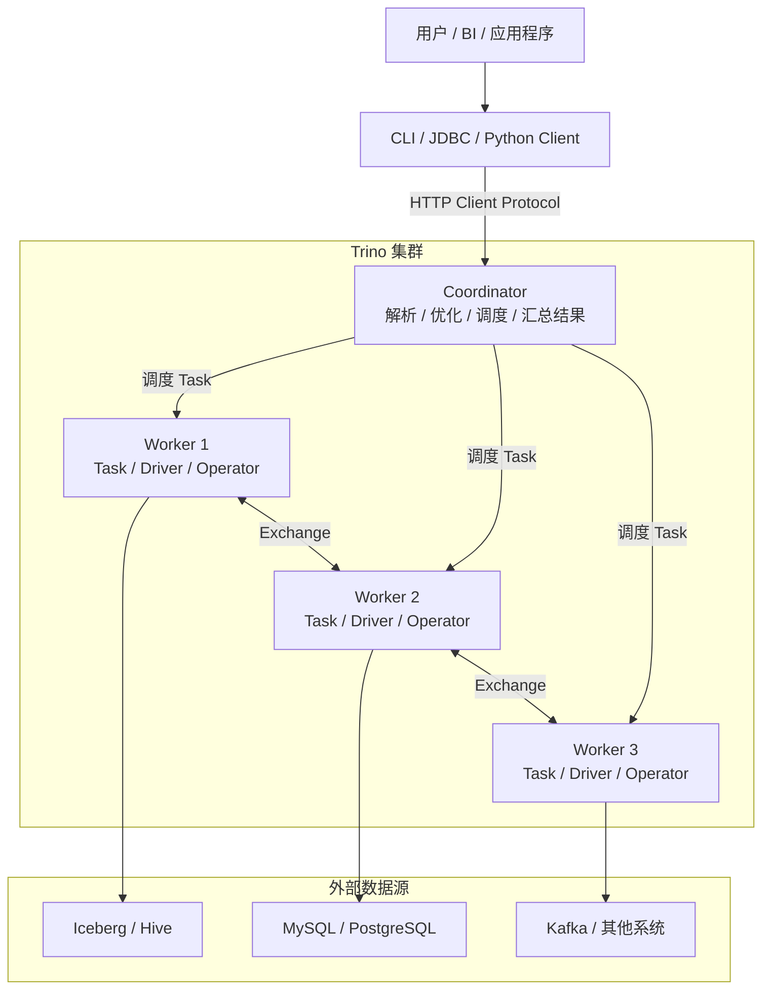
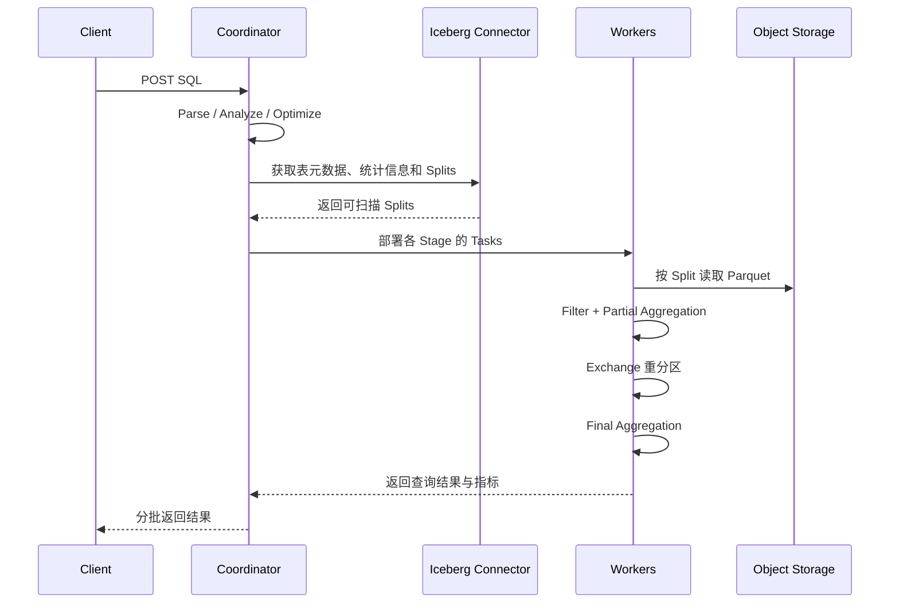

# 运行中的 Trino 查询架构图

Trino 是分布式 SQL 查询引擎。它自己不保存业务数据，而是通过 Connector 读取 Hive、Iceberg、MySQL、PostgreSQL、Kafka 等外部数据源，再由多个 Worker 并行计算。

本文先回答三个问题：

1. 一条 SQL 提交后经过哪些组件？
2. Coordinator 与 Worker 分别做什么？
3. Query、Stage、Task、Driver、Operator 是什么关系？

## 一、Trino 集群由什么组成



一个生产集群通常包含：

- 一个 Coordinator；高可用和网关方案会在它外面增加其他组件，但一次查询仍由一个 Coordinator 管理；
- 多个 Worker；
- 一个供 Worker 注册和 Coordinator 发现 Worker 的 Discovery Service，通常运行在 Coordinator 中；
- 若干 Catalog 配置，每个 Catalog 装载一个 Connector；
- 日志、指标、认证、授权和资源组等运维配置。

开发环境可以让同一个 Trino 进程同时承担 Coordinator 和 Worker，但生产环境通常让 Coordinator 专注于规划和调度。

## 二、Coordinator 到底负责什么

Client 把 SQL 提交到 Coordinator。Coordinator 是集群的控制面，主要负责：

1. 接收 Client 请求并维护 Query 生命周期；
2. 解析 SQL，检查语法、表名、列名、类型和权限；
3. 调用 Connector 获取表结构、统计信息和可扫描的 Split；
4. 生成并优化逻辑计划；
5. 把分布式计划拆成 Stage 和 Task；
6. 选择 Worker 并调度 Task；
7. 监控查询状态、失败和资源使用；
8. 汇总或转交最终结果给 Client。

Coordinator 通常不负责扫描所有数据，也不应该承载大规模业务计算。Worker 数量增加后，Coordinator 仍然只有一个查询控制中心，因此超大的 SQL、海量分区枚举、过多 Task 和高查询并发都可能给 Coordinator 带来压力。

## 三、Worker 到底负责什么

Worker 是数据面，负责真正执行 Task：

- 根据 Connector 提供的 Split 读取外部数据；
- 执行过滤、投影、聚合、Join、排序和窗口函数等 Operator；
- 在内存中构建 Hash Table 或聚合状态；
- 与其他 Worker 交换中间数据；
- 把结果传给下游 Stage 或最终输出端；
- 汇报 Task 状态、指标和错误。

Worker 不是像 Spark Executor 那样归属于某一个 Application 的长期进程。一个 Trino Worker 是共享集群的一部分，可以同时执行多个 Query 的 Task。

```text
Worker JVM
├── Query A / Stage 1 / Task 0
│   ├── Driver 0
│   └── Driver 1
├── Query B / Stage 2 / Task 3
│   └── Driver 0
└── Query C / Stage 0 / Task 1
    ├── Driver 0
    └── Driver 1
```

因此，Trino 的隔离主要依靠查询内存限制、并发控制和 Resource Group，而不是为每条 SQL 单独启动一组 Worker。

## 四、Catalog、Connector 与外部数据源

下面这条 SQL 使用三段式名称：

```sql
SELECT order_id, amount
FROM iceberg.sales.orders;
```

```text
iceberg  = Trino Catalog 名称
sales    = Schema 名称
orders   = Table 名称
```

Trino Catalog 是一份数据源接入配置。例如：

```properties
# etc/catalog/iceberg.properties
connector.name=iceberg
iceberg.catalog.type=rest
iceberg.rest-catalog.uri=http://iceberg-rest:8181
```

这里需要区分两个容易重名的概念：

- **Trino Catalog**：Trino 中一个 Connector 实例的名字，例如查询名中的 `iceberg`；
- **Iceberg Catalog**：Iceberg 表格式用来定位当前 Table Metadata 的 Catalog 服务。

Trino 的 Iceberg Connector 会通过 Trino Catalog 配置去访问 Iceberg Catalog，再读取 Iceberg 表的数据文件。

## 五、一条查询包含哪些运行对象

Trino 官方概念从大到小可以排列为：

```text
Query
└── Stage
    └── Task
        └── Driver
            └── Operator
```

### 5.1 Query

Statement 是用户提交的 SQL 文本；Query 是为了执行该 Statement 创建的完整运行实例。Query 包含执行计划、Stage、Task、Split、内存统计和生命周期状态。

```text
Statement：SELECT count(*) FROM iceberg.sales.orders
Query：为这次提交创建的 query_id、计划、Task 和运行状态
```

相同 SQL 执行两次，会产生两个不同 Query。

### 5.2 Stage

Coordinator 把分布式计划组织成 Stage 树。一个 Stage 表示一段可以使用相同数据分布方式执行的计划片段。

Stage 是 Coordinator 中的计划和调度对象，本身不会在 Worker 上运行。真正运行的是该 Stage 创建出来的多个 Task。

### 5.3 Task

Task 是 Stage 在某个 Worker 上的一个执行实例：

```text
Stage 1
├── Task 1.0 → Worker A
├── Task 1.1 → Worker B
└── Task 1.2 → Worker C
```

Task 接收 Split 或上游 Exchange 数据，运行一个或多个 Driver，并通过输出 Buffer 把结果提供给下游。

### 5.4 Driver

一个 Task 可以包含多个并行 Driver。Driver 是一条由 Operator 实例连接起来的本地执行流水线，也是 Trino 执行模型中更细的并行单位。

```text
一个 Driver
TableScan → Filter → Project → PartialAggregation → Output
```

多个 Driver 可以在同一个 Task 内并行处理不同 Split。这里的 Driver 不是 JDBC Driver，也不是 Spark Driver，两者只是名称相同。

### 5.5 Operator

Operator 是实际执行某一步数据处理的组件，例如：

- TableScan：从 Connector 读取数据；
- Filter：按条件过滤；
- Project：计算表达式或选择列；
- HashBuilder：为 Join 构建 Hash Table；
- LookupJoin：使用 Hash Table 匹配 probe 数据；
- Aggregation：执行部分或最终聚合；
- Exchange：发送或接收其他 Stage 的数据；
- Output：形成 Task 输出。

## 六、一次查询的运行时序

假设执行：

```sql
SELECT region, sum(amount)
FROM iceberg.sales.orders
WHERE order_date = DATE '2026-09-12'
GROUP BY region;
```



Client Protocol 基于 HTTP。传统直接协议中，Client 持续请求 Coordinator 返回的 `nextUri` 获取下一批结果；支持并配置 Spooling Protocol 时，大结果也可以写入对象存储，由 Client 获取数据段，从而减轻 Coordinator 的结果传输压力。

## 七、Trino 为什么适合交互式查询

Trino 的主要目标是直接查询外部数据，并尽快以流水线方式返回结果：

```text
Connector 开始产生 Page
        ↓
上游 Operator 边读边处理
        ↓
Exchange 把数据持续发送给下游
        ↓
下游继续聚合或 Join
```

默认执行模式下，Stage 之间的中间结果主要通过内存 Buffer 和网络流水传输，而不是像传统 MapReduce 那样每个阶段都完整落盘后再启动下一阶段。这降低了延迟，但也意味着默认情况下 Worker 故障通常会导致 Query 失败。

对长时间、大规模批查询，可以启用 Fault-tolerant Execution，把 Exchange 数据持久化到外部存储并重试 Query 或 Task。它是另一种执行权衡，不是所有查询默认具有的行为。

## 八、与 Spark 运行模型对照

| 维度 | Spark | Trino |
|---|---|---|
| 主要用户入口 | DataFrame/RDD/SQL 应用程序 | SQL |
| 顶层生命周期 | Application | Query |
| 控制进程 | Driver | Coordinator |
| 共享工作进程 | Executor 通常属于一个 Application | Worker 服务多个 Query |
| 分布式计划 | Job / Stage DAG | Stage 树 |
| Worker 执行对象 | Task | Task 中的 Driver |
| 输入并行单位 | Partition | Connector Split |
| 中间数据交换 | Shuffle | Exchange |
| 默认故障恢复 | 可重算失败 Stage/Task | Worker 失败通常使 Query 失败 |
| 主要定位 | 通用批处理、流处理、机器学习 | 交互式和批量 SQL 查询 |

不能简单地说：

```text
Trino Coordinator = Spark Driver
Trino Worker = Spark Executor
Trino Task = Spark Task
```

它们在职责上有相似之处，但生命周期、并发模型和容错方式不同。尤其是 Trino Worker 默认被整个集群中的多个 Query 共享。

## 九、观察一个运行中的 Query

在 Web UI、查询 JSON 或监控系统中，优先沿下面顺序观察：

```text
Query 状态：QUEUED / PLANNING / RUNNING / FINISHED / FAILED
        ↓
Stage 是否有某一层耗时特别长
        ↓
Task 是否集中在少数 Worker，是否存在长尾
        ↓
Split 的 queued / running / completed 数量
        ↓
输入行数、物理输入字节和输出行数
        ↓
CPU time、scheduled time、blocked time
        ↓
内存、网络 Exchange、Spill 或外部 Exchange
```

常见判断：

- Planning 很慢：检查 SQL 复杂度、分区/文件枚举、Catalog 和 Coordinator 压力；
- Split 很多但每个很小：检查小文件或数据源分片过细；
- Blocked time 高：可能是在等 Exchange、数据源、内存或下游消费；
- 少数 Task 明显更慢：检查数据倾斜、坏文件、慢数据源或 Worker 资源；
- 输出很少但扫描很多：检查谓词、分区剪枝和 Connector 下推。

## 十、最终心智模型

```text
Client 把 SQL 交给 Coordinator
        ↓
Coordinator 解析、优化并形成 Stage 树
        ↓
Connector 提供表元数据、统计信息和 Splits
        ↓
每个 Stage 在 Worker 上展开为多个 Task
        ↓
Task 内的 Driver 运行 Operator 流水线
        ↓
Worker 通过 Exchange 传递中间 Page
        ↓
根 Stage 形成结果并返回 Client
```

下一篇将继续沿着一条 SQL 向下追踪：逻辑计划怎样生成，为什么 Remote Exchange 会切开 Stage，以及 Task、Driver、Split 在 Worker 内到底怎样配合。

## 参考资料

- [Trino concepts](https://trino.io/docs/current/overview/concepts.html)
- [Client protocol](https://trino.io/docs/current/client/client-protocol.html)
- [Fault-tolerant execution](https://trino.io/docs/current/admin/fault-tolerant-execution.html)

