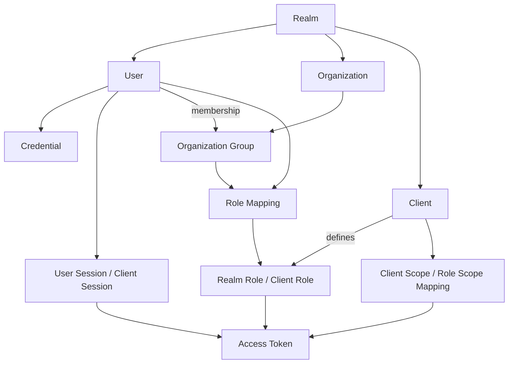
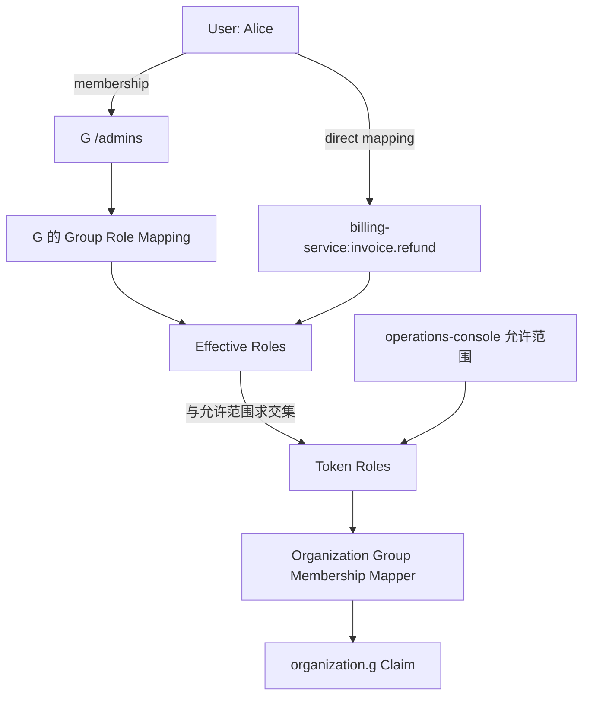

Keycloak 实现 RBAC 的核心过程是：保存用户、组织、组和角色之间的关系，登录后把当前应用需要的有效角色写入 Access Token，最后由业务服务根据 Token 执行鉴权。

本文以 Keycloak 26.7.3 为准，先介绍数据模型，再定义一个包含所有知识点的示例，最后沿着一次角色计算完整走一遍。

<!-- more -->

## 1. Keycloak 的数据模型

Keycloak 中与认证和 RBAC 直接相关的对象如下：



各对象的职责是：

| 对象 | 职责 |
| --- | --- |
| Realm | 隔离一整套用户、组织、角色和 Client |
| User | 表示被认证和授权的人 |
| Credential | 证明当前操作者是哪一个 User |
| Organization | 表示 Realm 中的业务组织 |
| Organization Group | 表示用户在某个组织中的团队或角色 |
| Role | 表示身份或业务权限 |
| Role Mapping | 把 Role 分配给 User 或 Group |
| Client | 表示接入 Keycloak 的应用或服务 |
| Client Scope / Role Scope Mapping | 控制 Token 可以包含什么信息和角色 |
| Session | 保存当前登录状态 |
| Protocol Mapper | 把已经选出的信息写入 Token Claim |

这些对象最终组成四条关系：

```text
User --属于--> Organization Group
User / Group --获得--> Role
Composite Role --包含--> Child Role
Client --控制--> Token 中允许出现的角色和 Claim
```

## 2. 完整示例

系统是一套自媒体运营平台，所有对象位于：

```text
Realm: media-platform
```

### 2.1 用户与组织

平台有两个组织：

```text
组织 G 启用了：
- 启动抓取任务
- 查看抓取内容
- 修改抓取关键词

组织 W 只启用了：
- 查看抓取内容
```

用户在组织中的角色是：

```text
Alice 是 G 的管理员
Bob   是 G 的普通成员
Alice 是 W 的管理员
```

因此创建：

```text
Organization G，alias = g
├── /members → Bob
└── /admins  → Alice

Organization W，alias = w
└── /admins  → Alice
```

G 的 `/admins` 和 W 的 `/admins` 是两个不同的 Organization Group。相同的 Group 路径不会让两个组织共享角色关系。

### 2.2 应用与服务

平台包含四个 Keycloak Client：

| Client ID | 用途 |
| --- | --- |
| `operations-console` | 用户登录和操作平台的 Web 应用 |
| `crawler-service` | 创建抓取任务、修改关键词 |
| `content-service` | 查询抓取内容 |
| `billing-service` | 财务服务，用来演示无关角色如何被排除 |

浏览器是 User Agent，不是这里所说的 Client。`operations-console` 才是 Keycloak 中登记的应用。

### 2.3 角色

具体业务权限使用 Client Role：

```text
crawler-service
├── task.start
└── keyword.update

content-service
└── content.read

billing-service
└── invoice.refund
```

平台还定义一个 Realm Role：

```text
platform-user
```

它只表示“可以登录自媒体运营平台”，不直接放行任何业务接口。

为了演示 Composite Role，再定义：

```text
content-viewer（Realm Role）
├── platform-user
└── content-service:content.read
```

Composite Role 只是角色集合。分配 `content-viewer` 后，Keycloak 会递归展开它的子角色。

### 2.4 Role Mapping

根据组织实际启用的能力配置 Group Role Mapping：

| Organization Group | Role Mapping |
| --- | --- |
| G `/members` | `platform-user`、`crawler-service:task.start`、`content-service:content.read` |
| G `/admins` | `platform-user`、`crawler-service:task.start`、`crawler-service:keyword.update`、`content-service:content.read` |
| W `/admins` | `content-viewer` |

W 的 `/admins` 虽然代表管理员，却没有映射抓取相关角色。Composite Role `content-viewer` 展开后也只有平台身份和查看内容权限，所以 Alice 在 W 中不能启动抓取或修改关键词。

为了演示直接分配，额外给 Alice 分配：

```text
billing-service:invoice.refund
```

这个角色与运营控制台无关，后面会被 `operations-console` 的角色范围排除。

### 2.5 Token 输出配置

`operations-console` 使用内置的 `organization` Client Scope，并添加：

```text
Organization Group Membership Mapper
├── Add to access token = On
└── Add group role mappings = On
```

登录时应用明确请求当前组织：

```text
scope=openid organization:g
```

同时关闭 `operations-console` 的 `Full Scope Allowed`，只允许它获得下面这些运营角色：

```text
platform-user
content-viewer
crawler-service:task.start
crawler-service:keyword.update
content-service:content.read
```

`billing-service:invoice.refund` 不在允许范围内。

## 3. 结合示例理解各个对象

### 3.1 Realm：系统边界，不是业务租户

`media-platform` Realm 包含 G、W、Alice、Bob 和所有 Client。

G、W 不应机械地拆成两个 Realm，因为 Alice 同时属于两个组织，两个组织也共用同一套应用和登录入口。Realm 适合隔离一整套身份系统；Realm 内的业务租户使用 Organization 表达。

### 3.2 User 与 Credential：身份和凭证分开

Alice 对应一个 User，授权关系关联她稳定的 User ID。用户名和邮箱可能变化，不适合充当权限关系主键。

Credential 保存密码、OTP 或 Passkey 等认证材料：

```text
Credential 验证成功
→ 当前操作者是 Alice

Role 与 Group 计算成功
→ Alice 在当前组织中能做什么
```

Credential 负责认证，不负责授权。

### 3.3 Organization Group：保存角色的组织作用域

Alice 同时加入：

```text
G 的 /admins
W 的 /admins
```

`/admins` 只是 Organization 内部的相对路径。真正的作用域来自它所属的 Organization，所以系统始终能区分 Alice 管理的是 G 还是 W。

### 3.4 Realm Role 与 Client Role

Realm Role 位于 Realm 的全局角色命名空间，适合表达跨多个应用仍然成立的身份：

```text
platform-user
content-viewer
```

Client Role 位于某个 Client 的角色命名空间，适合表达具体服务的原子权限：

```text
crawler-service:task.start
crawler-service:keyword.update
content-service:content.read
```

判断方法是：

```text
如果删除这个服务，角色是否仍有意义？

有   → 更接近 Realm Role
没有 → 更接近该服务的 Client Role
```

业务接口应优先检查 Client Role。这样 `crawler-service` 只需要理解自己的角色，不必解释全平台角色的业务含义。

### 3.5 Role Mapping 与 Composite Role

Role Mapping 回答：

```text
这个 User 或 Group 获得了哪些 Role？
```

角色可以直接分配给 User，也可以映射给 Group。稳定的组织职责适合通过 Group 分配；少量特殊权限才考虑直接分配。

Composite Role 回答：

```text
一个 Role 展开后还包含哪些 Role？
```

本例中：

```text
W /admins
  ↓ Role Mapping
content-viewer
  ↓ Composite 展开
platform-user
content-service:content.read
```

Composite Role 会自动展开，因此不要给所有组织复用一个包含全部权限的全局 `admin` Composite Role。否则 W 的管理员也会获得它的全部子角色。

### 3.6 Client 的两个身份

这次登录涉及两类 Client：

```text
发起登录的 Client
= operations-console

定义权限的 Client
= crawler-service、content-service、billing-service
```

授权请求中的：

```text
client_id=operations-console
```

表示 Keycloak 正在为哪个应用处理登录。它不表示 Token 只能包含 `operations-console` 自己定义的角色。

Client Role 的所属 Client 决定它在 Token 中的命名空间，例如：

```text
resource_access.crawler-service.roles
resource_access.content-service.roles
```

### 3.7 Effective Roles 与 Role Scope Mapping

生成 Token 时要区分两个集合：

```text
Effective Roles
= User 直接角色
 + Group 角色
 + Composite Role 展开的子角色

Scope-Permitted Roles
= 当前 Client 允许进入 Token 的角色范围
```

最终：

```text
Token Roles
= Effective Roles
∩ Scope-Permitted Roles
```

`Full Scope Allowed=true` 时，当前 Client 可以获得用户的全部有效角色。生产环境中应按最小权限原则关闭它，并通过 Role Scope Mapping 或 Client Scope 明确允许范围。

在本例中，`operations-console` 允许运营相关角色，但不允许：

```text
billing-service:invoice.refund
```

因此 Alice 虽然拥有财务角色，它也不会进入运营控制台获得的 Token。

### 3.8 Client Scope、Protocol Mapper 与 Session

这三个对象解决不同问题：

| 对象 | 回答的问题 |
| --- | --- |
| Client Scope | 本次请求需要哪些成组的 Claim 和 Role 范围配置？ |
| Protocol Mapper | 已有信息写到 Token 的哪个 Claim？ |
| Session | 当前用户是否已经登录，以及登录属于哪个 User 和 Client？ |

本例请求 `organization:g` 后，内置 `organization` Client Scope 把组织上下文加入本次 Token 生成过程。Organization Group Membership Mapper 再把 G 的 Group 和 Group Role Mapping 写入 `organization.g`。

Mapper 不分配角色，也不改变 Alice 的 Group Membership；它只改变 Token 的输出结构。

## 4. 完整计算 Alice 在 G 中的角色

现在沿数据关系计算一次：



### 4.1 计算 Effective Roles

Effective Roles 来自用户的全部直接 Role 和全部 Group Membership，不会因为这次请求了组织 G，就忽略 Alice 在 W 中的成员关系。

Alice 从 G 的 `/admins` 获得：

```text
Realm Role:
- platform-user

Client Role:
- crawler-service:task.start
- crawler-service:keyword.update
- content-service:content.read
```

Alice 从 W 的 `/admins` 获得 Composite Role 及其子角色：

```text
- content-viewer
- platform-user
- content-service:content.read
```

再加上直接分配的财务角色：

```text
- billing-service:invoice.refund
```

这些角色去重后组成 Alice 的 Effective Roles。标准顶层角色 Claim 可能因此包含来自 G、W 和直接分配的角色，这也是组织级接口不能只检查顶层角色的原因。

### 4.2 根据当前 Client 裁剪角色

当前 Client 是 `operations-console`。它的允许范围不包含财务角色，因此求交集后得到：

```text
Realm Role:
- platform-user
- content-viewer

Client Role:
- crawler-service:task.start
- crawler-service:keyword.update
- content-service:content.read
```

这里的 Token Roles 仍是当前 Client 允许的全局集合。Organization Group Membership Mapper 接下来只选择当前 `organization:g` 对应 Group 所映射的那部分角色，不会把 W 的 `content-viewer` 写进 G 的组织 Claim。

### 4.3 Mapper 输出组织级 Claim

启用 Group Role Mapping 输出后，Access Token 中与本例相关的部分是：

```json
{
  "sub": "user-alice",
  "azp": "operations-console",
  "aud": ["crawler-service", "content-service"],
  "organization": {
    "g": {
      "groups": ["/admins"],
      "realm_access": {
        "roles": ["platform-user"]
      },
      "resource_access": {
        "crawler-service": {
          "roles": ["task.start", "keyword.update"]
        },
        "content-service": {
          "roles": ["content.read"]
        }
      }
    }
  }
}
```

`billing-service:invoice.refund` 没有进入 Token，因为它不在 `operations-console` 的允许范围中。

## 5. 业务服务如何鉴权

假设 Alice 调用：

```http
PUT /organizations/g/crawler/keywords
Authorization: Bearer <access-token>
```

`crawler-service` 依次检查：

```text
1. 根据 kid 获取并缓存 Realm 公钥
2. 验证 JWT 签名和允许的 alg
3. 验证 iss、aud、exp，存在时验证 nbf
4. 确认请求资源真实属于组织 g
5. 确认 Token 中存在 organization.g
6. 检查 organization.g.resource_access.crawler-service.roles
7. 确认其中包含 keyword.update
```

结果为 Allow。

如果 Alice 使用组织 W 的上下文，Token 只包含：

```json
{
  "organization": {
    "w": {
      "groups": ["/admins"],
      "realm_access": {
        "roles": ["platform-user", "content-viewer"]
      },
      "resource_access": {
        "content-service": {
          "roles": ["content.read"]
        }
      }
    }
  }
}
```

其中没有 `crawler-service:keyword.update`，所以修改 W 的关键词得到 Deny。

### 5.1 为什么不能只检查顶层角色

标准顶层 `realm_access` 和 `resource_access` 可能合并用户从多个 Group，包括多个 Organization Group，继承的角色。

如果 Alice 在 G 中拥有 `keyword.update`，服务只检查顶层角色，可能错误地允许她修改 W 的资源。组织资源必须检查：

```text
organization.<当前组织>.resource_access.<当前服务>.roles
```

请求中的组织也不能完全相信前端参数。服务应从 URL 对应的资源、数据库记录或可信路由上下文确认资源真实属于哪个组织，再与 Token Claim 比较。

### 5.2 401 与 403

```text
Token 缺失、签名无效或过期
→ 401 Unauthorized

Token 有效，但组织不匹配或缺少 Client Role
→ 403 Forbidden
```

Access Token 是签发时的权限快照。用户被移出 Group 后，旧 Token 通常仍可使用到过期，因此 Token 生命周期不宜过长。

## 6. 数据关系与 Token 的对应

| 配置关系 | 回答的问题 | Token 中的结果 |
| --- | --- | --- |
| User → Organization Group | Alice 在哪个组织中担任什么角色？ | `organization.g.groups` |
| Group → Role | 该组织角色拥有哪些有效权限？ | 组织 Claim 中的角色 |
| Composite → Child Role | 一个角色还包含哪些角色？ | 展开后的子角色 |
| Client Role → Client | 权限属于哪个服务？ | `resource_access.<client>.roles` |
| Role Scope Mapping | 当前应用能获得哪些角色？ | 不允许的角色被排除 |
| Protocol Mapper | 信息写到哪里？ | `organization.<alias>` 等 Claim |
| Session | 当前登录属于谁和哪个 Client？ | `sub`、`sid`、`azp` 等上下文 |

## 7. RBAC 的边界

Keycloak Role 适合表达稳定的职责和业务操作，例如：

```text
管理员能否修改关键词？
普通成员能否启动抓取任务？
```

它不适合为每一个任务、文档或项目创建 Role，例如：

```text
Alice 能否修改 task-123？
Alice 能否查看 Bob 单独分享的 content-456？
```

大量资源级 Role 会造成 Role Explosion。这类“某个用户与某个具体对象是什么关系”的问题，更适合交给 ReBAC；时间、IP、设备风险等请求上下文更适合使用 ABAC。

## 8. 总结

Keycloak 中的组织级 RBAC 链路是：

```text
User
  ↓ Organization Group Membership
Organization Group
  ↓ Group Role Mapping
Realm Role / Client Role
  ↓ Composite 展开
Effective Roles
  ↓ 当前 Client 的允许范围
Token Roles
  ↓ Protocol Mapper
organization.<alias> Claim
  ↓ 业务服务校验 Token、组织和 Client Role
Allow / Deny
```

理解这条链路时，最重要的是分清：

```text
Organization Group：保存角色的组织作用域
Role Mapping：决定用户或 Group 拥有什么角色
Composite Role：展开角色集合
Role Scope Mapping：限制当前应用能获得什么角色
Protocol Mapper：决定筛选后的信息写到哪里
业务服务：执行最终 Allow / Deny
```

## 参考资料

- [Keycloak Server Administration Guide：Managing organizations](https://www.keycloak.org/docs/latest/server_admin/index.html#_managing_organizations)
- [Keycloak Server Administration Guide：Assigning permissions using roles and groups](https://www.keycloak.org/docs/latest/server_admin/index.html#assembly-managing-users_server_administration_guide)
- [Keycloak Server Administration Guide：Mapping organization claims](https://www.keycloak.org/docs/latest/server_admin/index.html#_organization_claims)
- [Keycloak Securing Applications Guide](https://www.keycloak.org/securing-apps/oidc-layers)
