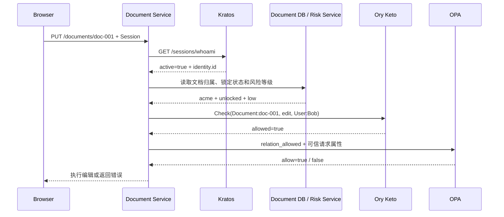

RBAC 适合回答“管理员能否进入管理后台”，但很难直接回答下面两个问题：

```text
Bob 能否编辑具体的文档 doc-001？

即使 Bob 与文档存在编辑关系，文档锁定、用户风险较高或当前不在工作时间时，是否仍然允许编辑？
```

第一个问题依赖用户与具体资源之间的关系，属于 ReBAC；第二个问题依赖当前请求的属性，属于 ABAC。

本文使用一套企业文档 SaaS 说明四个组件如何协作：

```text
Ory Kratos：确认用户是谁
Ory Keto：计算用户与资源之间的权限关系
OPA：根据本次请求的属性执行策略
Document Service：收集可信数据并执行最终决定
```

<!-- more -->

## 1. 完整示例

组织 `acme` 中有一个团队和一个项目文件夹：

```text
Organization acme
├── member: Bob
├── Team team-a
│   └── member: Bob
└── Folder project-a
    ├── editor: team-a 的全部成员
    └── Document doc-001
```

这组关系表达了：

```text
Bob 是 acme 的成员
Bob 是 team-a 的成员
team-a 的全部成员可以编辑 project-a
doc-001 位于 project-a 中并继承文件夹权限
```

Bob 在 14:00 请求编辑 `doc-001`。业务系统读取到：

```text
文档 locked = false
用户 risk_level = low
当前 hour = 14
```

最终判断需要同时满足：

```text
身份有效
AND Bob 与 doc-001 存在 edit 权限关系
AND doc-001 未锁定
AND Bob 不是高风险用户
AND 当前处于允许编辑的时间
```

只要其中一个条件不成立，请求就被拒绝。

## 2. 四个组件的职责边界

| 组件 | 负责 | 不负责 |
| --- | --- | --- |
| Kratos | Identity、Credential、Session | 团队、文档和分享关系 |
| Keto | Namespace、Relation Tuple、Permission 计算 | 密码、Session、文档锁定和风险状态 |
| OPA | Rego Policy 和本次请求的可信属性 | 长期保存身份、文档和关系主数据 |
| Document Service | 加载资源、调用鉴权组件、执行 Allow/Deny | 自己复制一套身份或关系数据 |

三类数据应分别只有一个事实来源：

```text
用户身份       → Kratos
长期权限关系   → Keto
文档和风险属性 → 业务数据库、风控服务
```

不要把 `editor` 同时写进 Identity、业务数据库和 Keto，否则撤权时无法确定哪一份数据生效。

## 3. Kratos：提供稳定主体

Kratos 登录成功后，服务通过 Session 得到 Identity：

```json
{
  "active": true,
  "expires_at": "2026-09-02T18:00:00+08:00",
  "identity": {
    "id": "9f425a8d-7efc-4768-8f23-7647a74fdf13",
    "state": "active",
    "traits": {
      "email": "bob@example.com"
    }
  }
}
```

授权主体使用稳定的 `identity.id`：

```text
Kratos identity.id
= 9f425a8d-7efc-4768-8f23-7647a74fdf13

Keto Subject
= User:9f425a8d-7efc-4768-8f23-7647a74fdf13
```

邮箱和用户名可能变化，也可能泄露个人信息，不应作为 Relation Tuple 中的主体 ID。

Kratos 到此只回答了“当前用户是 Bob”。Bob 是否属于 `team-a`、能否编辑 `doc-001`，由 Keto 判断。

## 4. Keto：保存关系并计算 Permission

Keto 使用四个核心概念：

| 概念 | 含义 | 示例 |
| --- | --- | --- |
| Namespace | 对象类型 | `User`、`Team`、`Document` |
| Relation | 已经存在的关系事实 | Bob 是 Team A 的成员 |
| Relation Tuple | Relation 的具体记录 | `Team:team-a#members@User:bob` |
| Permission | 根据 Relation 推导出的操作 | Bob 可以编辑 `doc-001` |

Relation Tuple 的通用结构是：

```text
Namespace:Object#Relation@Subject
```

其中 Subject 可以是一个用户，也可以是一个 Subject Set：

```text
User:bob
Team:team-a#members
```

`Team:team-a#members` 表示整个成员集合。把它设置为文件夹的 `editors` 后，无需为每个团队成员分别写一条授权关系。

### 4.1 使用 OPL 定义关系规则

Ory Permission Language 使用受限制的 TypeScript 语法定义 Namespace、Relation 和 Permission：

```typescript
import { Namespace, Context, SubjectSet } from "@ory/keto-namespace-types"

class User implements Namespace {}

class Organization implements Namespace {
  related: {
    members: User[]
    admins: User[]
  }

  permits = {
    member: (ctx: Context): boolean =>
      this.related.members.includes(ctx.subject) ||
      this.related.admins.includes(ctx.subject),
  }
}

class Team implements Namespace {
  related: {
    organizations: Organization[]
    members: User[]
  }
}

class Folder implements Namespace {
  related: {
    organizations: Organization[]
    owners: User[]
    editors: (User | SubjectSet<Team, "members">)[]
    viewers: (User | SubjectSet<Team, "members">)[]
  }

  permits = {
    edit: (ctx: Context): boolean =>
      this.related.organizations.traverse((org) => org.permits.member(ctx)) &&
      (this.related.owners.includes(ctx.subject) ||
        this.related.editors.includes(ctx.subject)),

    view: (ctx: Context): boolean =>
      this.related.organizations.traverse((org) => org.permits.member(ctx)) &&
      (this.related.owners.includes(ctx.subject) ||
        this.related.editors.includes(ctx.subject) ||
        this.related.viewers.includes(ctx.subject)),
  }
}

class Document implements Namespace {
  related: {
    organizations: Organization[]
    parents: Folder[]
    owners: User[]
    editors: (User | SubjectSet<Team, "members">)[]
    viewers: (User | SubjectSet<Team, "members">)[]
  }

  permits = {
    edit: (ctx: Context): boolean =>
      this.related.organizations.traverse((org) => org.permits.member(ctx)) &&
      (this.related.owners.includes(ctx.subject) ||
        this.related.editors.includes(ctx.subject) ||
        this.related.parents.traverse((parent) => parent.permits.edit(ctx))),

    view: (ctx: Context): boolean =>
      this.related.organizations.traverse((org) => org.permits.member(ctx)) &&
      (this.related.owners.includes(ctx.subject) ||
        this.related.editors.includes(ctx.subject) ||
        this.related.viewers.includes(ctx.subject) ||
        this.related.parents.traverse((parent) => parent.permits.view(ctx))),
  }
}
```

这段模型只表达三条规则：

```text
用户必须是资源所属组织的成员
owner、editor 可以编辑和查看
文档可以继承父文件夹的权限
```

OPL 看起来像 TypeScript，但不会由 Node.js 执行。Keto 只解析受支持的语法并将其转换为关系遍历规则，因此不能在 OPL 中读取数据库、调用 HTTP 接口或获取当前时间。

### 4.2 写入示例中的 Relation Tuple

业务事件发生时，由可信的权限管理服务调用 Keto Write API 写入：

```text
Organization:acme#members@User:9f425a8d-7efc-4768-8f23-7647a74fdf13

Team:team-a#organizations@Organization:acme
Team:team-a#members@User:9f425a8d-7efc-4768-8f23-7647a74fdf13

Folder:project-a#organizations@Organization:acme
Folder:project-a#editors@Team:team-a#members

Document:doc-001#organizations@Organization:acme
Document:doc-001#parents@Folder:project-a
```

这些 Tuple 保存事实，不直接保存最终结果：

```text
保存：Bob 是 team-a 的 member
保存：team-a.members 是 project-a 的 editors
保存：project-a 是 doc-001 的 parent

不保存：Bob 可以编辑 doc-001
```

最后一项由 Keto 根据 OPL 和 Tuple 在 Check 时计算。

### 4.3 检查 Bob 能否编辑文档

Document Service 调用 Keto Read API：

```http
POST /relation-tuples/check/openapi
Content-Type: application/json

{
  "namespace": "Document",
  "object": "doc-001",
  "relation": "edit",
  "subject_set": {
    "namespace": "User",
    "object": "9f425a8d-7efc-4768-8f23-7647a74fdf13"
  }
}
```

Keto 沿关系图计算：

```text
User:Bob
  ↓ Organization:acme#members
满足文档的组织成员条件

User:Bob
  ↓ Team:team-a#members
  ↓ Folder:project-a#editors
  ↓ Document:doc-001#parents
满足文档的 edit 权限

allowed = true
```

Keto 还可以使用 Expand 展开权限树，解释一项权限来自哪条关系路径；使用 Relation Tuple 查询接口读取匹配的关系。业务接口的核心校验仍然是 Check。

## 5. OPA：根据请求属性执行 ABAC

Keto 已经证明 Bob 与 `doc-001` 存在编辑权限，但它不负责读取文档锁定状态、风控结果和当前时间。这些动态条件交给 OPA。

OPA 的计算模型是：

```text
decision = policy(input, data)
```

Document Service 从可信来源组装 Input：

```json
{
  "subject": {
    "id": "9f425a8d-7efc-4768-8f23-7647a74fdf13",
    "risk_level": "low"
  },
  "action": "edit",
  "resource": {
    "type": "document",
    "id": "doc-001",
    "organization_id": "acme",
    "locked": false
  },
  "environment": {
    "hour": 14
  },
  "relation_allowed": true
}
```

数据来源分别是：

```text
subject.id       → Kratos Session
risk_level       → 风控服务
resource         → Document DB
hour             → 服务端统一业务时区
relation_allowed → Keto Check
```

不能接受客户端提交的 `locked=false` 或 `risk_level=low` 作为授权事实。

对应的 Rego Policy：

```rego
package document.authz

import rego.v1

default allow := false

allow if {
    input.action == "view"
    input.relation_allowed
    input.subject.risk_level != "high"
}

allow if {
    input.action == "edit"
    input.relation_allowed
    not input.resource.locked
    input.subject.risk_level != "high"
    input.environment.hour >= 9
    input.environment.hour < 19
}
```

`default allow := false` 保证 Action 未覆盖、字段缺失或规则未命中时默认拒绝。

OPA 不应成为用户、文档或关系的主数据库。它接收一次请求所需的属性并执行策略，不负责长期维护这些业务事实。

## 6. 一次编辑请求的完整链路



按执行顺序拆开：

1. Session 缺失、过期或无效时返回 `401 Unauthorized`；
2. Document Service 根据 URL 加载 `doc-001`，不能相信客户端声明的组织；
3. Keto 检查 Bob 是否具有 `edit` Permission；
4. OPA 根据关系结果、文档状态、风险和时间生成最终决定；
5. 权限不足返回 `403 Forbidden`；
6. Keto、OPA 或必要数据源不可用时失败关闭，可返回 `503 Service Unavailable`。

对象级鉴权应放在了解资源真实状态的业务服务中。Gateway 可以完成 Session 验证，但通常不知道文档属于哪个组织、是否锁定以及当前 API 对应哪个业务 Action。

## 7. 关系写入与一致性

每一种 Relation Tuple 都应由明确的业务事件维护：

| 业务事件 | Keto 关系变化 |
| --- | --- |
| Bob 加入 acme | 创建 `Organization:acme#members@User:Bob` |
| Bob 加入 Team A | 创建 `Team:team-a#members@User:Bob` |
| Team A 获得文件夹编辑权 | 创建 `Folder:project-a#editors@Team:team-a#members` |
| doc-001 移入文件夹 | 创建 `Document:doc-001#parents@Folder:project-a` |
| Bob 离开 Team A | 删除对应的 Team Membership |

业务数据库与 Keto 不能依赖同一个本地事务。常见做法是：

```text
业务事务
├── 更新业务表
└── 写入 Outbox Event
        ↓
异步消费者幂等创建或删除 Relation Tuple
```

如果撤权必须立即生效，可以在关键路径同步更新 Keto，或在短暂不一致期间采用更严格的拒绝策略。无论采用哪种方式，都要明确关系写入失败时如何重试和补偿。

Keto Write API 只应开放给可信的权限管理服务；普通业务服务通常只访问 Read API，浏览器不能直接写 Relation Tuple。

## 8. 使用测试矩阵验证模型

| 场景 | Keto | OPA | 最终结果 |
| --- | --- | --- | --- |
| Bob 不是组织成员 | `false` | 不应放行 | `403` |
| Bob 不是 editor | `false` | 不应放行 | `403` |
| Bob 是 editor，14:00，文档未锁定 | `true` | `true` | 编辑成功 |
| Bob 是 editor，21:00 | `true` | `false` | `403` |
| Bob 是 editor，文档已锁定 | `true` | `false` | `403` |
| Bob 是 editor，风险为 high | `true` | `false` | `403` |
| Session 无效 | 不调用 | 不调用 | `401` |

OPL 和 Rego Policy 都应作为代码版本管理。测试至少覆盖直接授权、团队 Subject Set、父级继承、跨组织访问、动态拒绝条件和字段缺失。

## 9. 总结

完整权限判断可以写成：

```text
Final Allow
= Identity Valid
  AND Relationship Allowed
  AND Context Policy Allowed
```

对应到组件：

```text
Kratos
→ Session 是否有效，当前主体是谁？

Keto
→ 主体是否通过组织、团队或父级继承获得资源权限？

OPA
→ 当前资源状态、风险和环境是否允许这次操作？

Document Service
→ 收集可信事实，调用决策服务并执行结果。
```

ReBAC 保存长期关系，ABAC 判断本次请求。把两类问题分开，才能在权限模型不断扩展时保持清晰。

## 参考资料

- [Ory Keto](https://www.ory.com/keto)
- [Ory Permission Language](https://www.ory.com/blog/what-is-the-ory-permission-language)
- [Ory Kratos Identity Model](https://www.ory.com/docs/kratos/manage-identities/overview)
- [Ory Kratos Session Management](https://www.ory.com/docs/kratos/session-management/overview)
- [OPA Documentation](https://www.openpolicyagent.org/docs)
- [OPA Policy Language](https://www.openpolicyagent.org/docs/policy-language)
