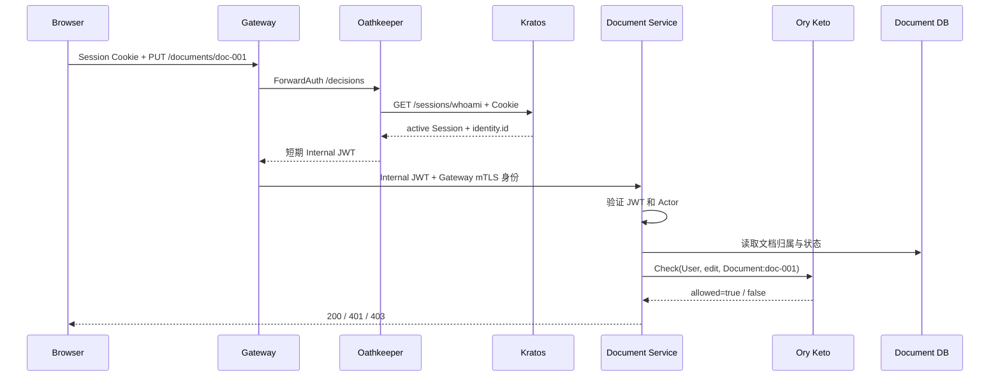
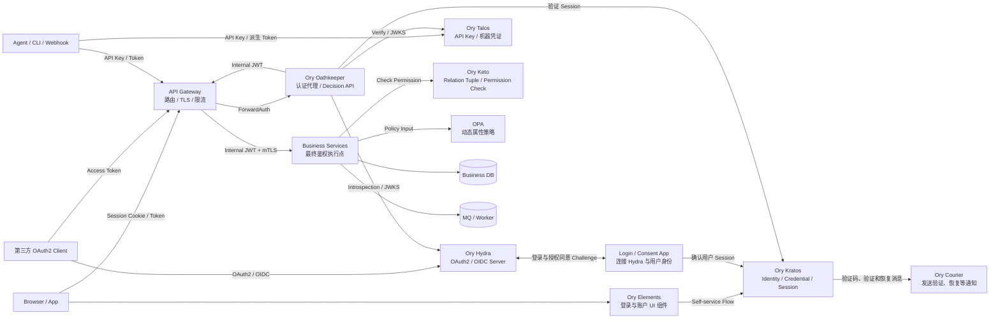

前两篇分别介绍了 RBAC、ReBAC 和 ABAC。这一篇把它们放进真实的微服务请求中，回答下面几个问题：

```text
客户端用什么凭证访问 Gateway？
Gateway 如何确认调用者身份？
身份信息如何安全传给内部服务？
业务服务如何完成资源级鉴权？
服务调用、定时任务和 MQ 如何传递身份？
```

本文采用的基线方案是：

> Gateway 使用 Oathkeeper 验证外部凭证并生成短期 Internal JWT；内部服务验证 JWT 和调用方工作负载身份，再使用 Keto 和业务数据完成最终鉴权。

<!-- more -->

## 1. 先区分 Subject 与 Actor

一次内部请求可能同时包含两种身份：

```text
Subject：本次业务操作代表谁
Actor：当前这一跳由谁实际发起
```

例如 Alice 通过 Gateway 请求 Document Service，Document Service 随后调用 Audit Service：

| 调用链 | Subject | Actor |
| --- | --- | --- |
| Gateway → Document Service | Alice | Gateway |
| Document Service → Audit Service | Alice | Document Service |

Internal JWT 证明 Subject，mTLS 或 Workload Identity 证明 Actor。只验证 JWT，无法确认请求是不是来自被允许的内部服务；只验证 mTLS，又会丢失这次操作代表的用户。

## 2. 外部调用者使用什么凭证

不同调用者不应强行使用同一种凭证：

| 调用者 | 代表谁 | 外部凭证 | 验证方 |
| --- | --- | --- | --- |
| Browser | 登录用户 | Kratos Session Cookie | Kratos |
| Native App、交互式 CLI | 登录用户 | Kratos Session Token，或 OAuth2 Access Token | Kratos 或 Hydra |
| 第三方应用 | OAuth2 Client 或用户 | Hydra Access Token | Hydra/JWKS |
| Agent、自动化 CLI、Webhook | 机器主体 | Talos API Key 或派生 Token | Talos/JWKS |
| 内部服务 | 工作负载 | mTLS、SPIFFE/SVID | Mesh 或服务端 |

外部 Client 只能提交凭证，不能自己声明：

```http
X-Internal-Subject: user:admin
X-Internal-Organization: other-organization
```

Gateway 必须删除所有外部传入的内部身份 Header，再根据认证结果生成新的可信上下文。

## 3. Gateway 向内部服务传递身份的四种方案

Gateway 完成外部认证后，必须把可信 Subject 传给内部服务。常见方案有四种：

| 方案 | Gateway 向内部传递什么 | 内部服务如何验证 |
| --- | --- | --- |
| Session 透传 | Kratos Session Cookie 或 Session Token | 调用 Kratos `/sessions/whoami` |
| 可信 Header | `X-Internal-Subject` 等 Header | 信任 Gateway、mTLS 和网络边界 |
| Internal JWT | Gateway 或 Oathkeeper 签发的短期 JWT | 使用 JWKS 本地验签 |
| Token Exchange | 面向目标服务的新 JWT | 使用 JWKS 本地验签 |

这四种方案只解决 Subject 如何传递。无论选择哪一种，服务之间仍应使用 mTLS 或 Workload Identity 证明 Actor，资源权限仍由业务服务检查。

### 3.1 方案一：透传 Kratos Session

浏览器把 Session Cookie 交给 Gateway：

```http
GET /api/documents/doc-001
Cookie: ory_kratos_session=...
```

Gateway 可以先调用 Kratos 确认 Session，也可以只负责转发。Document Service 收到原始 Session 后，再调用：

```http
GET /sessions/whoami
Cookie: ory_kratos_session=...
```

完整过程是：

```text
Client
  ↓ Kratos Session
Gateway
  ↓ 原样透传 Session
Document Service
  ↓ /sessions/whoami
Kratos
  ↓ identity.id
Document Service
  ↓ Keto / OPA
Allow / Deny
```

如果 Gateway 和业务服务都验证 Session，同一个请求会重复调用 Kratos；如果只有业务服务验证，Gateway 又无法统一拒绝未登录请求。

优点：

- 实现直接，不需要内部 JWT 和密钥管理；
- 每次查询 Kratos，Session 注销和用户禁用能较快生效。

问题：

- 每个内部服务都需要理解 Kratos Session；
- 浏览器凭证进入内部网络；
- 请求量会转化为 Kratos 的在线查询压力；
- 认证代码容易散落到所有服务中。

它适合服务数量较少、调用链较短的系统。

### 3.2 方案二：Gateway 注入可信 Header

Gateway 验证外部凭证后，将认证结果转换为 Header：

```http
X-Internal-Subject: 9f425a8d-7efc-4768-8f23-7647a74fdf13
X-Internal-Principal-Type: user
X-Internal-Organization-ID: acme
X-Internal-Session-ID: session-7d21
X-Internal-AAL: aal1
```

内部服务不再访问 Kratos，直接从 Header 读取 Subject：

```text
Client
  ↓ 外部凭证
Gateway
  ↓ 验证凭证，删除客户端伪造的内部 Header
  ↓ 注入新的身份 Header
Document Service
  ↓ 先确认请求确实来自 Gateway
  ↓ Keto / OPA
Allow / Deny
```

Header 没有签名，它的可信性完全依赖：

```text
业务服务不能被公网绕过 Gateway 访问
Gateway 必须删除客户端提交的同名 Header
Gateway 与服务之间必须使用 mTLS
服务只接受可信 Gateway 的连接身份
```

优点：

- 实现简单，没有 JWT 签名和公钥轮换；
- 内部服务不需要查询 Kratos。

问题：

- Header 没有独立的密码学证明；
- 一旦网络边界或 Gateway 身份校验失效，Subject 可以被伪造；
- 跨多个网络和多跳调用时，信任关系很难继续传递。

它适合严格单入口、网络边界清晰的小型内部系统。

### 3.3 方案三：签发 Internal JWT

Gateway 或 Oathkeeper 验证外部凭证后，生成短期、带签名的 Internal JWT：

```text
Client
  ↓ Session / OAuth Token / API Key
Gateway + Oathkeeper
  ↓ 验证外部凭证
  ↓ 签发 Internal JWT
Business Service
  ↓ 使用 JWKS 本地验签
  ↓ Keto / OPA
Allow / Deny
```

内部服务统一验证：

```text
alg、签名、iss、aud、exp、nbf、sub、principal_type
```

它不需要理解原始凭证来自 Kratos、Hydra 还是 Talos，也不需要在每次请求中访问这些系统。

优点：

- Subject 具有独立的密码学证明；
- JWKS 可以缓存，适合服务水平扩展；
- 外部凭证不会进入内部服务；
- 同一个短期 JWT 可以在同步调用链中继续传递。

问题：

- 需要管理签名私钥、公钥发布和密钥轮换；
- Bearer JWT 被窃取后可以在过期前重放；
- Session 被撤销后，已经签发的 JWT 最长仍可使用到 `exp`。

可以通过较短有效期、严格 Audience、mTLS 和高风险操作重新确认 Session 降低风险。它适合大多数微服务系统，也是本文采用的方案。

### 3.4 方案四：逐跳 Token Exchange

Internal JWT 通常使用统一的内部 Audience。Token Exchange 则让每一跳换取只面向目标服务的新 Token：

```text
Gateway
  ↓ 当前 Subject
Token Service
  ↓ aud=document-service
Document Service
  ↓ 当前 Token + 自己的 Actor 身份
Token Service
  ↓ aud=audit-service、scope=audit.write
Audit Service
```

新 Token 可以进一步收缩权限：

```json
{
  "sub": "9f425a8d-7efc-4768-8f23-7647a74fdf13",
  "act": "document-service",
  "aud": ["audit-service"],
  "scope": "audit.write",
  "exp": 1787904120
}
```

Token Service 必须同时判断：

```text
document-service 是否允许代表当前 Subject？
它是否允许换取 audit-service 的 audit.write？
```

优点：

- 每个 Token 只能交给指定服务；
- 可以限制委托 Actor、Scope 和有效期；
- Token 泄漏后的影响范围最小。

问题：

- 每一跳可能增加 Token Service 调用；
- 需要维护委托策略、交换缓存和调用链审计；
- 故障排查和系统复杂度最高。

它适合支付、密钥管理等高敏感服务，不必默认应用到所有普通服务。

### 3.5 四种方案如何选择

| 维度 | Session 透传 | 可信 Header | Internal JWT | Token Exchange |
| --- | --- | --- | --- | --- |
| 内部服务访问认证服务 | 每次访问 Kratos | 不访问 | 不访问 | 换票时访问 Token Service |
| 身份信息的密码学保护 | 依赖原始 Session | 无 | 有 | 有 |
| Session 撤销速度 | 快 | 取决于 Gateway | 最迟到 JWT 过期 | 最迟到 Token 过期 |
| 服务隔离程度 | 低 | 依赖网络 | 中，可按 Audience 控制 | 高，每个服务独立 Audience |
| 实现复杂度 | 低 | 低 | 中 | 高 |
| 适用场景 | 少量服务 | 严格单入口内网 | 一般微服务系统 | 高敏感、强隔离服务 |

本文选择：

```text
短期 Internal JWT
+ 每个服务独立的 mTLS / Workload Identity
+ 资源权限由业务服务调用 Keto 检查
```

## 4. 推荐架构：外部凭证转换为 Internal JWT



这一架构把外部和内部凭证分开：

```text
外部凭证
→ 只用于进入 Gateway

Internal JWT
→ 只用于内部同步调用链
```

业务服务不需要理解 Kratos Cookie、Hydra Token 和 Talos API Key 的差异，只需要验证统一的 Internal JWT。

### 4.1 Gateway 调用 Oathkeeper

Oathkeeper 不是完整 API Gateway。Gateway 继续负责路由、TLS、限流和流量治理；Oathkeeper 通过 Decision API 执行安全流水线：

```text
Matcher
→ 当前请求匹配哪条 Access Rule？

Authenticator
→ 外部凭证是否有效，Subject 是谁？

Authorizer
→ 是否允许进入该路由？

Mutator
→ 向上游传递什么身份信息？
```

Kratos Session 是不透明凭证，Oathkeeper 需要调用 `/sessions/whoami`。JWT 可以通过缓存的 JWKS 本地验证；不透明 OAuth2 Token 需要调用 Introspection。

### 4.2 Oathkeeper 生成 Internal JWT

Oathkeeper 将不同认证源统一成短期 JWT。代表用户的 Payload 可以是：

```json
{
  "iss": "https://identity.internal",
  "sub": "9f425a8d-7efc-4768-8f23-7647a74fdf13",
  "principal_type": "user",
  "aud": ["internal-api"],
  "sid": "session-7d21",
  "organization_id": "acme",
  "client_id": "web-app",
  "aal": "aal1",
  "auth_time": 1787903900,
  "iat": 1787904000,
  "nbf": 1787904000,
  "exp": 1787904300,
  "jti": "token-01J67Y8E"
}
```

只写入稳定、通用且已经验证的信息：

```text
sub                主体 ID
principal_type     user 或 service
organization_id    已验证的当前组织上下文
sid、aal、auth_time 用户 Session 上下文
iss、aud、exp       Token 信任边界
```

Internal JWT 不保存：

```text
owner、editor、viewer 等资源关系 → Keto
文档锁定和业务状态             → 业务数据库
风险等级和动态策略             → 风控服务与 OPA
完整用户 Profile               → Kratos 或 Profile Service
```

把这些数据塞进 JWT 会产生权限快照和多个事实来源，也会让 Token 体积持续增长。

### 4.3 业务服务验证身份

业务服务收到请求后先验证 Actor，再验证 Subject：

```text
1. mTLS / Workload Identity
   → 当前 Actor 是否为受信 Gateway 或内部服务？

2. Internal JWT
   → alg、签名、iss、aud、exp、nbf、sub 是否有效？

3. 请求上下文
   → URL 中的资源是否真实属于 organization_id？
```

内部服务使用 Oathkeeper 发布的公钥 JWKS 验签。JWKS 应本地缓存，只在缓存到期或遇到未知 `kid` 时刷新；私钥只由签发方持有。

### 4.4 业务服务执行最终鉴权

身份有效不代表请求有权限。以编辑文档为例：

```text
Document Service
├── 从 JWT 得到 subject 和 organization_id
├── 从数据库得到文档真实组织、locked 等属性
├── 调用 Keto 检查 edit Permission
└── 需要动态策略时调用 OPA
```

最终规则是：

```text
Allow
= IdentityValid
  AND ActorTrusted
  AND OrganizationMatched
  AND RelationshipAllowed
  AND ContextPolicyAllowed
```

Gateway 可以执行路由级粗粒度检查，但资源级鉴权必须由掌握业务数据的服务完成。

## 5. 一次完整的用户请求

Alice 编辑 `doc-001` 的执行过程如下：

```text
1. Browser → Gateway
   Cookie: ory_kratos_session=...

2. Gateway → Oathkeeper /decisions
   转交原始 URL、Method 和 Cookie

3. Oathkeeper → Kratos /sessions/whoami
   得到 active=true、identity.id、session.id、aal

4. Oathkeeper → Gateway
   返回有效期约 5 分钟的 Internal JWT

5. Gateway → Document Service
   mTLS Actor = gateway
   JWT Subject = Alice

6. Document Service
   验证 mTLS、JWT 和文档真实组织

7. Document Service → Keto
   Check(User:Alice, edit, Document:doc-001)

8. Document Service → OPA
   输入 relation_allowed、locked、risk_level 和时间

9. Document Service
   Allow：更新文档
   Deny：返回 403
```

错误状态应保持明确：

| 情况 | 状态码 |
| --- | --- |
| 没有凭证、Session 无效或 JWT 无效 | `401 Unauthorized` |
| 身份有效，但组织或权限不匹配 | `403 Forbidden` |
| Kratos、Keto、OPA 等必要依赖不可用 | 失败关闭，通常返回 `503 Service Unavailable` |
| mTLS 证书无效 | 在连接层拒绝 |

## 6. 服务之间如何传递身份

同步调用链可以在 Internal JWT 的短期有效期内继续传递原 Token：

```text
Gateway
  │ JWT Subject=Alice
  │ mTLS Actor=gateway
  ▼
Document Service
  │ JWT Subject=Alice
  │ mTLS Actor=document-service
  ▼
Audit Service
```

Subject 始终是 Alice，但 Actor 随调用方变化。Audit Service 可以判断：

```text
Alice 是否有目标资源权限？
Document Service 是否允许调用 audit.write？
```

普通系统可以先使用统一的 `aud=internal-api`。高敏感服务需要更严格隔离时，再使用 Token Exchange 换取：

```text
aud=audit-service
scope=audit.write
更短的 exp
```

不要为了未来可能出现的高敏感场景，一开始就让所有服务逐跳换 Token，这会增加同步调用、委托策略和调试成本。

## 7. 定时任务与异步任务

### 7.1 用户触发的异步任务

Alice 创建一个一小时后执行的导出任务时，不能把 5 分钟 Internal JWT 保存到任务表，也不应签发一小时的 JWT。

任务只保存稳定的业务上下文：

```json
{
  "job_id": "export-job-001",
  "requested_by": "9f425a8d-7efc-4768-8f23-7647a74fdf13",
  "organization_id": "acme",
  "action": "document.export",
  "resource": "Document:doc-001",
  "requested_at": "2026-09-02T10:00:00Z"
}
```

Worker 执行时：

```text
Actor   = export-worker 的 Workload Identity
Subject = requested_by 中的 Alice

Worker 重新调用 Keto 和 OPA
→ Alice 仍有权限：继续执行
→ 权限已撤销：任务标记为 permission_revoked
```

`requested_by` 是重新授权和审计需要的事实，不是认证凭证。

### 7.2 无用户参与的系统任务

系统清理任务没有用户 Subject，不能伪造 `user:admin`：

```text
Actor   = service:scheduler
Subject = service:scheduler
```

Scheduler 使用自己的 mTLS Workload Identity，或使用 Hydra Service Token、Talos 机器凭证进入 Gateway。业务服务根据服务身份和系统策略判断它是否允许执行清理操作。

## 8. MQ 中如何传递身份

MQ 同样需要区分连接身份和业务 Subject：

```text
Producer / Consumer 身份
→ MQ 的 mTLS、SASL 或 Workload Identity

原始业务 Subject
→ 消息中的审计上下文
```

消息不保存 Session Cookie、Session Token 或 Internal JWT：

```json
{
  "event_id": "event-01J67Y8E",
  "event_type": "document.updated",
  "occurred_at": "2026-09-02T10:00:03Z",
  "producer": "document-service",
  "organization_id": "acme",
  "subject": {
    "type": "user",
    "id": "9f425a8d-7efc-4768-8f23-7647a74fdf13"
  },
  "resource": {
    "type": "document",
    "id": "doc-001",
    "revision": 18
  },
  "traceparent": "00-..."
}
```

消息中的 Subject 只用于说明业务事件最初由谁触发，不能作为 Consumer 的登录凭证。Consumer 执行新的敏感操作时，必须使用自己的身份并重新鉴权。

业务更新和消息发布使用 Transactional Outbox：

```text
同一个数据库事务
├── 更新业务表
└── 写入 Outbox Event
        ↓
Publisher 使用自己的 MQ 身份发布
        ↓
Consumer 按 event_id 幂等处理
```

## 9. 本系列 Ory 组件总架构

下面这张图汇总本目录其他文章介绍的全部 Ory 组件。OPA、Gateway、业务服务和 MQ 不是 Ory 组件，只用于展示它们在完整系统中的位置。



各组件只负责一个清晰边界：

| 组件 | 作用 | 不负责 |
| --- | --- | --- |
| Elements | 根据 Kratos Flow 渲染登录、注册、恢复和设置页面 | 保存用户、验证密码 |
| Kratos | 人类用户、凭证、MFA、自助流程和 Session | OAuth2 Token、业务权限 |
| Courier | 作为 Kratos 的通知投递 Worker，发送邮箱验证、账号恢复等消息 | 通用业务消息和 MQ |
| Hydra | OAuth2/OIDC Client、授权流程和 Token | 用户目录、登录 UI、资源级权限 |
| Talos | API Key、机器凭证及其轮换和验证 | 人类用户登录、资源关系 |
| Oathkeeper | 匹配请求，验证凭证，执行入口策略并转换身份上下文 | 路由、限流、完整 API Gateway 能力 |
| Keto | 保存 Relation Tuple，根据 OPL 计算 Permission | Session、密码、动态资源属性 |

这些组件不是必须全部部署：

```text
只有人类用户登录
→ Elements + Kratos

需要统一 API 入口身份转换
→ 增加 Oathkeeper

需要资源级关系权限
→ 增加 Keto

需要第三方 OAuth2/OIDC
→ 增加 Hydra

需要 API Key 或 Agent 机器凭证
→ 增加 Talos

Kratos 需要发送验证和恢复消息
→ 运行 Courier
```

## 10. 总结

完整链路可以归纳为：

```text
外部凭证
→ Gateway / Oathkeeper 验证
→ 短期 Internal JWT 表示 Subject
→ mTLS / Workload Identity 表示 Actor
→ 业务服务加载真实资源
→ Keto 检查关系权限
→ OPA 检查动态条件
→ Allow / Deny
```

同步请求可以短期传递 Internal JWT；异步任务和 MQ 只保存稳定主体与审计上下文，执行时使用当前 Worker 身份重新鉴权。这样用户、机器、服务和资源之间的信任边界才不会混在一起。

## 参考资料

- [Ory Kratos：身份、凭证与 Session](./004_ory_kratos.md)
- [Ory Elements：认证 UI](./007_ory_elements.md)
- [Ory Keto：关系权限](./008_ory_keto.md)
- [Ory Oathkeeper：身份感知代理](./009_ory_oathkeeper.md)
- [Ory Talos：API Key 与机器身份](./010_ory_talos.md)
- [Ory Hydra](https://www.ory.com/hydra)
- [OPA Documentation](https://www.openpolicyagent.org/docs)
