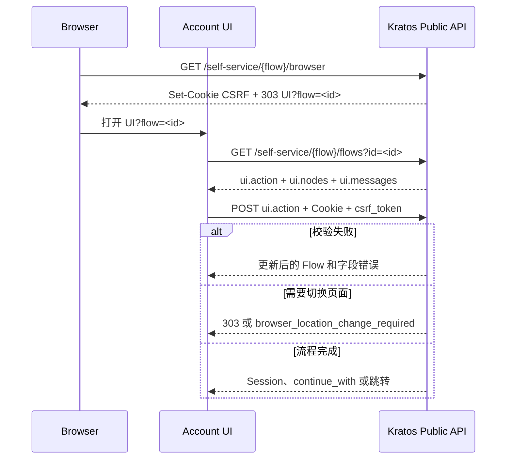

上一篇介绍了 Kratos 的核心抽象和数据模型。这一篇只做一件事：沿浏览器请求完整执行 Kratos 的各个 Workflow，理解 Flow 如何创建、如何驱动 UI、成功后修改了什么，以及失败时应该怎样处理。

<!-- more -->

## 1. 先理解统一的 Flow 协议

Registration、Login、Settings、Recovery 和 Verification 的业务目标不同，但 Browser Flow 都遵循同一种交互协议：



### 1.1 创建、读取和提交

| 阶段 | 请求 | 作用 |
| --- | --- | --- |
| 创建 | `GET /self-service/{flow}/browser` | 创建 Flow、设置 CSRF Cookie、跳转 UI |
| 读取 | `GET /self-service/{flow}/flows?id=...` | 返回当前状态、表单节点和错误 |
| 提交 | `POST /self-service/{flow}?flow=...` | 提交当前方法所需字段 |

UI 必须使用服务端返回的：

```text
ui.action    表单提交地址
ui.method    HTTP Method
ui.nodes     输入框、隐藏字段和按钮
ui.messages  Flow 级错误
node.messages 字段级错误
```

不要在前端写死 Kratos 的字段协议。启用 Code、OIDC、TOTP 或 Passkey 后，同一个 Flow 的 Nodes 会随配置和状态变化。

### 1.2 Browser Flow 为什么依赖 Cookie

Browser Flow 同时依赖：

```text
Flow ID
CSRF Cookie
csrf_token Node
当前浏览器上下文
```

只有 Flow ID 不足以获得操作权限。把 `/settings?flow=...` 复制到另一个没有对应 Cookie 的浏览器，不能复用原来的 Settings 授权。

浏览器 SDK 请求需要携带 Cookie：

```text
credentials: "include"
```

Flow 有过期时间。过期后读取通常返回 `404` 或 `410`，UI 应重新从 `/browser` 入口创建，而不是反复提交旧 ID。

### 1.3 Browser Flow 与 API Flow

```text
Browser Flow
→ Cookie + CSRF 防护
→ 成功后设置 Session Cookie

API Flow
→ 给 Native App / CLI 使用
→ 成功后响应 Session Token
```

API Flow 不是绕过认证的管理接口。它仍然通过 `ui.nodes` 收集并验证凭证，只是不用浏览器跳转和 Cookie 会话。

## 2. 本文的运行环境

当前教学环境使用：

| 地址 | 作用 |
| --- | --- |
| `http://192.168.2.41:5173` | Vite Account UI |
| `http://192.168.2.41:5173/kratos/*` | 浏览器同源访问 Kratos 的代理路径 |
| `http://192.168.2.41:8080` | Traefik 入口 |
| `http://192.168.2.41:8025` | Mailpit 测试邮箱 |

请求路径转换为：

```text
Browser
  GET :5173/kratos/self-service/login/browser
    ↓ Vite Proxy
Traefik :8080
  GET /kratos/self-service/login/browser
    ↓ 删除 /kratos 前缀
Kratos Public API :4433
  GET /self-service/login/browser
```

所以浏览器 Network 面板中有 `/kratos`，Kratos 日志里的 `path` 通常没有。

示例 Identity Schema 把邮箱标记为：

```text
password identifier
code identifier，via=email
verification address，via=email
recovery address，via=email
```

它决定邮箱可以用于密码登录、验证码登录、地址验证和账号恢复。`use: code` 决定挑战形式，Schema 中的 `via: email` 决定投递渠道。

## 3. Registration：注册 Identity

用户打开：

```text
http://192.168.2.41:5173/registration
```

执行过程：

| 步骤 | 请求或响应 | 关键结果 |
| ---: | --- | --- |
| 1 | `GET /kratos/self-service/registration/browser` | 创建 Registration Flow 和 CSRF Cookie |
| 2 | `303 /registration?flow=<id>` | 浏览器进入 Account UI |
| 3 | `GET /kratos/self-service/registration/flows?id=<id>` | 返回邮箱、姓名、密码等 Nodes |
| 4 | `POST /kratos/self-service/registration?flow=<id>` | 提交 `csrf_token`、`method=password`、`traits.*` 和密码 |
| 5 | Kratos 校验 Schema、标识和密码策略 | 创建 Identity、Credential 和地址记录 |
| 6 | 根据 After Hook 创建 Session 或继续 Verification | 返回 `Set-Cookie`、`continue_with` 或跳转 |

注册提交示意：

```json
{
  "method": "password",
  "csrf_token": "...",
  "traits": {
    "email": "alice@example.com",
    "name": "Alice"
  },
  "password": "..."
}
```

成功后主要产生：

```text
Identity
├── traits.email = alice@example.com
├── Password Credential
├── Credential Identifier = alice@example.com
├── Verifiable Address = alice@example.com, verified=false
└── Recovery Address = alice@example.com
```

如果配置允许注册后直接建立 Session，还会创建 Session。注册成功不等于邮箱已验证，这两个状态必须分开。

邮箱重复、Schema 校验失败或密码不符合策略时，Kratos 返回更新后的同一个 Flow。UI 应显示 `ui.messages` 或 Node Error，不应把所有错误替换成前端自定义的通用提示。

## 4. Verification：验证邮箱或手机号

Verification 只改变地址的验证状态，不创建另一个 Identity，也不等同于登录。

以 Code 为例：

```text
1. 创建 Verification Flow
2. 提交要验证的已登记地址
3. Kratos 生成短期 Code，并写入 Courier Message
4. Courier Worker 通过 SMTP 或短信渠道投递
5. 用户把 Code 提交到同一个 Flow
6. Kratos 校验 Code 和 Flow
7. Verifiable Address 变为 verified=true
```

对应请求：

```http
GET  /self-service/verification/browser
GET  /self-service/verification/flows?id=<flow-id>
POST /self-service/verification?flow=<flow-id>
```

当注册成功响应包含 Verification 的 `continue_with` 时，UI 应按服务端指示继续验证页面，而不是自行拼接 Flow URL。

Courier 链路是：

```text
Kratos Flow
  ↓ INSERT courier_messages
SQL Database
  ↓ kratos courier watch
Courier Worker
  ↓ SMTP / HTTP Channel
Mailpit / Email / SMS Provider
```

浏览器 Network 面板只能看到 Flow 请求，看不到 Courier Worker 到 SMTP 的通信。后半段需要查看 Courier 日志和 Mailpit。

## 5. Login：创建或提升 Session

### 5.1 Password Login

用户访问 `/login` 后：

| 步骤 | 请求或响应 | 关键结果 |
| ---: | --- | --- |
| 1 | `GET /kratos/self-service/login/browser` | 创建 Login Flow |
| 2 | `303 /login?flow=<id>` | 进入 Login UI |
| 3 | `GET /kratos/self-service/login/flows?id=<id>` | 获取标识、密码和 CSRF Nodes |
| 4 | `POST /kratos/self-service/login?flow=<id>` | 提交 `method=password`、`identifier` 和密码 |
| 5 | 校验 Credential 成功 | 创建 Session 并设置 `ory_kratos_session` Cookie |
| 6 | `GET /kratos/sessions/whoami` | UI 恢复已登录状态 |

密码错误不会创建 Session。Kratos 返回带错误的 Login Flow，UI 继续渲染当前 Flow。

### 5.2 Code Login

Code Login 在同一个 Flow 中分两次提交：

```text
POST method=code + identifier
→ Kratos 生成 Code
→ Courier 投递
→ Flow Nodes 变成验证码输入

POST method=code + code
→ Code 正确且未过期
→ 创建 AAL1 Session
```

Verification Code、Recovery Code 和 Login Code 属于不同 Flow，不能互换。

### 5.3 OIDC Login

用户使用 Google 等外部身份提供方登录时：

```text
Login Flow
  ↓ method=oidc + provider=google
Kratos
  ↓ Authorization Request
Google
  ↓ authorization code
Kratos
  ↓ 换取并校验 ID Token
  ↓ Jsonnet Mapper 转换 claims
  ↓ 使用 provider ID + claims.sub 查找 OIDC Credential
  ↓ 创建或读取本地 Identity
  ↓ 创建 Kratos Session
```

账号关联使用上游稳定的 `provider + sub`，不能只根据邮箱静默合并。邮箱、姓名和头像由 Mapper 转成 Traits/Metadata，并且必须通过本地 Identity Schema。

只使用 Google 登录的 Identity 不必再创建 Password Credential。需要增加密码时，让已经登录的用户通过 Settings Flow 主动设置。

Hydra 不参与“使用 Google 登录 Kratos”。Hydra 用于让自己的系统成为 OAuth2/OIDC Provider，职责不同。

### 5.4 Passkey Login

```text
1. Login Flow 返回 Passkey Challenge Node
2. 前端调用 navigator.credentials.get(...)
3. 用户使用指纹、面容或设备 PIN
4. 前端提交 WebAuthn Assertion
5. Kratos 使用已保存的公钥验证并创建 Session
```

生物信息不会上传到 Kratos。Kratos 保存公钥凭证、Credential ID 和计数等 WebAuthn 数据。

## 6. Session：页面如何判断是否登录

登录成功的标志是 Kratos 已创建 Session。SPA 为了在刷新后恢复页面状态，会调用：

```http
GET /kratos/sessions/whoami
Cookie: ory_kratos_session=...
```

| 响应 | UI 行为 |
| --- | --- |
| `200 OK` | 读取 `session.identity`、AAL 和过期时间 |
| `401 Unauthorized` | 进入匿名状态 |
| 其他错误 | 显示查询失败，允许重试 |

核心响应：

```json
{
  "id": "session-123",
  "active": true,
  "expires_at": "2026-09-03T10:00:00Z",
  "authenticated_at": "2026-09-02T10:00:00Z",
  "authenticator_assurance_level": "aal1",
  "authentication_methods": [
    { "method": "password", "aal": "aal1" }
  ],
  "identity": {
    "id": "identity-alice",
    "traits": { "email": "alice@example.com" }
  }
}
```

业务系统使用 `identity.id` 关联用户。Gateway/Oathkeeper 也可以调用同一接口验证 Cookie，再把身份转换成短期 Internal JWT。

## 7. AAL2：对敏感操作进行 Step-up Authentication

AAL 表示当前 Session 已完成多强的认证，不是用户角色：

```text
只验证 Password
→ Session AAL1

在同一个 Session 中继续验证 TOTP / WebAuthn / Lookup Secret
→ Session AAL2
```

“Identity 已绑定 TOTP”和“当前 Session 已验证 TOTP”是两件事。敏感接口必须检查 Session 的实际 AAL 和认证时间。

### 7.1 先绑定第二因素

Alice 在已登录 Settings Flow 中绑定 TOTP：

```text
1. 创建 Settings Flow
2. UI 渲染 TOTP 二维码或 Secret
3. Alice 使用 Authenticator App 扫码
4. 提交当前 TOTP Code
5. Kratos 校验后保存 TOTP Credential
6. 生成 Lookup Secrets，用户离线保存
```

TOTP Secret 是 Credential，不能放在 Traits。

### 7.2 业务接口触发 AAL2

假设修改支付方式要求 AAL2，但当前 Session 只有 AAL1：

```text
1. Browser 请求敏感接口
2. Gateway 从 whoami 得到 aal1
3. 业务策略返回 403 aal2_required
4. UI 导航到 /self-service/login/browser?aal=aal2&return_to=...
5. Kratos 返回当前 Identity 已绑定的二次认证 Nodes
6. Alice 提交 TOTP / WebAuthn / Lookup Secret
7. Kratos 把原 Session 提升为 aal2
8. 浏览器回到 return_to，重新请求业务接口
```

Flow 创建请求必须携带原有 Session Cookie：

```http
GET /self-service/login/browser?
  aal=aal2&
  return_to=https://app.example.com/billing
Cookie: ory_kratos_session=...
```

`return_to` 必须位于允许列表。高风险操作还可以要求最近几分钟内重新完成认证，此时使用 `refresh=true` 并检查可信的 `authenticated_at`。

职责边界是：

| 工作 | 负责方 |
| --- | --- |
| 校验 TOTP、WebAuthn 或 Lookup Secret | Kratos |
| 返回当前 Session 的可信 AAL | Kratos `/sessions/whoami` |
| 决定哪个业务操作要求 AAL2 | Gateway、OPA 或业务服务 |
| 展示并提交二次认证 Nodes | Account UI |

## 8. Logout：撤销 Session

浏览器注销分为两步：

```text
1. GET /self-service/logout/browser
   → 返回一次性 logout_url 和 logout_token

2. 浏览器导航到 logout_url
   → Kratos 撤销 Session
   → 清理 Cookie
   → 跳转登录页
```

前端必须使用 Kratos 返回的完整 `logout_url`。只清除 React 状态或本地 Cookie 展示，不会撤销服务端 Session。

Native App 使用 API Logout 撤销 Session Token，不需要模拟浏览器跳转。

## 9. Recovery 与 Settings：找回并重设凭证

找回密码不是在 Recovery Flow 中直接提交新密码，而是两个连续流程：

```text
Recovery Flow
→ 证明用户控制恢复地址
→ Kratos 创建受限 Settings Flow
→ Settings Flow 修改 Password Credential
```

### 9.1 申请并验证 Recovery Code

| 步骤 | 请求或状态 | 关键结果 |
| ---: | --- | --- |
| 1 | `GET /self-service/recovery/browser` | 创建 Recovery Flow |
| 2 | `GET /self-service/recovery/flows?id=<id>` | 返回邮箱输入 Nodes |
| 3 | `POST method=code + email` | 生成 Code，Courier 投递，状态变为 `sent_email` |
| 4 | 再次 `POST method=code + code` | 验证恢复能力 |
| 5 | 返回 `303` 或 `422 browser_location_change_required` | 浏览器必须进入 `/settings?flow=<settings-id>` |

AJAX/SDK 模式中的 `422 browser_location_change_required` 不是验证码错误，而是告诉 UI 必须执行浏览器跳转。

Recovery 响应通常不应泄露邮箱是否存在，防止攻击者枚举账号。

### 9.2 Recovery 授权的 Settings Flow

浏览器进入：

```text
/settings?flow=<settings-flow-id>
```

然后：

```text
GET  /self-service/settings/flows?id=<id>
POST /self-service/settings?flow=<id>
     method=password + 新密码 + csrf_token
```

成功后 Kratos 更新 Password Credential，并通过 `continue_with.redirect_browser_to` 或 `303` 返回配置的页面。Flow ID 还依赖 Recovery 过程建立的 Cookie，不能作为独立重置密码 Token 使用。

### 9.3 已登录用户主动修改设置

已登录用户从：

```http
GET /self-service/settings/browser
Cookie: ory_kratos_session=...
```

创建 Settings Flow，可以修改 Profile、Password、TOTP、Passkey 或 OIDC 关联。

敏感设置受 `privileged_session_max_age` 限制。Session 太旧时，提交可能返回 `403 session_refresh_required`，UI 应按 `redirect_browser_to` 进入 `refresh=true` 的 Login Flow，重新证明身份后再继续设置。

## 10. 各种认证方法如何选择

| 类型 | 方法 | 成功结果 | 额外依赖 |
| --- | --- | --- | --- |
| 首要认证 | Password | AAL1 Session | 密码哈希配置 |
| 首要认证 | Code | AAL1 Session | Courier + 邮件或短信 |
| 首要认证 | OIDC | AAL1 Session | 外部 Provider + Mapper |
| 首要认证 | Passkey | AAL1 Session | HTTPS、稳定 RP ID |
| 二次认证 | TOTP | Session 提升到 AAL2 | Authenticator App |
| 二次认证 | WebAuthn | Session 提升到 AAL2 | HTTPS、安全密钥或平台认证器 |
| 二次认证 | Lookup Secret | Session 提升到 AAL2 | 用户离线保存恢复码 |
| 辅助流程 | Verification | 地址变为已验证 | Courier |
| 辅助流程 | Recovery | 获得受限 Settings 能力 | Courier |

Passkey 和 WebAuthn 都基于 WebAuthn 标准，但这里的用途不同：Passkey 用作无密码首要认证，WebAuthn 用作第二因素。实际 UI 必须能处理 Kratos 返回的对应 Nodes。

Lookup Secret 是丢失第二因素时使用的 AAL2 备用方法，不等于 Recovery Flow。Recovery Flow 用于无法正常登录时恢复账号。

## 11. 如何在 Network 面板排查 Flow

打开浏览器开发者工具并启用 Preserve Log，按下面的模式过滤：

```text
self-service/<flow>/browser
→ 创建 Flow，通常返回 303

self-service/<flow>/flows?id=...
→ 读取 Flow，通常返回 200

self-service/<flow>?flow=...
→ 提交 Flow，返回成功、跳转或更新后的错误 Flow

sessions/whoami
→ 查询登录状态，不负责提交认证凭证
```

排查时记录：

- 地址栏 UI URL 和 Flow ID；
- Network 请求的 Method、URL、Status 和 Initiator；
- 请求是否携带 Cookie、响应是否包含 `Set-Cookie`，但不要记录具体值；
- `ui.action`、`ui.nodes`、`ui.messages` 和 `continue_with`；
- Kratos 日志中的 Path、Status 和 Flow ID。

常见失败分支：

| 现象 | 含义 | UI 应如何处理 |
| --- | --- | --- |
| Registration 返回字段错误 | 邮箱重复、Schema 或密码策略失败 | 渲染更新后的 Flow |
| Login 密码错误 | Credential 校验失败，未创建 Session | 保留当前 Flow 并显示 Node Error |
| Code 错误或过期 | 当前挑战无效 | 留在当前 Flow，允许重新提交或创建 |
| Flow `404/410` | Flow 不存在或已过期 | 从 `/browser` 重新创建 |
| `browser_location_change_required` | 必须进入新的浏览器地址 | 导航到 `redirect_browser_to` |
| `session_refresh_required` | Session 不够新鲜 | 完成 Refresh Login 后重试 |
| `whoami 401` | 当前没有有效 Session | UI 进入匿名状态 |

不要把密码、Code、CSRF Token、Session Cookie 或完整 Logout Token 写入日志。

## 12. 端到端验收顺序

| 顺序 | Workflow | 验收结果 |
| ---: | --- | --- |
| 1 | Registration | 创建 Identity 和 Credential，错误分支能回显 |
| 2 | Verification | Courier 投递成功，地址变为 verified |
| 3 | Session | `whoami` 返回当前 Identity，刷新页面仍保持登录 |
| 4 | Authenticated Settings | 能修改密码或绑定第二因素 |
| 5 | Logout | 服务端 Session 撤销，`whoami` 返回 `401` |
| 6 | Login | 使用新密码重新创建 Session |
| 7 | AAL2 | 敏感操作触发 Step-up，Session 提升后成功 |
| 8 | Recovery | Code 验证后进入受限 Settings Flow |
| 9 | Recovery Settings | 重设密码成功，过期或错误 Code 不可进入 Settings |

完成标准不是“页面看起来跳转成功”，而是每个 Workflow 都能在 Network 面板对应到创建、读取、提交和服务端状态变化。

## 13. 总结

所有 Kratos Workflow 都可以用同一个心智模型理解：

```text
服务端创建 Flow
→ UI 根据 ui.nodes 渲染
→ 浏览器携带 Cookie 和 CSRF 提交
→ Kratos 校验 Credential、Schema 和 Flow 状态
→ 更新 Identity、Credential、Address 或 Session
→ 返回错误 Flow、继续动作或安全跳转
```

不同 Workflow 的区别只在于最终修改的对象：

```text
Registration → Identity + Credential
Verification → Verifiable Address
Login        → Session
Settings     → Traits / Credential
Recovery     → 受限 Settings 授权
Logout       → Session 撤销
```

## 参考资料

- [上一篇：Ory Kratos 核心架构与数据模型](./004_ory_kratos.md)
- [Ory Kratos Self-service Flows](https://www.ory.com/docs/kratos/self-service)
- [Ory Kratos Session Management](https://www.ory.com/docs/kratos/session-management/overview)
- [Ory Kratos API](https://www.ory.com/docs/kratos/reference/api)
