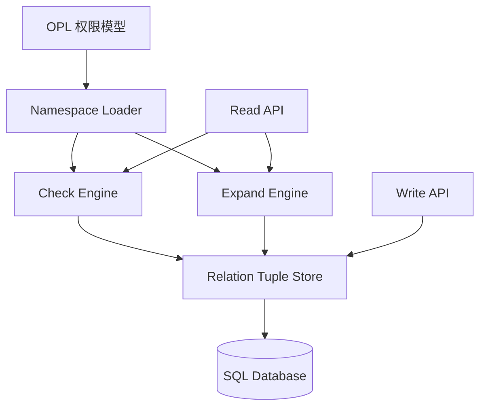
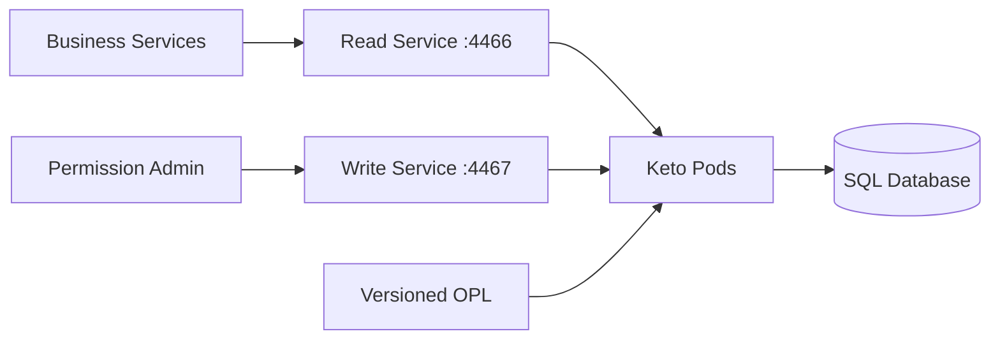

Kratos 回答“调用者是谁”，Keto 回答“这个调用者能否对这个资源执行某个动作”。

Keto 不保存密码、不验证 Session，也不签发登录 Token。它保存长期权限关系，并根据 OPL 和 Relation Tuple 计算 Permission。

本文先用最小篇幅建立 Keto 的关键概念，再说明运行架构、组织权限上限、接口、存储与部署。前文已经完整展开的复杂示例和请求链路只提供跳转，不再重复。

<!-- more -->

## 1. 先建立 Keto 的核心模型

Keto 的核心不是一张“用户—角色—权限”表，而是一张由对象关系组成的图。理解这张图需要六个概念。

### 1.1 Namespace：对象类型

Namespace 表示系统中可以参与权限关系的对象类型：

```text
User          用户
Organization  组织
Team          团队
Document      文档
```

它类似业务模型中的类型定义，不表示某个具体对象。`Organization` 是 Namespace，组织 G 才是这个 Namespace 下的具体 Object。

### 1.2 Object：具体对象

Object 由 Namespace 和业务 ID 共同确定：

```text
Organization:G
Document:doc-001
User:alice-id
```

不同 Namespace 可以使用相同 ID，它们仍然是不同对象：

```text
Organization:123 != Document:123
```

用户 Object 的 ID 应使用稳定的 Kratos `identity.id`，不要使用可能变化的邮箱或用户名。Kratos 与 Keto 的主体映射见 [Kratos：提供稳定主体](./002_auth_rebac_abac.md#3-kratos提供稳定主体)。

### 1.3 Relation：已经存在的关系

Relation 描述两个对象之间已经成立的事实：

```text
Alice 是组织 G 的管理员
Bob 是团队 A 的成员
doc-001 的父级是 project-a
```

可以分别命名为：

```text
admins
members
parent
```

Relation 本身只定义关系名称，具体事实通过 Relation Tuple 保存。

### 1.4 Relation Tuple：一条关系事实

Relation Tuple 的通用格式是：

```text
Namespace:Object#Relation@Subject
```

例如：

```text
Organization:G#admins@User:alice-id
```

从左向右读取：

```text
在 Organization:G 上
User:alice-id
处于 admins 关系中
```

Tuple 保存的是事实，不是最终权限结果。因此通常保存：

```text
Alice 是 G 的管理员
```

而不保存：

```text
Alice 可以修改 G 的关键词
```

后者由 Keto 根据 OPL 在权限检查时计算。

### 1.5 Subject 与 Subject Set：单个主体和主体集合

Tuple 右侧的 Subject 可以是单个对象：

```text
Organization:G#admins@User:alice-id
```

也可以引用另一个关系所表示的主体集合：

```text
Document:doc-001#viewers@Team:team-a#members
```

`Team:team-a#members` 称为 Subject Set，表示 team-a 中的所有成员。整条 Tuple 的含义是：

```text
team-a 的所有成员都是 doc-001 的 viewer
```

Subject Set 可以把一个团队、组织角色或其他成员集合整体授予资源，不需要为每个用户分别写 Tuple。

### 1.6 Permission：根据关系计算出的能力

Permission 表示主体能够执行的动作：

```text
view
edit
start_crawl
modify_keywords
```

它与 Relation 的区别是：

```text
Relation    保存已经存在的事实
Permission 根据一个或多个 Relation 计算结果
```

例如：

```text
Relation
→ Alice 是 G 的 admins

Permission
→ admins 可以 modify_keywords

计算结果
→ Alice 可以 modify_keywords
```

### 1.7 OPL、Check 与 Expand

Ory Permission Language（OPL）负责定义 Permission 如何从 Relation 推导出来；Relation Tuple 提供本次计算使用的事实：

```text
OPL            静态规则，随权限模型发布
Relation Tuple 动态事实，随业务事件变化
```

业务服务调用 Check，询问一个明确问题：

```text
User:alice-id
能否对 Organization:G
执行 modify_keywords？
```

Keto 根据 OPL 遍历 Relation Tuple，最终返回：

```json
{"allowed": true}
```

Expand 则展开 Permission 对应的 Subject Tree，用于解释和排查权限来自哪条关系路径。业务操作是否允许，仍然以 Check 结果为准。

完整的团队授权、Subject Set 和父级权限继承示例见 [Keto：保存关系并计算 Permission](./002_auth_rebac_abac.md#4-keto保存关系并计算-permission)。本文后面只继续讲尚未展开的组织权限上限，不重复该示例。

## 2. Keto 的运行架构

Keto 可以分成模型、数据、计算和接口四层：



| 模块 | 职责 |
| --- | --- |
| Namespace Loader | 加载并解析 OPL，建立 Namespace、Relation 和 Permission 模型 |
| Relation Tuple Store | 读取和写入关系事实 |
| Check Engine | 遍历关系并返回 `allowed=true/false` |
| Expand Engine | 展开 Subject Tree，解释权限由哪些关系构成 |
| Read API | 对业务服务提供检查、展开和关系查询能力 |
| Write API | 对可信管理服务提供关系变更能力 |
| Persistence | 保存 Tuple、Namespace 映射和提交信息 |

一次 Permission Check 的内部过程可以概括为：

```text
1. Read API 接收 Namespace、Object、Permission 和 Subject
2. Check Engine 从已加载的 OPL 中找到 Permission 规则
3. 按规则从 Relation Tuple Store 读取直接关系或 Subject Set
4. 继续遍历引用的对象和关系
5. 根据并集、交集等条件返回 allowed
```

业务服务应依赖 Keto 的 REST、gRPC 或生成的 SDK 契约，不应导入 Keto 的内部实现。

## 3. 组织权限如何限制成员权限

前文已经展示了团队授权和父级继承。本节只补充另一个问题：

```text
组织购买或启用了哪些能力？
组织内某个角色获得了哪些能力？
如何保证成员权限不超过组织权限？
```

最终 Permission 应同时满足两个条件：

```text
最终权限 = 组织权限上限 AND 角色授权
```

### 3.1 示例

```text
组织 G
├── Alice：管理员
└── Bob：普通成员

组织 G 启用：
- start_crawl
- view_content
- modify_keywords

普通成员获得：
- start_crawl
- view_content

管理员额外获得：
- modify_keywords
```

对应的 Relation 分成三类：

| 类型 | Relation | 含义 |
| --- | --- | --- |
| 组织角色 | `members`、`admins` | 用户在当前组织中的角色 |
| 组织上限 | `entitled_*` | 组织是否启用某项能力 |
| 角色授权 | `granted_*` | 组织内的角色是否获得某项能力 |

角色关系绑定在具体组织对象上：

```text
Organization:G#admins@User:alice-id
Organization:W#members@User:alice-id
```

因此 Alice 是 G 的管理员、W 的普通成员，不存在“全局管理员”的歧义。

### 3.2 使用 OPL 计算交集

```typescript
import { Namespace, Context, SubjectSet } from "@ory/keto-namespace-types"

class User implements Namespace {}

class Organization implements Namespace {
  related: {
    members: User[]
    admins: User[]

    entitled_start_crawl: (
      SubjectSet<Organization, "members"> |
      SubjectSet<Organization, "admins">
    )[]
    entitled_view_content: (
      SubjectSet<Organization, "members"> |
      SubjectSet<Organization, "admins">
    )[]
    entitled_modify_keywords: (
      SubjectSet<Organization, "members"> |
      SubjectSet<Organization, "admins">
    )[]

    granted_start_crawl: (
      SubjectSet<Organization, "members"> |
      SubjectSet<Organization, "admins">
    )[]
    granted_view_content: (
      SubjectSet<Organization, "members"> |
      SubjectSet<Organization, "admins">
    )[]
    granted_modify_keywords: (
      SubjectSet<Organization, "members"> |
      SubjectSet<Organization, "admins">
    )[]
  }

  permits = {
    start_crawl: (ctx: Context): boolean =>
      this.related.entitled_start_crawl.includes(ctx.subject) &&
      this.related.granted_start_crawl.includes(ctx.subject),

    view_content: (ctx: Context): boolean =>
      this.related.entitled_view_content.includes(ctx.subject) &&
      this.related.granted_view_content.includes(ctx.subject),

    modify_keywords: (ctx: Context): boolean =>
      this.related.entitled_modify_keywords.includes(ctx.subject) &&
      this.related.granted_modify_keywords.includes(ctx.subject),
  }
}
```

三个 Permission 都使用 `&&`：组织权限上限和角色授权必须同时命中。

### 3.3 写入关系

先写入用户在组织 G 中的角色：

```text
Organization:G#admins@User:alice-id
Organization:G#members@User:bob-id
```

组织 G 启用了全部三项能力，因此 `entitled_*` 覆盖两个角色集合：

```text
Organization:G#entitled_start_crawl@Organization:G#members
Organization:G#entitled_start_crawl@Organization:G#admins
Organization:G#entitled_view_content@Organization:G#members
Organization:G#entitled_view_content@Organization:G#admins
Organization:G#entitled_modify_keywords@Organization:G#members
Organization:G#entitled_modify_keywords@Organization:G#admins
```

普通成员只能启动和查看，管理员还可以修改关键词：

```text
Organization:G#granted_start_crawl@Organization:G#members
Organization:G#granted_start_crawl@Organization:G#admins
Organization:G#granted_view_content@Organization:G#members
Organization:G#granted_view_content@Organization:G#admins
Organization:G#granted_modify_keywords@Organization:G#admins
```

最终结果是：

| Permission | Alice | Bob |
| --- | ---: | ---: |
| `start_crawl` | `true` | `true` |
| `view_content` | `true` | `true` |
| `modify_keywords` | `true` | `false` |

如果组织 W 没有启用 `start_crawl`，就不写 W 对应的 `entitled_start_crawl`。即使 W 的管理员拥有 `granted_start_crawl`，交集仍然不成立。

这些 Tuple 应由订阅变更、成员加入和角色调整等业务事件维护。写入一致性的处理方式见 [关系写入与一致性](./002_auth_rebac_abac.md#7-关系写入与一致性)。

## 4. Read API 与 Write API

自托管 Keto 默认将读取面和写入面分开：

| 接口面 | 默认端口 | 典型调用方 | 作用 |
| --- | ---: | --- | --- |
| Read API | `4466` | 业务服务 | Check、Expand、查询 Tuple 和 Namespace |
| Write API | `4467` | 权限管理服务、初始化任务 | 创建和删除 Tuple |

### 4.1 Read API

| 接口 | 作用 |
| --- | --- |
| `POST /relation-tuples/check/openapi` | 检查单项权限 |
| `POST /relation-tuples/batch/check` | 批量检查权限 |
| `GET /relation-tuples/expand` | 展开权限关系树 |
| `GET /relation-tuples` | 按条件查询 Tuple |
| `GET /namespaces` | 查看已加载的 Namespace |
| `POST /opl/syntax/check` | 检查 OPL 语法 |
| `GET /health/alive`、`GET /health/ready` | 存活和就绪检查 |

Check 的请求示例和关系遍历过程已经在 [检查 Bob 能否编辑文档](./002_auth_rebac_abac.md#43-检查-bob-能否编辑文档) 中说明。Expand 用于排查关系路径，业务操作仍应以 Check 结果为准。

页面需要同时判断多个按钮或资源时，可以使用批量检查，避免逐项发起网络请求。

### 4.2 Write API

| 接口 | 作用 |
| --- | --- |
| `PUT /admin/relation-tuples` | 创建关系 |
| `PATCH /admin/relation-tuples` | 在一次请求中创建或删除多条关系 |
| `DELETE /admin/relation-tuples` | 按条件删除关系 |

访问边界应保持简单：

```text
普通业务服务 → 只访问 Read API
权限管理服务 → 按需访问 Write API
浏览器         → 不直接访问 Keto
公网           → 不暴露 Write API
```

Keto 不替 Write API 完成业务级调用者认证，因此必须使用内网隔离、mTLS、NetworkPolicy 或代理鉴权限制调用方。

### 4.3 业务接口如何映射 Permission

业务服务负责把真实请求映射成固定的 Keto 检查：

| 业务请求 | Keto Permission |
| --- | --- |
| `POST /organizations/{id}/crawl/tasks` | `Organization:{id}#start_crawl` |
| `GET /organizations/{id}/crawl/contents` | `Organization:{id}#view_content` |
| `PUT /organizations/{id}/crawl/keywords` | `Organization:{id}#modify_keywords` |

映射规则由服务端代码确定。浏览器不能自行指定要检查的 Permission，也不能声明资源所属组织。

身份如何到达业务服务、业务服务何时调用 Keto，见 [一次完整的用户请求](./003_auth.md#5-一次完整的用户请求)，本文不再重复整条网络链路。

## 5. 存储模型

Keto 的主要业务数据是 Relation Tuple。概念上，一条记录包含：

| 数据 | 含义 |
| --- | --- |
| Namespace 与 Object | 被描述的资源类型和 ID |
| Relation | 资源上的关系 |
| Subject ID | 直接主体 |
| Subject Set | 间接引用的对象、关系和主体集合 |
| Commit 信息 | 关系提交和版本信息 |

直接主体和 Subject Set 是两种不同表达：

```text
User:alice-id
Group:engineering#members
```

数据库约束需要保证一条 Tuple 的主体表达合法。Namespace 映射、UUID 和分片字段属于 Keto 的内部实现，不应成为业务接口。

业务系统只通过 Keto API 维护关系，不直接读写内部表。这样升级 Keto 时，业务代码不会与某个版本的表结构绑定。

自托管环境使用 SQL 数据库保存关系。内存存储只适合测试；开发环境使用的轻量存储也不应直接作为生产方案。

## 6. 配置与 OPL 发布

### 6.1 自托管配置

```yaml
dsn: postgres://keto:<password>@postgres:5432/keto?sslmode=require

serve:
  read:
    host: 0.0.0.0
    port: 4466
  write:
    host: 0.0.0.0
    port: 4467

namespaces:
  location: file:///etc/config/keto/namespaces.ts
```

推荐目录：

```text
keto/
├── keto.yml
└── namespaces.ts
```

Keto 启动时读取 `namespaces.location`，解析 OPL 并建立权限计算模型。OPL 不会写入 Relation Tuple 表，也不能通过 Relation Tuple Write API 上传。

`namespaces.ts` 应当：

```text
与应用代码一起版本管理
在发布前执行语法检查和权限用例测试
通过只读 Volume、ConfigMap 或配置镜像提供给 Keto
模型变化后按部署流程重新加载
```

OPL 的语言边界已经在 [使用 OPL 定义关系规则](./002_auth_rebac_abac.md#41-使用-opl-定义关系规则) 中说明。这里需要关注的是发布方式：OPL 属于应用版本的一部分，必须能够审计和回滚。

Ory Network 通过控制面或 CLI 管理 OPL；自托管环境通过 `namespaces.location` 加载文件。这是两种不同的发布方式，不应混用。

### 6.2 数据库迁移

自托管环境应先完成数据库迁移，再启动 Keto：

```bash
keto migrate up -c /etc/config/keto/keto.yml
keto serve -c /etc/config/keto/keto.yml
```

开发环境可以自动迁移。生产环境更适合使用独立 Migration Job，确保迁移成功后再滚动发布多个 Keto 实例。

## 7. Kubernetes 部署边界

Kubernetes 中通常分别暴露 Read Service 和 Write Service：



部署时遵守以下约束：

```text
Read Service 可以按 Check 流量水平扩容
Write Service 不创建公网 Ingress
NetworkPolicy 只允许受信工作负载访问 Write Service
DSN 从 Secret 或外部 Secret Manager 注入
所有实例加载相同版本的 OPL
所有实例连接同一个可靠的关系存储
```

Keto 是有状态权限服务。扩容 Pod 只能增加计算和接口容量，不能替代数据库的高可用和备份。

## 8. 工程边界

### 8.1 Keto 保存什么

```text
组织成员和团队成员关系
资源 owner、editor、viewer 关系
父级资源和权限继承关系
共享关系
组织权限上限与角色授权
```

### 8.2 Keto 不保存什么

```text
密码、Credential、Session       → Kratos
Internal JWT                    → Oathkeeper 或专门签发方
资源锁定、订单状态等业务数据     → 业务数据库
风险等级、时间等动态请求属性      → 业务服务与 OPA
```

完整的组件职责边界见 [ReBAC 与 ABAC 的四个组件](./002_auth_rebac_abac.md#2-四个组件的职责边界)，完整架构见 [本系列 Ory 组件总架构](./003_auth.md#9-本系列-ory-组件总架构)。

### 8.3 默认拒绝

Keto 超时、返回异常或必要关系尚未同步时，受保护操作应失败关闭，不能因为权限服务不可用而跳过检查。

`401`、`403` 和依赖不可用的处理已经在 [一次完整的用户请求](./003_auth.md#5-一次完整的用户请求) 中说明；发布前需要覆盖的权限测试见 [使用测试矩阵验证模型](./002_auth_rebac_abac.md#8-使用测试矩阵验证模型)。

## 9. 总结

Keto 在系统中承担三个职责：

```text
加载 OPL，得到权限计算规则
保存 Relation Tuple，记录长期关系事实
通过 Check 和 Expand 计算、解释权限
```

业务系统通过 Read API 检查权限，通过受保护的 Write API 维护关系。生产部署需要把 OPL 作为代码发布，把数据库迁移作为独立步骤，并严格隔离 Write API。

组织权限和成员权限同时存在时，不要把管理员理解为全局角色。角色应绑定在具体组织对象上，最终 Permission 由组织权限上限与角色授权取交集。

## 参考资料

- [Ory Keto](https://www.ory.com/keto)
- [Ory Permission Language](https://www.ory.com/blog/what-is-the-ory-permission-language)
- [前文：ReBAC 与 ABAC](./002_auth_rebac_abac.md)
- [前文：认证和鉴权架构](./003_auth.md)
