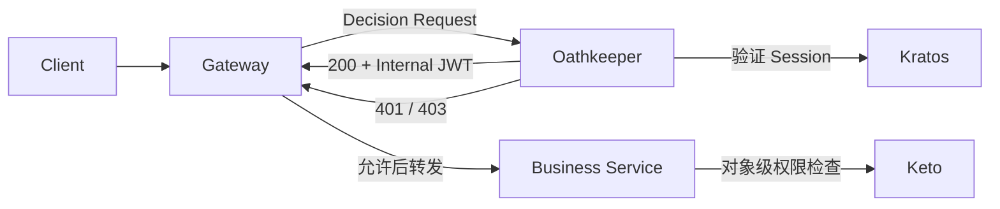
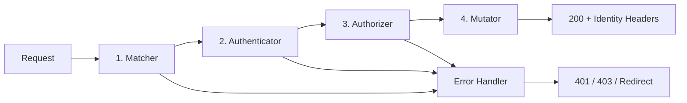
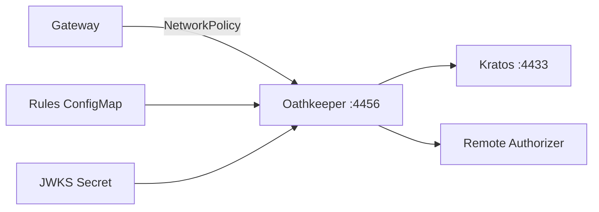

Oathkeeper 位于 Gateway 与认证、鉴权服务之间，将不同外部凭证转换成统一的访问决定和身份上下文：

```text
外部请求
→ 匹配访问规则
→ 验证凭证
→ 判断是否允许
→ 生成内部身份信息
→ 业务服务
```

Oathkeeper 不是完整的 API Gateway。它不负责服务发现、负载均衡、限流和流量治理，这些工作仍由 Traefik、APISIX、Envoy 或 Nginx 完成。

<!-- more -->

## 1. Oathkeeper 在架构中的位置

本系列采用的入口架构是：



各组件的边界如下：

| 组件 | 负责 |
| --- | --- |
| Gateway | TLS、路由、限流、Forward Auth、转发请求 |
| Oathkeeper | 匹配 Access Rule、验证外部凭证、执行入口授权、生成身份上下文 |
| Kratos | 验证 Session，返回 Identity |
| Keto | 根据主体与业务资源关系计算 Permission |
| 业务服务 | 验证内部身份，加载真实资源并执行对象级鉴权 |

认证和鉴权的整体架构已经在 [认证和鉴权架构](./003_auth.md#4-推荐架构外部凭证转换为-internal-jwt) 中介绍。本文只展开 Oathkeeper 自身。

## 2. 两种运行模式

Oathkeeper 提供两种入口：

| 模式 | 默认端口 | 谁转发业务请求 |
| --- | ---: | --- |
| Reverse Proxy | `4455` | Oathkeeper |
| Access Control Decision API | `4456` | 现有 Gateway |

### 2.1 Reverse Proxy

```text
Client → Oathkeeper :4455 → Upstream Service
```

Oathkeeper 匹配规则、执行安全流水线并直接代理业务请求。它适合没有其他 Gateway 的简单系统。

### 2.2 Decision API

```text
Client → Gateway
           ├── Oathkeeper :4456/decisions
           └── 允许后转发到 Upstream Service
```

Gateway 暂停原始请求，把 Method、URL、Header 和 Credential 交给 `/decisions`。Oathkeeper 只返回决定，不代理原始业务流量：

| 响应 | 含义 |
| ---: | --- |
| `200` | 允许，可以附带写入上游请求的 Header |
| `401` | 没有有效身份 |
| `403` | 身份有效，但入口授权失败 |
| `404` | 没有匹配的 Access Rule，默认拒绝 |

系统已经使用 Traefik、APISIX、Envoy 或 Nginx 时，优先使用 Decision API，避免再增加一层业务反向代理。

## 3. Access Rule：一条入口安全策略

Oathkeeper 不是在代码中为每个路由编写判断逻辑，而是加载 Access Rule。每条 Rule 包含五部分：

```text
match          哪些请求使用这条规则
upstream       Reverse Proxy 模式下转发到哪里
authenticators 接受哪些外部凭证
authorizer     这个身份能否通过入口
mutators       向上游传递什么身份上下文
errors         失败时如何响应
```

一个请求只能匹配一条 Rule。没有匹配时默认拒绝；多条规则同时匹配通常意味着规则边界不清晰。

### 3.1 一个完整的 Access Rule

下面的规则完成三件事：

```text
验证 Kratos Session Cookie
允许已经通过认证的用户进入文档接口
签发供内部服务使用的短期 JWT
```

```yaml
- id: document-api
  match:
    url: https://api.example.com/documents/<.*>
    methods: [GET, POST, PUT, DELETE]

  upstream:
    url: http://document-service:8080

  authenticators:
    - handler: cookie_session
      config:
        check_session_url: http://kratos:4433/sessions/whoami
        preserve_path: true
        extra_from: "@this"
        subject_from: identity.id

  authorizer:
    handler: allow

  mutators:
    - handler: id_token
      config:
        claims: |
          {
            "sub": "{{ print .Subject }}"
          }

  errors:
    - handler: json
```

这里的 `allow` 只表示“认证成功即可进入业务服务”。文档 owner、editor、组织归属等对象级权限由 Document Service 调用 Keto 检查，因为业务服务掌握真实资源数据。

如果确实需要在入口执行远程授权，可以使用 `remote` 或 `remote_json` 调用权限适配服务，但不要把所有业务权限都堆进 Gateway。

## 4. 请求流水线

一条请求命中 Rule 后，会依次经过四个核心阶段：



### 4.1 Matcher：选择 Access Rule

Matcher 根据请求的 Scheme、Host、Path 和 Method 选择 Rule：

```text
https + api.example.com + /documents/doc-001 + PUT
```

Decision API 模式下，Oathkeeper 看到的是 Gateway 构造的鉴权请求，因此 Gateway 必须准确传递原始请求信息。

### 4.2 Authenticator：确认主体是谁

Authenticator 把外部 Credential 转换成统一身份上下文：

```text
Cookie / Bearer Token / JWT
→ 验证凭证
→ Subject + Extra
```

以 `cookie_session` 为例：

```text
Kratos Session Cookie
→ GET /sessions/whoami
→ identity.id
→ Oathkeeper Subject
```

一条 Rule 可以按顺序配置多个 Authenticator，表示接受多种凭证，而不是要求调用者同时满足所有认证方式。

### 4.3 Authorizer：是否允许进入路由

Authorizer 接收已经验证的 Subject，执行入口级判断：

```text
allow        认证成功就允许
deny         始终拒绝
remote       调用远程授权服务
remote_json  使用 JSON 调用远程授权服务
```

入口 Authorizer 适合判断“能否进入这类接口”。依赖具体资源归属和业务状态的权限仍应由业务服务处理。

### 4.4 Mutator：生成内部身份上下文

Mutator 不再判断 Allow/Deny，而是把已经验证的身份转换为上游能使用的形式：

```text
header    写入可信 Header
id_token  签发短期 JWT
cookie    写入 Cookie
hydrator  调用外部服务补充身份数据
noop      不修改请求
```

本系列选择 `id_token`，让业务服务通过签名、Issuer、Audience 和有效期验证身份，不直接信任普通明文 Header。

Internal JWT 的字段选择、密钥缓存和服务间传播见 [认证和鉴权架构](./003_auth.md#42-oathkeeper-生成-internal-jwt)，一次真实请求的逐步执行见 [Internal JWT 完整流程](./012_internal_jwt_flow.md#3-查看抓取内容一次完整成功请求)。

### 4.5 Error Handler：如何结束失败请求

Error Handler 将前面阶段的失败转换为 JSON、`WWW-Authenticate` 或登录跳转。

```text
没有有效凭证       → 401
身份有效但入口被拒绝 → 403
需要浏览器登录       → Redirect
```

`401`、`403` 和依赖故障的完整边界见 [一次完整的用户请求](./003_auth.md#5-一次完整的用户请求)。

## 5. Handler 如何选择

常用 Handler 可以按职责归纳为：

| 阶段 | Handler | 适用场景 |
| --- | --- | --- |
| Authenticator | `cookie_session` | 调用 Kratos 等 Session 服务验证 Cookie |
| Authenticator | `jwt` | 本地验证可通过 JWKS 校验的 JWT |
| Authenticator | `oauth2_introspection` | 验证不透明 OAuth2 Token |
| Authenticator | `oauth2_client_credentials` | OAuth2 Client Credentials |
| Authenticator | `bearer_token` | 调用外部服务验证 Bearer Token |
| Authenticator | `anonymous`、`noop` | 明确的匿名或无需认证路由 |
| Authorizer | `allow`、`deny` | 固定入口策略 |
| Authorizer | `remote`、`remote_json` | 交给远程服务判断 |
| Mutator | `id_token` | 生成签名的内部 JWT |
| Mutator | `header` | 写入受信身份 Header |
| Mutator | `hydrator` | 从外部服务补充身份数据 |
| Error | `json`、`redirect`、`www_authenticate` | API、浏览器登录或认证挑战 |

只启用规则实际使用的 Handler，减少无意配置和攻击面。`noop + allow` 会同时跳过认证和授权，只能用于明确的公共路径。

## 6. Oathkeeper 中的请求上下文

流水线中的 Handler 通过统一上下文交换数据：

| 字段 | 来源 | 用途 |
| --- | --- | --- |
| `Subject` | Authenticator | 稳定的用户或服务主体 |
| `Extra` | Authenticator / Hydrator | Session、AAL 或其他已验证信息 |
| `MatchContext` | Matcher | Method、URL 和正则捕获结果 |
| Header | 原始请求 | Credential 和请求元数据 |

Mutator 模板可以读取这些字段：

```json
{
  "sub": "{{ print .Subject }}",
  "aal": "{{ print .Extra.authenticator_assurance_level }}"
}
```

不要把未经验证的客户端 Header 直接复制进 Internal JWT。只有 Authenticator 已确认的数据，或从可信内部服务加载的数据，才能成为内部身份声明。

## 7. Decision API 如何接入 Gateway

Decision API 使用普通 HTTP 鉴权子请求。Gateway 需要完成三件事：

```text
1. 将原始 Method、Scheme、Host、Path 和 Credential 交给 Oathkeeper
2. 根据 200、401、403 决定是否继续转发
3. 只把白名单中的 Oathkeeper 响应 Header 写入上游请求
```

### 7.1 Traefik ForwardAuth

```yaml
apiVersion: traefik.io/v1alpha1
kind: Middleware
metadata:
  name: oathkeeper
  namespace: application
spec:
  forwardAuth:
    address: http://oathkeeper-api.auth.svc.cluster.local:4456/decisions
    trustForwardHeader: false
    authResponseHeaders:
      - Authorization
```

`authResponseHeaders` 是白名单。这里仅允许 Oathkeeper 生成的内部 `Authorization` 覆盖到上游请求。

在 ForwardAuth 之前，应删除客户端可能伪造的内部身份 Header：

```yaml
apiVersion: traefik.io/v1alpha1
kind: Middleware
metadata:
  name: strip-untrusted-identity
  namespace: application
spec:
  headers:
    customRequestHeaders:
      X-User-ID: ""
      X-User-Email: ""
```

然后按顺序挂载 Middleware：

```yaml
middlewares:
  - name: strip-untrusted-identity
  - name: oathkeeper
```

`trustForwardHeader: false` 表示 Traefik 不直接相信请求携带的 `X-Forwarded-*`。如果 Traefik 前面还有受控负载均衡器，应配置明确的可信代理 IP，而不是信任任意来源。

### 7.2 APISIX、Nginx 与 Envoy

| Gateway | 接入方式 |
| --- | --- |
| APISIX | `forward-auth` 插件 |
| Nginx / ingress-nginx | `auth_request` / `auth-url` |
| Envoy / Envoy Gateway | HTTP `ext_authz` |
| Istio | HTTP External Authorization Provider |
| Caddy | `forward_auth` |

Oathkeeper 提供 HTTP Decision API，不实现 Envoy 的 gRPC `Authorization/Check`。因此 Istio 和 Envoy 必须使用 HTTP ext_authz，不能把 Oathkeeper 配置成 gRPC ext_authz 服务。

这些 Gateway 的字段名不同，但信任边界相同：

```text
只允许 Gateway 访问 4456
Gateway 重建可信的原始请求信息
只复制明确允许的响应 Header
Oathkeeper 不可用时 fail-close
```

## 8. 配置、Rules 与密钥

Oathkeeper 不需要业务数据库，也没有数据库迁移。它的主要状态是：

```text
Access Rules
Handler 配置
id_token Mutator 使用的 JWKS
运行配置
```

最小配置示例：

```yaml
serve:
  proxy:
    host: 0.0.0.0
    port: 4455
  api:
    host: 0.0.0.0
    port: 4456

access_rules:
  repositories:
    - file:///etc/oathkeeper/rules.yaml

authenticators:
  cookie_session:
    enabled: true

authorizers:
  allow:
    enabled: true
  remote_json:
    enabled: true

mutators:
  id_token:
    enabled: true
    config:
      issuer_url: https://identity.internal
      jwks_url: file:///etc/oathkeeper/jwks.json

errors:
  fallback: [json]
  handlers:
    json:
      enabled: true

log:
  level: info
  format: json
```

Rules 与配置应版本化，并在发布前执行匹配和认证回归测试。JWT 私钥不能写入 Git，应通过 Kubernetes Secret、External Secrets 或 Vault 注入。

业务服务可以从 API 端口读取公钥：

```http
GET /.well-known/jwks.json
```

该接口只发布公钥；签名私钥只由 `id_token` Mutator 持有。

## 9. API 与 SDK 边界

Oathkeeper 的 API 很小：

| 接口 | 作用 |
| --- | --- |
| `/decisions` | 执行 Rule 和安全流水线 |
| `/rules`、`/rules/{id}` | 查看已经加载的 Rule |
| `/.well-known/jwks.json` | 发布 JWT 验签公钥 |
| `/health/alive` | 存活检查 |
| `/health/ready` | Rule Repository 等依赖就绪检查 |
| `/version` | 查询版本 |

Oathkeeper 的 Go、Java 和 TypeScript SDK 本质上是这些 HTTP API 的客户端：

```text
Gateway Plugin → SDK → /decisions → Oathkeeper Service
```

SDK 不包含本地 Matcher、Authenticator、Authorizer 和 Mutator，因此不能用 SDK 替代 Oathkeeper 服务进程。

虽然 Go 代码可以从编译层面导入部分 Oathkeeper 包，但内部 Registry 同时装配配置、Rules、Handler、日志和追踪，也不承诺作为嵌入式鉴权库保持兼容。更稳定的边界是独立 Decision API；需要同 Pod 交付时，可以使用 sidecar，而不是把源码链接进 Gateway。

## 10. 是否一定需要 Oathkeeper

Oathkeeper 组合了三项能力：

```text
Authenticator：外部凭证 → 可信 Subject
Authorizer：Subject + 路由 → Allow / Deny
Mutator：可信 Subject → Header / Internal JWT
```

系统并不一定必须使用 Oathkeeper。应根据已有凭证和需要的能力选择：

| 方案 | 适用场景 | 仍需解决的问题 |
| --- | --- | --- |
| Gateway / Istio 原生 JWT | 客户端已经携带可由 JWKS 验证的 JWT，只需要简单路由策略 | 不能直接验证 Kratos Session Cookie |
| Oathkeeper Decision API | 使用 Kratos Session，并希望配置化完成认证和身份转换 | 对象级权限仍由业务服务与 Keto 处理 |
| oauth2-proxy | 标准 OAuth2/OIDC 浏览器登录 | 不负责 Keto 关系权限 |
| OPA-Envoy Plugin | 身份已经可信建立，需要使用 Rego 执行策略 | 不负责把 Kratos Session 转成 Subject |
| 自研 Auth Context Service | 需要完全控制 Kratos、Keto、OPA 和内部 JWT 的组合 | 需要自行维护协议、安全、缓存和可观测性 |

选择顺序可以简化为：

```text
已有可信 JWT，只做简单入口权限
→ 使用 Gateway / Istio 原生能力

使用 Kratos Cookie，希望直接接入 Forward Auth
→ 使用 Oathkeeper Decision API

需要完全定制认证、鉴权和身份签发
→ 自研 HTTP / gRPC External Authorization Service
```

不要为了减少一个服务进程而低估自研成本。Session 撤销、缓存、密钥轮换、错误分类、超时、审计和指标都属于认证基础设施的一部分。

## 11. Kubernetes 部署

Oathkeeper 无需数据库，部署时只需要配置、Rules 和 JWKS：



可以使用 Ory Helm Chart 部署：

```bash
helm repo add ory https://k8s.ory.com/helm/charts
helm upgrade --install oathkeeper ory/oathkeeper \
  -n auth --create-namespace -f oathkeeper-values.yaml
```

生产部署需要满足以下约束：

```text
不使用 Reverse Proxy 时，不暴露 4455
4456 不暴露公网，只允许 Gateway 和必要的内部服务访问
Rules 通过 ConfigMap、对象存储或受控 Repository 发布
JWKS 私钥通过 Secret 注入
Oathkeeper 不可用时 Gateway 默认拒绝请求
所有副本加载相同版本的 Rules 和密钥
```

规则较少时，一个版本化 Rules 文件最清晰；只有规则数量很多并由多个团队分别维护时，才需要引入额外的规则汇总机制。

## 12. 总结

Oathkeeper 的核心是一条固定流水线：

```text
Match
→ Authenticate
→ Authorize
→ Mutate
→ Allow / Deny
```

已有 Gateway 时，应把 Oathkeeper 作为独立 Decision API 使用。Gateway 负责流量，Oathkeeper 负责入口身份转换，业务服务负责对象级授权，Keto 负责关系计算。

理解这条边界后，Access Rule 的设计就会清晰：Matcher 选择路由，Authenticator 建立可信 Subject，Authorizer 只做合适粒度的入口判断，Mutator 将身份安全地传给内部服务。

## 参考资料

- [Ory Oathkeeper](https://www.ory.com/oathkeeper)
- [Ory Helm Charts](https://k8s.ory.com/helm/)
- [Traefik ForwardAuth](https://doc.traefik.io/traefik/middlewares/http/forwardauth/)
- [Istio External Authorization](https://istio.io/latest/docs/tasks/security/authorization/authz-custom/)
- [APISIX Forward Auth](https://apisix.apache.org/docs/apisix/plugins/forward-auth/)
- [认证和鉴权架构](./003_auth.md)
- [Internal JWT 完整流程](./012_internal_jwt_flow.md)
