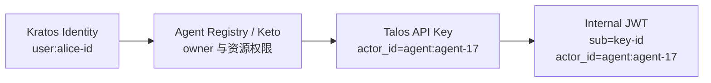
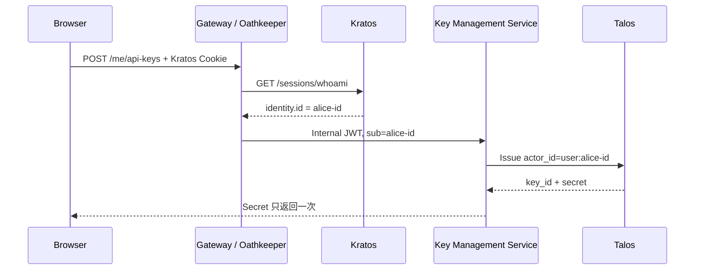
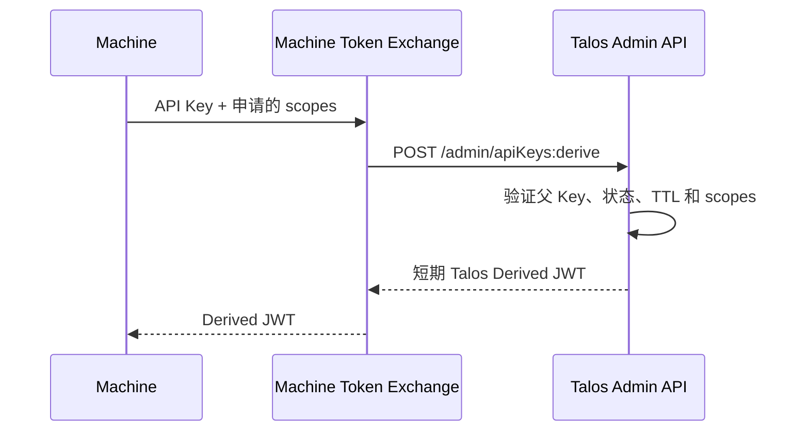
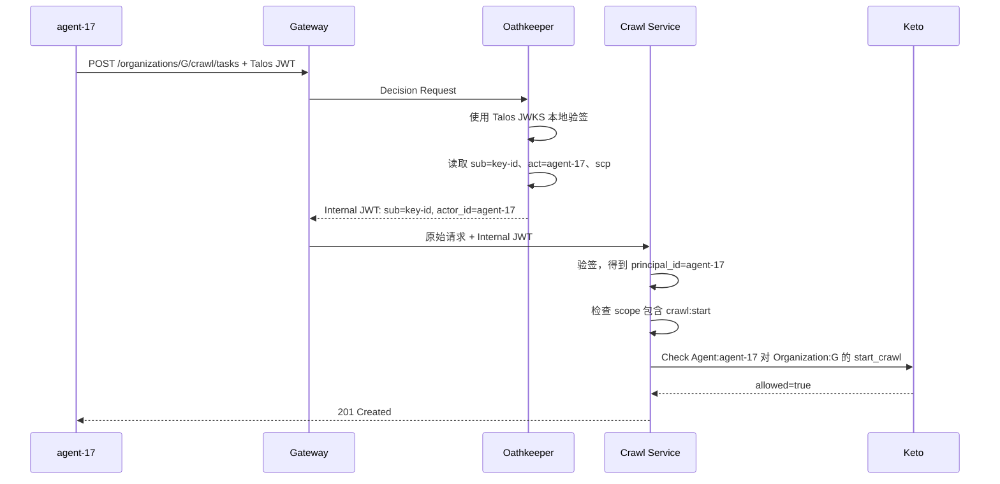

Talos 管理 API Key，以及由长期 Key 派生的短期 JWT 或 Macaroon。真正需要理解的不是“如何生成一段 Token”，而是下面三个问题：

```text
Token 代表谁？
如何从 Token 找到对应的用户或服务？
这个主体最终具有什么业务权限？
```

答案可以先概括为：

```text
Talos actor_id  → Token 代表的直接调用者
Talos scopes    → 这把凭证允许申请的能力上限
Kratos Identity → 人类用户
Keto Relation   → 用户、Agent、服务和资源之间的当前关系
Oathkeeper      → 验证入口凭证并生成统一的内部身份上下文
```

<!-- more -->

## 1. 先看最终数据链路

假设 Alice 创建了一个抓取 Agent，系统为这个 Agent 签发 Talos API Key：



默认情况下，Token 直接代表 Agent：

```text
Credential = key-id
Actor / Principal = agent:agent-17
```

Talos 证明 `agent:agent-17` 持有有效凭证。Keto 再判断这个 Agent 能否操作具体资源：

```text
Organization:G#crawl_agents@Agent:agent-17
```

Agent 是否属于 Alice 是另一条关系：

```text
Agent:agent-17#owner@User:alice-id
```

`owner` 用于管理和审计，不表示 Agent 自动继承 Alice 的全部权限。只有业务确实要求 Agent 代表用户时，才进一步构造 Subject 与 Actor，具体见后文的 On-Behalf-Of 模型。

因此完整关系不是简单的 `Token → User`，而是：

```text
Talos Token
→ actor_id
→ Agent / Service
→ Keto Resource Permission

需要查询所有者时：
Agent / Service
→ owner Relation
→ Kratos Identity
```

如果 API Key 本身就是 Alice 创建的个人 Key，可以直接把 `actor_id` 设置成 `user:<kratos-identity-id>`，此时才是直接的 `Token → User`。

## 2. Talos 如何把 Token 与主体关联

### 2.1 关联发生在签发时

签发 API Key 时，调用方必须提供 `actor_id`：

```http
POST /v2alpha1/admin/issuedApiKeys
Content-Type: application/json

{
  "name": "agent-17",
  "actor_id": "agent:agent-17",
  "scopes": ["crawl:start", "content:read"],
  "ttl": "720h",
  "metadata": {
    "organization_id": "G"
  }
}
```

Talos 保存：

```text
key_id
actor_id
scopes
metadata
status
expire_time
```

并把完整 Secret 返回一次。之后数据库只保存验证所需的信息，不再返回可恢复的明文 Secret。

`actor_id` 的值由业务系统定义，Talos 不会检查它是否真的存在于 Kratos、Agent Registry 或其他系统。因此要建立统一命名规则：

```text
user:<kratos-identity-id>
agent:<agent-id>
service:<service-id>
cli:<cli-installation-id>
```

前缀让下游能够区分人类用户和机器主体，也避免不同系统使用相同 UUID 时发生歧义。

### 2.2 API Key 本身不能直接解码

Talos 签发的长期 API Key 是不透明凭证：

```text
<prefix>_v1_<identifier>_<checksum>
```

它的 identifier 用于定位 `key_id`，但外部服务不能从 Key 中直接、安全地读取 `actor_id` 或 `scopes`。

API Key 不能在微服务中直接解码。需要立即确认 Key 当前状态时，可以调用 Talos Verify：

```http
POST /v2alpha1/admin/apiKeys:verify
Content-Type: application/json

{
  "credential": "<api-key>"
}
```

验证成功后，Talos 返回与 Key 绑定的信息：

```json
{
  "is_valid": true,
  "key_id": "key-8f3",
  "actor_id": "agent:agent-17",
  "scopes": ["crawl:start", "content:read"],
  "metadata": {
    "organization_id": "G"
  },
  "status": "KEY_STATUS_ACTIVE",
  "expire_time": "2026-10-02T10:00:00Z"
}
```

Verify 同时完成两件事：

```text
验证 Credential 是否有效
解析它对应的 actor_id、scopes 和 metadata
```

不过，对于持续的内部调用，官方推荐使用下一节的 Derive API 把长期 Key 换成短期 JWT，而不是让每个请求都调用 Verify。

### 2.3 派生 JWT 可以本地解析

Talos 可以用长期 API Key 派生短期 JWT：

```http
POST /v2alpha1/admin/apiKeys:derive
Content-Type: application/json

{
  "credential": "<api-key>",
  "algorithm": "TOKEN_ALGORITHM_JWT",
  "ttl": "15m",
  "scopes": ["content:read"]
}
```

请求中的 scopes 必须是父 Key scopes 的子集，Token 有效期也不能超过父 Key 的剩余时间。

派生 JWT 的核心 Claim 是：

```json
{
  "sub": "key-8f3",
  "act": "agent:agent-17",
  "scp": ["content:read"],
  "exp": 1788344100
}
```

字段含义：

| Claim | 含义 |
| --- | --- |
| `sub` | 父 API Key 的 ID，不是 Kratos 用户 ID |
| `act` | 父 Key 的 `actor_id` |
| `scp` | 当前 Token 的 scopes |
| `exp` | Token 过期时间 |

服务从 Talos 的 JWKS 接口获得公钥：

```http
GET /v2alpha1/derivedKeys/jwks.json
```

验证签名、Issuer、`nbf` 和 `exp` 后，即可读取 `act` 与 `scp`，不需要每次调用 Talos Verify。

长期 API Key 与派生 JWT 的区别是：

| Credential | 如何得到 Actor 和 scopes | 撤销效果 |
| --- | --- | --- |
| API Key | 调用 Talos Verify，从数据库记录解析 | 撤销后验证失败，受缓存窗口影响 |
| 派生 JWT | 使用 Talos JWKS 验签后读取 Claim | 父 Key 撤销不会立刻使已签发 JWT 失效 |

派生 JWT 必须保持较短 TTL，因为它的验证是无状态的，不会重新查询父 Key 是否已经撤销。

## 3. Talos 与 Kratos 如何关联

Talos 与 Kratos 没有自动同步关系。Kratos 管用户，Talos 管 API Key，关联由业务中的 Key Management Service 建立。

### 3.1 用户创建个人 API Key

Alice 登录后创建一把个人 API Key：



创建时的关键转换是：

```text
Kratos identity.id = alice-id
→ Talos actor_id = user:alice-id
```

以后使用这把 Key 时不需要再次查询 Kratos：

```text
API Key
→ Talos Derive
→ Derived JWT act=user:alice-id
→ Oathkeeper / 微服务使用 Talos JWKS 本地验签
```

Kratos 仍然是用户身份的事实来源。用户被禁用或删除时，身份生命周期处理程序需要撤销该用户对应的 Talos Keys。Talos 不会自动监听 Kratos Identity 的状态变化。

### 3.2 用户创建 Agent 或 CLI Key

如果 Key 发给 Alice 创建的 Agent，不应让 Agent 直接冒充 Alice：

```text
不推荐：actor_id=user:alice-id
推荐：  actor_id=agent:agent-17
```

创建 Agent 时同时保存两类数据：

```text
Talos
→ actor_id=agent:agent-17

Agent Registry / Keto
→ Agent:agent-17#owner@User:alice-id
```

这样可以区分：

```text
Alice 在浏览器中亲自操作
Alice 的 agent-17 自动执行操作
```

Agent Key 泄漏时可以只撤销 `agent-17`，审计日志也能保留真正的调用来源。

### 3.3 内部服务 Key

内部服务通常代表自己，而不是代表某个用户：

```text
actor_id=service:crawler-worker
scopes=[crawl:execute]
```

这类请求不应该强行查询“对应用户”，因为它本来就没有用户。Keto 可以直接为服务主体建模：

```text
Crawler:production#executors@Service:crawler-worker
```

如果服务正在代表某个用户执行异步任务，应同时保留 Subject 和 Actor：

```text
Subject = user:alice-id
Actor   = service:crawler-worker
```

用户触发的异步任务如何保存这两种身份，已经在 [定时任务与异步任务](./003_auth.md#7-定时任务与异步任务) 中说明。

## 4. Talos 与 Oathkeeper 如何交互

Talos 与 Oathkeeper 没有自动开启的专用集成，Oathkeeper 也没有内置 `talos` Authenticator。官方推荐的 Talos 数据路径是：

```text
长期 API Key
→ Gateway / Proxy 调用 Talos Derive API
→ 短期、权限收窄的 Talos JWT
→ 后端使用 Talos JWKS 本地验签
```

因此，Talos 与 Oathkeeper 的组合应当以派生 JWT 为主，不应让每次业务请求都经过 Adapter 调用 Talos Verify。

### 4.1 第一步：在入口交换短期 Token

机器先把长期 API Key 交给受保护的 Machine Token Exchange 接口：



Token Exchange 可以是 Gateway 插件、Auth Context Service 的一个接口，或者独立的小服务。它的职责只有：

```text
接收长期 API Key
调用 Talos Derive API
限制允许申请的 scopes 和 TTL
返回派生 Token
```

它不是每次业务请求都调用的 Verify Adapter。调用方在 JWT 有效期内重复使用派生 Token，长期 API Key 不再进入业务请求链路。

派生请求示例：

```http
POST /v2alpha1/admin/apiKeys:derive
Content-Type: application/json

{
  "credential": "<long-lived-api-key>",
  "algorithm": "TOKEN_ALGORITHM_JWT",
  "ttl": "15m",
  "scopes": ["crawl:start"]
}
```

Talos Admin API 没有内置认证，所以客户端不能直接访问该接口。Token Exchange 必须位于可信网络内，并使用 mTLS、Workload Identity 或 Service Mesh Policy 访问 Talos。

### 4.2 第二步：Oathkeeper 本地验证 Talos JWT

机器后续只携带 Derived JWT：

```text
Machine
→ Talos Derived JWT
→ Gateway
→ Oathkeeper jwt Authenticator
→ Talos JWKS 本地验签
```

Oathkeeper 配置 Talos JWKS、可信 Issuer 和允许的签名算法：

```yaml
authenticators:
  jwt:
    enabled: true
    config:
      jwks_urls:
        - http://talos:4420/v2alpha1/derivedKeys/jwks.json
      trusted_issuers:
        - https://talos.internal
      allowed_algorithms:
        - EdDSA
        - RS256
```

Oathkeeper 验证签名、Issuer、Audience、`nbf` 和 `exp`。验签过程只读取并缓存 JWKS，不访问 Talos 数据库。

Oathkeeper 的 Matcher、Authenticator、Authorizer 和 Mutator 流水线见 [Ory Oathkeeper](./009_ory_oathkeeper.md#4-请求流水线)。

### 4.3 第三步：是否重新签发 Internal JWT

有两种方式把身份交给微服务。

#### 直接传递 Talos JWT

```text
Talos Derived JWT
→ Oathkeeper 验签
→ 微服务继续验证 Talos JWT
```

微服务使用统一的 JWT Middleware，但需要信任两个 Issuer：

```text
Oathkeeper Issuer → 用户 Internal JWT
Talos Issuer      → 机器 Derived JWT
```

这最接近 Talos 官方流程，没有重复签名，但需要维护两组 JWKS 配置。

#### 重新签发统一 Internal JWT

```text
Talos Derived JWT
→ Oathkeeper 验签
→ id_token Mutator
→ Oathkeeper Internal JWT
```

微服务只需要信任 Oathkeeper 的 Issuer 和 JWKS。这不违背 Talos 的设计，因为 Oathkeeper 只进行本地验签和格式转换，没有在每次请求中查询 Talos 数据库。

但是必须注意一个字段限制：

```text
Talos JWT sub = 父 key_id
Talos JWT act = actor_id
```

Oathkeeper 的 JWT Authenticator 固定把上游 JWT 的 `sub` 作为 Authentication Session Subject；`id_token` Mutator 又固定把 Session Subject 写入新 JWT 的 `sub`。所以只靠标准配置，不能把 Talos 的 `act` 改写成新 JWT 的 `sub`。

可行的统一格式是保留 `sub=key_id`，把真正的机器主体放进 `actor_id`：

```json
{
  "iss": "https://identity.internal",
  "sub": "key-8f3",
  "actor_id": "agent:agent-17",
  "principal_type": "agent",
  "scope": ["crawl:start"],
  "auth_source": "talos",
  "aud": ["internal-api"],
  "exp": 1788343800
}
```

Oathkeeper Mutator 从已验证的 Talos Claims 中复制 `act` 和 `scp`：

```yaml
mutators:
  - handler: id_token
    config:
      claims: |
        {
          "actor_id": "{{ print .Extra.act }}",
          "principal_type": "agent",
          "scope": {{ .Extra.scp | toJson }},
          "auth_source": "talos"
        }
```

如果系统强制要求 `sub=agent:agent-17`，就需要自定义 Token Exchange/Issuer 重新签名，不能仅依赖 Oathkeeper 标准 `id_token` Mutator。

### 4.4 不透明 API Key 的兼容路径

旧 CLI、第三方 Webhook 等调用方可能无法先执行 Token Exchange。此时才使用兼容 Adapter：

```text
API Key
→ Talos Auth Adapter
→ Talos Verify
→ Oathkeeper bearer_token
→ Internal JWT
```

Adapter 将 Talos 的 `actor_id`、`scopes` 和 `metadata` 转换为 Oathkeeper 的 Subject 与 Extra。它适合低频兼容请求，不应成为高频内部调用的主路径。

最终选择是：

| 路径 | 定位 |
| --- | --- |
| API Key → Derive → JWT → 本地验签 | 官方推荐的主路径 |
| API Key → Adapter → Verify | 不支持 Token Exchange 的兼容路径 |

## 5. 内部服务如何查询用户和权限

业务服务收到 Internal JWT 后，需要按顺序回答三个问题。

### 5.1 第一个问题：实际调用者是谁

对于普通机器身份：

```json
{
  "iss": "https://identity.internal",
  "sub": "key-8f3",
  "actor_id": "agent:agent-17",
  "principal_type": "agent",
  "scope": ["crawl:start", "content:read"],
  "auth_source": "talos",
  "aud": ["crawler-service"],
  "exp": 1788343800
}
```

业务服务验证签名、Issuer、Audience 和有效期后，可以直接得到：

```text
Credential = key-8f3
Actor = agent:agent-17
Credential scopes = crawl:start, content:read
```

不需要拿 Internal JWT 再去查询 Talos。

微服务的统一认证中间件按照下面的规则得到业务 Principal：

```text
actor_id 存在 → principal_id = actor_id
actor_id 不存在 → principal_id = sub
```

因此：

```text
Kratos 用户 Token
sub=user:alice-id
→ principal_id=user:alice-id

Talos 机器 Token
sub=key-8f3, actor_id=agent:agent-17
→ principal_id=agent:agent-17
```

微服务仍然只实现一套 Internal JWT 验签和 Principal 构造逻辑。

### 5.2 第二个问题：它是否代表某个用户

先使用上一节的规则得到 `principal_id`。如果它是 `user:<id>`，可以直接得到对应的 Kratos Identity ID：

```text
principal_id=user:alice-id
→ Kratos identity.id=alice-id
```

如果 `principal_id` 是 Agent 或 Service，则根据业务需要查询关系：

```text
Agent:agent-17#owner@User:alice-id
```

可以从 Agent Registry 查询：

```http
GET /internal/agents/agent-17
```

或者通过 Keto 检查、展开相关 Relation。不要从 Talos `metadata.owner_id` 直接决定当前授权，因为 metadata 是签发时的快照，Agent 转移所有者后可能已经过期。

### 5.3 第三个问题：它拥有哪些权限

必须区分 Talos scope 和业务资源权限：

```text
Talos scope
→ 这把 Credential 最多可以申请哪些动作

Keto Permission
→ 当前 Subject 或 Actor 对具体资源是否有权限
```

例如 Agent 请求启动组织 G 的抓取任务：

```text
Scope Check
→ scope 是否包含 crawl:start？

Ownership Check
→ agent-17 是否仍属于 Alice？

Keto Check
→ Alice 是否拥有 Organization:G#start_crawl？

Policy Check
→ 当前风险、时间和任务状态是否允许？
```

最终结果是交集：

```text
Allow
= CredentialValid
  AND ScopeAllowed
  AND DelegationValid
  AND ResourcePermissionAllowed
  AND ContextPolicyAllowed
```

对应到组件：

| 判断 | 组件 |
| --- | --- |
| Key 或派生 Token 是否有效 | Talos / Oathkeeper |
| Token 直接代表哪个 Actor | Talos `actor_id` 或派生 JWT `act` |
| Agent 或服务是否属于某个用户 | Agent Registry / Keto |
| 用户或机器能否操作具体资源 | Keto |
| 当前动态条件是否允许 | 业务服务 / OPA |

Keto 的 Relation 和 Permission 计算见 [Ory Keto](./008_ory_keto.md#1-先建立-keto-的核心模型)。

## 6. 如何构造 Subject 与 Actor

### 6.1 机器只代表自己

```json
{
  "sub": "key-8f3",
  "actor_id": "service:crawler-worker",
  "principal_type": "service",
  "scope": ["crawl:execute"],
  "auth_source": "talos"
}
```

认证中间件将 `actor_id` 规范化为 `principal_id=service:crawler-worker`，Keto 使用 `Service:crawler-worker` 检查权限，不查询用户。

### 6.2 个人 API Key 代表用户本人

```json
{
  "sub": "key-user-01",
  "actor_id": "user:alice-id",
  "principal_type": "user",
  "scope": ["content:read"],
  "auth_source": "talos"
}
```

认证中间件得到 `principal_id=user:alice-id`。它表示 Alice 使用个人 API Key，而不是 Kratos Session，审计日志应同时记录 `auth_source=talos` 和 `sub=key-user-01`。

### 6.3 Agent 以独立主体执行任务

```json
{
  "sub": "key-agent-17",
  "actor_id": "agent:agent-17",
  "principal_type": "agent",
  "scope": ["crawl:start"],
  "auth_source": "talos"
}
```

推荐直接给 Agent 建立 Keto 权限：

```text
Organization:G#crawl_agents@Agent:agent-17
```

同时单独保存所有权：

```text
Agent:agent-17#owner@User:alice-id
```

所有权用于管理和审计，不表示 Agent 自动继承 Alice 的全部权限。业务鉴权直接检查 `Agent:agent-17` 对资源的 Permission，不需要每次先把 Agent 转换成 Alice。

### 6.4 Agent 确实需要代表用户

少数场景必须表达“agent-17 正在代表 Alice”。此时需要同时保存：

```text
Subject = user:alice-id
Actor   = agent:agent-17
```

标准 Oathkeeper `id_token` Mutator不能把 Talos 的 `act` 自动改写为新 Token 的 `sub`。可以选择：

```text
方案一：Internal JWT 保留 sub=key_id、actor_id=agent:agent-17，
       业务服务查询 Keto 中的委托关系

方案二：由自定义 Token Exchange/Issuer 验证委托关系后，
       签发 sub=user:alice-id、act.sub=agent:agent-17
```

第二种格式更适合严格的 On-Behalf-Of 调用，但需要自定义签发组件，不能声称是 Talos 或 Oathkeeper 的默认能力。

## 7. 一个完整请求

下面执行一次 `agent-17` 以独立机器主体启动组织 G 的抓取任务。流程分为 Token Exchange 和业务请求两个阶段。

### 7.1 使用长期 Key 换取短期 Token

```text
agent-17
→ Machine Token Exchange：提交长期 API Key
→ Talos /apiKeys:derive：签发 15 分钟 Derived JWT
→ agent-17：保存到内存并在有效期内复用
```

长期 Key 不进入后续业务请求，也不传递给微服务。

### 7.2 使用短期 Token 调用业务接口



业务请求阶段没有调用 Talos数据库。Oathkeeper 和业务服务都通过缓存的 Talos/Oathkeeper JWKS 完成本地验签。

失败边界如下：

| 失败 | 结果 |
| --- | --- |
| Talos JWT 签名错误或过期 | `401 Unauthorized` |
| scope 不包含 `crawl:start` | `403 Forbidden` |
| Agent 没有组织 G 的权限 | `403 Forbidden` |
| Oathkeeper 或 Keto 不可用 | 失败关闭，通常返回 `503 Service Unavailable` |

父 API Key 被撤销后，已经签发的 Derived JWT 仍然可能有效到 `exp`，因此机器 Token 应使用短 TTL。需要更快失效时，只能缩短 TTL、轮换签名密钥，或在 Gateway 维护额外拒绝列表。

## 8. 四种 Credential

Talos 管理四种 Credential：

| 类型 | 适用场景 | 如何验证 |
| --- | --- | --- |
| Issued API Key | Talos 负责生成、轮换和撤销 | Talos Verify |
| Imported API Key | 接管已有 Key | Talos Verify |
| Derived JWT | 高频内部调用、边缘本地验证 | Talos JWKS |
| Derived Macaroon | 多级委托并继续收窄能力 | Talos 或持有共享验证能力的组件 |

长期 API Key 适合保存于 Secret Manager，并用于换取短期 Token；不应该在每一跳微服务调用中不断透传长期 Secret。

## 9. API 与安全边界

Talos 提供两个安全级别不同的接口面：

```text
Admin API  → 签发、验证、查询、轮换、撤销和派生
Public API → Key 持有者证明持有后自行撤销
```

常用接口：

| 接口 | 作用 |
| --- | --- |
| `POST /v2alpha1/admin/issuedApiKeys` | 签发 API Key |
| `GET /v2alpha1/admin/issuedApiKeys` | 按 `actor_id` 等条件查询 Keys |
| `POST /v2alpha1/admin/apiKeys:verify` | 验证 API Key 或派生 Token |
| `POST /v2alpha1/admin/apiKeys:derive` | 派生 JWT 或 Macaroon |
| `POST .../{key_id}:rotate` | 轮换 Key |
| `POST .../{key_id}:revoke` | 撤销 Key |
| `POST /v2alpha1/apiKeys:selfRevoke` | 持有者自行撤销 |
| `GET /v2alpha1/derivedKeys/jwks.json` | 发布派生 JWT 公钥 |

Admin API 没有内置认证，不能暴露到公网。Machine Token Exchange、Key Management Service 以及可选的兼容 Adapter 必须通过内网、mTLS、Service Mesh Policy 或认证代理访问。

按用户查询 Key 时，可以使用签发时写入的 `actor_id`：

```http
GET /v2alpha1/admin/issuedApiKeys?filter=actor_id%3D%22user%3Aalice-id%22
```

这只能找到直接绑定 Alice 的个人 Keys。`actor_id=agent:agent-17` 的 Key 必须先从 Agent Registry 查询 Alice 拥有哪些 Agents，再按 Agent actor_id 查询。

## 10. 部署边界

Talos OSS 使用单节点 SQLite，适合学习、原型和低流量部署；商业版本提供外部数据库、多节点、分布式缓存等能力。

生产拓扑应分开接口面：

```text
Key Management / Machine Token Exchange
        │ mTLS / NetworkPolicy
        ▼
Talos Admin API
        │
        └── Credential Store

Public Client
        │
        ▼
Talos Public API
        └── 只开放 selfRevoke 和按需开放 JWKS
```

部署时需要保护：

```text
API Key HMAC Secret
JWT 签名私钥
Admin API 网络边界
数据库与备份
验证缓存的撤销窗口
```

所有实例必须使用一致的 HMAC 和 JWKS。轮换 JWT 签名密钥时，需要在最长 Token TTL 与 JWKS 缓存窗口内保留旧公钥。

## 11. 总结

Talos 的身份关联规则很简单：

```text
签发时写入 actor_id
直接验证 Key 时取回 actor_id、scopes 和 metadata
派生 JWT 中使用 act 和 scp 携带这些信息
```

但 `actor_id` 不一定是用户：

```text
个人 API Key → actor_id 可以直接引用 Kratos Identity
Agent Key    → actor_id 是 Agent，再通过 Registry/Keto 找 owner
Service Key  → actor_id 是 Service，可能根本没有对应用户
```

Talos 官方推荐的内部调用路径是：

```text
长期 API Key
→ 受保护的 Token Exchange
→ Talos Derived JWT
→ JWKS 本地验签
→ 内部服务
```

当前架构如果还需要统一内部 Issuer，可以让 Oathkeeper 验证 Talos JWT 后重新签发 Internal JWT。由于标准 Oathkeeper 会保留 Talos 的 `sub=key_id`，需要同时复制 `act` 为 `actor_id`；微服务再统一计算 `principal_id = actor_id ?? sub`。

Verify Adapter 只用于无法执行 Token Exchange 的旧客户端和第三方 Webhook，不是高频内部调用的主路径。

权限也不能只看 Talos scopes。Scopes 是凭证能力上限，Keto 才计算主体对具体资源的当前权限。完整结果始终是 Credential、Scope、委托关系、资源权限和动态策略的交集。

## 参考资料

- [Ory Talos](https://www.ory.com/docs/talos)
- [Issue and verify API keys](https://www.ory.com/docs/talos/integrate/issue-and-verify)
- [Derive tokens](https://www.ory.com/docs/talos/integrate/derive-tokens)
- [Talos credential types](https://www.ory.com/docs/talos/concepts/credential-types)
- [Talos token format](https://www.ory.com/docs/talos/reference/token-format)
- [Talos security hardening](https://www.ory.com/docs/talos/operate/security-hardening)
- [Ory Talos GitHub](https://github.com/ory/talos)
- [Oathkeeper JWT Authenticator source](https://github.com/ory/oathkeeper/blob/master/pipeline/authn/authenticator_jwt.go)
- [Oathkeeper ID Token Mutator source](https://github.com/ory/oathkeeper/blob/master/pipeline/mutate/mutator_id_token.go)
- [Ory Oathkeeper](./009_ory_oathkeeper.md)
- [Ory Keto](./008_ory_keto.md)
