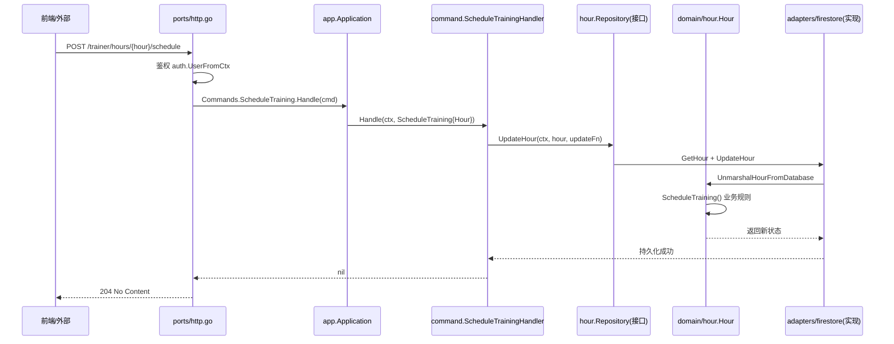

# 001 项目概览与架构演进路线图

> 本系列用两个真实开源项目作为讲解载体，按「从简单到复杂」的演进路径，逐章拆解 Go 微服务设计的核心技术实现。

## 一、理论抽象

### 1.1 DDD 的两个层次

| 层次                          | 适用场景                   | 核心要素                                    |
| ----------------------------- | -------------------------- | ------------------------------------------- |
| **DDD Lite（轻量级）**        | 单一业务子域、需求相对简单 | 充血的领域模型 + 仓储模式 + 工厂            |
| **完整 DDD（Strategic DDD）** | 多子域协作、跨团队边界     | 限界上下文 + 上下文映射 + 领域事件 + 聚合根 |

本系列 001-009 聚焦 DDD Lite 的渐进式落地，010-015 进阶到完整 DDD 与微服务通信。

### 1.2 两个教材

| 项目                               | 角色           | 架构成熟度                      | 演进方式                 |
| ---------------------------------- | -------------- | ------------------------------- | ------------------------ |
| **wild-workouts-go-ddd-example**   | 渐进式重构教材 | 从「太现代」单体重构为 DDD+CQRS | 通过 14 篇文章逐版本演进 |
| **go-food-delivery-microservices** | 微服务工程模板 | 完整的 VSA + CQRS + EDA + ES    | 生产级模板，开箱即用     |

### 1.3 演进路线

| 版本 | 知识点                      | 本系列章节 |
| ---- | --------------------------- | ---------- |
| v2.1 | DDD Lite 入门               | 002        |
| v2.2 | Repository 模式             | 003        |
| v2.3 | 数据库集成测试 4 原则       | 004        |
| v2.4 | Clean Architecture 重构     | 005        |
| v2.5 | 基础 CQRS                   | 006        |
| —    | 三剑合璧                    | 007        |
| v2.6 | 微服务测试架构              | 008        |
| —    | Repository Secure by Design | 009        |
| —    | Vertical Slice Architecture | 010        |
| —    | 依赖注入 uber-fx            | 011        |
| —    | CQRS + Mediator 模式        | 012        |
| —    | Event Driven Architecture   | 013        |
| —    | Event Sourcing              | 014        |
| —    | Outbox Pattern              | 015        |

### 1.4 wild-workouts 分层目录约定

每个服务遵循 `ports / app / domain / adapters / service` 五段式结构：

| 目录                         | 职责                     | 对应 Clean Architecture 层 |
| ---------------------------- | ------------------------ | -------------------------- |
| `ports/`                     | HTTP/gRPC 入口适配器     | Driving Adapter            |
| `app/command/`、`app/query/` | 用例编排                 | Application Layer          |
| `domain/`                    | 充血领域模型 + 仓储接口  | Domain Layer（核心）       |
| `adapters/`                  | 仓储实现、外部服务客户端 | Driven Adapter             |
| `service/`                   | 依赖装配                 | Composition Root           |

### 1.5 go-food-delivery 三个微服务

| 服务                  | 写库         | 读库                  | 架构模式              |
| --------------------- | ------------ | --------------------- | --------------------- |
| `catalogwriteservice` | Postgres     | —                     | DDD + CRUD            |
| `catalogreadservice`  | —            | MongoDB/Elasticsearch | Data-Centric CRUD     |
| `orderservice`        | EventStoreDB | MongoDB/Elasticsearch | Event Sourcing + CQRS |

---

## 二、时序图

wild-workouts 一次「预约训练」请求的完整时序：

核心设计：**HTTP Port 只做协议适配，业务逻辑下沉到 Domain，Repository 接口定义在 Domain 内部，实现在 Adapters**。

---

## 三、代码实现

### 1. wild-workouts 入口与装配

- [main.go](file:///d:/Blog/backup/tmp/ddd/wild-workouts-go-ddd-example/internal/trainer/main.go) — trainer 服务启动入口，根据 `SERVER_TO_RUN` 环境变量决定起 HTTP 还是 gRPC
- [service/application.go](file:///d:/Blog/backup/tmp/ddd/wild-workouts-go-ddd-example/internal/trainer/service/application.go) — 手写依赖注入的组合根，构造 Repository、Factory、Command/Query Handler 并装入 `app.Application`
- [app/app.go](file:///d:/Blog/backup/tmp/ddd/wild-workouts-go-ddd-example/internal/trainer/app/app.go) — 应用层骨架，只有 `Commands` 和 `Queries` 两个字段，是 CQRS 的门面

### 2. 分层关键位置

- [ports/http.go](file:///d:/Blog/backup/tmp/ddd/wild-workouts-go-ddd-example/internal/trainer/ports/http.go) — HTTP 适配器，`MakeHourAvailable` 展示「鉴权 → 解码 → 调用 Command」三段式
- [app/command/schedule_training.go](file:///d:/Blog/backup/tmp/ddd/wild-workouts-go-ddd-example/internal/trainer/app/command/schedule_training.go) — 典型 Command Handler，通过 `Repository.UpdateHour` 的回调把领域逻辑串起来
- [domain/hour/repository.go](file:///d:/Blog/backup/tmp/ddd/wild-workouts-go-ddd-example/internal/trainer/domain/hour/repository.go) — 仓储接口只有两个方法，`UpdateHour` 接受 `updateFn` 回调
- [domain/hour/hour.go](file:///d:/Blog/backup/tmp/ddd/wild-workouts-go-ddd-example/internal/trainer/domain/hour/hour.go) — 充血领域模型，含 `Factory` + `UnmarshalHourFromDatabase` 双构造器

### 3. go-food-delivery 入口与装配

- [orderservice/cmd/app/main.go](file:///d:/Blog/backup/tmp/ddd/go-food-delivery-microservices/internal/services/orderservice/cmd/app/main.go) — 使用 cobra CLI 启动，调用 `app.NewApp().Run()`
- `orderservice/internal/orders/features/creating_order/v1/` — 一个完整的垂直切片：endpoint + command + handler + dto + events 同目录共存

### 4. 通用的 CQRS 装饰器

- [common/decorator/command.go](file:///d:/Blog/backup/tmp/ddd/wild-workouts-go-ddd-example/internal/common/decorator/command.go) — wild-workouts 的装饰器工厂 `ApplyCommandDecorators`，用泛型把日志、metrics 横切关注点包到任意 Handler 上
